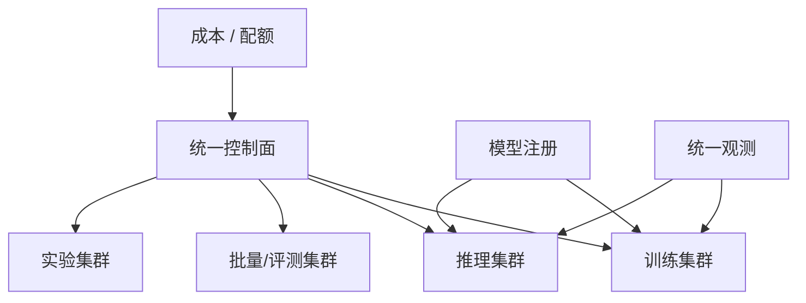

# 第 25 章：多集群与混部

## 本章回答的问题

- 为什么 AI Factory 往往需要多集群，而不是一个万能集群？
- 训练集群、推理集群、离线任务和在线服务如何混部或隔离？
- 多集群资源池化、quota federation、跨地域调度和成本优化有哪些取舍？

## 一个真实场景

公司早期只有一个 GPU Kubernetes 集群，在线推理、微调、评测和批量推理都跑在里面。高峰期批量任务占满 GPU，在线推理扩容失败；训练任务拉取大镜像影响控制面；一次驱动升级同时影响所有业务。后来平台拆分为在线推理集群、训练集群、实验集群和验收集群，并通过统一模型注册、镜像仓库、监控和成本系统连接。

多集群不是为了复杂而复杂，而是为了隔离故障域、SLA、变更节奏和成本模型。

## 核心概念

多集群管理是用多个 Kubernetes、Slurm 或裸金属资源池承载不同 workload。混部是把不同类型任务放在同一资源池共享，提高利用率。隔离是把任务拆到不同资源池，降低互相影响。

AI Factory 的多集群设计要同时看四个维度：业务 SLA、硬件拓扑、软件栈版本和组织边界。

## 系统架构



统一控制面不一定意味着统一调度器。它可以统一身份、配额、模型、镜像、观测和成本，而让不同集群使用不同调度系统。

## 25.1 多集群管理

多集群管理包括集群生命周期、版本、资源库存、权限、网络、观测、策略和灾备。AI 集群差异大，不同 GPU 型号、网络、驱动和调度器组合都可能存在。

平台需要清楚每个集群的能力标签：GPU 型号、网络类型、是否支持 RDMA、是否适合训练、是否适合低延迟推理、软件栈版本和当前健康状态。

## 25.2 训练集群与推理集群

训练集群偏向大规模、长时间、强通信、批式调度和 checkpoint。推理集群偏向低延迟、高可用、弹性扩缩容、灰度发布和 token 计量。二者对网络、调度、升级和 SLO 的要求不同。

把训练和推理完全混在一起，会让离线任务影响在线 SLA。完全隔离则可能降低利用率。常见做法是核心在线推理独立，批量推理和低优先级训练可在共享池中混部。

## 25.3 离线与在线混部

混部可以提高 GPU 利用率。例如白天在线推理高峰，夜间运行批量推理或评测；或者在在线服务保留容量之外，允许低优先级任务使用空闲 GPU。

混部的前提是可抢占、可限流、可观测和可恢复。在线服务必须有资源保障，离线任务必须能在被抢占后恢复或重跑。没有这些机制的混部会放大故障。

## 25.4 资源池化

资源池化把多个集群或多个资源域抽象成可分配资源池。它能提高利用率，也能隐藏底层差异。但 GPU 资源不像通用 CPU 那样容易池化：型号、显存、拓扑、驱动、网络和租户隔离都会限制可替代性。

资源池化需要能力描述。调度系统必须知道任务需要什么，而不是只知道“需要 GPU”。

## 25.5 quota federation

Quota federation 在多个集群之间管理租户配额。一个团队可能在训练集群、推理集群和实验集群都有资源需求。平台需要统一展示已用、可用、借用和欠账。

跨集群 quota 的难点是资源不可完全等价。A 集群的 H100 和 B 集群的 L40S 不能简单相加。Quota federation 应按资源类型和能力维度管理。

## 25.6 跨地域调度

跨地域调度用于多地域容灾、就近访问、成本优化或数据合规。推理服务可能需要靠近用户，训练任务可能靠近数据和 GPU 资源。跨地域调度会引入网络延迟、数据复制、镜像同步和合规约束。

训练任务通常不适合跨高延迟地域做紧耦合通信，但可以跨地域做数据准备、评测和异步任务。推理服务可以多地域部署，通过网关路由流量。

## 25.7 成本和利用率优化

多集群带来成本优化空间：不同 GPU 承载不同模型，在线保留容量之外运行低优先级任务，实验集群使用较低成本资源，批量任务避开高峰。但成本优化不能破坏 SLA 和可恢复性。

利用率指标要分层看。单个集群利用率高不代表全局最优；某些资源池高利用可能牺牲了可靠性和升级窗口。

## 工程实现

集群能力标签示例：

```yaml
cluster:
  name: inference-prod-a
  workload: online-inference
  gpu_types: [h100]
  network: rdma
  scheduler: kubernetes
  sla: production
  software_stack: gpu-baseline-2026-06
```

任务调度应基于这些能力标签做匹配。

## 常见故障

- 所有 workload 混在一个集群，升级和故障影响面过大。
- 集群能力标签缺失，任务被调度到不合适资源。
- 跨集群 quota 只按 GPU 数量统计，忽略型号差异。
- 混部任务不可抢占，在线服务扩容失败。
- 多集群监控不统一，故障定位跨系统断裂。

## 性能指标

- 各集群 GPU 利用率、空闲率、碎片率。
- 在线服务 SLA、离线任务完成时间。
- 跨集群调度成功率、迁移次数、失败原因。
- Quota 使用率、借用量、抢占次数。
- 单位 token 成本、单位训练任务成本。

## 设计取舍

单集群简单但故障域大，多集群隔离强但治理复杂。混部提高利用率但增加抢占和排障复杂度。跨地域提高可用性但增加数据和网络成本。AI Factory 的多集群设计应从 workload 分类和 SLA 开始，而不是从集群数量开始。

## 小结

- 多集群用于隔离 workload、故障域、软件栈和变更节奏。
- 训练集群和推理集群有不同的调度和 SLA 要求。
- 混部必须建立在可抢占、可恢复和可观测基础上。
- 资源池化和 quota federation 需要按能力维度管理 GPU。

## 延伸阅读

- TODO: Kubernetes 多集群管理资料
- TODO: Kueue cohort / quota 资料
- TODO: AI 集群混部工程案例
