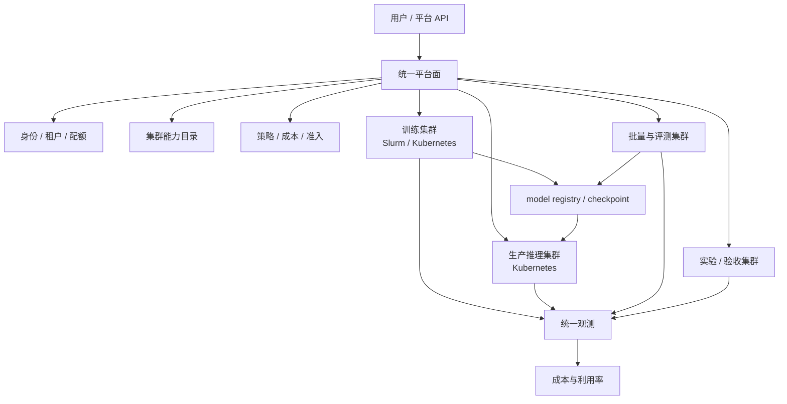

# 第 25 章：多集群与混部

## 本章回答的问题

- 为什么 AI Factory 往往需要多集群，而不是一个万能集群？
- 训练集群、推理集群、离线任务和在线服务如何混部或隔离？
- 多集群资源池化、quota federation、跨地域调度和成本优化有哪些取舍？

## 一个真实场景

一家公司早期只有一个 GPU Kubernetes 集群。在线推理、批量推理、微调、评测、数据处理和少量训练都跑在里面。资源利用率看起来不错，平台入口也简单：所有团队提交到同一个集群，统一镜像仓库，统一监控，统一 GPU 资源池。问题在业务增长后出现。一次批量推理任务拉起大量副本，占满了原本用于在线推理扩容的 GPU；一个训练任务拉取超大镜像，造成节点磁盘和镜像缓存抖动；驱动升级时，平台无法只影响实验 workload，因为生产推理和调试任务共享同一套节点。

平台团队最初尝试用 priority、quota 和 namespace 解决所有问题，但很快发现调度策略无法替代故障域隔离。在线推理关心低延迟、灰度、快速回滚和稳定 token streaming；训练关心多节点 gang scheduling、长时间运行、checkpoint 和高速网络；评测关心吞吐和可重复；实验环境则需要更快的软件栈变更。把这些目标压进同一个集群，会让任何变更都变成全局风险。

后来平台拆分为生产推理集群、训练集群、批量与评测集群、实验集群和验收集群。拆分后，并不是每个系统都独立建设一遍，而是统一身份、镜像、模型注册、数据权限、观测、成本和配额视图。调度器可以不同，节点规格可以不同，升级节奏可以不同，但模型产物和成本事实必须统一。这样一来，训练任务可以在训练集群稳定运行，模型通过 registry 进入推理集群，评测结果和成本仍能在同一平台里关联。

这个场景说明，多集群不是为了“显得架构高级”，而是为了管理 AI workload 的差异。AI Factory 中的 GPU 不只是算力数量，还是 SLA、网络拓扑、软件栈、故障域和成本模型的组合。单集群能降低早期复杂度，但当 workload、团队和硬件规模增长后，单集群往往把所有差异折叠成调度冲突。多集群的核心问题不是“建几个集群”，而是哪些边界必须隔离，哪些能力必须统一。

## 核心概念

多集群管理（multi-cluster management）是用多个 Kubernetes、Slurm 或裸金属资源池承载不同 workload，并在上层提供统一治理。它不等于把一个集群复制多份，也不等于一定使用同一个控制面。真正要管理的是集群能力、资源库存、身份权限、策略、观测、成本、版本和故障域。一个 AI Factory 可以同时有 Kubernetes 推理集群、Slurm 训练集群、Kubernetes 批处理集群和裸金属验收池，只要上层事实源统一。

混部（colocation）是把不同类型任务放在同一资源池中共享资源，以提高利用率。隔离（isolation）是把 workload 拆到不同资源池中，降低互相影响。二者不是绝对对立。生产在线推理可能需要强隔离，低优先级批量推理可以使用在线保留容量之外的空闲 GPU，实验任务可以在非生产集群混部。关键是明确哪些任务可抢占、哪些任务可降级、哪些任务必须保留容量。

资源池化（resource pooling）是把多个资源域抽象成可分配资源池，但 GPU 资源的池化比 CPU 复杂。GPU 型号、显存容量、NVLink/NVSwitch、RDMA、驱动、CUDA、MIG、节点拓扑和租户隔离都会影响可替代性。所谓“全局 GPU 池”如果只统计 GPU 数量，就会误导调度和容量规划。更准确的做法是按能力标签和服务等级管理资源池。

Quota federation 是跨集群的配额联邦。一个团队可能同时使用训练、推理和评测资源，平台要能展示总配额、已用量、借用量、欠账和优先级。它解决的是跨资源域的公平性和预算控制，而不是把所有资源简单相加。跨地域调度则进一步引入数据位置、网络延迟、合规和容灾约束。多集群设计的本质，是在统一治理和差异化调度之间找到边界。

## 系统架构

AI Factory 的多集群架构通常分为统一平台面和多个执行集群。统一平台面负责身份、租户、配额、模型注册、镜像、观测、成本、策略和用户入口；执行集群负责实际运行 workload。执行集群可以按业务和技术边界拆分：在线推理集群强调 SLA 和弹性，训练集群强调 gang scheduling 和拓扑，批量集群强调吞吐，实验集群强调快速迭代，验收集群强调硬件和软件基线验证。

统一控制面不一定意味着统一调度器。一个常见误区是认为多集群平台必须把所有资源交给一个全局 scheduler。事实上，全局 scheduler 很难完整理解每个集群的本地约束，尤其是 Slurm 的 HPC 语义、Kubernetes 的服务化控制器、不同 GPU 型号和不同网络拓扑。更稳妥的架构是全局层做能力匹配、配额判断、入口路由和策略下发，本地集群调度器负责最终放置。

架构中需要清晰的数据流。训练集群产出的 checkpoint 进入模型注册和对象存储，评测集群读取模型和数据集生成报告，推理集群加载通过准入的模型版本，平台观测系统汇聚 token、延迟、GPU、NCCL、网络和存储指标，成本系统把资源消耗映射到租户和模型。若只有集群层面的调度，没有模型和成本层面的贯通，多集群会变成多个孤岛。

还要设计控制路径和故障路径。控制路径包括创建集群、注册能力、分配 quota、提交任务、路由到集群、同步状态和回收资源。故障路径包括集群不可用、API server 抖动、Slurm 控制面异常、跨集群网络中断、镜像同步失败和模型产物不可达。多集群架构的成熟度，取决于这些异常是否被显式建模，而不是正常路径画得多整齐。



## 25.1 多集群管理

多集群管理首先是集群能力管理。每个集群都应有结构化能力描述：GPU 型号、每节点 GPU 数、显存、网络类型、是否支持 RDMA、是否适合 distributed training、是否支持 MIG、调度系统、软件栈基线、存储访问方式、地域、故障域、SLA 等级和当前健康状态。没有这些信息，平台无法判断一个任务应该进入哪个集群，只能依赖人工经验。

其次是生命周期管理。AI 集群不是创建后长期不变的资源池。驱动、CUDA、NCCL、Container Runtime、GPU Operator、内核、OFED、Kubernetes、Slurm 和固件都会升级。多集群的价值之一，是允许不同集群有不同变更节奏：实验集群先试新版本，验收集群做准入，生产推理集群延迟升级，训练集群在大作业窗口之间变更。若所有 workload 在同一个集群，任何升级都要协调所有团队。

第三是统一策略管理。身份、租户、命名规范、镜像准入、网络访问、数据权限、日志保留、成本标签和安全基线不应在每个集群单独定义。否则集群越多，策略漂移越严重。平台应把策略作为上层对象下发到不同集群，并通过审计确认生效。多集群不是多套治理，而是多执行域共享一套治理规则。

最后是状态和事件同步。平台需要知道每个集群的容量、可用资源、排队、故障、升级窗口和成本状态。同步不能只做定时库存，还要处理事件：节点 drain、GPU 故障、控制面异常、quota 变化、任务失败和模型发布。多集群管理的目标，是让用户看到统一平台，而不是让用户自己判断哪个集群还能用、哪个集群适合当前任务。

还要定义集群准入和退出条件。新集群接入前，应完成硬件验收、软件基线检查、网络和存储测试、镜像拉取测试、调度冒烟和观测接入；老集群下线前，要迁移模型、任务、日志和成本记录。没有生命周期门禁，多集群会逐渐积累不可解释的历史差异。

## 25.2 训练集群与推理集群

训练集群和推理集群的差异来自 workload 目标。训练任务通常是批式、长时间、多节点、强通信、对 checkpoint 和数据读取敏感。它需要 gang scheduling、拓扑感知、稳定网络、准入测试、故障恢复和作业队列。推理任务通常是在线服务，关心 TTFT、TPOT、availability、弹性扩缩容、模型灰度、流量治理和 token 计量。二者都消耗 GPU，但控制逻辑完全不同。

如果训练和推理完全混在一起，离线任务可能影响在线 SLA。训练作业的镜像拉取、checkpoint 写入、NCCL 通信和节点独占会给共享网络、存储和节点带来压力。在线推理在高峰期需要快速扩容，若 GPU 被长训练占用，即使 quota 理论上公平，用户体验也会下降。生产推理通常需要保留容量和严格变更窗口，这是训练队列难以自然满足的。

完全隔离也有代价。推理集群需要为高峰保留容量，低峰时 GPU 可能空闲；训练集群如果只承载大作业，碎片和等待也会存在。常见做法是分层隔离：核心生产推理独立，关键训练独立；批量推理、评测、低优先级微调和实验任务可以进入共享池；某些推理保留容量之外的空闲 GPU 可以开放给可抢占任务。隔离和共享应按风险等级设计。

训练和推理还要在模型生命周期上连接。训练集群产出的 checkpoint 必须经过评测、转换、压缩、准入和注册，才能进入推理集群。推理集群的线上指标和反馈又会影响下一轮训练或后训练。若训练和推理只是集群隔离，却没有模型和指标闭环，AI Factory 仍然无法形成生产系统。分离执行域，统一生命周期，是更合理的边界。

## 25.3 离线与在线混部

离线与在线混部的目的，是利用在线服务保留容量之外的空闲 GPU，提高整体利用率。在线推理往往按峰值或 SLA 预留容量，但实际流量有波峰波谷；批量推理、评测、数据处理和低优先级微调可以在低峰时运行。混部做得好，可以降低 cost per token 和闲置成本；做得不好，会让离线任务挤压在线扩容，造成延迟抖动和可用性下降。

混部的前提是资源保障和抢占机制。在线服务必须有明确的 reserved capacity、优先级和扩容通道；离线任务必须能被暂停、抢占、降级或重跑。不能抢占的长任务不适合放入在线共享池。可抢占也不只是调度器动作，还包括应用层恢复能力：checkpoint 是否足够频繁，批量任务是否幂等，任务失败是否能重试，部分结果是否能合并。

混部还需要隔离共享依赖。即使 GPU 可抢占，镜像仓库、对象存储、并行文件系统、网络、日志系统和控制面也可能被离线任务打满。很多混部事故不是 GPU 调度失败，而是批量任务冲击了在线推理依赖的共享存储或网络。工程上应为在线服务设置限流、带宽隔离、镜像预热、存储 QoS 和独立告警，不能只依赖 Pod priority 或队列优先级。

观测是混部能否长期运行的关键。平台要能看到在线延迟与离线任务之间的相关性：哪些任务在同一节点、同一 rack、同一存储路径或同一镜像仓库产生竞争。指标包括在线 p95/p99 latency、TTFT、TPOT、GPU 空闲容量、抢占次数、离线重试成本、共享依赖负载和扩容失败原因。只有能解释干扰来源，混部才不是赌博。

## 25.4 资源池化

资源池化的直觉很有吸引力：把所有 GPU 放进一个大池子，任务按需申请，平台自动分配。现实中，AI GPU 资源的可替代性很弱。训练任务可能要求同型号 GPU、同一网络域、同一 NCCL baseline 和连续节点；推理任务可能要求特定显存、模型权重缓存、MIG 配置或低延迟网络；评测任务可能更看重吞吐和成本。把这些资源只抽象成“GPU 数量”，会造成错误调度。

更可行的资源池化是能力池化。平台用标签和资源类型描述能力，例如 `gpu=h100`、`network=rdma`、`topology=single-rail`、`workload=online-inference`、`baseline=cuda-12.x`、`sla=production`。任务提交时声明需求和偏好，平台匹配合适的资源池。本质上，这是把资源池变成带约束的能力目录，而不是一个无差别库存。

资源池化还要处理碎片。多节点训练需要整组节点，在线推理可能只需要少量 GPU 或 MIG 实例，批量任务可以接受零散资源。若调度只追求瞬时利用率，可能把连续节点打散，导致大训练长期无法启动。平台要在小任务填充和大任务保留之间做平衡，例如通过 reservation、backfill、队列策略和拓扑约束管理碎片。

资源池化的收益来自透明和可控，而不是隐藏所有差异。用户不一定要知道每台服务器，但需要知道资源能力、等待原因和成本等级。平台也不应承诺不存在的等价性。一个成熟的 AI Factory 会让资源池既有抽象，又保留足够的硬件和拓扑语义。这样既能降低用户心智负担，也不会牺牲训练和推理的确定性。

资源池还要支持保留和释放。生产推理需要保留容量，大训练需要预约连续节点，实验任务可以使用剩余资源。若资源池只做即时分配，就无法表达未来窗口和容量承诺。Reservation、quota、backfill 和抢占规则共同决定资源池是否真正可运营。

## 25.5 quota federation

Quota federation 解决跨集群资源公平性。一个团队可能在训练集群申请预训练资源，在推理集群运行模型服务，在评测集群做 benchmark，在实验集群调试新框架。如果每个集群独立管理 quota，团队很容易在某个集群超用、在另一个集群闲置，平台也难以回答“这个团队到底消耗了多少资源”。联邦配额提供跨集群的统一预算视图。

配额联邦不能简单按 GPU 张数相加。不同 GPU 型号、显存、网络、SLA 和地域的成本不同，能力也不同。8 张高端训练 GPU 与 8 张低成本推理 GPU不应被视为同一资源。更合理的做法是按资源类别和成本权重管理，例如训练 GPU 小时、推理 GPU 保留容量、批量 GPU 小时、存储、网络出口和 token 产出。quota 是治理工具，也是成本模型的一部分。

Quota federation 还要支持借用和回收。低优先级团队可以在全局空闲时借用资源，但在高优先级任务到来时释放；某个集群没有资源时，可以尝试把任务路由到能力等价的集群；生产推理的保留容量不能被普通离线任务永久占用。借用机制需要明确优先级、期限、抢占规则和成本归属，否则会变成隐性超卖。

工程上，配额系统要与身份、项目、任务、集群和成本系统打通。提交任务时先判断租户是否有可用 quota，运行中持续记录消耗，任务结束后归集账单或内部成本。还要处理异步事实：集群状态上报延迟、任务失败、抢占、重试和跨集群迁移。配额不是静态数字，而是持续变化的资源承诺和使用记录。

配额视图还应面向不同角色。工程师需要知道还能提交哪些任务，团队负责人需要知道预算消耗和借用情况，平台负责人需要知道全局资源是否被少数团队长期占用。同一套 quota 数据应支撑提交决策、组织治理和容量规划。

## 25.6 跨地域调度

跨地域调度通常服务四类目标：靠近用户降低推理延迟，靠近数据减少数据搬迁，跨地域容灾提高可用性，以及利用不同地域的资源和电力成本差异。对 AI Factory 来说，跨地域不是把任意任务丢到任意机房，而是把 workload、数据、模型、网络、合规和成本一起考虑。地域选择错误，可能让看似便宜的 GPU 被数据复制和延迟成本抵消。

训练任务通常不适合跨高延迟地域做紧耦合分布式训练。NCCL all_reduce 对延迟和带宽敏感，跨地域网络很难提供与同机房 RDMA 等价的性能。更常见的做法是把一个训练作业放在单一地域或单一高性能网络域内，而把数据准备、评测、离线推理、模型同步和灾备做成跨地域异步流程。跨地域训练不是不可能，但应作为特殊架构评估，而不是默认能力。

推理服务更适合多地域部署。模型可以同步到多个地域，AI Gateway 根据用户位置、模型可用性、容量和健康状态路由请求。多地域推理需要处理模型版本一致性、灰度顺序、token 计量归集、缓存预热和 fallback。若某地域容量不足，网关可以把部分流量路由到邻近地域，但要明确延迟影响和数据合规边界。

跨地域调度还要考虑数据主权和安全。企业私有数据、行业合规数据和用户日志不一定能跨境或跨地域流动。平台需要在调度前知道数据可用范围，而不是任务启动后才发现无权限访问。工程实现上，地域标签、数据标签、模型标签和租户策略应共同参与决策。跨地域调度的难点不只是网络，更是策略和事实源一致性。

## 25.7 成本和利用率优化

多集群为成本优化提供了更多手段。不同 GPU 可以承载不同模型，低成本资源可以运行实验和批量任务，高端资源留给大训练和高价值推理；在线推理保留容量之外可以运行可抢占任务；夜间低峰可以跑批量推理和评测；实验集群可以使用较低 SLA 的硬件。成本优化的核心，是把 workload 放到“足够好而不过度”的资源上。

但利用率不能被单一指标绑架。一个生产推理集群如果长期保持 95% GPU 利用率，可能意味着没有扩容余量，任何流量峰值都会造成 SLA 风险。一个训练集群利用率较低，可能是为了等待连续拓扑节点或维护窗口。AI Factory 应同时看 GPU 利用率、排队时间、服务延迟、失败率、抢占成本、重跑成本和产物价值，而不是只追求资源满载。

成本优化还要与 token 和模型产出关联。推理侧应看 cost per token、tokens/s、tokens/W、GPU 利用率、缓存命中率和毛利；训练侧应看训练 GPU 小时、有效 checkpoint、评测通过率、模型收益和训练 ROI。多集群资源调度如果只降低表面 GPU 成本，却增加了延迟、失败或模型迭代周期，整体经济性可能更差。

实践中，成本优化应分层推进。先建立准确计量和归因，知道每个团队、模型和任务消耗了什么；再做保留容量和低优先级混部；再做跨集群路由和配额借用；最后根据长期数据调整硬件采购和集群边界。没有计量就谈优化，容易把成本从一个系统转移到另一个系统，而不是降低总成本。

还要保留升级和维修窗口。把所有集群长期压到高利用率，会让驱动升级、固件修复、节点验收和故障排查没有空间。真正的成本优化不是消灭所有空闲，而是在 SLA、维护和增长之间保留合理余量。AI Factory 的经济性必须包含可持续运营成本。

## 工程实现

工程实现的第一步，是建立集群能力目录。每个集群注册自己的硬件、网络、调度器、软件栈、地域、SLA、适用 workload、维护窗口和健康状态。这个目录应由自动发现、准入测试和运维系统共同维护，不能只靠手工表格。任务提交时，平台根据任务需求匹配候选集群，再结合 quota、优先级、成本和健康状态选择目标。

集群能力标签示例：

```yaml
cluster:
  name: inference-prod-a
  region: cn-east
  scheduler: kubernetes
  workload_classes: [online-inference, batch-inference]
  gpu_types: [h100]
  network: rdma
  rdma: true
  sla: production
  software_stack: gpu-baseline-2026-06
  isolation: dedicated-online
  cost_tier: high
```

第二步，是定义任务需求模型。任务不应只声明“需要 8 张 GPU”，还要声明 workload 类型、延迟目标、是否可抢占、是否需要 RDMA、是否需要连续节点、模型权重位置、数据地域、最大可接受成本和恢复方式。平台用这些字段做路由，避免把生产推理放到实验集群，或把多节点训练放到没有合适拓扑的共享池。

第三步，是建设跨集群状态同步和回调。任务提交后，平台需要跟踪目标集群、队列状态、运行状态、失败原因、资源消耗、日志、指标和产物。集群不可用时要有重试、降级或人工介入路径。多集群工程的难点不是写一个提交 API，而是保证任务从提交到结束的每个状态都能被解释、审计和追踪。

第四步，是把集群路由做成可解释决策。每次任务被路由到哪个集群，都应记录候选集群、过滤原因、quota 判断、成本等级、SLA 匹配和最终选择。这样当用户质疑等待时间或成本时，平台能解释是缺少目标 GPU、拓扑不满足、quota 不足，还是某个集群处于维护窗口。可解释路由比黑盒全局调度更容易运营。

第五步，是建立跨集群发布和回滚流程。模型从训练集群进入推理集群前，需要经过评测、转换、镜像或权重同步、灰度、观测和回滚策略。不同集群的软件栈可能不同，模型制品要声明兼容的 runtime 和硬件能力。发布系统不能假设“模型在一个集群能跑，就一定能在所有集群能跑”。

## 常见故障

第一类故障是“伪统一控制面”。平台提供一个统一入口，但底层集群能力、quota、日志、模型和成本没有统一事实源。用户提交任务后，失败原因仍要去不同集群查；模型产物仍要手工搬运；成本仍按各集群口径对账。这类平台看起来统一，实际只是把复杂度藏到用户和运维团队后面。

第二类故障是能力标签缺失或失真。任务声明需要 RDMA，平台却调度到没有正确 RDMA baseline 的集群；推理服务需要生产 SLA，却被路由到实验集群；训练任务需要连续节点，却被放到碎片严重的资源池。能力目录如果不由准入测试和运行数据持续校正，就会逐渐偏离真实资源状态。

第三类故障是混部干扰。低优先级任务占用了在线服务扩容需要的 GPU，或批量任务打满镜像仓库、对象存储、日志系统和网络，导致在线延迟升高。排障时如果只看 GPU 分配，会误以为调度正常；必须同时检查共享依赖和时间线。混部故障往往跨越调度、网络、存储和应用层。

第四类故障是 quota 和成本口径冲突。一个团队在训练集群显示未超额，在全局成本系统却已经超预算；某个任务被跨集群迁移后，成本归属丢失；抢占重试导致同一任务被重复计费。解决这类问题需要统一租户、项目、任务 id 和资源计量模型。多集群越多，身份和成本映射越不能靠约定俗成。

第五类故障是版本漂移。实验集群升级了 CUDA 或 NCCL，训练脚本在那里正常，迁到生产训练集群后失败；推理集群的 GPU Operator、driver 或推理引擎版本不同，导致同一模型表现不一致。解决方向是基线矩阵和准入测试：明确模型、镜像、runtime 和集群能力之间的兼容关系，并把不兼容问题挡在发布前。

第六类故障是跨集群依赖不可达。模型权重同步失败、对象存储权限不一致、镜像仓库地域不可用、DNS 或网关策略不同，都会让任务在目标集群启动失败。排障时应沿着“任务路由、制品同步、权限、网络、运行时”逐层检查，而不是只看目标集群的 Pod 或 job 状态。

## 性能指标

多集群指标首先要回答容量和可用性。每个集群的 GPU 总量、可用量、故障量、drain 节点、空闲率、碎片率、队列等待和维护窗口，都应进入统一视图。全局视图还要显示不同能力资源的分布，例如训练型 GPU、推理型 GPU、RDMA 集群、实验集群和生产集群。没有能力维度的总 GPU 数，对调度决策价值有限。

第二类指标是 workload 体验。在线推理看 availability、TTFT、TPOT、E2E latency、扩容成功率和 fallback 次数；训练看排队时间、启动成功率、gang scheduling 成功率、NCCL 性能、checkpoint 时间和失败恢复时间；批量任务看完成时间、吞吐、抢占次数和重试成本。多集群平台要按 workload 看指标，而不是只按集群看指标。

第三类指标是跨集群治理。包括跨集群调度成功率、路由失败原因、quota 使用率、借用量、抢占次数、跨地域流量、镜像同步延迟、模型同步延迟、状态同步延迟和成本归集延迟。这些指标能暴露平台面的问题：不是某个集群坏了，而是全局控制面无法准确路由、同步或归因。

第四类指标是经济性。平台应跟踪 cost per token、tokens/W、训练 GPU 小时、有效 checkpoint 成本、评测成本、低优先级资源利用率、保留容量利用率和重跑成本。单集群利用率高不一定代表全局经济性好。多集群的价值，是把任务放到合适资源并控制风险，而不是把每个 GPU 时刻打满。

指标还应绑定动作。队列等待过长应触发容量或 partition 策略评估，混部抢占过多应调整低优先级任务窗口，模型同步延迟过高应检查制品链路，某地域 fallback 增多应检查容量或故障域。没有动作定义的 dashboard 只能展示问题，不能改善系统。

同时，要区分全局指标和本地指标。全局视图用于容量和成本决策，本地视图用于集群运维和排障。若把所有指标聚合成一个平均值，就会掩盖单个集群的热点；若只看本地指标，又无法判断全局资源是否合理分配。两层视图缺一不可。

## 设计取舍

第一个取舍是单集群简单性与多集群隔离性。单集群在早期易于建设，统一入口、统一节点池、统一运维，适合 workload 少、团队少、SLA 不复杂的阶段。但规模扩大后，单集群会把在线 SLA、训练拓扑、实验变更和硬件验收绑在一起。多集群增加治理成本，却能把故障域、变更窗口和资源策略拆开。

第二个取舍是强隔离与高利用率。生产推理独立可以降低风险，但保留容量会带来空闲；混部可以提高利用率，但需要抢占、限流、恢复和观测。没有这些能力时，混部节省的成本可能被一次在线事故抵消。设计上应先隔离关键业务，再逐步把可恢复任务放入共享池，而不是一开始追求满载。

第三个取舍是全局调度与本地自治。全局调度可以做跨集群优化，但容易忽略本地拓扑、队列和控制器语义；本地自治稳定，却可能形成资源孤岛。更稳妥的模式是全局层做候选集群选择、quota 和策略，本地调度器做最终放置。这样既保留本地专业能力，也能实现上层治理。

第四个取舍是抽象与透明。平台应隐藏不必要的集群细节，让用户按 workload 和目标提交任务；但不能隐藏影响结果的关键差异，例如 GPU 型号、网络能力、SLA、成本等级和等待原因。AI Factory 的多集群设计不是让底层完全不可见，而是让底层差异以可理解、可治理的方式暴露。

第五个取舍是平台统一与团队自治。研究团队、推理平台团队和基础设施团队可能有不同节奏，完全中心化会降低迭代速度，完全自治又会造成标准分裂。更好的边界是：平台统一身份、制品、观测、成本和准入规则；各集群在这些规则内保留调度和运行时选择。统一的是事实和责任，不是所有实现细节。

## 小结

- 多集群用于隔离 workload、故障域、软件栈、SLA 和变更节奏，不是简单扩大集群数量。
- 训练集群和推理集群应分离执行边界，但通过模型、评测、观测和成本形成统一生命周期。
- 混部必须建立在资源保障、抢占恢复、共享依赖隔离和可观测基础上。
- 资源池化和 quota federation 必须按 GPU 能力、成本和服务等级管理，不能只按数量相加。
- 跨地域和成本优化要同时考虑数据、延迟、合规、可靠性和 token 经济性。

## 延伸阅读

- TODO: Kubernetes 多集群管理资料
- TODO: Kueue cohort / quota 资料
- TODO: AI 集群混部工程案例
