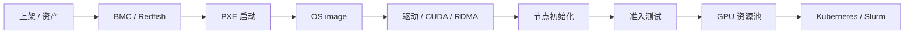

# 第 26 章：裸金属 GPU 云

## 本章回答的问题

- 为什么大模型训练和高性能推理经常偏好裸金属 GPU？
- GPU server、BMC、PXE、OS image、driver installation 和节点初始化如何组成 GPU IaaS 交付链路？
- 裸金属 GPU 云如何做到可交付、可验收、可回收和可运维？

## 一个真实场景

一批新 GPU 服务器到货后，业务团队希望立刻交给训练平台使用。硬件团队说机器已经上架通电，云平台团队说还没有完成 OS 安装，AI 平台团队说驱动和 NCCL 没验收，训练团队说节点混入集群后任务性能不稳定。问题不是某个团队慢，而是缺少裸金属 GPU 交付流水线。

裸金属 GPU 云的目标，是把物理服务器变成可被调度系统可靠使用的 GPU 资源。

## 核心概念

Bare Metal GPU Cloud 指以裸金属方式交付 GPU 服务器。相比虚拟机，裸金属让用户或平台更直接控制 GPU、NIC、NVLink、RDMA、驱动和拓扑。大模型训练偏好裸金属，是因为它对性能抖动、拓扑可见性和通信路径更敏感。

GPU IaaS 层关注的是资源交付，不是模型 API。它要回答：机器在哪里、健康吗、装了什么系统、驱动是否正确、网络存储是否可用、能否进入 Kubernetes 或 Slurm。

## 系统架构



裸金属交付链路必须自动化。手工装机在几十台以内还能维持，到数百台、数千台时会成为稳定性风险。

## 26.1 为什么大模型训练偏好裸金属

大模型训练依赖多 GPU、多节点和高性能网络。裸金属减少虚拟化层不确定性，让训练框架更容易看到真实 GPU 拓扑、NUMA、NIC 和存储路径。对于 NCCL、RDMA 和拓扑感知调度，裸金属可解释性更强。

这并不意味着所有 AI workload 都必须裸金属。小模型推理、开发测试、多租户隔离和企业私有云可能使用虚拟机或容器共享。裸金属适合高性能、长时间、强通信和低抖动要求的场景。

## 26.2 GPU server

GPU server 是承载 GPU 的物理服务器，包含 CPU、GPU、HBM、PCIe、NVLink/NVSwitch、NIC、DPU、本地盘、电源和 BMC。AI Factory 需要把服务器当作拓扑资源，而不是只看 GPU 数量。

资产系统应记录服务器型号、GPU 型号、GPU 序列号、NIC、交换机端口、机架位置、电源路径和保修状态。这些信息会进入调度、验收和故障定位。

## 26.3 bare metal provisioning

Bare metal provisioning 是从空机器到可用节点的自动化过程。它包括资产发现、电源控制、网络启动、OS 安装、磁盘分区、用户和密钥、驱动安装、网络配置、监控接入和准入测试。

Provisioning 的核心质量是幂等和可追溯。失败后能重试，重装后能恢复到一致状态，所有步骤都有日志和版本记录。

## 26.4 BMC、IPMI、Redfish

BMC 是服务器管理控制器，可以在操作系统之外控制电源、读取硬件状态和访问远程控制台。IPMI 和 Redfish 是常见管理接口。Redfish 更现代，基于 REST 风格 API。

BMC 是裸金属云的控制入口。平台可以通过它开关机、设置启动设备、收集硬件告警和执行维修流程。BMC 凭据和网络必须严格保护，否则风险极高。

## 26.5 PXE

PXE 允许服务器通过网络启动安装环境。裸金属平台常用 PXE 或类似机制引导 OS 安装。它需要 DHCP、TFTP/HTTP boot、镜像仓库和网络隔离配合。

PXE 故障常见于 DHCP 配置、网卡启动顺序、管理网隔离和镜像下载。规模化环境应有安装状态机和失败原因分类，而不是让运维人员看控制台截图。

## 26.6 OS image

OS image 定义节点操作系统基线，包括内核、系统包、安全配置、用户、日志、时间同步和基础 agent。GPU 节点 OS image 还要考虑内核与驱动、OFED/RDMA 栈和容器 runtime 的兼容。

OS image 应版本化。生产集群中“同名镜像但内容不同”会导致难以复现的问题。升级 OS baseline 应通过灰度和准入测试。

## 26.7 driver installation

Driver installation 安装 NVIDIA Driver、CUDA 兼容环境、NVIDIA Container Toolkit、RDMA/OFED 等。驱动可以放在 OS image 中，也可以由初始化脚本或 GPU Operator 管理。

关键是不要多套系统同时管理同一驱动。否则升级和回滚会混乱。平台应定义驱动归属：裸金属 IaaS 管，还是 Kubernetes GPU Operator 管。

## 26.8 节点初始化

节点初始化把服务器纳入生产系统：配置主机名、网络、DNS、时间同步、容器 runtime、监控 agent、日志采集、标签、污点和调度系统注册。AI 节点还要采集 GPU/NIC 拓扑和运行准入测试。

初始化完成不等于可用。只有通过 GPU burn-in、NCCL test、网络和存储基准后，节点才能进入可调度资源池。

## 工程实现

节点交付状态机示例：

```yaml
node_lifecycle:
  discovered: true
  provisioned: true
  os_image: gpu-node-2026-06
  driver_baseline: nvidia-baseline-2026-06
  initialized: true
  acceptance:
    gpu_burn_in: pass
    nccl_test: pass
    storage_test: pass
  state: allocatable
```

这个状态应能被资源池、调度器和运维系统读取。

## 常见故障

- 资产信息不准，GPU/NIC/机架位置与实际不一致。
- PXE 安装成功但驱动版本不一致。
- 节点没有通过 NCCL test 就进入训练池。
- BMC 凭据管理混乱，无法自动维修。
- OS image 漂移，节点行为不一致。

## 性能指标

- 节点交付时长、安装成功率、重试次数。
- 准入测试通过率、失败原因分布。
- 驱动/OS baseline 分布。
- BMC 可达率、硬件告警数量。
- 节点从维修到回池时间。

## 设计取舍

把驱动固化进镜像可控性强，但升级慢；运行时安装灵活，但失败面更大。裸金属性能和可见性好，但隔离粒度粗。平台应根据训练、推理和租户隔离要求选择交付模式。

## 小结

- 裸金属 GPU 云把物理服务器转化为可调度 GPU 资源。
- BMC、PXE、OS image、驱动和初始化组成交付链路。
- 裸金属适合高性能训练，但需要严格准入和版本治理。
- 节点通过验收前不应进入生产资源池。

## 延伸阅读

- TODO: Redfish 官方文档
- TODO: 裸金属 provisioning 工具文档
- TODO: GPU 节点准入案例
