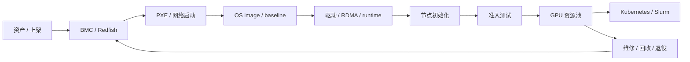

# 第 26 章：裸金属 GPU 云

## 本章回答的问题

- 为什么大模型训练和高性能推理经常偏好裸金属 GPU？
- GPU server、BMC、PXE、OS image、driver installation 和节点初始化如何组成 GPU IaaS 交付链路？
- 裸金属 GPU 云如何做到可交付、可验收、可回收和可运维？

## 本章上下文

- 层级定位：本章属于 `GPU IaaS 层`，重点讨论裸金属、虚拟化、GPU 资源池、镜像、驱动和初始化交付。
- 前置依赖：建议先理解 第 25 章：多集群与混部 中的核心对象和路径。
- 后续关联：本章内容会继续连接到 第 27 章：GPU 虚拟化与隔离，并在系统地图、深度标准和读者测试中被交叉引用。
- 读完能力：读完本章后，读者应能把《裸金属 GPU 云》中的概念映射到 AI Factory 的生产路径、工程对象、观测证据和设计取舍。

## 读者测试

- 机制题：读者能否解释 为什么大模型训练偏好裸金属、GPU server、bare metal provisioning、BMC、IPMI、Redfish 的核心机制，以及它们如何共同支撑《裸金属 GPU 云》？
- 边界题：读者能否区分 GPU IaaS、资源编排、节点基线、租户隔离和物理硬件 的责任边界，并说明哪些问题不能简单归因到本章组件？
- 路径题：读者能否从资源申请追到裸金属交付、虚拟化隔离、资源池状态、镜像驱动和节点初始化，并指出本章对象在路径中的位置？
- 排障题：当《裸金属 GPU 云》相关生产症状出现时，读者能否列出第一层证据、下一跳证据、可能 owner 和止血动作？


## 一个真实场景

一批新 GPU 服务器到货后，业务团队希望立刻交给训练平台使用。硬件团队说机器已经上架通电，云平台团队说还没有完成 OS 安装，AI 平台团队说驱动、NCCL 和 RDMA 没有验收，训练团队说节点混入集群后性能不稳定。每个团队都在自己的边界内做了工作，但从 AI Factory 视角看，这批机器还不是可用产能。它们只是通电的资产，不是可调度、可计量、可诊断的 GPU 资源。

问题通常出在交付链路没有状态机。服务器上架、BMC 可达、PXE 安装、OS 完成、驱动安装、容器 runtime 配置、RDMA 配置、监控接入、准入测试、资源池入池，这些步骤之间缺少明确门禁。某些节点安装成功但没有跑 NCCL test，某些节点驱动版本不同，某些节点交换机端口接错，某些节点在资产系统中机架位置不准。训练任务遇到问题后，平台才开始倒查。

裸金属 GPU 云的目标，是把物理服务器转化为可被 Kubernetes、Slurm 和资源池可靠使用的资源。它不是“装系统”这么简单，而是围绕硬件、固件、网络、OS、驱动、容器、监控、验收和回收建立闭环。一个节点只有在硬件事实、软件基线、网络存储、健康状态和调度标签都一致时，才应进入生产资源池。

这个场景也说明，GPU IaaS 层不是 AI PaaS。它不直接提供 Chat API、MaaS、模型路由或计费产品入口，但它决定上层能否稳定运行。裸金属交付质量差，训练平台会表现为随机失败；节点验收不足，NCCL 会表现为性能抖动；资产不准，故障定位会变成人肉排查。AI Factory 的可靠性，从服务器进入资源池之前就已经开始。

## 核心概念

Bare Metal GPU Cloud 指以裸金属方式交付 GPU 服务器，让 workload 或上层平台直接使用物理 GPU、NIC、NVLink/NVSwitch、RDMA、本地 NVMe 和完整节点拓扑。相比虚拟化交付，裸金属减少了中间抽象层，性能更可预测，拓扑更可见，故障归因更直接。大模型训练、超大模型推理和高性能批量任务经常偏好裸金属，因为它们对通信路径、延迟抖动和硬件一致性敏感。

GPU IaaS 层关注资源交付，而不是模型能力。它要回答：机器在哪里，资产信息是否准确，BMC 是否可控，OS 是否符合 baseline，驱动和 RDMA 是否兼容，监控是否接入，节点是否通过准入，能否被分配、回收和维修。只有这些问题被系统化处理，上层的 Kubernetes、Slurm、MaaS 和训练平台才有稳定基础。

裸金属并不等于缺少平台化。相反，规模化裸金属云需要比普通 VM IaaS 更严格的自动化。虚拟机可以通过 hypervisor 屏蔽部分硬件差异，裸金属则必须把硬件差异显式纳入资源模型。GPU 型号、机架位置、NIC 连接、NUMA、固件、driver baseline 和验收结果都应成为资源属性，而不是运维笔记。

还要区分“交付完成”和“可调度”。OS 安装成功只是早期状态，驱动加载成功也不代表节点适合训练。可调度意味着节点通过硬件健康、GPU burn-in、NCCL、RDMA、存储和容器访问测试，并且状态进入资源池。裸金属 GPU 云的核心概念，是用状态机把物理资产、软件基线、健康验收和调度入口串起来。

因此，裸金属 GPU 云的评价标准不是“能不能装机”，而是交付结果能否被上层系统信任。可信资源必须有来源、版本、状态、验收和责任归属。缺少这些字段，节点越多，平台越难判断哪些 GPU 真正能承载生产 workload。

## 系统架构

裸金属 GPU 云通常由资产系统、BMC 管理、网络启动、镜像服务、配置管理、驱动安装、节点初始化、准入测试、资源池和调度系统组成。资产系统记录服务器、GPU、NIC、交换机端口、机架、电源和保修信息；BMC 管理电源和硬件状态；PXE 或类似机制引导 OS 安装；配置管理写入主机名、网络、用户、密钥和安全基线；初始化流程安装或验证驱动、容器 runtime、RDMA、监控和日志。

架构上最重要的是状态流转。一个节点从 discovered 到 provisioned，再到 initialized、validated、allocatable、allocated、draining、maintenance、retired，每个状态都应有进入条件、退出条件和责任系统。没有状态机，平台只能靠人记住节点处于哪一步；规模变大后，遗漏和重复操作会成为常态。状态机也是审计和自动化的基础。

准入测试位于资源池之前。节点通过 PXE 安装和初始化后，必须运行 GPU、NCCL、网络、存储和容器访问测试。测试结果写入资源池，影响节点是否可调度、进入哪个 pool、带什么 label 或 taint。若测试失败，节点进入维修或复测状态，而不是被平台“先用起来”。AI 训练中，一个坏节点可能浪费整个多节点作业的 GPU 小时。

还要把裸金属云与上层调度解耦。GPU IaaS 负责提供经过验收的节点和资源事实，Kubernetes 或 Slurm 负责调度 workload。二者通过资源池、标签、健康状态和事件同步协作。IaaS 不应直接理解每个模型任务，但必须提供足够准确的硬件和软件事实，让上层调度能做正确决策。

架构还应包含回收和维修路径。节点不是只从交付流向调度，也会从调度流回维护：任务结束、节点异常、驱动升级、硬件更换、退役迁移都会改变节点状态。没有反向路径，资源池会不断积累不可解释节点。



## 26.1 为什么大模型训练偏好裸金属

大模型训练依赖多 GPU、多节点和高性能网络。训练框架需要理解 GPU 拓扑、NUMA、NIC、NVLink、PCIe、RDMA 和本地存储路径。裸金属减少虚拟化层带来的不确定性，让 NCCL、CUDA、RDMA 和拓扑感知调度更接近真实硬件。对长时间训练来说，性能稳定性往往比单次峰值更重要，裸金属在可解释性上有明显优势。

训练任务还非常怕噪声。一个节点上的 GPU 降频、一个 NIC 连接异常、一个虚拟化层的中断抖动，都可能让整个 job 的 step time 被最慢 rank 拉低。裸金属不能消除所有故障，但它减少了中间层，把问题更直接地暴露在硬件、驱动、网络和框架之间。排障时，团队可以沿着节点、GPU、NIC、链路和进程定位，而不是同时怀疑 hypervisor、虚拟设备和宿主调度。

裸金属也有利于资源独占。预训练作业通常希望整节点使用 GPU、CPU、内存、NIC 和本地 NVMe，避免与其它租户共享关键路径。虚拟化或强共享可以提高利用率，但对多节点同步训练来说，隔离和稳定更有价值。特别是当作业运行数天或数周时，一次抖动或故障的代价远高于短期资源碎片。

这并不意味着所有 AI workload 都必须裸金属。小模型推理、开发测试、轻量微调、多租户企业隔离和桌面式 GPU 场景可以选择 VM、MIG 或容器共享。裸金属适合高性能、长时间、强通信、低抖动和需要拓扑可见性的 workload。AI Factory 应把裸金属作为重要交付形态，而不是把它神化为唯一形态。

选择裸金属时，也要接受它的运营成本。整机交付、维修、重装、节点隔离和租户回收都比虚拟资源更重。只有当性能确定性和拓扑可见性带来的收益超过这些成本时，裸金属才是合理选择。

## 26.2 GPU server

GPU server 是承载 GPU 的物理服务器，包含 CPU、GPU、HBM、PCIe、NVLink/NVSwitch、NIC、DPU、本地 NVMe、电源、风扇、BMC 和主板固件。AI Factory 不能把它只看作“8 张 GPU”。同样的 GPU 数量，在不同 CPU、内存、NIC、PCIe 拓扑、散热和机架网络下，会呈现不同的训练性能和故障模式。

服务器信息首先要进入资产系统。资产应记录服务器型号、序列号、GPU 型号和序列号、NIC 型号、DPU、磁盘、BMC 地址、交换机端口、机架位置、电源路径、固件版本和保修状态。资产信息不是财务台账的附属品，而是调度、验收和故障定位的基础。节点掉卡、链路错误或温度异常时，平台需要快速找到对应硬件和物理位置。

GPU server 还要被建模为拓扑资源。节点内 GPU 与 GPU、GPU 与 NIC、GPU 与 CPU 的关系，会影响通信和数据路径。对于多节点训练，节点所属 rack、leaf、rail 和故障域也很重要。如果资源池只记录 GPU 数量，不记录拓扑，调度器就无法判断哪些节点适合大规模训练，哪些节点只适合推理或调试。

工程上，服务器验收应覆盖硬件和软件两个层面。硬件层检查电源、温度、风扇、GPU、NIC、NVMe、BMC 和链路；软件层检查固件、BIOS 设置、内核、驱动、RDMA、容器 runtime 和监控 agent。GPU server 只有通过这些检查，才是 AI Factory 的生产节点。否则它只是一个可能带来随机故障的资产。

服务器还要有故障域信息。机架、电源回路、交换机、rail 和存储路径决定一次故障会影响哪些任务。把这些信息纳入资源模型后，调度器才能避免把关键副本放到同一故障域，运维也能在故障时快速评估影响范围。

这些字段不能省略。

## 26.3 bare metal provisioning

Bare metal provisioning 是从空机器到可用节点的自动化过程。它通常包括资产发现、BMC 接入、电源控制、启动设备设置、PXE 或网络启动、OS 安装、磁盘分区、主机名和网络配置、用户与密钥、安全基线、驱动和 runtime、监控日志、准入测试和资源池注册。每一步都应可重试、可观测、可审计。

Provisioning 的关键质量是幂等。节点安装失败后，重新执行流程应能回到一致状态，而不是留下半配置系统。磁盘分区、包安装、驱动模块、网络配置和 agent 注册都可能在失败后留下残留。没有幂等性，规模化交付会变成手工修补。对数百台 GPU 节点来说，少量失败比例也会带来大量运维成本。

可追溯性同样重要。每台节点使用哪个 OS image、哪个配置版本、哪个驱动 baseline、哪个初始化脚本、哪个准入测试版本，都应记录。训练故障发生时，平台需要判断是节点个体问题，还是某个交付批次的问题。没有交付记录，就无法进行批次回滚、灰度升级和故障聚类分析。

Provisioning 还要与调度系统隔离。节点在安装和初始化期间不应被 Kubernetes 或 Slurm 误认为可用。只有状态进入 validated 或 allocatable 后，才允许注册到生产集群或去掉 taint/drain 状态。很多生产事故来自“安装中节点被提前纳入资源池”。交付流程必须把资源可用性作为最后一步，而不是默认结果。

此外，provisioning 应支持批量回滚。某个 image、driver 或初始化版本验证失败时，平台要能停止后续节点、标记已影响批次，并恢复到上一条稳定基线。没有批次控制，错误会在自动化流程中被高速放大。

交付越自动化，回滚越重要。

## 26.4 BMC、IPMI、Redfish

BMC 是服务器管理控制器，可以在操作系统之外控制电源、读取硬件状态、设置启动顺序、访问远程控制台和收集硬件告警。IPMI 和 Redfish 是常见管理接口，其中 Redfish 基于现代 API 风格，更适合自动化集成。裸金属云离不开 BMC，因为操作系统损坏、节点无响应或需要重装时，BMC 是最后的控制入口。

BMC 在交付流程中承担多个动作：开关机、重启、设置 PXE 启动、挂载虚拟介质、读取传感器、获取硬件日志、确认电源和温度状态。维修流程也依赖 BMC：节点失联时先判断 BMC 是否可达，OS 是否可达，硬件是否告警。没有可靠 BMC，裸金属平台会在节点故障时失去自动化控制能力。

安全上，BMC 是高风险管理面。它绕过操作系统，拥有极高权限，一旦凭据泄露或管理网暴露，攻击者可能控制服务器电源、读取硬件状态或干扰启动流程。AI Factory 应把 BMC 网络与业务网络隔离，使用集中凭据管理、最小权限、审计日志和定期轮换。不要把 BMC 当作普通接口暴露给业务系统。

工程上，还要处理 BMC 的异构和不稳定。不同厂商、不同固件版本的 Redfish 实现可能存在差异；某些 BMC 响应慢、状态滞后或需要重试。平台应封装硬件差异，提供统一电源、启动和硬件状态 API，并记录失败原因。BMC 自动化的成熟度，直接影响裸金属云的可恢复性。

BMC 数据还应与节点健康关联。风扇、电源、温度、内存告警和 PCIe 错误等硬件信号，往往早于业务故障出现。把这些信号接入资源池，可以提前 drain 风险节点，减少训练任务踩到硬件隐患的概率。

## 26.5 PXE

PXE 允许服务器通过网络启动安装环境，是裸金属 provisioning 的常见基础。典型链路包括 DHCP 分配地址和启动参数，TFTP 或 HTTP 提供 bootloader 和 initramfs，安装环境拉取 OS image 和配置，完成磁盘分区和系统安装。现代实现可能使用 iPXE、HTTP boot 或厂商工具，但核心目标相同：无需人工插盘即可批量安装。

PXE 的难点在网络和状态。安装网、管理网、业务网、存储网可能彼此隔离，DHCP 作用域、网卡启动顺序、VLAN、交换机端口和镜像服务都可能出错。节点如果多网卡启动顺序不一致，可能从错误网络启动；镜像服务带宽不足，会让大批量安装失败或超时。规模化环境必须为 PXE 流程建立清晰错误分类。

PXE 还要与资产绑定。平台应知道哪台服务器从哪个 MAC 地址启动，应该安装哪个 image，进入哪个资源池，配置哪个主机名和网络。若只依赖 DHCP 动态发现，容易出现机器身份错配。GPU 节点一旦身份错配，后续的资产、调度、成本和维修都会出错。安装前的资产确认是重要门禁。

工程实现中，PXE 不应是一次性脚本，而应是安装状态机的一部分。节点启动、下载、分区、安装、首次启动、回调、初始化和验收都要有状态和日志。运维人员不应通过远程控制台截图判断失败原因，而应从平台看到是 DHCP、bootloader、镜像下载、磁盘、网络还是 post-install 失败。

PXE 服务本身也要容量规划。大批量重装时，镜像服务器、DHCP、HTTP boot 和交换机链路都会成为瓶颈。交付平台应限制并发、缓存镜像并记录下载耗时，否则一次扩容或重装会冲击管理网络。

## 26.6 OS image

OS image 定义 GPU 节点的操作系统基线，包括发行版版本、内核、系统包、包源、安全配置、用户和密钥、日志、时间同步、审计、基础 agent 和容器 runtime 依赖。GPU 节点的 OS image 还要考虑内核与 NVIDIA Driver、OFED/RDMA、文件系统、本地 NVMe 和监控工具的兼容。它不是普通 Linux 镜像，而是 AI 硬件运行环境的底座。

OS image 应版本化和不可变。生产中最危险的情况之一，是多个节点声称使用同一个 image 名称，实际内容不同。镜像应有版本号、构建记录、包清单、校验和、变更说明和验收结果。节点安装后，应把 image 版本写入资源池和监控标签。这样出现故障时，平台能按 image 版本聚合问题。

OS image 应尽量保持主机职责清晰。通用业务依赖、Python 包、训练框架和模型服务逻辑，应进入 container image；主机负责硬件、内核、驱动边界、网络、容器 runtime、监控和安全。主机镜像过厚会降低升级灵活性，也容易让不同业务在主机上留下不可控依赖。主机越像硬件平台，容器越像业务环境，责任越清晰。

升级 OS image 必须经过灰度和准入测试。内核、systemd、网络工具、文件系统和安全策略变化，都可能影响 GPU 驱动、RDMA 或容器运行。生产集群不应自动滚动到未知 image。AI Factory 应维护 image 生命周期：开发、验证、灰度、生产、冻结、退役，并保留回滚路径。

OS image 还要明确安全与可用性的边界。安全补丁不能无限期推迟，但自动更新也可能破坏驱动模块。更稳妥的做法是把补丁纳入基线版本，经过验收后批量发布，而不是让生产节点自行漂移。

补丁管理本身也应纳入镜像生命周期。

## 26.7 driver installation

Driver installation 安装或验证 NVIDIA Driver、CUDA 兼容边界、NVIDIA Container Toolkit、DCGM、RDMA/OFED 和相关内核模块。驱动可以预装在 OS image 中，也可以在节点初始化时安装，还可以由 Kubernetes GPU Operator 管理。不同模式都可行，关键是归属清晰、版本可控、日志可追溯。

最常见的错误是多套系统同时管理驱动。OS image 里带一个版本，初始化脚本安装另一个版本，GPU Operator 又尝试升级，最终节点状态取决于执行顺序。生产平台必须定义驱动责任边界：裸金属 IaaS 管 host driver，还是集群层 operator 管 driver。两种模式都需要兼容矩阵、升级流程和回滚策略。

驱动安装成功不等于可用。平台应验证 `nvidia-smi`、CUDA sample、容器内 GPU 访问、DCGM 指标、MIG 状态、NVLink 状态和必要的 persistence 配置。对于训练节点，还要验证 NCCL 和 RDMA 能否工作。只检查内核模块加载，会漏掉容器注入、用户态库、权限和网络通信问题。

驱动变更必须保守。GPU 驱动处在硬件和运行时之间，一次升级可能影响训练框架、推理引擎、CUDA runtime、NCCL 和容器镜像。平台应先在验收集群和小规模生产节点验证，再扩展到大集群。升级窗口、节点 drain、回滚路径和版本标签都要提前定义。驱动不是普通包，它是 AI Factory 的关键生产基线。

驱动安装还要处理故障清理。安装失败后，旧模块、DKMS 产物、用户态库和容器 runtime 配置可能处于半更新状态。初始化流程应能识别并恢复到干净状态，否则节点会通过部分检查，却在真实 workload 中暴露兼容问题。

驱动日志也应长期保存。排查随机掉卡、容器无法访问 GPU 或 NCCL 初始化失败时，安装日志、内核日志和版本标签往往能直接指向根因。没有日志，驱动问题会退化成反复重装。

## 26.8 节点初始化

节点初始化把安装好的服务器纳入生产系统。它通常配置主机名、DNS、NTP、网络、路由、用户、密钥、日志、监控 agent、容器 runtime、镜像加速、存储挂载、GPU/NIC 拓扑采集、Kubernetes 或 Slurm 注册、标签、taint、drain 状态和资源池记录。初始化是 OS 安装与平台可用之间的桥。

初始化必须区分“配置完成”和“验证通过”。脚本执行完不代表节点可用。每个关键配置都应有验证动作：时间同步是否正常，容器能否拉取镜像，GPU 是否可见，RDMA 设备是否在容器内可见，存储路径是否可读写，日志和指标是否上报，调度标签是否正确。验证失败时，节点不应继续入池。

初始化还要采集事实，而不仅是下发配置。GPU 拓扑、NIC、NUMA、NVLink、PCIe、磁盘、固件和软件版本应被采集并写入资源池。调度器和运维系统依赖这些事实做放置和排障。手工维护标签很容易漂移，最好由初始化和周期性探测自动生成。

节点初始化的最后一步，是进入准入测试和资源池状态机。通过测试后，节点可以加入训练、推理、实验或验收资源池；未通过则进入维修或隔离。初始化流程还应支持重入：节点维修后重新初始化，节点回收后清理残留，节点退役前移除凭据和资源记录。裸金属节点有完整生命周期，不只是首次装机。

初始化也要避免把环境差异藏在手工操作中。临时 SSH 改配置、手工安装包、现场修改网络参数，都应被视为漂移来源。生产节点的最终状态必须由 image、配置和初始化版本共同决定，而不是由某次人工修复决定。

这是一条基本纪律。

## 工程实现

工程实现应围绕节点生命周期状态机建设，而不是堆叠脚本。状态机至少包含 discovered、bmc-ready、provisioning、provisioned、bootstrapping、initialized、validating、allocatable、allocated、draining、maintenance、retired。每个状态有进入条件、动作、超时、失败原因和下一步。这样平台可以批量交付，也可以精确定位卡在哪一步。

节点交付状态示例：

```yaml
node_lifecycle:
  node: gpu-node-001
  asset_state: discovered
  bmc: reachable
  os_image: gpu-node-2026-06
  driver_baseline: nvidia-baseline-2026-06
  bootstrap_version: bootstrap-2026-06-18
  initialized: true
  acceptance:
    gpu_burn_in: pass
    nccl_test: pass
    rdma_test: pass
    storage_test: pass
  state: allocatable
```

交付系统还应提供批次视图。一次到货、一批重装或一次驱动升级，都应形成 batch。平台需要看到 batch 成功率、失败节点、失败阶段和版本差异。若某个 batch 的 NCCL test 失败率异常，可能是网络布线、镜像版本或驱动 baseline 问题。批次视图能把零散节点故障上升为系统问题。

最后，工程实现要与调度系统和资源池联动。节点进入 allocatable 前保持 drain 或 taint；进入 maintenance 时自动从调度器摘除；维修后重新验收；退役时移除凭据、标签、监控和资产状态。交付、调度、维修和退役必须共享同一状态，而不是每个系统维护一套节点事实。

为了让这套流程可运营，平台还应提供节点详情页或 API，展示资产、BMC、image、driver、初始化版本、验收结果、调度状态、维修历史和最近一次任务。排障时，工程师不应在资产系统、监控系统、调度器和日志系统之间手工拼接事实。统一视图能显著降低跨团队沟通成本。

自动化也要有人工接管点。硬件维修、线缆调整、主板更换和批量升级可能需要人工确认。状态机应允许节点进入 waiting-for-repair、waiting-for-validation 等明确状态，而不是用失败或未知状态长期堆积。明确等待原因，比隐藏在失败队列中更容易管理。

人工接管同样要有审计记录。

审计记录应包含操作者、时间、原因和后续验证结果。

## 常见故障

第一类故障是资产信息不准。GPU、NIC、机架位置、交换机端口或 BMC 地址与实际不一致，导致调度、验收和维修都偏离真实硬件。训练故障发生后，团队以为检查的是问题节点，实际定位到另一个物理端口。解决方向是自动发现、资产对账和上架验收，而不是依赖人工表格。

第二类故障是环境漂移。PXE 安装成功，但驱动版本、内核版本、OFED、容器 runtime 或监控 agent 与 baseline 不一致。节点看似加入集群，实际行为不同。环境漂移会表现为随机训练失败、容器 GPU 不可见、NCCL 性能差或监控缺失。解决方向是镜像版本化、初始化校验和入池前验收。

第三类故障是准入不足。节点只检查 `nvidia-smi` 就进入训练池，没有跑 GPU burn-in、NCCL test、RDMA、存储和容器访问测试。结果是坏卡、慢链路或存储问题在真实训练中暴露。AI 训练作业代价高，生产节点准入应在业务前发现问题，而不是让用户任务承担验收成本。

第四类故障是控制面不可恢复。BMC 凭据过期、管理网不可达、Redfish 接口异常或 PXE 服务不可用，导致节点故障后无法自动重装或维修。裸金属平台必须监控自己的交付依赖，包括 BMC 可达率、PXE 成功率、镜像服务可用性和配置管理成功率。否则节点越多，手工救火越频繁。

第五类故障是回收不完整。节点从一个租户或集群回到资源池时，本地数据、临时凭据、容器缓存、MIG 配置、调度标签和监控状态没有清理干净。裸金属复用前必须执行清理和复验，否则既有安全风险，也会把上一个任务的残留问题带给下一个任务。

## 性能指标

裸金属交付指标首先包括节点交付时长、安装成功率、重试次数、失败阶段分布、批次成功率和从上架到 allocatable 的 lead time。这些指标回答一个问题：新增 GPU 资产多久能变成真实产能。对 AI Factory 来说，采购到货不是产能上线，只有通过交付和准入的节点才算可用。

健康和验收指标包括 GPU burn-in 通过率、NCCL test 通过率、RDMA 测试通过率、存储 benchmark 通过率、容器 GPU smoke test 通过率、driver baseline 分布和 OS image 漂移数量。它们用于判断节点能否进入生产池，也用于发现批次问题。验收指标应长期保存，便于对比节点维修前后状态。

运维指标包括 BMC 可达率、硬件告警数量、节点 drain 数、维修平均时长、维修后复测通过率、节点回池时间、退役数量和重复故障节点。裸金属云不是一次性交付系统，它要持续处理故障、维修、升级和回收。运维指标能暴露资源池质量和硬件供应链问题。

还应关注上层影响指标。若交付质量差，训练失败率、NCCL hang、推理节点重启、GPU 掉卡和性能抖动会增加。平台应把 IaaS 事件与 Kubernetes、Slurm 和训练任务关联起来。这样才能判断某次训练失败是模型代码问题，还是节点交付或硬件健康问题。指标的价值在于跨层归因。

指标还要有门槛和动作。例如同一批次 NCCL 失败率超过阈值，应暂停入池；某类 BMC 固件告警升高，应触发硬件排查；某个 image 漂移节点数量增加，应停止调度或重新初始化。没有动作定义的指标，只能在事故后解释问题。

门槛应随资源池等级区分，生产池要比实验池更严格。

## 设计取舍

第一个取舍是裸金属与虚拟化。裸金属性能和拓扑可见性强，适合大规模训练和高性能推理；虚拟化管理边界和租户隔离更清晰，适合标准云 IaaS 和企业隔离。AI Factory 不必单选，但应明确哪些 workload 必须裸金属，哪些可以使用 VM、MIG 或容器共享。交付模式要服务 workload，而不是服务单一平台偏好。

第二个取舍是厚镜像与薄镜像。厚 OS image 把驱动、runtime 和 agent 预装进去，节点启动快、漂移少，但升级和回滚成本较高；薄 image 依赖初始化安装更多组件，灵活性强，但失败面更大。生产训练集群通常更重视可预测性，实验环境可以接受更多动态安装。关键是版本和责任边界清晰。

第三个取舍是集中交付与集群自管理。裸金属 IaaS 可以统一安装驱动和 runtime，Kubernetes GPU Operator 也可以管理部分 GPU 软件栈。集中交付减少集群差异，集群自管理便于云原生升级。两种模式冲突时风险很大。平台应定义主机驱动归属，并让升级流程、监控标签和兼容矩阵保持一致。

第四个取舍是快速入池与严格准入。快速入池能让业务更快拿到 GPU，但会把验收风险转移到训练任务；严格准入会延长交付时间，却降低生产故障。高价值 GPU 集群应把准入视为产能质量的一部分，而不是流程负担。没有通过验收的 GPU，不应计入可靠产能。

第五个取舍是自动化深度。完全手工灵活但不可规模化，完全自动化效率高但要求状态和异常处理足够成熟。务实路径是先把高频、可重复、风险明确的步骤自动化，再为硬件维修和异常批次保留人工审批。自动化应减少不确定性，而不是把错误高速传播。

## 小结

- 裸金属 GPU 云把物理服务器转化为可调度、可计量、可诊断的 GPU 资源。
- BMC、PXE、OS image、驱动、初始化和准入测试共同组成交付链路。
- 大模型训练偏好裸金属，是因为拓扑可见、性能可解释、隔离更直接。
- 节点进入资源池前必须完成硬件、软件、网络、存储和容器维度验收。
- 裸金属交付需要状态机、批次视图和与调度系统共享的资源事实源。

## 延伸阅读

- [DMTF Redfish](https://redfish.dmtf.org/)
- [Metal3 documentation](https://book.metal3.io/)
- [NVIDIA DCGM Diagnostics documentation](https://docs.nvidia.com/datacenter/dcgm/latest/user-guide/dcgm-diagnostics.html)
