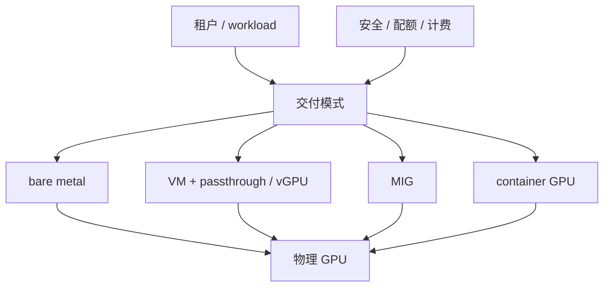

# 第 27 章：GPU 虚拟化与隔离

## 本章回答的问题

- VM、bare metal、PCIe passthrough、SR-IOV、MIG、vGPU 和容器隔离分别提供什么边界？
- 多租户 GPU 平台有哪些安全和性能风险？
- 如何在隔离、性能、利用率和运维复杂度之间取舍？

## 一个真实场景

一个平台为了提高利用率，让多个租户共享同一张 GPU。开发测试效果不错，但生产中出现性能抖动、显存互相挤占和安全团队质疑隔离边界。另一个客户要求整机独占，因为训练数据敏感且需要稳定 NCCL 性能。平台最终提供多种交付形态：裸金属独占、VM passthrough、MIG 实例和容器整卡。

GPU 隔离不是一个开关，而是一组层次不同的技术。

## 核心概念

GPU 虚拟化与隔离的目标是在多个用户或 workload 之间安全、可控地共享 GPU 资源。隔离维度包括硬件隔离、驱动隔离、进程隔离、显存隔离、性能隔离、故障隔离和管理面隔离。

隔离越强，资源利用率和灵活性可能越低；隔离越弱，性能和安全风险越高。

## 系统架构



平台应把交付模式明确暴露给用户，而不是把所有 GPU 都包装成同一种资源。

## 27.1 VM vs bare metal

Bare metal 提供最高的硬件可见性和性能可预测性，适合大规模训练和强拓扑需求。VM 提供更强的管理边界和云平台体验，适合多租户、企业隔离和标准 IaaS 交付。

VM 的性能取决于虚拟化方式。普通虚拟 GPU 抽象可能不适合高性能训练；PCIe passthrough 可以让 VM 直接使用物理 GPU，但调度和迁移灵活性较低。

## 27.2 PCIe passthrough

PCIe passthrough 把物理 GPU 直接透传给虚拟机。VM 内部看到接近真实的 GPU 设备。它提供较强隔离和较好性能，但一张 GPU 通常只能分配给一个 VM。

Passthrough 的挑战是设备绑定、IOMMU、驱动安装、故障恢复和资源回收。GPU 出错时，可能需要重启 VM 或宿主机恢复。

## 27.3 SR-IOV

SR-IOV 允许一个物理 PCIe 设备暴露多个虚拟功能。它在网卡场景非常常见，GPU 场景取决于硬件和厂商支持。对于 AI Factory，SR-IOV 更常用于高性能 NIC 或 DPU 资源隔离。

使用 SR-IOV 时，平台需要管理 PF/VF、设备分配、驱动、NUMA 和安全策略。它能提高网络设备共享能力，但也增加运维复杂度。

## 27.4 MIG

MIG 把一张支持该能力的 GPU 切分为多个硬件隔离实例。每个实例有独立的计算和显存切片，适合小模型推理、开发测试和多租户轻量任务。

MIG 提供比 time-slicing 更强的隔离，但资源形态固定。切分 profile 变更可能需要排空节点。平台要管理 MIG profile、调度标签、计量和监控。

## 27.5 vGPU

vGPU 通过虚拟化软件向 VM 提供 GPU 能力，适合图形、桌面、轻量推理或特定企业虚拟化场景。它的能力、许可和性能特征取决于厂商实现。

对大模型训练，vGPU 通常不是首选。对企业私有化和多租户隔离，它可能有管理优势。使用前应做真实 workload 验证。

## 27.6 容器隔离

容器隔离依赖 namespace、cgroup、runtime 和设备注入。Kubernetes 中 Pod 可以请求整卡、MIG 或共享 GPU。容器隔离轻量、适合云原生平台，但隔离边界弱于 VM。

容器共享 GPU 时，要注意显存、进程、驱动 API、MPS/time-slicing 和故障影响。生产多租户不能只依赖容器边界，需要结合租户隔离、节点池、策略和审计。

## 27.7 安全边界

安全边界要回答：一个租户能否读取另一个租户数据，能否影响另一个租户性能，能否通过驱动或设备攻击宿主，能否逃逸到管理面。不同交付模式边界不同。

高敏感数据和强合规场景更适合独占节点、独占 VM 或专属资源池。共享 GPU 适合低风险、可接受抖动的 workload。

## 27.8 多租户风险

多租户风险包括性能噪声、显存争抢、故障传播、侧信道、驱动漏洞、资源计量不准和账单争议。GPU 不是天然多租户友好的资源。

平台应把风险转化成产品等级：独占、隔离共享、best-effort 共享。每种等级对应不同 SLA、价格、监控和安全承诺。

## 工程实现

资源等级示例：

```yaml
resource_classes:
  - name: gpu-baremetal-dedicated
    isolation: host
    workload: training-production
  - name: gpu-mig-shared
    isolation: hardware-slice
    workload: small-inference
  - name: gpu-container-shared
    isolation: process
    workload: dev-test
```

调度和计费应使用同一资源等级口径。

## 常见故障

- 把共享 GPU 当成独占资源承诺 SLA。
- MIG profile 切分不合理，产生资源碎片。
- 容器内 GPU 进程残留，影响资源回收。
- VM passthrough GPU 故障后无法自动恢复。
- 计费没有区分整卡、MIG 和共享时间片。

## 性能指标

- 各资源等级利用率、碎片率和排队时间。
- MIG profile 使用分布、重配置次数。
- 共享 GPU 性能抖动、显存争抢事件。
- 安全策略拒绝、越权访问尝试。
- 故障隔离效果和恢复时间。

## 设计取舍

裸金属性能强但隔离粒度粗；VM 隔离好但管理和性能有代价；MIG 粒度细但 profile 固定；容器轻量但安全边界弱。AI Factory 应提供分层资源产品，而不是用单一模式覆盖所有场景。

## 小结

- GPU 隔离是硬件、虚拟化、容器和策略共同作用的结果。
- 不同 workload 对隔离、性能和利用率的要求不同。
- MIG、vGPU、passthrough 和容器共享不是等价方案。
- 多租户 GPU 平台必须明确安全边界和 SLA 边界。

## 延伸阅读

- TODO: NVIDIA MIG 官方文档
- TODO: NVIDIA vGPU 文档
- TODO: Kubernetes GPU sharing 文档
