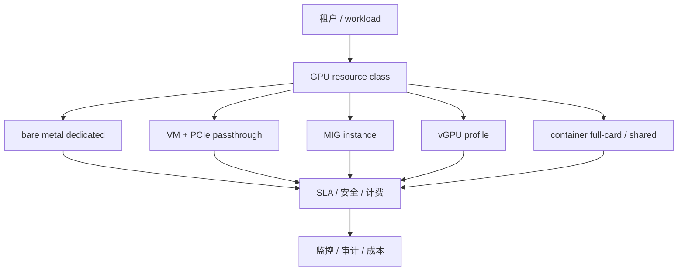

# 第 27 章：GPU 虚拟化与隔离

## 本章回答的问题

- VM、bare metal、PCIe passthrough、SR-IOV、MIG、vGPU 和容器隔离分别提供什么边界？
- 多租户 GPU 平台有哪些安全和性能风险？
- 如何在隔离、性能、利用率和运维复杂度之间取舍？

## 一个真实场景

一个平台为了提高利用率，让多个租户共享同一张 GPU。开发测试阶段效果不错：小模型推理可以并发运行，GPU 利用率明显提高，用户也不再为整卡排队。但进入生产后，问题开始出现。某个租户的任务显存占用波动，导致另一个租户的推理延迟升高；一个容器中的 GPU 进程退出不干净，影响后续任务；安全团队追问共享 GPU 是否能保证数据隔离、故障隔离和侧信道风险。

另一个客户提出完全相反的要求：训练数据敏感，任务运行时间长，需要稳定 NCCL 性能，不能接受共享节点上的性能噪声，也不希望 GPU、NIC 和本地盘被其它租户共用。平台如果只提供一种交付形态，要么无法满足高隔离客户，要么牺牲大量资源利用率。最终平台把 GPU 产品分成裸金属独占、VM passthrough、MIG 实例、容器整卡和 best-effort 共享几类。

这个场景说明，GPU 隔离不是一个开关，而是多层边界的组合。不同技术隔离的对象不同：裸金属隔离主机和硬件资源，VM 隔离操作系统和管理边界，PCIe passthrough 让 VM 直接使用物理设备，MIG 切分部分 GPU 硬件资源，容器隔离进程和 namespace，time-slicing 更像时间共享。把它们都叫“GPU 资源”会隐藏关键差异。

AI Factory 需要把隔离模式产品化，而不是让用户猜测。一个资源等级应说明性能预期、显存边界、安全边界、故障影响、是否可抢占、是否支持生产 SLA、如何计费和如何监控。多租户 GPU 平台的成熟标志，不是能把 GPU 切得多细，而是能清楚说明每种切法的风险和承诺。

因此，隔离设计首先是契约设计。平台要把“可以共享”和“适合共享”分开，把“技术上可运行”和“生产上可承诺”分开。只有资源等级、SLA、计费和故障责任一致，用户才会信任共享 GPU 产品。

## 核心概念

GPU 虚拟化与隔离的目标，是在多个用户或 workload 之间安全、可控地共享或分配 GPU 资源。隔离维度包括硬件隔离、主机隔离、驱动隔离、进程隔离、显存隔离、性能隔离、故障隔离、网络隔离和管理面隔离。不同技术覆盖的维度不同，不能用“支持多租户”一笔带过。

裸金属独占提供最强的硬件可见性和整机隔离，但资源粒度粗；VM 提供更强的操作系统边界和云平台体验，但 GPU 透传、驱动和性能要专门设计；MIG 在支持的 GPU 上提供硬件切片，适合小模型推理和开发测试；vGPU 通过虚拟化软件提供 GPU 能力，适合特定企业虚拟化场景；容器隔离轻量，但安全边界弱于 VM 和硬件隔离。

还要区分资源隔离和性能隔离。一个机制可能限制显存可见范围，却不能保证稳定 latency；也可能隔离进程，却无法阻止共享 PCIe、CPU、内存、NIC 或存储带来的抖动。AI workload 对性能噪声非常敏感，尤其是在线推理和分布式训练。多租户设计必须明确哪些资源是独占的，哪些资源是共享的。

隔离还与计费和 SLA 绑定。整卡独占、MIG 实例、vGPU profile、time-slicing 和容器共享不应使用同一价格和服务承诺。用户购买的不只是 GPU 算力，还包括隔离边界、性能稳定性和故障责任。GPU IaaS 层需要把这些边界转化为资源等级、调度标签、监控指标和账单口径。

这也意味着隔离能力必须可验证。平台不能只在文档中声明安全边界，还要通过调度策略、准入测试、运行时检查、回收校验和审计事件证明边界被执行。多租户 GPU 的可信度来自证据，而不是来自命名。

## 系统架构

GPU 虚拟化与隔离架构通常从资源产品层开始：平台定义 bare metal dedicated、VM passthrough、MIG shared、vGPU、container full-card、container time-slicing 等资源等级。资源等级映射到不同的节点池、驱动模式、调度策略、安全策略和计量方式。用户或上层平台申请的是资源等级，而不是无差别 GPU。

底层执行路径不同。裸金属资源直接把整机交给租户或上层集群；VM passthrough 通过 hypervisor 和 IOMMU 把物理 GPU 分配给虚拟机；MIG 需要在节点上配置 GPU instance 和 compute instance，再通过 device plugin 暴露给 Kubernetes；vGPU 依赖厂商虚拟化栈和 profile；容器共享依赖 runtime、device plugin、cgroup、MPS 或 time-slicing 等机制。

安全策略应覆盖管理面和数据面。管理面包括谁能创建 VM、修改 MIG profile、分配整卡、访问 BMC 或宿主机；数据面包括容器、VM、GPU 设备、网络、存储和日志。共享模式下，平台还要限制租户在同一节点上的共置关系，避免高敏感 workload 与 best-effort workload 混跑。隔离架构不能只停留在 GPU 设备层。

观测和计费必须理解资源模式。整卡独占看 GPU 利用率、HBM、Xid 和节点健康；MIG 需要看 profile 使用、实例健康和碎片；time-slicing 需要看性能抖动、进程占用和公平性；VM passthrough 需要看宿主与 guest 两侧状态。没有模式感知的监控，会把不同隔离等级混成同一种资源，导致排障和账单争议。

架构还要保留资源转换流程。节点可以从整卡池切到 MIG 池，也可以从共享池回到独占池，但转换前必须排空 workload、清理状态、重新配置并复验。资源模式变更本身就是高风险操作，不能像普通标签修改一样处理。

因此，资源模式应进入节点生命周期状态。

状态变化应同步到调度、监控和计费。



## 27.1 VM vs bare metal

Bare metal 提供最高的硬件可见性和性能可预测性。用户或平台可以直接看到 GPU、NIC、NUMA、NVLink、PCIe 和本地 NVMe，适合大规模训练、高性能推理和需要整机独占的场景。它减少了虚拟化层影响，排障路径更短，但租户隔离粒度较粗，资源交付也更接近“整机”而不是弹性 VM。

VM 提供更强的操作系统边界和云平台体验。租户可以获得独立 guest OS、镜像、磁盘、安全策略和生命周期管理，平台可以复用成熟 IaaS 能力。对企业客户来说，VM 边界往往更容易纳入安全和合规模型。问题在于 GPU 不是普通虚拟设备，性能和功能取决于 passthrough、vGPU 或其它虚拟化方式。

在高性能训练中，VM 的主要挑战是拓扑、网络和抖动。即使 GPU passthrough 提供接近裸金属的设备访问，VM 仍可能引入 CPU、内存、I/O、中断、网络和宿主管理层面的差异。多节点训练还要考虑 RDMA、NUMA、GPU 与 NIC 亲和性、时间同步和故障恢复。没有真实 workload 验证，不能假设 VM 与裸金属等价。

设计上，可以把 bare metal 和 VM 作为不同产品等级。裸金属服务高性能、强拓扑和长训练；VM 服务多租户、隔离、标准云体验和中小规模推理；二者共享镜像、身份、成本和观测体系。AI Factory 的目标不是证明某一种模式绝对优越，而是给不同 workload 明确边界和承诺。

选择 VM 还是裸金属，还要看组织运维能力。VM 平台需要成熟的 hypervisor、镜像、安全和网络体系；裸金属平台需要成熟的 BMC、PXE、准入和维修体系。技术选型不能只比较性能，还要比较团队能否长期运营这种交付形态。

运营能力不足时，理论优势会变成生产风险。

## 27.2 PCIe passthrough

PCIe passthrough 把物理 GPU 直接透传给虚拟机，guest OS 内部能看到接近真实的 GPU 设备。它通常依赖 IOMMU 和 hypervisor 的设备绑定能力。相比软件模拟的 GPU，passthrough 性能更接近裸金属，也能让 VM 使用标准 NVIDIA Driver 和 CUDA 生态，是 GPU VM 常见的高性能方案。

Passthrough 的隔离边界主要来自 VM 和 IOMMU。GPU 被分配给某个 VM 后，通常不能同时分配给另一个 VM，资源粒度是整卡或整组设备。这带来较强隔离和较好性能，但降低了弹性共享能力。对于长时间推理服务或企业租户，passthrough 是可接受的；对于大量小任务，整卡粒度可能导致利用率不足。

工程复杂度在设备生命周期。平台需要管理 GPU 与宿主驱动绑定、guest 驱动安装、IOMMU group、NUMA 亲和、设备热插拔、VM 重启和故障恢复。GPU 出现 Xid 或驱动异常时，可能需要重启 VM，严重时还需要重置设备或宿主机。资源回收不能只删除 VM，还要确认 GPU 状态恢复健康。

Passthrough 还要处理网络和存储设备。训练 VM 如果需要 RDMA，NIC passthrough 或 SR-IOV 也要与 GPU 拓扑匹配。GPU 与 NIC 在宿主上的拓扑如果被虚拟化层隐藏，NCCL 性能可能不稳定。因此，GPU passthrough 不是单独透传一张卡，而是围绕 GPU、NIC、NUMA 和软件栈的一组交付设计。

另外，passthrough 的调度粒度较粗。整卡绑定给 VM 后，平台很难像容器那样快速切分和回收。它更适合生命周期较长、隔离要求较高的租户，而不是大量短任务。容量规划时要把这种粒度损耗计入成本。

否则账面利用率会高估真实可售资源。

这一点在小租户较多时尤其明显。

调度系统应把整卡绑定视为长期占用。

## 27.3 SR-IOV

SR-IOV 允许一个物理 PCIe 设备暴露多个虚拟功能，让不同 VM 或容器直接使用部分设备能力。在 AI Factory 中，SR-IOV 更常见于高性能 NIC、DPU 或存储网络，而不是所有 GPU 场景。它可以降低虚拟化网络开销，提升 VM 或容器访问 RDMA/RoCE 网络的性能。

使用 SR-IOV 时，平台需要管理 PF、VF、驱动、设备分配、NUMA 亲和、网络策略、租户隔离和回收。VF 数量、带宽、队列、VLAN、MAC、trust mode、RDMA 能力都需要明确。对训练任务而言，NIC VF 与 GPU 的拓扑关系会影响通信性能。如果 VF 分配与 GPU 不在同一 NUMA 或链路路径不合理，性能可能明显下降。

SR-IOV 的风险在于管理复杂度和隔离假设。设备直通提高性能，但也扩大了设备驱动和固件的安全边界。平台需要跟踪厂商驱动、固件、内核和容器网络插件的兼容性。某些网络功能在 VF 上不可用或表现不同，不能假设它与物理功能完全等价。生产前必须用真实 AI 通信 workload 验证。

SR-IOV 还会影响运维流程。宿主升级内核或驱动、修改 PF 配置、调整交换机策略，都可能影响租户 VF。回收 VM 或 Pod 后，也要确认 VF 状态恢复，避免地址、队列或权限残留。对 AI Factory 来说，SR-IOV 是性能工具，同时也是资源池和安全策略的一部分。

在 Kubernetes 场景中，SR-IOV 还要与 CNI、device plugin、NUMA policy 和 Topology Manager 协作。只把 VF 暴露给容器并不够，容器还要拿到正确网络、权限和拓扑关系。网络设备隔离与 GPU 调度必须一起看。

这类配置应通过准入测试验证。

验证应覆盖容器内 RDMA 访问和带宽。

否则训练问题会被误判为框架问题。

责任边界会变模糊。

## 27.4 MIG

MIG 是 Multi-Instance GPU，在支持该能力的 GPU 上把一张物理 GPU 切分为多个硬件隔离实例。每个实例拥有独立的部分计算资源、显存切片和隔离边界。MIG 适合小模型推理、开发测试、轻量微调和多租户低风险任务，可以在不分配整卡的情况下提供比 time-slicing 更清晰的资源形态。

MIG 的优势是硬件级切片和较明确的 profile。平台可以把不同 profile 暴露为不同资源，例如较小实例用于 embedding 或小模型推理，较大实例用于中等模型服务。相比进程共享，MIG 更容易计量和调度，也更容易解释显存边界。对资源利用率要求高的推理平台，MIG 是重要工具。

MIG 的限制同样明显。Profile 不是任意切分，资源形态有限；重配置可能需要排空节点或影响已有 workload；某些训练或推理框架对 MIG 的支持需要验证；MIG 实例之间仍共享部分节点级资源，例如 CPU、NIC、存储和电源。MIG 解决的是 GPU 内部切片，不等于完整多租户隔离。

工程上，平台要管理 MIG profile 规划、节点标签、device plugin 暴露、调度规则、监控指标、计费口径和重配置流程。若 profile 设计不当，会产生碎片：大量小实例空闲，但没有足够大实例承载任务。MIG 的核心不是“能切分”，而是切分策略要匹配模型形态和业务需求。

MIG 还需要发布策略。在线推理节点重配 profile 可能影响正在运行的模型，因此 profile 变更应像节点维护一样处理：先 drain、迁移流量、重配、验收，再重新入池。把 MIG 当作即时弹性切分，会低估它对生产服务的影响。

Profile 变更也应记录版本和原因。

这样才能追溯性能变化。

## 27.5 vGPU

vGPU 通过虚拟化软件向 VM 提供 GPU 能力，常见于虚拟桌面、图形工作站、企业虚拟化和某些轻量推理场景。它的功能、性能、许可、profile 和监控能力取决于厂商实现。相比 passthrough，vGPU 可以提供更细的 VM 资源粒度和更云化的管理体验，但也引入额外软件栈和许可管理。

对大模型训练，vGPU 通常不是首选。训练需要高带宽通信、稳定拓扑和低抖动，多层虚拟化可能带来性能和排障复杂度。对企业私有化交付、隔离开发环境、图形推理或低强度推理服务，vGPU 可能有管理优势。是否采用 vGPU，应由真实 workload 验证决定，而不是由产品名称决定。

vGPU 的工程关注点包括 profile 选择、license server、guest driver、host driver、hypervisor 兼容、监控指标和故障恢复。Profile 定义了显存、算力或并发能力，直接影响计费和 SLA。若平台不能准确展示 vGPU profile 的能力和限制，用户会把它误认为整卡或 MIG 等价资源，导致性能争议。

安全上，vGPU 的边界依赖虚拟化栈和厂商实现。平台要关注驱动漏洞、profile 隔离、租户共置策略和管理面权限。vGPU 适合被包装成明确等级的 IaaS 产品，而不是与裸金属或 passthrough 混用同一资源名。命名清楚，是降低误解的第一步。

vGPU 还要纳入供应和许可治理。license server 不可用、profile 授权不足或版本不匹配，都可能让 VM 无法获得 GPU 能力。对生产平台来说，这些管理组件也是可用性依赖，必须监控并纳入容量规划。

否则故障会表现为资源充足但实例不可用。

这类故障应在控制面明确暴露。

用户不应自行排查许可链路。

平台必须兜底。

## 27.6 容器隔离

容器隔离依赖 Linux namespace、cgroup、container runtime、device injection 和 Kubernetes 调度。Pod 可以请求整卡、MIG 实例，或通过 time-slicing、MPS 等方式共享 GPU。容器模式启动快、生态好、与云原生平台结合紧密，是模型服务、微调、评测和批量任务的常见交付方式。

容器隔离的边界弱于 VM。容器共享宿主内核和驱动，GPU 设备文件通过 runtime 注入，显存、进程、驱动 API 和节点资源的隔离依赖具体配置。整卡独占容器比共享容器更可预测；time-slicing 或 MPS 可以提高利用率，但性能抖动、故障传播和计量精度都要仔细处理。不能把容器边界等同于强租户边界。

生产多租户场景需要额外策略。平台应通过节点池、namespace、runtime class、Pod Security、NetworkPolicy、image policy、quota、taint/toleration 和审计限制租户行为。高敏感租户不应与不可信 workload 共享同一节点或同一 GPU。共享 GPU 适合低风险、可重试、可接受抖动的任务，不适合所有生产 SLA。

容器资源回收也是常见风险。GPU 进程残留、显存未释放、MIG 配置未恢复、临时文件和 IPC 资源残留，都可能影响下一个任务。平台要在 Pod 结束后验证 GPU 状态，必要时清理进程或重置设备。容器交付轻量，但生产级隔离需要完整的资源生命周期管理。

容器共享还需要明确不适合的场景。高敏感数据、强合规租户、长时间预训练和严格低抖动推理，不应默认进入弱隔离共享池。共享池的价值在于服务合适 workload，而不是把所有任务都压进最高利用率模式。

共享资源也要有退出机制。

租户升级到更高等级时，迁移路径应清晰。

否则试用资源会被误用为生产资源。

## 27.7 安全边界

安全边界要回答四类问题：一个租户能否读取另一个租户的数据，能否影响另一个租户的性能，能否通过驱动或设备攻击宿主，能否接触管理面或其它租户资源。不同交付模式的答案不同。裸金属独占在租户间硬件隔离强，但整机交付需要严格回收；VM 边界强于容器；MIG 边界强于普通共享；time-slicing 更多是调度共享，不是强安全边界。

数据安全不仅在 GPU 内部。训练数据、模型权重、checkpoint、日志、临时文件、对象存储凭据、容器镜像和网络流量都可能跨租户暴露。即使 GPU 切分安全，节点本地盘、共享缓存、日志系统或调试接口也可能泄露信息。AI Factory 的隔离设计必须覆盖数据路径，而不是只关注 GPU 设备。

性能隔离也是安全和 SLA 的一部分。一个租户通过高负载 kernel、异常显存占用或 I/O 打满共享依赖，可能影响其它租户服务。在线推理尤其敏感，延迟抖动会直接影响用户体验。平台需要定义共置规则、资源上限、优先级、限流和隔离池，避免不兼容 workload 混放。

管理面安全要求更高。谁能修改 MIG profile，谁能给 VM 透传 GPU，谁能访问宿主机，谁能查看 DCGM 指标或容器日志，都必须被审计。GPU 管理权限通常等价于高权限基础设施操作。多租户平台应使用最小权限、强审计和变更审批，不能让普通租户直接操作底层设备配置。

安全边界还要包含租户退出。资源释放后，本地数据、缓存、日志、临时凭据和模型权重必须清理。共享资源最大的风险之一，是上一个租户的残留被下一个租户看到或影响。回收验证是隔离的一部分，不是运维附属动作。

## 27.8 多租户风险

多租户风险首先是性能噪声。共享 GPU、CPU、内存、NIC、存储和镜像仓库都可能引入抖动。某个租户的 batch job 可能影响另一个租户的在线推理，某个容器的大量日志可能冲击节点磁盘，某个数据加载任务可能打满网络。GPU 多租户不是只切 GPU，还要管理节点和外部依赖。

第二类风险是故障传播。共享节点上的驱动异常、GPU Xid、MIG 重配置、容器 runtime 故障、宿主内核问题，都可能影响多个租户。隔离越弱，故障影响面越大。平台需要把资源等级与故障域对应起来：独占资源承诺更小故障域，共享资源承诺更低价格但更弱 SLA。否则用户会用生产预期购买 best-effort 资源。

第三类风险是计量和账单争议。整卡独占容易按 GPU 小时计量，MIG 可以按 profile 计量，time-slicing 和 MPS 的真实占用更难衡量。若计量不能反映资源边界，用户会质疑价格和公平性。成本系统必须知道资源模式、共享比例、保留容量和实际使用，不能把所有 GPU 使用合并成同一个账单项。

第四类风险是合规和信任。某些行业或企业客户不能接受与其它租户共享宿主、GPU 或本地盘，即使技术上可以降低风险。平台应把合规要求转化为资源策略，例如专属节点池、专属集群、VM 独占或裸金属交付。多租户平台的目标不是让所有人共享，而是让共享和独占都有明确边界。

第五类风险是变更影响面扩大。共享节点上的驱动升级、MIG 重配、runtime 变更或安全策略调整，可能同时影响多个租户。资源越共享，变更越需要灰度和回滚。多租户平台必须把变更管理视为隔离策略的一部分。

## 工程实现

工程实现应从资源等级定义开始。每个等级明确隔离边界、适用 workload、调度策略、监控指标、计费口径和 SLA。资源等级示例：

```yaml
resource_classes:
  - name: gpu-baremetal-dedicated
    isolation: host
    workload: training-production
    sharing: none
    sla: high
  - name: gpu-vm-passthrough
    isolation: vm-and-device
    workload: enterprise-inference
    sharing: full-gpu-per-vm
    sla: medium-high
  - name: gpu-mig-shared
    isolation: hardware-slice
    workload: small-inference
    sharing: mig-profile
    sla: medium
  - name: gpu-container-shared
    isolation: process
    workload: dev-test
    sharing: best-effort
    sla: best-effort
```

调度系统应使用这些资源等级，而不是让用户直接拼装底层参数。裸金属等级进入独占节点池，VM passthrough 进入虚拟化资源池，MIG 等级由 device plugin 暴露 profile，容器共享等级使用明确的节点池和租户策略。资源等级还应映射到价格、quota 和告警。

实现还要包括回收流程。VM 删除后检查 GPU reset，MIG 实例释放后确认 profile 状态，容器退出后清理 GPU 进程和临时文件，裸金属归还后擦除本地盘和凭据。多租户隔离的薄弱点经常在回收阶段，而不是分配阶段。资源复用前必须确认上一个租户的状态已清理。

最后，要把隔离模式写入观测标签和审计事件。每个 workload 使用哪种 GPU class，是否共享节点，是否发生抢占，是否有 Xid、显存争抢或性能抖动，都应可查询。只有这样，平台才能在故障、账单和安全审计时给出证据。

工程实现还应提供准入规则。高敏感项目只能选择独占或 VM 等级，生产在线服务默认禁止 best-effort 共享，开发测试可以使用容器共享。把规则前置到提交阶段，比事故后解释资源等级更有效。准入规则应和租户标签、数据等级、SLA 和资源等级联动。

对于共享等级，还应实现定期复验。平台可以周期性检查残留进程、MIG profile、device plugin 状态、驱动健康和租户共置规则。共享资源状态变化更频繁，复验能提前发现漂移。

复验失败的节点应自动隔离。

隔离原因要展示给平台和租户。

## 常见故障

第一类故障是承诺错配。平台把共享 GPU 当成独占资源宣传，用户把 best-effort 资源用于生产 SLA，结果出现性能抖动后难以界定责任。解决方向是产品等级清晰，资源名、文档、价格和监控都要表达隔离边界。不要用一个“GPU”概念覆盖所有交付形态。

第二类故障是 profile 碎片。MIG 或 vGPU profile 规划不合理，导致小实例很多、大实例不足，或者重配置频繁影响在线任务。Profile 设计应基于真实模型形态、显存需求和流量分布，并定期用使用数据调整。切分越细，不一定利用率越高；过细切分可能降低可调度性。

第三类故障是资源回收不彻底。容器退出后 GPU 进程残留，VM 释放后设备状态异常，MIG 重配置后监控标签未更新，本地磁盘或缓存中残留数据。回收故障会造成安全风险和下一个任务失败。资源生命周期必须包含分配、使用、释放、清理和复验。

第四类故障是安全策略只看计算层。GPU 切片做了隔离，但对象存储凭据、模型权重、日志、监控指标或本地缓存仍可跨租户访问。AI workload 的数据路径复杂，隔离设计要覆盖镜像、数据、checkpoint、日志、网络和管理面。只隔离 GPU 设备是不够的。

第五类故障是观测口径错误。平台只显示整卡 GPU 利用率，无法解释 MIG 实例、vGPU profile 或 time-slicing 任务的真实表现。用户看到延迟抖动，平台只能回答“GPU 利用率不高”。模式感知指标缺失，会让共享资源难以运营。

第六类故障是回收验证缺失。资源释放后没有检查数据、进程和设备状态，导致下一个租户遇到残留影响。共享越细，回收验证越不能省。

## 性能指标

资源利用指标包括各资源等级的利用率、排队时间、碎片率、分配失败原因和闲置容量。裸金属看节点和整卡利用，MIG 看 profile 使用分布和重配置次数，vGPU 看 profile 分配和 license 使用，容器共享看并发、显存占用和时间片公平性。不同资源等级必须分开统计，否则平均值会掩盖问题。

性能隔离指标包括 p95/p99 latency、tokens/s、GPU utilization、HBM 使用、显存 OOM、kernel 排队、共享任务干扰、抢占次数和性能抖动。对于在线推理，要特别关注共享模式下 TTFT 和 TPOT 是否稳定；对于训练，要关注 step time 和 rank skew。隔离等级越弱，越需要更细粒度的噪声观测。

安全和故障指标包括越权访问拒绝、策略违规、GPU Xid、驱动重置、MIG 错误、残留进程、回收失败、节点隔离次数和租户共置违规。它们用于验证隔离承诺是否被执行。若共享资源频繁触发故障隔离，平台应重新评估是否过度共享或 workload 分级错误。

计费指标包括整卡小时、MIG profile 小时、vGPU profile 小时、共享 GPU 使用量、保留容量、实际使用和浪费量。计费口径应与资源等级一致。没有清晰计量，成本优化和客户账单都会失真。多租户 GPU 平台的经济性，依赖资源模式感知的指标体系。

指标还应支持租户维度和节点维度双视角。租户视角回答自己买到的资源是否稳定，节点视角回答哪些共享组合产生干扰。只有两者结合，平台才能判断是某个租户异常，还是某种资源等级设计不合理。

指标也应进入容量规划。

长期噪声数据可以反推资源等级是否需要调整。

这比只看平均利用率更接近真实体验。

## 设计取舍

第一个取舍是性能与隔离。裸金属和 passthrough 性能更可预测，隔离边界更清晰，但资源粒度粗；MIG 和共享容器提高利用率，却需要接受 profile 限制、共享依赖和更复杂排障。平台应把高价值训练和生产推理放在强隔离资源上，把开发测试、轻量推理和可重试任务放在共享资源上。

第二个取舍是利用率与可恢复性。共享越细，理论利用率越高，但故障影响面、回收复杂度和计量难度也提高。整卡独占看似浪费，但对长时间训练可能更经济，因为它减少性能抖动和重跑风险。AI Factory 不能只看瞬时 GPU 利用率，还要看失败成本和 SLA 风险。

第三个取舍是平台统一与资源等级多样化。单一资源模型简单，用户容易理解，但会隐藏重要差异；多等级资源更准确，但需要更好的产品、文档、调度和计费。成熟平台通常提供有限数量的清晰等级，而不是无限组合。等级越少，越容易运营；等级越明确，越少产生误解。

第四个取舍是安全合规与成本。高敏感场景可能要求专属节点、专属集群或裸金属独占，成本更高但责任清晰；低风险任务可以共享资源，成本更低但承诺更弱。平台不应把合规要求当作例外手工处理，而应转化为调度策略和资源产品。这样安全边界才能规模化执行。

第五个取舍是自动化与人工审批。共享和切分资源需要自动化才能提高利用率，但高风险模式变更、租户共置例外和合规资源释放可能需要审批。好的平台把常规路径自动化，把高风险例外显式化。这样既不阻塞日常使用，也不让安全边界被随意绕过。

## 小结

- GPU 隔离是硬件、虚拟化、容器、调度、网络、存储和策略共同作用的结果。
- Bare metal、VM passthrough、MIG、vGPU 和容器共享不是等价资源，应对应不同产品等级。
- 多租户风险包括性能噪声、故障传播、数据泄露、计量争议和合规不匹配。
- 资源等级必须绑定 SLA、监控、计费、回收和审计，不能只绑定调度标签。
- 共享 GPU 能提高利用率，但必须用真实 workload 验证隔离、性能和恢复能力。

## 延伸阅读

- TODO: NVIDIA MIG 官方文档
- TODO: NVIDIA vGPU 文档
- TODO: Kubernetes GPU sharing 文档
