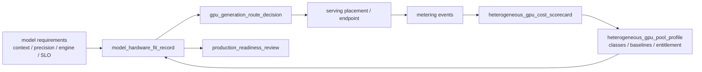
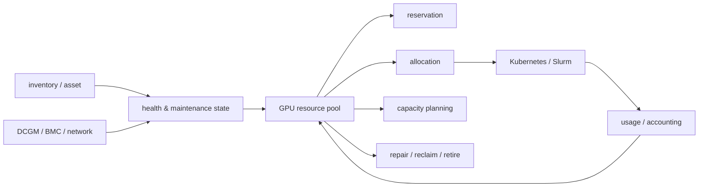

# 第 28 章：GPU 资源池

## 28.1 导读

### 28.1.1 本章回答的问题

- GPU inventory、allocation、reservation、reclaim、health state 和 maintenance state 如何组成资源池？
- 为什么 GPU 资源池不能只是一张资产表？
- 容量规划如何连接业务需求、模型需求和硬件采购？


### 28.1.2 本章上下文

- 层级定位：本章属于 `GPU IaaS 层`，重点讨论裸金属、虚拟化、GPU 资源池、镜像、驱动和初始化交付。
- 前置依赖：建议先理解 第 27 章：GPU 虚拟化与隔离 中的核心对象和路径。
- 后续关联：本章内容会继续连接到 第 29 章：镜像、驱动与初始化，并在系统地图、深度标准和读者测试中被交叉引用。
- 读完能力：读完本章后，读者应能把《GPU 资源池》中的概念映射到 AI Factory 的生产路径、工程对象、观测证据和设计取舍。


### 28.1.3 读者测试

- 机制题：读者能否解释 GPU inventory、allocation、reservation、reclaim 的核心机制，以及它们如何共同支撑《GPU 资源池》？
- 边界题：读者能否区分 GPU IaaS、资源编排、节点基线、租户隔离和物理硬件 的责任边界，并说明哪些问题不能简单归因到本章组件？
- 路径题：读者能否从资源申请追到裸金属交付、虚拟化隔离、资源池状态、镜像驱动和节点初始化，并指出本章对象在路径中的位置？
- 排障题：当《GPU 资源池》相关生产症状出现时，读者能否列出第一层证据、下一跳证据、可能 owner 和止血动作？


### 28.1.4 一个真实场景

平台 dashboard 显示还有 200 张 GPU 空闲，但一个 64 卡训练任务仍然 pending。业务团队认为平台调度有问题，调度团队查看后发现，这 200 张 GPU 分散在多个型号和多个资源池：一部分是推理保留容量，一部分处于维修状态，一部分缺少 RDMA，一部分在不同 rack，无法满足任务的拓扑约束，还有一部分虽然空闲但驱动 baseline 不符合训练镜像要求。账面空闲不等于可用。

另一个场景发生在生产推理。某个模型流量上涨，需要快速扩容 32 张同型号 GPU。资源池显示该型号还有余量，但其中一半被低优先级任务占用，另一半已经被大客户预约。调度器如果只看当前 Pod 使用量，会误以为可以扩容；资源池如果知道 reservation、priority 和 reclaim 策略，就能判断哪些资源能立即释放，哪些不能动。

这些问题说明，GPU 资源池不是资产清单，也不是调度器缓存。它是连接硬件、健康、状态、租户、调度、成本和容量规划的事实源。资源池要回答“有多少 GPU”之外的问题：这些 GPU 能做什么，是否健康，属于哪个故障域，被谁预留，正在被谁使用，能否回收，何时维修，是否适合某个 workload。

AI Factory 的资源池成熟度，决定 GPU 产能能否被可靠使用。没有资源池，平台会在调度、运维和成本之间反复对账；资源池不准，调度决策会失真；资源池不含状态，故障节点会反复进入任务；资源池不含能力，用户会拿到不适合模型的 GPU。GPU 昂贵，资源事实必须比普通服务器更精确。

因此，资源池的第一原则是“可用性可解释”。当任务 pending、扩容失败或成本异常时，平台应能说明是资源不足、拓扑不满足、健康隔离、维护窗口、预留占用还是 quota 限制。解释能力本身就是资源池的产品能力。


## 28.2 基础模型

### 28.2.1 核心概念

GPU resource pool 是对 GPU 资产、能力、状态、分配、预留、健康、维护和容量的统一管理。它为 Kubernetes、Slurm、MaaS、训练平台、推理平台、运维系统和成本系统提供资源事实。资源池不是直接替代调度器，而是向调度器提供可用性、能力和状态约束，并从调度器回收实际使用信息。

Inventory 记录 GPU 和节点的静态与半静态事实，包括型号、显存、序列号、节点、槽位、NVLink、NIC、NUMA、机架、交换机端口、driver baseline、资源池归属和租户边界。Health state 描述资源是否适合使用；maintenance state 描述资源是否正在维修、升级、排空或保留；allocation 记录当前分配；reservation 记录未来或保底承诺；reclaim 处理资源释放。

资源池必须管理能力，而不是只管理数量。一个 GPU 是否能承载任务，取决于型号、显存、拓扑、网络、驱动、CUDA/NCCL baseline、MIG profile、节点健康、存储路径和租户策略。两张 GPU 在资产表里可能都是“可用”，但对某个训练任务来说完全不等价。资源池要把这种不等价显式化。

资源池还承担治理功能。它连接 quota、成本、SLA、故障隔离、维修流程和容量规划。业务团队看到的是可申请资源，调度系统看到的是可分配资源，运维团队看到的是健康和维护状态，财务或平台团队看到的是使用和成本。成熟资源池要服务这些角色，但底层事实必须一致。

资源池也不是越中心化越好。它应成为事实协调层，而不是所有系统的替代品。Kubernetes、Slurm、资产系统和监控系统仍有本地职责，资源池通过同步、校验和事件把这些局部事实组合成可治理视图。

如果同一张 GPU 在不同系统中呈现不同状态，资源池应暴露冲突并推动收敛，而不是让用户在多个界面之间自行判断。


### 28.2.2 系统架构

GPU 资源池架构通常包括 inventory collector、health controller、maintenance controller、allocation tracker、reservation service、reclaim controller、capacity planner 和查询 API。Inventory collector 从资产系统、节点探测、BMC、DCGM、Kubernetes、Slurm 和网络系统采集事实；health controller 根据指标和准入结果更新健康；allocation tracker 与调度器同步当前使用；reservation service 管理未来承诺。

资源池的关键是状态机。一个 GPU 或节点可以处于 discovered、validated、allocatable、reserved、allocated、draining、maintenance、isolated、retired 等状态。状态之间必须有合法流转：故障触发 isolated，维修触发 maintenance，复测通过后回到 allocatable，退役进入 retired。若状态只是自由文本，自动化无法可靠执行。

资源池应同时支持节点级、GPU 级和资源池级视图。节点级视图用于运维，GPU 级视图用于细粒度分配和故障隔离，资源池级视图用于容量和业务承诺。某些操作按节点执行，例如维修和驱动升级；某些操作按 GPU 执行，例如单卡故障隔离；某些操作按 pool 执行，例如推理保留容量或训练资源扩容。

架构还要处理事实冲突。资产系统说节点在生产，调度器说节点不可用，监控显示 GPU Xid，资源池应能保留来源、时间和优先级，而不是简单覆盖。GPU 资源事实来自多个系统，冲突不可避免。成熟资源池要有 reconcile 逻辑和人工确认路径，把事实差异变成可处理事件。

查询路径也要分层。调度器需要低延迟、机器可读的资源能力和状态；用户界面需要解释等待原因；容量团队需要历史趋势；运维团队需要节点和硬件证据。同一份事实可以有不同视图，但不能有不同结论。否则多系统对账会吞掉平台效率。

这也是资源池 API 设计的核心：既要服务自动化调度，也要服务人类排障和经营分析。

在多租户平台中，资源池还必须有 entitlement 视图。`resource_pool_entitlement` 描述某个租户、项目或服务等级可以使用哪些资源等级、是否允许共享、是否可以预留、能否借用低优资源、需要什么审批。没有 entitlement，调度器只能看到资源可用，却不知道某个租户是否有资格使用这组 GPU；计费系统也无法区分正常共享、专属承诺和越权分配。

```yaml
resource_pool_entitlement:
  entitlement_id: ent-enterprise-a-premium
  tenant_id: enterprise-a
  projects:
    - customer-service-prod
  allowed_resource_classes:
    - gpu-container-full-card
    - gpu-mig-dedicated-profile
  denied_resource_classes:
    - gpu-time-slicing-best-effort
  data_classification:
    max_allowed: confidential
  sharing_policy:
    allow_shared_node: false
    allow_shared_gpu: false
    allow_same_tenant_colocation: true
  reservation_policy:
    max_reserved_gpu: policy_defined
    max_duration: policy_defined
    approval_required: true
  preemption_policy:
    can_borrow_idle_capacity: true
    can_be_preempted_by: none_for_premium
  audit:
    policy_version: ent-20260619.1
    approved_by: platform-capacity-owner
```

Entitlement 不等同于 quota。Quota 说“最多能用多少”，entitlement 说“允许用什么类型、在什么边界下使用”。一个租户可能有 100 张 GPU quota，但只允许使用专属节点池；另一个租户 quota 较小，却可以使用 best-effort 共享池。把两者混在一起，会导致安全租户被调度到不该使用的共享资源，或低风险任务占用高隔离资源造成浪费。

在真实 AI Factory 中，资源池通常还是异构的。同一个平台可能同时拥有多代 GPU、不同 HBM 容量、不同互联域、MIG profile、不同驱动基线、不同液冷条件和不同电力约束。若资源池只暴露 `gpu=1` 或单一型号标签，调度和模型路由会把不同能力的资源当成等价商品，结果是长上下文模型落到 HBM 不足的池子，FP8 runtime 落到未验收节点，大训练跨过不合适的 fabric，或者高 SLA 推理被路由到尚处 canary 状态的新硬件。

因此，资源池应维护 `heterogeneous_gpu_pool_profile`。它不是资产清单，而是把 GPU 代际、系统形态、runtime baseline、准入状态、适用 workload、故障域和经济口径放在同一个可查询对象里。Kubernetes 传统 device plugin 常用 extended resource 表达整数设备数量，适合简单整卡分配；DRA（Dynamic Resource Allocation）则提供按设备类、属性和 claim 进行声明和分配的更细粒度路径。无论底层使用哪种机制，资源池都应先把能力事实表达清楚，再让调度器消费。

```yaml
heterogeneous_gpu_pool_profile:
  pool_id: gpu-prod-mixed-202606
  purpose: mixed_inference_and_batch
  resource_classes:
    - class_id: h100-full-card-prod
      gpu_family: h100-class
      partitioning: full_card
      hbm_capacity_class: large
      interconnect: nvswitch_or_pcie_recorded
      runtime_baseline: rb-h100-202606
      acceptance_baseline: acc-h100-prod-202606
      production_state: production
      allowed_workload_tiers:
        - premium_chat_short_context
        - batch_inference
        - selected_finetuning
    - class_id: h200-long-context-prod
      gpu_family: h200-class
      partitioning: full_card
      hbm_capacity_class: extra_large
      runtime_baseline: rb-h200-202606
      acceptance_baseline: acc-h200-long-context-202606
      production_state: validated
      allowed_workload_tiers:
        - long_context_inference_canary
        - retrieval_heavy_generation
    - class_id: b200-canary
      gpu_family: b200-or-newer-class
      partitioning: full_card_or_mig_if_validated
      runtime_baseline: rb-b200-canary-202606
      acceptance_baseline: acc-b200-canary-202606
      production_state: canary
      blocked_workload_tiers:
        - premium_inference_without_route_fallback
        - large_pretraining_without_full_thermal_soak
  governance:
    entitlement_required: true
    model_hardware_fit_required: true
    gpu_generation_route_decision_required_for_serving: true
    heterogeneous_pool_acceptance_matrix: hpa-mixed-prod-202606
```

这个对象把“异构”从口头事实变成调度事实。`production_state` 决定资源能否进入生产、灰度或测试；`allowed_workload_tiers` 决定哪些业务形态可以使用；`runtime_baseline` 和 `acceptance_baseline` 决定能力是否经过验证；`model_hardware_fit_required` 则强制模型服务不能只按价格或空闲率路由。资源池不需要替代 Kubernetes、Slurm 或 Gateway，但要为它们提供同一份能力边界。

异构池的核心风险是“隐性降级”。同一模型在成熟 GPU 上满足 TPOT，在新 GPU canary 上因为 runtime 未适配反而更慢；某个旧 GPU 单卡吞吐低，但对低价批量任务毛利更好；某个高 HBM 资源池适合长上下文，却被短请求抢占。资源池要把这些差异暴露给模型路由和容量系统，否则优化会被平均值掩盖。



这条链路能解释为什么“有 GPU”不等于“适合这个模型”。模型要求先和硬件能力匹配，匹配结果再进入路由、服务、计量和成本 scorecard。PRR 消费的是匹配证据，而不是只消费库存数量。后续第 35 章会说明模型硬件匹配，第 38 章会说明异构池验收，第 41 章会说明不同 GPU class 的经济比较，第 44 章会把它们纳入上线门禁。

资源池还需要显式管理切分策略。MIG、整卡容器、VM passthrough、vGPU、time-slicing、MPS 和用户态配额不是调度器的临时实现细节，而是资源池产品形态。`gpu_slicing_policy` 应描述哪些 GPU class 允许切分、允许哪些 profile、profile 变更是否需要 drain、哪些租户可使用共享池、哪些 workload 禁止共享、碎片如何回收、计费如何折算。没有切分策略，平台会在利用率压力下不断临时切卡，最后形成无法解释的 profile 碎片和 SLA 争议。

```yaml
gpu_slicing_policy:
  policy_id: gsp-inference-20260620
  scope:
    resource_pool: inference-shared
    gpu_classes: [h100-full-card-prod, h200-long-context-prod]
  allowed_modes:
    mig:
      allowed: true
      profiles: [small_inference, medium_inference]
      reconfigure_requires_drain: true
    time_slicing:
      allowed: true
      max_replicas_per_gpu: policy_defined
      allowed_workloads: [dev_test, low_priority_batch]
    mps:
      allowed: conditional
      allowed_workloads: [same_tenant_batch]
  denied_workloads:
    - premium_low_latency_inference
    - confidential_training
    - large_distributed_training
  accounting:
    unit: profile_or_shared_gpu_time
    noise_discount_or_sla: best_effort_policy
```

显存超分也应被治理，而不是让运行时自行冒险。显存超分可以通过按需分页、统一内存、CPU/主机内存分层、压缩、冷数据迁移或访问预测提高表面可承载量，但它会引入 page fault、尾延迟、OOM、QoS 违约和恢复复杂度。资源池应维护 `gpu_memory_overcommit_policy`，明确哪些池允许 overcommit、最大比例、保留水位、触发降级、禁止场景和观测指标。在线高 SLA 推理、长训练和强同步任务通常不应依赖显存超分；开发测试、离线批处理和可重试任务可以在明确风险下使用。

```yaml
gpu_memory_overcommit_policy:
  policy_id: gmop-devtest-20260620
  scope:
    resource_pool: gpu-devtest-shared
  allowed: true
  max_overcommit_ratio: policy_defined
  mechanisms:
    demand_paging: allowed_if_runtime_validated
    cpu_memory_tiering: allowed_for_batch
    compression: experimental
  guardrails:
    reserved_memory_for_system: required
    oom_preemption_order: low_priority_first
    qos_blocked_tiers: [premium_inference, production_training]
  required_metrics:
    - gpu_memory_fault_rate
    - p95_tpot_or_step_time
    - oom_count
    - eviction_count
```

远程 GPU 资源也要有契约。若平台支持 API proxy、虚拟设备或跨节点 GPU service，资源池必须记录远端 GPU 所在地域、网络路径、带宽延迟、认证、数据边界、错误传播、重试语义和计费方式。`remote_gpu_access_contract` 应明确调用方看到的是“远端加速服务”，不是本地裸 GPU。否则网络抖动、代理错误或远端 reset 会被用户误判为本地 GPU 异常。

```yaml
remote_gpu_access_contract:
  contract_id: rgac-batch-20260620
  mode: api_proxy_or_virtual_device
  allowed_workloads: [offline_inference, batch_embedding, dev_test]
  denied_workloads: [low_latency_serving, tightly_synchronized_training]
  network_requirements:
    min_bandwidth: policy_defined
    max_rtt: policy_defined
    encryption: required_if_cross_tenant
  failure_semantics:
    remote_reset_visible_to_client: true
    retry_policy: idempotent_jobs_only
  accounting:
    bill_gpu_time_and_network_egress: true
```




## 28.3 关键技术

### 28.3.1 GPU inventory

GPU inventory 记录资产和能力事实。基础字段包括 GPU 型号、序列号、显存、节点、槽位、PCIe 地址、NVLink 组、NUMA、连接的 NIC、机架、交换机端口、BMC、驱动版本、固件、资源池、租户归属和保修状态。对 AI Factory 来说，这些字段不是可选装饰，而是调度、准入、维修和成本归因的基础。

Inventory 应尽量自动采集并与资产系统对账。GPU 更换、NIC 更换、线缆调整、节点迁移、MIG 重配、驱动升级都会改变资源事实。若这些变化只停留在维修记录或人工表格中，调度系统仍会按旧事实工作。自动发现可以来自 `nvidia-smi`、DCGM、PCIe 拓扑、BMC、交换机 LLDP、Kubernetes Node、Slurm node 和资产 API。

Inventory 的质量直接影响故障定位。训练任务在某个 rank 上变慢时，平台需要知道该 rank 对应哪张 GPU、哪块 NIC、哪个 rack、哪条 rail、哪个交换机端口和哪条软件基线。若 inventory 不准，排障会从技术问题变成找机器问题。资源池必须把逻辑资源映射到物理资源。

Inventory 还要支持历史记录。当前 GPU 在哪里不够，还要知道它何时更换过、维修过、验收过、从哪个 pool 迁移来、使用过哪些 baseline。很多故障具有批次性和历史性。没有历史，平台只能处理单点事件，无法发现某批硬件、某次维修或某个固件版本带来的系统性风险。

Inventory 质量应被度量。未知字段、冲突字段、过期字段和人工覆盖字段都应统计出来。资源事实如果缺少质量指标，团队会默认它可信，直到调度或维修事故暴露问题。资产数据本身也需要 SLO。

例如，交换机端口未知、GPU 序列号缺失或拓扑字段过期，都应被视为资源事实风险。


### 28.3.2 allocation

Allocation 是把资源分配给作业、服务、租户、项目或资源池的过程。它可以是短生命周期的 Pod 调度，也可以是长生命周期的租户独占或模型服务保留。Allocation 记录应包含使用方、资源对象、开始时间、预期结束时间、实际结束时间、workload 类型、优先级、成本标签和调度来源。

Allocation 必须与调度系统同步。Kubernetes 和 Slurm 看到的使用状态，是实际执行事实；资源池看到的 allocation，是平台治理事实。二者不一致会造成严重问题：调度器认为资源空闲但资源池认为已预留，会导致无法利用；调度器已经分配但资源池未记录，会导致账单和 quota 缺失。同步需要事件和定期 reconcile 两种机制。

Allocation 还要区分已分配、实际使用和有效产出。一个训练任务分配了 64 张 GPU，但可能在 NCCL 初始化阶段失败；一个推理服务保留了 16 张 GPU，但低峰只使用一半。容量和成本分析不能只看分配数量，还要看运行时利用率、任务成功率、tokens/s、checkpoint 和业务价值。资源池提供的是成本归因入口。

工程上，allocation 应支持幂等释放。任务失败、控制面异常、节点失联或用户取消，都可能让资源处于半释放状态。资源池应能检测孤儿 allocation、过期 allocation 和异常占用，并触发 reclaim。GPU 资源昂贵，资源泄漏会迅速变成可见成本。

Allocation 还应关联 workload 结果。资源被占用不代表创造了价值，成功完成、失败重试、被抢占、超时取消和产物注册失败的经济含义不同。把 allocation 与 job、model、checkpoint、token 指标关联起来，才能解释 GPU 消耗是否有效。

这种关联能帮助平台区分“资源忙”和“资源产生有效产出”，两者在经营分析中不是一回事。


### 28.3.3 reservation

Reservation 是提前为某个租户、任务、模型服务或 SLA 保留资源。在线推理高峰、重要训练窗口、客户专属交付、发布评测和维护前迁移都可能需要 reservation。Reservation 的价值是提供确定性：业务知道某个时间窗口有可用 GPU，平台知道这些资源不能被低优先级任务长期占用。

Reservation 会降低共享利用率，因此必须有范围、期限和成本。长期无期限预留会把资源池切碎，让账面利用率下降。平台应记录 reservation 的资源类型、数量、能力约束、开始结束时间、使用方、优先级、是否允许借用、是否可抢占以及成本归属。保留容量是一种承诺，承诺应有价格。

Reservation 与 allocation 不同。Reservation 是资源承诺，allocation 是实际使用。一个保留资源可能暂时空闲，平台可以允许低优先级任务借用，但必须在保留方需要时可回收。借用策略如果不清晰，会造成生产服务扩容失败或高优先级训练无法启动。Reservation、borrowing 和 preemption 必须一起设计。

工程上，reservation 应与日历和容量规划连接。大训练任务、发布窗口和客户活动都有时间属性。平台应能看到未来资源承诺，而不是只看当前空闲。没有未来视图，调度系统会把短期空闲误判为可自由使用，导致关键窗口前资源无法收回。

Reservation 还需要冲突检测。两个团队可能预留同一类 GPU 的相同时间窗口，或者维护计划与业务保留冲突。资源池应在创建 reservation 时检查能力、数量、故障域和维护窗口，避免把冲突留到执行当天。

预留审批也应展示机会成本，让业务方理解确定性资源会减少共享池弹性。

这是资源治理问题。


### 28.3.4 reclaim

Reclaim 是回收不再使用或不应继续占用的资源。它包括任务完成后的正常回收、异常任务清理、抢占回收、租户到期回收、维修回收、reservation 到期回收和退役回收。GPU 资源回收不能只删除调度对象，还要确认设备、进程、显存、MIG profile、临时数据、网络和监控状态恢复到可复用状态。

最常见的 reclaim 问题是残留。容器退出但 GPU 进程仍在，显存未释放；MIG profile 被修改但标签未更新；本地 NVMe 还留有数据；节点从训练池回到推理池但驱动 baseline 不一致。残留问题会影响下一个任务，也可能造成安全风险。资源池应把回收验证作为状态流转的一部分。

Reclaim 还与抢占相关。低优先级任务借用资源后，高优先级 reservation 到来时，平台需要回收这些资源。回收策略要区分 workload：批量推理可以重跑 shard，训练任务需要 checkpoint，在线推理需要先摘流量再释放。粗暴回收会制造更多失败成本。资源池应记录 reclaim 原因和影响。

工程实现上，reclaim 应具备超时和升级路径。某个资源无法释放时，平台应自动标记异常、隔离节点、通知运维或触发重置，而不是无限等待。回收失败是资源泄漏的重要来源。GPU 资源池的闭环能力，很大程度体现在 reclaim 能否可靠完成。

Reclaim 还应区分安全清理和性能恢复。安全清理关注数据、凭据和缓存是否残留，性能恢复关注 GPU、MIG、驱动、进程和节点状态是否回到基线。两个目标都满足，资源才适合再次分配。

回收完成后应留下验证记录，否则平台无法证明资源复用是安全且干净的。第 27 章中的 `clean_to_reuse_record` 应在这里成为状态流转门禁：allocation 释放后进入 reclaim，清理和复验通过后才能进入 allocatable；失败则进入 quarantine 或 maintenance。资源池不能只相信 Pod 删除、VM 删除或租约结束，因为这些动作只说明控制面对象消失，不说明设备、缓存、凭据和本地数据已经恢复到可复用状态。

资源池还应记录 `security_audit_event`。创建 reservation、修改 entitlement、解除 isolation、强制 reclaim、手工覆盖 inventory、访问完整 GPU UUID 和邻居租户信息，都属于高价值操作。审计事件至少包含操作者、租户、资源对象、旧值、新值、审批、原因、策略版本和影响范围。GPU 资源池中的状态变更直接影响成本、隔离和 SLA，不能只靠普通操作日志。

```yaml
security_audit_event:
  event_id: sae-20260619-0001
  time: measured
  actor:
    type: human
    id: sre-oncall-a
    role: gpu-pool-admin
  action: override_resource_state
  resource:
    node: gpu-node-001
    gpu_uuid: GPU-xxxx
    pool: inference-premium-a
  before:
    state: quarantine
  after:
    state: allocatable
  evidence:
    clean_to_reuse_record: ctr-20260619-0001
    dcgm_health: passed
    approval_ticket: ticket-123
  impact:
    tenants_potentially_affected: [enterprise-a]
    capacity_delta_gpu: 1
```


### 28.3.5 health state

Health state 描述资源是否健康以及适合哪些 workload。GPU health 不只是 up/down，还包括 Xid、ECC、温度、功耗、降频、NVLink error、PCIe replay、掉卡、HBM 异常、DCGM 诊断、NCCL test、RDMA test、容器 GPU smoke test 和历史故障趋势。健康状态应是多信号综合结果。

Health state 应影响调度。Healthy 资源可以进入生产训练或推理，degraded 资源可以进入低风险测试或隔离观察，unhealthy 资源应从可调度池移除，unknown 资源不应默认可用。很多平台把 unknown 当 healthy，导致新接入或监控缺失节点直接进入生产，这是高风险做法。

健康状态还要有来源和时间。一次 Xid、一次 DCGM fail、一次人工标记、一次准入测试失败，可信度和处理方式不同。资源池应记录健康信号来源、发生时间、阈值和自动动作。否则运维无法判断节点为什么被隔离，用户也无法理解为什么资源减少。

Health state 不是静态标签，而是控制循环。节点运行中持续上报指标，异常触发 drain 或隔离，维修后复测，复测通过后回池。对长训练任务来说，健康状态越准确，任务踩到坏资源的概率越低。健康管理直接影响训练成功率和 GPU 经济性。

健康状态还应支持分级使用。某些轻微降级资源不适合生产训练，但可以用于短时调试、低优先级评测或维修后观察。把所有异常都等同于彻底下线，会降低可用性；把所有异常都忽略，会增加生产失败。分级状态能表达更细的风险。

健康判断也要避免只看单点指标。GPU、NIC、NVLink、存储和温度之间存在关联，一张 GPU 的错误可能来自节点散热或网络链路。资源池应保留跨组件上下文，帮助运维判断根因。

生产资源池应把健康判断固化为 `resource_health_record`，而不是散落在监控告警、工单和人工备注里。这个对象记录健康信号、状态转移、影响范围和调度动作。示例：

```yaml
resource_health_record:
  resource:
    type: gpu
    id: gpu-node-017-2
    node: gpu-node-017
    pool: training-prod-h100
    fault_domain: rack-12/power-a/rail-1
  signals:
    dcgm: xid_detected
    ecc: clean
    nvlink: error_rate_increased
    rdma: baseline_ok
    thermal: normal
    acceptance_baseline: h100-rack12-20260619
  state:
    previous: healthy
    current: degraded
    reason: repeated_nvlink_error
    confidence: high
  scheduling_policy:
    allow_workload: [debug, low_priority_evaluation]
    deny_workload: [distributed_training, premium_inference]
    require_retest: [nvbandwidth, nccl_single_node]
  audit:
    detected_at: recorded
    owner: gpu-platform-sre
    expires_or_rechecks_at: policy_defined
```

这个记录解决三个问题。第一，调度器能消费结构化状态，而不是解析告警文本。第二，SRE 能解释资源为什么降级、何时复测、哪些任务受影响。第三，容量和成本系统能计算 degraded 资源造成的可用产能损失。健康状态一旦进入统一记录，就可以从“设备问题”变成资源治理对象。


### 28.3.6 maintenance state

Maintenance state 表示资源正在维修、升级、排空、复测或退役。进入维护状态的节点不应接收新任务，已有任务需要 drain、迁移、等待完成或被抢占。维护状态把基础设施变更从隐性动作变成显式资源状态，避免调度器把任务放到变化中的节点。

维护状态应与变更管理结合。驱动升级、OS image 更换、固件升级、网络布线、交换机维护、机房电力操作、GPU 更换和本地盘维修，都应通过资源池状态机反映。变更窗口内，资源池应展示影响范围、预计恢复时间、负责人和回滚路径。否则用户只会看到资源突然减少。

Maintenance state 还要区分 planned 和 unplanned。计划维护可以提前迁移 workload，临时故障则需要快速隔离和告警。二者对 SLA 和成本的影响不同。资源池如果只用一个 maintenance 标签，平台无法区分正常变更和故障维修，也无法做准确容量预测。

维修完成后不能直接回到 allocatable。节点应重新跑对应准入测试：GPU、NCCL、RDMA、存储、容器和监控。更换硬件后还要更新 inventory。维护状态的结束条件必须是“验证通过”，而不是“人说修好了”。这条规则能减少重复故障回流。

维护状态还应影响容量视图。计划维护占用的是未来可用产能，突发维护占用的是当前可靠性预算。容量规划如果忽略 maintenance，会高估可用资源。平台应同时展示当前维护和未来维护窗口。

对用户来说，维护原因也要可见。知道资源减少是因为计划升级、硬件维修还是故障隔离，可以减少无效沟通，并帮助业务安排训练和发布窗口。

维护可见性越好，业务越容易接受资源短期不可用。

维护窗口也应被结构化，而不是停留在日历事件。`maintenance_window` 至少应描述范围、原因、drain 方式、容量影响、复测项、回滚和沟通对象：

```yaml
maintenance_window:
  window_id: maint-driver-20260619-rack12
  type: planned
  scope:
    resource_pool: training-prod-h100
    racks: [rack-12]
    nodes: 16
  reason: nvidia_driver_baseline_upgrade
  drain:
    stop_new_allocations: true
    wait_for_training_checkpoint: true
    inference_replica_migration: not_applicable
  capacity_impact:
    gpu_unavailable: 128
    affected_reservations: [foundation-train-window-042]
    risk_to_slo: medium
  validation_before_return:
    - bootstrap_validation
    - nccl_multi_node
    - container_gpu_runtime
    - acceptance_baseline_diff
  rollback:
    target_baseline: gpu-node-2026-05
    max_recovery_time: policy_defined
```

维护窗口的关键是让“资源暂时消失”有解释、有边界、有结束条件。若维护没有 drain 规则，训练任务会被粗暴中断；若没有复测项，坏节点会回流；若没有容量影响，业务会在维护当天才发现 reservation 无法兑现。维护状态必须和资源池、变更系统、调度器和 SLO 预算联动。

维护窗口还应显式触发 baseline 失效。更换 NIC、升级 driver、重插线缆、调整液冷、维修 PDU 或替换 GPU 后，资源不应因为维护窗口关闭就回到 allocatable，而应先生成 `baseline_invalidation_record`，把受影响能力降级，再由第 38 章的复测计划恢复能力。资源池状态机可以把维护结束拆成三步：`maintenance_completed`、`baseline_retest_passed`、`allocatable_restored`。这能避免“工单关闭等于资源健康”的常见误判，也让容量系统看见维护造成的真实产能损失。


### 28.3.7 故障隔离

故障隔离是把异常资源从可调度池中移除，并限制故障影响范围。触发源可以是 GPU Xid、ECC 趋势、NVLink error、NCCL test 失败、RDMA error、存储异常、温度告警、功耗异常、掉卡、容器 runtime 故障或用户任务重复失败。隔离的目标，是让坏资源不再继续消耗任务成本。

隔离策略要避免过度敏感。偶发错误、可恢复错误、持续错误和高风险错误应分级处理。一次轻微告警可能进入观察状态，连续错误应进入 degraded，高风险错误直接 isolated。阈值和规则要结合硬件经验、业务风险和 workload 类型。训练生产池的阈值应比开发测试池更严格。

故障隔离后要自动收集证据。包括 DCGM、dmesg、NVIDIA 日志、BMC 事件、交换机端口、NCCL test、最近任务、温度和功耗曲线。证据收集越及时，维修和供应商沟通越高效。没有证据的隔离会变成“先下线再说”，长期看会降低可用资源并增加争议。

隔离还要有复测和解除流程。资源不能永远停留在 isolated，也不能未经验证直接回池。平台应定义维修、复测、观察和回池状态。若同一 GPU 多次隔离，应升级为硬件更换或退役。故障隔离的价值在闭环，而不是只把节点从调度器摘掉。

隔离策略也要考虑故障域。若同一 rack、同一 rail 或同一批次节点集中异常，平台不应只隔离单卡，而应扩大排查范围。AI 集群故障经常呈现相关性，资源池需要帮助团队发现这种模式。

隔离事件还应进入成本分析。坏资源导致的重跑、抢占和排队都是真实成本。把故障成本量化，才能推动硬件维修、供应商治理和容量冗余决策。


### 28.3.8 capacity planning

Capacity planning 把业务需求转换成 GPU、网络、存储、电力、机房和人员运维需求。输入不应只有“需要多少张 GPU”，还应包括模型类型、训练计划、推理流量、tokens/s、上下文长度、SLA、利用率目标、冗余、故障率、交付周期和增长预测。AI Factory 的容量规划是业务、模型和基础设施的联合问题。

容量规划必须按能力维度建模。不同 GPU 型号、显存、网络、功耗和软件栈承载的 workload 不同。推理可能更关注 cost per token、tokens/W、模型并发和 KV Cache；训练更关注多节点拓扑、NCCL 带宽、checkpoint 存储和连续节点。把所有 GPU 折算成一类资源，会误导采购和调度。

资源池提供容量规划的事实基础。历史 allocation、reservation、queue waiting、reclaim、health、maintenance、利用率和失败率，可以反映真实需求和浪费。比如某类 GPU 利用率高但排队不长，可能是混部有效；某类 GPU 排队长但利用率不高，可能是拓扑碎片或 reservation 过多。容量规划要解释这些差异。

规划还要考虑供应链和交付 lead time。GPU 采购、机房电力、制冷、网络、存储、上架、验收和软件基线都需要时间。业务需求增长往往快于基础设施交付。资源池如果能提供未来 reservation、增长趋势和维护容量，平台就能更早启动扩容，而不是等队列爆满后再采购。

容量规划还要区分峰值、保底和弹性需求。在线推理需要保留容量，大训练需要连续窗口，实验任务可以等待或抢占。不同需求不能简单相加。资源池提供的历史等待、利用率和抢占数据，是把需求拆分成不同资源产品的依据。

这能避免用昂贵的生产资源承载本可等待的实验需求。

容量规划还必须把 ROI 和技术成熟度放在一起看。GPU 虚拟化、切分、远程调用和显存超分都可能提高利用率，但它们也会增加工程复杂度、事故概率、性能噪声和排障成本。收益应按硬件节省、能耗节省、排队减少、上线速度和可售资源增加计算；成本应按软件研发、license、运维、故障重跑、SLA 赔付、安全审计和迁移成本计算。若共享策略让训练失败率上升，账面利用率提升可能被重跑成本抵消。

```yaml
gpu_resource_roi_record:
  initiative: mig_and_timeslicing_for_inference_devtest
  baseline:
    average_gpu_utilization: measured
    queue_wait_time: measured
    cost_per_successful_job: measured
  expected_benefit:
    hardware_deferral: calculated
    queue_reduction: calculated
    developer_throughput: estimated
  expected_cost:
    engineering_effort: planned
    operational_complexity: assessed
    incident_risk_cost: estimated
    quality_or_latency_risk: assessed
  decision:
    rollout_scope: devtest_then_selected_inference
    production_gate: required
```

资源池还应接入 `rack_capacity_unit` 和 `capacity_activation_record`。容量规划里至少要同时展示四个数字：installed GPU、accepted GPU、allocatable GPU 和 workload-fit GPU。Installed GPU 是设备数量，accepted GPU 是通过准入的数量，allocatable GPU 是当前可调度数量，workload-fit GPU 是满足某类任务拓扑、电力、制冷、网络和存储要求的数量。只有最后一个数字，才适合用来承诺具体业务。

```yaml
capacity_view:
  resource_pool: training-prod-h100
  scope: rack_capacity_unit
  capacity_counts:
    installed_gpu: recorded
    accepted_gpu: calculated
    allocatable_gpu: calculated
    fit_for_512_gpu_training: calculated
    fit_for_premium_inference: calculated
  limiting_factors:
    power_limited_gpu: calculated
    cooling_limited_gpu: calculated
    fabric_limited_gpu: calculated
    storage_limited_gpu: calculated
    maintenance_gpu: calculated
  activation_records:
    - dc-a-rack-12-2026-06
```

这个视图能解释扩容争议。采购团队说 GPU 到货，设施团队说 rack 已上电，平台团队却不能承诺大训练，是因为 workload-fit GPU 还受 power、cooling、fabric、storage 或准入状态约束。资源池把这些约束展开，容量讨论就不再停留在“还有多少卡”。


## 28.4 工程落地

### 28.4.1 工程实现

工程实现应先定义资源对象模型。GPU、node、pool、allocation、reservation、health event、maintenance event 和 capacity forecast 应有稳定字段和生命周期。资源对象示例：

```yaml
gpu:
  id: gpu-node-001-3
  model: h100-class
  node: gpu-node-001
  health: healthy
  maintenance: none
  allocatable: true
  topology:
    numa: 0
    nvlink_group: group-a
    rdma_nic: mlx5_0
  owner:
    pool: training-prod
    tenant: shared
```

第二步是实现 reconcile。资源池定期从资产系统、Kubernetes、Slurm、DCGM、BMC、网络和存储系统拉取事实，并与自身状态对比。冲突时生成事件，而不是静默覆盖。例如调度器显示节点 allocatable，但 DCGM 报告 GPU unhealthy，资源池应触发隔离或人工确认。Reconcile 是资源事实可信的基础。

第三步是暴露 API 和事件。调度器需要查询可用资源和约束，平台需要创建 reservation，运维需要标记 maintenance，成本系统需要读取 allocation，容量系统需要读取历史趋势。资源池不应只提供 dashboard，而应成为可编程事实源。所有写操作都要有审计记录。

第四步是建立资源动作闭环。健康异常触发隔离，维护完成触发复测，reservation 到期触发回收，allocation 超时触发清理，容量短缺触发规划。资源池的价值在动作，而不是数据展示。只展示 GPU 数量的系统，还没有真正管理资源。

第五步是建立权限和审计。谁能创建 reservation，谁能把节点置为 maintenance，谁能解除 isolation，谁能修改 inventory，都应有权限控制和审计日志。GPU 资源池承载昂贵产能，状态变更等价于资源分配决策，不能缺少治理。

第六步是为调度器提供稳定接口。接口应能返回可用资源、能力标签、排除原因、预留冲突和健康状态。调度器不应直接拼接多个后端系统，否则资源事实会重新分裂。资源池 API 是平台化的边界。

最后，要定期做资源对账。资产系统、调度器、监控和成本系统之间的资源数量、状态和归属应自动比对。对账不是财务月末动作，而是持续保证资源事实可信的工程机制。


### 28.4.2 常见故障

第一类故障是“空闲但不可用”。总 GPU 数看起来充足，但满足型号、拓扑、RDMA、driver、pool 和 reservation 约束的 GPU 不足。用户看到 pending，平台看到空闲，矛盾来自资源池能力模型缺失。解决方向是按能力维度统计可用资源，而不是只看总数。

第二类故障是健康状态滞后。GPU 已出现 Xid、ECC、NVLink 或 RDMA 错误，但资源池仍标记 healthy，任务被调度后失败。另一个方向也常见：节点修复后状态没有回池，资源长期浪费。健康状态必须由监控、准入和维修流程持续更新，并有复测闭环。

第三类故障是 allocation 泄漏。任务失败或控制面异常后，资源池仍认为 GPU 被占用；或者调度器已经占用资源，资源池没有记录，导致 quota 和成本缺失。泄漏会造成资源不可用、账单不准和容量误判。资源池应定期对账并清理孤儿记录。

第四类故障是 reservation 失控。业务为了保障 SLA 长期保留大量 GPU，但实际使用率很低；低优先级任务借用后无法及时回收，影响高优先级任务；过期 reservation 没有自动释放。Reservation 必须有期限、成本、借用和回收策略，否则会变成隐性资源割据。

第五类故障是资源池与调度器脱节。资源池认为节点不可用，但调度器仍然调度；调度器已经隔离节点，资源池还把它计入容量。解决方向是事件同步、周期对账和冲突告警。任何单向同步都容易在异常时失效。

第六类故障是 capacity planning 只看历史平均。AI 业务增长和模型切换往往不连续，平均利用率无法预测新模型上线、活动高峰或大训练窗口。容量规划必须结合业务计划和模型计划。


### 28.4.3 性能指标

资源池基础指标包括 allocatable GPU、allocated GPU、reserved GPU、maintenance GPU、isolated GPU、unknown GPU 和 retired GPU。所有指标都应按 GPU 型号、资源池、地域、故障域、租户和 workload 类型拆分。总数指标只能看规模，拆分指标才能支持调度和容量决策。

利用率指标包括 GPU utilization、HBM 使用、tokens/s、训练 step time、allocation 时长、reservation 使用率、资源碎片率、借用率和抢占次数。利用率要结合 SLA 和失败率解读。生产推理池利用率过高可能意味着缺少扩容余量，训练池碎片率高可能解释大作业排队。

健康和运维指标包括健康状态分布、Xid/ECC/NVLink/RDMA 事件、隔离次数、复测通过率、维修平均时长、回池时间、重复故障率和 maintenance 计划完成率。这些指标反映资源质量。GPU 数量增长但健康质量下降，实际可用产能并没有等比例增长。

容量指标包括队列等待、未满足需求、reservation 未来承诺、增长预测、采购交付周期、机房电力余量、网络端口余量和存储容量余量。AI Factory 容量瓶颈不一定是 GPU，也可能是网络、存储、电力或交付周期。资源池应把这些约束暴露给容量规划。

指标还要能解释“为什么不可用”。例如空闲 GPU 中有多少因健康隔离不可用，有多少因维护不可用，有多少因 reservation 不可用，有多少因拓扑不满足不可用。这类分解比总利用率更能指导行动。

资源池指标也应进入周度或月度运营复盘。长期 reservation 浪费、重复故障节点、回收失败和容量缺口，都需要跨团队处理。指标只有进入运营节奏，才能改变系统行为。

复盘应产生明确动作，而不是只展示趋势。

动作应有负责人。

也应有期限。


### 28.4.4 设计取舍

第一个取舍是资源模型精度与管理复杂度。模型越细，调度越准确，故障定位越快，但字段、状态和同步逻辑越复杂。只记录 GPU 数量简单，却无法支撑生产训练和多租户推理。成熟平台通常先覆盖型号、健康、pool、allocation 和 reservation，再逐步加入拓扑、成本和故障域。

第二个取舍是预留确定性与共享利用率。Reservation 能保障生产推理和关键训练窗口，但会降低共享池利用率；完全共享利用率高，却可能让关键 workload 无法获得确定资源。解决方式不是取消预留，而是给预留设置期限、成本、借用和回收策略，让确定性有明确代价。

第三个取舍是自动隔离与资源可用性。严格健康策略能减少坏资源进入任务，但可能因为误报降低可用容量；宽松策略提高短期可用量，却增加训练失败和重跑成本。不同资源池应有不同阈值：生产训练和在线推理更严格，实验和开发池可以更宽松。

第四个取舍是集中事实源与系统自治。资源池作为统一事实源有利于治理，但 Kubernetes、Slurm、资产系统和监控系统都有自己的状态。资源池不能简单覆盖所有系统，而应通过 reconcile、事件和审计协调事实。统一不是消灭局部状态，而是让状态冲突可见、可处理。

第五个取舍是短期利用率与长期可靠性。把 degraded 资源继续投入生产可以提高短期可用量，却可能增加失败和重跑；严格隔离会降低可用量，却提高任务成功率。资源池策略应按资源池等级区分，不能全局一刀切。

资源池设计的成熟标志，是能把这些取舍显式呈现给业务和平台负责人。


## 28.5 小结与延伸阅读

### 28.5.1 小结

- GPU 资源池管理的是能力、状态、分配、预留、健康和容量，不只是资产数量。
- Inventory、allocation、reservation、reclaim、health 和 maintenance 必须形成状态闭环。
- 资源池是调度、运维、成本和容量规划之间的事实源。
- 故障隔离和复测决定坏资源能否被挡在生产 workload 之外。
- 容量规划要从业务和 token 需求反推 GPU、网络、存储、电力和交付周期。


### 28.5.2 延伸阅读

- [Kubernetes Nodes documentation](https://kubernetes.io/docs/concepts/architecture/nodes/)；[Device Plugins documentation](https://kubernetes.io/docs/concepts/extend-kubernetes/compute-storage-net/device-plugins/)
- [Kubernetes Dynamic Resource Allocation documentation](https://kubernetes.io/docs/concepts/scheduling-eviction/dynamic-resource-allocation/)
- [NVIDIA DCGM documentation](https://docs.nvidia.com/datacenter/dcgm/latest/)
- [Karpenter documentation](https://karpenter.sh/docs/)
