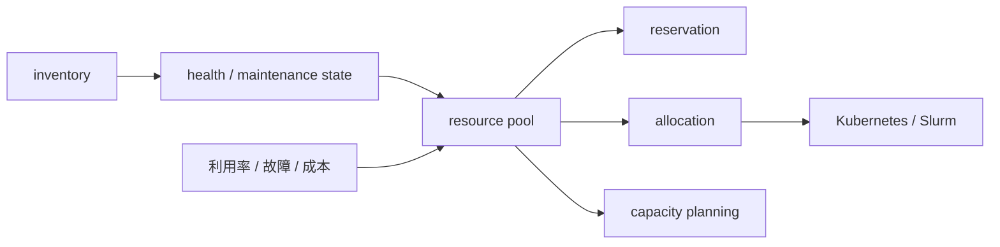

# 第 28 章：GPU 资源池

## 本章回答的问题

- GPU inventory、allocation、reservation、reclaim、health state 和 maintenance state 如何组成资源池？
- 为什么 GPU 资源池不能只是一张资产表？
- 容量规划如何连接业务需求、模型需求和硬件采购？

## 一个真实场景

平台显示还有 200 张 GPU 空闲，但训练任务仍然 pending。排查后发现这些 GPU 分散在多个型号、部分节点处于维修、部分缺少 RDMA、部分被预留给高优先级推理，真正满足任务约束的 GPU 不足。问题出在资源池只统计数量，没有表达能力、状态和约束。

GPU 资源池的核心是把 GPU 从“资产”变成“可调度、可计量、可治理”的资源。

## 核心概念

GPU resource pool 是对 GPU 资产、状态、分配、预留、健康、维护和容量的统一管理。它为调度器、MaaS、训练平台和运维系统提供资源事实。

资源池必须知道 GPU 的能力：型号、显存、拓扑、网络、驱动、软件栈、健康和租户归属。只记录 GPU 数量没有意义。

## 系统架构



资源池是调度和容量规划之间的桥梁。

## 28.1 GPU inventory

GPU inventory 记录资产和能力，包括 GPU 型号、序列号、显存、节点、槽位、NVLink、NIC、机架、交换机端口、驱动和状态。Inventory 应自动采集并与资产系统对账。

Inventory 不准确会导致调度错误、维修错误和账单错误。GPU 更换、节点维修和线缆调整后，资产信息必须更新。

## 28.2 allocation

Allocation 是把资源分配给作业、服务、租户或资源池的过程。分配可以是瞬时的 Pod 调度，也可以是长期租户独占。资源分配应记录开始时间、结束时间、使用方、用途和成本归属。

Allocation 必须和调度系统同步。调度器认为资源空闲，但资源池认为已预留，会导致冲突；反之会导致资源闲置。

## 28.3 reservation

Reservation 是提前为某个租户、任务或 SLA 保留资源。在线推理高峰、重要训练窗口、客户专属交付都可能需要预留。Reservation 提高确定性，但降低共享利用率。

预留应有过期时间和回收策略。长期无使用的预留会浪费资源。平台应展示预留成本，让业务方知道确定性的价格。

## 28.4 reclaim

Reclaim 是回收不再使用或低优先级占用的资源。它包括任务完成回收、异常任务清理、抢占回收、租户到期回收和维修回收。

GPU 回收要处理残留进程、显存、MIG 配置、容器状态、临时数据和节点健康。回收后应执行轻量健康检查，确认资源可再次分配。

## 28.5 health state

Health state 描述资源是否健康。GPU health 不只是 up/down，还包括 ECC、Xid、温度、功耗、NVLink、PCIe、掉卡、性能降级和准入测试结果。

健康状态应影响调度。处于 degraded 的 GPU 可以用于低风险测试，但不应进入生产训练。状态变更要有来源和时间，避免误判。

## 28.6 maintenance state

Maintenance state 表示资源是否处于维修、升级、排空或保留。进入维护状态的节点不应接收新任务，已有任务需要排水或迁移。

维护状态要和变更管理结合。驱动升级、硬件维修、网络调整和机房操作都应通过状态机进入资源池，避免业务任务被调度到变化中的节点。

## 28.7 故障隔离

故障隔离是把异常资源从可调度池中移除，并限制影响范围。GPU Xid、ECC、NCCL test 失败、链路错误都可能触发隔离。隔离后应自动收集证据，进入维修或复测流程。

隔离策略要避免过度敏感。偶发错误和持续故障应区别处理。错误阈值、复测流程和人工确认需要定义清楚。

## 28.8 capacity planning

Capacity planning 把业务需求转换成 GPU、网络、存储和机房需求。它需要输入：模型类型、tokens/s、训练计划、SLA、利用率目标、故障冗余和增长预测。

容量规划不能只按 GPU 数量。不同 GPU 型号、显存、网络、功耗和软件栈决定可承载 workload。Token Factory 视角下，还要看 cost per token 和 tokens/W。

## 工程实现

GPU 资源记录示例：

```yaml
gpu:
  id: gpu-node-001-3
  model: h100-class
  node: gpu-node-001
  health: healthy
  maintenance: none
  allocatable: true
  topology:
    numa: 0
    nvlink_group: group-a
    rdma_nic: mlx5_0
  owner:
    pool: training-prod
```

这类记录应供调度器和运维系统查询。

## 常见故障

- 空闲 GPU 数量充足，但能力不满足任务需求。
- 维修节点未从资源池移除，任务反复失败。
- 预留资源长期未使用，整体利用率低。
- 资源回收不彻底，残留进程占用显存。
- 健康状态只看节点，不看 GPU 和链路。

## 性能指标

- Allocatable GPU、allocated GPU、reserved GPU、maintenance GPU。
- 按型号和资源池的利用率、碎片率。
- 健康状态分布、隔离次数、复测通过率。
- 回收耗时、残留进程数量。
- 容量缺口、预测增长和采购交付周期。

## 设计取舍

资源池越精细，调度越准确，但管理复杂度越高。预留越多，SLA 越确定，但利用率越低。健康隔离越严格，稳定性越好，但可用资源减少。平台需要把这些取舍显式展示给业务和运维团队。

## 小结

- GPU 资源池管理的是能力和状态，不只是数量。
- Allocation、reservation、reclaim 和 health state 必须闭环。
- 故障资源应自动隔离并进入复测流程。
- 容量规划要从业务和 token 需求反推 GPU、网络、存储和电力。

## 延伸阅读

- TODO: Kubernetes Node / Device Plugin 资源管理文档
- TODO: DCGM 文档
- TODO: GPU 容量规划工程案例
