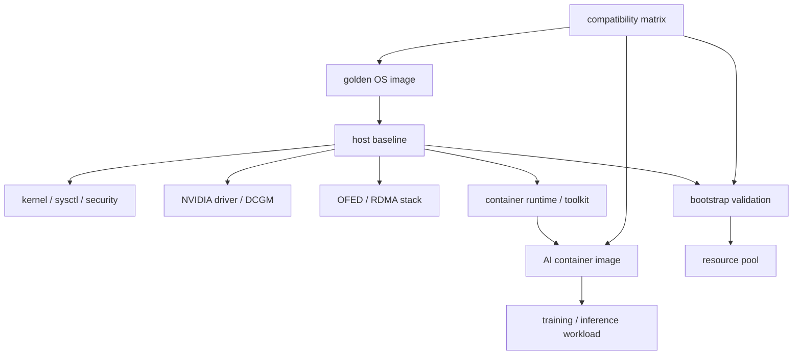
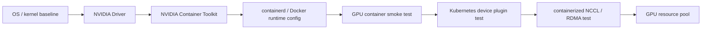
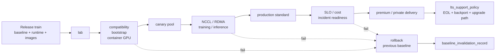
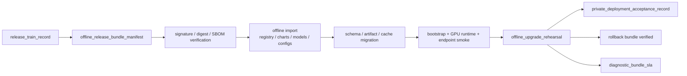

# 第 29 章：镜像、驱动与初始化

## 本章回答的问题

- OS baseline、kernel、NVIDIA driver、CUDA、NCCL、OFED/RDMA stack 和 container image 如何形成可复现环境？
- Golden image 为什么是 GPU IaaS 的关键交付物？
- 节点初始化如何避免“同一集群不同节点行为不一致”？

## 一个真实场景

训练任务在 A 节点成功，在 B 节点失败。两台机器 GPU 型号相同，节点标签也相同，但排查后发现内核小版本不同，NVIDIA Driver 安装方式不同，NCCL 库路径不同，OFED 版本不同，容器 runtime 配置也不同。训练团队看到的是“随机失败”，平台团队看到的是“环境漂移”。这种问题很难通过重试解决，因为根因不在模型代码，而在节点环境不可复现。

另一个场景发生在推理集群。某个模型服务在灰度节点上运行正常，扩大到更多节点后出现少量实例无法加载 GPU。原因是部分节点自动安装了新内核，驱动模块没有重新构建；另一些节点使用同名基础镜像，但镜像内容已经被覆盖。平台以为自己在发布同一个模型，实际上运行在多个不同主机基线之上。

镜像、驱动与初始化的目标，是让 GPU 节点从交付之初就处于可验证、可重复、可追溯的状态。主机环境、容器环境和 AI runtime 之间存在兼容关系，不能依靠“看起来版本差不多”来管理。Kernel、driver、CUDA、NCCL、OFED、容器 runtime、推理引擎和训练框架共同决定 workload 是否能稳定运行。

这个场景说明，环境一致性不是开发体验问题，而是 AI Factory 的生产可靠性问题。一个大型训练任务可能跨数百张 GPU，任意少量节点漂移都可能拖慢或中断任务；一个 MaaS 推理平台可能运行多个模型版本，主机和容器兼容性不清会导致灰度不可控。GPU IaaS 必须用 baseline、compatibility matrix、golden image 和 bootstrap validation 管理环境。

环境治理的目标不是追求版本永远不变，而是让变化受控。每一次升级都应有原因、范围、验证、灰度和回滚。这样当任务失败时，平台能判断是业务变化、镜像变化、驱动变化还是节点漂移。

## 核心概念

OS baseline 是 GPU 节点的操作系统和基础配置标准，包含发行版、内核、包源、安全策略、用户、日志、时间同步、审计、基础 agent、容器 runtime 和必要系统参数。Golden image 是经过验证、可重复构建、可追溯的系统镜像。Driver bootstrap 是安装或验证 NVIDIA Driver、RDMA、容器 GPU 访问、监控和节点标签的初始化过程。

CUDA version 在主机和容器之间有边界。主机提供 NVIDIA Driver，容器可以携带 CUDA 用户态库和框架依赖，但容器运行能力受主机驱动支持范围影响。NCCL version 影响分布式训练通信，和 CUDA、driver、网络栈、RDMA、容器环境和训练框架相关。OFED/RDMA stack 影响跨节点通信和容器内设备可见性。

Container image 封装训练或推理应用环境，包括 Python、框架、CUDA 用户态库、NCCL、推理引擎、业务代码和启动脚本。它不是主机环境的替代品。主机负责硬件、驱动、网络和 runtime 边界，容器负责应用依赖。两者必须一起治理，单独固定容器镜像不能保证可复现。

兼容矩阵（compatibility matrix）是本章的核心管理工具。它定义哪些 OS baseline、kernel、driver、CUDA runtime、NCCL、OFED、container base image、训练框架和推理引擎组合被平台支持。矩阵不是文档摆设，而应进入镜像构建、节点初始化、任务准入、故障诊断和升级流程。

矩阵还要有生命周期。新组合从实验进入生产，旧组合逐步冻结和退役。没有退役机制，平台会长期背负越来越多的版本组合，最终无法验证，也无法解释故障。

因此，环境治理的关键不是列出所有可能组合，而是限制生产组合数量，并为每个组合提供验证证据。受控少量组合，通常比名义上兼容一切更可靠。

## 系统架构

镜像、驱动与初始化架构可以分为四层：主机基线层、GPU/网络驱动层、容器运行层和 workload 镜像层。主机基线层提供 OS、kernel、安全和基础 agent；驱动层提供 NVIDIA Driver、RDMA/OFED、DCGM 和设备访问；容器运行层提供 containerd、NVIDIA Container Toolkit、CNI/CSI 和镜像拉取；workload 镜像层提供 PyTorch、vLLM、TensorRT-LLM、NCCL、业务代码和模型服务入口。

这四层必须通过版本和验证连接。Golden image 构建后要生成包清单和校验和；节点初始化要验证 image、kernel、driver、RDMA、runtime 和 agent；容器基础镜像要声明兼容的 driver 和 CUDA 范围；任务提交时可以检查目标资源池是否满足镜像要求。若这些连接断裂，平台无法保证某个 workload 在目标节点上可运行。

架构还要支持变更流水线。新 kernel、新 driver、新 OFED、新基础镜像或新推理引擎，应先进入构建环境，再进入验收集群，跑 GPU、NCCL、RDMA、存储、容器和典型 workload 测试，通过后灰度到生产资源池。生产节点不应直接从外部包源自动升级关键组件。每次变更都要能回滚到上一条稳定 baseline。

节点初始化位于主机镜像和资源池之间。它完成节点身份配置、驱动验证、容器 runtime 配置、RDMA 配置、监控日志接入、拓扑采集、标签写入和 bootstrap validation。初始化成功后，节点进入准入测试；测试通过才进入资源池。环境一致性要在入池前验证，而不是等业务任务失败后再排查。

架构还应包含漂移检测。节点运行一段时间后，包版本、内核、配置、驱动状态和 runtime 配置可能被手工操作或自动更新改变。周期性检测可以把漂移节点隔离或重新初始化，避免它们长期混在生产池中。



对 GPU IaaS 来说，container runtime 不是 Kubernetes 团队的“上层细节”，而是节点交付基线的一部分。节点如果只安装 driver，但没有正确配置 NVIDIA Container Toolkit、containerd runtime handler、device plugin 依赖和容器内 GPU smoke test，就不能算完成交付。因为大多数 AI workload 最终都在容器里运行，主机 `nvidia-smi` 通过只证明硬件和 driver 基础可用，不证明生产 workload 可用。



## 29.1 OS baseline

OS baseline 定义系统版本、内核策略、包源、安全配置、用户和密钥、SSH、日志、审计、时间同步、基础 agent、磁盘布局、容器 runtime 依赖和系统参数。GPU 节点 baseline 还要考虑 IOMMU、PCIe、NUMA、hugepage、文件句柄、网络参数、本地 NVMe 和监控采集。它是节点行为一致性的起点。

Baseline 应最小化不必要差异。业务依赖、Python 包、训练框架和模型服务逻辑应进入容器镜像，而不是随意安装在主机上。主机承担硬件、驱动、网络、runtime、安全和监控职责。主机越干净，节点越容易重装、回滚和对比。把业务依赖装进主机，会让节点变成不可复制的手工环境。

OS baseline 应可构建、可校验、可追踪。平台需要知道镜像由哪个配置生成，包含哪些包，使用哪个内核，应用了哪些安全补丁，通过了哪些测试。节点运行时应上报 baseline 版本。若某些节点 baseline 漂移，资源池应能发现并阻止它们进入生产 workload。

安全补丁和稳定性之间需要平衡。GPU 节点不能长期不打补丁，但自动升级内核或关键包可能破坏 driver、OFED 和容器 runtime。更稳妥的方式是把补丁合入下一版 baseline，经过验收后批量发布。OS baseline 的管理目标，是把安全和稳定都纳入可验证流程。

Baseline 还应区分生产、实验和验收。实验 baseline 可以更快接收新版本，生产 baseline 更强调稳定，验收 baseline 用于验证下一批变更。不同资源池使用不同节奏，比让所有节点同时升级更安全。

Baseline 责任也要明确。主机基线由基础设施团队维护，业务团队通过容器镜像表达依赖。责任混淆会让故障归因变得困难。

边界清晰才能协作。

## 29.2 kernel

Kernel 影响驱动模块、网络栈、文件系统、容器能力、调度行为、cgroup、eBPF 和安全模块。NVIDIA Driver、OFED/RDMA、GPU Direct RDMA、存储客户端和某些监控工具都可能对 kernel 版本敏感。随意升级 kernel，是 GPU 集群环境漂移的高频来源。

生产集群通常应固定 kernel 版本或固定在经过验证的 kernel 系列内。固定不是永远不升级，而是升级必须进入变更流程。新 kernel 需要重新验证驱动模块构建、GPU 访问、容器 GPU 访问、RDMA、NCCL、存储挂载、节点重启、监控采集和典型 workload。没有这些测试，kernel 升级可能在业务高峰时暴露。

Kernel 还影响性能。网络队列、NUMA、I/O 调度、cgroup 和安全配置变化，都可能影响数据加载、checkpoint、容器启动和通信抖动。大模型训练中的微小系统差异，会被多节点同步放大。平台应把 kernel 版本写入作业诊断报告，让训练性能变化可追溯。

工程上，应禁用生产节点的非受控 kernel 自动升级。包源可以同步安全补丁，但最终进入节点必须通过 baseline 版本。节点启动后，也要检查正在运行的 kernel 与期望一致。只安装了正确 kernel 包不够，实际 boot 的 kernel 才是 workload 使用的环境。

Kernel 变更还要关注回滚。新 kernel 如果导致驱动或 RDMA 问题，平台应能让节点回到上一版可用内核，并重新执行验证。没有回滚路径，升级就会变成一次性冒险。

Kernel 配置也应纳入基线，例如启动参数、模块黑白名单和安全模块。只固定版本而忽略配置，仍然可能产生行为差异。

实际排障时，要记录运行中的 kernel，而不是只记录安装包版本。节点可能安装多个内核，真正启动的是哪一个才影响 workload。

## 29.3 NVIDIA driver

NVIDIA Driver 是 GPU 可用性的基础，提供内核模块、用户态接口和设备管理能力。它可以预装在 golden image 中，也可以由初始化脚本安装，还可以由 GPU Operator 在 Kubernetes 中管理。无论哪种模式，关键是版本可控、来源可信、安装日志可追溯、责任边界清晰。

驱动安装后要做多层验证。`nvidia-smi` 能看到 GPU 只是第一步，还要验证 CUDA sample、容器内 GPU 访问、DCGM 指标、NVLink 状态、MIG 状态、persistence mode、权限、设备文件和必要的 runtime hook。对训练节点，还要验证 NCCL 和 RDMA 组合。很多问题不是驱动加载失败，而是容器或网络路径不可用。

驱动与 CUDA runtime 的关系必须被平台理解。容器可以携带不同 CUDA 用户态库，但主机 driver 有支持边界。推理引擎、训练框架和模型镜像如果随意选择 CUDA 组合，可能在某些节点运行、某些节点失败。平台应通过基础镜像白名单和兼容矩阵约束可用组合。

驱动升级要按资源池灰度。先验收，再灰度，再扩大；升级前 drain 节点，升级后跑 bootstrap validation，失败则回滚或隔离。驱动不是普通系统包，一次升级可能影响全部训练和推理 workload。驱动版本应写入资源池标签、监控和作业诊断，便于跨层排障。

驱动管理还要避免重复安装。若 golden image、初始化脚本和 GPU Operator 同时尝试管理 driver，节点状态会取决于执行顺序。平台必须明确 driver owner，并在检测到多重管理时阻止节点入池。

驱动故障也要有标准动作。轻微异常可以重启服务或复测，模块加载失败应隔离节点，重复 Xid 或掉卡应进入硬件维修。不同故障不能都用重装解决。

重装不是诊断。

## 29.4 CUDA version

CUDA version 包括主机 driver 支持能力、容器中的 CUDA runtime、框架依赖和编译目标。主机通常不需要安装所有业务使用的 CUDA 用户态库，容器镜像可以携带应用需要的 runtime。但主机 driver 必须支持这些 runtime 的运行要求。这个边界如果不清楚，平台会陷入“节点有 CUDA、容器也有 CUDA，但仍然失败”的混乱。

多模型平台往往需要多种 CUDA 组合。训练框架、推理引擎、量化工具、算子库和自定义 kernel 可能依赖不同版本。平台不应允许无限组合进入生产。可行做法是维护少数经过验证的基础镜像系列，例如训练、推理、评测和开发镜像，每个系列声明支持的 CUDA、driver 和框架范围。

CUDA 版本还影响性能和可复现性。某些 kernel、编译选项或库版本变化会改变吞吐、显存使用和数值行为。升级 CUDA 不能只看能否启动，还要跑典型 benchmark 和回归测试。对于推理服务，要关注 TTFT、TPOT、吞吐、显存占用和稳定性；对于训练，要关注 step time、NCCL、loss 稳定性和 checkpoint。

工程上，应把 CUDA 信息写入镜像标签、SBOM 或元数据，并在任务启动时记录到日志。故障诊断报告应展示主机 driver、容器 CUDA、NCCL、框架和推理引擎版本。没有这些信息，版本问题会被误判为模型或业务逻辑问题。

CUDA 组合还要与硬件能力关联。某些优化依赖特定 GPU 架构、精度支持或编译目标。基础镜像应声明适用 GPU 类型，避免镜像在不匹配资源池中运行后才暴露性能或兼容问题。

CUDA 版本策略还影响开发体验。平台可以允许实验环境更灵活，但生产发布必须回到批准矩阵。这样既保留创新速度，也保护生产稳定性。

## 29.5 NCCL version

NCCL version 直接影响分布式训练通信，也会影响部分多 GPU 推理和模型并行场景。NCCL 与 CUDA、driver、GPU 拓扑、NVLink、PCIe、RDMA、OFED、网卡驱动、环境变量和训练框架都有关。升级 NCCL 可能改善性能，也可能改变通信路径、错误行为或兼容性。

训练镜像应明确 NCCL 版本，并把它纳入兼容矩阵。集群验收应包含 NCCL test，不仅测试单节点，也测试跨节点、不同规模和典型拓扑。NCCL 问题常表现为 hang、超时、带宽低、rank skew 或初始化失败。没有基准数据，很难判断是网络问题、NCCL 版本问题还是训练代码问题。

NCCL 还依赖运行时环境变量和网络选择。不同集群可能需要设置 interface、GID、IB/RoCE 参数、debug 级别、拓扑文件或算法偏好。平台应把这些参数模板化，并记录在作业元数据中。用户可以调优，但生产默认值应由平台验证。每个团队手写 NCCL 参数，会导致不可复现问题。

升级 NCCL 应与训练框架一起验证。框架版本、CUDA 版本和 NCCL 版本的组合才是真实运行环境。只替换 NCCL 库而不跑端到端训练或通信基准，风险很高。AI Factory 应保留 NCCL 基线结果，作为网络、驱动和镜像变更后的对比依据。

NCCL 诊断还要标准化。任务失败时，平台应收集 rank、节点、环境变量、网络接口、错误日志和基准结果。没有统一诊断包，NCCL 问题会在用户脚本、网络和驱动之间反复转移。

NCCL 基准也应与拓扑绑定。同一版本在单机、单 rack、跨 rack 和不同 rail 上表现不同。记录基准时必须记录节点集合和网络路径。

对训练平台来说，NCCL 是运行时和基础设施的交界面，不能只归类为用户库。

## 29.6 OFED / RDMA stack

OFED/RDMA stack 提供高性能网络能力，影响 InfiniBand 或 RoCE 场景下的低延迟和高带宽通信。它与 kernel、NIC 固件、驱动、NCCL、容器设备注入、CNI、SR-IOV、GID、MTU、PFC/ECN、路由和交换机配置相关。RDMA 栈不一致，常导致跨节点训练失败或性能抖动。

RDMA 配置应纳入节点初始化和验收。主机上要检查设备可见性、端口状态、链路速率、GID、MTU、驱动版本和固件；容器内要检查设备文件、权限、库路径和通信能力；网络侧要检查交换机配置、拥塞控制和错误计数。只在主机上 `ibv_devinfo` 成功，不代表容器训练能正常通信。

OFED/RDMA 与 kernel 绑定紧密，因此内核升级、驱动升级和固件升级必须联动。某些问题只在大规模通信时出现，小规模 smoke test 无法覆盖。平台应保留不同规模的 RDMA/NCCL benchmark，用于升级前后对比。训练集群的网络 baseline 应像 driver baseline 一样被严格管理。

工程上，RDMA stack 信息应写入资源池和作业诊断。任务失败时，应能看到节点的 OFED 版本、NIC 固件、端口、GID、MTU、容器设备和 NCCL 选择的网络接口。否则 RDMA 问题会在框架、网络和平台团队之间来回传递，排障成本很高。

RDMA 验证还应覆盖变更后路径。交换机策略、PFC/ECN、固件、线缆和驱动任何一项变化，都可能改变训练通信表现。平台应把网络变更与节点 baseline 变更一样纳入验收和灰度流程。

对容器化训练，还要验证设备注入和权限。主机 RDMA 正常但容器内不可见，是常见故障。准入测试必须从容器视角运行，而不是只从宿主机视角运行。

RDMA 参数也要模板化。GID、MTU、网卡接口、NCCL 选择和拥塞控制相关设置如果由用户自由填写，会造成大量不可复现问题。平台应提供默认模板和覆盖机制。

## 29.7 container image

Container image 封装训练或推理应用依赖。AI 镜像通常很大，包含 Python、PyTorch、JAX、vLLM、TensorRT-LLM、CUDA 用户态库、NCCL、tokenizer、业务代码和启动脚本。镜像构建应分层，平台维护基础镜像，团队在其上添加模型和业务依赖。这样可以减少重复构建和版本漂移。

镜像必须可追溯。生产不能使用 `latest` 作为部署标签，应绑定 immutable tag 或 digest。镜像应有构建来源、Git commit、基础镜像、依赖清单、安全扫描结果和兼容矩阵声明。模型服务发布时，模型版本、镜像 digest、runtime、资源等级和配置应绑定。否则回滚时无法确认回到哪个环境。

容器镜像不是越大越好。过大的镜像会增加拉取时间、占用节点磁盘、影响扩容速度和故障恢复。推理集群尤其敏感：高峰扩容时，如果镜像拉取慢，GPU 可能空闲等待。平台可以通过基础镜像缓存、分层优化、镜像预热和区域复制降低影响。镜像性能也是推理 SLA 的一部分。

镜像还要与安全治理结合。AI 镜像依赖多、构建链复杂，容易包含漏洞、敏感文件或不可信包源。平台应做安全扫描、签名、准入和镜像仓库权限控制。生产资源池只允许经过批准的基础镜像和业务镜像运行。镜像治理不是安全团队的附加要求，而是可复现和可信运行的基础。

镜像也应按 workload 分层。训练镜像、推理镜像、评测镜像和数据处理镜像的优化目标不同。把所有工具塞进一个通用大镜像，会降低启动速度并增加攻击面。基础镜像越清晰，业务镜像越容易维护。

生产发布还应绑定镜像与模型制品。一个模型版本对应哪个镜像、哪个启动参数、哪个 runtime 和哪个资源等级，都应可追溯。否则模型回滚可能只回滚权重，没有回滚运行环境。

## 29.8 golden image

Golden image 是经过验证的节点系统镜像，包含 OS baseline、kernel、基础 agent、容器 runtime、必要配置和安全基线。是否包含 NVIDIA Driver、OFED 和 DCGM，取决于平台策略。它的价值在于减少交付漂移，让节点重装后回到已知状态。没有 golden image，节点环境会随着手工操作和包源变化不断分叉。

Golden image 应可重复构建。镜像构建过程使用版本化配置、固定包源、校验和、构建日志和自动测试。构建结果应生成唯一版本，并记录变更说明。不能把某台手工调好的机器直接当作 golden image 来源；那样得到的是“黑盒快照”，不是可维护基线。可重复构建比一次性可用更重要。

Golden image 的验证应覆盖硬件和 workload 路径。基础启动、网络、磁盘、驱动、RDMA、容器 runtime、监控、日志和安全都要检查。对于 GPU 节点，还要跑容器 GPU smoke test、NCCL test、存储测试和典型训练或推理样例。只有通过这些测试，镜像才能成为生产 baseline。

Golden image 也需要退役计划。旧镜像如果长期存在，会让集群同时运行多个 baseline，增加排障成本。平台应定义支持窗口、升级路径和回滚策略。回滚不是保留所有旧镜像无限期可用，而是保留最近稳定基线，并明确哪些资源池仍允许使用。镜像生命周期管理，是 GPU IaaS 稳定性的基础。

Golden image 还要支持差异审计。两个版本之间新增、删除和升级了哪些包，修改了哪些配置，应自动生成报告。没有差异审计，镜像升级影响面难以评估，也难以向平台和安全团队解释。

Golden image 不是越通用越好。不同资源池可以有少量不同 image，但每个 image 都必须有清晰用途和支持窗口。无限分叉会让镜像治理失控。

Golden image 还应进入 release train，而不是被临时打包。Release train 是固定节奏的发布列车，把 OS baseline、kernel、driver、OFED、container runtime、NVIDIA Container Toolkit、device plugin、GPU Operator、DCGM、基础容器镜像和验收脚本组合成一个可命名版本。它的目标不是追新，而是把“哪些组件一起升级、哪些资源池先试、哪些客户能用、哪些基线失效、哪些问题必须回滚”写成可执行发布事实。没有 release train，团队会在事故中才发现某个客户现场、某个训练池和某个推理池实际上运行着三套不同组合。

```yaml
release_train_record:
  train: gpu-baseline-2026-06
  cadence: monthly_or_security_out_of_band
  included_components:
    os_baseline: gpu-node-2026-06
    kernel: approved
    nvidia_driver: approved
    ofed_rdma_stack: approved
    container_runtime: containerd-approved
    nvidia_container_toolkit: approved
    gpu_operator_or_device_plugin: approved
    dcgm: approved
    base_images:
      - ai-runtime-pytorch-2026-06
      - ai-runtime-serving-2026-06
  rollout_rings:
    - lab
    - canary_pool
    - internal_low_sla
    - production_standard
    - premium_or_private_delivery
  evidence_gates:
    - compatibility_matrix
    - bootstrap_validation
    - gpu_container_runtime_report
    - nccl_multi_node_baseline
    - rdma_container_smoke
    - representative_training_job
    - representative_inference_endpoint
  rollback_window: policy_defined
  baseline_invalidation_scope:
    - driver_dependent_acceptance
    - container_gpu_runtime_baseline
    - fabric_or_nccl_if_changed
```

Release train 必须和 LTS 支持策略配套。LTS（Long-Term Support，长期支持）不是承诺所有旧版本永远可用，而是说明哪些 baseline 仍接受安全补丁，哪些问题只在新版本修复，哪些升级路径被支持，哪些客户或资源池已经接近 EOL（End of Life，生命周期结束）。AI Factory 的 LTS 策略要同时保护生产稳定性和工程可维护性：高 SLA 推理池不能频繁承受底层变更，但平台也不能为每个私有化客户无限维护独立 driver、runtime 和镜像组合。



这张图强调 release train 的推进单位不是“节点批次”，而是“证据门禁”。每个 ring 都要产生或刷新基线证据，失败后要生成 baseline invalidation，而不是继续把节点标成可调度。LTS 位于最后，是因为只有经过生产和私有化交付验证的组合，才值得承诺长期支持；未经充分验证的实验组合不应进入客户合同。

```yaml
lts_support_policy:
  product_line: ai-factory-gpu-node
  supported_baselines:
    - baseline: gpu-node-2026-04-lts
      support_state: security_and_critical_fix
      supported_resource_pools: [premium_inference, private_delivery]
      allowed_upgrade_paths: [gpu-node-2026-06-lts]
    - baseline: gpu-node-2026-06
      support_state: active
      supported_resource_pools: [training, inference, eval]
  backport_rules:
    security_fix: allowed_after_validation
    performance_feature: no_backport_by_default
    customer_specific_patch: requires_field_patch_governance
  eol_notice:
    minimum_customer_notice: contract_defined
    migration_evidence_required:
      - offline_upgrade_rehearsal_if_private
      - change_safety_case
      - acceptance_baseline_refresh
```

这两个对象能把“升级要不要做”从口头争论变成工程决策。若 release train 没有覆盖 RDMA 容器 smoke，就不能把它用于分布式训练池；若 LTS 策略没有声明 backport 规则，就不能在客户现场随手修一个临时包；若 EOL 通知没有绑定可验证升级路径，销售合同和平台生命周期就会脱节。Golden image 的成熟度，最终体现在 release train、LTS、change safety 和 acceptance baseline 是否形成闭环。

私有化或受限出网环境还需要 `offline_release_bundle_manifest`。它是 release train 的离线可交付形态，不是把镜像、Helm chart 和模型权重打成一个压缩包那么简单。Manifest 必须描述每个组件的 digest、签名、SBOM、兼容矩阵、导入顺序、依赖关系、迁移脚本、回滚包、验收脚本和诊断导出策略。客户现场通常不能临时访问公网 registry、对象存储、包源或模型仓库，因此所有依赖都要在发布前被封装、校验和演练；否则升级失败时，团队很难判断是包不完整、客户环境漂移、导入顺序错误、证书/KMS 失败，还是 GPU runtime baseline 不兼容。

```yaml
offline_release_bundle_manifest:
  bundle_id: orb-ai-factory-2026-06-enterprise-a
  source_release_train: gpu-baseline-2026-06
  target_contract:
    private_delivery_lifecycle_contract: pdlc-enterprise-a-202606
    supported_baseline: gpu-node-2026-06-lts
    allowed_upgrade_paths: [gpu-node-2026-04-lts]
  artifacts:
    os_or_node_image:
      digest: sha256:example
      signature: required
      package_manifest: included
    container_images:
      registry_layout: oci_archive_or_private_registry_mirror
      digests: required
      sbom: included
      vulnerability_exception_list: signed_if_any
    helm_or_kustomize:
      version: pinned
      values_schema: included
      customer_overlay_policy: config_only
    model_artifacts:
      weights: signed_and_digest_pinned
      tokenizer: signed_and_digest_pinned
      chat_template: signed_and_digest_pinned
    validation_scripts:
      bootstrap_validation: included
      gpu_container_runtime_report: required
      nccl_rdma_smoke: included_if_training_supported
      representative_endpoint_smoke: included
  import_contract:
    import_order: [registry, charts, models, configs, migration, validation]
    offline_registry_namespace: customer_defined
    signature_verification: mandatory_before_import
    rollback_bundle: included
    diagnostic_bundle_export: supported_without_remote_access
```

这个 manifest 的关键价值是让现场交付可对账。供应方能证明“我交付了什么”，客户能证明“现场导入了什么”，SRE 能证明“运行中的版本来自哪个包”，商业团队能把支持边界和成本归因到具体交付物。若现场有人手工替换镜像、修改 chart、覆盖模型权重或跳过迁移脚本，下一次支持工单就不能只看版本号，而要比较 manifest、客户导入记录和运行时快照。对 AI Factory 来说，离线包是供应链、版本治理、客户支持和经济账本的共同对象。



## 工程实现

工程实现应从兼容矩阵开始。矩阵定义主机 baseline、kernel、driver、CUDA runtime、NCCL、OFED、container base image、训练框架和推理引擎之间的支持关系。示例：

```yaml
compatibility_matrix:
  baseline: gpu-node-2026-06
  kernel: pinned
  nvidia_driver: pinned
  cuda_runtime_supported: [approved-range]
  nccl: pinned
  ofed: pinned
  container_base_images:
    - ai-runtime-pytorch-2026-06
    - ai-runtime-vllm-2026-06
```

第二步是把矩阵接入 CI 和准入。基础镜像构建时检查依赖和安全扫描；节点初始化时检查 kernel、driver、OFED 和 runtime；容器镜像发布时声明兼容范围；任务提交时检查目标资源池是否满足要求。这样版本治理从文档变成系统规则。

第三步是建立 bootstrap validation。节点初始化后，自动运行 driver、CUDA、容器 GPU、DCGM、RDMA、NCCL、存储和监控测试。测试结果写入资源池。失败节点不能进入生产池，而应进入维修或复测流程。Validation 应保留日志和版本，便于比较不同 baseline 的结果。

Bootstrap validation 应显式覆盖 NVIDIA Container Toolkit 和 container runtime。最小检查包括 `nvidia-smi`、`nvidia-container-cli info`、runtime 配置文件 hash、Docker 或 containerd GPU smoke test、Kubernetes GPU Pod smoke test，以及容器内 CUDA/NCCL 检查。若平台使用 GPU Operator 管理 Toolkit 或 device plugin，还要记录 Operator 版本、组件 DaemonSet 状态和实际落到节点的二进制版本。这样才能把“主机 GPU 可用”和“容器 GPU 可用”区分开。

```bash
nvidia-smi
nvidia-container-cli info
containerd config dump | grep -i nvidia
crictl info | grep -i runtime
kubectl get runtimeclass
ctr --namespace k8s.io images ls | grep nvidia || true
```

对 Docker 运行时，可以使用：

```bash
nvidia-ctk runtime configure --runtime=docker
systemctl restart docker
docker run --rm --gpus all nvidia/cuda:12.2.0-base-ubuntu22.04 nvidia-smi
```

对 Kubernetes 节点，最终准入必须以 Pod 方式验证：

```bash
kubectl apply -f gpu-smoke.yaml
kubectl wait --for=condition=Ready pod/gpu-smoke --timeout=120s
kubectl logs gpu-smoke
```

若平台启用 CDI，还要检查 CDI spec 和容器内可见设备是否与调度分配一致。检查点包括：CDI spec 文件是否存在，spec 中的 device name 是否能对应到 GPU UUID 或 MIG UUID，containerd/CRI-O 是否启用 CDI，device plugin 是否使用 CDI strategy，Pod allocated resources 是否与容器内 `nvidia-smi -L` 一致。这个检查不能只在节点上跑，因为 CDI spec 存在不代表 kubelet、CRI 和 runtime 会在真实 Pod 创建路径中消费它。

```bash
ls -l /var/run/cdi /etc/cdi 2>/dev/null || true
grep -R "nvidia.com" /var/run/cdi /etc/cdi 2>/dev/null || true
kubectl describe pod gpu-smoke | grep -i "allocated\\|runtime\\|nvidia\\|cdi"
kubectl exec gpu-smoke -- nvidia-smi -L
```

Bootstrap validation 的输出应包含 `gpu_container_runtime_report`，把主机、runtime、Kubernetes 和容器内事实放在一起。它不是给人看的临时日志，而是节点进入资源池前的准入证据。

```yaml
gpu_container_runtime_report:
  node: gpu-node-001
  baseline: gpu-node-2026-06
  host:
    driver: measured
    gpu_uuids: measured
    nvidia_container_cli_info: pass
  runtime:
    cri_endpoint: unix:///run/containerd/containerd.sock
    containerd_config_hash: measured
    runtime_handler: nvidia
    runtime_class_present: true
    toolkit_mode: cdi
    cdi_spec_hash: measured
  kubernetes:
    device_plugin_registered: true
    device_list_strategy: cdi
    allocated_resource: nvidia.com/gpu
  container:
    nvidia_smi: pass
    cuda_sample: pass
    visible_gpu_uuids_match_assignment: true
    rdma_visible_if_required: true
  decision:
    container_gpu_runtime: pass
    schedulable_for: [online_inference, distributed_training]
```

这份报告能解决几个高频争议：主机 `nvidia-smi` 正常但容器失败，Docker 成功但 Kubernetes 失败，device plugin 分配成功但容器看到全部 GPU，CDI spec 存在但 runtime 不消费，RuntimeClass 未匹配 handler。节点 bootstrap 如果不能输出这些事实，就不应进入生产 GPU 资源池。

第四步是设计升级流水线。新 baseline 先进入实验池，跑基础测试和典型 workload；通过后进入小规模灰度；灰度期间观察训练、推理、NCCL、RDMA 和故障指标；最后批量推广。每一步都要有回滚条件。环境升级不应靠人工记忆，而应由流水线推动。

对底层环境变更，应要求提交 `change_safety_case`。它不是额外审批文书，而是机器可读的变更安全论证：说明变更对象、风险假设、兼容矩阵、验证证据、灰度范围、停止条件、回滚路径和基线失效范围。示例：

```yaml
change_safety_case:
  change_id: chg-gpu-baseline-20260619
  target:
    baseline_from: gpu-node-2026-05
    baseline_to: gpu-node-2026-06
    components:
      kernel: changed
      nvidia_driver: changed
      cuda_runtime: unchanged
      nccl: changed
      ofed: unchanged
      nvidia_container_toolkit: changed
      containerd_runtime_handler: changed
      device_plugin_strategy: changed
      cdi_spec_generation: changed
  risk_hypotheses:
    - driver_module_build_failure
    - nccl_bandwidth_regression
    - container_gpu_runtime_hook_regression
    - cdi_device_resolution_regression
    - runtimeclass_handler_mismatch
    - rdma_in_container_visibility_regression
  required_evidence:
    pre_change:
      - current_acceptance_baseline
      - affected_workload_inventory
    canary:
      - gpu_burn_in
      - nvbandwidth
      - nccl_multi_node
      - kubernetes_gpu_pod_smoke
      - cdi_or_runtimeclass_smoke
      - representative_training_job
      - representative_inference_endpoint
  stop_conditions:
    - new_xid_above_baseline
    - nccl_regression_outside_allowed_band
    - container_smoke_failure
    - gpu_assignment_visibility_mismatch
    - ttft_or_step_time_regression
  rollback:
    method: restore_previous_golden_image
    validation_after_rollback: bootstrap_validation
  invalidates_baselines:
    - driver_dependent_acceptance
    - nccl_baseline
    - container_gpu_runtime_baseline
```

这个对象把升级从“执行脚本”提升为“带证据的风险控制”。它要求团队在变更前说明担心什么，在灰度中证明什么，出问题时按什么条件停止。尤其是 driver、kernel、NCCL、OFED 和 NVIDIA Container Toolkit 这类底层组件，变更成功的定义必须是业务路径通过，而不是安装命令返回 0。

`change_safety_case` 的执行结果应自动落到第 38 章的 `baseline_invalidation_record`。如果 safety case 声明 driver 和 container runtime 变更会失效 `nccl_baseline` 与 `container_gpu_runtime_baseline`，那么变更进入窗口时，资源池就应把相关节点降级为 limited；只有 `bootstrap_validation`、容器 GPU smoke、NCCL/RDMA 和代表性 workload 复测通过后，能力标签才恢复。否则 safety case 只是审批材料，不会真正保护调度路径。上线前的 `production_readiness_review` 也应检查目标资源池是否存在未关闭的 baseline invalidation。

第五步是建设漂移检测。节点定期上报 kernel、driver、OFED、runtime、关键配置和镜像版本，与期望 baseline 对比。发现漂移后，可以标记 degraded、阻止新任务、触发重新初始化或进入人工确认。漂移检测是长期运行的保障。

第六步是把诊断包标准化。训练或推理失败时，平台应自动收集主机 baseline、容器镜像 digest、driver、CUDA、NCCL、OFED、环境变量、节点列表和关键日志。诊断包减少跨团队来回询问，也让历史故障可以归档对比。

最后，把环境信息接入作业元数据。每次训练、评测和推理发布都应记录运行环境。模型效果变化、性能变化和故障变化，才能与环境变化关联起来。

## 常见故障

第一类故障是节点漂移。某些节点内核自动升级，某些节点手工安装了包，某些节点驱动由不同工具管理，最终同一资源池内环境不一致。漂移会表现为随机失败、性能差异和难以复现。解决方向是 baseline 固定、漂移检测和入池前校验。

第二类故障是兼容矩阵缺失。训练镜像使用未批准 CUDA/NCCL 组合，在部分节点成功、部分节点失败；推理引擎升级后只验证了单卡，没有验证多卡和容器环境；OFED 与 kernel 不匹配导致 RDMA 不稳定。没有矩阵，版本选择就会变成试错。

第三类故障是主机与容器边界混乱。业务依赖被装在主机上，容器镜像又携带不同版本库；故障时不知道实际加载了哪个库。生产平台应明确：硬件和 runtime 边界在主机，应用依赖在容器。需要例外时，也要进入基线管理。

第四类故障是镜像不可追溯。使用 `latest`，复用 tag，基础镜像被覆盖，构建记录缺失，导致线上问题无法回滚到准确版本。AI workload 依赖复杂，镜像 digest、依赖清单和构建来源是生产证据。没有证据，回滚只是猜测。

第五类故障是升级无灰度。新 driver、新 kernel 或新基础镜像直接推到全量节点，问题出现后影响整个集群。解决方向是验收池、灰度池、回滚条件和指标观察。环境升级必须像模型发布一样谨慎。

第六类故障是诊断信息缺失。任务失败后只保留应用日志，没有主机和容器版本信息，导致排障只能靠猜。标准诊断包应成为平台默认能力。

第七类故障是主机镜像和容器镜像独立升级。两边各自看起来合理，组合后却不兼容。兼容矩阵和发布准入就是为了解决这种跨层问题。

## 性能指标

环境一致性指标包括节点 baseline 分布、kernel 分布、driver 分布、OFED 分布、NCCL 分布、漂移节点数量和未批准组合数量。它们回答资源池是否真的运行在受控环境中。一个集群即使所有节点 healthy，只要 baseline 分裂严重，生产风险就会上升。

初始化和验收指标包括镜像构建成功率、节点初始化耗时、driver 安装成功率、容器 GPU smoke test 通过率、NCCL/RDMA 验收通过率、存储测试通过率和失败原因分布。这些指标能发现交付流水线问题。某个测试突然变慢或失败率升高，通常说明 baseline 或基础设施发生变化。

镜像指标包括构建时长、镜像大小、层缓存命中率、安全扫描结果、签名状态、拉取耗时、节点磁盘占用和镜像预热成功率。推理平台扩容速度与镜像拉取和启动密切相关。镜像不是静态文件，它会影响 SLA 和成本。

运行时指标包括训练 step time、NCCL 带宽、推理 TTFT/TPOT、GPU 利用率、容器启动失败、驱动错误、RDMA 错误和版本相关故障数量。环境治理最终要反映到 workload 稳定性。若 baseline 升级后这些指标恶化，即使所有 smoke test 通过，也应暂停推广。

指标还应支持按版本对比。新旧 driver、新旧镜像、新旧 OFED 之间的训练吞吐、推理延迟和故障率变化，是升级决策的证据。没有版本对比，升级是否成功只能凭主观感受。

漂移指标也很关键。漂移节点数量、漂移持续时间、漂移原因和自动修复成功率，能反映环境治理质量。长期漂移高，说明 baseline 流程没有真正控制生产节点。

指标还应进入发布决策。若灰度后容器启动失败率、NCCL 带宽或推理延迟变差，即使版本功能正确，也应暂停推广。

## 设计取舍

第一个取舍是厚主机镜像与薄主机镜像。厚镜像包含更多驱动和工具，节点启动快、漂移少，但升级和回滚成本更高；薄镜像依赖初始化安装组件，灵活性强，但失败面更大。生产训练集群通常更适合稳定厚基线，实验集群可以接受更动态的 bootstrap。

第二个取舍是固定版本与快速升级。固定版本提高可复现性，但可能错过性能优化和安全修复；快速升级带来新能力，也带来兼容风险。平台应通过验收池、灰度和回滚解决这个矛盾，而不是在“永不升级”和“随时升级”之间二选一。

第三个取舍是主机依赖与容器依赖。把依赖放主机可减少镜像大小，但会让节点与业务耦合；把依赖放容器可提高可复现性，但镜像变大、拉取变慢。通常原则是：硬件和运行时边界放主机，业务和框架依赖放容器，少数性能相关库通过兼容矩阵管理。

第四个取舍是统一基线与多基线共存。单一 baseline 简单可靠，但难以支持多种框架和推理引擎；多 baseline 灵活，但排障和容量管理复杂。AI Factory 可以为训练、推理、实验和验收维护少量受控 baseline，而不是无限组合。基线数量越多，治理成本越高。

第五个取舍是镜像复用与镜像专业化。统一基础镜像能减少维护成本，专业镜像能优化启动速度、安全面和性能。平台应控制基础镜像家族数量，同时允许业务在明确边界内扩展。无限制自定义镜像会把兼容风险重新带回生产。

第六个取舍是自动修复与人工确认。漂移和轻微配置错误可以自动修复，但驱动、kernel、RDMA 这类关键组件异常更适合先隔离再确认。自动化要服务稳定性，而不是盲目覆盖现场证据。

## 小结

- 镜像、驱动和初始化决定 GPU 节点环境是否一致、可复现、可追溯。
- Kernel、NVIDIA Driver、CUDA、NCCL 和 OFED/RDMA 必须通过兼容矩阵管理。
- Golden image 是 GPU IaaS 的关键交付物，但必须可重复构建和可验证。
- Container image 与主机 baseline 要共同治理，不能只固定其中一层。
- 节点初始化后必须通过 bootstrap validation，才能进入生产资源池。

## 延伸阅读

- [NVIDIA CUDA Compatibility documentation](https://docs.nvidia.com/deploy/cuda-compatibility/)
- [NVIDIA MLNX_OFED documentation](https://network.nvidia.com/products/infiniband-drivers/linux/mlnx_ofed/)
- [HashiCorp Packer documentation](https://developer.hashicorp.com/packer/docs)
