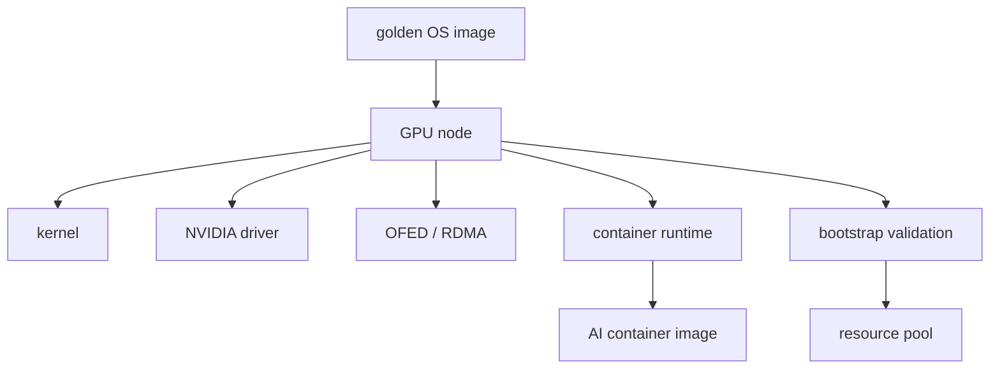

# 第 29 章：镜像、驱动与初始化

## 本章回答的问题

- OS baseline、kernel、NVIDIA driver、CUDA、NCCL、OFED/RDMA stack 和 container image 如何形成可复现环境？
- Golden image 为什么是 GPU IaaS 的关键交付物？
- 节点初始化如何避免“同一集群不同节点行为不一致”？

## 一个真实场景

训练任务在 A 节点成功，在 B 节点失败。两台机器 GPU 型号相同，但内核小版本、驱动安装方式、NCCL 库路径和 OFED 版本不同。开发者看到的是随机失败，平台实际面对的是环境漂移。

镜像和初始化的目标，是让节点从交付之初就处于可验证、可重复的状态。

## 核心概念

OS baseline 是操作系统和基础配置标准。Golden image 是经过验证的系统镜像。Driver bootstrap 是安装和配置 GPU、网络、容器 runtime 与监控组件的过程。Container image 是应用运行环境。

这几层共同决定训练和推理是否可复现。主机镜像和容器镜像必须一起治理。

## 系统架构



环境一致性要在节点入池前验证，而不是等业务任务失败后再排查。

## 29.1 OS baseline

OS baseline 定义系统版本、包源、安全策略、用户、日志、时间同步、SSH、审计和基础 agent。GPU 节点 OS baseline 还要考虑内核、驱动和 RDMA 栈兼容。

Baseline 应最小化不必要差异。业务依赖应进入容器镜像，而不是在主机上随意安装。主机承担硬件、网络、runtime 和监控职责。

## 29.2 kernel

Kernel 影响驱动、网络、文件系统和容器能力。GPU 驱动和 OFED/RDMA 栈通常对内核版本敏感。随意升级内核可能导致驱动模块无法加载或性能变化。

生产集群应固定内核版本，并把内核升级纳入变更流程。升级后要重新跑 GPU、NCCL、RDMA 和存储验收。

## 29.3 NVIDIA driver

NVIDIA driver 是 GPU 可用性的基础。它可以预装在 golden image 中，也可以在初始化或 GPU Operator 阶段安装。关键是版本可控、来源可信、安装日志可追溯。

驱动安装后应验证 `nvidia-smi`、CUDA sample、容器 GPU 访问和 DCGM 指标。只看到驱动加载成功不够。

## 29.4 CUDA version

CUDA version 在主机和容器之间有边界。容器可以携带 CUDA 用户态库，但需要主机驱动支持。平台应定义支持的 CUDA runtime 范围，并在基础镜像中固定。

多模型平台可能需要多种 CUDA 组合。不要让所有组合无限制进入生产。应通过基础镜像白名单和兼容矩阵管理。

## 29.5 NCCL version

NCCL version 直接影响分布式训练通信。NCCL 与 CUDA、驱动、网络栈和训练框架相关。升级 NCCL 可能改善性能，也可能改变通信行为。

训练镜像应明确 NCCL 版本，集群验收应包含 NCCL test。任务失败时，NCCL 版本应出现在诊断报告中。

## 29.6 OFED / RDMA stack

OFED/RDMA stack 提供高性能网络能力。它与内核、网卡驱动、NCCL、容器设备注入和 CNI/SR-IOV 配置相关。RDMA 栈不一致会导致跨节点训练失败或性能抖动。

RDMA 配置应纳入节点初始化和验收，包括设备可见性、链路状态、GID、MTU、PFC/ECN、端口速率和容器内访问。

## 29.7 container image

Container image 封装训练或推理应用依赖。AI 镜像通常很大，包含 Python、框架、CUDA 用户态库、推理引擎和业务代码。镜像构建应分层，基础镜像应由平台维护。

镜像需要安全扫描、版本标签和可复现构建。不要用 `latest` 作为生产镜像标签。模型服务发布应绑定镜像 digest。

## 29.8 golden image

Golden image 是经过验证的节点系统镜像。它应包含 OS baseline、内核、基础 agent、runtime 和必要配置。是否包含驱动取决于平台策略。

Golden image 的价值是减少交付漂移。每次修改都应有版本号、变更记录和验收结果。旧镜像要有退役计划。

## 工程实现

兼容矩阵示例：

```yaml
compatibility_matrix:
  baseline: gpu-node-2026-06
  kernel: pinned
  nvidia_driver: pinned
  cuda_runtime_supported: [approved-range]
  nccl: pinned
  ofed: pinned
  container_base_images:
    - ai-runtime-pytorch-2026-06
    - ai-runtime-vllm-2026-06
```

矩阵应进入 CI、镜像构建和节点准入流程。

## 常见故障

- 节点内核自动升级，驱动模块失效。
- 训练镜像使用未批准 CUDA/NCCL 组合。
- RDMA stack 在主机可用，容器内不可见。
- 镜像标签复用，线上版本不可追溯。
- Golden image 更新后未重新准入。

## 性能指标

- 节点 baseline 分布、漂移数量。
- 镜像构建成功率、安全扫描结果。
- 驱动安装成功率、容器 GPU smoke test 通过率。
- NCCL/RDMA 验收通过率。
- 节点初始化耗时和失败原因。

## 设计取舍

主机镜像越厚，节点启动越快但升级越重；主机镜像越薄，初始化灵活但失败面更大。容器镜像越自包含，可复现性越强但体积越大。平台应把通用硬件能力放主机，把业务依赖放容器。

## 小结

- 镜像、驱动和初始化决定 GPU 节点环境一致性。
- Kernel、driver、CUDA、NCCL 和 OFED 必须用兼容矩阵管理。
- Golden image 是可复现交付的基础。
- 节点初始化后必须验收，不能直接进入资源池。

## 延伸阅读

- TODO: NVIDIA CUDA compatibility 文档
- TODO: OFED / RDMA 文档
- TODO: Golden image 管理实践
