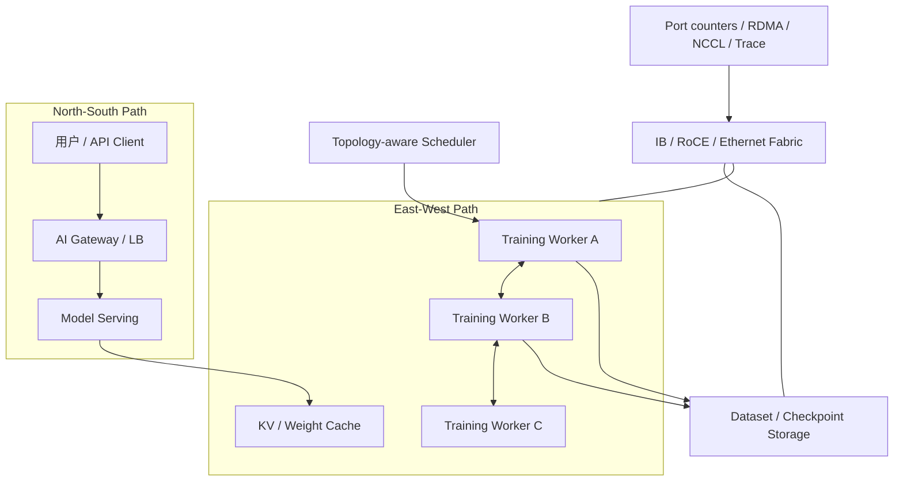

# 第 30 章：AI 网络基础

## 本章回答的问题

- AI Factory 的网络为什么不能只按普通数据中心网络理解？
- east-west traffic、north-south traffic、bandwidth、latency、packet loss 和 congestion control 如何影响训练与推理？
- 网络团队、平台团队和模型团队如何建立共同的验收与排障语言？

## 一个真实场景

一个训练团队把 128 卡任务从小集群迁移到新集群后，单卡利用率明显下降。GPU 监控显示计算没有持续跑满，NCCL 日志偶尔出现重试，交换机端口丢包计数缓慢上升。网络团队检查后认为链路带宽符合采购规格，平台团队认为 Pod 已经调度成功，训练团队认为模型代码和 batch size 都没有变化。每个团队看到的局部事实都成立，但训练性能仍然变差。

进一步排查发现，任务放置跨越了更多 rack，部分 rank 的通信路径经过更拥塞的 leaf-spine 链路；某些端口在高峰时出现 ECN mark 和重传；存储读取在 checkpoint 周期附近与训练通信叠加。单独看网络设备，指标没有完全失控；单独看训练日志，只能看到 step time 尖刺。只有把 rank、节点、网络端口、NCCL 时间线和存储时间线关联起来，问题才变得可解释。

推理侧也有类似问题。用户请求经过 AI Gateway、Load Balancer、Service Mesh、模型服务和 token streaming 链路。总带宽不高，但少量连接抖动会导致 streaming 间歇停顿，用户感知为“模型卡住”。这类体验问题并不一定来自模型慢，也可能来自网关超时、连接复用、代理缓冲、跨地域路由或后端 replica 网络路径。

这个场景说明，AI 网络不是“能 ping 通、带宽够”就结束。AI workload 对东西向流量、尾延迟、拥塞、丢包、拓扑和集体通信非常敏感。网络要成为 AI Factory 的生产能力，必须能被设计、验收、观测和诊断。网络团队、平台团队和模型团队需要共享同一套语言，而不是各自只看自己的指标。

因此，AI 网络故障的处理方式要从“设备是否正常”升级为“workload 路径是否符合基线”。训练任务慢，要能看到 rank 如何分布、走了哪些 NIC 和交换机端口、NCCL 在哪个阶段等待；推理请求慢，要能看到网关、路由、后端、streaming 和客户端之间的时间分布。只有把这些信息串起来，团队之间才会围绕证据协作，而不是围绕责任边界争论。

## 核心概念

AI 网络位于网络与存储层，向上支撑 AI Runtime、资源编排、模型服务、训练任务、数据读取和 checkpoint。它既要承载推理 API 的 north-south traffic，也要承载训练、模型并行、数据处理、checkpoint、权重加载和多副本服务之间的 east-west traffic。两类流量目标不同，但经常共享部分基础设施。

普通业务系统常把网络视为共享底座，关注连通性、平均延迟和服务可用性。AI Factory 需要把网络视为模型性能的一部分。一次 AllReduce 慢、一次 checkpoint 写入慢、一次权重加载慢、一个网关 upstream 抖动，最终都会表现为 GPU 空转、TTFT 上升、TPOT 波动或训练周期变长。网络性能会直接进入 token 成本和训练成本。

AI 网络的关键概念包括 bandwidth、latency、jitter、packet loss、congestion、oversubscription、incast、topology、flow 和 telemetry。Bandwidth 决定吞吐上限，latency 和 jitter 决定同步等待，packet loss 和 congestion 决定重传与尾延迟，topology 决定路径和故障域，telemetry 决定故障是否可解释。缺少任何一类信息，排障都会变成猜测。

还要理解 underlay 与 workload 的关系。Underlay 网络提供链路和路由，workload 通过 NCCL、RDMA、TCP、HTTP、gRPC、对象存储 SDK 或文件系统客户端使用它。网络设备指标正常，不代表 workload 体验正常；workload 变慢，也不一定是网络故障。AI 网络工程的目标，是把设备层指标和 workload 时间线连接起来。

网络还应被纳入经济性分析。网络拥塞导致 GPU 等待，最终会提高训练成本；推理 streaming 抖动导致用户体验下降，可能影响收入；checkpoint 路径慢导致恢复时间变长，会放大故障成本。因此，网络不是纯成本中心，而是决定 token 生产效率和模型迭代速度的关键系统。

所以本章讨论的每个网络概念，都应落到同一个问题：它如何影响 GPU 是否在有效计算、用户是否稳定收到 token、模型是否能按计划训练完成。这是 AI 网络区别于普通网络教材的地方。

## 系统架构

AI 网络架构可以分为四条路径。第一条是 north-south 推理入口路径，用户请求经过 DNS、CDN 或专线、Load Balancer、AI Gateway、认证鉴权、限流和模型服务。第二条是 east-west 训练通信路径，rank 之间通过 NCCL、RDMA、NVLink、InfiniBand 或 RoCE 交换梯度、activation 或专家路由数据。第三条是存储路径，节点读取数据集、写 checkpoint、拉取模型权重。第四条是管理路径，BMC、监控、日志和控制面流量不应与训练热路径混淆。

这些路径在物理上可能共享交换机、NIC、队列、链路或存储网络，但工程上必须有清晰边界。生产推理流量需要稳定连接、限流和隔离；训练通信需要低丢包、低尾延迟和拓扑一致；存储流量需要吞吐和元数据能力；管理流量需要可靠但不应干扰数据面。把所有流量放进一个无差别网络域，会让排障和容量规划变得困难。

架构还需要把拓扑传递给调度系统。节点属于哪个 rack、leaf、spine、rail、故障域、网络 fabric 和存储路径，应进入资源画像。调度器知道 GPU 数量不够，还要知道通信密集任务是否跨越不合适拓扑。网络设计如果不能被调度系统使用，只能停留在网络图纸上，无法转化为 workload 性能。

观测层应同时覆盖设备、协议、flow 和任务。交换机端口计数、NIC 计数、RDMA 错误、ECN/PFC、NCCL 日志、推理 trace、存储客户端指标和作业时间线要能关联。没有关联，网络团队只能说端口正常，模型团队只能说训练慢。AI Factory 需要的是跨层证据链。

架构上还要保留隔离和降级路径。训练 fabric 出现问题时，平台应能阻止新训练进入受影响拓扑；推理入口异常时，网关应能 fallback 或降级；存储网络拥塞时，批量任务应能限速。网络系统不仅要承载流量，还要把异常状态反馈给调度、网关和资源池，让上层能做动作。



## 30.1 east-west traffic

East-west traffic 指数据中心内部东西向流量。在 AI Factory 中，它主要来自训练 worker 之间的梯度通信、模型并行的 activation 传输、MoE expert routing、推理副本之间的缓存或状态同步、数据处理任务之间的数据交换，以及计算节点到存储系统的读写。它是 GPU 集群内部最容易被低估的流量。

大模型训练的东西向流量通常具有同步、突发和多对多特点。一个 training step 中，所有 rank 可能在相近时间进入 collective communication；如果某些路径拥塞或丢包，慢 rank 会拖住所有 rank。GPU 计算能力越强，通信等待越容易暴露为瓶颈。网络不是背景，它决定 GPU 能否持续得到数据和同步结果。

东西向流量还要求拓扑可解释。任务跨节点、跨 rack、跨 rail、跨网络 pod 或跨地域时，通信路径会变化。调度系统如果不知道这些差异，就可能把紧耦合训练任务放到总 GPU 数满足但通信路径较差的位置。训练性能下降时，用户看到的是 step time 变长，真正原因可能是 rank placement 与网络拓扑不匹配。

工程上，应按 workload 记录东西向流量画像：训练任务的 rank 到节点映射、通信时间、NCCL 算法、网络接口、端口计数和存储访问时间。只有把这些数据绑定到 job id 和时间线，平台才能判断是模型并行策略、数据读取、网络拥塞还是坏链路导致性能下降。

东西向流量还需要容量边界。一个训练集群能同时运行多少个大作业，不只取决于 GPU 数，也取决于 fabric 能否承受并发 collective communication 和 checkpoint 流量。容量规划如果只按 GPU 采购，会在网络上形成隐藏瓶颈。平台应把网络域作为资源约束，让大作业排队时能解释是 GPU 不足还是网络拓扑不足。

## 30.2 north-south traffic

North-south traffic 指用户、外部系统与 AI Factory 之间的南北向流量。推理 API、Chat Completion、Agent tool call、模型下载、企业专线访问、控制台访问、Webhook、对象存储访问和外部数据源访问都属于这一类。它更接近传统在线服务网络，但在 AI 场景中有新的体验指标。

推理服务的南北向流量关注连接数、TLS、负载均衡、认证鉴权、流式返回、网关限流、上游重试和租户隔离。Chat 场景下，用户体验不仅由总延迟决定，还由 TTFT、TPOT 和 streaming gap 决定。网络抖动、代理缓冲或连接重建，会让用户看到 token 输出间歇停顿，即使模型 decode 本身没有异常。

南北向网络通常会经过多层组件：DNS、CDN、WAF、Load Balancer、Ingress、Service Mesh、API Gateway、模型路由和后端推理服务。每增加一层，就增加一组超时、重试、buffer、连接池和指标。排障时不能只看最终服务错误码，需要按 request id 或 trace id 串起每一跳。

工程上，南北向网络要与平台层观测结合。请求应带上 tenant id、model id、route id、trace id 和 backend endpoint。网关应记录 upstream latency、retry、reset、stream duration 和错误分类。否则 streaming 中断、TTFT 上升或部分租户超时，会在网关、服务和网络之间反复归因。

南北向路径还要服务多租户治理。不同租户可能有不同限流、SLA、地域、合规和模型路由策略。网络层如果无法区分租户和模型，平台就只能看到总流量，无法判断是某个租户突发、某个模型后端慢，还是整体入口容量不足。AI Gateway 和网络观测必须共享上下文。

还要注意 streaming 的长连接特征。普通 HTTP 请求结束很快，Chat streaming 可能持续更久，连接池、idle timeout、proxy buffer 和客户端断开都会影响体验。南北向网络验收应包含流式响应，而不是只测短请求 QPS。

## 30.3 bandwidth

Bandwidth 是链路单位时间内传输数据的能力。AI 场景中，带宽有多个层次：GPU-to-GPU、GPU-to-NIC、NIC-to-switch、rack 内、rack 间、节点到存储、跨集群和跨地域。不同层次的瓶颈影响不同 workload。训练通信、权重加载、checkpoint 和数据读取看到的“带宽”并不是同一个指标。

训练通信通常关注有效带宽，而不是标称带宽。有效带宽会受到消息大小、NCCL 算法、拓扑、拥塞、NUMA、PCIe 路径、NIC 绑定、RDMA 配置、驱动版本和并发任务影响。端口标称速率足够，不代表 AllReduce 能达到预期。网络验收必须跑接近真实通信模式的测试。

存储读取同样如此。对象存储或并行文件系统总带宽很高，不代表单个训练 job 能稳定读满。客户端并发、数据 shard、元数据、缓存、压缩解码和网络路径都会影响应用有效吞吐。若 data loader 等待过长，GPU 会空转，而网络设备可能看起来没有打满。

工程上要区分 underlay 带宽、协议层吞吐、应用层吞吐和 GPU 有效利用率。网络吞吐高但 GPU 利用率低，可能是计算图、batch、数据预处理或同步等待问题；网络吞吐低但训练慢，可能是尾延迟、丢包或 rank skew。Bandwidth 只有和 workload 时间线结合，才有解释力。

带宽指标也要按方向和层级拆分。节点内、rack 内、跨 rack、节点到存储、推理入口到服务端的瓶颈完全不同。一个系统总出口带宽充足，不代表某条 rail、某个 leaf 或某个存储客户端没有瓶颈。基准测试应覆盖典型路径，而不是只测最短路径或单流吞吐。

带宽还要看并发公平性。一个大任务打满链路时，是否会压制其它训练、推理或存储流量，是多租户网络必须回答的问题。有效带宽不是单任务峰值，而是在并发条件下仍可预测的吞吐。

## 30.4 latency

Latency 是请求、消息或数据包从发送到接收的延迟。AI 网络关心平均延迟，更关心尾延迟和抖动。训练中的一个慢 rank 会拖住集体通信；推理中的一个慢后端会拉高用户端 E2E latency；存储中的一个慢 checkpoint 写入会让 GPU 周期性等待。

延迟来源包括交换机排队、链路拥塞、协议重传、CPU 中断、NUMA 跨越、代理层处理、TLS、DNS、连接复用、服务端排队、存储元数据和客户端限流。单点延迟不高时，多层叠加仍可能让用户可感知。AI 服务链路长，延迟预算必须分段管理。

延迟分析要按路径拆解。推理请求可以拆为 gateway latency、routing latency、queue latency、prefill latency、decode latency 和 streaming gap；训练任务可以拆为 data loading、compute、communication、checkpoint 和 evaluation；存储路径可以拆为客户端等待、网络、服务端处理和磁盘。不同路径需要不同团队协作。

工程上，应建立基线而不是只设告警阈值。某个集群、模型、任务规模和网络拓扑下的延迟范围应被记录。变更后，如果 P99、rank skew 或 streaming gap 相比基线上升，即使仍低于通用阈值，也值得调查。AI 网络的延迟治理依赖相对变化。

延迟还要区分可恢复抖动和结构性瓶颈。偶发抖动可能来自背景任务或短时拥塞，结构性瓶颈则会在相同拓扑和相同 workload 下稳定复现。平台应通过重复测试、路径对比和时间线关联判断类型。不同类型对应不同动作：限流、迁移、修复链路、调整调度或扩容。

对推理来说，还要关注延迟的用户可感知形态。一次 200ms 的间隔可能在总延迟中不突出，却会让 streaming 输出显得停顿。网络指标要能映射到产品体验，否则平台很难判断优先级。

## 30.5 oversubscription

Oversubscription 指下行总带宽大于上行可用带宽。传统数据中心常通过 oversubscription 降低成本，因为普通业务流量不会长期同时打满。AI 训练的同步通信会放大 oversubscription 的影响。当多个 rack 的 GPU 同时做 AllReduce 或读取 checkpoint 时，收敛链路会出现排队、拥塞和尾延迟上升。

在推理集群中，一定程度 oversubscription 可能可以接受，因为请求流量可被负载均衡、缓存、限流和 autoscaling 平滑。在线服务更需要关注尾延迟和可用性，而不是每条链路无阻塞。在训练集群中，尤其是大规模同步训练，oversubscription 会直接影响 step time 和 GPU 利用率。

设计时要按 workload 分区。在线推理、批量推理、分布式训练、数据处理和存储流量不一定需要同一种收敛比。把所有流量混在一个无差别网络资源池里，通常会让关键训练任务和在线服务互相影响。网络设计应和资源池、调度队列和租户等级一起规划。

工程上，oversubscription 不是静态采购参数，还要看实际任务放置和并发。一个拓扑在单任务 benchmark 下表现良好，多任务混部时可能出现热点。平台应通过端口利用率、ECN/PFC、NCCL 时间和任务拓扑记录，评估实际 oversubscription 对 workload 的影响。

Oversubscription 还应成为资源产品的一部分。生产训练池、实验池、批量推理池和普通控制面可以有不同网络等级。业务如果选择低成本资源，就要接受更高等待或更弱通信保证；选择高性能训练 fabric，则要承担更高成本。把网络等级说清楚，有助于把性能争议转化为资源选择。

这也能帮助容量规划。若低等级网络长期承载高通信训练，说明资源产品设计不匹配；若高等级 fabric 长期被弱通信任务占用，则说明调度策略浪费了昂贵网络能力。

## 30.6 incast

Incast 是多个发送方同时向一个接收方或同一服务端发送数据，导致接收端、交换机缓冲或存储服务拥塞的现象。AI 场景中，数据集读取、checkpoint 聚合、参数同步、日志上报、模型权重加载和批量推理结果写入都可能触发 incast。它常常表现为短时尖刺，而不是长期高吞吐。

例如多个 worker 同时读取同一个 shard，或者同一时刻把 checkpoint 写入同一个目录层级，都会造成瞬时流量集中和元数据压力。平均带宽看起来不高，GPU 却周期性等待。存储团队如果只看分钟级总吞吐，很可能错过秒级或毫秒级尖峰。

缓解 incast 的方法包括请求错峰、数据分片、客户端限速、缓存、分层聚合、分散目录、权重预热和选择更适合的存储布局。网络侧可以通过拥塞控制和缓冲策略降低影响，但根因往往在应用访问模式和存储布局。AI 存储与网络必须联合设计。

工程上，应在训练和推理框架中记录突发 I/O 时间线。checkpoint 开始和结束、模型权重加载、data loader 等待、对象存储请求和端口拥塞事件要能关联。只有这样，incast 才能从“偶发网络抖动”变成可复现、可缓解的工程问题。

Incast 的治理通常需要应用、存储和网络一起改。仅靠交换机缓冲无法解决所有突发，应用也不能假设网络无限吸收峰值。训练平台可以错峰 checkpoint，存储系统可以优化目录和分片，网络可以监控拥塞标记。多层协同，比单点调参更可靠。

Incast 还应在容量测试中主动制造。只测稳定顺序读写会掩盖突发问题。并发启动、并发 checkpoint、并发权重加载和并发日志写入，都应成为 AI 存储网络验收场景。

## 30.7 packet loss

Packet loss 是网络包丢失。对普通 TCP 应用，少量丢包可能只是吞吐下降；对 RDMA、NCCL 和高同步训练任务，丢包可能表现为训练变慢、通信超时、重传增加或 hang。AI 训练对丢包的敏感性来自同步等待：一个 rank 的网络问题会影响整个 job。

丢包不一定来自物理链路损坏。常见来源包括拥塞、队列溢出、错误 MTU、PFC 配置不当、ECN 配置不一致、光模块或线缆问题、NIC firmware 问题、交换机 buffer 压力、哈希不均和流量突发。轻载测试不丢包，不代表高并发训练不丢包。

排查丢包要同时看交换机端口计数、NIC 计数、RDMA 计数、NCCL 日志、系统日志和 workload 时间线。只看应用错误码，无法判断是计算慢、网络慢还是某条链路异常。只看端口错误，也无法判断影响了哪个训练任务。关联是关键。

工程上，应建立丢包和错误计数基线。某些环境中少量计数增长可能是背景噪声，某些训练 fabric 则应极其严格。阈值应按网络域和 workload 等级设置。生产训练池对丢包容忍度应显著低于普通管理网络或开发测试环境。

丢包排查还要保留现场。端口计数清零、任务日志轮转或节点重启都会丢失证据。平台应在检测到网络异常时自动采集交换机、NIC、RDMA、NCCL 和作业元数据。没有现场证据，故障会变成“无法复现”，也无法判断是否需要更换线缆、调整队列或修改拥塞控制。

丢包还要与影响面绑定。同样的错误计数，影响训练主路径和影响闲置端口的优先级不同。网络告警如果能关联受影响 job 和租户，平台就能更准确地安排修复顺序。

## 30.8 congestion control

Congestion control 是网络拥塞控制机制，用来在流量超过可承载能力时降低丢包和排队。RoCE 环境中常见做法会涉及 ECN、PFC、DCQCN、QoS、MTU、队列和交换机 buffer；InfiniBand 环境也有自己的拥塞管理能力。拥塞控制不是单点配置，而是端到端系统。

拥塞控制的困难在于一致性。NIC、交换机、队列、优先级、MTU、PFC、ECN 和流量类别必须协同配置。一处配置不一致，就可能让某些链路表现正常、某些链路在压力下异常。很多 RoCE 问题只在大规模训练或多任务混部时出现，单节点或小规模测试无法暴露。

AI Factory 应把拥塞控制纳入准入和变更流程。上线前做基准，扩容后做回归，交换机、NIC firmware、driver、OFED、CNI 或调度策略变更后都要复测。网络配置变更不应只看“连通性恢复”，还要看 NCCL、RDMA、存储读写和推理 tail latency 是否回到基线。

工程上，还要让拥塞事件可见。ECN mark、PFC pause、队列丢弃、RDMA 重传、端口利用率和 workload step time 应能在同一时间轴上查看。没有可见性，拥塞控制会变成黑盒参数调优。AI 网络需要的是可解释的稳定性，而不是只追求单次 benchmark 峰值。

拥塞控制策略还应有变更审计。某个交换机队列、PFC 优先级或 ECN 阈值的修改，可能影响整个训练 fabric。变更前要有基线，变更后要有回归，失败时要能回滚。网络配置应像代码一样管理，而不是依赖设备上的临时命令。

拥塞控制也不能替代容量规划。如果网络长期处于拥塞控制介入状态，说明 traffic、调度或容量已经不匹配。机制能缓解拥塞，但不能把不足的物理能力变成充足能力。

## 工程实现

AI 网络工程落地可以分成四类资产。第一类是网络域：推理入口、训练 fabric、存储网络、管理网络和 BMC 网络应有清晰边界。第二类是能力标签：节点所属 rack、leaf、spine、rail、NIC、NUMA、存储路径和故障域要进入资源画像。第三类是基线：节点间带宽、延迟、NCCL、RDMA、存储读写和端口计数都要有 baseline。第四类是变更闭环：网络配置、firmware、driver 和调度策略变化后要回归。

示例网络验收记录：

```yaml
network_baseline:
  fabric: training-roce-a
  scope: rack-12
  tests:
    node_pair_latency: pass
    node_pair_bandwidth: pass
    nccl_all_reduce: pass
    storage_read: pass
  counters:
    packet_loss: within_baseline
    rdma_retransmit: within_baseline
  state: schedulable
```

工程实现还要把网络事实提供给调度和排障系统。调度器需要知道节点之间的拓扑亲和和排除条件；排障系统需要从 job id 找到节点、NIC、交换机端口和链路计数；容量系统需要知道哪些 fabric 接近瓶颈。网络信息如果只保留在网络团队的设备系统里，平台无法使用它。

最后，要建立联合演练。选择典型训练任务、推理服务和存储读写场景，定期在变更后运行。演练结果不只用于证明网络可用，也用于更新基线。AI 网络基线应随硬件、软件和 workload 演进，而不是部署时测一次就结束。

工程实现还应把网络异常反馈给上层系统。资源池可以标记某个 fabric degraded，调度器避免新任务进入；AI Gateway 可以降低某个地域或集群的路由权重；批量任务可以被限速。网络状态如果不能驱动平台动作，只能在事故复盘中发挥作用。

还要建立标准诊断包。训练网络诊断包应包含 job id、rank 映射、节点、NIC、端口、NCCL 日志和端口计数；推理网络诊断包应包含 trace、网关日志、upstream、连接状态和后端指标。诊断包能减少跨团队来回询问。

## 常见故障

第一类故障是拓扑与调度不一致。某些 rack 的训练任务持续慢，原因是跨 rack 路径 oversubscription 高，或 rank 被放置到不同 rail。调度系统只满足 GPU 数量，却没有满足网络邻近。解决方向是把 rack、leaf、rail 和故障域纳入资源模型。

第二类故障是配置轻载正常、压力下失败。MTU、RoCE、PFC、ECN 或 QoS 参数不一致，小规模测试通过，大规模训练出现丢包、重传和 hang。AI 网络验收必须包含压力和并发场景。只测连通性，无法证明训练 fabric 可用。

第三类故障是存储流量冲击训练通信。checkpoint、数据读取或权重加载触发 incast，占用共享链路或存储端口，训练 GPU 利用率周期性下降。排查时需要同时看存储请求、网络端口和训练 step time。把网络和存储分开排障，会错过这种耦合。

第四类故障是南北向代理层问题。网关连接复用、timeout、retry、buffer 或 upstream reset 配置不当，导致 streaming 输出中断或 TTFT 上升。模型服务本身可能正常，问题发生在请求路径中间层。必须用 trace 串起网关和后端。

第五类故障是观测维度缺失。网络设备有告警，平台不知道影响哪个 job；训练任务慢，网络团队不知道对应哪些端口；推理 trace 显示 upstream 慢，却没有连接和重试信息。解决方向是统一标签、拓扑映射和自动诊断包。没有共同上下文，排障会停在部门边界。

第六类故障是变更后没有回归。交换机、NIC firmware、OFED、CNI 或网关配置修改后，只验证连通性，不验证 NCCL、RDMA、streaming 和存储路径。很多网络事故不是新建时发生，而是变更后基线漂移。

第七类故障是容量信号被平均值掩盖。某条 rail、某个 leaf 或某个存储路径已经成为热点，但全局平均利用率仍然正常。AI 网络排障必须保留局部视图。

## 性能指标

网络基础指标包括链路带宽、有效吞吐、平均延迟、P95/P99 延迟、jitter、端口利用率和队列深度。训练 fabric 还要看 RDMA 重传、错误包、ECN mark、PFC pause、丢包、NCCL all_reduce/all_gather 带宽和耗时。单个指标不能解释网络质量，必须组合判断。

推理指标包括 TTFT、TPOT、streaming gap、upstream latency、连接重置、重试、gateway queue、TLS 握手、请求体和响应体传输耗时。用户体验问题往往体现在尾延迟和间歇停顿，而不是总带宽。南北向网络应与平台 trace 打通。

存储相关网络指标包括数据读取吞吐、checkpoint 写入时长、对象存储请求延迟、元数据操作、cache hit ratio 和节点到存储路径的错误计数。存储慢经常表现为 GPU idle，而不是网络告警。指标要能从训练任务反查到存储路径。

运营指标包括网络基线漂移、端口错误增长、热点 leaf、拥塞事件次数、受影响 job 数、变更后回归通过率和故障恢复时间。AI 网络不是一次性建设，必须持续运营。指标应驱动扩容、调度策略和故障域调整。

指标还要有分层视图。网络团队需要设备和链路视图，平台团队需要 job 和租户视图，业务团队需要延迟和成本视图。底层数据应一致，展示方式可以不同。这样不同角色才能围绕同一事实做决策。

指标也要保留历史。AI 网络问题常通过对比发现：同一模型、同一规模、同一拓扑下，本周比上周慢。没有历史基线，平台只能依赖静态阈值，而静态阈值往往发现不了性能退化。

指标应能下钻到具体 job、租户、模型和拓扑路径。只有这样，平台才能把网络退化转化为可执行动作，例如迁移任务、隔离节点、调整路由或扩容 fabric。

## 设计取舍

第一个取舍是高性能专用 fabric 与共享以太网络。专用训练 fabric 性能和隔离更好，但成本高、运维专门化；共享网络利用率高、生态统一，但隔离和性能解释更难。选择应由 workload 比例、训练规模、团队能力和成本模型决定。

第二个取舍是低 oversubscription 与成本。低收敛比能提升训练稳定性，但交换机、光模块、布线和机房成本更高。对在线推理、批量任务和开发环境，可以接受不同等级网络；对大规模同步训练，网络折中会直接转化为 GPU 空转成本。

第三个取舍是严格 QoS 与配置复杂度。QoS 能保护关键流量，但多层配置不一致会引入新故障。RoCE、PFC、ECN、队列和优先级需要端到端管理。没有自动验收和漂移检测时，复杂 QoS 可能比简单网络更难运营。

第四个取舍是性能最优与可解释性。Adaptive routing、复杂哈希和多路径能提高利用率，但排障更难；静态路径可解释，但热点时性能差。AI Factory 应在 telemetry 能力足够时引入复杂路径策略，否则会把问题藏进网络黑盒。

第五个取舍是统一网络与分域网络。统一网络便于资源共享和运维，分域网络便于性能隔离和安全治理。训练、推理、存储和管理流量的风险不同，完全统一会增加干扰，过度分域会增加成本和复杂度。合理边界来自 workload 分析，而不是组织偏好。

第六个取舍是自动化响应与人工确认。网络异常可以自动影响调度和路由，但误判会造成资源浪费或业务迁移。高置信故障适合自动隔离，复杂拥塞和性能退化更适合先降权、告警并由人确认。响应策略应分级。

## 小结

- AI 网络要同时理解 north-south 和 east-west traffic，并把网络性能视为模型性能的一部分。
- 训练任务对尾延迟、拥塞、丢包和拓扑非常敏感，平均带宽不足以解释体验。
- 网络验收应覆盖 NCCL、RDMA、存储、端口计数和真实 workload。
- 排障需要把 job、rank、节点、NIC、交换机端口和 trace 串成证据链。
- 网络设计要按 workload 分级，不能用单一网络模型覆盖所有 AI 场景。

## 延伸阅读

- TODO: InfiniBand / RoCE 官方文档
- TODO: 数据中心网络拥塞控制资料
- TODO: AI 训练网络工程案例
