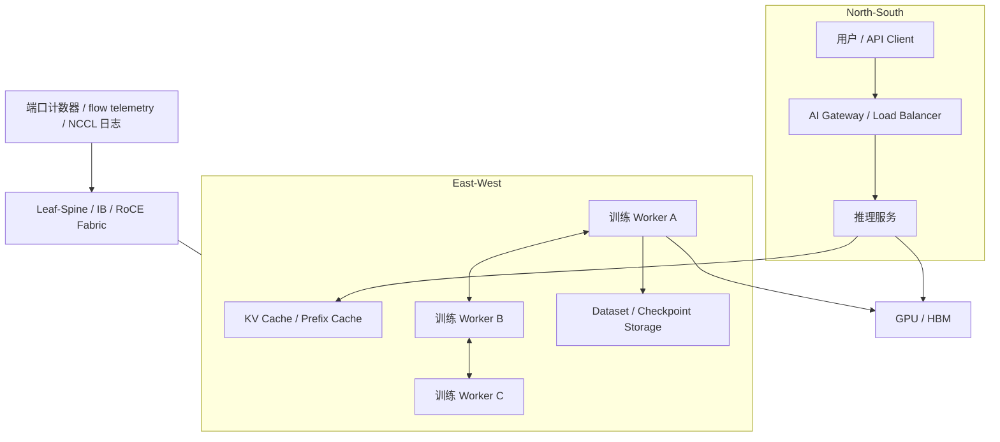

# 第 30 章：AI 网络基础

## 本章回答的问题

- AI Factory 的网络为什么不能只按普通数据中心网络理解？
- east-west traffic、north-south traffic、bandwidth、latency、packet loss 和 congestion control 如何影响训练与推理？
- 网络团队、平台团队和模型团队如何建立共同的验收与排障语言？

## 一个真实场景

一个训练团队把 128 卡任务从小集群迁移到新集群后，单卡利用率明显下降。GPU 监控显示计算并没有持续跑满，NCCL 日志偶尔出现重试，交换机端口丢包计数缓慢上升。网络团队说链路带宽符合采购规格，平台团队说 Pod 都调度成功，训练团队说模型代码没有变。

这类问题说明：AI 网络不是“能 ping 通、带宽够”就结束。AI workload 对东西向流量、尾延迟、拥塞、丢包、拓扑和集体通信非常敏感。网络要成为 AI Factory 的生产能力，必须能被设计、验收、观测和诊断。

## 核心概念

AI 网络位于网络与存储层，向上支撑 AI Runtime、资源编排、模型服务和训练任务。它既要承载推理 API 的 north-south traffic，也要承载训练、checkpoint、数据读取和多副本推理之间的 east-west traffic。

普通业务系统常把网络视为共享基础设施；AI Factory 需要把网络视为模型性能的一部分。一次 AllReduce 慢、一次 checkpoint 写入慢、一个推理 replica 拉取权重慢，最终都会表现为 GPU 空转、TTFT 上升或训练周期变长。

## 系统架构



这个图强调两点：第一，推理和训练使用同一个网络基础设施，但流量形态不同；第二，网络可观测性必须同时覆盖设备、链路、协议和 workload。

## 30.1 east-west traffic

East-west traffic 指数据中心内部东西向流量。在 AI Factory 中，它主要来自训练 worker 之间的梯度通信、推理副本之间的缓存或状态同步、数据处理任务之间的数据交换，以及计算节点到存储系统的读写。

大模型训练的东西向流量通常具有突发、同步和多对多特点。一个 step 中所有 rank 可能在相近时间进入 collective communication，如果网络产生拥塞或丢包，慢的一组 rank 会拖住所有 rank。这就是为什么训练集群更关注端到端尾延迟和拥塞恢复，而不仅是平均吞吐。

东西向流量还要求拓扑可解释。任务跨机架、跨 pod、跨可用区或跨不同网络域时，通信路径会变化。调度系统如果不知道这些差异，就可能把紧耦合训练任务放到成本低但通信差的位置。

## 30.2 north-south traffic

North-south traffic 指用户、外部系统与 AI Factory 之间的南北向流量。推理 API、模型下载、企业专线访问、控制台访问和对象存储访问都属于这一类。

推理服务的南北向流量关注连接数、TLS、负载均衡、流式返回和网关限流。Chat 场景下，用户体验不仅由总延迟决定，还由 TTFT 和 streaming 稳定性决定。网络抖动会让 token streaming 出现间歇卡顿。

南北向网络通常会经过 API Gateway、WAF、Load Balancer、Service Mesh 或 Ingress。每增加一层，就增加一组排障对象。生产环境应记录 request id、trace id、tenant id、model id 和 upstream endpoint，避免故障时只能在多层代理之间猜测。

## 30.3 bandwidth

Bandwidth 是链路单位时间内传输数据的能力。AI 场景中，带宽有多个层次：GPU-to-GPU、NIC-to-switch、节点到存储、rack 内、rack 间和跨地域。不同层次的瓶颈会影响不同 workload。

训练通信通常关注有效带宽，而不是标称带宽。有效带宽会受到协议栈、消息大小、拓扑、拥塞、NUMA、PCIe 路径、NIC 绑定和软件版本影响。存储读取同样如此：对象存储标称带宽高，不代表单个训练任务能稳定读满。

工程上要区分 underlay 带宽、应用层吞吐和 GPU 有效利用率。网络吞吐高但 GPU 低，可能是 batch 太小、通信等待多或数据预处理慢；网络吞吐低但训练慢，可能是同步等待、丢包重传或 rank 分布不均。

## 30.4 latency

Latency 是请求或数据包从发送到接收的延迟。AI 网络关心平均延迟，更关心尾延迟。训练中的一个慢 rank 会拖住集体通信；推理中的一个慢后端会拉高用户端 E2E latency。

延迟来源包括交换机排队、链路拥塞、协议重传、CPU 中断、NUMA 跨越、代理层处理、TLS、DNS、连接复用和存储服务端等待。单点延迟不高时，多层叠加仍可能让用户可感知。

延迟分析要按路径拆解。推理请求可以拆为 gateway latency、queue latency、prefill latency、decode latency 和 streaming gap；训练任务可以拆为 data loading、compute、communication 和 checkpoint latency。

## 30.5 oversubscription

Oversubscription 指下行总带宽大于上行可用带宽。传统数据中心常通过 oversubscription 降低成本，但 AI 训练的同步通信会放大 oversubscription 的影响。

在推理集群中，一定程度 oversubscription 可能可以接受，因为请求流量可被负载均衡、缓存和 autoscaling 平滑。在训练集群中，如果多个 rack 同时做 AllReduce 或读取 checkpoint，oversubscription 会导致拥塞、排队和尾延迟上升。

设计时要按 workload 分区。在线推理、批量推理、分布式训练和数据处理不一定需要同一种网络收敛比。把所有流量混在一个无差别资源池里，通常会让关键训练任务和在线服务互相影响。

## 30.6 incast

Incast 是多个发送方同时向一个接收方发送数据导致接收端或交换机缓冲拥塞的现象。AI 存储读取、checkpoint 聚合、参数同步和日志上报都可能触发 incast。

例如多个 worker 同时读取同一个 shard，或者同一时刻把 checkpoint 写入同一个存储服务端，都会造成短时间流量集中。即使平均带宽看起来不高，瞬时突发也会造成丢包或排队。

缓解 incast 的方法包括请求错峰、分片、客户端限速、缓存、分层聚合、选择更合适的存储布局，以及在网络侧配置拥塞控制和足够的缓冲策略。

## 30.7 packet loss

Packet loss 是网络包丢失。对普通 TCP 应用，少量丢包可能只是吞吐下降；对 RDMA、NCCL 和高同步训练任务，丢包可能表现为训练变慢、通信超时或 hang。

丢包不一定来自物理链路坏。常见来源包括拥塞、队列溢出、错误的 MTU、PFC 配置不当、ECN 配置不一致、光模块或线缆问题、NIC firmware 问题以及交换机 buffer 压力。

排查丢包要同时看交换机端口计数、NIC 计数、RDMA 计数、NCCL 日志和 workload 时间线。只看应用错误码，无法判断是计算慢、网络慢还是某条链路异常。

## 30.8 congestion control

Congestion control 是网络拥塞控制机制，用来在流量超过可承载能力时降低丢包和排队。RoCE 环境中常见做法会涉及 ECN、PFC、DCQCN 等机制；InfiniBand 环境也有自己的拥塞管理能力。

拥塞控制的困难在于端到端一致性。NIC、交换机、队列、优先级、MTU 和流量类别必须协同配置。一处配置不一致，就可能让某些链路表现正常、某些链路在压力下异常。

AI Factory 应把拥塞控制纳入准入和变更流程。上线前做基准，扩容后做回归，故障后保留端口计数和作业时间线。网络配置变更不应只看“连通性恢复”，还要看训练通信和存储读写是否回到基线。

## 工程实现

AI 网络工程落地可以按四步推进：

1. 建立网络域：区分推理入口、训练 fabric、存储网络、管理网络和 BMC 网络。
2. 建立能力标签：记录节点所属 rack、leaf、spine、rail、NIC、NUMA 和存储路径。
3. 建立基准：对节点间带宽、延迟、NCCL、存储读写和包错误计数建立 baseline。
4. 建立变更闭环：网络配置、驱动、firmware、交换机版本和调度策略变更后，都要做回归。

示例网络验收记录：

```yaml
network_baseline:
  fabric: training-roce-a
  scope: rack-12
  tests:
    node_pair_latency: pass
    node_pair_bandwidth: pass
    nccl_all_reduce: pass
    storage_read: pass
  counters:
    packet_loss: within_baseline
    rdma_retransmit: within_baseline
  state: schedulable
```

## 常见故障

- 某些 rack 的训练任务持续慢，原因是跨 rack 路径 oversubscription 高。
- MTU 或 RoCE 参数不一致，轻载正常，压力测试时丢包。
- 存储读取触发 incast，训练 GPU 利用率周期性下降。
- 网关层连接复用或超时配置不当，streaming 输出中断。
- 交换机端口错误计数增长，但监控没有按任务拓扑关联。

## 性能指标

- 链路带宽、有效吞吐、平均延迟、P95/P99 延迟。
- 端口丢包、错误包、重传、ECN mark、PFC pause。
- NCCL all_reduce/all_gather 带宽和耗时。
- 推理 TTFT、TPOT、streaming gap、upstream latency。
- 存储读写吞吐、checkpoint 时长、数据加载等待时间。

## 设计取舍

低 oversubscription 和高性能 fabric 能提升训练稳定性，但成本高。共享网络利用率高，但故障隔离和性能解释更难。严格 QoS 可保护关键流量，但配置复杂且容易因策略不一致引入新问题。

AI Factory 的网络设计要从 workload 出发：在线推理优先稳定和可扩缩，训练优先东西向带宽和尾延迟，数据处理优先吞吐和成本。没有一种网络形态能同时最优。

## 小结

- AI 网络要同时理解 north-south 和 east-west traffic。
- 训练任务对尾延迟、拥塞、丢包和拓扑非常敏感。
- 网络验收应覆盖 NCCL、存储、端口计数和真实 workload。
- 网络问题要通过任务时间线、拓扑和设备指标联合定位。

## 延伸阅读

- TODO: InfiniBand / RoCE 官方文档
- TODO: 数据中心网络拥塞控制资料
- TODO: AI 训练网络工程案例
