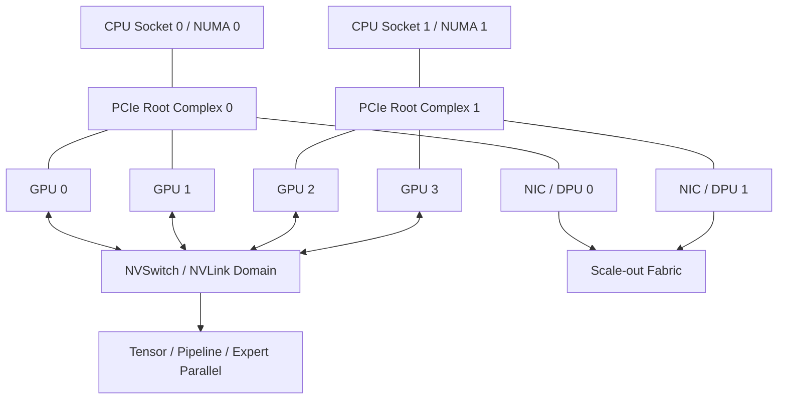

# 第 31 章：Scale-up 网络

## 本章回答的问题

- Scale-up 网络解决单节点或单系统内多 GPU 通信的什么问题？
- PCIe、NVLink、NVSwitch 和 NVLink Switch 如何影响模型并行和推理部署？
- 为什么调度系统需要理解 GPU-to-GPU bandwidth、NUMA 和 node 内拓扑？

## 一个真实场景

一个推理服务把 70B 模型切成多张 GPU 做 tensor parallel。部署在某些 8 卡节点上吞吐稳定，decode 速度也符合预期；部署到另一批 GPU 型号相同、显存相同、驱动版本一致的节点后，tokens/s 明显下降。平台最初怀疑模型服务参数，随后怀疑调度和负载，但最终发现两批节点的 GPU 互联拓扑不同：一批 GPU 位于完整高带宽互联域，另一批部分 GPU 通信需要经过 PCIe 路径。

训练场景也类似。单节点 8 卡训练在某些节点上 NCCL all_reduce 带宽稳定，在另一些节点上出现带宽不对称。节点没有掉卡，GPU 温度也正常，但 `nvidia-smi topo -m` 显示 GPU 与 NIC 的 NUMA 邻近关系不同，部分 GPU 到 RDMA NIC 需要跨 CPU socket。模型团队看到的是 step time 变慢，平台团队看到的是节点“健康”，真正问题在 scale-up 拓扑没有进入资源画像。

这类问题说明，scale-up 网络不是硬件手册中的背景知识，而是模型切分、服务部署、训练性能和调度决策的一部分。对 tensor parallel、pipeline parallel、expert parallel、多 GPU 推理、KV Cache 分布和单节点 NCCL 来说，GPU 之间的路径决定了通信成本。GPU 数量相同，不代表节点能力相同。

AI Factory 如果只把节点描述为“8 GPU”，就会把不同互联域混在一起。更合理的做法是把 GPU-to-GPU bandwidth、NVLink/NVSwitch 域、PCIe 拓扑、NUMA、GPU-to-NIC 关系和节点内故障信号纳入资源池。这样调度器才能把强通信 workload 放到合适拓扑上，运维团队也能解释同型号节点的性能差异。

这也是 scale-up 网络和 GPU IaaS 的接口。硬件能力必须被抽象成平台可查询的资源属性，而不是只存在于硬件规格书。模型团队不需要理解每条线缆，但平台必须能告诉它哪些 GPU 组合适合某种并行策略。

## 核心概念

Scale-up 网络指在一个节点、一个机箱、一个 rack 级系统或紧耦合 GPU 域内部扩展计算能力的互联方式。它关注 GPU 与 GPU、GPU 与 CPU、GPU 与 NIC、GPU 与本地 NVMe、GPU 与 HBM 之间的数据路径。与 scale-out 相比，scale-up 更靠近单系统内部，通常延迟更低、带宽更高、拓扑更固定。

Scale-up 与 scale-out 不是二选一。大模型训练和推理通常同时使用二者：节点内通过 NVLink、NVSwitch 或 PCIe 做高速 GPU 间通信，节点间通过 InfiniBand、RoCE 或以太 fabric 做跨节点通信。Tensor parallel 可能主要依赖 scale-up，data parallel 更依赖 scale-out，混合并行会同时依赖两层网络。

关键概念包括 PCIe、NVLink、NVSwitch、NVLink Switch、NUMA、GPU-to-GPU bandwidth、GPU-to-NIC affinity 和 GPU island。PCIe 是通用设备互联基础；NVLink/NVSwitch 提供更高带宽的 GPU 间路径；NUMA 决定 CPU、内存、GPU 和 NIC 的邻近；GPU island 描述一组紧耦合 GPU 资源。它们共同决定模型并行效率。

Scale-up 网络的工程价值在于可预测性。一个模型切分策略假设 GPU 间通信快速，如果实际部署跨越低带宽路径，性能会下降；一个 RDMA 通信路径假设 GPU 与 NIC 邻近，如果实际跨 NUMA，通信开销会增加。调度系统必须理解这些假设，否则硬件能力无法稳定转化为 workload 性能。

因此，scale-up 概念要同时进入模型设计、节点验收和调度策略。模型并行选择决定通信需求，节点拓扑决定可承载能力，调度策略决定二者是否匹配。只优化其中一层，都无法保证生产性能。

Scale-up 还影响成本。高带宽 GPU 域是昂贵资源，如果弱通信任务长期占用，平台会浪费硬件能力；如果强通信任务被放到低带宽路径，GPU 会空转。拓扑资源应被当作可管理的稀缺能力。

## 系统架构

Scale-up 架构从服务器内部拓扑开始。CPU socket 通过 PCIe root complex 连接 GPU、NIC、DPU 和 NVMe；GPU 之间可能通过 NVLink 点对点连接，也可能通过 NVSwitch 形成更均衡的互联域；NIC 与 GPU 的相对位置决定 RDMA 和 GPU Direct 路径；本地 NVMe 与 CPU/GPU 的路径影响数据缓存和 checkpoint。每个节点都有自己的拓扑画像。

在更大系统形态中，scale-up 域可能超出单台服务器，扩展为 rack 级或机柜级 GPU island。此时，调度单位不再只是单节点，而可能是一个包含多台 compute tray、NVLink Switch、共享供电和制冷边界的系统级资源。平台需要重新定义资源池、故障域、维护域和租户边界。

架构上，scale-up 拓扑要进入三个系统。第一，资源池记录节点内和系统级 GPU 域；第二，调度器用拓扑约束选择 GPU 组合；第三，运行时通过 NCCL、CUDA、框架和推理引擎识别并使用这些路径。若任何一层缺失，拓扑优势都会被浪费。例如硬件支持 NVLink，但容器或 NCCL 未识别，应用仍可能走低效路径。

观测层也要覆盖 scale-up。PCIe link width 和 speed、NVLink/NVSwitch 错误计数、GPU-to-GPU bandwidth、单节点 NCCL 性能、GPU 与 NIC NUMA 关系、node 内 tokens/s 和 step time 都应有基线。节点“健康”不能只代表 GPU 可见，还要代表互联路径符合预期。

架构还要处理拓扑变化。维修、更换 GPU、升级固件、修改 BIOS、重装系统或更换 NIC 后，节点拓扑都可能改变。资源画像必须重新生成并复验，否则调度器会基于过期拓扑做决策。

架构还要定义拓扑数据的来源。自动探测能发现设备路径，资产系统能提供机架和故障域，准入测试能验证性能。三者缺一不可。只看设备发现，缺少业务语义；只看人工资产，容易过期。



## 31.1 PCIe

PCIe 是服务器内部连接 CPU、GPU、NIC、DPU、NVMe 和其它设备的基础总线。即使节点有 NVLink 或 NVSwitch，GPU 到 CPU、GPU 到 NIC、GPU 到某些存储设备仍可能经过 PCIe。PCIe 的 link width、link speed、root complex、switch 层级和 NUMA 位置，都会影响数据路径和性能。

PCIe 拓扑会影响数据加载、RDMA、checkpoint、推理权重加载和多 GPU 通信。如果 GPU 与 NIC 跨 NUMA 或跨 PCIe switch，GPU Direct RDMA 路径可能更长；如果 PCIe 链路降速，单节点通信和存储访问可能下降；如果设备枚举或 ACS/IOMMU 配置异常，容器或 VM 中的设备访问也可能受影响。

调度系统只知道“8 张 GPU”是不够的，还需要知道 GPU 与 NIC、CPU 和 NVMe 的邻近关系。对数据并行训练，GPU-to-NIC 亲和重要；对推理服务，GPU-to-GPU 和本地权重缓存路径重要；对数据处理，CPU、NVMe 和 GPU 的数据路径重要。不同 workload 需要不同的 PCIe 亲和策略。

工程上应在节点准入时保存 `nvidia-smi topo -m`、PCIe link 状态、NUMA 绑定、NIC 位置和错误计数。运行中要监控 PCIe replay、link retrain、降速和设备掉线。PCIe 问题常表现为“某些节点慢”，如果没有拓扑基线，很容易被误判为模型或网络问题。

PCIe 还影响虚拟化和容器交付。Passthrough、SR-IOV、GPU Direct RDMA 和本地 NVMe 都依赖正确设备路径。平台如果要提供 VM GPU 或高性能容器，就不能把 PCIe 拓扑当作纯硬件细节。它是资源隔离和性能承诺的一部分。

PCIe 验收还应覆盖异常恢复。设备重置、节点重启、驱动重载后，link speed 和设备位置是否保持一致，需要被检查。否则节点维修后可能看似恢复，实际带宽已经下降。

PCIe 信息也应进入故障报告。没有它，跨团队排障会缺少关键上下文。

## 31.2 NVLink

NVLink 是 GPU 间高带宽互联技术，用于提升 GPU-to-GPU 数据交换能力。它对 tensor parallel、pipeline parallel、MoE expert 通信、多 GPU 推理、KV Cache 分布和单节点 collective communication 都很重要。相比只走 PCIe，NVLink 可以显著降低强 GPU 间通信 workload 的通信成本。

NVLink 的价值不只是“更快”，而是让某些模型切分策略变得可行。大模型无法放入单张 GPU 时，权重、activation、attention 或 KV Cache 需要分布在多张 GPU 上。每一步 decode 或训练 step 都可能需要跨 GPU 交换数据。若 GPU 间路径慢，计算单元会等待通信，tokens/s 和训练吞吐都会下降。

但 NVLink 不是应用自动变快的保证。框架、NCCL、CUDA、容器、驱动和拓扑发现都要正确识别并使用它。并行策略也要匹配拓扑：强通信组应尽量放在同一 NVLink 域内，弱通信组可以使用更宽松约束。只要调度把 tensor parallel 组拆到低带宽路径上，硬件优势就会消失。

运维上，应监控 NVLink 状态、错误计数和带宽基线。轻微链路错误可能先表现为通信性能下降，而不是 GPU 掉卡。节点准入和维修后复测应包含 NVLink 检查。对生产推理和训练节点，NVLink 健康应是节点是否可调度的一部分。

NVLink 的使用也要通过 workload 验证。单独链路测试正常，不代表模型并行配置一定高效。平台应保留典型 tensor parallel 或单节点 NCCL 基准，作为推理和训练部署前的参考。硬件路径和软件策略要一起验证。

NVLink 域还应影响资源命名。用户看到的资源不应只是 `gpu: 4`，而应能区分同域 4 卡和任意 4 卡。命名越准确，性能预期越清楚，排障争议越少。

资源命名是性能契约的一部分。

命名还应和计费等级一致。

## 31.3 NVSwitch

NVSwitch 用于构建多 GPU 之间更高连通性的交换结构。相比简单点对点 NVLink，NVSwitch 可以让一组 GPU 形成更均衡的互联域，降低拓扑不对称对通信的影响。对 8 GPU 或更大紧耦合系统来说，NVSwitch 域常被视为一个高性能资源单元。

对大模型训练和高并发推理，NVSwitch 域的资源边界非常重要。Tensor parallel 组、expert parallel 组或多 GPU 推理实例，如果全部位于同一 NVSwitch 域内，通信性能更可预测。如果任务跨域，通信可能退回较低带宽路径，吞吐和延迟都会受影响。调度器应尽量保留这种高带宽域。

NVSwitch 也改变故障和维护模型。一个 NVSwitch 或相关链路异常，可能影响一组 GPU，而不是单张卡。运维不能只看 GPU 是否可见，还要看 NVSwitch 错误、链路状态和域内通信基线。故障隔离可能需要隔离整个 GPU 域，而不是单卡。

工程上，平台应把 NVSwitch 域写入资源标签和资源池。任务可以声明“需要完整 NVSwitch 域”“需要 4 张同域 GPU”或“可跨域”。不同声明对应不同等待时间和成本。把 NVSwitch 域隐藏起来，会让用户无法解释同样 GPU 数量下的性能差异。

NVSwitch 资源还要考虑共享策略。一个 8 卡域可以给一个大模型独占，也可以拆给多个小服务，但拆分后剩余 GPU 是否还能满足强通信任务，需要资源池持续跟踪。拓扑碎片不是普通空闲碎片，它会直接影响模型能否部署。

因此，NVSwitch 域的空闲率要和完整域可用率分开看。还有 4 张空闲 GPU，不代表还有一个可用的 4 卡强通信组合。资源池指标必须表达这种差异。

否则容量判断会过于乐观。

完整域比零散 GPU 更稀缺。

## 31.4 NVLink Switch

NVLink Switch 将 scale-up 域从单节点扩展到更大的系统级互联形态。它用于把更多 GPU 组织成一个紧耦合计算域，让模型或 runtime 看到更大的高带宽 GPU pool。对 AI Factory 来说，这类架构更像系统级生产单元，而不是一组松散服务器。

这种形态会改变资源边界。过去调度单位可能是单台 8 卡服务器；在更大 NVLink 域中，调度单位可能变成 rack 级、机柜级或 GPU island。平台需要重新定义租户如何使用这个域，是否允许拆分，拆分后性能如何标注，故障时如何降级，维护时如何 drain。资源池必须表达这些新边界。

NVLink Switch 类系统还会放大交付和验收复杂度。供电、制冷、线缆、交换组件、固件、驱动、NCCL、拓扑发现和调度都要一致。单台服务器验收通过，不代表整个系统级 GPU 域通过。验收应覆盖域内 GPU-to-GPU 带宽、collective communication、故障隔离和典型模型 workload。

讨论具体产品能力时要保持中性，因为规格会快速变化。本书关注工程影响：资源边界变大、故障域变大、调度约束更强、维护成本更高、但模型并行和大规模推理的性能潜力更大。平台不能把这类系统简单看成“更多 GPU 的普通节点”。

这类系统还要求更强的容量规划。一个 GPU island 被部分占用后，剩余资源可能不适合另一个大模型；一次维护可能影响整组 GPU。资源池应以系统级单位管理承诺，而不是只做单卡计数。

平台还要提前定义降级策略。当系统级域部分故障时，是整体下线、降级为较小资源、还是仅允许弱通信任务使用，不能到故障时临时决定。降级策略影响 SLA 和成本。

## 31.5 GPU-to-GPU bandwidth

GPU-to-GPU bandwidth 衡量 GPU 之间数据交换能力。它影响 tensor parallel、activation 传输、KV Cache 分布、MoE routing、single-node AllReduce、模型权重同步和多 GPU 推理。对强通信 workload 来说，GPU-to-GPU 带宽是实际吞吐的关键限制之一。

评估 GPU-to-GPU bandwidth 时，要区分单向、双向、点对点、集合通信和应用有效带宽。工具测出的点对点带宽只是起点，真实模型还会受到 kernel 调度、batch size、并行策略、NCCL 算法、框架实现和显存访问模式影响。高点对点带宽不自动等于高 tokens/s。

平台应把带宽基线与节点拓扑绑定。节点通过准入时记录不同 GPU 对之间的带宽、单节点 NCCL all_reduce、NVLink/NVSwitch 状态和错误计数。后续 firmware、driver、硬件更换或维修后，必须用相同基线回归。否则节点可能仍可用，但性能已经降级。

GPU-to-GPU bandwidth 还应进入调度解释。若任务要求 4 张同域 GPU，平台应能说明等待原因是同域 GPU 不足，而不是简单 pending。用户愿意为拓扑等待，前提是平台能解释拓扑对性能的价值。可解释等待是高性能资源调度的基础。

带宽基线还应分等级使用。生产推理和训练池应要求稳定高带宽，实验池可以容忍较低基线或轻微降级。这样资源不会因为单一严格标准被全部下线，也不会让低质量资源进入关键 workload。

GPU-to-GPU bandwidth 还要和模型指标关联。某个带宽下降是否真正影响 tokens/s 或 step time，需要通过典型 workload 验证。硬件指标和应用指标结合，才能决定是否隔离节点。

带宽下降也可能只影响特定 GPU 对，因此矩阵视图比单一平均值更有价值。

矩阵应在维修后重新生成。

也应在驱动升级后复测。

形成证据。

## 31.6 node 内通信

Node 内通信发生在同一服务器内部，通常包括 GPU 间通信、GPU 到 CPU、GPU 到 NIC、GPU 到 NVMe 和进程间共享内存。它的排障边界跨越硬件、BIOS、kernel、driver、container runtime、NCCL、CUDA 和训练框架。节点内性能问题常常不触发明显故障，却会降低吞吐。

在 Kubernetes 上，node 内拓扑还会受到 Topology Manager、CPU Manager、device plugin、NVIDIA Container Toolkit 和容器 runtime 的影响。Pod 拿到 GPU 不代表 CPU 绑核、hugepage、NIC 和 NUMA 都匹配。如果容器中的数据加载进程跑在远端 NUMA，或 RDMA NIC 与 GPU 不邻近，性能会出现抖动。

Node 内通信优化的原则是让强通信组件靠近。Tensor parallel GPU 组合应位于高带宽域；GPU 与对应 NIC 应尽量 NUMA 邻近；数据加载进程应靠近 CPU、内存和本地 NVMe；容器 runtime 应正确注入设备和拓扑信息。优化不是单点参数，而是拓扑一致性。

工程上，应为节点建立拓扑画像，并在作业启动时记录实际分配到的 GPU、CPU、NIC 和 NUMA。排障时可以比较“期望拓扑”和“实际拓扑”。没有这类记录，node 内通信问题会被误判为模型代码、网络或存储问题。

Node 内通信也要关注容器边界。容器内看到的 CPU、GPU、NIC 和设备文件，必须与宿主拓扑一致。若 device plugin 只分配 GPU，不分配邻近 CPU 和 NIC，用户仍可能拿到性能不稳定的组合。拓扑感知需要贯穿 runtime。

对平台来说，node 内通信还决定默认模板。训练模板应设置合理的 CPU 绑核、进程布局和网络接口；推理模板应避免把一个模型实例拆到不合适 GPU 组合。模板是拓扑能力落地到 workload 的最后一环。

模板版本也应写入作业元数据。

否则性能变化难以复现。

复现依赖完整上下文。

## 31.7 rack 内通信

Rack 内通信位于 scale-up 与 scale-out 的交界。对于 rack 级 GPU 系统，rack 内可能拥有特殊互联或更高带宽域；对于普通服务器集群，rack 内通常由 ToR 或 leaf switch 承载。它比单节点范围更大，比跨 rack 通信更可控，是中等规模训练和批量推理的重要放置层级。

调度上，rack 内亲和适合中等规模训练、批量推理、评测和需要共享缓存的数据处理。它能减少跨 rack 流量，提高性能可预测性，也能降低对 spine 层的压力。但过度追求 rack 内放置会造成资源碎片，让大任务等待更久。拓扑亲和要与队列和等待时间一起考虑。

平台应让用户或上层系统表达拓扑需求：必须同节点、尽量同 rack、可跨 rack、禁止跨故障域、需要完整 GPU island、或只需任意 GPU。不同需求对应不同成本和等待时间。强制所有任务同 rack，会浪费资源；完全不考虑 rack，会浪费网络性能。

Rack 内通信还涉及故障域。把一个高可用推理服务的所有副本放在同 rack，通信路径短，但故障风险集中；把一个同步训练 job 分散到太多 rack，可靠性可能提升但通信成本上升。AI Factory 的调度策略需要在性能和故障域之间平衡。

Rack 内策略还要与 scale-out 网络协同。若 rack 内资源不足，任务跨 rack 后进入 scale-out fabric；此时 NCCL、RDMA 和存储路径都会变化。平台应在任务元数据中记录这种拓扑升级，便于解释性能差异。

Rack 内放置还要服务缓存。数据集缓存、权重缓存和本地存储可能按 rack 或节点分布，调度如果忽略缓存位置，会增加远端读取和冷启动时间。Scale-up 与存储优化经常在 rack 层交汇。

## 31.8 GB200 / NVL72 类架构

GB200 / NVL72 类架构代表更大规模的紧耦合 GPU 系统形态。这类系统把 GPU、CPU、NVLink、NVSwitch、机柜供电、液冷和系统级管理组合成高性能单元。具体规格和产品能力会快速变化，本书不依赖某个固定数值，而关注它们对平台工程的影响。

第一类影响是资源边界变大。过去平台按服务器管理，现在可能要按 GPU island、compute tray、rack 级系统或机柜管理。租户申请的可能不是“几张 GPU”，而是一组具有特定互联能力的系统资源。资源池、配额、计费和调度都要理解这种边界。

第二类影响是故障和维护复杂度上升。紧耦合系统的效率高，但一个供电、制冷、交换组件、链路或管理组件异常，可能影响更大的 GPU 域。维护时要考虑 drain、降级、迁移和复测。不能把系统级资源像普通节点一样随意摘除和回池。

第三类影响是验收标准变化。投入生产前，平台应定义系统级 GPU 域如何被租户使用，是否允许拆分，拆分后性能如何标注，故障时如何降级，维护时如何迁移 workload。验收应覆盖拓扑发现、GPU-to-GPU bandwidth、NCCL、多模型推理、故障隔离和温度功耗稳定性。

这类架构还会改变组织协作。硬件、机房、电力、制冷、网络、调度和模型服务必须围绕系统级单元协同。若仍按普通服务器交接，很多问题会在生产中才暴露。系统级 GPU 域需要系统级验收。

平台也要避免过度承诺。系统级架构性能强，但只有当 workload 能使用其互联能力时才有价值。对弱通信任务，它可能只是昂贵资源。资源产品应说明适用场景。

适用场景越清楚，资源浪费越少。

## 工程实现

Scale-up 拓扑应进入资源画像，而不是只保留在硬件文档中。资源画像至少包含 NUMA domain、CPU set、GPU 列表、NIC 列表、PCIe 路径、NVLink/NVSwitch 域、本地 NVMe、驱动和拓扑基线。示例：

```yaml
node_topology:
  node: gpu-node-042
  numa_domains:
    - id: 0
      cpus: "0-63"
      gpus: ["GPU0", "GPU1", "GPU2", "GPU3"]
      nics: ["mlx5_0"]
    - id: 1
      cpus: "64-127"
      gpus: ["GPU4", "GPU5", "GPU6", "GPU7"]
      nics: ["mlx5_1"]
  gpu_fabric:
    type: nvswitch
    domain: nv-domain-a
  scheduling_labels:
    topology.ai-factory/gpu-domain: nv-domain-a
    topology.ai-factory/rdma-rail-count: "2"
```

第二步是把画像接入调度。训练任务、推理服务和批量任务可以声明拓扑需求，例如同 NVSwitch 域、同 NUMA、GPU 与 NIC 邻近、完整 GPU island 或 best-effort。调度器根据需求选择资源，并把实际选择写入作业元数据。这样性能问题可以回溯到放置决策。

第三步是建立准入和回归测试。节点入池前跑 PCIe、NVLink、NVSwitch、GPU-to-GPU bandwidth、单节点 NCCL、GPU-to-NIC RDMA 和典型模型 micro-benchmark。维修、驱动升级、firmware 变更或硬件更换后，重新运行同一测试。Scale-up 性能必须有基线。

最后，要让运维系统能按拓扑隔离故障。单卡故障、NVLink 错误、NVSwitch 异常、PCIe 降速和 NUMA 配置错误的处理范围不同。平台应能隔离单 GPU、整节点或整个 GPU 域，并记录原因。故障隔离粒度决定资源池能否在稳定和利用率之间取得平衡。

工程实现还应提供拓扑变更审计。任何 BIOS、firmware、driver、设备更换或线缆调整导致的拓扑变化，都应进入资源池事件。调度器使用的是拓扑事实，事实变化必须可追踪。

同时，要给用户提供简化视图。用户不需要阅读完整拓扑矩阵，但需要知道资源等级：同域 GPU、跨域 GPU、GPU-NIC 邻近、best-effort 拓扑。把复杂拓扑转化为可理解资源等级，是平台产品化的关键。

实现上还应把拓扑要求做成可验证字段，而不是自由文本。比如 `same_gpu_domain: true`、`gpu_nic_affinity: required`、`complete_island: preferred`。结构化字段才能被调度器和审计系统使用。

字段也要有默认值，避免用户无意中选择错误拓扑。

## 常见故障

第一类故障是同型号节点性能不同。GPU 型号、显存和驱动一致，但 PCIe、NVLink 或 GPU-to-NIC 拓扑不同，导致同一模型吞吐差异大。解决方向是建立拓扑画像和性能基线，不把同型号节点默认视为等价资源。

第二类故障是 PCIe 链路降速或错误。节点仍能看到 GPU，训练也能启动，但数据加载、RDMA 或 GPU 间通信变慢。准入和运行监控应检查 PCIe link width、link speed、replay/error 计数。只看 GPU 可见性是不够的。

第三类故障是强通信组跨低带宽路径。Tensor parallel 组、MoE expert 组或多 GPU 推理实例被调度到不同互联域，decode 性能下降。调度系统需要理解哪些 GPU 组合适合强通信，而不是随机选择空闲 GPU。

第四类故障是 NVLink/NVSwitch 错误没有进入健康状态。GPU 没有掉卡，节点被认为 healthy，但互联错误导致 NCCL 性能下降。Scale-up 互联健康应影响节点可调度状态，并触发复测或隔离。

第五类故障是拓扑标签漂移。节点维修或重装后，资源池仍保留旧标签，调度器继续按旧拓扑放置任务。解决方向是拓扑自动发现、准入复测和标签审计。手工标签不应长期作为唯一事实。

第六类故障是系统级资源被碎片化。多个小任务占用 GPU island 的关键位置，导致大模型无法获得完整高带宽域。资源池需要理解拓扑碎片，而不是只显示剩余 GPU 数。

第七类故障是模型模板忽略拓扑。服务声明需要 4 张 GPU，但没有指定同域，调度拿到任意 4 张后性能下降。解决方向是让模型规格和资源需求模板化，而不是让用户在部署失败后手工调参。

模板应由平台维护并随模型规模演进。

## 性能指标

Scale-up 指标首先包括 GPU-to-GPU 点对点带宽、双向带宽、延迟、单节点 NCCL all_reduce/all_gather 性能和不同 GPU 组合之间的带宽矩阵。这些指标用于判断节点内 GPU 是否适合强通信 workload。只测单对 GPU 不够，要覆盖典型组合。

PCIe 指标包括 link width、link speed、replay/error 计数、设备枚举、NUMA 映射和 GPU-to-NIC 路径。GPU 与 NIC 的邻近关系应进入训练和推理任务诊断。跨 NUMA 的通信路径可能不会报错，但会影响性能稳定性。

NVLink/NVSwitch 指标包括链路状态、错误计数、带宽基线、域内 collective 性能和故障事件。系统级 GPU 域还要看温度、功耗、交换组件状态和维护事件。高性能互联本身也需要可观测性，不能只依赖 GPU 指标。

Workload 指标包括单节点 tokens/s、decode latency、prefill throughput、训练 step time、communication time、GPU idle time 和模型并行效率。Scale-up 拓扑最终要服务 workload，不应只停留在硬件 benchmark。基准和真实 workload 指标应互相验证。

指标还应支持节点间对比。同型号节点如果 tokens/s、NCCL 或 GPU-to-GPU 带宽持续偏离同组基线，应进入 degraded 或待复测状态。性能离群本身就是健康信号。

系统级 GPU 域还要看资源碎片率、整域可用率、拆分使用率和维护影响范围。单卡利用率无法解释系统级资源是否被合理使用。

指标还应进入调度反馈。若某类拓扑长期等待，平台应评估是否需要预留完整域；若某些节点持续性能离群，应进入复测或维修。Scale-up 指标必须驱动资源动作。

指标还应按资源等级聚合，便于容量规划。

资源等级视图能显示高带宽域是否被真正用在高价值 workload 上。指标还应能对比基线和当前值，避免性能退化长期隐藏。

## 设计取舍

第一个取舍是拓扑约束与资源利用率。把任务限制在高带宽 GPU 域内能提升性能，但会增加等待和碎片；允许跨域调度能提高利用率，但可能降低模型并行效率。平台应按 workload 类型区分：强通信任务严格约束，弱通信任务放宽约束。

第二个取舍是节点级资源与系统级资源。单节点调度简单，故障影响小；系统级 GPU island 性能潜力更大，但故障域、维护和配额更复杂。平台需要为系统级资源定义独立资源产品和运维流程，而不是把它拆成普通节点集合。

第三个取舍是自动拓扑发现与人工标注。自动发现能减少漂移，但有些物理故障域、机柜边界和业务含义需要人工或资产系统提供。资源画像应结合自动采集和资产事实，并通过准入测试校验。只靠人工标注容易过期，只靠自动发现可能缺少语义。

第四个取舍是性能最优与故障隔离。把副本都放在同一高带宽域性能好，但故障集中；跨域放置可靠性更好，但通信成本上升。训练、推理和高可用服务的目标不同，拓扑策略也应不同。没有一种默认策略适合所有 workload。

第五个取舍是拓扑透明与用户复杂度。完全暴露拓扑会让专家有控制力，但普通用户难以理解；完全隐藏拓扑会降低心智负担，但性能问题难解释。平台应提供资源等级和推荐策略，同时允许专家在需要时指定更细约束。

第六个取舍是硬件标准化与多样化。统一服务器拓扑简化调度和排障，但采购和供应链可能要求多种型号；多样化提高选择空间，却增加资源画像和调度复杂度。平台应把拓扑差异产品化，而不是假装它们不存在。

## 小结

- Scale-up 网络决定单节点或系统级 GPU 之间的通信效率，是模型并行和高性能推理的关键基础。
- PCIe、NVLink、NVSwitch、NUMA 和 GPU-to-NIC 关系都会影响真实 workload 性能。
- 调度系统需要理解拓扑，而不只是 GPU 数量和显存。
- Scale-up 验收要覆盖 GPU-to-GPU bandwidth、PCIe、NVLink/NVSwitch、NCCL 和典型模型基线。
- 系统级 GPU 域会改变资源边界、故障域、维护流程和成本模型。

## 延伸阅读

- TODO: NVIDIA NVLink / NVSwitch 官方文档
- TODO: CUDA / NCCL 拓扑相关资料
- TODO: GPU 服务器拓扑验收案例
