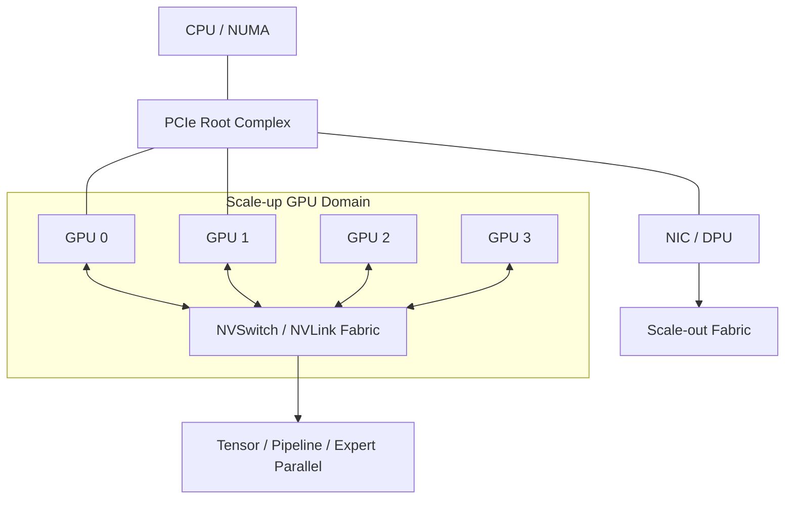

# 第 31 章：Scale-up 网络

## 本章回答的问题

- Scale-up 网络解决单节点或单系统内多 GPU 通信的什么问题？
- PCIe、NVLink、NVSwitch 和 NVLink Switch 如何影响模型并行和推理部署？
- 为什么调度系统需要理解 GPU-to-GPU bandwidth、NUMA 和 node 内拓扑？

## 一个真实场景

一个推理服务把 70B 模型切成多张 GPU 做 tensor parallel。部署在某些 8 卡节点上吞吐稳定，部署到另一批节点后 decode 速度下降。GPU 型号相同，显存充足，驱动版本一致。进一步检查发现，两批节点的 GPU 互联拓扑不同：一批 GPU 之间有高带宽互联，另一批部分 GPU 需要经过 PCIe 路径。

这说明 scale-up 网络不是硬件手册中的背景知识，而是模型切分、服务部署和调度决策的一部分。

## 核心概念

Scale-up 网络指在一个节点、一个机箱、一个 rack 级系统或紧耦合 GPU 域内部扩展计算能力的互联方式。它关注 GPU 与 GPU、GPU 与 CPU、GPU 与 NIC、GPU 与 HBM 之间的数据路径。

Scale-up 与 scale-out 的区别在于通信范围。Scale-up 更靠近单系统内部，通常延迟更低、带宽更高、拓扑更固定；scale-out 跨节点、跨机架，通过 InfiniBand、RoCE 或以太网络连接。训练和推理通常同时使用二者。

## 系统架构



这个架构提醒我们：GPU 之间是否直连、GPU 到 NIC 是否同 NUMA、GPU 组是否在同一个 NVLink 域，都会影响模型运行效率。

## 31.1 PCIe

PCIe 是服务器内部连接 CPU、GPU、NIC、NVMe 和其他设备的总线。它是 GPU 系统的基础路径之一。即使节点有 NVLink，GPU 到 CPU、GPU 到 NIC、GPU 到某些存储设备仍可能经过 PCIe。

PCIe 拓扑会影响数据加载、RDMA、checkpoint 和多 GPU 通信。如果 GPU 和 NIC 跨 NUMA 或跨 PCIe switch，通信路径可能更长。调度系统只知道“8 张 GPU”是不够的，还需要知道 GPU 与 NIC 的邻近关系。

工程上应保存 `nvidia-smi topo -m`、PCIe link 状态、NUMA 绑定和 NIC 位置。节点准入时也要检查 PCIe 是否降速、链路是否报错、设备是否枚举完整。

## 31.2 NVLink

NVLink 是 GPU 间高带宽互联技术，用于提升 GPU-to-GPU 数据交换能力。它对 tensor parallel、pipeline parallel、MoE expert 通信和多 GPU 推理尤其重要。

没有高效 GPU 间互联时，模型并行会受到通信瓶颈限制。计算单元可能等待权重、activation 或 partial result 传输。NVLink 的价值不只是“更快”，而是让某些模型切分策略变得可行。

但 NVLink 不是应用自动变快的保证。框架和并行策略要能使用这条路径；容器、驱动、拓扑和 NCCL 也要正确识别它。

## 31.3 NVSwitch

NVSwitch 用于构建多 GPU 之间更高连通性的交换结构。相比简单点对点连接，NVSwitch 可以让一组 GPU 形成更均衡的互联域，降低拓扑不对称对通信的影响。

对大模型训练和高并发推理，NVSwitch 域常被视为一个高性能资源单元。调度器应尽量把需要强 GPU 间通信的任务放在同一个 NVSwitch 域内，避免跨域通信。

运维上要关注 NVSwitch 和 NVLink 错误计数。GPU 没有掉卡不代表互联健康。轻微错误可能先表现为通信性能下降，之后才变成显性故障。

## 31.4 NVLink Switch

NVLink Switch 将 scale-up 域从单节点扩展到更大的系统级互联形态。它常用于把更多 GPU 组织成一个紧耦合计算域，让模型看到更大的高带宽 GPU 池。

这种形态会改变资源边界。过去调度单位可能是单台 8 卡服务器；在更大 NVLink 域中，调度单位可能变成 rack 级或系统级 GPU island。平台需要重新定义资源池、故障域、维护域和配额。

写调度策略时，不应把这类系统简单看成“更多 GPU 的普通节点”。它的价值来自低延迟互联和一致拓扑；如果任务放置破坏了这些假设，硬件优势会被浪费。

## 31.5 GPU-to-GPU bandwidth

GPU-to-GPU bandwidth 是衡量 GPU 之间数据交换能力的指标。它对 tensor parallel、activation 传输、KV Cache 分布、MoE routing 和 collective communication 都有影响。

评估 GPU-to-GPU bandwidth 时要区分单向、双向、点对点、集合通信和应用有效带宽。工具测出的点对点带宽只是起点，真实模型还会受到 kernel 调度、batch size、并行策略和框架实现影响。

平台应把带宽基线与节点拓扑绑定。某个节点通过准入后，如果后续 firmware、驱动或硬件更换导致带宽下降，需要能被回归测试发现。

## 31.6 node 内通信

Node 内通信发生在同一服务器内部，通常包括 GPU 间通信、GPU 到 CPU、GPU 到 NIC 和 GPU 到 NVMe。它的排障边界跨越硬件、驱动、容器和训练框架。

在 Kubernetes 上，node 内拓扑还会受到 Topology Manager、CPU Manager、device plugin 和容器 runtime 的影响。如果容器拿到了 GPU，但 CPU 绑核、hugepage、NIC 和 NUMA 不匹配，仍可能出现性能抖动。

Node 内通信优化的常见原则是：让强通信的 GPU 组合在一起，让 GPU 与对应 NIC 相邻，让数据加载进程靠近存储和 GPU，避免跨 NUMA 的无谓拷贝。

## 31.7 rack 内通信

Rack 内通信位于 scale-up 与 scale-out 的交界。对于 rack 级 GPU 系统，rack 内可能拥有特殊互联；对于普通服务器集群，rack 内通常由 ToR 或 leaf switch 承载。

调度上，rack 内亲和适合中等规模训练、批量推理和需要共享缓存的数据处理。它能减少跨 rack 流量，提高性能可预测性。但过度追求 rack 内放置可能造成资源碎片。

平台要让用户或上层系统表达拓扑需求：必须同节点、尽量同 rack、可跨 rack、禁止跨故障域。不同需求对应不同成本和等待时间。

## 31.8 GB200 / NVL72 类架构

GB200 / NVL72 类架构代表更大规模的紧耦合 GPU 系统形态。这类系统把 GPU、CPU、NVLink、NVSwitch、机柜供电和液冷等因素组合成系统级产品。对 AI Factory 来说，它们更像高性能生产单元，而不是一组松散服务器。

讨论这类架构时要保持中性：具体规格和产品能力会快速变化，本书关注工程影响。核心影响包括：资源边界变大、故障域变大、交付验收更复杂、调度需要理解 GPU island、维护需要更精细的 drain 和隔离。

把这种系统投入生产前，平台应先定义：一个系统级 GPU 域如何被租户使用，是否允许拆分，拆分后性能如何标注，故障时如何降级，维护时如何迁移 workload。

## 工程实现

Scale-up 拓扑应进入资源画像：

```yaml
node_topology:
  node: gpu-node-042
  numa_domains:
    - id: 0
      cpus: "0-63"
      gpus: ["GPU0", "GPU1", "GPU2", "GPU3"]
      nics: ["mlx5_0"]
    - id: 1
      cpus: "64-127"
      gpus: ["GPU4", "GPU5", "GPU6", "GPU7"]
      nics: ["mlx5_1"]
  gpu_fabric:
    type: nvswitch
    domain: nv-domain-a
  scheduling_labels:
    topology.ai-factory/gpu-domain: nv-domain-a
    topology.ai-factory/rdma-rail-count: "2"
```

调度器、准入系统和运维系统应共享这份画像，避免每个组件各自理解拓扑。

## 常见故障

- GPU 型号相同，但拓扑不同，导致同一模型吞吐差异大。
- PCIe 链路降速，节点仍被标记为健康。
- GPU 与 NIC 跨 NUMA，RDMA 性能低。
- NVLink/NVSwitch 错误计数上升，但没有告警。
- Tensor parallel 组跨越低带宽路径，decode 性能下降。

## 性能指标

- GPU-to-GPU 点对点带宽和延迟。
- NCCL 单节点 all_reduce / all_gather 性能。
- PCIe link width、link speed、replay/error 计数。
- NVLink / NVSwitch 错误计数。
- 单节点推理 tokens/s、训练 step time、GPU idle time。

## 设计取舍

把任务限制在高带宽 GPU 域内能提升性能，但会增加等待和碎片。允许跨域调度能提高利用率，但可能降低模型并行效率。调度策略应区分强通信 workload 和弱通信 workload，而不是对所有任务使用同一拓扑约束。

硬件越紧耦合，越要把故障域和维护成本考虑进去。一个大 GPU island 的效率高，但当其中一部分故障时，资源降级策略更复杂。

## 小结

- Scale-up 网络决定单节点或系统级 GPU 之间的通信效率。
- PCIe、NVLink、NVSwitch 和 NUMA 都会影响模型并行和推理性能。
- 调度系统需要理解拓扑，而不只是 GPU 数量。
- Scale-up 验收要覆盖 GPU-to-GPU bandwidth、PCIe、NVLink 和真实模型基线。

## 延伸阅读

- TODO: NVIDIA NVLink / NVSwitch 官方文档
- TODO: CUDA / NCCL 拓扑相关资料
- TODO: GPU 服务器拓扑验收案例
