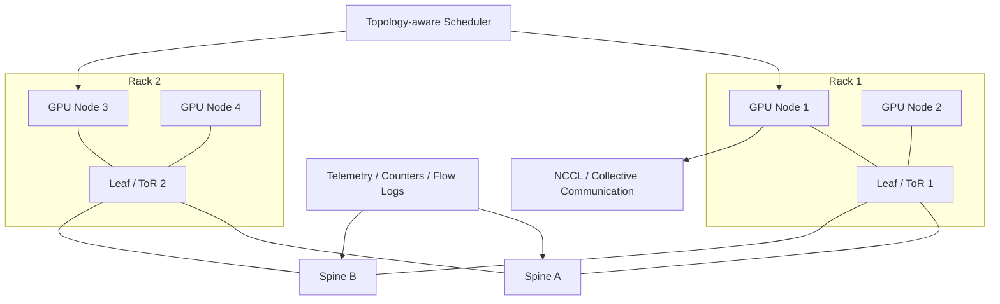

# 第 32 章：Scale-out 网络

## 本章回答的问题

- Scale-out 网络如何支撑多节点训练、分布式推理和数据访问？
- InfiniBand、RoCE、RDMA、NIC/DPU、leaf-spine、rail-optimized topology 和 adaptive routing 分别解决什么问题？
- 网络拓扑如何与 NCCL、调度和验收基线结合？

## 一个真实场景

一个 256 卡训练任务在集群 A 上训练稳定，在集群 B 上每隔一段时间出现 step time 尖刺。两边 GPU 型号相同，模型代码和 batch size 相同。平台排查后发现，集群 B 的 rank 放置跨越多个网络 rail，部分 rail 的链路利用率接近满载，NCCL 实际选择的路径和设计拓扑不一致。

Scale-out 网络的难点不只是“网卡够快”，而是让多节点通信、调度拓扑和运行时通信库形成一致的系统。

## 核心概念

Scale-out 网络指跨节点扩展计算能力的网络。它连接多个 GPU server、存储系统、控制平面和服务入口。AI Factory 的 scale-out 网络通常需要支持高带宽、低延迟、低丢包、拓扑可预测和可观测。

分布式训练最依赖 scale-out 网络。推理也会使用它，例如多节点 tensor parallel、PD 分离、跨节点 KV Cache、批量推理和权重加载。存储系统也依赖它提供数据集和 checkpoint 的吞吐。

## 系统架构



Scale-out 网络要与调度器和运行时协同。拓扑设计如果没有进入调度系统，任务放置可能破坏网络设计；运行时如果没有正确选择接口，通信可能走错路径。

## 32.1 InfiniBand

InfiniBand 是高性能计算和 AI 训练中常见的网络技术，强调低延迟、高吞吐和 RDMA 能力。它通常配套专用交换机、子网管理和端到端管理工具。

InfiniBand 的优势是体系相对完整，训练集群常用它构建高性能 fabric。它的运维重点包括 fabric 管理、端口状态、链路错误、路由、拥塞和拓扑一致性。

选择 InfiniBand 时，要考虑组织是否具备相应网络运维能力。高性能网络不是只采购设备，还需要准入测试、拓扑管理、firmware 管理和故障定位流程。

## 32.2 RoCE

RoCE 是在以太网上承载 RDMA 的技术路线。它复用以太生态，便于与既有数据中心网络结合，但对无损或低丢包网络配置要求高。

RoCE 工程复杂度主要来自端到端配置一致性。PFC、ECN、DCQCN、QoS、MTU、队列和交换机 buffer 都可能影响训练稳定性。轻载测试通过不代表高并发训练稳定。

RoCE 的价值在于以太生态和灵活性。它适合具备强网络工程能力、希望统一以太基础设施的组织。它也要求平台把网络配置纳入变更和验收，而不是只交给单点设备配置。

## 32.3 RDMA

RDMA 是 Remote Direct Memory Access，允许一台机器直接访问另一台机器内存，减少 CPU 参与和数据拷贝。AI 训练的 NCCL 通信、存储访问和某些高性能服务会使用 RDMA。

RDMA 的收益来自低延迟和高吞吐，但它对网络健康敏感。RDMA error、重传、路径不一致和权限配置问题都可能导致性能下降或任务 hang。

容器环境中使用 RDMA 还需要 device plugin、CNI、权限、mount、ulimit 和安全策略配合。GPU 容器能看到 GPU 不代表能正确访问 RDMA 设备。

## 32.4 NIC / DPU

NIC 是网络接口卡，DPU 则在 NIC 基础上增加更强的数据处理和隔离能力。AI 节点常有多块高速 NIC，用于多 rail 通信、存储访问或隔离不同网络域。

NIC 与 GPU 的拓扑关系很关键。理想情况下，GPU 通信使用靠近自身 NUMA 域的 NIC，避免跨 CPU socket 或跨 PCIe switch。DPU 还可能承载虚拟网络、安全隔离或存储协议处理。

运维上要管理 NIC firmware、驱动、OFED/RDMA 栈、端口状态和交换机连接。NIC 异常常表现为某些 rank 慢，而不是整机故障。

## 32.5 leaf-spine

Leaf-spine 是数据中心常见的无阻塞或低收敛比网络拓扑。节点连接 leaf，leaf 连接 spine。它的目标是提供可预测的东西向通信路径。

AI 训练对 leaf-spine 的要求更高：要关注 oversubscription、ECMP 哈希、flowlet、拥塞、buffer 和故障域。多个训练任务同时跨 rack 通信时，热点路径会迅速暴露。

调度系统应知道 rack、leaf、spine 和故障域信息。否则任务可能跨越过多 leaf，增加网络压力和尾延迟。

## 32.6 rail-optimized topology

Rail-optimized topology 指多网卡、多平面通信中，让相同编号的 NIC 或 rail 连接到对应网络路径，从而让集体通信更均衡。大规模训练常用 rail 概念减少热点和提升带宽利用。

Rail 优化要求硬件布线、主机命名、接口配置、NCCL 选择和调度放置一致。如果节点布线或接口命名混乱，运行时可能无法按预期使用多 rail。

平台应把 rail 信息作为资源属性管理。例如节点有几条 rail，每条 rail 对应哪个 NIC、哪个 leaf、哪个 NUMA 域，以及哪些任务需要完整 rail。

## 32.7 adaptive routing

Adaptive routing 是根据网络状态动态选择路径的机制，用于缓解热点和拥塞。它可以提升大规模通信下的网络利用率，但也可能让流量路径更难预测。

AI 训练需要在可预测性和自适应之间取舍。静态路径便于排障，但遇到热点时性能下降；自适应路径提高弹性，但需要更好的 telemetry 解释任务为什么变慢。

使用 adaptive routing 时，准入测试应覆盖多任务并发场景，而不仅是单任务峰值。单个 benchmark 跑得好，不代表真实混部负载下稳定。

## 32.8 collective communication

Collective communication 是多进程协同通信原语，如 AllReduce、AllGather、ReduceScatter 和 Broadcast。NCCL 会根据拓扑和算法选择通信路径。

Scale-out 网络最终要服务 collective communication。网络设计、rank 放置和 NCCL 参数不一致时，collective performance 会下降。比如 rank 分布跨越远距离拓扑，或者 NCCL 没选中期望 NIC。

工程上应把 NCCL test 作为网络验收的一部分。它不能替代真实训练，但能把网络、驱动、RDMA 和 GPU 通信放在同一个压力场景下验证。

## 工程实现

Scale-out 网络上线前应建立如下信息模型：

```yaml
fabric:
  name: train-fabric-a
  type: roce
  topology: leaf-spine
  rails:
    - rail: rail0
      nic_selector: mlx5_0
      leaf_group: leaf-a
    - rail: rail1
      nic_selector: mlx5_1
      leaf_group: leaf-b
  scheduling:
    expose_rack: true
    expose_rail_count: true
    prefer_same_leaf_for_small_jobs: true
  validation:
    rdma: pass
    nccl_multi_node: pass
    congestion_baseline: pass
```

任务提交系统可以用这些信息提示用户：当前等待是 GPU 不足、rail 不满足、同 rack 不满足，还是 quota 限制。

## 常见故障

- NCCL 选择了错误网卡，训练吞吐低。
- RoCE 配置不一致，轻载正常，压力下出现丢包和重传。
- 多 rail 布线不一致，部分 rank 走远路径。
- 单个 leaf 热点导致训练 step time 周期性尖刺。
- RDMA device 没有正确注入容器，任务启动后通信失败。

## 性能指标

- 节点间 RDMA 带宽、延迟、重传和错误计数。
- NCCL multi-node all_reduce/all_gather 带宽和耗时。
- 交换机端口利用率、丢包、ECN mark、PFC pause。
- Rail 利用率均衡度。
- 训练 step time、communication time、GPU idle time。

## 设计取舍

InfiniBand 通常提供成熟的高性能训练网络体验，但生态和运维体系相对专用。RoCE 复用以太生态，灵活性强，但需要更严格的端到端配置治理。单 fabric 简单，隔离弱；多 fabric 隔离好，成本和运维复杂度高。

Scale-out 网络的目标不是追求单项 benchmark 极限，而是在真实多租户、多任务、故障和变更条件下保持可预测性能。

## 小结

- Scale-out 网络连接多个 GPU 节点，是分布式训练的关键生产路径。
- InfiniBand 和 RoCE 都需要完整的验收、观测和运维体系。
- RDMA、NIC/DPU、leaf-spine、rail 和 NCCL 必须协同设计。
- 调度器需要理解网络拓扑，才能把硬件能力转化为 workload 性能。

## 延伸阅读

- TODO: InfiniBand 官方资料
- TODO: RoCE / RDMA 官方资料
- TODO: NCCL 网络调优资料
