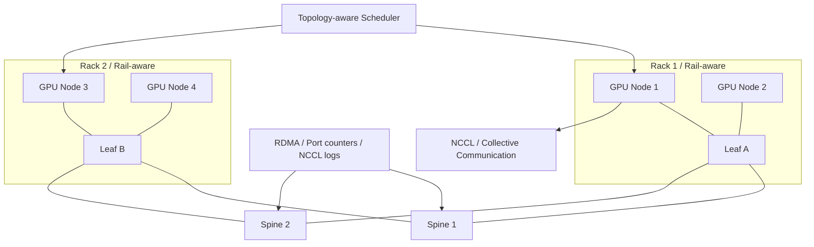
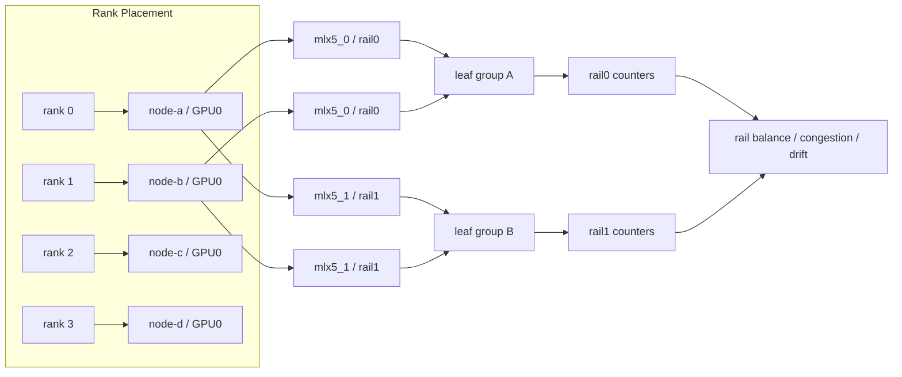
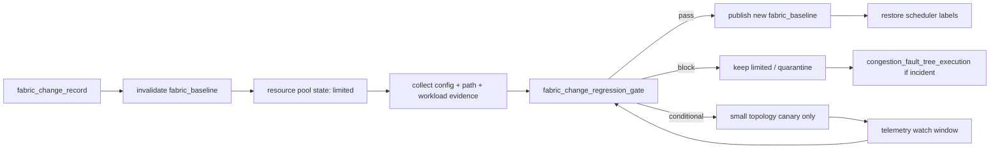

# 第 32 章：Scale-out 网络

## 32.1 导读

### 32.1.1 本章回答的问题

- Scale-out 网络如何支撑多节点训练、分布式推理和数据访问？
- InfiniBand、RoCE、RDMA、NIC/DPU、leaf-spine、rail-optimized topology 和 adaptive routing 分别解决什么问题？
- 网络拓扑如何与 NCCL、调度和验收基线结合？


### 32.1.2 本章上下文

- 层级定位：本章属于 `网络与存储层`，重点讨论AI 网络、scale-up/scale-out、RDMA、对象存储、PFS 和 NVMe。
- 前置依赖：建议先理解 第 31 章：Scale-up 网络 中的核心对象和路径。
- 后续关联：本章内容会继续连接到 第 33 章：AI 存储系统，并在系统地图、深度标准和读者测试中被交叉引用。
- 读完能力：读完本章后，读者应能把《Scale-out 网络》中的概念映射到 AI Factory 的生产路径、工程对象、观测证据和设计取舍。


### 32.1.3 读者测试

- 机制题：读者能否解释 InfiniBand、RoCE、RDMA、NIC / DPU 的核心机制，以及它们如何共同支撑《Scale-out 网络》？
- 边界题：读者能否区分 网络、存储、runtime、调度和物理故障域 的责任边界，并说明哪些问题不能简单归因到本章组件？
- 路径题：读者能否从训练或推理性能症状追到网络路径、存储路径、checkpoint、缓存和 telemetry，并指出本章对象在路径中的位置？
- 排障题：当《Scale-out 网络》相关生产症状出现时，读者能否列出第一层证据、下一跳证据、可能 owner 和止血动作？


### 32.1.4 一个真实场景

一个 256 卡训练任务在集群 A 上训练稳定，在集群 B 上每隔一段时间出现 step time 尖刺。两边 GPU 型号相同，模型代码、batch size、训练框架和容器镜像也相同。平台最初怀疑节点健康和存储读取，但 GPU 指标没有明显异常，存储吞吐也没有打满。进一步把 rank 映射到节点和网络拓扑后，发现集群 B 的 rank 放置跨越多个 rail，部分 rail 链路利用率接近满载，NCCL 实际选择的路径和设计拓扑不一致。

另一个问题发生在 RoCE 集群扩容后。新加入的 rack 小规模测试通过，但与老 rack 混跑大训练时出现 RDMA 重传和长尾延迟。网络团队检查后发现，部分交换机队列和 ECN/PFC 参数与既有 fabric 不一致；轻载时问题不明显，高并发 AllReduce 时才暴露。训练团队看到的是随机 hang，网络团队看到的是少数端口计数异常，平台团队看到的是某些作业失败率升高。

这些场景说明，scale-out 网络的难点不只是“网卡够快”。多节点 AI 通信要求硬件拓扑、链路配置、RDMA 栈、NCCL、rank 放置、调度策略和观测基线一致。任何一层不一致，都可能把高性能网络变成不可解释的性能波动。Scale-out 网络是训练集群的生产主干，不是普通 east-west 网络的简单升级。

Scale-out 网络还连接存储和推理。分布式推理、PD 分离、跨节点 KV Cache、模型权重加载、批量推理和数据读取都会使用它。训练通信、推理流量和存储流量如果共享 fabric，就必须理解彼此的突发和优先级。AI Factory 的 scale-out 网络设计，必须从 workload、拓扑和运营能力一起出发。

这类问题的排障顺序也值得注意。不要先争论“网络有没有问题”，而要先把证据串起来：job 的 step time 何时变慢，慢的是计算、通信还是 I/O；rank 分布在哪些节点、rack 和 rail；NCCL 实际使用了哪些接口；交换机端口在同一时间是否出现错误、拥塞或重传。Scale-out 网络的生产能力，最终体现在它能否把这些证据快速关联，而不是体现在单条链路的宣传带宽。


## 32.2 基础模型

### 32.2.1 核心概念

Scale-out 网络指跨节点扩展计算能力的网络。它连接多个 GPU server、存储系统、控制平面、模型服务和数据处理任务。与 scale-up 网络相比，scale-out 跨越节点、rack、leaf、spine、rail 和 sometimes region，目标是在更大范围内提供高带宽、低延迟、低丢包、拓扑可预测和可观测的通信能力。

分布式训练最依赖 scale-out 网络。Data parallel 的 gradient synchronization、tensor parallel 的跨节点通信、pipeline parallel 的 stage 传输、expert parallel 的 token dispatch、checkpoint 读写和数据加载，都可能经过 scale-out fabric。网络慢会直接变成 GPU idle、step time 增加和训练成本上升。

关键技术包括 InfiniBand、RoCE、RDMA、NIC/DPU、leaf-spine、rail-optimized topology、adaptive routing 和 collective communication。InfiniBand 和 RoCE 是常见高性能 fabric 路线；RDMA 是低延迟高吞吐的数据访问机制；NIC/DPU 是节点接入和隔离能力；leaf-spine 是数据中心拓扑；rail 优化用于多网卡多平面通信；NCCL 把拓扑转化为 collective performance。

Scale-out 网络的核心工程原则是端到端一致。硬件布线、交换机配置、NIC firmware、OFED、容器设备、NCCL 参数、调度拓扑和验收测试必须相互匹配。单点设备配置正确，不代表整个训练路径正确。AI Factory 要把网络拓扑变成平台可使用的资源属性。

因此，scale-out 网络的交付物不只是网络设备和连通性报告，还应包括拓扑数据、资源标签、准入基线、变更规范和诊断入口。平台需要知道哪些节点属于同一 fabric，哪些节点缺 rail，哪些 NIC 与 GPU 拓扑亲和，哪些 rack 处于 degraded 状态。只有这些信息进入调度和观测系统，网络才从“基础设施背景”变成可运营的 AI 生产资源。

还要区分物理能力和可交付能力。物理上有端口、有链路、有交换机，不代表平台能把它稳定交付给租户。可交付能力需要明确 SLA、隔离等级、调度规则、验收状态和故障处理方式。例如同样是 8 卡节点，有的适合单机推理，有的适合跨节点训练，有的因为 rail 降级只能跑低优作业。Scale-out 网络的抽象必须能表达这种差异。


### 32.2.2 系统架构

Scale-out 网络架构通常包括 GPU 节点、NIC/DPU、rack leaf 或 ToR、spine、网络 fabric 管理、RDMA/OFED、调度系统、NCCL runtime、存储系统和 telemetry。节点通过多张 NIC 接入一个或多个 rail，leaf-spine 提供 rack 间通信，调度器根据 rack、rail、fabric 和故障域选择节点，NCCL 根据接口和拓扑选择通信路径。

架构的关键是把物理拓扑、逻辑拓扑和运行时拓扑对齐。物理拓扑是线缆、端口、交换机和 rack；逻辑拓扑是资源池中的 rack、rail、leaf group、fault domain；运行时拓扑是 NCCL 和应用实际使用的 NIC、路径和 rank placement。三者不一致时，硬件设计的带宽无法转化为训练性能。

Scale-out 网络也要与存储路径协同。数据集读取、checkpoint 写入、模型权重加载和日志上报可能与训练通信共享网络。若存储流量没有限速、隔离或错峰，可能在训练通信阶段制造拥塞。架构上应明确训练 fabric、存储网络和管理网络是否共享，以及共享时的优先级和观测边界。

Telemetry 是架构的一部分，而不是附加系统。端口利用率、错误包、ECN mark、PFC pause、RDMA 重传、NCCL 带宽、rank skew、flow logs 和 job 时间线应能关联。Scale-out 网络一旦规模变大，没有 telemetry 就无法运营。故障往往不是全局断网，而是局部路径退化。

一个可落地的架构还需要定义控制面和数据面的边界。控制面负责拓扑发现、节点标签、配置审计、变更审批、准入结果和健康状态；数据面负责训练通信、存储访问、推理流量和管理流量。两者不能混在临时脚本里。控制面一旦缺失，平台无法解释为什么某个 job 被放到某组节点，也无法在网络 degraded 时自动停止新任务进入风险区域。



下面这张图强调多 rail 放置的证据链。设计上的 rail 只有在调度、容器、NCCL 和交换机端口计数都一致时才成立。某个环节漂移，都会让“多 rail 网络”退化成“看起来有多张网卡，实际流量集中在少数路径”。




## 32.3 关键技术

### 32.3.1 InfiniBand

InfiniBand 是高性能计算和 AI 训练中常见的网络技术，强调低延迟、高吞吐和 RDMA 能力。它通常配套专用交换机、子网管理、fabric 管理工具和较完整的高性能通信生态。在大规模训练集群中，InfiniBand 常用于构建专用训练 fabric。

InfiniBand 的优势是体系相对完整，端到端能力围绕高性能通信设计。它能提供低延迟、较强 fabric 管理能力和成熟 HPC 使用经验。对于追求训练稳定性、通信性能和统一高性能网络运维的组织，InfiniBand 是重要选项。它的价值不只在链路速率，也在整套 fabric 的可管理性。

运维重点包括 subnet manager、路由、端口状态、链路错误、拥塞、分区、firmware、线缆和拓扑一致性。InfiniBand 网络不是买完设备就稳定运行，需要持续验收和监控。端口错误、路由异常或局部拥塞，可能只影响部分 job，却显著降低训练效率。

选择 InfiniBand 时，还要考虑组织能力和生态成本。团队需要理解 fabric 管理、故障定位、固件升级、NCCL 集成和验收基线。高性能网络的价值只有在运维能力跟上时才能兑现。否则问题出现后，平台仍然会卡在“网络设备看起来正常，但训练慢”的困境。

验收 InfiniBand 时，不能只看端口 up 或单节点带宽。应按拓扑域测试节点对、rack 对、多节点 collective、故障绕行和长期压力；同时记录 subnet manager 状态、端口错误、链路 flapping、拥塞事件和 NCCL 结果。对 AI Factory 来说，InfiniBand 的“可用”不是物理链路可用，而是大规模 job 在指定拓扑内可预测地完成通信。这个基线要在扩容、换线、升级 firmware 和更换交换机后重复验证。

InfiniBand 的组织边界也要清楚。网络团队维护 fabric，平台团队把拓扑和健康状态暴露给调度，训练团队用 NCCL 和框架消费能力。若三方没有共同指标，排障会变成互相证明自己无错。更好的方式是建立共享基线：同一组节点、同一套 NCCL 测试、同一份端口计数和同一条变更记录。这样才能把问题定位在 fabric、节点、runtime 或 workload。


### 32.3.2 RoCE

RoCE 是在以太网上承载 RDMA 的技术路线。它复用以太生态，便于与既有数据中心网络、交换机、工具链和运营体系结合。对希望统一以太基础设施、避免完全独立网络体系的组织来说，RoCE 很有吸引力。但它对端到端低丢包和拥塞控制配置要求高。

RoCE 有两个常见代际口径。RoCEv1 工作在二层，以太网广播域和运维边界限制明显；RoCEv2 把 RDMA 语义承载在 UDP/IP 上，更适合三层网络和更大规模数据中心，但它仍继承了对低丢包、低乱序和端到端配置一致性的要求。iWARP 则把 RDMA 语义放在 TCP 之上，传输层和 RDMA 语义分离更清晰，但生态和 AI 训练实践通常不如 InfiniBand/RoCE 常见。理解这些演进，有助于避免把“RDMA over Ethernet”看成单一方案。

RoCE 的工程复杂度主要来自一致性。PFC、ECN、DCQCN、QoS、MTU、队列、buffer、NIC firmware、交换机配置和 CNI/容器设备注入都可能影响训练稳定性。某个 rack 或某个交换机配置轻微不同，可能在小规模测试中不暴露，却在大规模 AllReduce 下导致重传、拥塞和 tail latency。

RoCE 的价值在于以太生态和灵活性。它可以让 AI 网络与既有网络运营能力更接近，也可能降低多网络体系的复杂度。但这种灵活性不是免费午餐。平台必须把 RoCE 配置纳入版本管理、准入测试和变更回归。不能只把 RoCE 当作“开启 RDMA 的以太网”。

PFC/lossless Ethernet 尤其需要谨慎。PFC 可以在特定优先级上暂停发送，减少丢包，但也可能带来 pause 传播、拥塞扩散、队列阻塞和类似死锁的运维风险。AI 训练的同步突发会放大这些风险。成熟 RoCE 设计通常会把 PFC、ECN、端侧拥塞控制、QoS、buffer 和流量隔离一起设计，并在压力测试中验证，而不是把“无丢包”简单交给 PFC。

实践中，RoCE 更需要自动化校验。每台节点、每个端口、每条队列、每个 MTU 和 PFC/ECN 参数都应可审计。扩容、替换交换机、更新 NIC firmware 或修改 QoS 后，要跑 RDMA 和 NCCL 回归。RoCE 稳定性来自端到端纪律。

诊断 RoCE 时要避免只从应用日志出发。应用看到的常是 NCCL timeout、吞吐下降或 rank hang，真正线索可能在交换机队列、pause frame、ECN mark、NIC 重传、buffer 水位和路径哈希上。平台应把 RoCE 配置当作软件版本管理：有期望配置、有漂移检测、有变更窗口、有回滚策略。否则每次网络微调都会变成训练任务的隐性实验。

RoCE 的另一个取舍是共享以太生态带来的干扰。训练、存储、管理和普通服务如果共享网络域，QoS 和流量隔离就不是可选项。训练 AllReduce 的同步突发、checkpoint 的写入突发、对象存储的请求突发会互相影响。平台需要明确哪些流量可以共享，哪些流量必须隔离，哪些租户或任务在拥塞时降级。没有这些策略，RoCE 的灵活性会变成不可预测性。


### 32.3.3 RDMA

RDMA 是 Remote Direct Memory Access，允许一台机器直接访问另一台机器内存，减少 CPU 参与和数据拷贝。AI 训练中的 NCCL 通信、参数同步、存储访问和某些高性能服务会使用 RDMA。它的目标是降低延迟、提高吞吐，并减少 CPU 在数据搬运中的开销。

RDMA 的核心来自 kernel bypass、零拷贝和直接数据放置。早期 HPC、U-Net/VIA 和 InfiniBand 体系都在解决同一类问题：避免让 CPU 和内核协议栈成为高速通信瓶颈。现代 AI 集群消费的是这些思想的工程化结果：NIC、driver、verbs、注册内存、队列对、completion queue、NCCL 和容器设备注入共同组成通信路径。RDMA 不是一个单独开关，而是一整套端到端契约。

RDMA 的收益来自低延迟和高吞吐，但它对网络健康、权限和配置非常敏感。RDMA error、重传、GID 配置、MTU 不一致、容器设备不可见、内核/OFED 不匹配、NIC firmware 问题，都可能让通信性能下降或任务 hang。RDMA 故障常常表现为训练运行时问题，而不是简单连接失败。

容器环境中的 RDMA 更复杂。GPU 容器能看到 GPU，不代表能正确访问 RDMA 设备。需要 device plugin、CNI、权限、mount、ulimit、security context 和库路径配合。Kubernetes 上的 RDMA 验收必须从容器内运行，而不是只在宿主机上检查设备。

工程上，RDMA 信息应进入资源池和作业诊断。节点使用哪个 NIC、哪个 GID、哪个 MTU、哪个 OFED、哪个 firmware，容器是否能访问设备，NCCL 是否选择了期望接口，都应能被记录。没有这些信息，RDMA 问题会在网络、平台和模型团队之间反复转移。

RDMA 验收应分三层。第一层是宿主机设备和链路，包括端口状态、GID、MTU、驱动和固件；第二层是容器内可见性，包括设备文件、库路径、权限和安全策略；第三层是 workload 级通信，包括 NCCL test、真实训练片段和故障注入。很多集群只做第一层，结果上线后才发现容器和训练框架没有走到预期路径。把 RDMA 当成资源交付，就必须验证到使用者实际运行的位置。

RDMA 还会改变故障语义。普通 TCP 场景中，应用可能看到连接错误或明显超时；RDMA 场景中，错误可能表现为长时间等待、性能退化或少数队列异常。平台需要给用户提供可理解的错误翻译，例如“容器未获得 RDMA 设备”“NCCL 未选择预期 GID”“某 rail 出现重传”。把底层计数直接甩给训练用户，无法形成有效运维闭环。

可靠传输策略也会影响 RDMA 体验。Go-back-N 式恢复在乱序或丢包后可能重传较大窗口，简单但代价高；选择性重传或 SACK-like 恢复能减少不必要重传，但需要更复杂的状态管理。Packet spray、multipath 和 flowlet 让流量更均衡，但会引入乱序；很多 RDMA/AI 通信路径要求对应用保持有序完成，因此底层传输要在乱序网络和有序 completion 之间做协调。新一代 AI 网络传输的方向，是把多路径、选择性恢复、端点驱动拥塞控制和 RDMA 语义解耦结合起来。


### 32.3.4 NIC / DPU

NIC 是网络接口卡，DPU 则在 NIC 基础上增加更强的数据处理、隔离和卸载能力。AI 节点常有多块高速 NIC，用于多 rail 通信、存储访问、管理隔离或多网络域。NIC 是 GPU 节点进入 scale-out fabric 的关键入口。

NIC 与 GPU 的拓扑关系非常重要。理想情况下，GPU 通信使用靠近自身 NUMA 域的 NIC，避免跨 CPU socket 或跨 PCIe switch。若 GPU 与 NIC 亲和关系不佳，RDMA 和 NCCL 性能可能下降。调度器如果只知道节点有 NIC，不知道 GPU-to-NIC 关系，就无法做高质量放置。

DPU 可能承载虚拟网络、安全隔离、存储协议、遥测或流量处理。它能提高隔离和卸载能力，但也增加软件栈、固件、监控和故障模式。DPU 异常可能表现为网络慢、存储慢或容器网络异常。平台要明确 DPU 在 AI 节点中的职责。

NIC/SuperNIC 的设计要服务 workload。HPC 小消息和数据库一侧操作需要极低延迟和大量队列状态；分布式存储需要处理 incast、tail latency 和恢复；AI 训练需要高带宽、突发 collective、AllToAll 和多 rail；云多租户还需要隔离、限速、遥测和安全策略。纯 ASIC fast path 在低延迟上有优势，但灵活性有限；可编程网络处理器、microcode 或 P4 类路径更适合快速变化的策略，但可能增加延迟或算力不足。实际趋势是 ASIC fast path 加可编程控制/遥测/拥塞控制核心，而不是二选一。

运维上，要管理 NIC firmware、驱动、OFED/RDMA 栈、端口状态、队列、温度、错误计数、交换机连接和拓扑标签。NIC 异常常表现为某些 rank 慢，而不是整机故障。NIC/DPU 状态必须进入节点健康和调度决策。

在资源模型中，NIC/DPU 不应只是节点附属信息。一个节点有多少张高速 NIC、每张 NIC 属于哪个 rail、靠近哪些 GPU、是否具备 RDMA、是否可被容器使用、是否处于维护状态，都应成为调度可见属性。否则 GPU 调度会把任务放到“GPU 满足但网络不满足”的节点集合。DPU 引入后还要明确责任边界：哪些流量被卸载，哪些安全策略在 DPU 上执行，DPU 故障是否会影响主机网络、存储路径或租户隔离。

NIC/DPU 的生命周期管理也要纳入节点准入。固件版本、驱动版本、链路速率、温度、错误计数、端口连接和 NUMA 亲和应在入池前记录，运行中持续对比。维护后如果 NIC 被插到不同槽位，GPU-to-NIC 拓扑可能改变，训练性能也会改变。对 AI 集群来说，这不是硬件细节，而是可重复性能的一部分。

开放互联生态也在演进。UEC/UET、UALink、NVLink Fusion 等方向都在尝试把 AI 加速器互联、以太网传输、多路径、端侧拥塞控制和开放生态结合起来。2026 年规划时可以把它们纳入技术路线观察和 canary 评估，但不应把未在本组织生产验证的标准或联盟路线当作默认可交付能力。平台书写规格时应区分“已生产验证”“可灰度验证”和“技术趋势”。


### 32.3.5 leaf-spine

Leaf-spine 是数据中心常见的网络拓扑。节点连接 leaf 或 ToR，leaf 连接 spine，目标是提供可预测的东西向通信路径。相比传统三层网络，它更适合大规模 east-west 流量。AI 训练集群通常需要关注 leaf-spine 的收敛比、路径多样性、故障域和拥塞行为。

AI 训练对 leaf-spine 的要求更高。多个训练任务同时跨 rack 通信时，热点路径会迅速暴露。ECMP 哈希、flowlet、buffer、PFC、ECN、oversubscription 和故障绕行都会影响 tail latency。普通业务可接受的短时拥塞，在同步训练中可能放大为 step time 尖刺。

调度系统应知道 rack、leaf、spine 和故障域信息。小任务可以优先同 rack 或同 leaf，大任务需要跨 leaf 时应尽量均衡路径，高可用推理服务则要避免副本集中在同一故障域。网络拓扑如果不进入调度，leaf-spine 设计只能停留在网络层。

工程上，leaf-spine 验收不应只测任意两点带宽。要按 rack 对、leaf 对、spine 路径、多任务并发和故障绕行测试。还要记录端口错误、拥塞标记和链路利用率。AI fabric 的验收粒度应贴近任务放置方式。

容量规划也必须按拓扑看。一个集群总带宽看似充足，但如果高优训练经常跨越同一组 spine，实际瓶颈会集中在少数链路。推理服务副本如果集中在同一个 leaf 下，局部故障会同时影响多个 endpoint。平台应把 leaf-spine 信息转换成可理解的放置策略：同 rack 优先、跨 rack 均衡、故障域打散、热点区域降权。网络拓扑的价值，只有在调度和容量运营中被使用，才不会停留在设计图上。

故障域设计也依赖 leaf-spine。训练任务追求通信局部性，可能希望节点尽量集中；在线推理追求可用性，副本要跨 leaf 或 rack 打散。两者目标相反，不能使用同一套默认放置规则。平台应让 workload 声明偏好，或者根据作业类型自动选择策略。否则为了训练优化的集中放置，可能让推理服务暴露在单个网络故障域中。


### 32.3.6 rail-optimized topology

Rail-optimized topology 指多网卡、多平面通信中，让相同编号的 NIC 或 rail 连接到对应网络路径，从而让集体通信更均衡。大规模训练常用 rail 概念减少热点，提高带宽利用率，并让 NCCL 更容易把流量分布到多条网络路径上。

Rail 优化要求硬件布线、主机命名、接口配置、NCCL 选择和调度放置一致。节点有几条 rail，每条 rail 对应哪个 NIC、哪个 NUMA、哪个 leaf group，必须被平台知道。如果接口命名混乱或布线不一致，运行时可能无法按预期使用多 rail，部分流量会集中到单一路径。

平台应把 rail 信息作为资源属性管理。任务可以声明需要完整 rail、至少几条 rail、是否允许跨 rail 不均衡。调度器可以避免把大训练放到 rail 缺失或配置异常的节点集合。资源池也应记录 rail 健康和利用率，而不是只看 NIC 总数。

Rail 优化还要与 NCCL 参数和拓扑文件协同。NCCL 需要选择正确接口，并理解 rank placement。平台应提供默认模板和诊断信息，避免用户在训练脚本中手工猜测 `NCCL_SOCKET_IFNAME` 或其它接口参数。Rail 是硬件、网络和运行时共同形成的能力。

验收 rail 时，应检查“设计 rail”和“实际 rail”是否一致。设计上 rail0 连接一组 leaf，rail1 连接另一组 leaf；实际运行时还要确认接口命名、容器可见设备、NCCL 选择、流量分布和端口利用率都符合预期。任何一处漂移都会让多 rail 变成形式上的冗余。对大训练池，应定期生成 rail 健康报告，把缺线、错线、降速和异常利用率纳入资源池状态。

Rail 信息还应进入用户可见诊断，而不是只保存在网络图纸里。当任务 pending 时，用户应能看到是 GPU 不足、完整 rail 不足，还是同一拓扑域内资源不足；当任务变慢时，用户应能看到 rail 利用是否均衡。这样做可以减少手工调参，也避免用户绕过平台自己指定节点。Rail 优化的最终目标，是让复杂拓扑成为平台能力，而不是用户负担。


### 32.3.7 adaptive routing

Adaptive routing 是根据网络状态动态选择路径的机制，用于缓解热点和拥塞。它可以提升大规模通信下的网络利用率，特别是在多任务、多路径和局部拥塞场景中。相比固定路径，它能让流量更灵活地绕开热点。

但 adaptive routing 也会让流量路径更难预测。训练任务慢时，团队需要知道流量实际走了哪些路径、是否发生路径切换、是否与其它 job 竞争。没有 telemetry，adaptive routing 会把问题藏进网络黑盒。性能提升和可解释性之间需要平衡。

使用 adaptive routing 时，准入测试应覆盖多任务并发和热点场景，而不仅是单任务峰值。单个 benchmark 跑得好，不代表真实混部负载下稳定。还要验证它与拥塞控制、ECMP、PFC/ECN、NCCL 和故障绕行的组合行为。

工程上，应把 adaptive routing 状态纳入变更管理。开启、关闭或修改策略，都可能改变训练性能和故障表现。平台需要基线、灰度和回滚。对关键训练池，不应在无 workload 回归的情况下修改路径策略。

引入 adaptive routing 前，要先回答两个问题：是否有足够的路径冗余让它发挥作用，是否有足够的可观测性解释它的行为。如果 fabric 本身收敛比较高、热点长期存在或链路健康不均衡，自适应路由可能只是把问题从固定位置扩散到更多路径。它适合缓解动态热点，不应替代容量规划和拓扑治理。AI Factory 的策略应是先建立稳定基线，再用自适应能力处理不可避免的波动。

对训练系统来说，可重复性同样重要。一次 benchmark 走某条路径，下一次因为路由调整走另一条路径，结果差异可能被误判为模型代码或框架变化。因此 adaptive routing 的启用范围、策略版本和观测数据都应写入作业元数据。需要排查性能回归时，团队才能知道网络路径策略是否发生变化，而不是只比较训练日志。


### 32.3.8 collective communication

Collective communication 是多进程协同通信原语，如 AllReduce、AllGather、ReduceScatter、Broadcast 和 AllToAll。大模型训练和并行推理大量依赖这些原语。NCCL 会根据 GPU 拓扑、网络拓扑、消息大小、算法和环境变量选择通信路径。

Scale-out 网络最终要服务 collective communication。网络设计、rank 放置和 NCCL 参数不一致时，collective performance 会下降。比如 rank 分布跨越远距离拓扑，NCCL 没选中期望 NIC，或者 rail 不均衡，都可能让 AllReduce 带宽低于预期。网络性能要通过 collective 视角验证。

NCCL test 是网络验收的重要工具，但不能替代真实训练。它能把 GPU、driver、RDMA、网络和通信库放在同一个压力场景下验证，适合作为准入和回归基线。真实模型还会受到 batch、计算图、checkpoint、数据读取和框架实现影响，因此需要结合 workload 指标。

工程上，应把 collective 指标与任务元数据绑定：job id、模型、并行策略、rank placement、节点、NIC、rail、NCCL version、环境变量和端口计数。这样当 collective performance 下降时，平台能判断是网络路径、运行时参数、调度放置还是模型配置变化。

诊断 collective communication 时，最重要的是区分“网络慢”和“通信阶段变长”。通信阶段变长可能来自网络拥塞，也可能来自 rank skew、某些 GPU 计算落后、数据加载不同步、checkpoint 干扰或并行策略不合理。NCCL test 提供的是通信栈基线，真实训练提供的是系统结果。两者都需要保留，才能判断问题是 fabric 退化、runtime 变化，还是 workload 自身改变。

Collective communication 也是容量规划的输入。不同并行策略对网络压力不同：data parallel 偏向周期性 AllReduce，tensor parallel 对延迟和带宽更敏感，MoE 的 expert parallel 可能产生 AllToAll 和不均衡流量。平台如果只按 GPU 数量计费或调度，就会忽略这些通信差异。更成熟的做法是记录模型并行策略和通信画像，把网络需求纳入 quota、队列和资源等级。


## 32.4 工程落地

### 32.4.1 工程实现

Scale-out 网络上线前应建立 fabric 信息模型。它描述网络类型、拓扑、rail、节点接入、调度标签、拥塞控制、RDMA 参数和验收结果。示例：

```yaml
fabric:
  name: train-fabric-a
  type: roce
  topology: leaf-spine
  rails:
    - rail: rail0
      nic_selector: mlx5_0
      leaf_group: leaf-a
    - rail: rail1
      nic_selector: mlx5_1
      leaf_group: leaf-b
  scheduling:
    expose_rack: true
    expose_rail_count: true
    prefer_same_leaf_for_small_jobs: true
  validation:
    rdma: pass
    nccl_multi_node: pass
    congestion_baseline: pass
```

这个信息模型还应包含版本和生效范围。网络不是一次配置完成就永远不变，交换机 firmware、NIC firmware、OFED、CNI、NCCL、PFC/ECN、路由策略和调度标签都可能改变。示例：

```yaml
fabric_baseline:
  baseline_id: train-fabric-a-20260619
  fabric: train-fabric-a
  scope:
    racks: [rack-11, rack-12, rack-13]
    rails: [rail0, rail1, rail2, rail3]
  versions:
    nic_firmware: recorded
    switch_firmware: recorded
    ofed: recorded
    cni: recorded
    nccl: recorded
    routing_policy: recorded
    roce_qos_profile: recorded
  tests:
    host_rdma: pass
    container_rdma: pass
    nccl_cross_rack: pass
    rail_balance: pass
    checkpoint_plus_nccl_concurrency: pass
  state:
    schedulable_for: [distributed_training, large_scale_evaluation]
    invalidated_by: [switch_config_change, nic_replacement, ofed_upgrade]
```

这份 baseline 是调度事实源，不是网络团队内部文档。调度器可以拒绝把大训练放进 baseline 过期的 fabric，SRE 可以在事故中对比当前 counters 与 baseline，容量团队可以看到哪些 fabric 长期处于 limited 或 degraded。

网络变更必须有 `fabric_change_record`。AI Fabric 的一次修改可能来自交换机 firmware、NIC firmware、OFED、CNI、NCCL 默认参数、PFC/ECN、MTU、routing policy、rail mapping 或调度标签。它们经常不是“网络团队内部变更”，而是会改变训练通信、容器 RDMA、checkpoint 并发和推理长尾的生产变更。记录应明确影响范围、失效基线、回归测试和停止条件：

```yaml
fabric_change_record:
  change_id: fabric-chg-20260620-003
  fabric: train-fabric-a
  change_type: roce_qos_profile_update
  scope:
    racks: [rack-12, rack-13]
    rails: [rail0, rail1]
    resource_pools: [training-prod-h100]
  changed_components:
    switch_config: changed
    nic_firmware: unchanged
    ofed: unchanged
    cni: unchanged
    nccl_defaults: unchanged
    scheduler_labels: unchanged
  invalidates_baselines:
    - train-fabric-a-20260619
  required_regression:
    - host_rdma
    - container_rdma
    - nccl_cross_rack
    - rail_balance
    - checkpoint_plus_nccl_concurrency
    - representative_training_collective_trace
  stop_conditions:
    - rdma_retransmit_above_baseline
    - rail_balance_ratio_below_policy
    - p99_step_time_regression
    - communication_regression_record_failed
  rollback:
    method: restore_previous_qos_profile
    verification: rerun_same_topology_baseline
```

这份记录的核心是把“网络参数改了”变成可审计的软件发布。它会告诉调度器哪些 baseline 失效，告诉 SRE 故障是否可能与近期变更相关，也告诉容量团队某个 fabric 在回归完成前是否只能 limited 使用。没有这类记录，网络事故常常只能靠人记忆“最近有没有动过交换机”。

对训练 fabric 来说，`fabric_change_record` 的完成条件不应止于网络基线通过，还应产生第 18 章的 `communication_regression_record`。原因很简单：网络层看到的 RDMA、端口和 rail 结果，只能证明 fabric 自身没有明显退化；训练层的 collective trace 才能证明真实 workload 没有出现 step time、rank skew、checkpoint overlap 或 NCCL env 漂移。一次 RoCE QoS 调整可能让单流带宽正常，却让多任务并发下的尾部 rank 变慢；一次 OFED 升级可能让 host RDMA 正常，却让容器内接口选择改变。没有通信回归记录，变更门禁缺少最终使用者视角。

因此，网络变更发布单应绑定两份事实：`fabric_baseline` 说明 fabric 在指定拓扑内具备什么能力，`communication_regression_record` 说明代表性训练在这次变更后是否仍满足 Runtime 合同。前者由网络和平台基础设施共同负责，后者由 Runtime、调度和训练平台共同负责。分工清楚后，事故中就不会把“网络连通”误认为“训练通信健康”。

更进一步，fabric 变更应有独立的 `fabric_change_regression_gate`。它不是 `fabric_change_record` 的重复，而是把变更从“批准执行”推进到“允许恢复调度能力”的门禁。`fabric_change_record` 说明改了什么、为什么改、影响哪些资源；`fabric_change_regression_gate` 则说明哪些证据已经证明变更没有破坏 workload。二者的关系类似代码发布中的 change ticket 和 release gate：前者负责意图和审计，后者负责可生产性。

这个门禁必须同时看五类事实。第一是配置事实：PFC/ECN/QoS/MTU、routing policy、switch firmware、NIC firmware、OFED、CNI 和 NCCL 默认值是否与期望版本一致。第二是路径事实：host、container 和 Kubernetes job 是否都走到预期 RDMA device、GID、NIC、rail 和 switch port。第三是 workload 事实：代表性 NCCL test、短训练、checkpoint overlap 和混部流量是否仍在基线范围内。第四是调度事实：scheduler label、taint、resource pool state 和 queue admission 是否与变更状态同步。第五是恢复事实：回滚或降级后能否恢复 baseline，而不是只把配置改回去。

```yaml
fabric_change_regression_gate:
  gate_id: fcg-20260620-003
  change_ref: fabric-chg-20260620-003
  fabric: train-fabric-a
  affected_scope:
    racks: [rack-12, rack-13]
    rails: [rail0, rail1]
    resource_pools: [training-prod-h100]
    scheduler_labels:
      fabric.train-fabric-a/baseline: invalidated
      fabric.train-fabric-a/state: limited
  required_evidence:
    fabric_baseline_before: train-fabric-a-20260619
    fabric_baseline_after: train-fabric-a-20260620-candidate
    config_diff:
      switch_qos: attached
      pfc_ecn: attached
      mtu: attached
      routing_policy: attached
      nic_firmware: attached
      ofed: attached
      cni: attached
      nccl_defaults: attached
    path_validation:
      host_rdma: pass
      container_rdma: pass
      kubernetes_nccl_job: pass
      selected_nccl_interfaces: match_expected_rails
      gpu_nic_topology_evidence: attached
    workload_regression:
      nccl_cross_rack: within_baseline
      rail_balance_report: within_policy
      checkpoint_plus_nccl_concurrency: within_policy
      representative_training_collective_trace: within_policy
      communication_regression_record: pass
    scheduler_integration:
      degraded_label_applied_before_gate: true
      large_training_denied_until_pass: true
      restored_labels_after_pass: true
  stop_conditions:
    - rdma_retransmit_above_baseline
    - ecn_or_pfc_delta_unexplained
    - rail_balance_ratio_below_policy
    - p99_step_time_regression
    - container_rdma_path_differs_from_host_path
    - scheduler_restored_capacity_before_gate_pass
  rollback_or_downgrade:
    rollback_config_ref: roce-qos-profile-20260619
    downgrade_state: fabric_limited_no_large_training
    verification: rerun_same_topology_gate
  decision:
    state: pass_or_block_or_conditional
    owner: network-platform-sre
    expires_at: 2026-06-27T00:00:00Z
```

这份 gate 的关键字段是 `scheduler_integration` 和 `expires_at`。许多网络变更事故并不是测试完全没跑，而是测试期间资源已经恢复为 fully schedulable，或者临时 conditional approve 永久存在。Gate 应先让资源降级，再证明可以恢复，最后写入新的 baseline；如果证据过期或回归未完成，调度器应继续拒绝大训练进入该 fabric。网络能力只有进入调度事实源，才能真正保护生产任务。



在 RoCE 环境中，这个 gate 尤其重要。PFC、ECN 和 QoS 的配置漂移不会总是表现为立即失败，轻载 ping、iperf 或两节点 RDMA 可能全部通过；只有多 rack、多 rail、checkpoint 并发和真实 rank placement 叠加时，队列水位、pause storm 或重传才出现。把这些验证写进 gate，可以把“网络看起来正常”升级为“AI workload 证据正常”。

第二步是接入调度和资源池。任务提交系统可以根据 fabric 信息提示用户：当前等待是 GPU 不足、rail 不满足、同 rack 不满足，还是 quota 限制。资源池可以标记某个 fabric degraded，调度器避免新任务进入受影响区域。网络状态必须能驱动资源动作。

第三步是建立验收基线。基线应覆盖单节点、跨节点、跨 rack、多 rail、多任务并发、RDMA、NCCL、存储读写和拥塞控制。扩容、新增 rack、交换机升级、NIC firmware、OFED、CNI 或 NCCL 版本变化后，都要回归。验收不是上线前一次性动作，而是持续运营机制。

最后，要标准化诊断包。训练网络诊断包应包含 rank placement、节点、NIC、rail、NCCL 日志、RDMA 计数、交换机端口、时间线和作业指标。诊断包能让网络、平台和模型团队围绕同一证据排障，而不是反复询问环境信息。

诊断包建议做成结构化对象，而不是一组压缩日志：

```yaml
network_diagnostic_bundle:
  incident_id: inc-20260619-071
  symptom: training_step_time_spike
  workload:
    job_id: train-042
    model: recorded
    parallelism: data_tensor_pipeline
  placement:
    rank_mapping: attached
    rack_span: 4
    rails_used: [rail0, rail1, rail2, rail3]
  runtime:
    nccl_env: attached
    selected_interfaces: attached
    container_networks: attached
  fabric:
    baseline_id: train-fabric-a-20260619
    switch_ports: attached
    rdma_counters: attached
    pfc_ecn_counters: attached
  verdict:
    likely_domain: network_or_rank_placement
    confidence: evidence_based
    next_action: rerun_nccl_baseline_on_same_topology
```

结构化诊断包能让事故处理变成可重复流程。它也适合沉淀为数据集，用于后续异常检测、容量规划和 runbook 更新。

多 rail 集群还需要 `rail_balance_report`。设计上有四条 rail，不代表运行时流量真的均衡；节点命名、容器设备、NCCL interface 选择、rank placement、ECMP 哈希或某条链路降级，都可能让流量集中到少数 rail。报告应同时看“期望分布”和“实际分布”：

```yaml
rail_balance_report:
  report_id: rail-balance-20260620-017
  workload:
    job_id: train-042
    phase: all_reduce
  expected:
    rails: [rail0, rail1, rail2, rail3]
    policy: balanced_by_rank_and_nic
  observed:
    selected_interfaces:
      rail0: [mlx5_0]
      rail1: [mlx5_1]
      rail2: [mlx5_2]
      rail3: [mlx5_3]
    traffic_share:
      rail0: measured
      rail1: measured
      rail2: measured
      rail3: measured
    pfc_ecn_by_rail:
      rail1: above_baseline
  verdict:
    rail_balance_ratio: calculated
    imbalance_detected: true
    likely_causes:
      - rank_mapping_skew
      - nccl_interface_selection
      - rail1_congestion
  action:
    scheduler: avoid_current_placement_shape
    sre: run_same_topology_nccl_baseline
```

这个报告能让“多 rail 没吃满”变成可定位问题。若接口选择错误，修 runtime template；若 rank mapping 偏斜，修调度；若某条 rail 拥塞，修 fabric 或调度避让。不同根因对应不同 owner，不能只让用户手动设置一串 `NCCL_*` 环境变量。

落地流程可以按四个检查点推进：新节点入池前跑主机和容器 RDMA 测试；新 rack 入池前跑跨 rack NCCL 和拥塞基线；新 job 类型上线前确认并行策略与拓扑需求；生产故障后把诊断包自动归档到 incident。这样做的目的不是制造流程负担，而是把网络知识从少数专家脑中沉淀到平台。规模越大，越不能依赖人工记住哪条线、哪个 rack、哪个参数特殊。

配置也应以声明式方式管理。交换机参数、NIC firmware、OFED 版本、NCCL 默认参数、节点标签和调度策略都应能追踪到版本。生产环境中最难排的故障，常常来自“某次维护顺手改了一个参数”。声明式配置和漂移检测不能解决所有网络问题，但能把不确定性收敛到可审计范围。AI Factory 的网络工程要像软件工程一样管理变更。


### 32.4.2 常见故障

第一类故障是 NCCL 选择了错误网卡。节点有多张 NIC，但容器环境变量、接口命名或默认路由导致 NCCL 使用了管理网或非预期 rail。训练吞吐低，网络设备看起来没有打满。解决方向是接口模板、容器内验证和 NCCL 日志采集。

第二类故障是 RoCE 配置不一致。轻载连通性正常，压力下出现丢包、ECN 异常、PFC pause 或 RDMA 重传。扩容 rack、替换交换机或更新 firmware 后最容易出现。解决方向是端到端配置审计和压力回归，而不是只测 ping 或单流带宽。

第三类故障是多 rail 布线或命名不一致。部分 rank 走远路径或集中到单条 rail，导致 step time 尖刺。平台应对 rail 信息做自动发现和准入校验，并把 rail 使用情况写入作业诊断。手工维护接口映射很容易漂移。

第四类故障是单个 leaf 或 spine 热点。全局网络利用率不高，但某些训练任务周期性变慢。排障需要把 job rank、端口利用率和拓扑路径关联。解决方向可能是调度避让、流量均衡、adaptive routing 或容量扩展。

第五类故障是变更后基线漂移。交换机配置、NIC firmware、OFED、NCCL 版本、CNI、内核或容器镜像升级后，连通性仍然正常，但 collective 带宽下降或长尾变差。解决方向是把网络相关版本纳入发布矩阵，并在变更前后比较同一组基准任务。没有前后对比，团队只能凭经验猜测是不是“最近改了网络”。

第六类故障是网络和存储互相放大。Checkpoint 写入或模型权重加载占用 scale-out 网络时，训练 collective 也可能变慢；训练团队看到通信变慢，存储团队看到请求变多，网络团队看到链路拥塞。解决方向是流量分类、调度错峰、带宽保护和跨层时间线。AI Factory 的故障常常跨层，单团队局部指标不足以解释全局结果。


### 32.4.3 性能指标

基础指标包括节点间 RDMA 带宽、延迟、重传、错误计数、端口利用率、丢包、ECN mark、PFC pause、队列深度和链路状态。它们说明 fabric 是否健康，但需要与 job 和拓扑绑定，否则只能提供设备视角。

Collective 指标包括 NCCL multi-node all_reduce、all_gather、reduce_scatter、all_to_all 的带宽和耗时。指标应按节点数、GPU 数、rack 跨度、rail 使用和消息大小分组。一个平均 NCCL 带宽无法解释所有任务，必须保留拓扑上下文。

Workload 指标包括训练 step time、communication time、GPU idle time、rank skew、checkpoint time、数据加载等待和任务失败率。网络指标最终要解释这些 workload 结果。若端口指标正常但 communication time 上升，可能是 rank placement 或运行时参数问题。

运营指标包括 fabric 基线漂移、扩容后回归通过率、热点路径、受影响 job 数、网络变更失败率、故障恢复时间和降级资源比例。Scale-out 网络是持续运营系统，指标应驱动调度策略、变更控制和容量规划。

指标不能只用于看板，还要进入自动化决策。某个 rail 错误计数持续上升时，应把关联节点标记为 degraded；某组 leaf 出现热点时，应降低大训练调度权重；某次 NCCL 基线回归失败时，应阻止新 rack 入池。指标还要保留历史版本，便于比较扩容前后、驱动升级前后和网络策略调整前后的差异。没有这些闭环，监控只会在故障发生后告诉团队“确实慢了”。

最有价值的指标通常是派生指标，而不是原始计数。比如每个 job 的有效通信带宽、每个 rail 的利用均衡度、每个 rack 对的基线漂移、每次变更影响的作业比例、每个故障域的降级时长。原始计数用于专家排障，派生指标用于平台决策。二者都需要，但服务对象不同。好的网络观测体系应同时支持自动调度、SRE 值班和深度性能分析。


### 32.4.4 设计取舍

InfiniBand 通常提供成熟的高性能训练网络体验，但生态和运维体系相对专用。RoCE 复用以太生态，灵活性强，但需要更严格的端到端配置治理。选择不应只看硬件价格，还要看团队能力、现有网络体系、变更流程和故障定位能力。

单 fabric 简单，资源共享方便，但故障和拥塞影响面大；多 fabric 隔离好，能把训练、推理、存储或租户分开，但成本和运维复杂度更高。AI Factory 可以按 workload 等级分域，而不是对所有任务使用同一种网络。

Rail 优化提高带宽利用和可预测性，但要求布线、命名、调度和运行时一致；不做 rail 管理简单，但大规模训练更容易出现热点。Adaptive routing 能缓解拥塞，但提高排障难度。复杂能力只有在 telemetry 和变更管理成熟时才值得引入。

Scale-out 网络的目标不是追求单项 benchmark 极限，而是在真实多租户、多任务、故障和变更条件下保持可预测性能。平台应为关键训练提供强网络等级，为低优先级任务提供成本更低的共享网络等级。网络能力也应产品化。

另一个取舍是性能极致与运营简单。完全按拓扑手工优化每个大任务，短期可能获得更高吞吐，但长期会让平台不可维护；完全隐藏拓扑，用户体验简单，但大规模训练无法解释性能差异。更可持续的方式是把拓扑抽象成少数资源等级和调度约束，让普通用户不用理解线缆，让高级任务仍能表达网络需求。AI Factory 要追求可重复的系统效率，而不是一次性跑分。

最后要承认网络不是孤立优化对象。更强的 fabric 可能被错误数据格式、频繁 checkpoint、低效并行策略或不合理混部抵消；反过来，良好的调度和缓存也能降低网络压力。设计取舍应围绕端到端 token、训练 step 和 GPU 小时，而不是只围绕端口指标。Scale-out 网络的工程价值，要在应用和模型结果中兑现。


## 32.5 小结与延伸阅读

### 32.5.1 小结

- Scale-out 网络连接多个 GPU 节点，是分布式训练、分布式推理和存储访问的关键路径。
- InfiniBand 和 RoCE 都需要完整的验收、观测、变更和运维体系。
- RDMA、NIC/DPU、leaf-spine、rail、adaptive routing 和 NCCL 必须协同设计。
- 调度器需要理解网络拓扑，才能把硬件能力转化为 workload 性能。
- 网络指标必须绑定 job、rank、节点、NIC、rail 和端口，才能支持有效排障。


### 32.5.2 延伸阅读

- [NVIDIA InfiniBand networking](https://www.nvidia.com/en-us/networking/products/infiniband/)
- [NVIDIA RDMA Aware Networks Programming User Manual](https://docs.nvidia.com/networking/display/rdmaawareprogrammingv17)
- [RFC 5040: A Remote Direct Memory Access Protocol Specification](https://www.rfc-editor.org/rfc/rfc5040)
- [RFC 5041: Direct Data Placement over Reliable Transports](https://www.rfc-editor.org/rfc/rfc5041.html)
- [RFC 5044: Marker PDU Aligned Framing for TCP Specification](https://www.rfc-editor.org/rfc/rfc5044)
- [RDMA over Converged Ethernet Initiative](https://www.roceinitiative.org/)
- [NCCL Troubleshooting Guide](https://docs.nvidia.com/deeplearning/nccl/user-guide/docs/troubleshooting.html)
- [NVIDIA Network Operator documentation](https://docs.nvidia.com/networking/display/kubernetes2570/index.html)
- [NVIDIA InfiniBand Cluster Operation and Maintenance Guide](https://docs.nvidia.com/networking/display/IBClusterOpMainGuide)
- [UALink specifications](https://ualinkconsortium.org/specification/)
