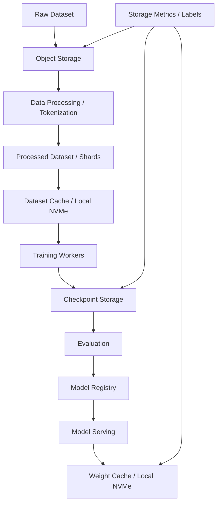
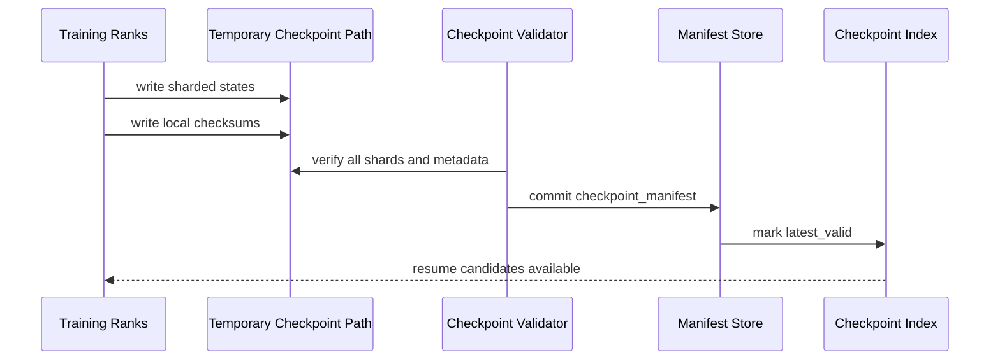

# 第 33 章：AI 存储系统

## 本章回答的问题

- AI Factory 中的数据集、checkpoint、模型权重和日志分别需要什么存储能力？
- Object Storage、Parallel File System、Local NVMe 和 cache 如何组合？
- 为什么存储问题经常表现为 GPU 利用率下降、训练变慢或推理冷启动慢？

## 一个真实场景

一个训练任务在前几个小时运行正常，开始保存 checkpoint 后 step time 周期性升高。GPU 监控显示每次 checkpoint 附近都有明显空转，训练日志显示写 checkpoint 耗时变长。存储团队看到总带宽没有打满，认为存储不是瓶颈。进一步分析后发现，多个训练任务在同一时间写入同一个目录层级，大量小文件和元数据操作集中到少数元数据服务，导致周期性等待。

另一个问题发生在推理集群。模型服务扩容时，新 replica 需要拉取大模型权重。GPU 已经分配，Pod 也启动了，但服务迟迟不能进入 ready。对象存储总带宽充足，单个 replica 拉取也正常，问题出现在高峰扩容时所有 replica 同时拉取同一批权重，远端存储、网络和节点本地磁盘一起出现尖峰。用户看到的是扩容慢和 TTFT 上升。

这些场景说明，AI 存储不是“容量够、带宽高”就结束。存储系统同时影响数据读取、训练恢复、模型发布、推理冷启动、成本和可靠性。不同数据类型访问模式差异极大：数据集可能是顺序读或小文件随机读，checkpoint 是周期性突发写，模型权重是发布和扩容时的高吞吐读，日志和 trace 是持续小写。

AI Factory 的存储设计必须分层。对象存储适合源数据和归档，并行文件系统适合热训练路径，本地 NVMe 适合缓存和 scratch，cache 适合权重和数据预热，model registry 管理模型发布语义。把所有数据都放到一个系统里，通常会在性能、成本或运维上付出代价。

排障时也要从 workload 结果反推存储路径。训练慢不是先问“存储带宽多少”，而是看 GPU 是否等待 data loader、checkpoint 是否拉长 step、恢复是否失败、模型服务是否卡在权重加载、缓存命中率是否下降。只有把 job、dataset、model、path、tenant 和时间线连起来，才能判断瓶颈在对象存储、并行文件系统、本地盘、网络、元数据服务还是应用数据格式。

## 核心概念

AI 存储系统位于网络与存储层，向上支撑数据处理、预训练、微调、评测、模型注册、模型服务、RAG、日志和计费。它承载的数据类型包括 raw dataset、processed dataset、tokenized shard、embedding、checkpoint、model artifact、tokenizer、prompt log、trace、metrics 和 billing record。不同数据生命周期和访问模式完全不同。

访问模式是存储设计的核心。数据集读取可能是大吞吐顺序读，也可能是大量小文件随机读；checkpoint 写入通常是周期性突发和多 rank 并发；模型权重加载要求启动时高吞吐和低冷启动；日志和 trace 更像持续流式写入；RAG embedding 和向量库还有低延迟查询和更新需求。不能用单一 benchmark 代表所有场景。

存储分层包括 object storage、parallel file system、local NVMe、cache 和 registry。Object storage 提供容量、成本和生命周期管理；parallel file system 提供高吞吐和 POSIX 接口；local NVMe 提供靠近计算的高速临时空间；cache 减少重复远端读取；model registry 管理模型版本、元数据和发布状态。分层的目标是把数据放到适合的位置。

AI 存储还必须有数据治理。数据集版本、权限、加密、保留策略、清理策略、成本标签、租户边界和审计，都影响生产使用。没有数据版本，实验不可复现；没有生命周期，checkpoint 和日志会无限增长；没有标签，成本无法归因。存储系统既是性能系统，也是治理系统。

因此，AI 存储的核心不是某一个产品，而是一套数据路径契约。数据从哪里来，经过哪些处理，热路径在哪里，哪个系统是 source of truth，哪些内容可以丢弃，哪些内容必须长期保留，谁有权限读取，成本归到哪个租户，都要在平台层表达清楚。契约缺失时，用户会把路径、清理和缓存逻辑写进脚本，最终形成不可审计、不可复现、不可迁移的隐性系统。

## 系统架构

AI 存储架构通常从数据生命周期出发。Raw data 进入 object storage，经过清洗、去重、tokenization 和 sharding，生成 processed dataset；热数据被同步或缓存到 parallel file system 或 local NVMe；训练 worker 读取数据并周期性写 checkpoint；checkpoint 进入评测和转换流程；通过的模型 artifact 进入 model registry；推理集群根据模型版本拉取权重并缓存。

架构中至少有四条关键路径。第一是数据读取路径，决定 GPU 是否等待 data loader。第二是 checkpoint 写入和恢复路径，决定训练容错和抢占成本。第三是模型发布和权重加载路径，决定推理冷启动和扩容速度。第四是观测和审计路径，决定问题能否归因、成本能否分摊、数据能否被治理。

存储系统与网络紧密耦合。对象存储、并行文件系统、缓存和本地盘之间的数据流会占用 scale-out 网络。checkpoint、权重加载和数据预热如果与训练通信重叠，会造成网络和存储双重压力。存储架构不能脱离网络拓扑和调度策略设计。

观测层应按 job、tenant、model、dataset、checkpoint 和 path 打标签。只看存储集群总吞吐没有意义，因为瓶颈可能在单目录元数据、单客户端限速、某个租户突发、某个 rack 缓存未命中或某个模型权重加载。AI 存储必须支持从 GPU idle 反查到具体数据路径。

控制面负责把这些路径产品化。训练平台应生成标准目录、注入数据集版本、创建 checkpoint manifest、设置 cache 策略，并把 storage policy 写入作业元数据；模型平台应把模型 artifact、tokenizer、配置和安全状态作为一个版本发布。数据面则负责实际读写和缓存。控制面和数据面分离后，用户仍然使用熟悉的路径或 API，但平台可以统一做审计、清理、迁移和回放。



AI 存储架构还需要一条证据链，把“GPU 在等”映射到具体数据路径。训练任务慢时，平台应能从 job id 找到 dataset manifest、shard、client node、cache state、storage backend、metadata service、network path 和 checkpoint 事件；推理冷启动慢时，平台应能从 endpoint 找到 model artifact、digest、registry、weight cache、节点本地 NVMe 和 replica readiness。没有这条链，存储团队看到的是系统吞吐，模型团队看到的是 GPU idle，平台团队只能猜测中间发生了什么。

```mermaid
flowchart LR
  Workload["job / endpoint / evaluation"] --> Path["dataset / checkpoint / artifact path"]
  Path --> Manifest["manifest / digest / version"]
  Manifest --> Client["client node / pod / rank / replica"]
  Client --> Cache["local NVMe / rack cache / remote cache"]
  Cache --> Backend["PFS / Object Storage / Registry"]
  Backend --> Telemetry["latency / metadata ops / throttle / errors"]
  Telemetry --> Impact["GPU idle / TTFT / recovery time / cost"]
  Impact --> Action["prewarm / reshard / isolate / throttle / repair"]
```



这条链路的关键是 manifest。路径只是位置，manifest 才是契约：它说明哪些 shard、哪些对象、哪些 checkpoint 分片、哪个模型权重 digest、哪个 tokenizer、哪些 checksum 和生命周期策略构成一次可复现的数据访问。路径可以迁移，manifest 不应丢失。AI Factory 应尽量让训练、评测和服务都引用 manifest，而不是让脚本自由扫描目录。

## 33.1 dataset storage

Dataset storage 保存训练、微调、评测和 RAG 所需的数据。它要解决容量、版本、权限、吞吐、数据格式、sharding、生命周期和成本问题。训练数据从 raw data 到 processed dataset，通常经历清洗、去重、过滤、tokenization、切分和格式转换。每个阶段都应有版本和元数据。

数据集版本是可复现性的基础。模型质量变化不一定来自代码或参数，也可能来自数据清洗规则、去重策略、tokenizer、采样比例或 shard 顺序变化。平台应记录数据集版本、生成脚本、输入来源、token 数、过滤规则和权限。没有这些信息，训练实验无法被可靠复现。

读取路径要匹配训练框架。大量小文件会造成元数据压力；过大的 shard 会降低随机性和并行度；压缩格式会影响 CPU 解码；远端对象存储可能受请求限流影响；本地缓存可能提高吞吐但需要预热和清理。数据工程和存储工程必须共同设计数据格式，而不是训练脚本临时拼路径。

工程上，应为数据集建立访问画像：文件数量、平均对象大小、总容量、读取并发、顺序读比例、缓存命中率、data loader wait time 和 GPU idle time。存储系统不是只管理数据，还要管理数据如何被训练任务消费。访问画像能指导 sharding、缓存和存储选型。

数据集还要有质量和权限边界。训练数据往往来自多个来源，可能包含不同许可证、敏感字段、重复样本和质量标签。存储层不负责判断模型效果，但必须保存元数据，让上游治理和下游实验能追踪来源。企业场景还要区分公共数据、租户私有数据和受限数据，避免缓存或共享文件系统打破权限边界。Dataset storage 不是“文件堆”，而是训练证据链的一部分。

生产级数据集应有 `dataset_manifest`。它把数据内容、处理版本、分片、统计、权限和缓存策略固定下来。示例：

```yaml
dataset_manifest:
  dataset_id: corpus-v3.2
  version: immutable
  tokenizer: tokenizer-v3
  source:
    raw_inputs: recorded
    cleaning_pipeline: clean-pipeline@sha256:example
    dedup_profile: dedup-v4
  shards:
    format: indexed_binary
    count: 8192
    average_shard_size: measured
    checksums: required
  statistics:
    total_tokens: measured
    language_mix: summarized
    filtered_ratio: measured
    sequence_length_distribution: summarized
  access:
    tenant_scope: foundation-model-team
    pii_classification: restricted
    cache_policy: prewarm_for_training_prod
  lineage:
    parent_dataset: corpus-v3.1
    generated_at: recorded
```

有了 manifest，训练平台才能做三件事：启动前验证数据是否完整，运行中从 step 反查 shard，事故后比较数据版本和缓存状态。没有 manifest，数据集只是目录名，任何复制、清理、覆盖和权限变化都可能破坏复现。

## 33.2 checkpoint storage

Checkpoint storage 保存训练中间状态，用于容错、恢复、评测和模型发布。Checkpoint 可能包含模型参数、优化器状态、训练 step、随机数状态、数据加载位置、并行切分信息和训练配置。大模型 checkpoint 规模巨大，写入和恢复都可能成为训练系统关键路径。

Checkpoint 的工程目标有三个：写得足够快，不显著拖慢训练；保存得足够可靠，故障后能恢复；元数据足够完整，后续能用于评测、转换和发布。只保存权重不一定能恢复训练，只保存最新 checkpoint 又可能无法回溯模型质量。平台应区分恢复 checkpoint、里程碑 checkpoint 和发布候选 artifact。

Checkpoint 间隔决定抢占和故障成本。间隔太短，会增加存储写入压力、网络流量和训练 step 抖动；间隔太长，节点故障或抢占后会浪费更多 GPU 小时。最佳间隔取决于训练规模、故障率、写入耗时、恢复耗时和任务优先级。Checkpoint 策略应与调度和 preemption 结合。

工程上，checkpoint 写入应避免所有 rank 同时冲击同一目录或元数据服务。可以使用分片、分层写入、异步上传、临时目录原子提交、压缩、保留策略和写入错峰。Checkpoint 成功应有 manifest 和校验，恢复前应验证完整性。没有完整性校验，恢复失败会在最糟糕的时间暴露。

Checkpoint 还承担组织协作语义。训练团队需要知道哪个 checkpoint 可恢复，评测团队需要知道哪个 checkpoint 可评估，服务团队需要知道哪个 artifact 可发布，平台团队需要知道哪些中间状态可以清理。把所有文件都叫 checkpoint 会造成混乱。更合理的做法是把恢复点、评测候选、发布候选和归档产物区分开，并用 manifest 描述来源 step、并行切分、依赖配置、校验和转换状态。

Checkpoint 写入还应采用两阶段提交语义。第一阶段写入临时分片和局部 metadata，第二阶段校验所有 rank 分片并提交 manifest。只有 manifest 提交成功，checkpoint 才能被标记为 valid。训练恢复逻辑必须读取 latest valid，而不是最新目录。



这个协议能避免最常见的隐性事故：目录存在但分片不完整，最新 checkpoint 覆盖了旧健康版本，恢复时才发现 optimizer 或 scheduler state 缺失。Checkpoint 的可用性必须由 manifest 和校验定义，而不是由文件夹是否存在定义。

## 33.3 object storage

Object Storage 适合存放大规模数据集、模型 artifact、日志归档、评测结果和跨集群共享数据。它的优势是容量大、成本相对可控、接口通用、生命周期管理成熟、跨地域和多租户能力较强。AI Factory 通常把对象存储作为源数据、长期归档和模型制品分发的基础。

对象存储的问题是语义和本地文件系统不同。训练框架如果假设 POSIX 文件系统，直接读对象存储可能效率不稳定。对象存储更适合大对象和并发访问，不适合大量细粒度 stat、rename 或小文件随机访问。通过 FUSE 模拟文件系统可以降低改造成本，但性能和一致性行为需要验证。

常见做法是通过数据加载器、缓存层、同步工具、预热流程或并行文件系统适配对象存储。Object storage 作为 source of truth，热训练路径通过 cache、parallel file system 或 local NVMe 加速。这样既保留容量和成本优势，又避免每个 training step 直接依赖远端对象存储。

工程上，对象存储需要关注请求量、错误率、限流、单对象吞吐、列表操作、跨地域复制、权限和生命周期。AI workload 可能在短时间发起大量 GET、PUT 或 LIST 请求。若没有 per-tenant 和 per-job 标签，热点和成本很难归因。对象存储治理必须进入平台观测。

对象存储还适合作为跨集群的数据边界。训练集群、评测集群、推理集群和离线分析系统可以通过对象存储交换 artifact，但交换的是版本化对象，而不是随意共享目录。这样做有利于权限审计和灾备，也让不同集群可以采用不同热路径。对象存储的弱点不应通过把所有 workload 都直接压到它上面解决，而应通过缓存、同步、预热和格式设计把它放在正确位置。

## 33.4 parallel file system

Parallel File System 用于提供高吞吐、并行访问和 POSIX 风格接口。AI 训练常用它承载热数据集、checkpoint、共享工作目录和中间产物。典型系统包括 Lustre、Weka、GPFS 类产品或其它并行文件系统。它们的共同目标，是让多节点训练以文件系统语义获得高吞吐。

并行文件系统的优势是对训练框架友好，吞吐高，支持多客户端并发，适合需要 POSIX 语义的 workload。挑战是成本、运维复杂度、元数据瓶颈、故障域、容量扩展和多租户隔离。文件系统性能不好时，GPU 会等待 data loader 或 checkpoint，而问题不一定显示为总带宽不足。

设计时要区分数据路径和元数据路径。大文件顺序读写、海量小文件 create/stat/delete、并发 checkpoint、随机读和目录扫描是完全不同的负载。许多训练慢不是带宽不够，而是元数据服务成为瓶颈。数据集和 checkpoint 格式应尽量减少无谓小文件和热点目录。

工程上，并行文件系统要有租户配额、目录规范、冷热分层、快照或备份、故障演练和监控标签。训练平台应提供推荐路径和模板，而不是让用户随意把 checkpoint 写到任意目录。路径规范是存储治理的一部分，也是成本归因的基础。

并行文件系统的运营风险在于“看起来像普通文件系统”。用户容易把临时文件、日志、checkpoint、数据集副本和模型产物都放在同一棵目录树，短期方便，长期会制造权限、成本和性能问题。平台应把热路径设计成受控入口：哪些目录适合读数据，哪些目录适合写 checkpoint，哪些目录会被自动清理，哪些目录需要申请配额。越接近训练关键路径，越需要明确规则。

## 33.5 local NVMe

Local NVMe 是节点本地高速存储，适合做数据缓存、模型权重缓存、临时文件、shuffle 空间、编译缓存和推理冷启动加速。它靠近计算，延迟低、吞吐高，可以显著减少远端存储和网络压力。对推理扩容和训练数据预热，local NVMe 经常非常有价值。

本地盘的问题是生命周期短、可靠性低、跨节点不可共享。节点故障、重装或回收时，本地数据可能丢失。因此，本地 NVMe 应默认视为 cache 或 scratch，而不是 durable storage。唯一 checkpoint、唯一数据集或唯一模型 artifact 不应只保存在本地盘上。

平台应明确 local NVMe 的语义。作为 cache，需要预热、淘汰、容量保护、版本隔离和命中率指标；作为 scratch，需要任务结束清理、租户隔离和磁盘水位控制；如果某些场景需要短期持久化，也要有备份或上游 source of truth。语义不清会造成数据丢失和磁盘污染。

工程上，本地盘管理要与调度结合。任务需要多少 cache 空间、模型权重是否已预热、节点磁盘是否足够、清理是否完成，都应影响调度和启动。推理服务冷启动慢，很多时候不是 GPU 不足，而是权重缓存未命中或镜像/模型拉取路径慢。

Local NVMe 还要防止“性能优化变成状态污染”。同一节点可能先运行训练任务，再运行推理任务；也可能在租户之间复用。如果本地缓存没有命名空间、权限和清理策略，既可能泄露数据，也可能让后续任务读到错误版本。生产系统应把本地盘视为受控资源：有容量配额、有水位保护、有任务边界、有启动前检查，也有节点回收时的清理验收。

对调度器来说，local NVMe 应像 GPU、CPU 和内存一样被建模。一个任务声明需要 2 TB scratch，另一个推理服务声明需要某模型权重已缓存，这些需求都应影响节点选择。若平台不理解本地盘，用户会在启动脚本中临时下载和清理，导致启动时间不可预测。把本地盘产品化后，平台才能做预热、复用、限额和故障隔离。

## 33.6 cache

Cache 用于把远端对象存储或并行文件系统中的热数据放到更靠近计算的位置。它可以是节点本地缓存、rack 级缓存、集群级 dataset cache、模型权重缓存、embedding cache 或 tokenizer cache。Cache 的价值是减少重复读取、降低冷启动、保护远端存储并提升 GPU 有效利用率。

推理服务尤其依赖 cache。模型服务启动时拉取大模型权重，如果每个 replica 都从远端存储读取，会造成启动慢和存储尖峰。权重缓存、镜像预热和模型分发策略可以显著改善扩容和故障恢复体验。对训练来说，dataset cache 可以减少反复读取同一批 shard。

Cache 的难点是一致性和容量。模型权重、tokenizer、数据 shard 和 embedding 都有版本。缓存必须按内容哈希、digest 或明确版本管理，避免服务读到旧文件。容量不足时要有淘汰策略，且淘汰不能破坏正在运行的 workload。缓存命中率低时，系统会退回远端存储瓶颈。

工程上，cache 应有观测和控制面。平台需要知道哪些模型或数据已预热，缓存占用多少，命中率如何，淘汰了什么，冷启动耗时多少。用户不应在脚本里手工实现缓存逻辑。缓存如果不可见，就会在故障时变成隐藏状态。

缓存策略还必须服务发布流程。模型权重缓存应以 model version、artifact digest 和 tokenizer version 为键，不能只按文件名或路径判断；数据缓存应绑定 dataset version 和 shard digest，不能被后续数据处理覆盖。预热也要有优先级：关键线上模型优先，高频数据集优先，低优临时实验可以接受 cache miss。缓存不是越多越好，而是要把有限的本地和近端容量给最能减少 GPU 等待和用户延迟的路径。

缓存控制面应记录 `cache_residency`，也就是哪些节点、rack 或资源池已经具备某个数据或模型版本。调度器可以优先把任务放到已有缓存的位置，或者在任务启动前触发预热。示例：

```yaml
cache_residency:
  object:
    type: model_artifact
    id: af-chat-large@sha256:example
  scope:
    resource_pool: inference-prod-h100
    nodes_ready: 128
    racks_ready: [rack-11, rack-12]
  policy:
    priority: production
    eviction: protect_while_endpoint_active
    refresh_on_release: true
  metrics:
    hit_ratio: measured
    cold_load_p95: measured
    prewarm_duration: measured
```

缓存一旦进入调度，就不再是临时优化，而是资源状态。它能解释为什么某些 replica ready 更快，也能解释为什么某个训练任务在 cache miss 后拖慢。

## 33.7 bandwidth vs IOPS

Bandwidth 衡量吞吐，IOPS 衡量每秒 I/O 操作次数。AI workload 同时需要二者，但场景不同。大 shard 顺序读关注 bandwidth；大量小文件和元数据操作关注 IOPS 与 metadata ops；checkpoint 写入关注突发吞吐和并发写；模型权重加载关注启动窗口内的高吞吐读。

只看总带宽容易误判。存储总带宽未打满时，训练仍可能被单目录元数据、单客户端限速、小文件随机读、对象存储 API 限流或 cache miss 拖慢。反过来，高 IOPS 系统也不一定能承载大 checkpoint 顺序写。性能指标必须匹配访问模式。

验收时应设计多类 benchmark：大文件顺序读写、小文件随机读、元数据操作、并发 checkpoint、模型权重加载、对象存储请求、cache miss 和真实 data loader。单一 `dd` 测试不能代表 AI 存储能力。测试还应覆盖多节点并发，而不是单客户端峰值。

工程上，要把存储指标和 GPU 指标关联。Data loader wait time、GPU idle、checkpoint pause、model loading time、cache hit ratio 和存储端指标一起看，才能判断瓶颈。存储系统的目标不是跑出漂亮 benchmark，而是减少 GPU 等待和服务冷启动。

容量指标也不能替代性能指标。一个系统容量还有很多，但元数据服务可能已经接近瓶颈；一个节点本地盘剩余空间足够，但单个 cache 目录可能达到水位；对象存储总体请求量正常，但某个租户的 LIST 请求可能被限流。AI 存储验收要把 bandwidth、IOPS、metadata ops、tail latency、错误率和 workload 时间线放在一起。只有这样，团队才不会在“带宽没满”和“GPU 在等”之间来回争论。

另一个常见误区是只测平均值。AI workload 对长尾很敏感：少数 shard 读取慢会拖住 data loader，少数 rank checkpoint 写入慢会拖住全局 step，少数 replica 权重加载慢会影响扩容窗口。验收和监控都要看 P95/P99、抖动和并发下的稳定性。带宽和 IOPS 是必要指标，但不是最终目标；最终目标是让训练 step 和推理 ready 时间稳定。

## 33.8 Weka、Lustre、Ceph、S3

Weka、Lustre、Ceph、S3 代表不同存储形态和接口。Lustre 常见于 HPC 和高性能并行文件系统场景；Weka 属于面向高性能文件与对象场景的商业系统；Ceph 提供对象、块和文件能力；S3 更常被用作对象存储接口或服务形态。它们不是同一层面的完全替代品。

本书不把某个产品绝对化。选型应看 workload、团队能力、成本、生态、可运维性和已有基础设施。训练热路径、长期归档、模型发布、日志分析、RAG 数据和推理缓存可能需要不同系统组合。一个系统适合源数据，不代表适合 checkpoint 热路径。

评估存储产品时，应从访问模式和运营能力出发。团队是否能运维并行文件系统，是否已有对象存储生态，是否需要 POSIX，是否需要跨地域，是否能支持多租户配额和标签，是否能提供可观测指标，是否能承受 checkpoint 突发。这些比产品名更重要。

合理的 AI 存储架构通常是分层的：对象存储做源和归档，并行文件系统做热训练路径，本地 NVMe 做缓存和 scratch，模型 registry 管理发布语义。产品选型应服务分层，而不是让一个系统承担所有职责。

评估这些系统时，还应避免把产品能力等同于落地能力。一个产品支持高吞吐，不代表本组织能以正确目录结构、网络拓扑、客户端版本和运维流程跑出稳定结果；一个系统支持对象和文件接口，也不代表它适合所有访问模式。更可靠的评估方法是用本书前面提到的 workload 场景验收：数据加载、checkpoint、模型发布、cache miss、多租户突发和故障恢复。产品名只是起点，证据才是选型依据。

## 工程实现

工程实现应先定义存储策略，而不是让用户在脚本里临时拼路径。训练平台提交任务时，应声明数据集版本、checkpoint 路径、缓存策略、清理策略、权限和成本标签。示例：

```yaml
storage_policy:
  dataset:
    source: object-storage
    hot_path: parallel-file-system
    cache: local-nvme
  checkpoint:
    write_path: parallel-file-system
    retention:
      latest: keep
      milestone: keep
      intermediate: expire
  model_artifact:
    registry: model-registry
    serving_cache: local-nvme
  observability:
    metrics: enabled
    per_job_labels: ["tenant", "job", "model", "dataset"]
```

第二步是把存储策略接入调度和运行时。任务需要多大本地缓存、是否需要预热数据、checkpoint 写入路径是否可用、模型权重是否已在目标节点缓存，都应影响调度和启动。存储不是任务启动后的脚本细节，而是资源需求的一部分。

第三步是建立生命周期规则。Raw data、processed dataset、checkpoint、artifact、cache、log 和 trace 的保留时间、权限、归档、清理和成本归属不同。没有生命周期规则，checkpoint 和缓存会无限增长，最终把存储成本和节点磁盘问题推给运维。

第四步是建立真实验收。存储验收应覆盖 data loader、checkpoint、模型加载、cache miss、对象存储限流、小文件和多节点并发。验收结果要与资源池、训练平台和模型服务关联。只测单客户端吞吐，不能证明 AI 存储可用。

第五步是建立 `data_path_evidence`。它把 workload 的每次关键 I/O 与路径、manifest、cache、client 和指标绑定。示例：

```yaml
data_path_evidence:
  workload:
    type: distributed_training
    id: train-20260619-042
    phase: checkpoint_write
  path:
    kind: checkpoint
    manifest_id: ckpt-step-120000
    backend: parallel_file_system
    directory: managed_path
  clients:
    ranks: 512
    nodes: attached
    racks: attached
  cache:
    local_nvme: not_applicable
    pfs_client_cache: recorded
  telemetry:
    write_p99: measured
    metadata_ops: measured
    throttling: measured
    network_overlap: nccl_collective_window
  impact:
    step_time_delta: measured
    gpu_idle_seconds: measured
    wasted_gpu_hours: calculated
```

这个对象让存储问题能进入统一诊断包。它回答的不是“存储系统慢不慢”，而是“哪个 workload 因为哪条数据路径慢，浪费了多少 GPU 时间，应该由谁处理”。

第六步是把清理和成本做成自动化。平台应定期识别过期 checkpoint、孤儿缓存、无引用 artifact、超配额目录和异常增长租户，并在保留策略允许的范围内执行清理或发出审批。成本标签应从任务提交开始继承到存储路径，而不是月底人工追账。AI 存储的可持续性来自生命周期闭环：创建时有元数据，使用时有观测，结束后有清理，归档时有审计。

实现时还要保留逃生通道。大型训练和紧急发布可能需要临时延长保留、固定缓存或提高配额，但这些例外必须有过期时间、审批记录和成本归属。没有例外机制，平台会被绕过；没有过期机制，例外会变成永久债务。好的存储平台不是禁止用户做特殊操作，而是让特殊操作可见、可审计、可回收。

## 常见故障

第一类故障是小文件过多。数据集包含大量小文件，元数据操作成为瓶颈，GPU 等待 data loader。解决方向是重新 sharding、使用适合训练的格式、缓存热数据并监控 metadata ops。不要只增加存储带宽。

第二类故障是 checkpoint 同步写入造成周期性 step time 尖刺。多个 rank 或多个 job 同时写入，冲击网络、元数据和存储服务端。解决方向是分片写入、错峰、异步上传、原子 manifest、保留策略和 checkpoint 间隔优化。

第三类故障是缓存版本错误。权重缓存没有按 digest 或版本隔离，推理服务加载旧模型；dataset cache 没有绑定数据版本，训练读到过期 shard。解决方向是内容寻址、版本化路径和发布系统接管缓存管理。

第四类故障是本地 NVMe 没有清理。节点磁盘满导致新任务失败，或者上一个租户的临时数据残留。解决方向是任务结束清理、水位告警、租户隔离和节点回收验证。本地盘不是无人管理的临时空间。

第五类故障是存储监控没有 tenant/job/model 标签。存储团队看到总吞吐和错误率，平台无法追踪哪个任务制造热点或成本。解决方向是标签治理和统一路径规范。没有标签，成本和热点都无法归因。

第六类故障是对象存储或远端文件系统被误用为低延迟本地路径。训练脚本在每个 step 中执行细粒度 LIST、stat 或小对象读取，单机测试看不出问题，多节点并发后请求被限流。解决方向是改造数据格式、引入 manifest、预热到热路径，并限制训练循环中的远端元数据操作。存储故障往往不是产品失效，而是访问模式和系统语义不匹配。

## 性能指标

数据读取指标包括读取吞吐、data loader wait time、GPU idle time、样本读取延迟、shard 分布、cache hit ratio、对象存储请求延迟和错误率。训练慢时，这些指标能判断 GPU 是否在等数据。单看存储端总吞吐不够。

Checkpoint 指标包括写入耗时、恢复耗时、成功率、失败原因、checkpoint 大小、间隔、manifest 完整性、保留数量和对 step time 的影响。Checkpoint 既是可靠性机制，也是性能负载。指标应帮助平台在恢复成本和写入成本之间调节。

模型发布和推理指标包括模型权重加载时间、cache hit ratio、冷启动时长、镜像与权重拉取耗时、registry 请求延迟和服务 ready 时间。推理扩容慢时，常常需要从这些指标判断是 GPU、镜像、权重、网络还是缓存问题。

运营指标包括存储容量、增长速度、生命周期清理量、租户成本、热点目录、元数据 QPS、对象请求量、限流次数、节点本地盘水位和缓存淘汰次数。AI 存储长期成本很高，运营指标决定系统是否可持续。

还应建立验收指标和告警指标的区别。验收指标用于判断新存储池、新数据格式或新发布路径能否入生产；告警指标用于判断正在运行的系统是否退化。前者需要可重复 benchmark 和 workload 回放，后者需要实时标签和基线对比。把两者混在一起，会导致上线时缺证据，故障时缺上下文。AI Factory 应保存历史基线，持续比较不同版本、不同 rack、不同租户和不同数据集的存储表现。

指标应能支持三类人。训练工程师要看到 data loader、checkpoint 和恢复是否拖慢训练；平台 SRE 要看到容量、水位、错误率、热点和清理是否健康；财务或业务负责人要看到租户、模型和项目的存储成本。三类视角共享同一套标签，但展示粒度不同。没有统一标签，技术排障和成本治理会形成两套彼此不一致的账。

## 设计取舍

第一个取舍是对象存储与热路径文件系统。对象存储容量和成本友好，但不总适合每个 training step 的直接读取；并行文件系统性能强、POSIX 友好，但成本和运维复杂度高。常见设计是对象存储做源，热数据进入文件系统或缓存。

第二个取舍是 checkpoint 频率。频率高，故障恢复损失小，但存储和网络压力大；频率低，训练效率高一些，但故障或抢占浪费更多 GPU 小时。Checkpoint 策略应结合故障率、任务优先级、写入耗时和恢复目标，而不是固定全局值。

第三个取舍是本地缓存与一致性。本地 NVMe 和 cache 能显著提升性能，但增加版本、淘汰和清理复杂度。模型权重和数据 shard 必须按版本管理，否则缓存会成为隐性状态。性能优化不能牺牲可复现和发布安全。

第四个取舍是统一存储与分层存储。统一系统简单，但可能在成本、性能或治理上折中；分层系统更高效，但需要数据流、权限、观测和生命周期管理。AI Factory 应把分层作为默认思路，再通过平台抽象降低用户复杂度。

最后一个取舍是用户自由度与平台约束。完全开放路径让高级用户灵活，但长期会产生不可治理的数据孤岛；完全封闭平台可以统一管理，但可能阻碍实验迭代。更好的方式是提供少数清晰抽象：数据集注册、checkpoint 策略、模型 artifact 发布、缓存策略和临时 scratch。用户表达意图，平台决定路径、清理和观测。这样既保留工程效率，也避免把存储系统变成脚本约定的集合。

存储设计还要在性能、可靠性和成本之间持续调节。所有数据都放在最高性能路径上，成本无法持续；所有数据都压到低成本对象存储，GPU 会等待；所有 checkpoint 永久保留，可靠性看似提高，治理却会崩溃。AI Factory 的存储策略应随数据生命周期变化：热时靠近计算，冷时回到低成本系统，进入发布链路时提高完整性和审计要求。

## 小结

- AI 存储影响数据读取、checkpoint、模型发布、推理冷启动和成本治理。
- 数据集、checkpoint、模型 artifact、日志和 cache 有不同访问模式，不能用单一存储策略覆盖。
- Object Storage、Parallel File System、Local NVMe 和 cache 应按生命周期分层组合。
- 存储验收要覆盖真实 data loader、checkpoint、模型加载、cache miss 和多节点并发。
- 存储指标必须绑定 tenant、job、model、dataset 和 path，才能支持排障和成本归因。

## 延伸阅读

- [Amazon S3 documentation](https://docs.aws.amazon.com/s3/)
- [Lustre Manual](https://doc.lustre.org/lustre_manual.xhtml)；[WEKA documentation](https://docs.weka.io/)；[Ceph documentation](https://docs.ceph.com/)
- [PyTorch Distributed Checkpoint documentation](https://docs.pytorch.org/docs/stable/distributed.checkpoint.html)
- [NVIDIA GPUDirect Storage documentation](https://docs.nvidia.com/gpudirect-storage/)
