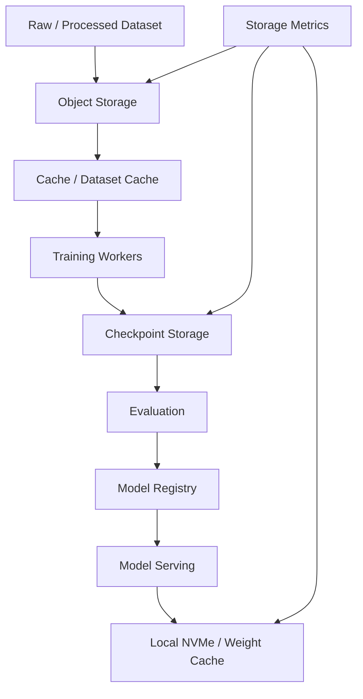

# 第 33 章：AI 存储系统

## 本章回答的问题

- AI Factory 中的数据集、checkpoint、模型权重和日志分别需要什么存储能力？
- Object Storage、Parallel File System、Local NVMe 和 cache 如何组合？
- 为什么存储问题经常表现为 GPU 利用率下降、训练变慢或推理冷启动慢？

## 一个真实场景

一个训练任务在前几个小时运行正常，开始保存 checkpoint 后 step time 周期性升高。GPU 监控显示每次 checkpoint 附近都有明显空转。存储团队看到总带宽没有打满，训练团队看到日志中写 checkpoint 很慢。进一步分析发现，多个任务在同一时间写入同一个目录层级，小文件元数据操作成为瓶颈。

AI 存储不是“容量够”就结束。它同时影响数据读取、训练恢复、模型发布、推理冷启动、成本和可靠性。

## 核心概念

AI 存储系统位于网络与存储层，向上支撑数据处理、训练、评测、模型注册和推理服务。它承载的数据类型包括 raw dataset、processed dataset、shard、embedding、checkpoint、model artifact、tokenizer、日志、trace 和计费数据。

不同数据类型的访问模式差异很大。数据集读取可能是大吞吐顺序读，也可能是大量小文件随机读；checkpoint 写入通常是周期性突发；模型权重加载要求启动时高吞吐；日志和 trace 更像持续流式写入。

## 系统架构



这个链路说明存储贯穿“训练任务如何变成模型”和“模型如何服务 token”的全过程。任何一段慢，都可能让 GPU 等待。

## 33.1 dataset storage

Dataset storage 保存训练、微调、评测和 RAG 所需的数据。它要解决容量、版本、权限、吞吐、数据格式和生命周期管理问题。

训练数据通常经过清洗、去重、tokenization、sharding 和格式转换。存储系统需要能区分原始数据、处理中间数据和可训练数据。没有版本治理时，很难复现实验结果，也无法解释模型质量变化。

数据集读取要匹配训练框架。大量小文件会造成元数据压力；过大的 shard 会降低随机性和并行度；压缩格式会影响 CPU 解码。存储设计应和数据 pipeline 一起优化。

## 33.2 checkpoint storage

Checkpoint storage 保存训练中间状态，用于容错、恢复、评测和模型发布。checkpoint 可能包含模型参数、优化器状态、训练 step、随机数状态和分布式并行切分信息。

Checkpoint 的工程目标是：写得足够快，不显著拖慢训练；保存得足够可靠，故障后能恢复；版本和元数据足够完整，后续能用于评测和发布。

Checkpoint 设计要和抢占策略结合。低优先级训练可被抢占时，checkpoint 间隔决定浪费的 GPU 小时。间隔太短会增加存储压力，间隔太长会增加恢复成本。

## 33.3 object storage

Object Storage 适合存放大规模数据集、模型 artifact、日志归档和跨集群共享数据。它的优势是容量大、成本相对可控、接口通用、生命周期管理成熟。

对象存储的问题是语义和本地文件系统不同。训练框架如果假设 POSIX 文件系统，直接读对象存储可能效率不稳定。常见做法是通过数据加载器、缓存层、FUSE、同步工具或预热流程适配。

对象存储适合作为源数据和长期存储，不一定适合作为每个训练 step 的直接热路径。热路径需要通过 cache、local NVMe 或并行文件系统优化。

## 33.4 parallel file system

Parallel File System 用于提供高吞吐、并行访问和 POSIX 风格接口。AI 训练常用它承载热数据集、checkpoint 和共享工作目录。典型系统包括 Lustre、Weka、GPFS 类产品或其他并行文件系统。

并行文件系统的优势是对训练框架友好，吞吐高，支持多客户端并发。挑战是成本、运维复杂度、元数据瓶颈、故障域和容量扩展。

设计时要区分数据路径和元数据路径。大文件顺序读写和海量小文件 create/stat/delete 是完全不同的负载。checkpoint 也应避免所有 rank 同时写同一目录造成元数据热点。

## 33.5 local NVMe

Local NVMe 是节点本地高速存储，适合做数据缓存、模型权重缓存、临时文件、shuffle 空间和推理冷启动加速。它的优势是低延迟、高吞吐、靠近计算。

本地盘的问题是生命周期短、可靠性低、跨节点不可共享。节点故障时，本地缓存可以丢，但不能把唯一 checkpoint 或重要数据只放在本地盘。

平台应明确 local NVMe 的语义：cache、scratch 还是 durable storage。对 cache，要有预热、淘汰和容量保护；对 scratch，要有任务结束清理；对误用 durable 的场景，要通过权限和文档避免。

## 33.6 cache

Cache 用于把远端对象存储或并行文件系统中的热数据放到更靠近计算的位置。它可以是节点本地缓存、集群级缓存、权重缓存、dataset cache 或 embedding cache。

Cache 的价值是减少重复读取和冷启动。推理服务启动时拉取大模型权重，如果每个 replica 都从远端存储读取，会造成启动慢和存储尖峰。权重缓存可以显著改善扩容和恢复体验。

Cache 的难点是一致性和容量。模型权重、tokenizer、数据 shard 都有版本。缓存必须按内容哈希或版本管理，避免服务读到旧文件。容量不足时要有淘汰策略和观测指标。

## 33.7 bandwidth vs IOPS

Bandwidth 衡量吞吐，IOPS 衡量每秒 I/O 操作次数。AI workload 同时需要二者，但场景不同。大 shard 顺序读关注 bandwidth；大量小文件和元数据操作关注 IOPS 和 metadata ops；checkpoint 写入关注突发吞吐和并发写能力。

只看总带宽容易误判。存储总带宽未打满时，训练仍可能被单目录元数据、单客户端限速、小文件随机读或对象存储 API 限流拖慢。

验收时应设计多类 benchmark：大文件顺序读写、小文件随机读、元数据操作、并发 checkpoint、模型权重加载和真实 data loader。单一 `dd` 测试不能代表 AI 存储能力。

## 33.8 Weka、Lustre、Ceph、S3

Weka、Lustre、Ceph、S3 代表不同存储形态和接口。Lustre 常见于 HPC 和高性能并行文件系统场景；Weka 属于面向高性能文件与对象场景的商业系统；Ceph 提供对象、块和文件能力；S3 更常被用作对象存储接口或服务形态。

本书不把某个产品绝对化。选型应看 workload、团队能力、成本、生态、可运维性和已有基础设施。训练热路径、长期归档、模型发布、日志分析可能需要不同系统组合。

合理的 AI 存储架构通常是分层的：对象存储做源和归档，并行文件系统做热训练路径，本地 NVMe 做缓存和 scratch，模型 registry 管理发布语义。

## 工程实现

存储分层策略示例：

```yaml
storage_policy:
  dataset:
    source: object-storage
    hot_path: parallel-file-system
    cache: local-nvme
  checkpoint:
    write_path: parallel-file-system
    retention:
      latest: keep
      milestone: keep
      intermediate: expire
  model_artifact:
    registry: model-registry
    serving_cache: local-nvme
  observability:
    metrics: enabled
    per_job_labels: ["tenant", "job", "model", "dataset"]
```

训练平台提交任务时，应声明数据集版本、checkpoint 路径、缓存策略和清理策略。不要让用户在脚本里临时拼路径，长期会造成权限、成本和可复现性问题。

## 常见故障

- 数据集包含大量小文件，GPU 等待 data loader。
- checkpoint 同步写入造成周期性 step time 尖刺。
- 权重缓存没有版本隔离，推理服务加载旧模型。
- 本地 NVMe 没有清理，节点磁盘满导致新任务失败。
- 存储监控没有 tenant/job 标签，无法追踪成本和热点。

## 性能指标

- 数据读取吞吐、data loader wait time、GPU idle time。
- Checkpoint 写入耗时、恢复耗时、成功率和间隔。
- 对象存储请求量、错误率、限流和延迟。
- 元数据操作速率、小文件访问延迟。
- Cache hit ratio、缓存容量、淘汰次数和冷启动时长。

## 设计取舍

对象存储容量和成本友好，但不总适合热训练路径。并行文件系统性能强，但成本和运维复杂度高。本地 NVMe 快，但不可作为唯一可靠存储。Cache 能提升性能，但增加一致性和容量管理问题。

AI 存储设计的核心是分层：把不同数据放到适合的位置，并通过版本、权限、观测和生命周期策略连接起来。

## 小结

- AI 存储影响数据读取、checkpoint、模型发布和推理冷启动。
- 数据集、checkpoint、模型 artifact 和日志有不同访问模式。
- Object Storage、Parallel File System、Local NVMe 和 cache 应分层组合。
- 存储验收要覆盖真实 data loader、checkpoint 和模型加载，而不是只测单项吞吐。

## 延伸阅读

- TODO: 对象存储官方文档
- TODO: Lustre / Weka / Ceph 官方资料
- TODO: AI checkpoint 与数据加载工程案例
