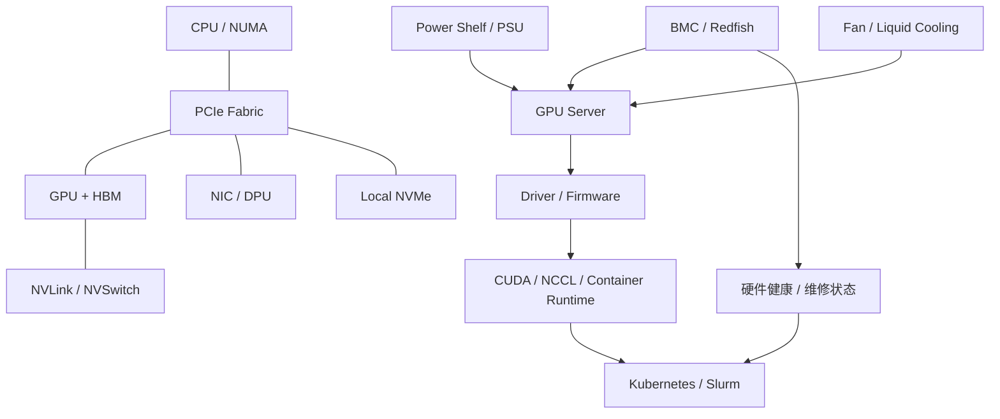

# 第 34 章：GPU 服务器

## 本章回答的问题

- 一台 GPU 服务器在 AI Factory 中到底提供哪些能力？
- CPU、GPU、HBM、PCIe、NVLink、NIC、DPU、BMC、电源和 compute tray 如何共同决定可用性与性能？
- 为什么平台不能只把服务器抽象成“几张 GPU”？

## 一个真实场景

一个 8 卡训练任务在某批节点上运行稳定，在另一批同型号 GPU 节点上经常出现数据加载慢和 NCCL 抖动。排查发现，问题节点的 GPU 与 NIC 跨 NUMA，PCIe 链路曾降速，BMC 中还记录过电源告警。业务侧看到的是“训练慢”，基础设施侧看到的是“服务器还能开机”，平台侧看到的是“GPU allocatable”。三者对同一台服务器的理解不一致。

GPU 服务器不是 GPU 的简单容器。它是 CPU、GPU、内存、互联、网络、存储、电力、散热和管理控制器组成的系统。AI Factory 要把这台系统作为可观测、可验收、可调度和可维修的生产单元。

## 核心概念

GPU 服务器位于物理基础设施层，是 GPU IaaS、资源编排、AI Runtime 和模型训练推理的底座。它向上提供 GPU 计算、HBM、节点内互联、RDMA 网络、本地 NVMe、管理控制和故障状态。

AI 平台通常不会直接操作电源模块或线缆，但调度、准入和故障诊断必须理解这些物理约束。一个训练任务是否适合某台机器，不只取决于 GPU 数量，还取决于 GPU 型号、显存、NVLink 域、NIC 位置、NUMA、驱动、固件和健康状态。

## 系统架构



这个图强调：服务器健康状态不只来自操作系统内的 exporter，也来自 BMC、固件、链路、功耗、温度和准入测试。

## 34.1 CPU

CPU 负责运行操作系统、容器、数据加载、网络协议栈、调度 agent、监控 agent 和部分训练前后处理逻辑。即使核心计算在 GPU 上，CPU 仍会影响数据准备、推理前处理、tokenization、网络中断和进程调度。

AI 服务器通常有 NUMA 结构。GPU、NIC、NVMe 与 CPU socket 的邻近关系会影响数据路径。GPU 与 NIC 跨 NUMA 时，RDMA 或 host-to-device copy 可能出现额外开销。调度系统如果只看 GPU 数量，无法避免这类问题。

工程上应采集 CPU 型号、NUMA 拓扑、核数、内存通道、PCIe root complex 和中断绑定状态。推理服务还要关注 CPU 对 tokenizer、HTTP streaming 和请求调度的影响。

## 34.2 GPU

GPU 是 AI Factory 的核心计算设备。它执行矩阵乘、attention、embedding、decode kernel、反向传播和优化器相关计算。不同 GPU 型号在显存容量、显存带宽、Tensor Core、互联、功耗和精度支持上差异明显。

平台应把 GPU 当成带能力标签的资源，而不是同质资源。标签至少应包含型号、显存、MIG 状态、健康状态、互联域、驱动基线和验收结果。租户提交任务时，也应表达是否需要特定型号、显存容量或拓扑。

GPU 健康不只看是否可见。Xid、ECC、温度、功耗、掉卡、NVLink error、频率异常和性能基线偏离都可能意味着节点不应继续承载生产任务。

## 34.3 HBM

HBM 是 High Bandwidth Memory，高带宽显存。大模型推理和训练大量受显存容量与带宽约束。模型权重、activation、KV Cache、optimizer state 和通信 buffer 都会占用 HBM。

容量决定能否放下模型和 batch，带宽决定部分 memory-bound kernel 的速度。长上下文推理尤其依赖 KV Cache 容量和访问效率。训练中，显存不足会限制 batch size、并行策略和 checkpoint 策略。

观测 HBM 要同时看使用量、碎片、带宽利用和 OOM。单纯“显存还有空闲”不代表可稳定接纳新请求，因为连续空间、KV Cache 增长和 batch 动态变化都会影响实际容量。

## 34.4 PCIe

PCIe 连接 CPU、GPU、NIC、DPU、NVMe 和其他设备。它是节点内数据路径的基础。GPU 服务器的 PCIe 拓扑会影响 GPU 到 NIC、GPU 到 CPU、GPU 到本地盘和部分 GPU 间通信。

常见问题包括 PCIe 降速、链路错误、设备枚举不稳定、跨 NUMA 访问和插槽配置不一致。节点在轻载下可能看不出问题，但在训练和 checkpoint 压力下暴露。

准入时应记录 PCIe link width、link speed、拓扑矩阵和错误计数。服务器维修、更换 GPU/NIC 或升级 firmware 后，需要重新跑 PCIe 与 nvbandwidth 相关基线。

## 34.5 NVLink

NVLink 提供 GPU 间高带宽互联。它决定 tensor parallel、pipeline parallel、MoE、KV Cache 分布和节点内 NCCL 通信的效率。NVLink 或 NVSwitch 域通常是调度系统需要理解的重要资源边界。

如果任务需要强 GPU 间通信，应尽量放在同一个高带宽互联域。反之，弱通信任务可以更灵活地使用碎片资源。把所有 GPU 都当作完全等价，会导致性能不可预测。

NVLink 故障可能先表现为带宽下降或通信抖动，而不是节点不可用。DCGM、NVIDIA 工具和 NCCL test 应共同用于监测和验收。

## 34.6 NIC

NIC 是节点连接 scale-out 网络和存储网络的接口。分布式训练、模型权重加载、对象存储访问、checkpoint 写入和推理流量都依赖 NIC。AI 节点常配置多块高速 NIC，用于多 rail、网络隔离或存储访问。

NIC 的位置和 GPU 拓扑相关。训练任务希望 GPU 与 NIC 路径短、NUMA 近、rail 均衡。推理任务则关注入口流量、连接稳定性、权重拉取和跨节点通信。

运维上要管理 NIC firmware、驱动、OFED/RDMA 栈、端口错误、光模块、线缆和交换机映射。NIC 异常常表现为某些 rank 慢、checkpoint 慢或推理冷启动慢。

## 34.7 DPU

DPU 是 Data Processing Unit，可用于网络、存储、安全和虚拟化卸载。它可能承载虚拟网络、RDMA、加密、隔离或存储协议处理。DPU 的引入让服务器数据面更复杂，也提供了更强的隔离与卸载能力。

在 AI Factory 中，DPU 常与多租户、裸金属云、虚拟化 GPU、网络隔离和高性能存储相关。它能降低 CPU 负担，但也引入新的固件、驱动、观测和故障边界。

平台使用 DPU 时，要明确哪些功能在主机 OS，哪些在 DPU，故障时由谁负责排查。否则一条网络路径会跨越用户容器、主机、DPU 和交换机，排障成本很高。

## 34.8 BMC

BMC 是 Baseboard Management Controller，独立于主机操作系统的管理控制器。它可以控制电源、读取硬件传感器、访问远程控制台、记录硬件事件，并通过 IPMI 或 Redfish 对接自动化系统。

BMC 是裸金属 GPU 云的维修入口。节点死机、OS 不可达、掉卡或无法开机时，平台仍可通过 BMC 重启、采集日志或隔离节点。

BMC 也带来安全风险。管理网、凭据、审计和权限必须严格隔离。生产系统不应把 BMC 账号散落在脚本和个人机器里。

## 34.9 power shelf

Power shelf 或电源模块为 GPU 服务器提供高密度供电。AI 服务器功耗高，电力链路从机房配电、机柜、母线、电源模块到服务器内部都有容量和冗余约束。

功耗问题可能表现为 GPU 降频、节点重启、训练中断或某个机柜故障。平台需要把功耗和电力故障域纳入容量规划。一个 rack 能放多少 GPU，不只取决于空间，还取决于电力与散热。

监控应覆盖输入电压、电流、功率、PSU 状态、冗余状态和告警。功耗峰值也应进入压测和验收。

## 34.10 compute tray

Compute tray 是一些高密度系统中的计算托盘，承载 CPU、GPU、内存和互联组件。它体现了 AI 服务器从“单机”向“系统级计算单元”演进的趋势。

对平台而言，compute tray 的关键不是名称，而是资源边界。一个 tray 是否可以独立维护、是否共享电源和冷却、是否属于同一 NVLink 域、故障是否影响其他 tray，都会影响调度和运维策略。

在高密度系统中，维护动作可能影响更大的 GPU island。运维流程需要支持 drain、隔离、验收和回池，而不是简单地把单台服务器下线。

## 工程实现

服务器资源画像示例：

```yaml
gpu_server:
  asset_id: gpu-srv-042
  rack: rack-12
  power_domain: pd-3
  cooling_domain: cd-2
  cpu_numa:
    - id: 0
      gpus: ["GPU0", "GPU1", "GPU2", "GPU3"]
      nics: ["mlx5_0"]
    - id: 1
      gpus: ["GPU4", "GPU5", "GPU6", "GPU7"]
      nics: ["mlx5_1"]
  gpu_fabric: nvswitch-domain-a
  health:
    bmc: reachable
    pci_health: pass
    nvlink_health: pass
    acceptance: pass
  state: allocatable
```

这份画像应由资产系统、准入系统、调度系统和监控系统共同使用。

## 常见故障

- 服务器能开机，但 PCIe 链路降速导致训练通信慢。
- GPU 与 NIC 跨 NUMA，RDMA 吞吐低。
- BMC 不可达，节点死机后无法自动恢复。
- NVLink 错误计数上升，但节点仍被调度。
- 电源或散热告警导致 GPU 降频，业务只看到吞吐下降。

## 性能指标

- GPU utilization、HBM 使用量、HBM bandwidth、GPU power、temperature。
- PCIe link speed/width、PCIe error、NVLink error。
- NIC 吞吐、RDMA error、端口错误计数。
- CPU 使用率、NUMA remote access、数据加载等待时间。
- BMC 可达率、PSU 状态、风扇或液冷状态。

## 设计取舍

高密度 GPU 服务器提升单位机柜算力，但对电力、散热、维护和故障域要求更高。更多 NIC 和更复杂互联提升性能，但也增加配置和排障复杂度。平台设计应在性能、成本、隔离和可运维性之间选择，而不是只追求单机峰值。

## 小结

- GPU 服务器是 CPU、GPU、HBM、互联、网络、电力、散热和管理控制组成的系统。
- 调度系统需要理解拓扑和健康状态，不能只看 GPU 数量。
- BMC、PCIe、NVLink、NIC 和 power/cooling 都会影响 AI workload。
- 服务器资源画像是准入、调度、观测和维修的共同语言。

## 延伸阅读

- TODO: NVIDIA GPU 服务器与 DCGM 官方资料
- TODO: Redfish / BMC 管理资料
- TODO: GPU 服务器拓扑验收案例
