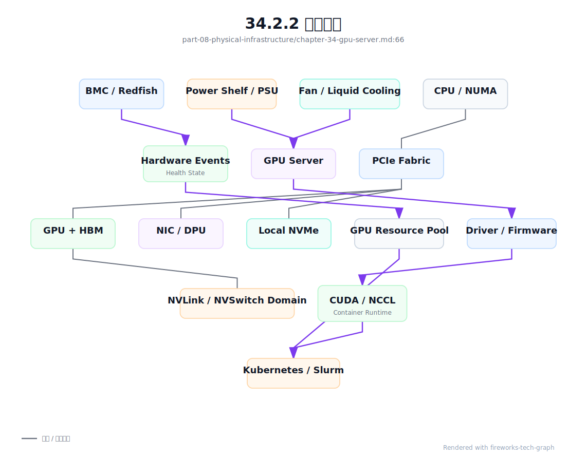
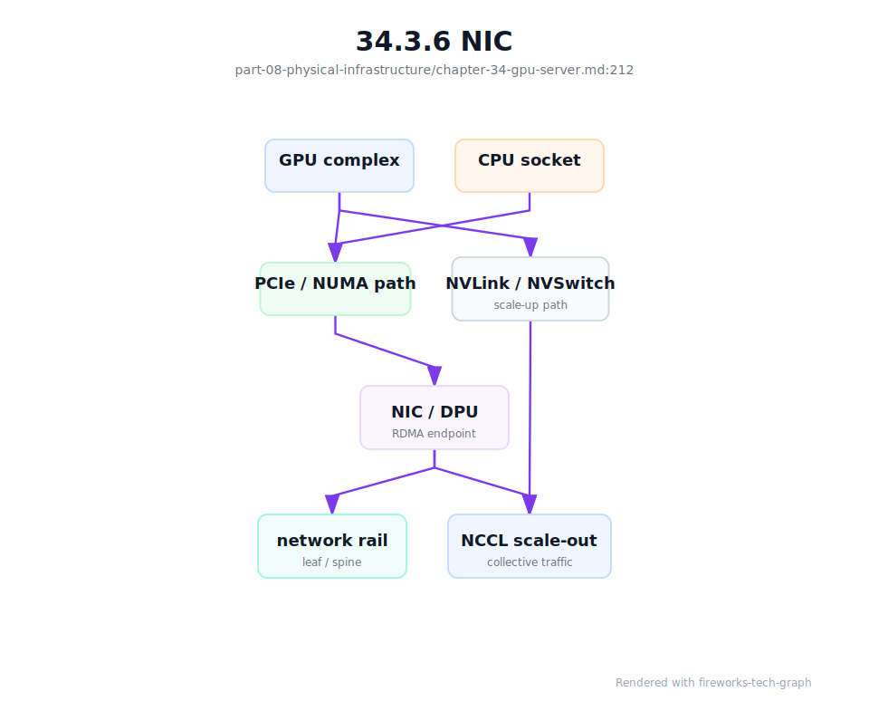
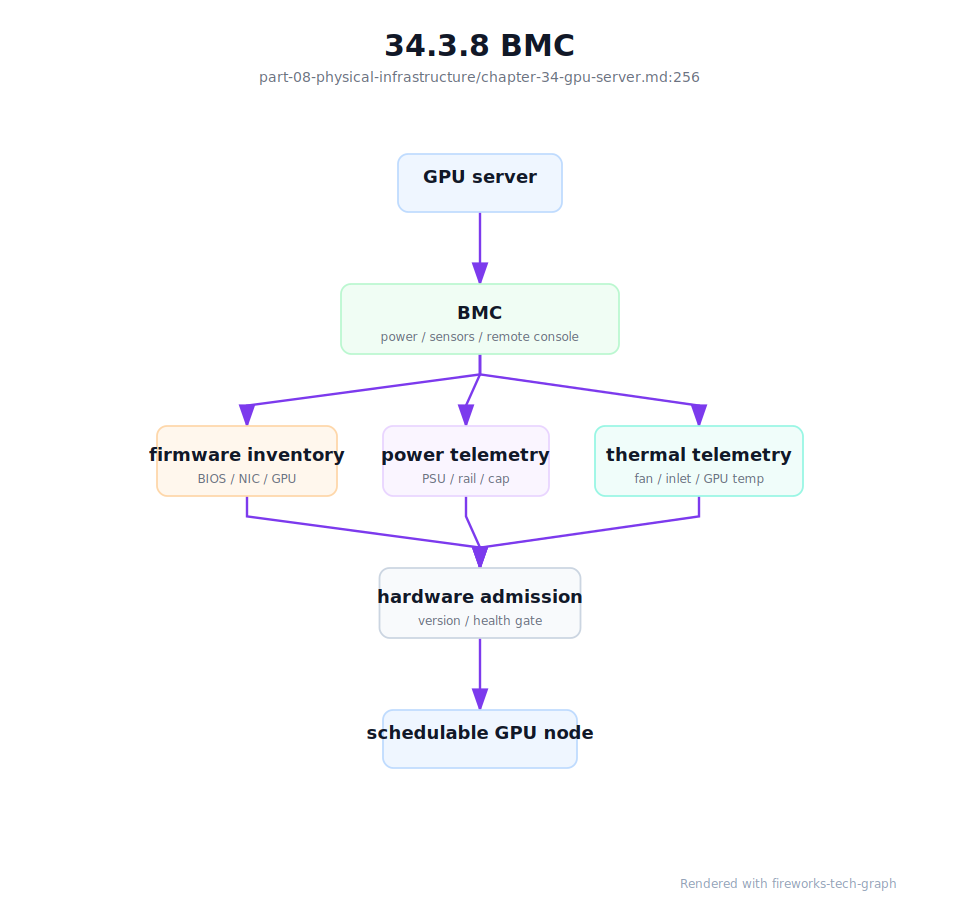

# 第 34 章：GPU 服务器

## 34.1 导读

### 34.1.1 本章回答的问题

- 一台 GPU 服务器在 AI Factory 中到底提供哪些能力？
- CPU、GPU、HBM、PCIe、NVLink、NIC、DPU、BMC、电源和 compute tray 如何共同决定可用性与性能？
- 为什么平台不能只把服务器抽象成“几张 GPU”？


### 34.1.2 本章上下文

- 层级定位：本章属于 `物理基础设施层`，重点讨论GPU 服务器、芯片系统架构、机房、电力、制冷和交付验收。
- 前置依赖：建议先理解 第 33 章：AI 存储系统 中的核心对象和路径。
- 后续关联：本章内容会继续连接到 第 35 章：GPU 芯片与系统架构，并在系统地图、深度标准和读者测试中被交叉引用。
- 读完能力：读完本章后，读者应能把《GPU 服务器》中的概念映射到 AI Factory 的生产路径、工程对象、观测证据和设计取舍。


### 34.1.3 读者测试

- 机制题：读者能否解释 CPU、GPU、HBM、PCIe 的核心机制，以及它们如何共同支撑《GPU 服务器》？
- 边界题：读者能否区分 物理基础设施、GPU IaaS、资源池和 Token Factory 能效 的责任边界，并说明哪些问题不能简单归因到本章组件？
- 路径题：读者能否从 GPU 服务器和机房约束追到 rack、电力、制冷、故障域和交付验收，并指出本章对象在路径中的位置？
- 排障题：当《GPU 服务器》相关生产症状出现时，读者能否列出第一层证据、下一跳证据、可能 owner 和止血动作？


### 34.1.4 一个真实场景

一个 8 卡训练任务在某批节点上运行稳定，在另一批同型号 GPU 节点上经常出现 data loader wait 和 NCCL 抖动。业务侧看到的是 step time 变长，平台侧看到的是 Pod 已经拿到 8 张 GPU，基础设施侧看到的是服务器仍能开机。三方都没有说错，但都只看到了局部事实。进一步排查后发现，问题节点的 GPU 与 NIC 跨 NUMA，某条 PCIe 链路曾经降速，BMC 事件里还有电源冗余告警。节点表面可用，实际已经不是等价资源。

另一个场景发生在推理集群。扩容时服务副本成功调度，但部分节点的 tokens/s 明显低于同组基线。GPU utilization 看起来不低，显存也没有 OOM。继续分析后发现，模型权重从本地 NVMe 读取时受到 PCIe 路径影响，入口流量所在 NIC 与 GPU 不在同一 CPU socket，CPU 中断绑定也不合理。推理团队最初以为是 runtime 参数问题，后来才确认是服务器内部数据路径不一致。

这些问题说明，GPU 服务器不是“装了 GPU 的普通服务器”。它是 CPU、GPU、HBM、PCIe、NVLink/NVSwitch、NIC/DPU、local NVMe、BMC、电源、散热和固件共同组成的生产单元。AI Factory 要把服务器理解为可验收、可观测、可调度、可维修的系统，而不是只登记 `nvidia.com/gpu: 8`。否则同型号节点会在生产中呈现不同性能，排障也会在模型、平台和硬件团队之间反复转移。

这个场景里的关键教训是：服务器问题常常不会以“服务器坏了”的形式出现，而是以训练慢、推理慢、冷启动慢或任务 pending 的形式出现。平台如果没有服务器级证据链，就只能在上层反复调参。真正的生产系统要能从一次 workload 异常反查到服务器内部拓扑、硬件事件和准入基线。


## 34.2 基础模型

### 34.2.1 核心概念

GPU 服务器位于物理基础设施层，向上支撑 GPU IaaS、资源编排、AI Runtime、模型训练、模型服务和平台计费。它提供的不只是 GPU 计算，还包括 HBM 容量、节点内互联、RDMA 接入、本地缓存、管理控制、功耗散热边界和硬件健康状态。服务器能力如果没有被抽象到资源池，上层调度就无法做出稳定决策。

从 AI Factory 视角看，服务器有三类属性。第一类是静态资产属性，包括机型、GPU 型号、显存、CPU、内存、NIC、DPU、NVMe、rack、power domain 和 cooling domain。第二类是拓扑属性，包括 NUMA、PCIe、NVLink/NVSwitch、GPU-to-NIC affinity、GPU-to-NVMe path 和 rail。第三类是动态健康属性，包括温度、功耗、Xid、ECC、PCIe error、NVLink error、NIC error、BMC event、降频和准入结果。

这些属性共同决定 workload 适配。强通信训练需要完整 GPU 域和高速 NIC；长上下文推理需要足够 HBM 和稳定本地权重缓存；批量推理可能更关注吞吐和功耗；数据处理任务会更依赖 CPU、内存和 NVMe。把所有 GPU 服务器视为同质资源，会让调度结果不可解释，也会让成本模型失真。

服务器治理的目标，是把物理差异转化为平台可用的资源画像。画像不是静态 CMDB 文档，而是资产、准入、监控、调度、维修和计费共享的事实源。只有这样，节点入池、隔离、维修、回池和容量规划才有共同语言。

因此，本章讨论 GPU 服务器时，不按硬件说明书罗列部件，而按“部件如何影响 AI workload”来组织。CPU 影响数据路径，GPU 和 HBM 影响计算与显存，PCIe 与 NVLink 影响节点内通信，NIC/DPU 影响 scale-out 和隔离，BMC 与电源散热影响可恢复性。每个组件最终都要落到调度、验收、观测和故障处理上。


### 34.2.2 系统架构

一台 GPU 服务器可以从四条路径理解。第一条是计算路径，模型算子通过 CUDA、driver 和 runtime 在 GPU 上执行，受 SM、Tensor Core、HBM 和 kernel 影响。第二条是节点内互联路径，GPU 通过 PCIe、NVLink 或 NVSwitch 与 CPU、NIC、NVMe 和其它 GPU 通信。第三条是管理路径，BMC、Redfish/IPMI、firmware、事件日志和远程控制台支撑裸金属交付与维修。第四条是物理路径，电源、风扇、液冷、温度和机柜环境决定服务器能否长期满载。

架构上，服务器状态必须从物理层上送到资源池。BMC 事件、PCIe 链路、NVLink 错误、GPU 健康、NIC 端口、PSU 冗余、温度和准入测试结果，应共同决定节点是否 allocatable。Kubernetes 或 Slurm 看到的节点状态，不能只来自操作系统里的 kubelet 或 slurmd。OS 可达但硬件 degraded 的节点，如果继续承载训练，会把物理问题转化为昂贵的 GPU 小时浪费。

服务器架构还要与拓扑调度结合。资源池需要表达哪些 GPU 属于同一 NVSwitch 域，哪些 GPU 靠近哪张 NIC，哪些本地 NVMe 适合做权重缓存，哪些节点位于同一 rack 或 power domain。运行时和调度器根据这些属性选择放置策略；监控系统则用同一套属性解释性能异常。架构的关键不是画出服务器内部组件，而是让组件关系能被上层系统消费。

这也是为什么服务器架构图必须连接到 Scheduler 和 Resource Pool。若图只停留在硬件连线层，上层系统无法使用；若资源池只记录 GPU 数量，硬件拓扑又被浪费。AI Factory 需要的是“可执行架构”：硬件事实能进入标签、准入、告警、隔离和容量模型。

可执行架构还要求每条关键路径都有验证方法。计算路径用 workload 和 profiler 验证，互联路径用 NCCL、RDMA 和拓扑基线验证，管理路径用 BMC 操作和事件采集验证，物理路径用功耗、温度和长稳测试验证。



服务器画像应形成 `gpu_server_profile`。它不是 CMDB 的重复字段，而是把服务器内部拓扑、硬件健康和资源能力交给调度、准入、SRE 和成本系统使用的契约：

```yaml
gpu_server_profile:
  server_id: gpu-srv-042
  placement:
    rack: rack-12
    power_domain: pdu-a-12
    cooling_domain: cdu-loop-2
    fault_domain: dc-a/rack-12
  compute:
    cpu_sockets: measured
    gpu_count: 8
    gpu_flavor: h100-class
    hbm_capacity_class: recorded
    nvlink_domain: nvswitch-domain-a
  topology:
    gpu_to_nic:
      GPU0: mlx5_0
      GPU4: mlx5_1
    gpu_to_nvme:
      GPU0: nvme0
      GPU4: nvme1
    numa_affinity: recorded
    pcie_baseline: recorded
  management:
    bmc: reachable
    redfish: enabled
    firmware_baseline: managed
  power_thermal:
    envelope_id: power-thermal-rack12-a
    sustained_full_load_validated: true
  scheduling:
    suitable_for:
      - distributed_training
      - long_context_inference
    deny_if:
      - power_limited
      - cooling_limited
      - pcie_degraded
```

这个 profile 的作用，是把“同型号服务器”拆成可解释资源。训练调度能看到 GPU-to-NIC 亲和，推理平台能看到 GPU-to-NVMe 权重缓存路径，SRE 能从 BMC 和 power domain 反查故障域，成本系统能把 tokens/W 归到服务器和 rack。没有服务器画像，上层系统只能假设所有节点等价，而生产事实通常不是这样。


## 34.3 关键技术

### 34.3.1 CPU

CPU 在 GPU 服务器中承担控制面和数据面两类职责。控制面上，它运行操作系统、container runtime、kubelet 或 slurmd、监控 agent、日志采集、驱动管理和安全组件。数据面上，它参与 tokenization、数据加载、HTTP/gRPC 请求处理、采样逻辑、存储客户端、网络协议栈和训练前后处理。核心计算虽然在 GPU 上，但 CPU 路径不稳会直接影响 GPU 是否能持续吃满。

NUMA 是 CPU 章节最重要的工程概念。多 socket 服务器中，GPU、NIC、NVMe 和内存挂在不同 CPU socket 或 PCIe root complex 下。GPU 与 NIC 跨 NUMA 时，RDMA 或 GPU Direct 路径可能变长；GPU 与本地盘跨 NUMA 时，权重加载和数据缓存可能变慢；CPU 中断绑定不当时，高速 NIC 的包处理可能集中压到错误的 core 上。训练和推理看到的是吞吐下降，根因却在 CPU 拓扑。

服务器 CPU 拓扑还包括 CPU-to-CPU 互联。Intel 多路服务器常见 UPI/QPI，AMD EPYC 平台常见 Infinity Fabric/xGMI 语境。它们决定跨 socket 访问内存、PCIe 设备和中断的代价。粗略带宽估算可以按传输速率、有效数据宽度、链路数和方向计算，例如 UPI 单向有效带宽常按 `GT/s × 16bit / 8` 估算，再乘以链路数；讨论聚合带宽时再乘以双向。这个公式用于理解数量级，不应用来替代厂商 datasheet 或实测，因为编码、协议开销、拓扑和 workload 都会影响结果。

内存子系统同样关键。CPU 内存带宽来自通道数、数据速率和总线宽度，粗略可以按 `MT/s × 8Byte × channel_count` 估算单 socket 峰值。GPU 服务器常使用 ECC RDIMM、LRDIMM 或更高容量内存形态，以换取容量和可靠性。数据加载、tokenizer、检索拼接、压缩解压、对象存储客户端和 NCCL control path 都可能消耗 CPU 内存带宽。若 CPU 内存配置不均衡，或者某个 NUMA 节点内存不足，GPU 可能在等待数据而不是等待算力。

CPU 资源也不是无限背景资源。在线推理需要 CPU 做请求解析、tokenizer、streaming、scheduler 和安全检查；RAG 服务还可能有 embedding 前处理和检索结果拼接；训练任务的数据加载、解压、shuffle 和增强也可能消耗大量 CPU。GPU 利用率低时，不应只看 GPU，还要看 CPU ready、load、上下文切换、内存带宽和 data loader wait。

工程上，CPU 画像应包含型号、socket、core、NUMA、内存通道、PCIe root、CPU-to-GPU、CPU-to-NIC、CPU-to-NVMe 和中断绑定。调度器至少要能避免明显错误的 GPU/NIC 组合；高性能池则应建立 CPU 与 GPU 拓扑基线。CPU 不是 GPU 服务器里的配角，而是把请求、数据和控制信号送到 GPU 的入口。

排查 CPU 相关问题时，应先把 GPU 等待拆开：是在等数据、等网络、等 kernel launch，还是等请求调度。常见证据包括 `lscpu`、`numactl --hardware`、`lstopo`、`nvidia-smi topo -m`、`lspci -vv`、data loader 时间、tokenizer 延迟、CPU steal/load、NUMA remote access、网卡中断分布和进程绑核。Linux 通常通过 ACPI SRAT/SLIT 等固件表识别 NUMA 拓扑，但生产系统最终应以本机发现和 workload 验证为准。没有这些证据，团队很容易把 CPU 路径问题误判为 GPU 算力不足。


### 34.3.2 GPU

GPU 是 AI Factory 中最昂贵、最稀缺、最直接决定产能的计算资源。它执行矩阵乘、attention、embedding、decode kernel、反向传播、optimizer 相关计算和部分多模态算子。不同 GPU 型号在 HBM 容量、HBM bandwidth、Tensor Core 能力、互联、功耗、精度支持和虚拟化能力上差异明显。平台如果只暴露“GPU 数量”，就会把差异巨大的资源伪装成同质资源。

GPU 资源画像至少应包含型号、显存容量、架构代际、MIG 或 vGPU 状态、NVLink/NVSwitch 域、PCIe 位置、驱动基线、固件、健康状态、准入结果和性能基线。对训练任务来说，GPU 之间是否在同一高速互联域，可能比单卡型号更重要；对推理任务来说，显存容量、低精度 kernel 支持和权重缓存路径可能更重要。标签必须服务 workload，而不是只复述硬件清单。

GPU 健康也不能只看设备是否可见。Xid、ECC error、retired page、温度、功耗、降频、掉卡、NVLink error、PCIe error 和性能基线偏离，都可能说明节点不适合继续承载生产任务。有些故障不会立即让任务失败，而是让 step time 变慢或 tokens/s 下降。高价值训练任务不应被调度到这类“可见但 degraded”的 GPU 上。

在多租户平台中，GPU 还是计费和 SLA 的核心边界。不同型号、不同隔离方式、不同拓扑完整度和不同健康等级应对应不同资源等级。调度系统、计量系统和运维系统必须共享 GPU 状态，否则用户为高性能资源付费，却可能拿到性能不稳定的节点。

GPU 状态还需要生命周期管理。新卡入池要有 burn-in 和性能基线；运行中要持续监测错误和离群；维修后要复测；达到风险阈值后要降级或隔离。不要等 GPU 完全不可见才处理，因为在 AI workload 中，性能退化本身就会消耗昂贵的 GPU 小时。


### 34.3.3 HBM

HBM 是 High Bandwidth Memory，高带宽显存。大模型训练和推理对 HBM 的依赖非常直接：模型权重、activation、KV Cache、optimizer state、gradient、通信 buffer、临时 workspace 和部分 runtime cache 都会占用 HBM。显存容量决定模型和 batch 是否放得下，显存带宽决定许多 memory-bound 阶段能否快速供给计算单元。

推理场景中，HBM 的重要性在 decode 阶段尤其突出。Prefill 更像高并行计算，decode 常常需要反复读取权重和 KV Cache，batch、context length 和并发会让 HBM 压力持续变化。长上下文服务看起来只是上下文窗口变大，实际上是在把更多 KV Cache 放进 HBM，并让调度器必须管理显存水位和碎片。OOM 只是最明显的失败，更常见的是吞吐和延迟随显存压力变差。

训练场景中，HBM 影响 batch size、并行策略、activation checkpointing、optimizer state sharding 和 checkpoint 策略。显存不足会迫使模型采用更复杂并行和重计算策略；显存带宽不足会让某些 kernel 不能充分利用 Tensor Core。HBM 与网络、存储也有关联：显存放不下的状态需要通过并行、offload 或更频繁的数据搬运解决。

观测 HBM 不能只看使用率。平台应关注峰值、碎片、reserved/allocated 差异、KV Cache 增长、OOM 原因、HBM bandwidth、page fault、MIG 分区和不同 workload 的显存画像。调度器应根据模型、context、batch 和并发预估 HBM，而不是等容器运行后再失败。

HBM 也是资源隔离的边界。多个推理实例共享 GPU 时，KV Cache 会随请求动态增长；MIG 或多进程共享时，显存水位和碎片会影响邻居。平台需要明确哪些场景允许 overcommit，哪些场景必须保守预留。显存策略不清楚，会直接表现为 OOM、延迟抖动或不可解释的吞吐下降。

因此，HBM 验收应包含典型模型和典型上下文，而不是只读取硬件容量。只有把容量、带宽、碎片和真实请求形态放在一起，显存才是可调度资源。


### 34.3.4 PCIe

在 GPU 服务器设计中，PCIe 更像硬件装配和故障域边界，而不只是带宽规格。它决定 GPU、NIC、DPU、NVMe、BMC 辅助设备和 CPU root complex 如何落在同一块主板或托盘上，也决定维修换件、BIOS 设置、IOMMU/ACS、设备枚举和调度画像是否还能保持一致。第 31 章从 scale-up 网络和数据路径解释 PCIe，本节重点看它如何影响服务器可交付性。

PCIe 带宽要按版本、lane 数和编码开销理解。常用工程近似是：PCIe 3.0 x16 单向约 15.75GB/s，PCIe 4.0 x16 单向约 31.5GB/s，PCIe 5.0 x16 单向约 63GB/s；若厂商按双向聚合口径展示，则约为 32GB/s、64GB/s、128GB/s。公式可以写成 `GT/s × 有效编码比例 ÷ 8 × lane_count`，其中 PCIe 3.0/4.0/5.0 常见传输速率分别为 8/16/32GT/s，3.0 及以后使用 128b/130b 编码。实际可用带宽还会受协议开销、事务大小、root complex、switch、IOMMU 和 workload 影响。

PCIe 常见问题包括链路降速、链路错误、设备枚举不稳定、AER error、跨 NUMA 访问、插槽配置不一致和维修后拓扑变化。许多问题在轻载或单机测试中不明显，但在分布式训练、checkpoint、权重加载或高并发推理时暴露。表现可能是 NCCL 抖动、RDMA 吞吐低、模型加载慢、本地盘吞吐不稳或同型号节点性能离群。

准入时应记录 PCIe 拓扑矩阵，而不是只确认设备存在。`nvidia-smi topo`、lspci、链路 speed/width、AER 计数、GPU-to-NIC、GPU-to-NVMe 和单节点带宽测试都应进入基线。服务器维修、更换 GPU/NIC、更新 firmware、调整 BIOS 或重新布线后，要用相同基线回归。否则节点会以“可用”状态回池，却在生产中变成性能异常点。

PCIe 信息也应进入调度解释。一个需要高 RDMA 吞吐的训练任务，应优先选择 GPU 与 NIC 邻近的组合；一个重度本地缓存推理服务，应关注 GPU 到 NVMe 的路径。PCIe 不是用户需要手工理解的细节，而是平台应自动利用的物理约束。

PCIe 还应进入维修流程。更换主板、网卡、GPU、线缆或 BIOS 设置后，设备枚举顺序和拓扑都可能变化。若资源池仍沿用旧标签，调度会基于错误事实做决策。维修回池前的自动拓扑发现，是避免性能漂移进入生产的基本要求。

PCIe 基线还应保留历史。节点维修前后、驱动升级前后、firmware 变更前后都可以比较同一组拓扑和带宽数据。没有历史基线，就无法判断性能下降是原本如此还是变更引入。


### 34.3.5 NVLink

NVLink 是 GPU 间高带宽互联，用于提升 GPU-to-GPU 数据交换能力。对 tensor parallel、pipeline parallel、MoE expert communication、节点内 NCCL、KV Cache 分布、多 GPU 推理和单节点训练，NVLink 或 NVSwitch 域常常决定性能上限。它让一组 GPU 不再只是同一台机器上的离散设备，而是一个高带宽计算域。

NVLink 的价值不只是带宽更高，而是让某些模型切分策略具备生产可行性。当模型权重、activation 或 KV Cache 被拆到多张 GPU 上，每一步计算都可能跨 GPU 交换数据。如果强通信组被调度到低带宽路径，用户看到的是 tokens/s 下降、TPOT 变差或训练 step time 变长。调度系统必须理解同域 GPU 和任意 GPU 的差别。

与 PCIe 相比，NVLink/NVSwitch 的价值在 scale-up 域。H100 SXM 官方口径提供 900GB/s NVLink GPU-to-GPU interconnect，B200/GB200 代际进入第五代 NVLink，常见官方口径可到 1.8TB/s per GPU；GB200 NVL72 则把 72 个 Blackwell GPU 放入一个 rack-scale NVLink domain，NVLink Switch System 提供 130TB/s 级别的低延迟 GPU 通信。这里要区分三个层级：单 GPU 的 NVLink 带宽、服务器/HGX 域的 GPU-to-GPU 带宽，以及 NVL72 这类机柜级 NVLink domain 带宽。把三者混成一个数字，会严重误导容量规划。

产品形态也要区分。HGX 是 NVIDIA 面向 OEM 服务器集成的 GPU 基板/平台模块，常见为 4 或 8 GPU 加 NVSwitch/NVLink 设计；DGX 是 NVIDIA 品牌的完整服务器或系统，包含机箱、CPU、内存、存储、网络、电源、软件和支持；GB200 Grace Blackwell Superchip 则是 1 个 Grace CPU 与 2 个 Blackwell GPU 的系统级组件，GB200 NVL72 是由多个 Superchip 组成的液冷 rack-scale 系统。它们不是同一层对象，采购、验收、维修和调度边界也不同。

NVLink 健康也要被持续验证。链路错误、带宽下降、拓扑识别异常或 NVSwitch 组件故障，可能不会立刻导致 GPU 掉卡，但会影响 NCCL 性能。节点准入、维修后回池和驱动升级后，都应跑 NVLink/NVSwitch 状态检查与单节点 collective 基线。节点“healthy”应包含互联健康，而不是只包含 GPU 可见。

工程实现上，平台应把 NVLink 域写入资源画像。任务可以声明需要完整 NVSwitch 域、需要同域 4 卡、允许跨域或 best-effort。资源池也应区分 GPU 空闲率和完整高带宽域可用率。还有 4 张空闲 GPU，不等于还有一个可用于强通信任务的 4 卡组合。

NVLink 还影响成本和等待体验。为一个 tensor parallel 服务保留同域 GPU，可能降低总体碎片利用率，但能换来稳定 tokens/s；把同域资源拆碎，短期提高分配率，长期会让大模型服务排队更久。平台应把这种取舍显式化，而不是只用“GPU 利用率”一个指标评价资源池。

对关键模型服务，NVLink 域还应进入容量预留。预留的是一个高带宽组合，而不是若干张分散 GPU。这样才能让扩容、回滚和故障迁移保持性能一致。


### 34.3.6 NIC

NIC 是 GPU 服务器进入 scale-out 网络和存储网络的接口。分布式训练的 gradient communication、NCCL 跨节点通信、模型权重加载、对象存储访问、checkpoint 写入、推理入口流量、日志和监控都依赖 NIC。AI 节点常配置多块高速 NIC，用于 rail 优化、网络隔离、RDMA、存储路径或多租户边界。

NIC 的工程关键是与 GPU 拓扑匹配。训练任务希望 GPU 与 NIC 路径短、NUMA 近、rail 均衡；推理任务关注入口流量稳定、权重拉取速度、跨节点通信和连接长尾；存储密集任务关注 NIC 与本地盘、CPU 和存储网络的路径。如果调度器只知道节点有几张 NIC，不知道每张 NIC 靠近哪些 GPU，就无法避免明显低效的放置。

不同 workload 对 NIC 架构的压力不同。HPC 偏小消息、低延迟和大量 queue pair，分布式数据库偏一侧 RDMA 和稳定尾延迟，分布式存储偏 incast、吞吐和故障恢复，AI 训练偏高带宽、突发 AllReduce/AllToAll、rail 均衡和大量并发连接。纯 ASIC fast path 能带来低延迟和高吞吐，但在云网络、存储卸载、租户隔离和快速演进的 AI 通信模式下灵活性不足；网络处理器、microcode 或 P4 类可编程路径更灵活，但可能增加延迟或难以承载复杂拥塞控制。现代高端 NIC/SuperNIC 的趋势，是把 ASIC fast path 与可编程核心、遥测和端侧拥塞控制结合起来。

运维上，NIC 需要管理 firmware、driver、OFED/RDMA 栈、端口状态、光模块、线缆、交换机端口、队列、温度、错误计数和带宽基线。NIC 异常经常表现为某些 rank 慢、checkpoint 慢、模型加载慢或推理冷启动慢，而不是整机不可达。排障时要把 NIC 计数与 job、rank、rail、switch port 和时间线关联。

NIC 还应进入资源等级。高优训练池需要完整 rail 和稳定 RDMA；普通批量任务可能接受共享网络；推理池可能更重视 north-south 稳定性和权重分发。平台把这些差异写进资源画像和调度策略，才能把网络能力稳定交付给 workload。

NIC 故障诊断要从端到端路径开始。容器内看到哪个接口，NCCL 选择哪个接口，RDMA 走哪个 GID，交换机端口是否对应预期 rail，存储流量是否与训练通信共享链路，都需要记录。只看节点网卡 up，不足以证明 AI 网络路径正确。

NIC 的验收还要在容器内完成。宿主机 RDMA 测试通过，不代表训练容器拥有正确设备、权限、库和环境变量。AI workload 使用的路径，才是最终验收路径。



### 34.3.7 DPU

DPU 是 Data Processing Unit，通常在 NIC 基础上提供更强的数据处理、隔离、卸载和可编程能力。它可能承载虚拟网络、RDMA、加密、安全策略、存储协议、遥测、租户隔离或裸金属云控制面。DPU 的引入可以降低主机 CPU 负担，也可以把网络和安全边界从主机 OS 中部分移出。

在 AI Factory 中，DPU 常见于多租户 GPU IaaS、虚拟化 GPU、裸金属交付、高性能存储和安全隔离场景。它可以让租户主机更接近“干净计算节点”，把网络策略、流量控制和部分存储路径放到独立数据面中。但这也意味着故障路径更长：用户容器、主机 OS、driver、DPU firmware、DPU OS、交换机和控制面都可能参与一次异常。

使用 DPU 时，平台必须明确责任边界。哪些流量被卸载，哪些策略在 DPU 上执行，哪些指标来自主机，哪些来自 DPU，DPU 重启是否影响训练任务，DPU 升级如何 drain 节点，租户是否能看到相关错误，都要设计清楚。否则 DPU 会从隔离能力变成排障黑盒。

DPU 的准入也不能只看端口可达。应验证主机与 DPU 的版本兼容、RDMA 能力、容器可见性、存储路径、虚拟网络策略、性能基线和故障恢复。DPU 是服务器系统的一部分，不是网卡名录中的高级型号。引入它的组织必须同时引入对应的运维模型。

是否采用 DPU，还要看隔离需求和团队成熟度。单租户训练集群可能不需要复杂 DPU 数据面；多租户裸金属云、受监管行业或高安全隔离场景可能更需要。DPU 的价值来自清晰边界和自动化治理，若只是把复杂性藏到另一个设备里，系统总体可靠性不会提高。

DPU 还要区分 on-path 与 off-path。On-path DPU 直接位于数据路径上，适合隔离、加密、虚拟网络和存储卸载，但 DPU 故障会直接影响业务流量；off-path 或旁路处理更适合遥测、控制、部分安全分析和运维辅助，对数据路径影响较小但可控能力也弱。AI Factory 不应为了“硬件先进”默认引入 DPU，而应在隔离、卸载、安全、遥测、可恢复性和团队运维能力都能证明收益时使用。


### 34.3.8 BMC

BMC 是 Baseboard Management Controller，独立于主机操作系统的管理控制器。它可以控制电源、读取传感器、访问远程控制台、采集硬件事件、执行固件相关操作，并通过 IPMI 或 Redfish 对接自动化系统。对于裸金属 GPU 云，BMC 是节点不可达时仍能管理服务器的最后入口。

BMC 的价值在故障和交付中最明显。节点死机、OS 无响应、网络配置损坏、GPU 掉卡、无法开机或需要远程重装时，平台可以通过 BMC 做 power cycle、查看事件、采集传感器、进入远程控制台或配合 PXE 装机。没有 BMC 自动化，GPU 服务器维修会退化为人工进机房操作，恢复时间和操作风险都会上升。

BMC 事件也是健康判断的重要证据。PSU 告警、风扇异常、温度告警、内存错误、PCIe 事件、硬件看门狗和电源循环记录，都可能解释训练中断或性能抖动。很多硬件问题不会首先出现在 Kubernetes 事件里，而是出现在 BMC SEL 或 Redfish 事件里。资源池应采集并翻译这些事件。

BMC 同时是高风险管理面。管理网必须与业务网隔离，账号和密钥要集中管理，操作要审计，权限要最小化，自动化脚本不能散落凭据。一个泄露的 BMC 凭据可能意味着攻击者能关停或重装物理服务器。AI Factory 的安全边界必须覆盖 BMC。

BMC 数据还应被标准化。不同厂商事件字段、传感器命名和 Redfish 实现可能不同，平台需要把它们转换成统一健康模型，例如 power_degraded、thermal_risk、firmware_required、manual_repair_required。否则上层只会看到一堆难以自动决策的硬件日志。

标准化后的 BMC 事件应能驱动自动化动作。轻微告警进入观察，严重电源或温度事件触发 drain，无法恢复的硬件事件进入维修队列。事件只有能影响状态，才真正进入平台。



### 34.3.9 power shelf

Power shelf 或电源模块为高密度 GPU 服务器提供稳定供电。GPU 服务器功耗高，训练和推理可能长期接近满载，电力路径从机房配电、母线、PDU、机柜、电源模块到服务器内部，都有容量、冗余和故障域约束。电力不是设施团队的背景问题，而是 GPU 产能是否能兑现的前提。

功耗问题在上层常表现为 GPU 降频、节点重启、BMC 告警、机柜批量异常或任务随机失败。某个 rack 物理上能安装更多服务器，不代表电力允许所有 GPU 同时满载。容量规划要看 nameplate power、实际 workload 功耗、冗余策略、降额运行、峰值和电力故障域。否则资源池会登记出无法满载的“纸面 GPU”。

监控上，应覆盖输入电压、电流、功率、PSU 状态、冗余状态、BMC power event、GPU power draw、降频状态和 rack 级功耗。功耗数据还应与 workload 关联：训练、在线推理、批量推理和空闲状态的功耗曲线不同。Token Factory 视角下，tokens/W 和 cost per token 都离不开电力数据。

工程取舍在于冗余、密度和成本。更高冗余提高可靠性，但占用电力预算；更高密度提高单位空间产能，但让供电和散热更紧张。平台应支持 power-aware capacity，把电力限制转化为调度和容量策略，而不是等到 BMC 告警后被动处理。

Power shelf 的状态还要和训练策略关联。长时间预训练、短时批量推理和在线推理的功耗曲线不同；同一 rack 同时跑多个满载训练，风险也不同。调度器如果能理解 power domain，就可以在风险较高时限制新任务、错峰批量任务或优先保障高 SLA 服务。

电力约束还应进入扩容计划。新增服务器前要确认 rack、PDU 和上游配电都能承载目标 workload，而不是只确认插座数量。否则装机完成后仍无法释放产能。

服务器还应声明 `power_thermal_envelope`，把可持续功耗和散热能力表达成资源约束：

```yaml
power_thermal_envelope:
  envelope_id: power-thermal-rack12-a
  scope:
    rack: rack-12
    servers: [gpu-srv-042]
  power:
    full_load_power: measured
    redundancy_state: n_plus_policy_defined
    pdu_capacity_margin: measured
    power_capping_policy: policy_defined
  thermal:
    cooling_mode: liquid_or_air_or_hybrid
    inlet_temperature_range: measured
    coolant_flow_or_fan_capacity: measured
    sustained_soak_test: passed
    throttle_events_under_load: none_or_recorded
  workload_limits:
    allow_sustained_pretraining: true
    allow_batch_inference_burst: true
    deny_if_cooling_limited: [long_running_training]
  observability:
    gpu_power: required
    rack_power: required
    bmc_power_event: required
    throttle_reason: required
```

Envelope 的关键不是给出一个静态功耗数字，而是说明某个物理范围能否长期承载目标 workload。训练任务可能连续满载数天，推理高峰可能短时拉高功耗，批量推理可以错峰。资源池如果能消费 envelope，就可以在 power_limited 或 cooling_limited 时降级资源，而不是继续按满配 GPU 调度。

运行中还需要 `capacity_derating_record`。Envelope 描述“设计上能承载什么”，derating record 描述“此刻因为电力、冷却、PSU、液冷或温度风险，实际只能承载多少”。二者的区别很重要：一个 rack 验收时可以通过 sustained training，但在某次 CDU 维护、PDU 冗余丢失、外部高温或液冷流量异常期间，只能临时降低调度等级。若没有降额记录，调度器仍会按满血资源分配，成本系统也无法解释 tokens/W 下降。

```yaml
capacity_derating_record:
  derating_id: derate-rack12-20260620-001
  scope:
    rack_capacity_unit: dc-a-rack-12
    power_thermal_envelope: power-thermal-rack12-a
    affected_servers: [gpu-srv-042]
    affected_fault_domain: dc-a/rack-12/cdu-loop-2
  trigger:
    type: cooling_or_power_or_thermal
    signal: coolant_flow_below_policy
    detected_by: facility_telemetry_and_bmc
  derating:
    previous_schedulable_state: allocatable
    new_schedulable_state: limited
    deny_workload: [long_running_pretraining, large_distributed_training]
    allow_workload: [short_debug, low_priority_batch, inference_with_power_cap]
    gpu_power_cap_policy: optional
  evidence:
    rack_power: measured
    gpu_throttle_events: measured
    inlet_or_coolant_temperature: measured
    bmc_power_thermal_events: attached
  recovery:
    required_retests:
      - thermal_full_load_soak
      - rack_power_under_load
      - representative_workload_tokens_per_watt
    return_to_allocatable_after: all_retests_pass
```

这条记录让电力和散热从设施告警变成资源状态。SRE 可以用它解释为什么某些 GPU 空闲但不能启动大训练，容量团队可以看到 planned capacity 与 workload-fit capacity 的差距，Token Factory 可以把 power/cooling-induced waste 归因到具体 rack。更重要的是，它给恢复设置了复测条件，避免告警消失后资源未经满载验证就回到高优池。


### 34.3.10 compute tray

Compute tray 是高密度 GPU 系统中的计算托盘，通常承载 CPU、GPU、内存、互联组件和部分电源/冷却接口。它体现了 AI 服务器从“单台 8 卡机器”向“系统级计算单元”演进的趋势。在这类架构中，资源边界可能不再等同于一台传统服务器，而是一个 tray、一个 chassis、一个 rack 级 GPU island 或一个 NVLink domain。

对平台而言，compute tray 的关键问题是边界。一个 tray 是否可以独立维护，是否共享 power shelf，是否共享液冷回路，是否属于同一 NVSwitch 域，故障是否影响其它 tray，租户是否能独占或共享，都直接影响调度和 SRE 流程。把它强行抽象成普通节点，会丢失重要故障域和性能信息。

高密度系统中的维护动作也不同。更换一个 tray、处理液冷接头、升级系统级 firmware 或隔离一个 NVLink 域，可能影响一组 GPU 和多个任务。平台需要支持 drain、cordon、隔离、维修、复测和回池；还要能向用户解释为什么某些 GPU 空闲但不能分配，因为它们缺少完整 tray 或完整互联域。

Compute tray 还改变资产和容量规划。采购、交付、验收和计费单位可能从单机变成系统单元；备件、维修窗口和故障影响面也随之变化。AI Factory 应把这些系统级单元纳入资源模型，避免用旧的服务器思维管理新一代 GPU 系统。

对用户来说，compute tray 的复杂性不应暴露为硬件术语，而应转化为资源语义：完整系统域、可拆分 GPU、维护影响范围、性能等级和可用性等级。平台隐藏细节，但不能丢失事实。越高密度的系统，越需要精确资源边界。

这种资源语义还要服务计费。独占完整 tray、共享部分 GPU 和使用降级域，成本与 SLA 应不同。否则用户无法理解为什么同样 GPU 数量价格和性能不同。


## 34.4 工程落地

### 34.4.1 工程实现

服务器资源画像应由资产系统、准入系统、监控系统、调度系统和维修系统共同维护。画像的目标不是生成一份静态 YAML，而是把服务器从“库存设备”转化为可调度资源。每次节点入池、维修、升级、换卡、换 NIC、调整 BIOS、更新 driver 或变更线缆后，画像都应被更新并重新验收。

实现流程可以分四步。第一，资产入库时记录机房、rack、power domain、cooling domain、序列号、BMC、CPU、GPU、NIC、DPU、NVMe 和线缆映射。第二，OS 和驱动安装后自动发现 NUMA、PCIe、NVLink、GPU-to-NIC、GPU-to-NVMe 和本地盘路径。第三，准入系统运行 burn-in、PCIe、NVLink、NCCL、RDMA、nvbandwidth、存储和典型 workload micro-benchmark。第四，把结果写入资源池状态，决定节点是 allocatable、degraded、maintenance 还是 quarantine。

画像还应支持解释调度。用户看到 pending 时，平台可以说明是 GPU 型号不足、完整 NVSwitch 域不足、GPU-to-NIC 拓扑不满足，还是节点因 BMC 事件处于隔离。SRE 看到告警时，可以从 job 反查服务器、GPU、NIC、power 和 cooling 域。工程实现的成熟度，体现在问题发生时能否快速形成证据链。

```yaml
gpu_server:
  asset_id: gpu-srv-042
  rack: rack-12
  power_domain: pd-3
  cooling_domain: cd-2
  cpu_numa:
    - id: 0
      gpus: ["GPU0", "GPU1", "GPU2", "GPU3"]
      nics: ["mlx5_0"]
      nvme: ["nvme0"]
    - id: 1
      gpus: ["GPU4", "GPU5", "GPU6", "GPU7"]
      nics: ["mlx5_1"]
      nvme: ["nvme1"]
  gpu_fabric: nvswitch-domain-a
  health:
    bmc: reachable
    pci_health: pass
    nvlink_health: pass
    rdma: pass
    acceptance: pass
  state: allocatable
```

实现时要避免画像和真实状态分离。资产系统可能记录了 rack 和序列号，监控系统记录健康，调度系统记录 allocatable，维修系统记录工单。如果这些系统没有统一主键和状态同步，节点就会出现“资产已维修、调度仍隔离”或“监控 degraded、资源池仍可分配”的矛盾。统一画像的价值在于减少这种状态撕裂。

画像还应有变更历史。一次节点状态变化，应能追溯是谁触发、依据哪项测试、影响哪些任务、何时回滚或回池。长期看，这些历史能暴露供应商批次、维修流程和准入策略的问题。

最小可行版本可以先覆盖高价值字段：asset_id、rack、GPU、NIC、NVLink、BMC、准入状态和维修状态。先把关键事实统一，再逐步补齐更细拓扑。


### 34.4.2 常见故障

第一类故障是“服务器可见但性能 degraded”。GPU 可以被调度，驱动也正常加载，但 PCIe 链路降速、NVLink 错误、GPU-to-NIC 跨 NUMA 或本地盘路径异常导致训练和推理变慢。解决方向是建立拓扑和性能基线，把偏离基线的节点自动隔离或降级，而不是等用户反复报慢。

第二类故障是管理面不可达。BMC、管理网或凭据异常时，节点死机后无法远程恢复，裸金属重装和日志采集也会失败。解决方向是把 BMC 可达性、Redfish/IPMI 权限、管理网连通和审计纳入准入。BMC 不健康的节点不应进入高优资源池，因为它会拉长故障恢复时间。

第三类故障是电力或散热引起性能波动。PSU 冗余丢失、power shelf 告警、风扇异常、液冷流量不足或温度升高，会导致 GPU 降频、节点重启或同 rack 多节点同时异常。业务看到的是 tokens/s 下降或训练中断。解决方向是把功耗、温度和冷却域接入资源池，并对热风险节点限制长时间满载任务。

第四类故障是维修后拓扑漂移。更换 NIC、GPU、主板、线缆或调整 BIOS 后，节点仍能开机，但 PCIe、NUMA、rail 或 NVLink 域发生变化。若没有回归测试，节点会带着新拓扑回到旧资源池。解决方向是维修闭环：出池、维修、自动发现、基线回归、状态更新、再回池。

第五类故障是性能离群没有被当作硬件信号。同型号节点在同一 workload 下长期慢于同组，平台却只要没有明确报错就继续调度。解决方向是建立同组基线和离群检测，把持续性能偏离转化为复测或隔离动作。AI 集群的硬件健康，不应只由错误码定义。

第六类故障是状态同步错误。维修系统认为节点已修复，准入系统没有复测，资源池却已经放开调度。解决方向是用状态机约束回池，任何绕过准入的回池都应被自动拒绝。


### 34.4.3 性能指标

GPU 指标包括 utilization、SM occupancy、HBM 使用量、HBM bandwidth、GPU power、temperature、clock、throttle reason、Xid、ECC、retired page 和单卡性能基线。它们说明计算设备本身的状态，但必须与 workload 指标关联。GPU utilization 高不一定代表效率高，可能只是 kernel 不合适或通信等待被隐藏。

互联指标包括 PCIe link speed/width、PCIe error、NVLink/NVSwitch error、GPU-to-GPU bandwidth、单节点 NCCL、GPU-to-NIC RDMA、NIC 吞吐、RDMA error、端口错误和 rail 利用率。它们说明服务器内部和外部数据路径是否符合预期。同型号节点之间的互联基线偏离，应被视为健康信号。

系统指标包括 CPU 使用率、NUMA remote access、内存带宽、data loader wait、NVMe 吞吐、BMC 可达率、PSU 状态、风扇或液冷状态、温度、水位、firmware 版本和维修事件。SRE 需要把这些指标与 asset_id、rack、power domain、cooling domain 和 job id 绑定，才能进行故障域分析。

产能指标包括节点 allocatable 时间、degraded 时间、维修回池时间、准入通过率、同型号节点性能离群率、tokens/s、tokens/W、training step time 和故障导致的 GPU 小时损失。服务器指标最终要服务 AI Factory 的产能和经济性，而不是停留在硬件看板。

指标还要区分实时告警和准入基线。实时告警用于发现当前风险，准入基线用于判断节点是否具备生产资格。一个节点当前没有错误，不代表它达到训练 fabric 基线；一个节点基线通过，也不代表运行中不会因温度或电源进入 degraded。两类指标结合，才能形成完整健康判断。

指标阈值也应按资源等级区分。高优训练池对 NVLink、RDMA 和功耗波动更敏感，低优批量池可以接受更多降级资源。统一阈值看似简单，实际会同时牺牲利用率和可靠性。

同时，所有指标都应能回到具体节点和任务。不能定位到责任实体的指标，很难驱动维修、调度或成本动作。


### 34.4.4 设计取舍

第一个取舍是高密度与可运维性。高密度 GPU 服务器提高单位机柜算力和互联效率，但对电力、散热、线缆、BMC、备件和维修流程要求更高。密度提升如果没有配套准入、监控和故障隔离，可能把单点问题放大为 rack 级产能损失。

第二个取舍是拓扑完整性与利用率。为强通信训练保留完整 NVSwitch 域、完整 rail 和良好 GPU-to-NIC 亲和，可以获得更稳定性能，但可能增加排队和碎片；把资源拆得更细可以提高表面利用率，却可能让大模型任务性能不可预测。平台应按 workload 等级区分策略，而不是全局只追求利用率。

第三个取舍是智能硬件与复杂度。DPU、液冷、高级 BMC 自动化和系统级 compute tray 能提升隔离、密度和运营能力，但也引入新的 firmware、控制面、故障模式和团队边界。采用这些能力前，要确认组织是否能运维它们，而不是只看硬件规格。

最终，GPU 服务器设计应从端到端产能反推。目标不是采购看起来最强的单机，而是让模型训练、推理、准入、维修、调度和成本形成稳定闭环。服务器是 AI Factory 的生产设备，生产设备的价值在可重复产出，而不是单次峰值。

这也是本章反复强调资源画像的原因。没有画像，高级硬件能力无法被调度使用；没有基线，性能异常无法被证明；没有维修闭环，故障会反复回到生产；没有成本关联，服务器选型只能停留在规格比较。设计取舍最终要落到“稳定生产有效 token 和模型”的能力上。

实际落地时，可以先从关键路径做起：高优训练池建立完整画像和准入，普通推理池建立必要健康标签，再逐步覆盖所有节点。资源治理可以分阶段推进，但不能没有方向。


## 34.5 小结与延伸阅读

### 34.5.1 小结

- GPU 服务器是 CPU、GPU、HBM、互联、网络、电力、散热和管理控制组成的系统。
- 调度系统需要理解拓扑和健康状态，不能只看 GPU 数量。
- BMC、PCIe、NVLink、NIC、DPU、power 和 cooling 都会影响 AI workload。
- 服务器资源画像是准入、调度、观测、维修和成本治理的共同语言。


### 34.5.2 延伸阅读

- [NVIDIA HGX Platform](https://www.nvidia.com/en-us/data-center/hgx/)；[NVIDIA DGX Systems documentation](https://docs.nvidia.com/dgx/)
- [NVIDIA GB200 NVL72](https://www.nvidia.com/en-us/data-center/gb200-nvl72/)；[NVIDIA GB300 NVL72](https://www.nvidia.com/en-us/data-center/gb300-nvl72/)
- [NVIDIA NVLink and NVLink Switch](https://www.nvidia.com/en-us/data-center/nvlink/)
- [NVIDIA DCGM documentation](https://docs.nvidia.com/datacenter/dcgm/latest/)
- [DMTF Redfish](https://redfish.dmtf.org/)
- [NVIDIA DCGM Diagnostics documentation](https://docs.nvidia.com/datacenter/dcgm/latest/user-guide/dcgm-diagnostics.html)
