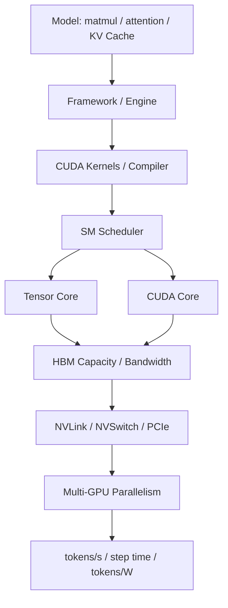

# 第 35 章：GPU 芯片与系统架构

## 本章回答的问题

- GPU 芯片内部的 SM、CUDA core、Tensor Core 和 HBM 如何影响模型训练推理？
- FP8、BF16、FP16、INT8 等精度为什么既是模型问题，也是硬件与运行时问题？
- H100、H200、B200、GB200、Grace CPU 和 Superchip 类系统架构对 AI Factory 有什么工程影响？

## 一个真实场景

一个平台团队准备采购新一代 GPU，希望用同样数量的卡支撑更高的推理吞吐。业务目标听起来简单：降低 cost per token，提高 tokens/s，并支撑更长上下文。模型团队关注精度和长上下文质量，推理团队关注 vLLM、TensorRT-LLM、batching 和 KV Cache，基础设施团队关注供电、液冷、NVLink 域和驱动兼容。若采购讨论只围绕“峰值算力更强”，很容易忽略 HBM 容量、HBM bandwidth、低精度可用性、互联拓扑、软件栈成熟度和机房条件。

另一个训练场景更典型。新 GPU 理论算力更高，但预训练任务的 step time 没有按预期下降。Profiler 显示部分 GEMM 确实更快，但数据加载、通信、activation checkpointing 和某些 memory-bound kernel 抵消了收益。训练框架还没有完全启用新硬件的低精度路径，NCCL 和 driver 版本也需要调整。硬件升级提供了潜在上限，但系统没有自动兑现这个上限。

因此，GPU 芯片与系统架构不是硬件爱好者话题，而是 AI Factory 容量规划、模型选择、运行时优化、数据中心工程和经济模型的前提。平台需要知道模型 workload 如何映射到 SM、Tensor Core、CUDA core、HBM、互联和功耗；也要知道这些能力要经过 runtime、kernel、并行策略和调度才能转化为业务产出。

这个场景还说明，硬件采购不是一次性决策，而是一条持续验证链。芯片发布、驱动成熟、框架适配、模型迁移、量化评测、机房交付和线上观测都需要时间。AI Factory 只有把这些阶段串起来，才能避免“买到了更强 GPU，却没有获得更低 token 成本”的尴尬。

所以，本章的重点不是比较某张卡谁更强，而是建立判断框架：先识别 workload 瓶颈，再确认硬件能力是否匹配，再验证软件是否吃到能力，最后用端到端指标证明经济收益。

## 核心概念

GPU 架构决定 AI workload 的上限和约束。SM 是并行执行资源，CUDA core 处理通用并行操作，Tensor Core 加速矩阵和张量计算，HBM 提供高带宽显存，NVLink/NVSwitch/PCIe 决定多 GPU 数据路径，低精度能力决定训练和推理的优化空间。任何一个环节不足，都可能让整体性能偏离单卡峰值。

从 AI Factory 视角看 GPU，不是为了背规格表，而是为了建立映射关系。模型结构如何映射到算子，算子如何映射到 kernel，kernel 如何使用 Tensor Core 或 CUDA core，参数和 KV Cache 如何占用 HBM，多 GPU 并行如何使用互联，最终如何影响 TTFT、TPOT、tokens/s、step time、tokens/W 和 cost per token。这个映射链越清晰，容量规划越可靠。

GPU 代际差异也要被产品化。不同代际的显存容量、显存带宽、低精度能力、互联、功耗和系统形态不同，适合的 workload 不完全相同。长上下文推理可能更看重 HBM 容量和带宽；大规模训练更看重互联、低精度训练稳定性和通信效率；批量推理更看重吞吐和能效。平台应把这些差异写入资源等级。

芯片能力还受软件栈制约。CUDA、cuDNN、NCCL、driver、编译器、推理引擎、训练框架和模型 kernel 都需要支持新能力。硬件已经支持某种精度，不代表模型 artifact、runtime 和评测体系已经准备好生产使用。AI Factory 必须把芯片、系统和软件栈作为整体治理。

因此，GPU 架构能力应被视为“经过验证的生产能力”，而不是“厂商规格中的潜在能力”。一个特性是否可用，要看目标模型、目标 runtime、目标精度和目标 SLA 下的验证结果。资源池标签也应区分 supported、validated、production 和 experimental，避免把实验能力误交付给生产任务。

这种分级能降低新硬件引入风险。团队可以先让少数模型试用 experimental 能力，稳定后进入 validated，再进入 production 池。硬件演进就变成可控迁移，而不是一次性切换。

## 系统架构

GPU 系统架构可以从模型算子开始向下看。Transformer 中的 matmul、attention、embedding、normalization、sampling 和 communication，会被框架和编译器转化为 kernel；kernel 在 SM 上调度，矩阵计算尽量使用 Tensor Core，通用操作使用 CUDA core，数据从 HBM、cache 或互联中读取。多 GPU 场景下，NCCL 和 runtime 再通过 NVLink、NVSwitch、PCIe、InfiniBand 或 RoCE 传输数据。

架构的关键是让每层知道下一层的约束。模型团队选择 context length、hidden size、MoE、量化和并行策略时，会改变 HBM、Tensor Core 和互联压力；runtime 团队选择 batching、paged attention、speculative decoding、kernel fusion 或 PD 分离时，会改变计算与内存访问比例；基础设施团队选择 GPU 型号、服务器拓扑和机房密度时，会改变可用上限。任何一层孤立优化，都可能把瓶颈推给另一层。

资源池需要把 GPU 架构抽象成可调度能力。能力包括架构代际、显存容量等级、显存带宽等级、低精度支持、NVLink/NVSwitch 域、MIG/vGPU、功耗等级、driver/runtime baseline 和验收结果。调度器不应让要求 FP8 kernel 的服务落到不支持或未验证的节点，也不应让长上下文模型落到 HBM 不足的资源池。

架构图还应提醒我们：上层指标不是芯片指标的简单投影。tokens/s 可能受 Tensor Core 影响，也可能受 HBM、CPU、网络、调度和请求分布影响；training step time 可能受 GEMM 影响，也可能受 AllReduce、checkpoint 和数据加载影响。系统架构的价值，是帮助团队知道该往哪一层找证据。

因此，GPU 架构评估要同时包含 micro-benchmark 和 workload benchmark。前者用于确认硬件路径，后者用于确认业务收益。两者缺一不可。

这也决定了组织分工。硬件团队提供规格和基线，runtime 团队验证 kernel 和 engine，模型团队验证质量，平台团队验证调度和容量，SRE 团队验证可观测和回滚。GPU 架构只有穿过这些环节，才算进入生产。



## 35.1 SM

SM 是 Streaming Multiprocessor，是 GPU 上执行计算的基本并行单元。SM 内部包含 warp scheduler、寄存器、共享内存、load/store 单元、CUDA core、Tensor Core 和其它执行资源。模型算子最终会被编译或调度成一个个 kernel，在多个 SM 上并行执行。SM 的数量、频率、调度能力和片上资源共同影响 GPU 的计算上限。

但 SM 多不代表所有 workload 都线性变快。Kernel 是否有足够并行度，是否受 HBM 限制，是否被通信等待打断，是否存在分支或 shape 不友好，都会影响 SM 利用。在线推理 decode 阶段，batch 可能较小，序列长度动态变化，KV Cache 访问频繁，某些 kernel 无法持续填满所有 SM。训练中，通信、数据加载和 checkpoint 也可能让 SM 等待。

观测 SM 不能只看 GPU utilization。GPU utilization 是粗粒度信号，无法说明时间花在 Tensor Core、内存等待、kernel launch、通信还是调度空洞上。更有价值的指标包括 kernel time、occupancy、achieved occupancy、SM busy、warp stall reason、Tensor Core utilization、memory throughput 和 roofline 分析。它们帮助判断瓶颈是计算、内存还是调度。

工程上，SM 分析应服务优化决策。若 SM 低利用来自 batch 太小，可以通过 batching 或 speculative decoding 改善；若来自 memory-bound kernel，应优化数据布局或 KV Cache；若来自通信等待，应看并行策略和互联；若来自 kernel 不匹配，应升级引擎或使用更合适的 kernel。SM 是芯片资源，也是性能诊断入口。

SM 指标还要和容量规划关联。一个模型在低并发下 SM 利用不高，不一定代表资源浪费；它可能是为了满足低延迟 SLA。批量推理可以追求更高 SM busy，在线交互则需要在吞吐和响应之间取舍。平台不应机械追求 SM 满载，而应结合 TTFT、TPOT、SLA 和成本判断。

训练场景也类似。某些阶段 SM 低利用可能来自通信同步或 checkpoint，并不一定能靠换 GPU 解决。先定位等待原因，再决定优化方向，是避免错误采购和错误调参的关键。

## 35.2 Tensor Core

Tensor Core 是面向矩阵乘和张量计算的专用单元。Transformer 中的线性层、attention 中的大规模矩阵运算、训练中的 GEMM 和部分卷积或多模态算子，都可以从 Tensor Core 获益。现代大模型训练和推理的高吞吐，很大程度来自 Tensor Core 对 FP16、BF16、FP8、INT8 等低精度或混合精度计算的加速。

Tensor Core 的使用不是自动发生的。模型 shape、batch size、数据类型、kernel 实现、框架版本、编译器、推理引擎和硬件架构都要匹配。某些 shape 不友好时，kernel 可能无法充分使用 Tensor Core；某些量化格式虽然理论可用，但对应 engine 或模型结构还不成熟；某些训练路径需要 loss scaling、精度策略和稳定性调参。

生产系统使用 Tensor Core 能力时，必须同时验证性能和质量。推理中，INT8 或 FP8 可能提升吞吐、降低显存和能耗，但需要评测精度、稳定性、安全性和业务指标；训练中，低精度可能影响 loss scale、梯度稳定和收敛。硬件能力不能直接等同于生产可用能力，必须经过模型评测和回滚方案。

观测上，应记录 Tensor Core 利用率、GEMM kernel 选择、低精度路径是否启用、不同 batch/shape 下的吞吐和模型质量指标。若新 GPU 上线后性能不达预期，第一步不是质疑硬件，而是确认 runtime 是否真正使用了目标 Tensor Core 路径。Tensor Core 是算力杠杆，但需要软件和模型共同撬动。

Tensor Core 优化也会改变资源需求。更低精度减少 HBM 占用，可能允许更大 batch 或更多并发；更高吞吐又可能增加网络、KV Cache 和输出 streaming 压力。优化一个算子后，系统瓶颈会移动。成熟平台会在每次引擎或精度升级后重新测端到端曲线，而不是只看单 kernel 提速。

## 35.3 CUDA core

CUDA core 是 GPU 的通用并行计算单元，适合执行大量标量或向量操作。虽然大模型最显眼的计算是矩阵乘，但并非所有工作都落在 Tensor Core 上。激活函数、归一化、位置编码、采样、top-k/top-p、索引、mask、数据重排、部分 attention 辅助逻辑、自定义算子和许多小 kernel，仍会使用 CUDA core 或通用执行路径。

在线推理 decode 阶段尤其能体现 CUDA core 与内存访问的重要性。每次生成一个 token，不仅有矩阵计算，还有 KV Cache 读取、logits 处理、采样、停止条件判断和请求调度。batch 小或请求形态不规则时，通用 kernel 和 kernel launch 开销会更突出。只看 Tensor Core 峰值，无法解释 TPOT、长尾延迟和 streaming 抖动。

CUDA core 还影响自定义算子和新模型结构的落地速度。模型团队引入新的 attention 变体、MoE routing、稀疏操作或多模态预处理时，可能暂时没有高度优化的 Tensor Core kernel。此时通用 CUDA 实现决定初期性能。AI Factory 需要把模型创新和 kernel 工程连接起来，否则新模型上线会被低效算子拖住。

工程上，CUDA core 相关瓶颈通常通过 profiler 识别。若看到大量小 kernel、低 occupancy、同步点、数据重排或采样开销，就应考虑 kernel fusion、CUDA Graph、engine 参数、batch 策略或算子重写。CUDA core 不是落后概念，而是模型系统中大量“非 GEMM 逻辑”的执行基础。

许多线上延迟问题也与这些非 GEMM 逻辑有关。用户感知的 token streaming 不只取决于大矩阵乘，还取决于每个 token 之后的 logits 处理、采样和请求状态维护。对 Agent 或工具调用场景，小 batch 和不规则上下文更常见，CUDA core 与 kernel 调度开销会更突出。因此，推理优化不能只围绕大 GEMM。

这也是为什么推理引擎持续优化小算子、调度和 CUDA Graph。单个小 kernel 时间不长，但每个 token 重复执行，累积后会影响 TPOT 和长尾。CUDA core 路径的细节，最终会进入用户体验。

## 35.4 HBM bandwidth

HBM bandwidth 是显存带宽，决定 GPU 每秒能从显存中读取和写入多少数据。LLM 推理经常受 HBM 限制，尤其在 decode 阶段，模型权重和 KV Cache 会被反复访问。训练中，参数、activation、gradient、optimizer state、临时 buffer 和通信 buffer 也会消耗大量 HBM 带宽。显存容量决定能不能放下，显存带宽决定能不能喂饱计算。

HBM 容量和带宽要一起看。容量不足会限制模型大小、context length、batch、并发和并行策略；带宽不足会让 memory-bound kernel 变慢，即使 Tensor Core 还有剩余算力。长上下文推理就是典型例子：KV Cache 容量随上下文和并发增长，访问效率又直接影响 TPOT。显存看起来够用，不代表带宽和访问模式足够高效。

优化 HBM 使用需要跨层协作。模型层可以采用量化、GQA/MQA、稀疏或更合理的结构；runtime 层可以使用 paged attention、prefix cache、KV Cache 管理、kernel fusion 和 batching；训练层可以使用 activation checkpointing、ZeRO、FSDP、offload 或更合适的并行策略；调度层则需要估算显存水位和碎片。单纯换更强 GPU 不一定解决低效访问模式。

观测上，应同时看 HBM 使用量、reserved/allocated 差异、OOM、KV Cache 命中和增长、HBM bandwidth、memory stall、L2/cache 行为和 tokens/s。成本上，HBM 直接影响每张 GPU 能承载多少并发和多长 context。AI Factory 的推理容量规划，不能只按参数量估算，还要按 HBM 容量、带宽和缓存策略估算。

HBM 也是模型产品策略的一部分。提供更长 context、更高并发或更低延迟，都会消耗 HBM 预算。平台需要把 context length、并发、batch、KV Cache 策略和价格联系起来，否则业务会把“更长上下文”当作免费能力。Token Factory 视角下，HBM 是生产 token 的关键瓶颈之一。

因此，长上下文服务应有单独容量模型。它不能简单沿用短上下文 tokens/s，否则会低估 KV Cache 对 HBM 容量和带宽的占用。

## 35.5 FP8、BF16、FP16、INT8

FP8、BF16、FP16、INT8 是常见低精度或量化数据类型。它们通过减少数据大小、提升硬件执行效率、降低显存占用和降低数据搬运压力，帮助提高训练或推理吞吐。对 AI Factory 来说，精度不是单纯模型参数，而是连接硬件能力、runtime 支持、模型质量、评测门禁和成本模型的生产决策。

训练中，BF16 和 FP16 常用于 mixed precision。BF16 的指数范围更友好，FP16 在一些场景中需要更仔细的 loss scaling。FP8 在合适硬件、框架和训练策略下可进一步提高效率，但需要验证收敛、稳定性和数值误差。训练精度策略不能只看单 step 速度，还要看最终模型质量、失败率、调参成本和恢复能力。

推理中，INT8、FP8 或更低精度量化可以降低显存、提升吞吐和改善 cost per token，但风险在于精度损失和行为漂移。不同模型、不同层、不同激活分布和不同任务对量化敏感度不同。生产发布必须记录量化方法、校准数据、评测结果、适用任务、回滚 artifact 和监控指标。否则“降低成本”的优化可能变成质量事故。

硬件支持也不是唯一条件。Runtime、kernel、engine、模型格式、checkpoint 转换、serving stack 和可观测性都要支持目标精度。平台应把精度作为模型 artifact 的元数据，并在调度时匹配合适 GPU。一个要求 FP8 路径的模型，不应被部署到未验收 FP8 runtime 的节点池。

精度还要可审计。线上出现质量回归时，团队需要知道使用了哪个 checkpoint、哪种量化方法、哪份校准数据、哪个 engine 版本和哪类 GPU。若这些信息没有进入模型注册和请求 trace，低精度优化就难以安全运营。性能优化越激进，审计链路越重要。

## 35.6 H100、H200、B200、GB200

H100、H200、B200、GB200 是 NVIDIA 不同代际 GPU 和系统形态的代表。具体规格、配置和供应形态会随产品版本变化，本书不依赖某个固定数值，而关注工程影响：显存容量、显存带宽、低精度能力、互联、功耗、散热、系统集成、软件栈成熟度和机房交付条件。这些因素共同决定资源是否适合某类 workload。

H100 类 GPU 推动了大规模训练和高性能推理的普及，很多软件栈和生产经验围绕它成熟。H200 类产品强化显存容量和带宽相关能力，对长上下文、较大 batch 和 memory-bound 推理更有吸引力。B200/GB200 类系统更强调新一代 GPU、CPU、互联和机柜级集成，平台要同时评估性能收益、供电液冷、系统级故障域和软件适配节奏。

代际升级不能只按“单卡更快”计算 ROI。新 GPU 可能带来更高 tokens/s 和 tokens/W，也可能要求新的服务器形态、液冷、NVLink 域、driver、CUDA、NCCL、推理引擎和训练框架。若软件栈尚未成熟，早期资源可能适合内部调优和高价值任务，而不适合立刻全面承载多租户生产。容量规划应把爬坡期纳入模型。

采购和调度都应按 workload 分层。预训练、后训练、微调、在线推理、批量推理、embedding、多模态和长上下文服务，对显存、带宽、互联、精度和功耗的权重不同。AI Factory 最容易犯的错误，是用同一种 GPU 资源等级覆盖所有任务，或者用平均 tokens/s 掩盖 workload 差异。

这些代际名称还容易制造认知误区。新一代系统不只是“更快的卡”，也可能意味着更高 rack 功耗、更严格液冷、更复杂的 NVLink 域、更大的维护影响面和不同的软件生命周期。选型时要把数据中心、平台和模型团队放在同一张表里评估，而不是把硬件决策交给单一团队。

## 35.7 Grace CPU

Grace CPU 是面向高性能计算和 AI 场景的 CPU 产品方向，常与 GPU 形成更紧密的系统组合。它体现了 AI 服务器从“通用 CPU 加离散 GPU”向更专用异构系统演进的趋势。对 AI Factory 来说，CPU 的价值不只在核数，还在内存容量、内存带宽、与 GPU 的互联、能效、NUMA 行为和系统集成。

强 GPU 如果被 CPU 数据路径拖住，整体系统仍然低效。推理服务需要 CPU 处理 tokenizer、请求协议、流式输出、采样和调度；训练任务需要 CPU 做数据加载、解压、shuffle、存储客户端和监控；RAG 和多模态任务还可能有大量前后处理。CPU-GPU 组合设计得好，可以减少数据搬运和等待；设计或调度不当，则会形成隐藏瓶颈。

Grace CPU 或类似 CPU-GPU 组合还会影响软件和运维。操作系统、驱动、容器镜像、性能工具、NUMA 策略、编译器和监控都需要适配。平台要知道这类节点和传统 x86 GPU 节点在镜像、依赖、性能基线和故障模式上的差异。不能把它们简单放进同一个通用节点池。

容量规划时，应把 CPU-GPU 组合看成系统能力。某些 workload 会明显受益于更紧密互联和更高能效，某些 workload 则可能主要受 GPU HBM 或网络限制。选型要基于实际模型和数据路径验证，而不是只比较 CPU 或 GPU 单项指标。

Grace CPU 也提醒平台不要忽视主机侧软件生态。基础镜像、性能工具、二进制依赖、驱动安装、监控 agent 和调试流程都可能与传统节点不同。若平台没有做好镜像和工具链分层，用户会在运行时遇到兼容问题。硬件异构最终会变成软件交付问题。

因此，CPU-GPU 系统上线应包含镜像验证和工具链验证。模型能跑只是第一步，监控、profiling、故障诊断、自动化安装和升级回滚都要可用，才能进入生产资源池。

## 35.8 Superchip

Superchip 是把 CPU、GPU、互联和内存以更紧密方式集成的系统级设计思路。它把性能优化从单芯片扩展到系统层面：芯片间互联、内存访问、功耗、散热、封装、固件和软件栈共同决定表现。对 AI Factory 来说，这意味着资源边界会变大，硬件差异会更强，调度和验收也会更复杂。

系统级集成的价值在于减少传统节点内部或节点之间的瓶颈。更紧密的 CPU-GPU 连接、更大的 GPU 域、更高带宽互联和更统一的系统设计，可以支撑更大模型、更长上下文和更高吞吐。但它也会带来新的故障域：一个系统级组件异常，可能影响一组 GPU、一个 tray 或一个 rack 级单元，而不是单卡。

平台需要能描述“系统级 GPU 域”。资源池不应只记录单卡，也要记录哪些 GPU 属于同一 Superchip 或系统单元，是否允许拆分，拆分后性能如何标注，维护时如何 drain，故障时如何降级。若用户申请 16 张 GPU，平台应能区分它们是在一个紧耦合域内，还是跨多个低带宽边界拼出来的集合。

Superchip 类系统也要求验收升级。单卡 burn-in 不够，还要验证系统级互联、NCCL、GPU-to-CPU、功耗、液冷、固件、故障隔离和典型模型 workload。越高度集成，越不能用传统单服务器验收口径。系统架构升级必须伴随平台抽象升级。

这种系统还会改变组织协作。芯片、服务器、网络、液冷、驱动、runtime 和调度不再是松散边界，而是一个共同产能单元。任何团队单独变更，都可能影响整体性能。AI Factory 需要把系统级架构纳入变更管理和 incident 分析，而不是只在采购阶段讨论一次。

Superchip 类系统的价值越高，故障成本也越高。平台应预先设计降级策略：隔离整个域、拆分低优任务、迁移推理副本或保留给测试。没有降级策略，高集成度会让故障恢复更困难。

## 工程实现

GPU 能力画像应把芯片能力、系统拓扑、软件基线和 workload 适配写成统一事实源。画像不是规格表复制，而是调度和容量规划可使用的抽象。它应回答：这类 GPU 适合哪些模型，支持哪些精度，经过哪些 runtime 验收，属于哪些互联域，功耗和冷却边界如何，当前处于生产、灰度还是实验状态。

落地可以分三步。第一，硬件入池时记录架构代际、显存容量等级、带宽等级、互联能力、功耗等级和系统形态。第二，软件栈验收时记录 driver、CUDA、NCCL、cuDNN、推理引擎、训练框架、低精度路径和 benchmark 结果。第三，模型平台把 artifact 的精度、context、并行策略和 runtime 需求与 GPU 能力匹配。这样，模型不会被部署到能力不匹配的资源池。

画像还应连接经济系统。tokens/s、tokens/W、单卡并发、训练 step time、失败率、平均功耗和折旧成本共同决定 cost per token 或训练成本。新 GPU 是否值得用于某个 workload，不能只看峰值算力，而要看真实生产曲线。工程实现要让平台能比较不同 GPU 代际、不同精度和不同 runtime 策略下的经济结果。

```yaml
gpu_capability:
  family: nvidia-hopper-or-newer
  memory:
    capacity_class: large
    bandwidth_class: high
  precision:
    bf16: production
    fp8: validated_for_selected_models
    int8: production_for_quantized_inference
  interconnect:
    nvswitch_domain: true
  runtime_baseline:
    driver: managed
    cuda: managed
    nccl: managed
    engines: ["vllm", "tensorrt-llm"]
  suitable_workloads:
    - distributed-training
    - long-context-inference
    - batch-inference
```

实现时还要保留验证来源。某个 capability 是厂商声明、实验室测试、灰度验证还是线上生产基线，可信度不同。资源池可以使用这些状态决定调度范围：experimental 只给测试项目，validated 可给灰度，production 才进入 SLA 池。这样能避免新硬件能力未经验证就影响关键业务。

更进一步，平台应维护 `gpu_capability_scorecard`，把硬件能力、软件成熟度和 workload 结果放在同一个评估对象里：

```yaml
gpu_capability_scorecard:
  gpu_family: next_gen_gpu_pool
  scope:
    resource_pool: inference-and-training-canary
    server_profile: gpu_server_profile_class_a
  hardware_capability:
    hbm_capacity: recorded
    hbm_bandwidth_class: high
    tensor_core_precision:
      bf16: supported
      fp8: supported
      int8: supported
    interconnect_domain: nvswitch_or_equivalent
    power_thermal_envelope: validated
  software_validation:
    driver_cuda_nccl: validated
    inference_engine:
      vllm: validated_for_selected_models
      tensorrt_llm: experimental_or_validated
    training_framework:
      pytorch: validated
      megatron_or_fsdp: validated_if_used
  workload_results:
    long_context_inference:
      tokens_per_second: measured
      ttft_tpot: measured
      quality_gate: passed
      cost_per_token_delta: calculated
    distributed_training:
      step_time: measured
      scaling_efficiency: measured
      stability: measured
  production_state:
    status: validated
    allowed_tiers: [canary, internal_prod]
    blocked_until:
      - quality_gate_for_sensitive_models
      - full_power_thermal_soak
```

Scorecard 能避免两类错误。第一，把厂商规格直接当成生产能力，忽略 runtime、模型质量和机房约束。第二，因为早期某个模型没有吃到收益，就否定整个新硬件。更合理的做法是按 workload、runtime、精度、质量和能效逐项记录，让 GPU 代际迁移成为可复盘的工程过程。

能力画像还应定期刷新。driver、engine、模型版本和 kernel 优化变化后，同一 GPU 的生产能力也会变化。画像如果不随软件演进更新，就会逐渐变成过期文档。

刷新不一定全量重测，但关键 runtime 和关键模型必须保留基线。这样升级收益和回归风险才可比较。

## 常见故障

第一类故障是新 GPU 上线后吞吐没有提升。原因可能是推理引擎未使用对应低精度 kernel，batch/shape 不友好，driver 或 CUDA 版本不匹配，或者瓶颈其实在 HBM、通信、CPU、存储和调度。解决方向是用 profiler 拆分计算、内存、通信和系统等待，而不是直接归因于硬件。

第二类故障是低精度带来质量或稳定性问题。INT8、FP8 或混合精度配置看似降低成本，但在某些任务上出现准确率下降、幻觉增加、训练 loss 不稳定或安全评测退化。解决方向是把精度策略纳入模型发布门禁，记录校准数据、评测结果和回滚 artifact，不能把精度切换当成透明基础设施优化。

第三类故障是调度器没有区分 GPU 代际和系统形态。模型被放到显存不足、互联不合适、低精度未验收或功耗受限的节点，导致启动失败或性能不稳。解决方向是建立 GPU capability label、runtime baseline 和模型需求匹配。资源同名不代表能力相同。

第四类故障是系统级 GPU 域局部异常。某个 NVSwitch、tray、液冷单元或固件组件异常时，单卡仍可见，但多 GPU collective 性能下降。解决方向是系统级验收、域级健康状态和故障隔离。新一代系统不能用旧的单卡健康模型管理。

第五类故障是经济预期落空。新 GPU 上线后单任务 benchmark 很好，但线上 cost per token 没下降，因为 batch 策略、流量形态、功耗、利用率或模型精度门禁限制了收益。解决方向是建立端到端经济指标，把性能、能耗、质量和利用率一起看。硬件 ROI 必须用生产数据证明。

第六类故障是能力标签过粗。调度器只区分 GPU 型号，不区分显存、互联域、低精度验收和 runtime baseline，导致模型落到“型号正确但能力不满足”的节点。解决方向是细化 capability label，并让模型声明资源需求。

## 性能指标

芯片级指标包括 SM busy、SM occupancy、Tensor Core utilization、CUDA core 相关 kernel time、warp stall reason、kernel launch overhead、L2/cache 行为、HBM 使用量和 HBM bandwidth。这些指标用于判断 workload 是否吃到芯片能力，还是卡在内存、调度或小 kernel 上。它们通常来自 profiler，而不是普通监控看板。

模型级指标包括 tokens/s、TTFT、TPOT、TPOP、training step time、samples/s、checkpoint impact、GPU idle time 和不同 batch/context 下的曲线。芯片指标必须和模型指标绑定，否则很难判断优化是否真实有效。一个 kernel 更快，如果端到端 tokens/s 没变，就要继续寻找其它瓶颈。

能效和经济指标包括 GPU power、tokens/W、joules/token、每任务 GPU 小时、故障重跑成本、不同精度下 cost per token 和训练 ROI。GPU 代际升级常常以能效和产能密度证明价值，不能只展示单任务峰值吞吐。对大规模推理，能耗和折旧会长期影响毛利。

质量指标包括不同精度下的 benchmark、业务评测、安全评测、回归测试、输出一致性和线上 A/B。低精度或新 runtime 的性能指标必须和质量指标成对出现。AI Factory 的 GPU 指标体系，要同时回答“快不快”“稳不稳”“准不准”“贵不贵”。

指标采集也要分层。普通运营看板不可能展示完整 profiler 数据，但需要展示端到端趋势；性能工程需要采样式 profiler；模型发布需要质量与精度对比；财务和容量团队需要成本曲线。统一标签和实验元数据可以让这些视角对齐，避免各团队用不同口径讨论同一块 GPU。

指标还要保留版本上下文。没有 driver、CUDA、engine、模型、精度和硬件批次信息，性能曲线变化很难解释。AI Factory 的性能数据，必须和版本数据一起保存。

对于关键服务，指标还应分离预热阶段和稳定阶段。冷启动、权重加载和 steady-state 使用的是不同系统路径，混在一起会误导容量判断。

## 设计取舍

第一个取舍是新代际与成熟度。新 GPU 可能提供更高性能、显存、互联和能效，但软件栈、库存、机房交付、驱动、框架和运维经验需要爬坡。保守使用成熟代际可以降低风险，但可能错过更低 cost per token。平台可以用分层资源池解决：高价值 workload 先试新代际，成熟后逐步扩大。

第二个取舍是低精度与质量。更低精度可以降低显存和提升吞吐，但会引入评测、校准、回滚和监控成本。对内部批量任务，质量容忍度可能更高；对金融、医疗、代码生成或安全敏感场景，质量门禁更严格。精度策略应按业务风险分级，而不是全局统一。

第三个取舍是单卡峰值与系统效率。强 GPU 如果被 HBM、网络、CPU、存储或调度拖住，单卡峰值不能转化为端到端产能。系统级集成提高密度和互联效率，但也放大故障域和维护复杂度。AI Factory 的选型应比较完整系统，而不是比较单个指标。

最终，GPU 架构决策要回到 workload 和经济性。预训练、后训练、推理、embedding、多模态和长上下文服务的瓶颈不同，不应使用同一套采购理由。最好的 GPU 不是规格最高的 GPU，而是在给定模型、SLA、机房、电力和软件栈条件下，能稳定产生最低成本有效 token 的系统。

设计取舍还应允许阶段性答案。早期可以用成熟 GPU 承载核心业务，用新 GPU 做灰度和专项优化；当软件栈、评测和机房条件成熟后，再扩大新代际资源池。AI Factory 的硬件策略不是一次押注，而是持续迁移和验证。稳健的演进比单次激进采购更重要。

这种分阶段策略也能保护团队学习曲线。新硬件越复杂，越需要让平台、模型、SRE 和设施团队共同积累经验。把学习成本计入计划，比在生产事故中支付更便宜。

## 小结

- GPU 架构影响模型训练推理的计算、显存、互联和能效。
- Tensor Core、CUDA core、SM 和 HBM 分别约束不同类型算子。
- 精度选择需要同时考虑模型质量、硬件能力、运行时支持和发布门禁。
- 新一代 GPU 系统会改变资源边界、调度策略和数据中心工程要求。

## 延伸阅读

- [NVIDIA Hopper Architecture Whitepaper](https://resources.nvidia.com/en-us-tensor-core/nvidia-hopper-architecture-whitepaper)
- [CUDA C++ Programming Guide](https://docs.nvidia.com/cuda/cuda-c-programming-guide/)
- [NVIDIA TensorRT documentation](https://docs.nvidia.com/deeplearning/tensorrt/latest/)
