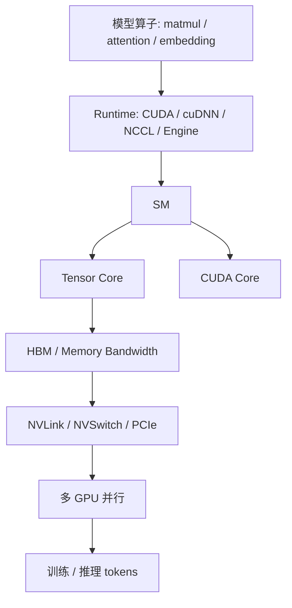

# 第 35 章：GPU 芯片与系统架构

## 本章回答的问题

- GPU 芯片内部的 SM、CUDA core、Tensor Core 和 HBM 如何影响模型训练推理？
- FP8、BF16、FP16、INT8 等精度为什么既是模型问题，也是硬件与运行时问题？
- H100、H200、B200、GB200、Grace CPU 和 Superchip 类系统架构对 AI Factory 有什么工程影响？

## 一个真实场景

一个平台团队准备采购新一代 GPU，希望用同样数量的卡支撑更高的推理吞吐。模型团队关注长上下文和精度，推理团队关注 TensorRT-LLM、vLLM 和 batch 策略，基础设施团队关注供电、液冷和 NVLink 域。采购讨论如果只看“算力更强”，很容易忽略显存容量、显存带宽、精度支持、互联拓扑、软件兼容和机房条件。

GPU 芯片与系统架构不是硬件爱好者话题，而是 AI Factory 容量规划、模型选择、运行时优化和成本模型的前提。

## 核心概念

GPU 架构决定了 AI workload 的上限和约束。SM 决定并行执行资源，Tensor Core 决定矩阵计算效率，HBM 决定模型权重和 KV Cache 的容量与带宽，互联决定多 GPU 扩展效率，精度能力决定模型训练和推理的可用优化空间。

从 AI Factory 视角看 GPU，不是为了背规格，而是为了建立映射关系：模型结构如何映射到硬件单元，运行时如何利用硬件能力，调度系统如何表达资源差异，经济模型如何计算 tokens/s、tokens/W 和 cost per token。

## 系统架构



芯片能力只有被框架、kernel、并行策略和调度系统正确使用，才会转化为业务可见的吞吐和成本优势。

## 35.1 SM

SM 是 Streaming Multiprocessor，是 GPU 中执行计算的基本并行单元。SM 内部包含调度、寄存器、共享内存、CUDA core、Tensor Core 等资源。模型算子最终会被编译或调度成在多个 SM 上执行的 kernel。

SM 数量、频率、共享内存和调度能力影响 GPU 计算吞吐。但 SM 多不代表所有 workload 都线性变快。小 batch、memory-bound kernel、通信等待和不合适的 kernel fusion 都可能让 SM 空闲。

观测上，GPU utilization 只是粗粒度指标。更深入分析需要看 kernel 时间、occupancy、memory throughput、Tensor Core 使用率和等待原因。

## 35.2 Tensor Core

Tensor Core 是面向矩阵乘和张量计算的专用单元。Transformer 中的线性层、attention 相关矩阵运算和训练中的大规模 GEMM 都依赖它。现代 LLM 的训练和推理性能，很大程度来自 Tensor Core 对低精度矩阵计算的加速。

Tensor Core 的使用要求模型、框架、kernel 和数据类型匹配。比如 FP16、BF16、FP8 或 INT8 的使用，需要考虑模型精度、量化方法、校准、loss scaling、kernel 支持和硬件能力。

如果推理引擎没有选到合适 kernel，或者 batch/shape 不友好，Tensor Core 可能无法充分利用。性能优化要从模型 shape、batching、并行策略和 engine 配置一起看。

## 35.3 CUDA core

CUDA core 是 GPU 通用并行计算单元，适合执行大量标量或向量操作。并非所有模型计算都能完全落在 Tensor Core 上，数据处理、激活函数、归一化、采样、索引和部分自定义算子仍会使用 CUDA core。

在推理 decode 阶段，batch 小、序列增长、KV Cache 访问和采样逻辑可能让 workload 不再是纯矩阵乘。此时 CUDA core、内存访问和 kernel launch 开销都会影响 TPOT。

工程上不要把 GPU 性能简化为一个峰值算力数字。不同算子对 Tensor Core、CUDA core、HBM 和缓存的依赖不同。

## 35.4 HBM bandwidth

HBM bandwidth 是显存带宽。LLM 推理常受显存带宽限制，尤其在 decode 阶段，模型权重和 KV Cache 的读取会成为关键路径。训练中，activation、gradient、optimizer state 和参数读写也消耗大量显存带宽。

显存容量决定能放下多大模型、多长 context 和多大 batch；显存带宽决定单位时间能喂给计算单元多少数据。二者共同影响 tokens/s 和并发。

优化 HBM 使用的方法包括量化、KV Cache 管理、paged attention、prefix cache、activation checkpointing、ZeRO/FSDP 和更合适的并行策略。硬件升级只能提供空间，软件策略决定能否吃到收益。

## 35.5 FP8、BF16、FP16、INT8

FP8、BF16、FP16、INT8 是常见低精度数据类型或量化格式。它们通过减少数据大小和提升硬件执行效率来提高吞吐、降低显存占用和能耗。

训练中，BF16 和 FP16 常用于混合精度；FP8 在合适硬件和框架支持下可进一步提升效率；推理中，INT8 或更低精度量化可以降低成本，但需要关注精度损失、校准、激活分布和特定模型结构。

精度选择不是单纯工程开关。模型质量、稳定性、安全评测、业务容忍度和硬件支持都要一起评估。生产系统应记录模型 artifact 的精度、量化方法和评测结果。

## 35.6 H100、H200、B200、GB200

H100、H200、B200、GB200 是 NVIDIA 不同代际和系统形态的代表。具体规格会随产品版本和配置变化，本书关注工程影响：显存容量、显存带宽、低精度能力、互联、功耗、散热和系统级集成。

H100 类 GPU 推动了大规模训练和高性能推理的普及；H200 类产品强化显存容量和带宽相关能力；B200/GB200 类系统更强调新一代 GPU、CPU、互联和机柜级集成。不同代际的价值不只在算力，也在能否支撑更长 context、更大 batch、更低 cost per token 和更高集群密度。

采购和容量规划时，应把 GPU 代际映射到 workload：预训练、后训练、微调、在线推理、批量推理、RAG embedding 和多模态任务可能需要不同资源组合。

## 35.7 Grace CPU

Grace CPU 是面向高性能计算和 AI 场景的 CPU 产品方向，常与 GPU 形成更紧密的系统组合。它体现了 AI 服务器从“通用 CPU 加 GPU”向更专用的异构系统演进。

对 AI Factory 来说，CPU 的价值在于数据准备、内存容量、与 GPU 的互联、能效和系统集成。强 GPU 如果被 CPU 数据路径拖住，整体系统仍然低效。

讨论 Grace CPU 或类似 CPU-GPU 组合时，应关注内存、带宽、互联、软件生态、虚拟化和可运维性，而不是只看 CPU 核数。

## 35.8 Superchip

Superchip 是把 CPU、GPU、互联和内存以更紧密方式集成的系统级设计思路。它把性能优化从单芯片扩展到系统层面：芯片间互联、内存一致性、功耗、散热和软件栈共同决定表现。

这类系统对 AI Factory 的影响是资源边界变大、硬件差异更强、调度和验收更复杂。平台需要能描述“系统级 GPU 域”而不是只描述单张卡。

运维上，系统级集成意味着故障影响范围可能更大。维修、替换、升级和回归测试要按系统单元管理。

## 工程实现

GPU 能力画像示例：

```yaml
gpu_capability:
  family: nvidia-hopper-or-newer
  memory:
    capacity_class: large
    bandwidth_class: high
  precision:
    bf16: supported
    fp8: supported_when_runtime_supports
    int8: supported
  interconnect:
    nvswitch_domain: true
  runtime_baseline:
    driver: managed
    cuda: managed
    nccl: managed
  suitable_workloads:
    - distributed-training
    - long-context-inference
    - batch-inference
```

能力画像应进入模型服务调度、训练任务调度、容量规划和成本系统。

## 常见故障

- 新 GPU 上线后推理吞吐没有提升，原因是 engine 未使用对应低精度 kernel。
- 长上下文服务显存足够，但 HBM 带宽成为 decode 瓶颈。
- 混合精度配置不当导致训练 loss 不稳定。
- 调度器没有区分 GPU 代际，导致模型被放到不合适节点。
- 系统级 GPU 域局部故障后，没有降级和隔离策略。

## 性能指标

- Tensor Core 利用率、SM occupancy、kernel time。
- HBM 使用量、HBM bandwidth、cache hit ratio。
- 单模型 tokens/s、TTFT、TPOT、训练 step time。
- GPU power、tokens/W、温度和降频状态。
- 不同精度下的准确率、稳定性和吞吐。

## 设计取舍

更先进 GPU 提供更高性能和能效，但采购、供电、散热和软件适配成本更高。低精度提升吞吐，但需要质量评测和回滚策略。系统级集成提高密度和互联效率，但会放大故障域和维护复杂度。

AI Factory 的 GPU 选型应从 workload 和经济性反推，而不是从单卡峰值正推。

## 小结

- GPU 架构影响模型训练推理的计算、显存、互联和能效。
- Tensor Core、CUDA core、SM 和 HBM 分别约束不同类型算子。
- 精度选择需要同时考虑模型质量、硬件能力和运行时支持。
- 新一代 GPU 系统会改变资源边界、调度策略和数据中心工程要求。

## 延伸阅读

- TODO: NVIDIA GPU 架构官方资料
- TODO: CUDA 编程模型资料
- TODO: 混合精度与量化工程案例
