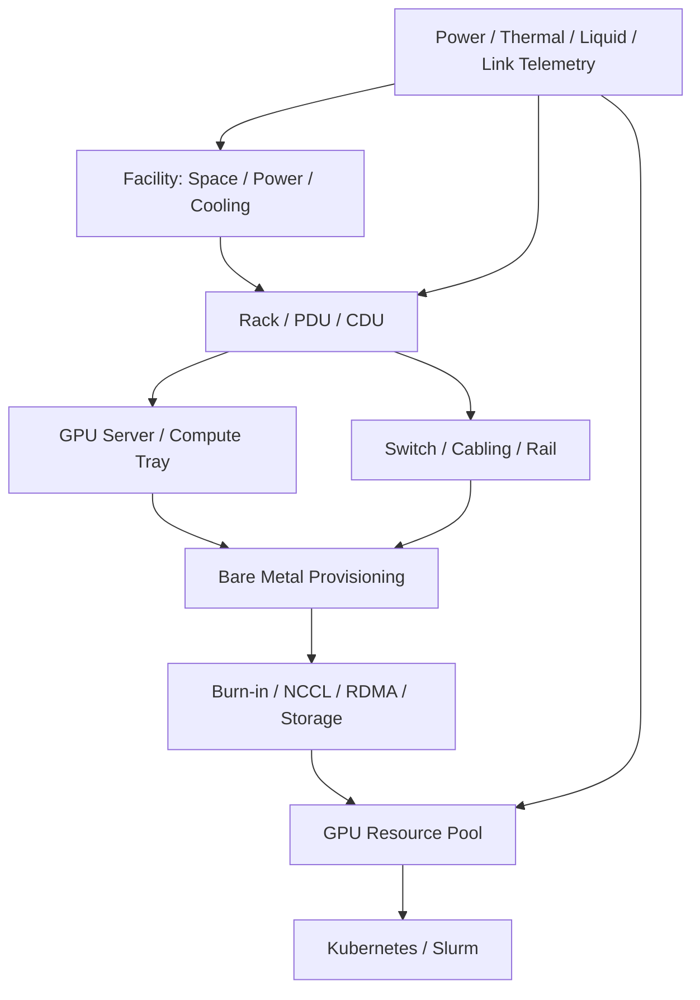
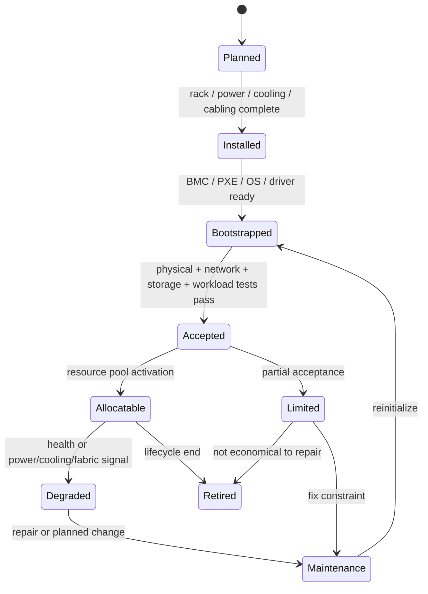

# 第 36 章：AI 数据中心工程

## 本章回答的问题

- AI 数据中心为什么不是传统机房简单增加 GPU 机柜？
- Rack、power、cooling、liquid cooling、PUE、cabling、故障域、交付验收和容量扩展如何影响 AI Factory？
- 物理基础设施如何与上层调度、可靠性和经济性连接？

## 一个真实场景

一批高密度 GPU 机柜计划上线，训练团队已经排期压测，平台团队也准备把节点接入 Kubernetes 和 Slurm。但机房电力容量只能分批交付，液冷管路仍在调试，网络线缆标签与资产系统不一致，部分 rack 的交换机端口映射和设计图不匹配。结果节点虽然陆续能开机，却不能稳定进入生产池：有的机柜因供电限制不能满载，有的 rack 因冷却告警导致 GPU 降频，有的节点因 rail 接错导致 NCCL 性能异常。

另一个场景发生在扩容后。单节点验收全部通过，但多个训练任务同时运行时，存储网络和训练 fabric 出现拥塞，checkpoint 周期与训练通信互相干扰。设施团队认为机房交付完成，网络团队认为端口 up，平台团队认为 GPU 数量增加，业务团队却发现可用训练产能没有按装机数量增长。问题不在某一个设备，而在端到端容量没有被整体设计和验收。

AI 数据中心工程的目标，不是最快把机器点亮，而是让物理机房能力转化为可预测、可验收、可扩展的 AI Factory 产能。机房、电力、制冷、rack、线缆、网络、存储、服务器、准入、调度和 SRE 必须形成闭环。只有这样，GPU 才能从昂贵资产变成稳定生产 token 和模型的工厂设备。

这个目标要求团队改变验收语言。传统交付常问“设备是否安装完成、链路是否连通、机器是否开机”；AI Factory 还要问“能否满载运行、能否跨 rack 训练、能否稳定写 checkpoint、能否被调度系统正确理解、故障时能否定位影响范围”。后者才是生产产能。

因此，机房交付要和平台上线计划同步。若训练平台、监控、镜像仓库、存储和调度队列没有准备好，物理交付再快也无法形成可用产能。AI 数据中心工程从一开始就应纳入软件平台节奏。

## 核心概念

AI 数据中心工程覆盖机房空间、电力、制冷、液冷、网络布线、机柜、服务器安装、BMC 管理、故障域、交付验收、容量扩展和运行监控。它位于物理基础设施层，但影响上层 GPU IaaS、资源编排、训练服务、推理服务、SRE 和 Token Factory 经济性。物理层不稳定，上层再好的调度和 runtime 都会被拖住。

传统云数据中心关注通用计算密度、虚拟化、资源池化和业务连续性。AI 数据中心还要承载更高功耗、更高热流密度、更强东西向通信、更昂贵单节点故障成本、更复杂 GPU 互联和更严格的准入验收。AI workload 的同步特性会放大局部故障：一个 rack 的网络、供电或散热问题，可能拖慢整个训练 job。

AI 数据中心的核心工程对象不是单台服务器，而是产能单元。一个产能单元可能是 rack、pod、row、GPU island、网络 fabric 或某个 power/cooling domain。平台要知道这些单元的状态：可用、受限、降额、维修、扩容中或禁止调度。否则资源池登记的是理论 GPU 数，而不是可兑现产能。

经济性也从物理层开始。PUE、供电效率、液冷效率、rack 密度、故障率、维修时间、网络线缆质量和交付周期，都会影响 tokens/W、cost per token、训练 ROI 和 SLA。AI 数据中心不是背景设施，而是 AI Factory 经济模型的一部分。

因此，本章不会把机房工程写成土建或设施清单，而是关注它如何进入平台工程。Rack 要进入拓扑调度，power 要进入容量模型，cooling 要进入节点健康，cabling 要进入网络准入，故障域要进入 SRE，交付验收要决定资源池状态。物理工程只有被平台消费，才算真正完成。

这个视角能避免两个极端：只懂设施不懂 workload，会交付无法高效训练的机房；只懂平台不懂设施，会把物理约束当成偶发故障。AI Factory 需要跨层语言，把机房事实翻译成资源和 SLA。

## 系统架构

AI 数据中心架构可以从设施到资源池逐层理解。Facility 层提供空间、电力、制冷、消防、安防和运维通道；rack 层承载 GPU 服务器、switch、PDU、CDU 或液冷组件；网络与存储层提供训练 fabric、推理入口、管理网、BMC 网和存储路径；裸金属交付层完成 BMC、PXE、OS、driver、firmware 和初始化；准入层运行 burn-in、NCCL、RDMA、存储和真实 workload 压测；资源池再把通过验收的节点交给调度系统。

这条链路中的任何一环不稳定，都不应进入生产资源池。电力未满载验收的 rack，不能按满配 GPU 售卖；液冷告警的节点，不能承载长时间高功耗训练；线缆映射未验证的 rail，不能进入高优训练 fabric；未完成 NCCL 和存储并发验收的批次，不能只凭单机测试上线。架构的核心是把物理状态上送到平台状态。

AI 数据中心还需要闭环 telemetry。电力、温度、液冷供回水、流量、漏液、风扇、BMC、PDU、端口、链路、rack、server、GPU 和 job 指标要能关联。SRE 排查一次训练变慢时，应能看到是否同一时间出现 rack 温度升高、电力告警、端口错误或存储拥塞。没有跨层 telemetry，物理问题会伪装成模型或平台问题。

架构上还要定义状态流转。资源从 planned 到 installed，到 bootstrapped，到 accepted，到 allocatable，再到 degraded、maintenance 或 retired，每个状态都应有证据和责任人。没有状态机，扩容会变成一堆临时表格；有了状态机，平台可以明确哪些资源能卖、哪些只能测试、哪些必须维修。

状态流转还要有门禁。比如 cabling 未验证不能进入 fabric 池，液冷未满载验收不能进入高优训练池，存储并发失败不能承载 checkpoint 密集任务。门禁把工程事实变成自动化规则，减少人工口头协调。



物理产能激活可以进一步表示为状态机：



状态机的价值在于防止“半成品产能”进入生产承诺。`Installed` 只说明设备放好了，`Bootstrapped` 只说明软件能启动，`Accepted` 才说明关键路径通过验收，`Allocatable` 才说明调度器可使用。任何 power、cooling、fabric 或 storage 限制，都应落到 `Limited` 或 `Degraded`，而不是靠人记住。

## 36.1 rack

Rack 是机柜，也是 AI Factory 重要的容量、拓扑和故障域单位。一个 rack 通常包含 GPU 服务器、compute tray、交换机、PDU、电源线、网络线缆、管理网、冷却部件和可能的 CDU。高密度 GPU rack 的功耗和散热要求远高于普通服务器 rack，因此 rack 不能只被视为物理摆放单位。

调度上，rack 信息具有双重作用。训练任务为了降低通信成本，可能希望节点尽量位于同 rack 或相邻 rack；高可用推理服务为了避免单点故障，可能希望 replica 跨 rack 分散。批量推理、数据处理和评测任务则可能更关注成本和可用碎片。平台必须让 workload 类型决定 rack 策略，而不是全局固定。

资产系统应记录 rack 位置、U 位、供电路径、PDU、冷却域、交换机、服务器槽位、BMC、线缆、rail、故障状态和容量限制。没有准确 rack 信息，就无法建立拓扑调度、故障域分析和容量规划。很多 AI 集群排障困难，不是因为没有监控，而是因为监控指标无法映射到真实 rack 和线缆。

Rack 级运营还要关注碎片和降额。某个 rack 可能还有空闲 GPU，但电力不足、冷却异常、上联端口不足或 rail 缺失，使其不能承载高优训练。资源池应表达 rack 的可用等级，而不是只统计里面有多少 GPU。Rack 是产能单元，不是设备货架。

Rack 还适合作为容量复盘单位。一次训练变慢、一次推理故障或一次扩容失败，都应能按 rack 聚合影响：哪些 rack 的 GPU 小时损失最多，哪些 rack 的温度更高，哪些 rack 的线缆错误更多。长期看，rack 级数据能指导下一轮机房设计和供应商改进，而不仅是现场排障。

Rack 标签还应贯穿日志、指标和成本。只有这样，平台才能知道某个 rack 贡献了多少有效产能，又消耗了多少维修和能耗成本。

AI Factory 应把 rack 建模为 `rack_capacity_unit`。它不是“一个机柜里有多少 GPU”，而是一个由电力、制冷、网络、存储、服务器画像和准入结果共同决定的可承诺产能单元：

```yaml
rack_capacity_unit:
  rcu_id: dc-a-rack-12
  physical_scope:
    rack: rack-12
    row: row-b
    room: room-3
  capacity:
    gpu_count_installed: recorded
    gpu_count_allocatable: calculated
    full_nvlink_domains: recorded
    training_fabric_ready: true
    storage_path_ready: true
  constraints:
    power_envelope: power-thermal-rack12-a
    cooling_domain: cdu-loop-2
    pdu_capacity_margin: measured
    cabling_state: verified
  workload_fit:
    large_distributed_training: allowed
    premium_inference_spread: allowed_with_anti_affinity
    checkpoint_heavy_training: limited_if_storage_concurrent_limited
  economics:
    rack_power: measured
    effective_gpu_hours: calculated
    tokens_per_watt: calculated_if_inference
    capacity_loss_reason: none_or_recorded
```

这个对象让容量讨论从“买了多少 GPU”变成“激活了多少可用产能”。一个 rack 可能服务器都安装完成，但因为 cooling_limited 或 fabric_limited 只能进入低优池；另一个 rack 可能 GPU 数少一些，但 power、cooling、fabric、storage 全部通过，能承载高优训练。容量运营必须使用 `gpu_count_allocatable` 和 workload fit，而不是采购清单。

## 36.2 power

Power 是 AI 数据中心最关键的约束之一。GPU 服务器功耗高，训练任务可能长期满载，推理服务也可能在高并发时产生明显峰值。电力路径从变电、UPS、配电、母线、PDU、power shelf、PSU 到服务器内部，每一层都有容量、冗余、故障域和维护边界。任何一层不足，都会让装机 GPU 变成不可满载产能。

容量规划不能只看物理空间和采购数量。一个 rack 能放下多少服务器，不代表电力允许多少 GPU 同时满载；一个机房标称容量充足，也不代表某个 row、PDU 或 power domain 没有局部约束。AI Factory 应把 power domain 写入资源池，让调度知道哪些节点共享电力风险，哪些 rack 处于降额运行。

电力问题在上层常表现为 GPU 降频、节点重启、PSU 告警、BMC power event、机柜批量异常或训练中断。业务看到的是吞吐下降或任务失败，根因可能在电力冗余丢失或峰值超过策略。SRE 必须把 power telemetry 与 job 时间线关联，否则电力问题会被误判为 GPU 或 runtime 问题。

经济性上，电力直接影响 tokens/W、joules/token 和 cost per token。不同 workload 的功耗曲线不同：预训练长期高功耗，在线推理随流量波动，批量推理可能集中在低价时段运行。成熟平台应逐步引入 power-aware scheduling 和能耗归因，把电力从设施成本变成可优化变量。

Power 还影响可靠性策略。冗余越强，故障时越安全，但可用于 IT 负载的电力预算可能越少；追求更高密度，可能需要接受更严格的降额和调度控制。AI Factory 不应把这些策略藏在设施层，而应把它们转化为资源等级和 SLA。用户买到的不是抽象 GPU，而是带电力保障的生产能力。

## 36.3 cooling

Cooling 是制冷能力，决定高密度 GPU 能否长时间稳定运行。GPU 服务器的热流密度高，冷却不足会导致 GPU 降频、温度告警、风扇高转、硬件错误甚至停机。同型号 GPU 在不同 rack 表现不同，常常不是芯片差异，而是进风温度、风道、液冷状态或局部热环境不同。

风冷系统关注冷热通道、风道组织、机柜布局、挡板、风扇、温湿度和回风路径。高密度 GPU 系统可能超出传统风冷能力，需要液冷或混合冷却。无论采用哪种方案，冷却都必须在真实 workload 下验收。空载温度正常，不代表训练满载或多任务混部时不会触发降频。

平台需要把热风险转化为调度状态。处于热告警、冷却降额或风扇异常的节点，不应继续接收长时间满载训练任务；某个 cooling domain 异常时，应限制新任务进入相关 rack，并考虑迁移在线推理副本。冷却状态若只停留在设施看板，上层调度就会继续制造风险。

观测指标包括进风温度、出风温度、GPU temperature、hotspot、fan speed、throttle reason、冷却告警、rack 热分布和任务功耗。冷却问题的诊断需要时间线：温度什么时候升高，是否对应训练开始、推理高峰、液冷流量变化或机房环境变化。AI 数据中心需要热力学证据链，而不是只看当前温度。

Cooling 设计还要考虑运维动作。更换风扇、调整挡板、清理过滤、维修 CDU 或改变 rack 布局，都可能影响热环境。每次变更后，应比较同一组 workload 的温度和降频基线。冷却系统不是一次设计完成后不再变化的背景设施，而是持续影响 GPU 产能的运行系统。

冷却指标也要有季节和负载背景。同一温度在不同外部环境和不同 workload 下含义不同，基线需要随时间校准。

## 36.4 liquid cooling

Liquid cooling 用液体带走热量，适合高密度 GPU 系统。它可能涉及 CDU、冷板、快接头、管路、供回水温度、流量、压力、漏液检测、过滤、维护安全和备件流程。液冷让更高密度和更高功耗系统成为可能，但也把机房工程与服务器运行绑定得更紧。

液冷不是简单替代风扇。它引入新的故障模式：流量不足、供水温度异常、压力波动、快接头问题、漏液告警、CDU 故障、传感器误报和维护窗口风险。某些故障影响单节点，某些故障影响整柜、整排或一个冷却回路。平台必须知道 cooling domain，否则无法判断影响范围。

上线液冷系统时，准入应覆盖满载功耗、供回水温度、流量稳定性、漏液检测、CDU 冗余、告警联动和故障演练。节点能开机不代表液冷系统生产可用。对高价值训练池，液冷异常应能触发 drain、降额、隔离或任务迁移策略。否则一次冷却异常会直接变成训练中断。

液冷还改变运维组织。设施团队、服务器团队、平台 SRE 和供应商需要共享告警、备件和操作流程。维护液冷接头或 CDU 不是普通服务器换件，必须考虑安全、停机范围、数据保护和恢复验收。AI Factory 采用液冷时，应同步升级运行手册和应急机制。

液冷状态也应对用户透明到合适程度。用户不需要理解每个阀门，但需要知道资源池是否处于 cooling_limited，长训练是否会被限制，维护窗口是否影响某个 GPU island。平台把液冷细节翻译成资源状态，可以减少不可解释的性能波动和临时停机。

液冷引入后，演练非常重要。漏液告警、流量下降和 CDU 切换都应有演练记录，否则真正故障时团队只能临场判断。

## 36.5 PUE

PUE 是 Power Usage Effectiveness，用于衡量数据中心总能耗与 IT 设备能耗的比例。它不是 AI 系统性能指标，但会影响 AI Factory 的长期经济性。同样的 GPU workload，如果设施能耗更高，实际电力成本和碳成本都会上升。对大规模推理服务，能源成本会持续影响毛利。

使用 PUE 时要注意边界。PUE 与机房设计、季节、气候、负载率、冷却方式和测量口径有关。一个年度平均 PUE 不能解释某个 rack、某个时间段或某类 workload 的真实能耗。经济模型应尽量使用可追溯的电力数据，把 IT power、facility overhead 和 workload 产出关联起来。

PUE 也不能替代 tokens/W。PUE 说明设施效率，tokens/W 说明 AI workload 把能耗转化为 token 的效率。一个低 PUE 机房如果 GPU 利用率低、模型服务 batch 策略差或硬件选型不匹配，cost per token 仍然可能很高。AI Factory 要同时优化设施效率和计算效率。

工程上，可以把 PUE、rack power、GPU power、tokens/s 和任务标签结合，形成更可靠的能耗归因。训练 ROI、推理毛利和容量扩展决策，都应考虑能源成本。PUE 的价值不在口号，而在帮助平台理解物理设施如何影响 token 经济性。

PUE 还要避免被误用为单一优化目标。为了降低 PUE 而牺牲硬件可用性、维修便利性或部署灵活性，可能得不偿失。AI Factory 更应该关注单位有效产出的总成本：同样电力和设施开销下，生产了多少可计费 token、完成了多少训练 step、达成了多少 SLA。PUE 是输入，不是最终答案。

实践中，PUE 适合做趋势和设施效率管理，不适合单独做 workload 计费。更细的能耗归因还需要 rack power、GPU power、任务时间、利用率和输出 token。把这些指标结合，才能把能源成本合理分摊到租户、模型和业务线。

## 36.6 cabling

Cabling 是线缆工程，包括网络线缆、光模块、电源线、管理网、BMC 网、存储网和液冷相关连接。AI 网络对线缆质量和拓扑一致性高度敏感。一个端口接错、rail 接反、标签错误或光模块异常，可能不会导致立即断网，却会在 NCCL、RDMA 或存储压力下表现为带宽下降、丢包、重传或长尾延迟。

线缆问题常见于扩容、维修和搬迁后。设计图、资产系统、交换机端口、服务器 NIC 和实际布线如果不一致，调度器看到的拓扑就是假的。训练任务可能被放到“理论同 rail、实际跨 rail”的节点上，导致性能不可解释。Cabling 必须纳入准入，而不是只靠人工贴标签。

工程上，应建立端到端映射：server、NIC、port、switch、rack、rail、fabric、管理网和存储网。自动校验可以通过 LLDP、交换机端口、主机接口、RDMA/NCCL 测试和资产系统比对完成。线缆或光模块更换后，应触发拓扑回归。没有这个闭环，大规模集群会随着维护逐渐产生拓扑漂移。

Cabling 还影响可维护性。线缆布局混乱会延长维修时间，增加误拔风险，也会影响风道和液冷维护。AI 数据中心的线缆工程应服务长期运营：清晰标签、规范走线、可审计映射、预留扩展和变更记录。线缆不是低价值杂项，而是高性能网络的物理事实。

线缆验收应有压力测试支撑。端口亮灯和 ping 通不能证明训练 fabric 正确，必须用 RDMA、NCCL、多 rail 和跨 rack 测试验证实际路径。维修后如果只恢复连通性，不恢复拓扑基线，集群会逐渐积累隐性性能问题。Cabling 是最容易被低估、也最容易制造长期漂移的工程环节。

线缆变更必须留痕。

## 36.7 故障域

故障域是一次故障可能共同影响的资源范围。AI 数据中心常见故障域包括 GPU、server、compute tray、rack、PDU、power domain、cooling domain、CDU、leaf switch、spine、rail、storage cluster、BMC network、机房区域和运维批次。AI workload 同步性强，故障域设计会直接影响训练效率和推理可用性。

训练任务通常希望通信资源靠近，以降低 latency 和提高带宽；但靠得越近，越可能落在同一故障域。在线推理服务通常希望 replica 分散，避免单 rack、单 power domain 或单 leaf 故障影响所有实例。调度系统要能表达这两类相反需求：训练偏局部性，推理偏分散性。不能用同一套默认规则处理所有 workload。

故障域信息不应只存在于机房图纸里。它要进入 Kubernetes label、Slurm topology、资源池、告警、容量系统和发布系统。SRE 处理 incident 时，需要快速回答：受影响的是哪些 rack、哪些 power domain、哪些 job、哪些模型、哪些租户。没有故障域标签，故障影响评估会依赖人工经验。

故障域还与批次有关。同一批服务器、同一批线缆、同一版 firmware、同一组交换机配置，可能共享隐性风险。交付和变更应记录 batch_id，并在故障分析中使用。AI 数据中心越大，越需要用数据结构表达故障域，而不是依赖少数人的记忆。

故障域设计还影响容量承诺。若一个租户的关键推理服务所有副本都落在同一 power domain，表面上有多副本，实际可用性并没有提高；若一个训练任务跨越过多故障域，通信可能变差。调度器应能根据 workload 目标选择“集中”或“打散”，而不是简单随机放置。

故障域也应进入发布策略。模型服务灰度发布时，如果新旧版本落在同一故障域，灰度本身无法验证故障隔离能力。

平台应维护 `fault_domain_map`，把物理和逻辑故障域变成可查询对象。示例：

```yaml
fault_domain_map:
  domain_id: dc-a/rack-12
  hierarchy:
    region: dc-a
    room: room-3
    row: row-b
    rack: rack-12
  shared_dependencies:
    power_domain: pdu-a-12
    cooling_domain: cdu-loop-2
    network_domains:
      leaf_pair: leaf-12-a-b
      rail: [rail-0, rail-1]
    storage_path: pfs-client-group-4
    bmc_network: bmc-segment-7
  members:
    nodes: [gpu-node-001, gpu-node-002]
    gpu_count: recorded
  scheduling_semantics:
    colocate_for: [low_latency_training]
    spread_for: [premium_inference, control_plane]
    avoid_if_state: [power_limited, cooling_limited, fabric_degraded]
  incident_queries:
    impact_lookup_keys:
      - node
      - switch_port
      - pdu
      - cdu
      - delivery_batch
```

这张 map 的价值在事故中最明显。PDU 告警不是“设施事件”，而是会影响哪些 node、GPU、job、endpoint、tenant 和 reservation；leaf 维护不是“网络事件”，而是会影响哪些训练拓扑；某批线缆问题不是“现场问题”，而是能否继续把对应 rack 放入高优训练池。故障域 map 把物理世界翻译成调度、发布和 SRE 能消费的事实。

## 36.8 交付验收

交付验收把机房建设结果转化为可用资源。它不仅包括服务器能开机，还包括电力、制冷、BMC、管理网、业务网、训练 fabric、存储路径、OS、driver、CUDA、NCCL、RDMA、GPU burn-in、nvbandwidth、storage benchmark 和真实 workload 压测。验收范围必须覆盖从物理到模型运行的关键路径。

验收要按批次记录。不同批次的服务器、GPU、NIC、线缆、交换机、driver、firmware、液冷状态和机房区域可能不同。没有 batch 维度，后续出现性能异常时很难关联到某次交付或某个供应链批次。每个 batch 应有准入报告、失败清单、维修记录、复测结果和回池时间。

验收通过前，资源不应进入生产池。可以进入 quarantine、staging 或 burn-in 池，但不能对用户承诺 SLA。验收失败也不是简单标记坏节点，而要区分硬件故障、布线错误、配置漂移、冷却限制、网络基线不达标和软件兼容问题。不同失败类型对应不同责任团队和复测流程。

好的验收还要包含真实并发。单节点 GPU burn-in 通过，不代表跨 rack NCCL 通过；单任务 NCCL 通过，不代表多任务混部不拥塞；单客户端存储吞吐通过，不代表 checkpoint 并发通过。AI Factory 的交付验收必须从“设备可用”升级为“workload 可用”。

验收结果也应决定资源等级。完全通过的批次进入高优生产池；部分通过但网络或冷却受限的批次可以进入低优或实验池；关键项失败的资源应留在隔离区。这样既不浪费可用资源，也不会把风险伪装成正常产能。验收不是单一通过/失败，而是资源分级依据。

验收报告应可追溯到每台服务器、每个 rack 和每次测试。没有可追溯报告，后续故障无法证明是新问题还是交付遗留问题。

## 36.9 容量扩展

容量扩展不是简单增加 GPU。它涉及机房电力、制冷、rack、网络端口、光模块、存储吞吐、对象存储请求量、镜像仓库、BMC 地址、IPAM、PXE、驱动版本、调度队列、监控容量、日志容量、SRE 人力和成本模型。任何一个环节不足，都会让新增 GPU 变成新的瓶颈。

扩容应采用分阶段交付。先做容量设计和故障域规划，再资产入库和物理安装，再 BMC 与管理网连通，再 OS、driver 和 firmware 初始化，再网络和存储验收，再 GPU burn-in、NCCL、RDMA、存储和 workload 压测，最后进入资源池。每一步都要可追踪、可回滚、可复测。跳过步骤会把交付风险推到生产。

扩容还会改变系统行为。更多训练任务会增加 east-west 通信和 checkpoint 峰值；更多推理副本会增加模型权重拉取和入口流量；更多节点会增加监控、日志、镜像分发和维修压力。容量规划必须端到端看，而不是只看 GPU 数量。一个系统的瓶颈会随着规模变化而迁移。

成熟的扩容应包含经济评估。新增 GPU 的折旧、电力、制冷、网络、存储、运维和利用率共同决定 ROI。若业务需求主要是在线推理，扩容策略应关注 tokens/s、tokens/W、冷启动和模型发布；若需求是训练，策略应关注大作业排队、网络拓扑和 checkpoint。不同产能目标对应不同扩容方式。

扩容后还要做容量复盘。新增 GPU 是否降低了排队时间，是否提高了线上吞吐，是否引入新的网络或存储瓶颈，是否造成运维告警增加，是否达到预期 cost per token，都需要数据验证。没有复盘，下一轮扩容会重复上一轮假设，规模越大，代价越高。

复盘结果应反向更新容量模型。实际利用率、故障率、交付周期和瓶颈迁移，都比最初规划更接近下一轮扩容需要的输入。

## 工程实现

AI 数据中心工程实现的核心，是把物理交付状态变成平台可读状态。容量系统、资产系统、交付系统、准入系统、资源池和 SRE 看板应共享 batch、rack、power、cooling、network、storage、server 和 acceptance 信息。任何一批资源进入生产池，都应能追溯它的交付路径和验收结果。

一个可落地流程包括六个阶段。第一，capacity design，确认电力、制冷、网络、存储和故障域。第二，physical delivery，完成 rack、power、cooling、cabling 和 server 安装。第三，management bootstrap，确认 BMC、PXE、IPAM、资产和远程控制。第四，software bootstrap，安装 OS、driver、CUDA、NCCL、OFED 和 agent。第五，acceptance，运行 GPU、网络、存储和 workload 基线。第六，pool activation，把通过验收的资源分级进入生产池。

状态机要能表达受限资源。某批 rack 可能 power_ready 但 cooling_limited，某些节点可能 network_validated 但 storage_baseline_failed，某个 fabric 可能 available 但不适合大训练。把这些细粒度状态写入资源池，可以避免“半成品资源”被误调度。平台应允许资源以 degraded 或 limited 等级上线，但必须明确适用 workload 和风险。

```yaml
delivery_batch:
  batch_id: dc-a-rack-12-2026-06
  facility:
    power_ready: true
    cooling_ready: true
    cabling_verified: true
  hardware:
    servers_installed: 16
    bmc_reachable: true
  network:
    fabric_validated: true
    rail_mapping_checked: true
  acceptance:
    gpu_burn_in: pass
    nccl: pass
    rdma: pass
    storage: pass
  pool_state: ready_for_allocation
```

交付系统还应生成 `capacity_activation_record`，记录计划产能、实际激活产能和受限原因：

```yaml
capacity_activation_record:
  batch_id: dc-a-rack-12-2026-06
  rack_capacity_unit: dc-a-rack-12
  planned_capacity:
    gpu_count: recorded
    target_workload: [distributed_training, premium_inference]
    expected_activation_date: recorded
  activation_status:
    state: allocatable
    activated_gpu_count: calculated
    limited_gpu_count: calculated
    blocked_gpu_count: calculated
  evidence:
    gpu_server_profiles: linked
    power_thermal_envelope: passed
    fabric_acceptance_matrix: passed
    storage_acceptance_matrix: passed
    physical_acceptance_matrix: passed
  deltas:
    capacity_shortfall_reason: none_or_power_or_cooling_or_fabric_or_storage
    expected_vs_actual_tokens_per_watt: measured_if_available
  next_action:
    owner: capacity-ops
    due_date: policy_defined
```

这个记录把扩容从项目管理语言转成平台事实。业务关心何时能用，平台关心能承载哪些 workload，设施关心哪些约束未解除，财务关心投产产能和折旧开始。一个 record 同时回答这些问题，才能避免“已经交付”和“还不能跑生产”之间的口径冲突。

实现还需要变更闭环。设施变更、线缆变更、交换机升级、液冷维护、PDU 维修、批量换卡和驱动升级，都应触发相应范围的复测。复测范围不必每次全量，但必须与变更影响面匹配。没有变更闭环，初次验收再严格，也会随着运行时间失效。

工程实现还要给异常资源留出处理路径。验收失败的节点进入 quarantine，部分能力不足的 rack 进入 limited，等待供应商处理的批次进入 blocked。明确状态比隐藏问题更重要，因为平台可以基于状态做调度，而不能基于口头说明做自动化。

状态命名应尽量少而清晰。planned、staging、allocatable、limited、degraded、maintenance、quarantine、retired 已足够覆盖多数流程；状态过多会让自动化难以维护。

## 常见故障

第一类故障是电力容量不足。GPU 高负载时节点降频、重启或触发 PSU/BMC 告警，但资源池仍按满配 GPU 调度。解决方向是把 power domain 和功耗遥测接入调度，未满载验收的 rack 不能按满产能售卖。电力限制应被产品化为资源状态，而不是生产事故后才暴露。

第二类故障是冷却异常。某个 rack 或 cooling domain 进风温度升高、液冷流量不足或 CDU 告警，导致同一组节点性能下降。业务看到的是 tokens/s 或 step time 波动。解决方向是把温度、流量、漏液和降频事件与 rack/job 绑定，并在热风险时自动 drain 或限制长任务。

第三类故障是 cabling 与资产不一致。线缆接错、rail 反接、端口标签错误或维修后未更新资产系统，导致 NCCL、RDMA 或存储路径偏离设计。解决方向是自动拓扑发现、端口映射校验和扩容/维修后的回归测试。不要把线缆一致性寄托在人工表格上。

第四类故障是验收粒度不足。单节点测试通过，生产多机架训练失败；单客户端存储测试通过，checkpoint 并发失败；小规模 RoCE 测试通过，大规模 AllReduce 出现重传。解决方向是让验收覆盖真实 workload、并发和故障域，不只覆盖设备连通性。

第五类故障是扩容后上层系统容量不足。新增 GPU 后，镜像仓库、监控、日志、对象存储请求、调度队列或 SRE 人力成为瓶颈。解决方向是端到端容量规划，把平台控制面和运维能力也纳入扩容，而不是只扩物理服务器。

第六类故障是状态不同步。设施团队已标记某 rack 受限，资源池仍继续调度；网络团队更换了线缆，资产系统未更新；维修团队回池节点，准入基线未重跑。解决方向是统一状态机和自动化门禁。很多生产事故不是没有信息，而是信息没有进入正确系统。

## 性能指标

设施指标包括 IT power、rack power、PDU 状态、PSU 告警、冗余状态、进风温度、出风温度、液冷供回水温度、流量、压力、漏液告警、fan speed 和 cooling domain 状态。它们要与 rack、server、job 和时间线绑定，才能解释生产性能波动。

网络与布线指标包括端口 up/down、链路速率、端口错误、光模块状态、LLDP 映射、rail 一致性、RDMA 重传、NCCL 基线和跨 rack 带宽。线缆和网络指标应进入交付验收和维修回归。只要拓扑被调度器使用，拓扑一致性就是性能指标。

交付指标包括 batch 交付周期、准入通过率、失败分类、返修率、复测次数、回池时间、degraded 资源比例和首次生产故障率。它们衡量数据中心工程是否能稳定转化为可用产能。交付速度快但生产故障高，并不是真正高效。

经济指标包括 PUE、tokens/W、GPU 有效利用率、因电力/冷却/网络导致的 GPU 小时损失、单位 rack 产能、单位电力产能和 cost per token。AI 数据中心指标最终要能回答：物理设施是否在稳定、经济地生产 token 和模型。

指标还要服务不同层级决策。值班 SRE 需要分钟级告警，容量团队需要周/月级趋势，管理层需要产能和成本，平台团队需要与 job 关联的诊断数据。统一数据源可以生成不同视图，但前提是标签一致：rack、batch、power domain、cooling domain、fabric、tenant 和 workload 必须贯穿。

指标也应支持复盘。每次扩容、事故或大规模变更后，都应比较计划产能、验收产能和实际生产产能。差距来自电力、冷却、网络、存储、平台还是业务需求预测，都要被记录。没有复盘，容量规划只会重复过去误差。

指标还要有所有者。没有 owner 的指标只会停留在看板上；有 owner 的指标才能触发维修、扩容、降级或架构调整。

## 设计取舍

第一个取舍是密度与可靠性。高密度部署提高单位空间产能，可能降低部分网络距离和单位机房成本，但会增加电力、散热、液冷、线缆和故障域压力。密度越高，越需要强准入、强 telemetry 和清晰隔离。否则一次 rack 级问题会损失大量昂贵 GPU 小时。

第二个取舍是交付速度与验收深度。业务希望 GPU 尽快上线，但验收不足会把风险转移到训练和推理生产。合理做法不是无限延长验收，而是分级上线：先进入 staging，跑完核心基线后进入低优池，再通过多任务和真实 workload 后进入高优生产池。不同资源等级对应不同证据。

第三个取舍是局部最优与端到端产能。设施团队可以优化机房交付，网络团队可以优化端口，平台团队可以优化调度，但 AI Factory 关心的是有效 GPU 小时、tokens/s 和 cost per token。局部指标必须服从端到端产能。扩容计划应同时评估电力、冷却、网络、存储、控制面和业务需求。

最终，AI 数据中心工程的目标不是“把机器点亮”，而是把物理资产转化为持续、可解释、可扩展的 AI 生产能力。好的数据中心工程会让上层平台知道哪些资源可用、为什么可用、能承载什么 workload、出现问题时影响哪些任务，以及扩容后真实产能增加多少。

设计取舍应以证据复盘。高密度是否值得，要看单位 rack 有效产能和故障损失；深度验收是否值得，要看生产事故减少和交付周期增加之间的平衡；细粒度故障域是否值得，要看调度质量和治理成本。AI 数据中心工程不是追求绝对完美，而是在产能、风险和成本之间持续优化。

## 小结

- AI 数据中心工程连接机房能力与上层 AI 产能。
- 电力、制冷、线缆和故障域会直接影响训练推理稳定性。
- 交付验收必须覆盖物理、网络、存储、驱动和真实 workload。
- 扩容要端到端评估，避免局部容量增加造成新瓶颈。

## 延伸阅读

- [ASHRAE TC 9.9 data center resources](https://tc0909.ashraetcs.org/)
- [NVIDIA DGX SuperPOD reference architecture](https://docs.nvidia.com/dgx-superpod/reference-architecture-scalable-infrastructure-b200/latest/index.html)
- [Open Compute Project](https://www.opencompute.org/)
