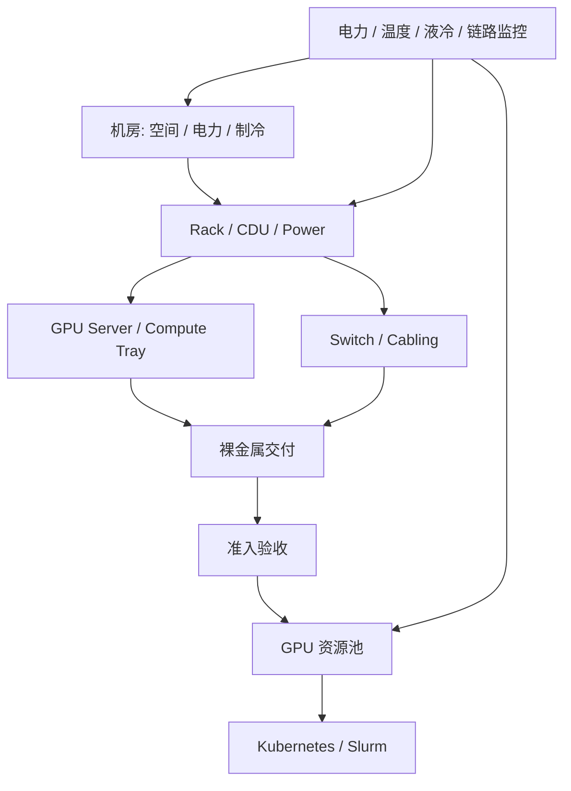

# 第 36 章：AI 数据中心工程

## 本章回答的问题

- AI 数据中心为什么不是传统机房简单增加 GPU 机柜？
- Rack、power、cooling、liquid cooling、PUE、cabling、故障域、交付验收和容量扩展如何影响 AI Factory？
- 物理基础设施如何与上层调度、可靠性和经济性连接？

## 一个真实场景

一批高密度 GPU 机柜计划上线，但机房电力容量只能分批交付，液冷管路还在调试，网络线缆标签与资产系统不一致。AI 平台团队已经准备接入 Kubernetes，训练团队已经排期压测。结果节点陆续可开机，却不能稳定进入生产池：有的机柜因供电限制不能满载，有的 rack 因冷却告警降频，有的节点因线缆接错导致 NCCL 性能异常。

AI 数据中心工程的目标，是让物理机房能力转化为可预测、可验收、可扩展的 AI Factory 产能。

## 核心概念

AI 数据中心工程覆盖机房空间、电力、制冷、网络布线、机柜、液冷、故障域、交付验收和容量扩展。它位于物理基础设施层，但影响上层的 GPU IaaS、调度、SRE 和 Token Factory 经济性。

传统云数据中心关注通用计算密度和资源池化。AI 数据中心需要承载更高功耗、更高散热密度、更强东西向网络、更复杂互联和更昂贵的单节点故障成本。

## 系统架构



物理基础设施必须向上提供状态：哪些资源可用、受限、维修中、降额运行或不应调度。

## 36.1 rack

Rack 是机柜，也是 AI Factory 重要的容量和故障域单位。一个 rack 通常包含 GPU 服务器、交换机、电源分配、线缆和冷却部件。高密度 GPU rack 的功耗和散热要求远高于普通服务器 rack。

调度上，rack 信息可用于拓扑感知。小规模训练可以优先同 rack，减少跨 rack 网络；高可用推理服务则可能反过来需要跨 rack 分散，避免单 rack 故障影响所有 replica。

资产系统应记录 rack 位置、供电路径、冷却域、交换机连接、服务器槽位和故障状态。没有准确 rack 信息，就无法建立可靠的拓扑调度和故障分析。

## 36.2 power

Power 是 AI 数据中心最关键的约束之一。GPU 服务器功耗高，训练和推理负载会产生持续高功率或周期性峰值。机房、机柜、PDU、电源模块和服务器内部都可能成为限制。

容量规划时不能只看装机 GPU 数量，还要看可用电力、冗余策略、峰值功耗、降额运行和扩容节奏。一个机柜物理上能放下更多服务器，不代表电力允许全部满载。

电力问题在上层可能表现为 GPU 降频、节点重启、机柜批量告警或性能下降。SRE 系统应把功耗和电力域纳入告警与故障域分析。

## 36.3 cooling

Cooling 是制冷能力。GPU 高密度部署会带来高热流密度，如果冷却不足，硬件会降频、报错或停机。冷却不稳定会让同型号 GPU 在不同机柜表现不同。

风冷系统关注风道、温湿度、冷热通道和机柜布局。高密度系统可能需要液冷或混合冷却。无论哪种方式，冷却指标都应进入验收与运行监控。

平台需要知道哪些节点处于热风险状态。热告警节点不应继续接收长时间满载训练任务，除非明确降额策略和风险。

## 36.4 liquid cooling

Liquid cooling 用液体带走热量，适合高密度 GPU 系统。它可能涉及 CDU、冷板、快接头、管路、漏液检测、供回水温度、流量和维护流程。

液冷不是简单替代风扇。它引入新的工程边界：机房水系统、设备兼容、维护安全、传感器、备件和故障隔离。液冷异常可能影响整柜或整排，而不只是单台服务器。

上线液冷系统时，需要把液冷状态接入资源池。流量不足、温度异常或漏液告警应能触发节点 drain、隔离或降额。

## 36.5 PUE

PUE 是 Power Usage Effectiveness，用于衡量数据中心总能耗与 IT 设备能耗的比例。AI Factory 的经济性不仅取决于 GPU 采购，也取决于电力和制冷效率。

PUE 不能直接告诉你模型是否赚钱，但它会影响 cost per token 和 tokens/W。高 PUE 意味着同样 IT 负载需要更多总电力成本。对于大规模推理服务，长期能源成本会显著影响毛利。

使用 PUE 时要注意边界和时间维度。不同机房、季节和负载状态下 PUE 可能不同。经济模型应使用可追溯的能耗数据，而不是静态口号。

## 36.6 cabling

Cabling 是线缆工程，包括网络线缆、光模块、电源线、管理网和液冷相关连接。AI 网络对线缆质量和拓扑一致性高度敏感。一个端口接错或标签错误，可能导致 NCCL 性能异常。

线缆问题常见于扩容和维修后：端口映射不一致、光模块不兼容、弯折损耗、标签错误、rail 接反、管理网和业务网混淆。它们往往不是立即断网，而是在压力下表现为丢包或带宽下降。

工程上要把 cabling 纳入资产和准入。交换机端口、服务器 NIC、rack、rail 和拓扑标签必须一致，并能自动校验。

## 36.7 故障域

故障域是一次故障可能共同影响的资源范围。AI 数据中心常见故障域包括服务器、compute tray、rack、机柜电源、交换机、spine、冷却域、机房区域和存储集群。

训练任务通常希望通信资源靠近，但靠得越近，越可能落在同一故障域。推理服务通常希望 replica 分散，避免单故障域影响可用性。调度系统要能表达这两类相反需求。

故障域信息不应只存在于机房图纸里。它要进入 Kubernetes label、Slurm topology、资源池、告警和容量系统。

## 36.8 交付验收

交付验收把机房建设结果转化为可用资源。它包括电力、制冷、服务器、网络、存储、BMC、操作系统、驱动、NCCL、RDMA、GPU burn-in 和真实 workload 压测。

交付验收要按批次记录。不同批次的服务器、线缆、交换机版本、驱动和机房条件可能不同。没有批次维度，后续问题很难关联。

验收通过前，资源不应进入生产池。验收失败要有隔离、维修、复测和回归流程。

## 36.9 容量扩展

容量扩展不是简单增加 GPU。它涉及机房电力、制冷、网络端口、存储吞吐、镜像仓库、调度队列、监控容量、运维人力和成本模型。

扩容应采用分阶段交付：先资产入库，再物理安装，再网络和 BMC 连通，再 OS 和驱动，再准入测试，最后进入资源池。每一步都要可回滚和可追踪。

扩容还会改变系统行为。更多训练任务会增加网络拥塞，更多推理副本会增加模型权重拉取压力，更多 checkpoint 会增加存储峰值。容量规划必须端到端看。

## 工程实现

机房到资源池的交付状态示例：

```yaml
delivery_batch:
  batch_id: dc-a-rack-12-2026-06
  facility:
    power_ready: true
    cooling_ready: true
    cabling_verified: true
  hardware:
    servers_installed: 16
    bmc_reachable: true
  network:
    fabric_validated: true
    rail_mapping_checked: true
  acceptance:
    gpu_burn_in: pass
    nccl: pass
    storage: pass
  pool_state: ready_for_allocation
```

这类状态应被容量系统、资源池和 SRE 看板共享。

## 常见故障

- 电力容量不足，GPU 高负载时节点降频或重启。
- 冷却异常导致同一 rack 内多节点温度升高。
- 线缆或 rail 映射错误，NCCL 跨节点性能差。
- 资产系统与真实机柜位置不一致，故障域分析错误。
- 扩容只验收单节点，没有验证多机架网络和存储压力。

## 性能指标

- IT power、rack power、PDU 状态、PSU 告警。
- 进出风温度、液冷供回水温度、流量、漏液告警。
- Rack 级 GPU 利用率、降频次数、热告警次数。
- 端口错误、链路状态、线缆映射一致性。
- 交付周期、验收通过率、返修率和回池时间。

## 设计取舍

高密度部署提高单位空间产能，但增加电力、制冷和故障域压力。更严格验收会延长交付周期，但能减少生产事故。更细的故障域标签提升调度质量，但需要更强资产治理。

AI 数据中心工程的目标不是最快把机器点亮，而是稳定地把产能交付给 AI Factory。

## 小结

- AI 数据中心工程连接机房能力与上层 AI 产能。
- 电力、制冷、线缆和故障域会直接影响训练推理稳定性。
- 交付验收必须覆盖物理、网络、存储、驱动和真实 workload。
- 扩容要端到端评估，避免局部容量增加造成新瓶颈。

## 延伸阅读

- TODO: 数据中心电力与制冷工程资料
- TODO: GPU 机柜交付验收资料
- TODO: AI 数据中心扩容案例
