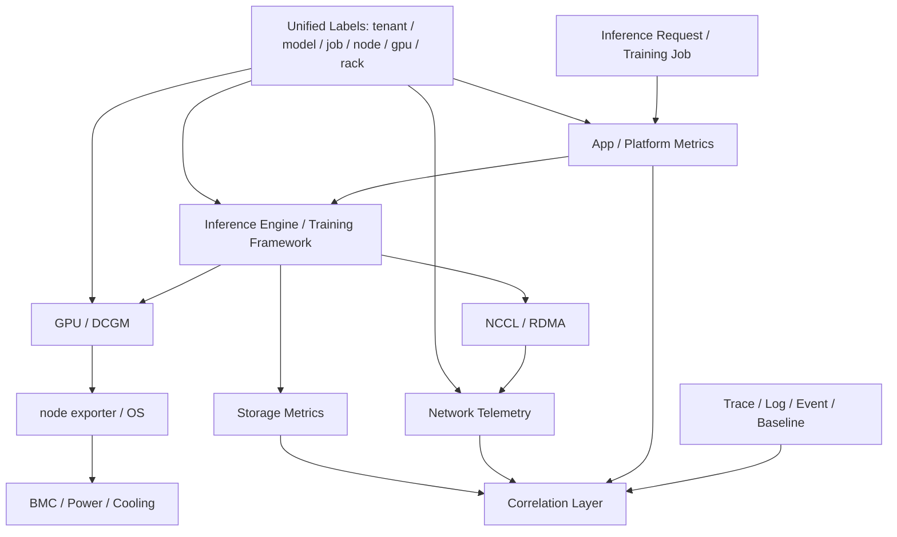
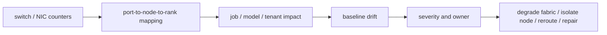
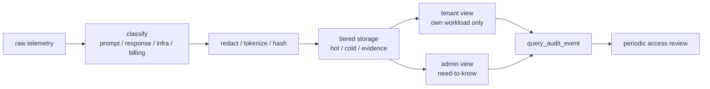
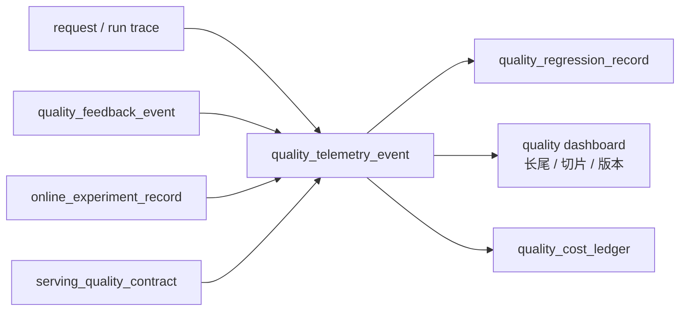

# 第 37 章：AI Factory 可观测性

## 本章回答的问题

- AI Factory 的可观测性为什么必须跨越应用、模型、运行时、调度、GPU、网络、存储和机房？
- GPU metrics、DCGM、node exporter、NCCL metrics、inference metrics、training metrics、storage metrics、network telemetry 和 distributed tracing 如何组合？
- 如何让一次推理请求或训练任务的问题可定位、可归因、可复盘？

## 一个真实场景

一个在线推理服务在晚高峰 TTFT 突然升高。应用日志显示请求已经进入服务，网关指标显示没有触发限流，推理引擎指标显示 prefill queue 变长，GPU 指标显示 HBM 接近水位，存储指标显示新 replica 拉取模型权重很慢，网络指标显示对象存储路径在同一时间出现短时拥塞。每个团队都能证明“自己这里没有完全故障”，但用户看到的是首 token 明显变慢。

另一个训练场景也类似。一个 512 卡任务 step time 周期性抖动，训练日志只显示通信阶段变长，NCCL 日志里有少量重试，网络端口计数在某个 rack 有 ECN mark，存储指标显示 checkpoint 周期有写入尖峰，GPU 指标显示少数 rank 间歇性 idle。若没有统一标签和时间线，团队很难判断是网络、存储、rank skew、checkpoint 还是坏节点导致的系统结果。

AI Factory 的可观测性目标，不是把所有指标堆进 Prometheus，而是把 token、request、tenant、model、job、rank、node、GPU、NIC、storage path、rack 和 power/cooling domain 串成同一条证据链。一次推理请求为什么慢，一个训练任务为什么卡，一个 GPU 小时为什么没有产出 token，都应能被追溯。

因此，可观测性系统要从“看板中心”升级为“决策系统”。它要能告诉网关是否限流，调度器是否避开 degraded 节点，资源池是否隔离坏卡，SRE 是否升级 incident，容量团队是否扩容，财务系统如何归因成本。若观测数据不能驱动动作，就只是事故后的截图材料。

这个场景还提示我们，AI Factory 的事故通常不是单点故障，而是多条路径同时接近边界。模型权重冷加载、HBM 水位、prefill 排队和网络拥塞叠加，才形成用户可见延迟。可观测性必须能表达“叠加效应”，否则团队只会分别证明自己的单点指标没有越界。

## 核心概念

可观测性是让系统状态可解释的能力，包括 metrics、logs、traces、events、profiles、baselines 和 topology metadata。普通云原生系统常看 CPU、memory、QPS、latency 和 error rate；AI Factory 还必须看 token 指标、prefill/decode、KV Cache、GPU utilization、HBM、NCCL、RDMA、checkpoint、data loader、网络拓扑、存储路径和准入基线偏离。

AI Factory 的关键对象比传统服务更多。推理链路有 request、tenant、API key、model、endpoint、replica、batch、token、KV Cache 和 billing record；训练链路有 job、queue、quota、rank、pod、node、GPU、NIC、checkpoint、dataset 和 model artifact；基础设施链路有 rack、rail、switch port、storage client、BMC、power domain 和 cooling domain。没有统一对象模型，指标之间无法关联。

可观测性还要区分症状、原因和影响。TTFT 升高是用户症状，prefill queue 变长是服务内部状态，HBM 水位或权重冷加载可能是原因，受影响 token 数和租户数是影响面。训练 step time 变长是症状，communication time 上升是阶段信息，RDMA 重传或 checkpoint 干扰可能是原因，浪费的 GPU 小时是影响。

工程上，可观测性不是 SRE 的独立系统，而是 AI Factory 的公共事实层。调度、计费、准入、故障诊断、容量规划和成本优化都依赖它。没有统一标签和基线，团队只能在事故中临时拼日志；有了统一事实层，问题会从“谁负责”转向“证据显示什么”。

这个事实层必须同时支持实时和离线。实时路径用于告警和自动化恢复，离线路径用于复盘、容量建模和成本分析。很多问题不是事故瞬间能看清的，例如某批节点长期 tokens/W 偏低，某个模型版本逐步提高 HBM 水位，某个租户持续制造长尾。离线分析能发现这些慢变量。

从组织角度看，可观测性还定义了协作方式。模型团队、平台团队、网络团队、存储团队和设施团队都应围绕同一组实体和时间线讨论问题。若每个团队都有自己的对象命名和时间口径，事故复盘就会变成数据对齐会议。

## 系统架构

AI Factory 可观测性架构可以分为采集层、关联层、分析层和行动层。采集层包括 application log、gateway metrics、inference engine metrics、training framework metrics、DCGM、node exporter、NCCL logs、RDMA counters、storage metrics、network telemetry、BMC/facility metrics 和 traces。关联层用统一标签把这些数据绑定到 tenant、model、job、node、GPU、rack 和 topology domain。分析层做告警、dashboard、异常检测、容量分析和成本归因。行动层驱动限流、扩容、隔离、维修、回滚和容量决策。

架构的难点不是接入某个 exporter，而是统一时间线和标签。推理请求的 trace 要能连接 gateway、auth、routing、model server、prefill、decode、streaming、metering 和 billing；训练任务的事件线要能连接提交、排队、调度、镜像拉取、数据加载、NCCL init、forward/backward、checkpoint 和失败重试；基础设施事件要能连接 node、GPU、NIC、switch、storage 和 rack。

还要把 baseline 纳入架构。准入测试中的 NCCL、RDMA、nvbandwidth、GPU burn-in、storage benchmark 和 network benchmark，不应只作为交付报告存档，而应成为运行时异常检测的比较对象。节点当前性能和同批次基线偏离，往往比单个绝对阈值更有诊断价值。

可观测性架构还需要数据保留策略。高频 GPU、网络和 trace 明细成本很高，不可能无限保存；但 incident 相关数据、准入基线、发布版本和关键任务时间线必须长期可追溯。常见做法是热数据短期高精度保存，冷数据聚合归档，关键事件和诊断包单独保留。没有保留策略，事故后常常发现最有价值的数据已经过期。

架构还应支持从结果反查原因。用户给出 request id，应能查到模型、replica、GPU、KV Cache、网关和计费；训练用户给出 job id，应能查到 rank、节点、NCCL、存储和调度事件。这种反查路径是可观测性是否可用的基本验收。

最后，架构要允许不同数据系统协同。时序库适合指标，日志系统适合文本和事件，对象存储适合诊断包，trace backend 适合调用链，数据仓库适合成本和容量分析。不要强迫所有观测数据进入同一种系统，而要统一身份、时间和关联键。



## 37.1 GPU metrics

GPU metrics 包括 utilization、SM busy、HBM 使用量、HBM bandwidth、功耗、温度、频率、throttle reason、ECC、Xid、retired page、NVLink error、PCIe error、进程占用、MIG 状态和 GPU UUID。这些指标帮助判断 GPU 是计算忙、显存满、通信等待、热降频、硬件异常还是资源碎片。它们是 AI Factory 最核心的硬件信号之一。

GPU utilization 高不一定代表效率高。推理服务可能 HBM 接近瓶颈但 SM 没有跑满；训练任务可能在通信阶段周期性 idle；数据加载慢会让 GPU 等待；某些低效 kernel 会让 GPU busy 但 tokens/s 不高。GPU 指标必须和 workload 阶段一起解释，不能单独用 utilization 判断资源利用率。

工程上，GPU 指标必须带上 node、gpu_uuid、pod、container、job、tenant、model、rank、rack、driver、GPU 型号和拓扑域标签。没有这些标签，看到一张卡报 Xid 或 HBM 过高，也无法判断影响哪个任务、哪个租户、哪个模型和哪个故障域。GPU 指标的价值来自关联，而不只是采集。

GPU metrics 还应服务自动化。连续 ECC、Xid、NVLink error 或性能基线偏离，可以触发节点隔离、任务迁移、维修工单或降级资源状态。若指标只停留在看板上，硬件问题会反复进入生产任务。成熟平台会把 GPU 健康状态纳入调度门禁。

GPU 指标也要避免误报。短时 utilization 下降可能是正常 checkpoint，温度升高可能是预期满载，HBM 高水位可能是长上下文服务正常状态。告警规则需要结合任务阶段、模型类型和资源等级。高优训练池和低优批量池的阈值不应完全相同。

GPU metrics 的一个好用实践是建立同组对比。同型号、同 rack、同驱动、同 workload 下的 GPU 如果长期偏离同组，往往比绝对阈值更早暴露问题。AI 集群规模越大，基线偏离越有价值。

## 37.2 DCGM

DCGM 是 NVIDIA Data Center GPU Manager，用于 GPU 监控、诊断和健康管理。它常通过 DCGM exporter 把 GPU 指标暴露给 Prometheus 等系统，也可用于诊断和健康检查。DCGM 的价值在于提供相对标准化的 GPU 设备信号，让平台不必从零解析每个底层工具输出。

DCGM 常用于采集温度、功耗、显存、利用率、ECC、Xid、NVLink、PCIe、进程和部分 profiling 相关指标。它适合支撑节点健康、GPU dashboard、告警规则和运行时监控。对 AI Factory 来说，DCGM 是 GPU 观测的基础组件，但不是完整可观测性系统。它解释设备状态，不能单独解释业务结果。

使用 DCGM 时要关注版本和字段兼容。不同 GPU 架构、driver、DCGM 版本和 MIG 配置可能支持不同指标，字段语义也可能随版本变化。平台应定义受支持指标集合、版本基线和告警规则，而不是随意展示所有字段。否则升级后看板可能出现指标缺失或误报。

DCGM 数据还要与准入和故障处理结合。准入时记录 GPU 基线，运行时持续比较；出现 Xid、ECC 或温度异常时，关联任务、节点、驱动版本和 BMC 事件；维修后重新验证。DCGM 最有价值的用法，是把设备信号变成资源生命周期状态。

DCGM 也需要和其它信号互证。Xid 可能说明 GPU 或驱动问题，但训练失败还可能同时受电源、温度、PCIe 或应用错误影响。平台不应看到一个 DCGM 告警就直接给出单一结论，而应把 DCGM 与 kernel log、BMC、driver version、job timeline 和准入基线一起呈现。

在多租户场景中，DCGM 指标还要处理可见性边界。租户可以看到自己任务相关的 GPU 健康摘要，但不一定能看到其它租户进程和完整节点信息。平台需要在诊断能力和隔离要求之间做权限设计。

## 37.3 node exporter

Node exporter 提供主机层指标，如 CPU、内存、磁盘、网络、文件系统、load、process、NUMA、系统时间和内核状态。AI workload 虽然以 GPU 为核心，但主机层异常仍会影响训练推理。许多“GPU 不满”的问题，根因并不在 GPU，而在 CPU、I/O、网络中断、文件系统或系统配置。

数据加载依赖 CPU、内存和本地磁盘；tokenizer 和推理请求处理依赖 CPU；RDMA 依赖 NIC、内核、驱动和权限；容器依赖 cgroup、mount、overlay 和镜像文件系统；日志和监控 agent 也会消耗主机资源。忽略 node exporter，会让排障只剩 GPU 视角，无法解释数据路径和控制路径问题。

Node 指标应与 GPU 指标联动。例如 GPU idle 同时 CPU data loader 高，可能是数据预处理瓶颈；GPU idle 同时网络重传高，可能是通信瓶颈；GPU 忙但 tokens/s 低，同时 CPU 中断集中，可能是 NIC 绑定或网络路径问题。跨指标关联比单指标告警更重要。

工程上，主机指标要有 node、rack、kernel、driver、container runtime、image、job 和 tenant 标签。节点层指标还应进入准入和维修闭环：磁盘满、时钟漂移、文件系统错误、网卡错误和 CPU 过载，都可能使节点暂时不适合调度高优 AI workload。

Node exporter 还可以发现平台自身的问题。例如日志采集占满磁盘、监控 agent 消耗 CPU、镜像拉取导致 IO 饱和、系统时间不同步导致 trace 错乱。这些不是模型问题，却会表现为训练失败或推理抖动。主机层观测是 AI 平台自我诊断的基础。

Node 层指标还适合做前置门禁。磁盘水位过高、系统时间漂移、关键文件系统只读、内核错误增长或容器运行时异常时，节点应进入不可调度或 degraded 状态。不要等 GPU 任务失败后再发现主机层已不健康。

## 37.4 NCCL metrics

NCCL metrics 用于观察分布式通信状态。现实中 NCCL 不总是直接提供完整指标，工程团队常结合 NCCL 日志、训练框架 profiling、network counters、RDMA counters、NCCL test 基线和作业时间线来推断通信问题。对大规模训练来说，NCCL 观测是判断 GPU 是否被通信拖住的关键。

关键观察对象包括 AllReduce、AllGather、ReduceScatter、Broadcast、AllToAll 等 collective 耗时，通信带宽，rank 等待，超时，重试，hang，接口选择，NCCL version，环境变量，拓扑文件和 GPU/NIC 映射。训练 step time 变长时，必须能拆出 compute time、communication time、data loading time 和 checkpoint time。

NCCL 相关观测必须带有 rank、node、GPU、NIC、rail、rack、job、模型并行策略和消息大小维度。只知道“某任务慢”无法定位是某个 rank、某个 rail、某个 rack 还是整个 fabric。大规模训练的慢，往往是少数 rank 的局部异常被同步机制放大。

工程上，应把 NCCL test 基线与真实训练指标放在一起。NCCL test 能验证通信栈和 fabric，真实训练能反映模型、数据、checkpoint 和框架组合。两者都慢，多半是通信路径；测试正常而训练慢，则要看并行策略、rank skew、数据和 checkpoint。NCCL 观测的价值在于缩小搜索空间。

NCCL 观测还要服务 hang 诊断。Hang 的难点是缺少明确错误码，任务只是长时间不前进。平台应在超时前后自动采集 rank 堆栈、NCCL 日志、RDMA counters、端口计数和 GPU 状态。没有自动采集，用户通常会手工 kill 任务，最关键的现场随之消失。

NCCL metrics 也应和调度结果绑定。任务跨了哪些 rack、用了哪些 rail、是否满足 topology-aware placement，都会影响通信表现。没有调度上下文，就无法判断 NCCL 慢是网络退化，还是任务本来就被放在较差拓扑上。

对关键训练池，还应保留标准 NCCL 回归任务。生产怀疑网络退化时，可以快速在同一资源域运行回归，判断问题是否可复现。没有标准回归任务，团队只能依赖正在失败的业务任务排障。

## 37.5 inference metrics

Inference metrics 是推理服务指标，核心包括 QPS、并发、TTFT、TPOT、TPOP、E2E latency、prefill queue、decode throughput、batch size、KV Cache 使用、tokens/s、input/output token、错误率、超时、限流、fallback、模型路由和 replica 状态。它们把用户体验、token 产出和资源消耗连接起来。

推理指标必须按 model、model version、tenant、endpoint、API key、region、replica、node 和 GPU 维度切分。一个模型慢不代表整个平台慢，一个租户慢可能是上下文过长或限流策略，一个 replica 慢可能是节点、缓存或权重加载问题。没有切分维度，平均延迟会掩盖真实问题。

TTFT 和 TPOT 要分开解释。TTFT 高可能来自 gateway 排队、认证、路由、prefill、权重冷启动、KV Cache 初始化或模型加载；TPOT 高可能来自 decode kernel、batching、HBM bandwidth、KV Cache、GPU 热降频或 streaming backpressure。把所有延迟合成一个 E2E latency，会让优化方向不清楚。

推理可观测性还要服务计费和容量规划。tokens/s、tokens/W、cost per token、cache hit ratio、batch efficiency 和 failed token 都应可计算。用户体验指标和资源效率指标要同时存在，否则平台可能通过牺牲体验换吞吐，或通过过度保守配置浪费 GPU。

推理指标还应识别请求形态。短 prompt、长 prompt、长输出、工具调用、多模态输入和 streaming 中断，对系统压力完全不同。把这些请求混成平均值，会让模型服务看似稳定，实际某类用户体验很差。请求画像是容量规划和限流策略的输入。

推理指标还需要区分冷启动和稳态。新 replica 拉取权重、加载 tokenizer、构建 cache 和预热 kernel 时的延迟，不应和长期稳态混为一谈。扩容慢和模型本身慢是两类问题，需要不同指标解释。

推理指标还应连接用户可见错误。超时、截断、fallback、拒绝、stream 中断和计费失败，都会影响产品体验。仅有 latency 和 throughput，不足以描述推理服务质量。

推理运行时观测应把 endpoint、engine、KV block 和 canary 绑定在一起。一个 `inference_runtime_telemetry_event` 可以作为 Gateway、Model Serving、Runtime 和 Token Factory 的共同事实：Gateway 用它判断可路由健康，SRE 用它定位 TTFT/TPOT，成本系统用它计算无效 KV 占用和取消浪费，发布系统用它判断 engine canary 是否继续。

```yaml
inference_runtime_telemetry_event:
  event_id: inf-rt-20260620-001
  request_id: req-20260620-001
  endpoint: af-chat-large-prod
  serving_release: af-chat-large-20260619-r3
  engine_profile: vllm-prod-h100-v7
  runtime_objects:
    engine_admission_health: eah-af-chat-large-prod
    kv_block_ledger: kvbl-req-20260620-001
    engine_canary_record: engine-canary-20260620-001
  phases:
    queue_ms: measured
    prefill_ms: measured
    decode_ms: measured
    streaming_gap_ms: measured
  resource:
    active_sequences: measured
    kv_block_pressure: measured
    prefix_cache_hit: true_or_false
    gpu_uuid: measured
  outcome:
    close_reason: stop_or_cancel_or_error
    generated_tokens: measured
    delivered_tokens: measured
```

这个事件的价值是避免指标割裂。没有它，Gateway 只能看到 upstream latency，Model Serving 只能看到 endpoint 指标，Runtime 只能看到 KV 和 batch，账单只看到 token。绑定后，一个请求的 TTFT 变慢可以一路追到 queue、prefill、cache miss、engine canary 或权重冷启动；一个 TPOT 变慢可以追到 decode active sequence、KV block 压力或 engine profile 变化。

## 37.6 training metrics

Training metrics 包括 step time、samples/s、tokens/s、loss、learning rate、gradient norm、data loading time、compute time、communication time、checkpoint time、GPU utilization、GPU idle、OOM、retry、failure reason 和恢复耗时。它们同时服务模型质量、训练效率和基础设施诊断。

训练可观测性必须把模型曲线和系统曲线放在一起。Loss spike 可能来自数据、学习率、混合精度、随机性、代码变更或硬件错误；step time spike 可能来自网络、存储、checkpoint、调度抢占、坏节点或某个 rank 慢。只看 loss 不够，只看 GPU 利用率也不够。训练是模型系统和基础设施的共同结果。

平台应把训练指标与作业生命周期事件结合：提交、排队、配额、gang scheduling、Pod 启动、镜像拉取、数据预热、NCCL init、checkpoint、抢占、重启、恢复和失败。任务失败时，用户需要看到失败发生在准备阶段、通信初始化、训练中、checkpoint 还是恢复阶段。

训练指标还应支持成本归因。一个任务消耗了多少 GPU 小时，多少时间在有效训练，多少时间在排队、重启、等待数据、等待通信或写 checkpoint，应能被计算。训练平台的效率不是只看任务是否完成，而是看 GPU 小时转化为模型进展的比例。

训练指标还要服务模型复现。关键训练任务应保存配置、代码版本、数据版本、checkpoint、随机种子、硬件池和失败恢复事件。质量问题和基础设施问题常常交织在一起，只有把模型元数据和系统指标放在同一时间线中，才能做可信复盘。

训练指标还应体现队列和资源治理。排队时间、配额等待、gang scheduling 等待、抢占次数和恢复成功率，都是训练体验的一部分。只看运行后的 step time，会忽略资源编排层对训练效率的影响。

训练观测还要能比较实验。不同模型版本、数据版本和并行策略的 step time、loss 和成本变化，应能在同一口径下对比。否则调优只能依赖局部日志。

训练观测应沉淀为 `training_lifecycle_telemetry_event`。它把调度事件、rank placement、first effective step、checkpoint、抢占、恢复和成本口径绑定起来。这样一次训练慢、失败或成本异常时，SRE 不需要分别查询队列系统、Kubernetes/Slurm、训练日志、NCCL 日志、存储系统和成本仓库。

```yaml
training_lifecycle_telemetry_event:
  event_id: train-tel-20260620-001
  training_job: exp-20260619-001
  scheduler: kubernetes_or_slurm
  lifecycle:
    phase: running_or_checkpointing_or_recovering
    training_lifecycle_event: tle-20260620-001
    job_admission_event: jae-exp-20260619-001
    placement_commit_record: pcr-exp-20260619-001
  topology:
    rank_mapping: rank-mapping-exp-20260619-001
    rail_balance_report: optional
    fabric_baseline: baseline-id
  progress:
    global_step: measured
    effective_tokens: measured
    first_effective_step_at: recorded
  checkpoint:
    latest_valid: ckpt-step-120000
    checkpoint_commit_record: optional
  accounting:
    allocated_gpu_seconds: measured
    effective_training_gpu_seconds: measured
    wasted_gpu_seconds: calculated
```

这个事件让训练可观测性从“曲线集合”变成“生命周期事实”。如果 allocated GPU seconds 增长但 effective training GPU seconds 不增长，问题在启动、rendezvous、数据、checkpoint 或恢复；如果 rank mapping 改变后 step time 变差，问题可能是放置降级；如果 checkpoint commit 变慢，问题可以追到存储证据。训练观测的核心不是多画几张图，而是让每个 GPU 小时的状态可解释。

## 37.7 storage metrics

Storage metrics 覆盖对象存储、并行文件系统、本地 NVMe、cache、model registry 和日志系统。指标包括吞吐、IOPS、P50/P95/P99 延迟、metadata ops、错误率、限流、cache hit ratio、容量、水位、checkpoint 耗时、恢复耗时、模型权重加载时间和对象请求量。AI 存储观测要按访问模式区分，而不是只看总带宽。

存储问题常表现为 GPU 空闲、训练 step time 周期性尖刺、推理 cold start 慢、模型发布慢或批量评测排队。单看存储集群总吞吐很容易误判，因为瓶颈可能在单目录元数据、单客户端限速、某个租户请求、某个 path、某个 rack 缓存未命中或某个 checkpoint 写入模式。标签决定诊断能力。

Checkpoint 和模型权重加载应作为一等观测对象。Checkpoint 影响训练恢复和抢占成本，权重加载影响推理扩容和故障恢复。平台应记录 checkpoint size、写入耗时、manifest 完整性、恢复耗时、权重 cache hit、model loading time 和 registry latency。它们不是普通文件操作，而是 AI Factory 关键路径。

工程上，storage metrics 要带 tenant、job、model、dataset、path、client node、rack 和 storage backend 标签。出现存储尖峰时，要能回答谁在读写、读写什么、影响哪些 GPU、是否与训练通信重叠、是否触发限流。存储观测的目标，是解释 GPU 为什么在等。

存储指标还要与生命周期管理结合。过期 checkpoint、孤儿缓存、无引用模型 artifact 和异常增长目录，不一定触发性能故障，却会持续增加成本。可观测性应支持容量清理和成本治理，而不只是事故排障。

存储观测还应保留路径语义。相同吞吐在 dataset path、checkpoint path、model artifact path 和 log path 上含义不同。把所有 I/O 混在一起，会让团队无法判断应该优化数据格式、checkpoint 策略、缓存，还是存储后端。

存储观测应补充 `storage_evidence`，把 path 语义、manifest、client、cache 和 workload 影响绑定到一起：

```yaml
storage_evidence:
  evidence_id: required
  workload_id: required
  workload_type: training_inference_evaluation_data_processing
  path_kind: dataset_checkpoint_artifact_cache
  manifest_id: required
  storage_intent_id: required
  client:
    node: required
    pod_or_rank_or_replica: required
    rack: recommended
  storage_backend: required
  cache_state:
    local_nvme: hit_miss_bypass
    rack_cache: hit_miss_bypass
    residency_state: recorded_if_artifact
  telemetry_window: required
  correlated_metrics:
    - data_loader_wait
    - checkpoint_duration
    - checkpoint_commit_record
    - model_load_time
    - metadata_ops
    - storage_throttle
    - cache_eviction
    - backend_error_rate
    - network_overlap
  impact:
    gpu_idle_seconds: calculated
    ttft_delta: calculated_for_serving
    wasted_gpu_hours: calculated_for_training
    affected_tenants: recorded
```

这个字段能把“存储延迟升高”转换成“训练任务在 checkpoint 阶段浪费了多少 GPU 小时”或“推理 endpoint 因权重 cache miss 增加了多少 ready 时间”。它让存储指标直接进入 SRE、容量和经济性分析。

`storage_evidence` 的关键是关联键，而不是指标数量。`storage_intent_id` 说明 workload 原本声明需要什么路径，manifest 说明实际访问对象，client 说明哪个 rank、replica 或节点发起访问，cache state 说明热路径是否命中，impact 说明用户或 GPU 受到什么影响。只要这几个键稳定，时序库、日志、对象存储、模型 registry 和成本仓库就可以协同。

## 37.8 network telemetry

Network telemetry 包括端口吞吐、丢包、错误包、ECN mark、PFC pause、RDMA error、重传、链路状态、光模块状态、队列、buffer、水位、flow 信息和路由事件。AI 网络承载训练通信、推理入口、模型权重加载、checkpoint、对象存储访问和控制面，任何一类流量异常都可能影响 token 或训练 step。

AI 网络排障需要把 telemetry 与 job topology 关联。某个训练任务慢时，应能看到它使用了哪些节点、NIC、leaf、spine、rail、rack 和 storage path，并能关联端口计数变化。某个推理服务慢时，应能看到 gateway、load balancer、replica、node、权重加载和客户端连接状态。没有拓扑关联，网络指标只能说明设备状态，不能说明 workload 影响。

时间粒度非常重要。许多拥塞是短时突发，分钟级平均值会掩盖问题。Checkpoint 写入、模型权重拉取、AllReduce、批量推理和突发流量可能只持续几十秒，却足以制造长尾延迟。关键训练 fabric 和推理入口应保留足够细粒度的 counters、事件和采样。

Network telemetry 还要进入容量和变更管理。新增 rack、交换机升级、RoCE 参数调整、rail 变更或 CNI 升级后，都应比较基线。网络不是只在断网时才可观测，而是持续影响 tokens/s、step time 和 GPU idle 的生产系统。

网络指标还需要和流量类别绑定。训练 collective、checkpoint、模型权重加载、对象存储访问和推理入口应尽量区分。否则看到链路拥塞时，团队不知道该调整调度、存储、模型发布还是网络容量。流量分类是网络观测从设备层走向 workload 层的关键。

网络 telemetry 也需要现场保留策略。端口计数清零、交换机日志轮转、任务结束和容器销毁都会丢失证据。关键网络异常发生时，应自动冻结相关端口、节点、rank 和 job 的诊断数据，便于后续复盘。

网络观测还应明确从“设备事件”到“业务影响”的转换规则。交换机端口错误本身不是 incident，只有当它影响某个 job、模型、租户或资源池等级时，才成为生产事件；反过来，训练 step time 上升也不必然是网络问题，只有当 rank placement、端口计数和 baseline 同时支持时，才能归入网络域。这个转换规则应写入告警和诊断系统。



这样做可以避免两类极端：网络团队每天处理大量无业务影响的端口噪音，或业务团队在任务变慢时无法拿到网络层证据。可观测性应该减少争论，而不是制造更多告警。

观测系统应把网络 telemetry 归并为结构化事件。原始 counters 太多，直接暴露给调度器和 SRE 会制造噪音；完全不暴露又会让网络退化无法驱动动作。一个折中做法是生成 `congestion_event_record` 和 `rail_balance_report`，再把它们写入 resource health 和 incident：

```yaml
network_telemetry_event:
  event_id: net-telemetry-20260620-009
  source:
    fabric: train-fabric-a
    switch_port: leaf12-eth1/17
    rail: rail1
  raw_signals:
    ecn_mark: increased
    pfc_pause: increased
    rdma_retransmit: increased
    port_utilization: high
  correlation:
    network_path_evidence: net-path-042
    affected_jobs: [train-042]
    affected_ranks: [17, 49, 81]
    rail_balance_report: rail-balance-20260620-017
    fabric_baseline_id: train-fabric-a-20260619
  derived_events:
    congestion_event_record: net-cong-20260620-001
  resource_action:
    fabric_state: degraded_for_large_training
    scheduler_weight_delta: reduce
    evidence_retention: freeze_window
```

这类事件把设备级观测转化为平台可消费的事实。调度器不需要理解每个 PFC 计数，但需要知道某个 rail 对大训练 degraded；SRE 不需要手工拼端口和 rank，但需要看到哪些 job、哪些 rank、哪条 baseline 支持这个判断；成本系统不需要交换机细节，但需要 `gpu_idle_due_to_network_hours`。观测层的职责就是把这些视角连接起来。

## 37.9 distributed tracing

Distributed tracing 用于追踪请求经过的服务链路。在 AI Factory 中，推理请求 trace 应覆盖 gateway、auth、quota、routing、model selection、scheduler、model server、prefill、decode、streaming、metering、billing 和 observability export。只有这样，TTFT 或 E2E latency 上升时，才能定位慢在入口、平台、模型服务还是客户端输出。

训练任务也需要类似 trace 的事件时间线，尽管它不一定是传统 HTTP tracing。作业提交、排队、准入、资源分配、Pod 启动、镜像拉取、数据加载、NCCL init、forward/backward、checkpoint、评测、失败重试和恢复，都应形成可查询事件链。训练慢和训练失败，都需要时间线。

Trace 的关键是统一 request id、job id、tenant id、model id、model version、node、gpu_uuid 和 topology domain。没有这些关联字段，日志、指标和事件无法拼接。请求 trace 还应与 token 计量关联，训练 event trace 还应与 GPU 小时和 checkpoint 关联。这样 trace 才能服务成本和复盘。

Trace 也要控制成本和隐私。Prompt、response、用户数据和企业私有数据不应随意进入 trace；高频 token 事件也不能全部高成本采集。工程上应采用采样、脱敏、摘要、引用 ID 和分层保留策略。可观测性不能成为新的安全风险。

Trace 还要处理异步链路。推理请求可能触发后台 billing、日志落盘和缓存更新；训练任务可能异步上传 checkpoint 或评测结果。若 trace 只覆盖同步调用，很多延迟和失败不会被看到。AI Factory 的 trace 需要同时表达同步路径和后台事件。

Trace 的采样策略应按风险调整。普通成功请求可以低采样，错误、超时、长尾、高价值租户和新模型版本应提高采样。这样能控制成本，又能保留最值得分析的请求。

Trace 还应与发布事件关联。模型版本、网关策略、runtime 参数或镜像升级后，trace 分布的变化能帮助判断发布是否引入回归。没有发布上下文，trace 只能说明慢了，不能说明为什么开始慢。

观测系统必须有 `telemetry_data_classification`。AI Factory 的观测数据可能包含 prompt、response、tool payload、RAG 文档片段、API Key 前缀、用户 ID、GPU 进程、节点拓扑、账单明细和故障诊断包。它们的敏感级别不同，不能全部进入同一个日志系统，也不能全部对所有 SRE 可见。观测越强，越需要数据边界；否则可观测性会成为新的泄露面。



```yaml
telemetry_data_classification:
  prompt_body:
    class: sensitive_customer_data
    default_action: do_not_store_raw
    allowed_storage: redacted_reference
    retention: policy_defined
  response_body:
    class: sensitive_customer_data
    default_action: sampled_redacted
    access_roles: [tenant_owner, approved_sre]
  gpu_process_metrics:
    class: tenant_operational_metadata
    tenant_view: own_workload_summary
    admin_view: full_with_query_audit
  topology_mapping:
    class: infrastructure_sensitive
    tenant_view: health_summary_only
    admin_view: need_to_know
  billing_detail:
    class: financial_record
    retention: compliance_policy
    correction_requires_audit: true
```

租户可见观测视图要默认收敛。租户可以看到自己请求的 trace 摘要、延迟、错误、token、模型版本、资源等级和健康摘要，但不一定能看到同卡邻居、其它租户 Pod、完整 GPU UUID、rack、switch port 或平台内部路由策略。SRE 需要更完整视图，但每次查询敏感字段都应有 `query_audit_event`。这样既能支持排障，又能避免观测系统绕过租户边界。

质量观测需要 `quality_telemetry_event`。传统 observability 看到 5xx、latency 和 resource saturation，但 AI 应用经常“技术成功、业务失败”：HTTP 200，用户点踩；stream 完整，引用错误；工具调用成功，任务结果错；模型输出安全拒答，但其实误拒。质量 telemetry 把这些用户可见 outcome、模型行为和评测事实纳入同一事实层，使第 13 章的评测和第 40 章的 SRE 能消费线上质量信号。

```yaml
quality_telemetry_event:
  event_id: qte-20260619-0001
  trace_id: trace-abc
  request_or_run_id: req-123
  scope:
    tenant: enterprise-a
    application: support-chat
    model_version: af-chat-large-202606
    serving_quality_contract: sqc-af-chat-20260619-r3
    routing_quality_scorecard: rqs-20260619-support
  outcome:
    user_visible_status: completed
    task_slice: rag_citation
    finish_reason: stop
    fallback: false
  quality_signals:
    user_feedback: negative
    citation_check: failed
    tool_call_schema: not_applicable
    safety_decision: allowed
    human_handoff: true
  data_boundary:
    prompt_ref: object://redacted
    response_ref: object://redacted
    privacy_classification: internal_sensitive
```

质量 telemetry 的关键是关联键。它必须能连到 `quality_feedback_event`、`prompt_context_snapshot`、`eval_dataset_manifest`、`quality_regression_record`、`online_experiment_record` 和 `quality_cost_ledger`。如果这些对象各自用不同 id，质量闭环就会断裂。工程上可以把 `trace_id`、`request_id`、`run_id`、`serving_quality_contract`、`experiment_id` 和 `task_slice` 作为最小关联键集，并要求 Gateway、model server、Agent orchestrator 和 observability pipeline 共同写入。



质量 dashboard 不应只展示平均满意度。它应按 task slice、租户、模型版本、prompt 模板、RAG 索引、Agent 工具、Gateway 路由、experiment variant 和 release contract 切分，展示点踩率、人工接管率、重新生成率、引用失败率、工具失败率、误拒/漏拒、安全拦截、质量回归重开和低质量 token 成本。只有这样，团队才能判断质量问题是模型、RAG、Agent、Gateway 还是 runtime 引入的。

严重质量退化也应冻结证据，形成 `quality_evidence_bundle`。质量事故的现场比延迟事故更容易丢：用户点踩原因可能在前端，客服投诉在 CRM，RAG 检索证据在短期日志，Agent tool trace 在业务库，Gateway 路由 scorecard 会随配置变化。Bundle 应把这些证据在同一时间窗口冻结，供第 40 章的 quality incident 和第 41 章的 quality cost ledger 使用。

```yaml
quality_evidence_bundle:
  bundle_id: qeb-20260620-support-001
  trigger:
    source: quality_slo_alert_or_feedback_spike
    symptom: citation_failure_rate_increase
  scope:
    tenant: enterprise-a
    application: support-chat
    task_slice: rag_citation
    experiment_id: exp-support-model-20260619
  evidence_refs:
    quality_telemetry_events: sampled
    routing_quality_decision_records: sampled
    serving_quality_contract: sqc-af-chat-20260619-r3
    quality_gate_execution: qge-af-chat-20260620-001
    eval_dataset_lineage_record: edl-support-quality-20260620
    serving_rollback_record: optional
  impact:
    low_quality_tokens: estimated
    human_handoff_delta: measured
    complaints: measured
    quality_cost_estimate: calculated
```

这个 bundle 能把“用户说不好”变成可复盘的工程证据。SRE 可以判断是否要冻结 canary，评测团队可以把样本加入 regression，Gateway 团队可以检查路由是否误选小模型，模型服务团队可以检查 serving contract 是否和 gate execution 一致，商业团队可以看到低质量 token 的成本。质量观测不是满意度看板，而是质量控制面的输入。

## 工程实现

工程实现的第一步是统一标签规范。所有采集系统都应使用同一套实体标识：tenant、project、model、model_version、endpoint、job、rank、pod、node、gpu_uuid、nic、rack、rail、storage_path、power_domain 和 cooling_domain。标签不统一，后续 dashboard、告警、trace 和成本归因都会变成手工拼接。

第二步是设计分层告警。用户体验告警关注 TTFT、TPOT、错误率、训练失败和 SLA；资源健康告警关注 GPU、NIC、storage、node、power、cooling；容量告警关注排队、utilization、cache hit、存储水位；成本告警关注 cost per token、GPU idle 和异常 token 消耗。不同告警有不同 oncall，不应全部打给同一组人。

第三步是建立诊断包。推理诊断包包含 request trace、gateway log、model route、replica、GPU、KV Cache、batch、token 和 billing；训练诊断包包含 job timeline、rank placement、NCCL logs、GPU/DCGM、RDMA counters、storage path、checkpoint 和 scheduler events。诊断包能显著减少跨团队反复询问。

对推理运行时事故，诊断包还应直接包含第 39 章故障树需要的对象。否则 trace、Gateway 日志、Runtime 指标和成本账本仍然分散，oncall 只能手工对时间戳。一个可用的 `inference_runtime_diagnostic_bundle` 至少要绑定 `engine_admission_health`、`kv_block_ledger`、`engine_canary_record`、PD 分离合同、streaming 生命周期和计量事件。

```yaml
inference_runtime_diagnostic_bundle:
  incident_id: inc-20260620-ttft-001
  request_scope:
    tenants: [enterprise-a]
    endpoints: [af-chat-large-prod]
    request_buckets: [long_context_streaming]
    window: incident_window
  evidence:
    request_trace: required
    routing_decisions: required
    engine_admission_health: required
    kv_block_ledger_rollup: required
    engine_canary_record: required_if_recent_change
    pd_disaggregation_contract: required_if_enabled
    metering_events: request_admitted_first_token_usage_closed
  runtime_snapshot:
    prefill_queue: measured
    decode_active_sequences: measured
    kv_block_pressure: measured
    prefix_cache_hit_rate: measured
    streaming_gap_distribution: measured
  decision_support:
    likely_branch: gateway_prefill_decode_kv_canary_pd_or_client
    safe_actions: [route_away, freeze_canary, reduce_long_context_weight]
```

这类诊断包的关键是“事故触发时自动冻结”。推理请求生命周期很短，容器、stream 连接和临时 queue 状态很快消失；如果只在事后查询聚合指标，许多证据已经不可恢复。观测系统应在 TTFT、TPOT、streaming gap、canary guardrail 或 KV release latency 越界时，保存一个短窗口的细粒度证据，同时通过数据分级避免把原始 prompt 和 response 无限制扩散。

```yaml
observability_labels:
  tenant: required
  project: required
  model: required_for_inference
  model_version: required_for_inference
  job: required_for_training
  rank: required_for_distributed_training
  node: required
  gpu_uuid: required_for_gpu_metrics
  rack: required_for_infra_metrics
  topology_domain: recommended
```

对网络和通信故障，还应增加 `network_evidence` 字段，使观测系统能直接生成跨团队可读的结论：

```yaml
network_evidence:
  workload_id: required
  placement_snapshot: required
  rank_to_node_mapping: required_for_training
  replica_to_node_mapping: required_for_inference
  nic_to_switch_port_mapping: required
  rail_mapping: required_for_multi_rail
  fabric_baseline_id: required
  telemetry_window: required
  correlated_counters:
    - rdma_retransmit
    - port_error
    - ecn_mark
    - pfc_pause
    - link_flap
  conclusion:
    status: evidence_required
    confidence: low_medium_high
```

这个字段不要求所有系统使用同一个数据库，但要求它们使用同一组关联键。只要关联键稳定，时序库、日志系统、trace backend、对象存储诊断包和数据仓库就可以协同工作。

可靠性事件还应生成 `reliability_evidence`。它把用户可见症状、资源状态、准入基线、近期变更和故障域放到同一张证据表里：

```yaml
reliability_evidence:
  symptom:
    type: slo_violation
    metric: ttft_p99
    scope: model_endpoint
    affected_tenants: measured
  workload_context:
    requests_or_jobs: linked
    model_or_training_job: required
    resource_pool: required
  resource_context:
    health_records:
      - resource_health_record_id
    acceptance_baselines:
      - baseline_id
    fault_domains:
      - rack-12
      - power-a
      - rail-1
  change_context:
    recent_changes:
      - change_safety_case_id
    maintenance_windows:
      - maintenance_window_id
  impact:
    failed_requests: measured
    wasted_gpu_hours: calculated_if_training
    error_budget_burn: calculated
    estimated_cost: calculated
  recommended_action:
    immediate: rollback_or_isolate_or_reroute
    follow_up: retest_update_runbook_or_capacity
```

这个对象让可观测性从“指标查询”变成“事故证据”。SRE 不需要在事故中临时问谁升级了 driver、哪个 rack 在维护、哪些节点健康状态异常、是否偏离基线；系统应在一个证据对象里给出关联。它也能防止误归因：如果没有 change、baseline drift 或 health signal 支持，就不能把 SLO 违约直接归咎于某个底层团队。

在生产系统中，单个 `reliability_evidence` 往往还不够。一次事故可能同时涉及多个请求桶、多个训练 job、多个资源池和多个时间窗口，因此需要 `reliability_evidence_bundle`。它是事故触发后冻结的一组证据快照，包含用户症状、资源状态、变更、基线失效、故障域、SLO 消耗和可执行动作。Bundle 的目标不是替代 `incident_record`，而是在 incident 创建之前保留现场，防止证据随着 Pod 重启、日志轮转、端口计数清零或缓存状态变化而丢失。

```yaml
reliability_evidence_bundle:
  bundle_id: reb-20260620-ttft-rack12
  trigger:
    source: slo_alert
    symptom: ttft_p99_regression
    detected_at: recorded
  scope:
    services: [maas-chat-completions]
    models: [af-chat-large]
    tenants: measured_or_sampled
    resource_pools: [inference-premium-a]
    fault_domains: [dc-a/rack-12]
  evidence_refs:
    inference_runtime_diagnostic_bundle: optional
    training_lifecycle_telemetry_event: optional
    resource_health_records: [resource-health-017-2]
    baseline_invalidation_records: [bir-20260620-001]
    maintenance_windows: [maint-driver-20260619-rack12]
    change_safety_cases: [chg-gpu-baseline-20260619]
    storage_evidence: optional
    network_evidence: optional
  impact:
    error_budget_burn: calculated
    affected_billable_tokens: measured
    wasted_gpu_hours: calculated_if_applicable
    estimated_reliability_cost: calculated
  action_hints:
    safe_immediate_actions: [route_away, isolate_degraded_node, freeze_canary]
    unsafe_without_more_evidence: [delete_pods, reset_switch_ports]
```

这个 bundle 能改变事故前几分钟的工作方式。值班人员先看 bundle，而不是分别打开网关、GPU、网络、资源池、变更系统和成本报表；自动化系统可以根据 bundle 决定是否先摘流量、冻结变更、限制大训练或隔离节点；事后 `incident_record` 引用 bundle，复盘能还原当时看到的证据，而不是依赖事后查询。对 AI Factory 来说，证据冻结是可靠性能力的一部分，因为许多关键状态只在故障窗口存在。

第四步是建立数据质量检查。指标缺失、标签为空、时间戳漂移、重复采集和单位不一致，都会让看板和告警失真。可观测性平台本身也要有 SLO，例如关键指标采集延迟、丢失率和查询可用性。否则事故中最先失效的可能就是观测系统。

第五步是把观测接入动作系统。节点隔离、模型回滚、限流、扩容、cache 预热、工单创建和 incident 升级，都应能由观测信号触发或辅助。观测与动作分离太远，会让自动化恢复停留在口号。

工程实现还应从最小闭环开始。第一版不必覆盖所有指标，但必须做到关键请求和关键训练任务可追踪、关键 GPU 和网络故障可归因、关键告警有 owner 和动作。之后再扩展覆盖面和细粒度。

第六步是建立复盘模板。每次 incident 后，都应沉淀缺失指标、错误标签、无效告警和需要自动化的动作。可观测性系统应随着事故学习，而不是每次事故都临时加查询。复盘输出要进入 backlog，并在下一次演练中验证。

第七步是建立查询审计和导出审批。AI Factory 的诊断包通常跨越应用、模型、GPU、网络和账单，包含高价值敏感信息。导出完整 trace、原始日志、GPU 进程明细或跨租户拓扑时，应要求用途、范围、TTL 和审批，并自动生成 `security_audit_event`。很多数据泄露不是来自生产请求，而是来自事故期间随手导出的日志包。

第八步是建立质量事件采集管道。应用侧的用户反馈、人工接管、重新生成，Gateway 的路由、fallback、实验分桶，模型服务的 release contract，RAG 的引用校验，Agent 的轨迹结果，安全策略的拒答和工具审计，都要进入同一条质量事实流。质量事件不一定全部实时告警，但必须可查询、可抽样、可脱敏、可沉淀为回归样本。否则线上质量会和离线评测长期脱节。

## 常见故障

第一类故障是指标很多但缺少标签。平台采集了 GPU、网络、存储和应用指标，但没有 tenant、model、job、node、GPU 和 rack 关联，事故时只能人工查表。解决方向是把标签规范作为平台 API 和采集规范的一部分，不合规指标不能进入核心看板。

第二类故障是只看平均值。平均 latency、平均 tokens/s、平均 GPU utilization 掩盖了租户、模型、replica、rank 和拓扑差异。AI Factory 更需要分位数、分组、基线偏离和长尾分析。尤其是推理 TTFT/TPOT 和训练 step time，长尾往往比平均值更接近用户感受和成本损失。

第三类故障是设备告警无法映射业务影响。网络端口有错误、某 GPU 有 Xid、某存储路径延迟升高，但平台不知道影响了哪个模型、任务或租户。解决方向是维护 topology mapping 和 workload placement history。没有放置历史，故障影响面无法准确评估。

第四类故障是告警过多导致疲劳。把所有硬件小波动都打给业务 oncall，会让关键事故被淹没。应按影响面、持续时间、资源等级和用户可见性分层告警。设备告警先进入基础设施队列，只有影响 SLA 或关键任务时才升级。

第五类故障是观测系统自身成为瓶颈。高基数标签、过高采样率、trace payload 过大或日志爆量，会拖垮存储和查询系统。解决方向是分层采集、采样、限流、归档和关键路径优先。观测系统也需要容量规划。

第六类故障是缺少版本上下文。模型升级、driver 升级、NCCL 变更或网关策略调整后，指标变化无法归因。解决方向是把版本、发布事件和变更单写入时间线，让每个指标变化都有可查询背景。

第七类故障是诊断包缺失。事故发生时指标曾经存在，但任务结束后日志、容器和临时文件都被清理。解决方向是在告警触发时自动归档关键证据，避免事后只能复述现象。

第八类故障是质量信号散落。点踩在前端库，投诉在客服系统，人工接管在业务库，引用错误在 RAG 日志，工具失败在 Agent trace，评测失败在离线平台。没有 `quality_telemetry_event` 时，团队无法判断同一质量问题是否跨版本、跨租户、跨任务复发。解决方向是把质量信号统一进入 observability 事实层，并用 trace 和 release contract 关联。

## 性能指标

推理指标包括 QPS、并发、TTFT、TPOT、TPOP、E2E latency、tokens/s、input/output token、prefill queue、decode throughput、KV Cache 使用、错误率、限流率、fallback、cache hit 和 cost per token。它们要按 model、tenant、endpoint、replica 和 GPU 切分。

训练指标包括 step time、tokens/s、samples/s、loss、gradient norm、data loading time、compute time、communication time、checkpoint time、GPU idle、重启次数、恢复耗时和失败原因。它们要按 job、rank、node、GPU、dataset、checkpoint 和并行策略切分。

基础设施指标包括 GPU utilization、HBM、power、temperature、ECC、Xid、NVLink、CPU、memory、disk、RDMA error、ECN、PFC、packet loss、storage latency、metadata ops、BMC event、rack power 和 cooling state。它们用于解释 workload 指标变化。

业务和经济指标包括受影响租户数、受影响请求数、失败 token、浪费 GPU 小时、SLO 违约、cost per token、tokens/W 和 incident 恢复时间。可观测性最终要能回答影响和代价，而不是只回答哪个指标红了。

指标还应有 owner 和行动。没有 owner 的指标难以维护，没有行动的告警会制造噪音。每个核心指标都应明确用于告警、容量、计费、调度还是复盘。用途不清的指标可以降级保留，避免可观测性系统变成数据垃圾场。

指标体系也要定期清理。长期无人查看、无告警用途、无决策价值的指标会增加成本和认知负担。保留指标的理由应是能解释问题、驱动动作或支撑经营分析。

性能指标还要能按时间窗口聚合。秒级数据用于事故现场，小时级数据用于容量，周/月级数据用于经营。不同窗口服务不同决策，不能只保留一种粒度。

指标之间还要有派生关系。GPU 小时、有效 token、失败 token、浪费 GPU 小时、SLO 违约和成本，需要由底层指标计算得到。平台应维护这些公式，避免不同团队各算各的，导致经营口径不一致。

口径必须版本化。

质量观测指标包括 quality feedback rate、feedback replay rate、human handoff rate、citation failure rate、tool trajectory failure rate、schema failure rate、safety false reject/false allow、experiment guardrail breach、quality regression reopen rate、serving contract mismatch 和 quality cost ledger lag。它们回答质量闭环是否运转。一个平台如果只能看到 GPU 和 latency，看不到这些质量指标，就无法让资深工程师相信它能运营 AI 产品。

## 设计取舍

第一个取舍是采集深度与成本。采集越多，排障越容易，但存储、查询、告警和隐私成本越高；采集越少，系统便宜但事故中依赖经验。AI Factory 可以对关键模型、高优训练和核心 fabric 使用更高精度采集，对低优批量任务使用较低保留策略。

第二个取舍是高基数标签与可查询性。tenant、model、job、rank、gpu_uuid 都是高价值标签，但会增加时序系统压力。解决方法不是删除关键标签，而是分层存储：核心指标保留必要标签，高基数明细进入长周期日志或事件系统，按需查询。

第三个取舍是用户隐私与诊断能力。Prompt、response、工具调用和企业数据有安全风险，但没有请求上下文又难以解释质量和延迟问题。平台应采用脱敏、哈希、采样、引用 ID、权限控制和保留策略。可观测性要服务生产，而不能破坏数据边界。

最终，可观测性设计应围绕关键问题：哪个租户、哪个模型、哪个任务、哪个节点、哪个 GPU、哪个拓扑域出了问题，影响了多少 token、多少请求、多少 GPU 小时，以及是否有自动化动作可以降低影响。

设计也要允许渐进建设。早期可以先统一标签和关键 dashboard，再补 trace、诊断包和异常检测；高价值训练池和核心推理服务优先覆盖，低优任务逐步纳入。可观测性是长期工程，不是一轮工具采购。

最重要的取舍是围绕问题建设，而不是围绕工具建设。先列出最常见的事故和经营问题，再决定采集什么、保留多久、谁使用、触发什么动作。这样可观测性才会变成工程能力。

当预算有限时，优先覆盖高成本故障路径：大训练 hang、核心推理长尾、GPU 硬件退化、存储 checkpoint 尖峰和网络拥塞。这些问题最容易造成显著 GPU 小时或用户体验损失。

## 小结

- AI Factory 可观测性要跨越应用、平台、模型、运行时和基础设施。
- GPU、NCCL、网络、存储、trace 和 token 指标必须能通过统一标签关联。
- 推理看用户体验和 token 产出，训练看 step time、通信、数据和 checkpoint。
- 可观测性最终服务排障、验收、容量规划、成本优化和自动化恢复。
- `quality_telemetry_event` 把用户反馈、RAG 引用、Agent 轨迹、实验分桶和服务质量契约接入同一事实层，支撑质量回归和质量成本分析。

## 延伸阅读

- [NVIDIA DCGM documentation](https://docs.nvidia.com/datacenter/dcgm/latest/)
- [OpenTelemetry documentation](https://opentelemetry.io/docs/)
- [vLLM documentation](https://docs.vllm.ai/)
- [NVIDIA UFM Telemetry documentation](https://docs.nvidia.com/networking/display/UFMEnterpriseUMv6221/Telemetry)
