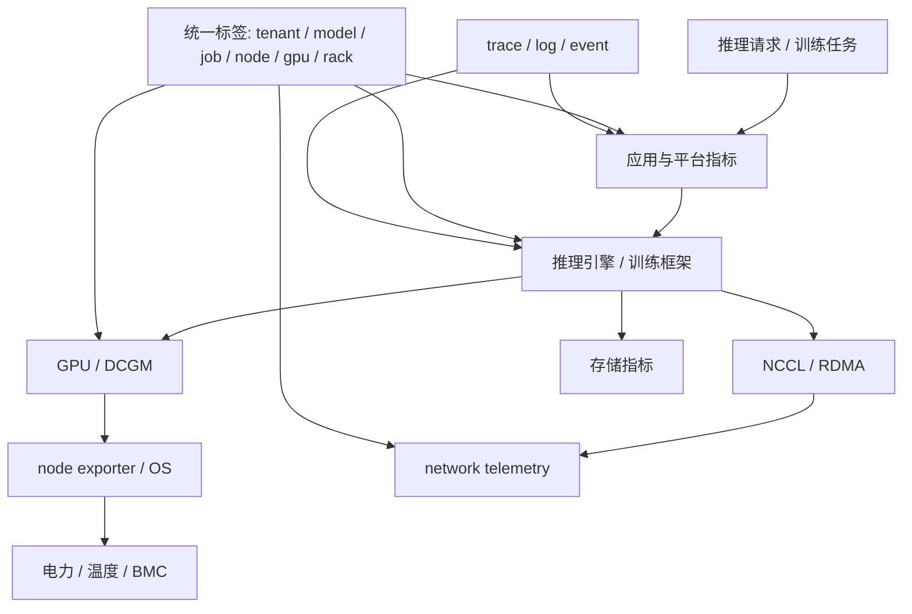

# 第 37 章：AI Factory 可观测性

## 本章回答的问题

- AI Factory 的可观测性为什么必须跨越应用、模型、运行时、调度、GPU、网络、存储和机房？
- GPU metrics、DCGM、node exporter、NCCL metrics、inference metrics、training metrics、storage metrics、network telemetry 和 distributed tracing 如何组合？
- 如何让一次推理请求或训练任务的问题可定位、可归因、可复盘？

## 一个真实场景

一个在线推理服务在晚高峰 TTFT 突然升高。应用日志显示请求进入服务，网关指标显示没有限流，推理引擎指标显示 prefill 队列变长，GPU 指标显示 HBM 接近满载，存储指标显示新 replica 拉权重很慢。没有统一可观测性时，每个团队只能看到自己的一段，会议开了很久仍无法判断是流量、模型、引擎、GPU 还是存储问题。

AI Factory 的可观测性目标，是把 token、任务、模型、节点和物理资源串成同一条证据链。

## 核心概念

可观测性不是把所有指标都采集起来，而是让系统状态可解释。AI Factory 的关键对象包括 request、tenant、model、endpoint、job、pod、rank、node、GPU、NIC、storage path、rack 和 power/cooling domain。

普通云原生系统常看 CPU、memory、QPS、latency、error rate。AI Factory 还要看 token 指标、prefill/decode、KV Cache、GPU utilization、HBM、NCCL、RDMA、checkpoint、data loader、网络拓扑和准入基线偏离。

## 系统架构



可观测性系统的难点不是采集单点指标，而是统一标签、时间线和对象关系。

## 37.1 GPU metrics

GPU metrics 包括利用率、显存、HBM 带宽、功耗、温度、频率、ECC、Xid、NVLink 错误、进程占用和 MIG 状态。这些指标帮助判断 GPU 是计算忙、显存满、通信等、热降频还是硬件异常。

GPU utilization 高不一定代表效率高。训练任务可能在通信阶段 GPU 利用率周期性下降；推理服务可能 HBM 满但 SM 不满；数据加载慢会让 GPU 空闲。指标必须和任务阶段结合解释。

工程上要把 GPU 指标带上 node、gpu_uuid、pod、container、job、tenant、model 和 rack 标签。否则看到某张卡异常，却无法关联到业务和拓扑。

## 37.2 DCGM

DCGM 是 NVIDIA Data Center GPU Manager，用于 GPU 监控、诊断和健康管理。它常通过 DCGM exporter 把 GPU 指标暴露给 Prometheus 等系统。

DCGM 的价值在于提供标准化 GPU 健康信号，包括温度、功耗、ECC、Xid、NVLink、利用率和诊断结果。它适合做节点健康、告警和准入后的运行监控。

使用 DCGM 时要注意版本和字段兼容。不同 GPU、驱动和 DCGM 版本可能支持不同指标。平台应定义指标基线和告警规则，而不是随意把所有字段展示出来。

## 37.3 node exporter

Node exporter 提供主机层指标，如 CPU、内存、磁盘、网络、文件系统、load、进程和系统状态。AI workload 虽然以 GPU 为核心，但主机层异常仍会影响训练推理。

数据加载依赖 CPU 和磁盘，RDMA 依赖 NIC 和内核，容器依赖文件系统和 cgroup，日志采集也会消耗主机资源。忽略 node exporter 会导致“GPU 看起来正常，但任务就是慢”的盲区。

Node 指标应与 GPU 指标联动。例如 GPU idle 同时 CPU data loader 高、网络低，可能是数据预处理瓶颈；GPU idle 同时网络重传高，可能是通信瓶颈。

## 37.4 NCCL metrics

NCCL metrics 用于观察分布式通信状态。现实中 NCCL 不总是直接提供完整指标，工程团队常结合 NCCL 日志、训练框架 profiling、网络 counters、RDMA counters 和 NCCL test 基线来推断。

关键观察对象包括 collective 耗时、通信带宽、rank 等待、超时、重试、hang、接口选择和拓扑路径。训练 step time 变长时，要能拆出 compute time、communication time 和 data loading time。

NCCL 相关观测需要 rank、node、GPU、NIC 和 job 维度。只知道“某任务慢”无法定位是某个 rank、某个 rail、某个 rack 还是整个 fabric。

## 37.5 inference metrics

Inference metrics 是推理服务指标。核心包括 QPS、并发、TTFT、TPOT、TPOP、E2E latency、prefill queue、decode throughput、batch size、KV Cache 使用、tokens/s、错误率、超时、限流和模型路由。

推理指标要按模型、租户、endpoint、版本和 replica 维度切分。一个模型慢不代表整个平台慢，一个租户慢可能是上下文过长或限流策略，一个 replica 慢可能是节点或缓存问题。

推理可观测性的重点是把用户体验和资源状态连接起来。TTFT 高可能来自网关排队、prefill 慢、权重冷启动或 GPU 忙；TPOT 高可能来自 decode kernel、KV Cache、batching 或 HBM 带宽。

## 37.6 training metrics

Training metrics 包括 step time、samples/s、tokens/s、loss、learning rate、gradient norm、data loading time、compute time、communication time、checkpoint time、GPU utilization 和失败重试。

训练可观测性要同时服务模型质量和基础设施效率。Loss spike 可能是数据、学习率、混合精度或硬件错误；step time spike 可能是网络、存储、checkpoint 或某个 rank 慢。

平台应把训练指标与作业调度事件结合：排队、准入、抢占、重启、节点迁移、checkpoint 恢复和失败原因都要在同一时间线中可见。

## 37.7 storage metrics

Storage metrics 覆盖对象存储、并行文件系统、本地 NVMe、缓存和模型 registry。指标包括吞吐、IOPS、延迟、metadata ops、错误率、限流、cache hit ratio、容量、checkpoint 耗时和恢复耗时。

存储问题常表现为 GPU 空闲、训练 step time 周期性尖刺、推理 cold start 慢或批量评测排队。单看存储集群总带宽很容易误判，需要按 job、tenant、dataset、path 和 client 切分。

Checkpoint 和模型权重加载应作为一等观测对象。它们直接影响训练恢复和推理扩容。

## 37.8 network telemetry

Network telemetry 包括端口吞吐、丢包、错误包、ECN mark、PFC pause、RDMA error、重传、链路状态、光模块状态、队列和 flow 维度信息。

AI 网络排障需要把 telemetry 与 job topology 关联。某个训练任务慢时，应能看到它使用了哪些节点、NIC、leaf、spine、rail 和 rack，并能关联端口计数变化。

网络指标的时间粒度也重要。许多拥塞是短时突发，分钟级平均值会掩盖问题。关键训练 fabric 应保留足够细粒度的 counters 和事件。

## 37.9 distributed tracing

Distributed tracing 用于追踪请求经过的服务链路。在 AI Factory 中，推理请求 trace 应覆盖 gateway、auth、routing、scheduler、model server、prefill、decode、streaming、metering 和 billing。

训练任务也需要类似 trace 的事件时间线，尽管它不一定使用传统 HTTP tracing。作业提交、排队、准入、Pod 启动、镜像拉取、数据加载、NCCL init、checkpoint 和失败重试都应形成可查询事件链。

Trace 的关键是统一 request id、job id、tenant id 和 model id。没有这些关联字段，日志、指标和事件无法拼接。

## 工程实现

统一标签规范示例：

```yaml
observability_labels:
  tenant: required
  project: required
  model: required_for_inference
  job: required_for_training
  node: required
  gpu_uuid: required_for_gpu_metrics
  rack: required_for_infra_metrics
  topology_domain: recommended
```

告警规则应按影响面分层：用户体验告警、作业失败告警、资源健康告警、容量告警和成本异常告警。不要让所有硬件小波动都直接打到业务 oncall，也不要让用户可见故障只停留在设备告警里。

## 常见故障

- 指标有了，但缺少 tenant/model/job 标签，无法归因。
- GPU utilization 高，却没有 token 指标，无法判断产出效率。
- 网络端口告警与训练任务拓扑没有关联。
- 训练失败只有 Pod 日志，没有 NCCL、RDMA 和节点事件。
- 监控采样粒度太粗，错过短时拥塞和 checkpoint 尖峰。

## 性能指标

- 推理：QPS、TTFT、TPOT、tokens/s、错误率、限流率。
- 训练：step time、tokens/s、GPU idle、communication time、checkpoint time。
- GPU：utilization、HBM、power、temperature、ECC、Xid、NVLink。
- 网络：吞吐、丢包、ECN、PFC、RDMA error、端口错误。
- 存储：吞吐、IOPS、metadata ops、checkpoint 时长、cache hit ratio。

## 设计取舍

采集越多，成本越高，噪音越大；采集越少，排障越依赖经验。高基数标签能提升定位能力，也会增加时序数据库压力。AI Factory 的可观测性设计应围绕关键问题：哪个租户、哪个模型、哪个任务、哪个节点、哪个 GPU、哪个拓扑域出了问题，以及影响了多少 token 或 GPU 小时。

## 小结

- AI Factory 可观测性要跨越应用、平台、模型、运行时和基础设施。
- GPU、NCCL、网络、存储和 token 指标必须能通过统一标签关联。
- 推理看用户体验和 token 产出，训练看 step time、通信、数据和 checkpoint。
- 可观测性最终服务排障、验收、容量规划和成本优化。

## 延伸阅读

- TODO: DCGM 官方文档
- TODO: OpenTelemetry 官方文档
- TODO: AI 平台可观测性工程案例
