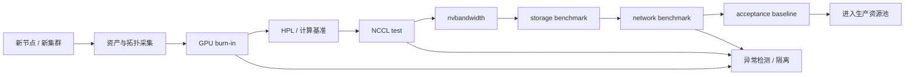

# 第 38 章：准入测试与验收

## 本章回答的问题

- 为什么 AI 集群必须先准入，再交给训练和推理业务使用？
- GPU、网络、存储、NCCL 和节点稳定性分别应该如何验收？
- 如何把测试结果沉淀成 acceptance baseline，并用于后续异常检测？

## 一个真实场景

一批新节点刚进入训练集群，第一天就有多个 64 卡任务卡在 NCCL init。单节点 GPU burn-in 都通过，操作系统也能识别所有 GPU，但跨节点 NCCL test 没有在交付前覆盖同 rack、跨 rack 和多 rail 组合。业务任务承担了本该由准入测试承担的风险。

准入测试的价值，就是在资源进入生产池之前，用可重复的测试暴露硬件、拓扑、驱动、网络和存储问题。

## 核心概念

准入测试是资源从“安装完成”到“可生产调度”的质量门禁。它不属于单纯运维脚本，而是 AI Factory 生命周期的一部分：新节点交付、维修回池、驱动升级、网络变更、存储扩容和大版本升级后，都应重新执行相应准入。

验收结果应形成 acceptance baseline。Baseline 既是交付凭证，也是后续异常检测、升级回归和故障复盘的比较对象。

## 38.1 为什么 AI 集群必须准入

AI 集群的单点异常很容易在大规模训练中被放大。一块 GPU 的 ECC 异常、一条 NVLink 降速、一张 NIC 配置错误、一个存储挂载抖动，都可能让几百张 GPU 的训练任务挂起或性能下降。如果没有准入测试，这些问题往往在业务任务运行数小时后才暴露，定位成本极高。

准入测试的目标不是跑出最好看的 benchmark 数字，而是确认节点、GPU、网络、存储和软件栈达到可交付基线。每台机器、每个机架、每个网络 rail 和每类镜像都应该有可追溯的验收记录。准入失败的资源不应进入生产资源池。

## 系统架构



## 38.2 GPU burn-in

GPU burn-in 用于发现压力运行下的硬件稳定性问题。它通常会长时间施加计算、显存和功耗压力，观察温度、功耗、Xid、ECC、掉卡、降频和进程异常。burn-in 的价值在于提前暴露边缘硬件问题，而不是等训练任务承担试错成本。

工程上应记录 GPU 序列号、节点、槽位、驱动版本、测试时长、温度范围、错误计数和是否通过。若 burn-in 失败，应进入隔离或维修流程，而不是降低阈值让它通过。

## 38.3 HPL

HPL 即 High Performance Linpack，常用于评估系统浮点计算能力。在 AI 集群中，HPL 可以作为计算路径和基础性能的参考，但不能单独代表训练能力。LLM 训练还依赖矩阵乘、通信、数据读取、checkpoint、框架效率和混合精度策略。

使用 HPL 时要关注同类节点之间的一致性。某台节点性能明显低于同批次平均值，比绝对分数更值得警惕。验收报告应记录测试参数和环境版本，否则后续无法复现。

## 38.4 NCCL test

NCCL test 是 AI 集群验收的核心。AllReduce、AllGather、ReduceScatter、Broadcast 等集合通信性能直接影响分布式训练效率。NCCL test 应覆盖节点内、跨节点、跨机架和不同 GPU 数量组合，尽量贴近真实训练拓扑。

常见问题包括 IB/RoCE 配置错误、链路降速、rail 选择不均、GID index 错误、PFC/ECN 异常、GPU/NIC 拓扑不匹配、NCCL 版本与驱动不兼容。验收不能只看测试是否完成，还要看带宽曲线、抖动、错误日志和不同规模下的趋势。

## 38.5 nvbandwidth

nvbandwidth 用于测量 GPU 相关路径带宽，例如 GPU-to-GPU、GPU-to-CPU、NVLink、PCIe 等。它适合发现节点内拓扑异常、NVLink 问题、PCIe 降速和硬件装配问题。

对同型号服务器，应建立节点内带宽矩阵基线。若某两个 GPU 之间带宽异常，需要结合拓扑、插槽、NVLink 状态和硬件日志定位。对训练任务来说，节点内带宽异常可能导致并行策略效率显著下降。

## 38.6 storage benchmark

训练和推理都依赖存储，但模式不同。训练关注数据集读取吞吐、metadata 压力、checkpoint 写入和恢复速度；推理关注模型权重加载、热更新和缓存命中；RAG 和数据处理还会引入向量库、对象存储和本地 NVMe 缓存。

Storage benchmark 应覆盖对象存储、并行文件系统、本地 NVMe 和缓存层。指标包括吞吐、IOPS、P50/P95/P99 延迟、并发客户端数、checkpoint 写入耗时和恢复耗时。验收时要避免只测单客户端顺序读，因为真实训练常是多节点并发读取。

## 38.7 network benchmark

Network benchmark 需要覆盖管理网、业务网、存储网和训练通信网。对 RDMA 网络，应检查链路状态、MTU、PFC/ECN、丢包、拥塞、带宽、延迟和多 rail 负载均衡。对普通以太网络，也要检查 Service、DNS、镜像拉取、对象存储访问和控制面连通性。

网络验收要结合拓扑。单机 iperf 通过不代表训练网络可用；跨机架、跨 spine、同 rail 和跨 rail 的路径都可能不同。验收报告应把性能结果和物理位置、交换机端口、NIC、线缆和拓扑标签关联起来。

## 38.8 acceptance baseline

Acceptance baseline 是可交付基线，不是一次性测试记录。它应该包含硬件信息、软件版本、拓扑、测试工具版本、测试参数、通过阈值、实际结果和异常说明。后续升级驱动、内核、NCCL、OFED、CNI、CSI 或推理引擎时，都应和基线对比。

基线应分层管理：节点级、机架级、集群级、网络级、存储级和 workload 级。节点级关注 GPU、NVLink、PCIe、CPU、内存和本地盘；集群级关注 NCCL、RDMA、存储并发和调度；workload 级关注真实训练或推理任务能否达到预期。

## 38.9 anomaly detection

准入测试的结果应进入异常检测系统。新节点和历史同型号节点对比，如果出现显著偏离，应自动标记。生产运行中，也可以把 DCGM、NCCL 错误、网络 telemetry、存储延迟和训练吞吐与验收基线对比，提前发现退化。

异常检测不能只依赖固定阈值。更有效的做法是结合批次、型号、机架、拓扑和 workload 类型做分组比较。比如某个机架 NCCL all_reduce 带宽整体低于其他机架，可能是网络配置或线缆问题，而不是单节点故障。

## 工程实现

准入流水线应由状态机驱动，而不是人工复制命令：

```yaml
acceptance_pipeline:
  scope: rack-12
  trigger: new-delivery
  stages:
    - inventory_and_topology
    - gpu_burn_in
    - hpl
    - nvbandwidth
    - nccl_single_node
    - nccl_multi_node
    - storage_benchmark
    - network_benchmark
    - baseline_publish
  on_failure:
    mark_unschedulable: true
    create_repair_ticket: true
    require_retest: true
```

流水线产物应包含测试参数、工具版本、节点列表、拓扑、原始结果、汇总结果和是否进入资源池。

## 常见故障

- 只跑单节点测试，没有覆盖多节点 NCCL 和网络 fabric。
- 只记录“pass/fail”，没有保存参数和原始结果，后续无法复现。
- 准入阈值按理想峰值写死，导致不同批次资源误报或漏报。
- 节点维修后直接回池，没有重新跑相关测试。
- 验收结果没有进入调度标签，故障节点仍被分配任务。

## 性能指标

- 准入通过率、失败原因分布、平均交付时长。
- GPU burn-in 错误数、Xid、ECC、温度和功耗范围。
- HPL、nvbandwidth、NCCL test 相对同批次偏离。
- 存储 benchmark 吞吐、IOPS、延迟和 checkpoint 耗时。
- 网络 benchmark 带宽、延迟、丢包、RDMA error 和多 rail 均衡度。

## 设计取舍

验收越全面，交付越慢；验收越粗糙，生产风险越高。大规模集群通常需要分层验收：单节点必跑，rack 级抽样或全量跑，多 rack 和全集群在关键变更时跑。阈值也要分层：硬失败阈值用于阻止入池，软偏离阈值用于观察和复测。

## 小结

- AI 集群必须先验收再进入生产资源池，否则业务任务会承担硬件和环境试错成本。
- GPU burn-in、HPL、NCCL test、nvbandwidth、storage benchmark 和 network benchmark 覆盖不同故障面。
- 验收要关注同类资源一致性、拓扑相关性和长期可复现性。
- Acceptance baseline 是后续升级、排障和异常检测的比较基准。
- 准入失败的资源应隔离、维修或重新测试，而不是直接交付业务。

## 延伸阅读

- TODO: 官方文档
- TODO: 经典论文
- TODO: 工程案例
