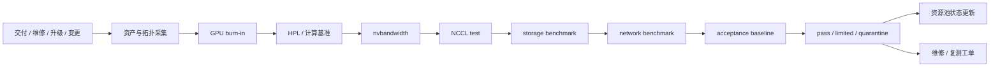

# 第 38 章：准入测试与验收

## 本章回答的问题

- 为什么 AI 集群必须先准入，再交给训练和推理业务使用？
- GPU、网络、存储、NCCL 和节点稳定性分别应该如何验收？
- 如何把测试结果沉淀成 acceptance baseline，并用于后续异常检测？

## 一个真实场景

一批新节点刚进入训练集群，第一天就有多个 64 卡任务卡在 NCCL init。单节点 GPU burn-in 都通过，操作系统也能识别所有 GPU，Kubernetes 也能调度 Pod，但交付前没有覆盖同 rack、跨 rack、多 rail 和容器内 RDMA 的 NCCL test。业务训练任务承担了本该由准入测试承担的风险，几百张 GPU 被卡在初始化阶段，排障还要临时补拓扑、驱动和网络证据。

另一个场景发生在维修回池后。某台服务器更换了 NIC 和线缆，资产系统仍保留旧 rail 标签，节点也没有重新跑 nvbandwidth 和 NCCL 基线。它回到生产池后，某个 tensor parallel 任务在这台机器上持续慢于同组节点。没有维修前后的 baseline，团队无法快速判断是模型问题、网络问题还是维修后拓扑漂移。

准入测试的价值，就是在资源进入生产池之前，用可重复、可追溯、接近真实 workload 的测试暴露硬件、拓扑、驱动、网络、存储和软件栈问题。AI Factory 的准入不是运维脚本集合，而是资源生命周期门禁。没有准入，生产任务就会变成昂贵的测试工具。

这类事故还会伤害信任。用户看到的是“平台给了我 GPU，但任务不能跑”，平台团队看到的是“底层交付说已经完成”，设施团队看到的是“设备都亮了”。准入基线能把争议转化为证据：哪些能力通过，哪些能力未通过，资源适合哪些 workload。

准入测试还可以保护发布节奏。没有准入时，每次扩容都要靠业务任务试错；有准入时，平台可以在业务使用前发现问题，并用明确状态告知交付进度。准入越标准，扩容越可预测。

从管理视角看，准入还能量化交付质量。某批节点失败率高、某类线缆问题反复出现、某个供应商批次性能离群，都可以通过准入数据被看见。没有数据，交付质量只能依赖主观印象。

## 核心概念

准入测试是资源从“安装完成”到“可生产调度”的质量门禁。它适用于新集群交付、新节点入池、服务器维修回池、GPU/NIC 更换、驱动升级、NCCL/OFED/CUDA 变更、网络扩容、存储升级和机房交付。每次变化都可能改变资源能力，因此都需要按影响范围重新准入。

准入的目标不是跑出最好看的 benchmark 数字，而是确认资源达到可交付基线。基线包括正确性、稳定性、一致性、可重复性和可追溯性。正确性说明设备和路径能工作；稳定性说明长时间压力下不报错；一致性说明同批次资源没有明显离群；可重复性说明参数和工具可复现；可追溯性说明结果能关联到资产、版本和拓扑。

验收结果应形成 acceptance baseline。Baseline 既是交付凭证，也是后续异常检测、升级回归、维修回池和故障复盘的比较对象。一个节点当前 NCCL 变慢，如果没有历史基线，只能猜测；如果有同节点、同批次、同 rack 的基线，就能快速判断是否发生退化。

准入还应与资源池状态绑定。测试通过的资源进入生产池；部分能力受限的资源进入 limited 或低优池；失败资源进入 quarantine 或维修；测试缺失的资源不应被当成可用资源。准入不是文档签字，而是调度门禁。

因此，准入体系至少包含三类产物：机器可读的资源状态，人可读的验收报告，后续可比较的原始数据。只有报告没有状态，调度无法使用；只有状态没有报告，事故无法复盘；只有汇总没有原始数据，基线无法重算。

核心概念还包括“适用范围”。通过某项准入，不代表资源适合所有任务。一个 rack 可能适合单机推理但不适合大规模训练，一个节点可能适合低优批量但不适合高 SLA 推理。准入结果必须表达能力边界。

## 系统架构

准入架构包括触发器、资产拓扑采集、测试执行、结果归档、基线生成、异常判定和资源池状态更新。触发器可以是新交付、维修完成、版本升级、网络变更或定期巡检。资产拓扑采集记录 node、GPU、NIC、rack、rail、switch port、driver、firmware 和镜像版本。测试执行覆盖 GPU、CPU、PCIe、NVLink、NCCL、RDMA、storage、network 和真实 workload。结果归档保留原始日志、参数和汇总。

架构的关键是状态机，而不是人工命令。一个节点不能因为“看起来正常”直接进入生产池；一个 rack 不能因为“端口都 up”就承载大训练；一个维修节点不能绕过复测。状态机把资源从 discovered、testing、passed、limited、failed、quarantine、maintenance 到 allocatable 的流转自动化，并把失败原因交给对应团队。

准入还要分层。节点级测试关注 GPU burn-in、PCIe、NVLink、HBM、CPU、内存和本地 NVMe；rack 级测试关注布线、rail、leaf、power/cooling 和多节点通信；集群级测试关注 NCCL、RDMA、存储并发和调度；workload 级测试关注典型训练、推理、checkpoint 和模型加载。不同层级回答不同问题。

架构上，准入系统还应能和 CMDB、工单、监控和调度系统集成。发现异常后自动创建维修工单，维修完成后自动触发复测，复测通过后自动更新资源池。没有这些集成，准入结果会停留在报告里，无法约束生产调度。

准入架构也要支持并行执行和容量隔离。大规模验收本身会消耗网络、存储和 GPU 资源，不能干扰生产任务。通常需要独立 staging 池、测试窗口和限流策略，让验收压力可控。

准入系统还应保留依赖关系。某个 rack 的验收可能依赖上游 spine、存储池、镜像仓库和 BMC 网络都可用。依赖未满足时，测试失败不能简单归咎于节点，应输出 blocked 或 external_dependency 状态。



## 38.1 为什么 AI 集群必须准入

AI 集群的局部异常很容易在大规模训练中被放大。一块 GPU 的 ECC 异常、一条 NVLink 降速、一张 NIC 配置错误、一个 RDMA 参数不一致、一个存储挂载抖动，都可能让几十到几百张 GPU 的训练任务挂起或性能下降。同步训练中，一个 rank 慢会让所有 rank 等待，局部问题会变成全局 GPU 小时损失。

准入测试把风险前移。与其让业务任务在运行数小时后暴露坏节点，不如在资源入池前用标准测试提前发现。准入失败的成本是一台节点或一个 rack 暂时不能交付；生产失败的成本可能是大作业重跑、模型进度延迟、SLA 违约和跨团队长时间排障。对 AI Factory 来说，准入是经济性措施，不只是可靠性措施。

AI 集群还高度依赖拓扑一致性。GPU、NIC、NVLink、PCIe、rail、rack 和 switch port 的关系，会影响 NCCL、RDMA、checkpoint 和推理冷启动。安装完成不代表拓扑正确，连通不代表性能正确，单机通过不代表多机通过。准入测试必须覆盖真实拓扑路径。

准入也能建立组织边界。硬件、网络、存储、平台和模型团队对“可用”的定义不同，acceptance baseline 提供共同证据。资源通过哪些测试、未通过哪些测试、能承载什么 workload、不能承载什么 workload，都应写入资源池，而不是靠口头承诺。

准入还可以减少灰色责任区。比如 NCCL 慢，到底是 GPU、NIC、线缆、交换机、OFED、NCCL 版本还是调度拓扑？准入流水线把这些路径逐项验证，至少能证明交付时的状态。生产中再出问题，就可以比较基线，而不是从零开始争论。

它还为容量承诺提供边界。没有准入，GPU 数量只是库存数字；通过准入后，GPU 才是可交付产能。面向租户或业务承诺 SLA 时，应该使用通过验收的产能，而不是采购清单上的产能。

## 38.2 GPU burn-in

GPU burn-in 用于发现压力运行下的硬件稳定性问题。它通常会长时间施加计算、显存和功耗压力，观察温度、功耗、Xid、ECC、掉卡、降频、进程异常和系统重启。许多边缘硬件问题在短时间功能测试中不会出现，但在长时间满载训练中会暴露。Burn-in 的目标是让这些问题在生产前暴露。

Burn-in 不是越久越好，而是要覆盖目标风险。新节点入池、维修回池、换卡、换散热部件、更新 firmware 后，测试时长和压力模式可以不同。高优训练池的 burn-in 要更严格，低优实验池可以采用较短门槛但必须标注资源等级。准入策略应按资源价值和风险分层。

工程上应记录 GPU 序列号、node、slot、GPU UUID、driver、firmware、测试工具版本、测试时长、温度范围、功耗范围、Xid、ECC、retired page、throttle reason 和通过状态。只记录 pass/fail 不够，后续无法判断异常是否在测试时已有迹象。原始日志应可追溯。

Burn-in 失败应触发隔离和维修，而不是降低阈值让节点入池。若某批次 GPU burn-in 失败率偏高，还应按 batch、rack、供应商和交付时间分析。Burn-in 既是节点测试，也是供应链和交付质量信号。

Burn-in 也要避免过度自信。它能发现压力稳定性问题，但不能证明 NCCL、RDMA、存储和真实模型都正常。因此 burn-in 是准入第一道门，不是全部验收。把 burn-in 通过等同于集群可用，是常见误区。

Burn-in 结果还应与环境相关联。同一 GPU 在不同 rack、电力和冷却条件下表现可能不同。记录 rack、温度、功耗和风扇或液冷状态，能帮助判断失败是单卡问题还是环境问题。

如果 burn-in 期间出现降频但没有错误，也不应简单通过。降频可能意味着电力或散热边界不足，未来长训练会持续损失性能。准入应把降频作为可分析信号。

## 38.3 HPL

HPL 即 High Performance Linpack，常用于评估系统浮点计算能力。它能为计算路径提供参考，帮助发现明显性能离群、散热降频、电力限制或系统配置异常。在 AI 集群中，HPL 不是 LLM 训练能力的完整代表，但可以作为基础计算基线的一部分。

使用 HPL 时要避免误用。HPL 分数高，不代表 NCCL、数据加载、checkpoint、混合精度训练或推理服务一定高效；HPL 分数低，也需要结合功耗、温度、CPU、GPU、driver 和测试参数判断。HPL 的价值主要在同类节点一致性和变化对比，而不是作为唯一采购或验收指标。

验收报告应记录测试参数、问题规模、GPU 数量、驱动、CUDA、库版本、功耗、温度和结果。若某台同型号节点明显低于同批次基线，应触发复测和硬件/配置检查。性能离群比绝对分数更值得关注，因为它会在训练资源池中制造不可预测性。

HPL 还可用于维修后回归。更换电源、散热、主板、GPU 或升级 firmware 后，HPL 与温度功耗曲线可以帮助判断计算路径是否恢复。它不是 AI workload 的终点指标，但可以作为硬件基础健康证据。

在报告中，HPL 最好与功耗和温度一起呈现。若性能下降伴随功耗受限或热降频，问题方向就很明确；若功耗温度正常但分数离群，则更可能是配置、驱动或硬件路径问题。单独一个分数解释力有限。

HPL 也可以作为批次质量信号。若某一批次整体偏低，可能是 BIOS、固件、散热或供应链问题；若只有单节点偏低，优先查节点装配和配置。分组对比比单点判断更可靠。

对 AI 场景，HPL 的结论应保持克制。它能发现基础计算异常，但不能替代矩阵算子、低精度训练和端到端模型测试。验收报告应明确其适用边界。

## 38.4 NCCL test

NCCL test 是 AI 集群验收的核心。AllReduce、AllGather、ReduceScatter、Broadcast 和 AllToAll 等集合通信直接影响分布式训练效率，也影响部分分布式推理和模型并行服务。NCCL test 能把 GPU、driver、CUDA、NCCL、RDMA、NIC、网络拓扑和容器环境放在同一个压力场景下验证。

NCCL test 应覆盖节点内、跨节点、同 rack、跨 rack、多 rack、多 rail、不同 GPU 数量和不同消息大小。只跑两台机器或单一规模不够，因为拓扑问题常在特定路径、特定 rail 或大规模并发下出现。高优训练池还应覆盖接近真实并行策略的规模，例如 tensor parallel、data parallel 或 hybrid parallel 对应的通信模式。

常见问题包括 IB/RoCE 配置错误、GID index 错误、MTU 不一致、PFC/ECN 异常、链路降速、rail 选择不均、GPU/NIC 拓扑不匹配、容器内 RDMA 设备不可见、NCCL 版本与 driver 不兼容。验收不能只看测试是否完成，还要看带宽曲线、抖动、错误日志和不同规模趋势。

NCCL test 结果应写入 topology baseline。某 rack 对、某 rail、某节点组合的通信表现，应能在后续生产故障中被比较。若生产任务变慢，而 NCCL 基线也下降，优先查通信路径；若基线正常而训练慢，则继续查数据、checkpoint、模型和框架。

NCCL test 还应在容器内运行。宿主机环境通过，不代表 Kubernetes 或 Slurm 作业容器能看到正确 RDMA 设备、库和环境变量。生产任务在哪里运行，准入就应尽量在哪里验证。否则会漏掉容器权限和 runtime 配置问题。

NCCL test 的阈值应按拓扑分组。节点内、同 rack、跨 rack 和跨 rail 的期望不同，不能用同一个数值判断所有路径。正确的基线应描述每类拓扑的合理范围和离群规则。

NCCL test 还要记录环境变量和自动选择结果。接口选择、算法选择和拓扑文件会影响结果。没有这些信息，后续复现测试很难得到同样路径。

## 38.5 nvbandwidth

nvbandwidth 用于测量 GPU 相关路径带宽，例如 GPU-to-GPU、GPU-to-CPU、NVLink、PCIe 和部分内存路径。它适合发现节点内拓扑异常、NVLink 问题、PCIe 降速、插槽配置错误和硬件装配问题。对强通信模型并行任务，节点内带宽异常会直接影响性能。

同型号服务器应建立节点内带宽矩阵基线。不同 GPU 对之间的带宽、同 NVLink/NVSwitch 域内的集合通信、GPU 到 CPU、GPU 到 NIC 或 GPU 到 NVMe 的路径，都可能影响 workload。若某两个 GPU 之间带宽异常，需要结合拓扑、插槽、NVLink 状态、PCIe speed/width 和 BMC 事件定位。

nvbandwidth 的结果也要和调度资源画像结合。资源池声称某节点有完整 NVSwitch 域，就应有基线证明；维修后如果带宽矩阵变化，调度标签也应更新。否则平台会把强通信任务放到实际不满足的 GPU 组合上，导致同型号节点性能差异。

验收时要保存测试工具版本、driver、CUDA、GPU 型号、拓扑图、带宽矩阵和异常说明。单次测试值可能受环境影响，但同批次、同拓扑、同参数的长期对比非常有价值。nvbandwidth 是连接硬件装配和 AI Runtime 性能的桥梁。

nvbandwidth 结果还应参与资源分级。节点内带宽矩阵轻微偏离但仍可运行的节点，可以进入低优或非强通信池；明显异常节点应隔离维修。这样既保护关键训练，又减少可用资源浪费。

它也适合做维修验收。任何涉及 GPU、主板、NVLink、PCIe 或 BIOS 的维修，都可能改变节点内带宽。维修后不跑带宽矩阵，就无法证明节点恢复到原有能力。

nvbandwidth 还应与 `nvidia-smi topo` 等拓扑信息一起保存。带宽数值解释依赖拓扑，没有拓扑，异常数值只能说明慢，不能说明路径为什么慢。

## 38.6 storage benchmark

训练和推理都依赖存储，但访问模式不同。训练关注数据集读取吞吐、metadata 压力、checkpoint 写入和恢复速度；推理关注模型权重加载、热更新、registry latency 和缓存命中；RAG、评测和数据处理还会引入对象存储、向量库、并行文件系统和本地 NVMe 缓存。单一存储测试不能代表全部 AI workload。

Storage benchmark 应覆盖对象存储、并行文件系统、本地 NVMe、cache 和模型制品路径。指标包括吞吐、IOPS、P50/P95/P99 latency、metadata ops、并发客户端数、checkpoint 写入耗时、恢复耗时、模型权重加载时间、cache miss 行为和对象存储请求限流。测试应覆盖多节点并发，而不是单客户端顺序读。

存储验收还要匹配数据格式。大量小文件、过大的 shard、热点目录、频繁 LIST/stat、压缩解码和远端对象请求，会对训练产生完全不同影响。准入测试应包含典型 dataset shard、checkpoint pattern 和模型 artifact，而不是只跑通用 `dd` 或 fio。真实访问模式比漂亮峰值更重要。

结果应带 job、dataset、path、client node、rack、storage backend 和版本标签。若生产中 GPU idle 或 checkpoint 变慢，可以与准入存储基线对比。存储 benchmark 的目标不是证明存储系统很快，而是证明它能支撑 AI Factory 的关键数据路径。

存储准入还要覆盖失败语义。写入中断、对象存储限流、文件系统元数据超时、缓存磁盘满和 checkpoint manifest 不完整，都应能被识别并返回清晰错误。只测成功路径，会在生产故障时暴露恢复能力不足。

存储测试还要考虑与网络的叠加。Checkpoint 写入和训练通信经常共享部分 fabric，单独测存储和单独测 NCCL 都通过，并不代表同时运行稳定。高优训练池应包含组合压力测试。

## 38.7 network benchmark

Network benchmark 需要覆盖管理网、BMC 网、业务网、存储网和训练通信网。对 RDMA 网络，应检查链路状态、MTU、PFC/ECN、拥塞控制、丢包、错误包、带宽、延迟、RDMA error、重传和多 rail 负载均衡。对普通以太网络，也要检查 Service、DNS、镜像拉取、对象存储访问、控制面连通性和推理入口路径。

网络验收必须结合拓扑。单机 iperf 通过不代表训练网络可用，跨机架、跨 spine、同 rail、跨 rail、同 rack 和不同 rack 的路径都可能不同。验收报告应把性能结果和物理位置、switch port、NIC、cabling、rack、rail、fabric 和拓扑标签关联。没有拓扑，网络结果无法用于调度和排障。

网络 benchmark 还应覆盖并发和突发。AI workload 的网络压力不是平滑流量：AllReduce、checkpoint、权重加载、数据预热和批量推理都会产生突发。轻载测试通过，不代表多任务混部稳定。高优训练 fabric 应跑多节点 NCCL、RDMA 带宽、拥塞控制和故障绕行测试。

网络测试失败要能进入明确流程：线缆检查、交换机配置、NIC firmware、OFED、CNI、NCCL 参数、PFC/ECN 和拓扑标签。不要把网络验收结果停留在“慢”或“不稳定”。准入系统应输出可操作的失败分类。

Network benchmark 还应区分控制面和数据面。控制面网络不稳定会导致 Pod 创建、镜像拉取和 API 调用失败；数据面网络不稳定会导致训练通信、推理流量和存储访问变慢。两者都重要，但诊断路径不同。

网络验收也要保存端口级证据。交换机端口、光模块、线缆、NIC、rail 和 rack 映射应与测试结果绑定。否则发现某条路径慢时，仍然无法定位到物理连接。

对于 RoCE，网络 benchmark 还应保存 PFC、ECN、QoS、MTU 和队列配置摘要。这些配置轻微漂移，就可能让大规模训练出现重传和长尾。

## 38.8 acceptance baseline

Acceptance baseline 是可交付基线，不是一次性测试记录。它包含硬件信息、软件版本、拓扑、测试工具版本、测试参数、通过阈值、实际结果、原始日志、异常说明、责任团队和资源状态。后续升级 driver、kernel、CUDA、NCCL、OFED、CNI、CSI、推理引擎或训练框架时，都应与基线对比。

Baseline 应分层管理。节点级关注 GPU、HBM、NVLink、PCIe、CPU、内存、本地盘和 BMC；rack 级关注 cabling、rail、power、cooling 和 leaf；集群级关注 NCCL、RDMA、storage concurrency 和 scheduler；workload 级关注典型训练、推理、checkpoint 和模型加载。不同层级基线服务不同决策。

Baseline 还应按批次和资源等级组织。同一批服务器、同一版 firmware、同一 rack、同一 GPU 型号和同一网络 fabric，应该有可比较结果。高优训练池的通过阈值可以更严格，低优或实验池可以使用 limited 标签。基线不是一刀切，而是资源分级依据。

工程上，baseline 必须可查询。给定一个生产 incident，SRE 应能查到相关节点、rack、GPU、NIC 和 storage path 的最近准入结果、历史变化和同组分布。只有这样，baseline 才能从交付文档变成故障诊断工具。

Baseline 还应有有效期。硬件老化、驱动升级、网络变更和存储扩容都会让旧基线失效。平台应定期巡检关键资源，或在重大变更后刷新基线。过期基线比没有基线更危险，因为它会给团队错误信心。

Baseline 的版本也要明确。测试工具版本、阈值版本和分析逻辑变化后，历史结果可能不能直接比较。平台应保存版本信息，必要时支持重新计算历史数据。

Baseline 还应支持差异报告。升级前后、维修前后、扩容前后哪些指标变化，变化是否在允许范围内，应自动生成。人工逐项对比容易漏掉关键退化。

## 38.9 anomaly detection

准入测试的结果应进入异常检测系统。新节点与历史同型号节点对比，如果出现显著偏离，应自动标记；维修回池节点与维修前基线对比，如果拓扑或性能变化，应触发复测；生产运行中，DCGM、NCCL、RDMA、network telemetry、storage latency 和训练吞吐也可以与验收基线比较，提前发现退化。

异常检测不能只依赖固定阈值。更有效的做法是结合 batch、型号、rack、topology、driver、firmware 和 workload 类型做分组比较。比如某个 rack 的 NCCL all_reduce 带宽整体低于其他 rack，可能是 cabling 或 switch 配置问题；某批 GPU 的 burn-in 温度更高，可能是散热或批次问题。

异常检测还要区分硬失败和软偏离。硬失败直接阻止入池，例如 GPU burn-in 报 Xid、RDMA 不通、NCCL hang；软偏离进入观察或 limited，例如性能低于同组但仍可跑低优任务。这样既保护生产，又避免过度浪费资源。异常检测的输出应是资源状态，而不是只发告警。

检测结果必须可解释。自动标记某节点异常时，应说明偏离哪个基线、偏离多少、影响哪些测试、建议谁处理。黑盒异常分数很难被运维接受。AI Factory 的异常检测要服务维修和调度，而不是制造新的不确定性。

异常检测还要避免把正常差异当故障。不同 GPU 代际、不同 rack、电力状态、冷却状态和 workload 类型本来就会不同。分组比较和上下文标签是关键。没有上下文的异常检测，会产生大量误报，最终被团队忽略。

异常检测输出还应进入闭环。标记异常后，资源状态要变化，工单要创建，复测要安排，结果要回写。只生成告警不改变资源池，异常仍会继续影响业务。

## 工程实现

准入流水线应由状态机驱动，而不是人工复制命令。每次触发准入时，系统应读取资产和拓扑，生成测试计划，锁定节点，执行测试，保存日志，计算基线，更新资源状态，并在失败时创建维修或复测工单。人工可以审批例外，但不能绕过记录和状态更新。

流水线产物应包含测试参数、工具版本、节点列表、拓扑、原始结果、汇总结果、通过阈值、失败分类、资源等级和是否进入生产池。原始结果很重要，因为后续阈值或分析方法可能变化。只保存 pass/fail 会让历史数据失去诊断价值。

准入还要支持按影响范围复测。更换 GPU 需要跑 GPU、PCIe、NVLink 和相关 NCCL；更换 NIC 或线缆需要跑 RDMA、network、NCCL 和 topology；升级 driver 需要跑 GPU、NCCL、runtime 和典型 workload；存储升级需要跑 storage 和 checkpoint。全量复测安全但慢，影响范围复测更高效。

```yaml
acceptance_pipeline:
  scope: rack-12
  trigger: new-delivery
  stages:
    - inventory_and_topology
    - gpu_burn_in
    - hpl
    - nvbandwidth
    - nccl_single_node
    - nccl_multi_node
    - storage_benchmark
    - network_benchmark
    - baseline_publish
  on_failure:
    mark_unschedulable: true
    create_repair_ticket: true
    require_retest: true
```

实现还需要权限控制。准入状态影响资源是否可售卖，不能被任意人员手工修改。例外放行必须有审批、过期时间、适用范围和风险说明。否则准入门禁会被紧急需求逐步绕空。

实现还要支持审计。谁触发测试、谁批准例外、谁修改阈值、谁把节点回池，都应可追踪。准入系统本身是生产控制面，必须有操作记录和权限边界。

流水线还需要失败重试策略。临时网络抖动和真实硬件故障应区分，自动重试次数、重试间隔和最终状态要明确。否则偶发环境问题会制造大量人工工单。

最后，准入流水线应提供 API，而不只是 Web 页面。资源池、调度器、工单系统和容量系统都需要读取准入状态。API 返回的状态应稳定、枚举清晰，并包含最近一次测试时间、适用范围和失败原因。

## 常见故障

第一类故障是只跑单节点测试，没有覆盖多节点 NCCL、RDMA、rack、rail 和 storage concurrency。节点单独健康，但大训练任务失败。解决方向是分层验收，把节点级、rack 级、集群级和 workload 级测试都纳入准入计划。不同层级缺一不可。

第二类故障是只记录 pass/fail，没有保存参数和原始结果。几周后出现性能回归，团队无法复现当时环境，也无法判断是否真的退化。解决方向是保存工具版本、测试参数、拓扑、原始日志、汇总和阈值。可追溯性是准入的一部分。

第三类故障是维修后直接回池。硬件更换、线缆调整、BIOS 修改或 driver 升级后，节点状态被手工改成可调度，但相关基线没有重跑。解决方向是状态机门禁：维修完成只能进入待复测，复测通过后才能 allocatable。

第四类故障是阈值不分资源等级。把理想峰值当硬阈值会造成大量误报，把过低阈值当通用标准又会放过风险。解决方向是同批次分布、资源等级、硬失败和软偏离结合。准入阈值应服务生产目标，而不是追求形式统一。

第五类故障是验收结果没有进入调度标签。测试报告显示某 rack 只适合低优任务，但资源池仍把它当普通节点。解决方向是让准入系统直接写资源状态和标签，而不是依赖人工同步。

第六类故障是测试工具和生产环境不一致。准入用宿主机、生产用容器；准入用旧 NCCL、生产用新 NCCL；准入用空闲网络、生产中混部。解决方向是让准入尽量贴近生产，并记录差异。

第七类故障是例外放行失控。临时跳过测试的节点没有过期时间，长期留在生产池。解决方向是例外必须自动到期，到期后强制复测或下线。

## 性能指标

准入流程指标包括通过率、失败原因分布、平均交付时长、复测次数、维修回池时间、quarantine 资源数量、limited 资源比例和首次生产故障率。它们衡量准入流程本身是否有效。交付快但首次故障率高，说明准入不足；准入很慢且误报多，说明阈值或流程需要优化。

GPU 指标包括 burn-in 错误数、Xid、ECC、温度范围、功耗范围、降频、HBM 错误、PCIe 错误和同批次性能偏离。节点内指标包括 HPL、nvbandwidth、PCIe speed/width、NVLink 状态和带宽矩阵。它们用于判断单节点生产资格。

网络和通信指标包括 NCCL all_reduce/all_gather/reduce_scatter 带宽、延迟、抖动、hang、RDMA error、丢包、ECN/PFC、端口错误、多 rail 均衡和跨 rack 基线。它们决定资源是否适合分布式训练和高性能推理。

存储指标包括对象存储请求延迟、并行文件系统吞吐、metadata ops、IOPS、checkpoint 写入耗时、恢复耗时、模型权重加载时间、本地 NVMe 吞吐和 cache miss 表现。存储基线决定数据路径是否会浪费 GPU 小时。

指标还要看离群和趋势。同批次节点中最慢的 5% 往往比平均值更值得关注，因为生产调度迟早会把大任务放到这些节点上。准入指标的重点是一致性，而不只是最高性能。

流程指标也很重要。如果复测周期过长，维修资源会长期占用库存；如果失败原因分类粗糙，供应商和内部团队无法改进。准入本身也需要被运营。

指标应能按 batch、rack、供应商、硬件型号和变更类型聚合。这样才能发现系统性问题，而不是只处理单点坏节点。

指标还要体现资源影响面。一个测试失败影响 1 张 GPU、1 台服务器、1 个 rack 或整个 fabric，处理优先级完全不同。准入看板应展示受影响 GPU 数、预计恢复时间和是否影响业务交付承诺。

## 设计取舍

第一个取舍是验收深度与交付速度。验收越全面，交付越慢；验收越粗糙，生产风险越高。大规模集群通常需要分层验收：单节点必跑，rack 级按拓扑跑，多 rack 和全集群在关键变更或高优资源池中跑。验收策略应按资源等级和业务风险设计。

第二个取舍是固定阈值与相对基线。固定阈值简单，容易自动化，但无法适应不同硬件代际、批次和拓扑；相对基线更准确，但需要历史数据和分组逻辑。成熟平台通常两者结合：硬失败用固定阈值，性能偏离用同组比较。

第三个取舍是自动化与人工例外。完全自动化可以减少漏测，但现实中会遇到紧急交付和临时维修。平台可以允许例外，但必须记录审批、过期时间、适用 workload 和风险说明。没有记录的例外，会慢慢腐蚀准入体系。

最终，准入测试的目标不是阻碍交付，而是保护生产。它让资源以明确等级进入 AI Factory，让训练和推理任务不再承担底层试错，让后续升级和故障诊断有可比较证据。准入越标准化，资源池越可信。

设计上还要把准入成本纳入容量计划。新资源交付需要测试窗口、测试工具、网络和存储压力预算。若计划中没有准入时间，业务就会逼迫资源未验收上线。把准入作为交付的一部分，才能形成稳定节奏。

准入策略也应持续改进。生产事故中暴露的新故障类型，应反向补充到准入测试；长期从未发现问题的昂贵测试，可以降低频率。准入体系要随经验演进，而不是一次写死。

这种改进应有版本管理。阈值、测试项和流程变化后，历史通过率和失败率的解释也会改变。准入策略本身需要像软件一样发布和回滚。

## 小结

- AI 集群必须先验收再进入生产资源池，否则业务任务会承担硬件和环境试错成本。
- GPU burn-in、HPL、NCCL test、nvbandwidth、storage benchmark 和 network benchmark 覆盖不同故障面。
- 验收要关注同类资源一致性、拓扑相关性、真实 workload 和长期可复现性。
- Acceptance baseline 是后续升级、排障、维修回池和异常检测的比较基准。
- 准入失败的资源应隔离、维修或重新测试，而不是直接交付业务。

## 延伸阅读

- [NVIDIA DCGM Diagnostics documentation](https://docs.nvidia.com/datacenter/dcgm/latest/user-guide/dcgm-diagnostics.html)
- [LINPACK Benchmark report](https://netlib.org/benchmark/hpl/)
- [NCCL tests repository](https://github.com/NVIDIA/nccl-tests)；[nvbandwidth repository](https://github.com/NVIDIA/nvbandwidth)
