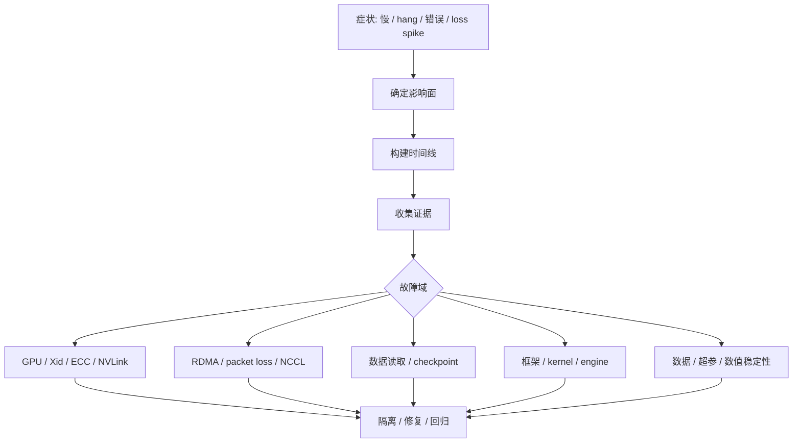

# 第 39 章：故障诊断

## 本章回答的问题

- AI Factory 故障为什么常常跨越模型、运行时、调度、GPU、网络和存储？
- GPU Xid、ECC、NVLink、RDMA、packet loss、NCCL hang、training loss spike 和 inference latency spike 应如何诊断？
- 如何建立故障树分析，而不是依赖经验逐层猜测？

## 一个真实场景

一个大规模训练任务运行到第 6 小时突然 hang。训练日志停在 AllReduce，某个 rank 没有继续输出。GPU 指标显示部分卡空闲，网络端口有少量重传，节点日志里出现过一次 Xid。模型团队怀疑代码，基础设施团队怀疑网络，平台团队怀疑调度。没有故障树时，排查会陷入“谁都可能有问题”的状态。

AI Factory 的故障诊断必须从症状出发，按证据逐步缩小范围：是请求慢、任务 pending、GPU 异常、通信 hang、网络丢包、存储慢，还是模型数值问题。

## 核心概念

故障诊断是把异常现象映射到可能原因、证据和处置动作的过程。AI Factory 的故障通常有跨层传播：一个网络丢包可能表现为 NCCL hang，一个存储慢可能表现为 GPU idle，一个硬件错误可能表现为 loss spike。

诊断应围绕时间线、拓扑和影响面展开。时间线回答“什么时候开始”；拓扑回答“哪些节点、GPU、rack、rail 相关”；影响面回答“影响一个任务、一个租户、一个模型还是整个集群”。

## 系统架构



故障树不是一次性文档，而是可执行的排障路径和自动化诊断规则。

## 39.1 GPU Xid

GPU Xid 是 NVIDIA 驱动报告的 GPU 错误事件类别。它可能表示应用错误、驱动问题、硬件异常、显存问题或 GPU reset 等。不同 Xid 的含义不同，不能简单地把所有 Xid 都当成同级故障。

排查 Xid 时要收集时间、GPU UUID、进程、容器、节点、驱动版本、温度、功耗、ECC、最近任务和是否伴随掉卡。一次 Xid 是否需要隔离节点，要结合类型、频率和业务影响判断。

生产系统应把严重 Xid 自动转成节点健康状态。持续出现严重 Xid 的 GPU 不应继续承载长训练任务。

## 39.2 ECC error

ECC error 是显存纠错相关错误。可纠正错误可能被硬件修复，但频繁出现意味着风险上升；不可纠正错误通常需要更严肃处理。ECC 问题会影响训练稳定性和模型结果可信度。

诊断 ECC 要看错误类型、计数增长速度、是否集中在某张卡、是否伴随 Xid、是否与温度或负载相关。对于不可纠正错误，应隔离 GPU 或节点并走维修流程。

训练 loss spike 与 ECC 并不总有因果关系，但硬件错误是必须排除的因素。长训练任务不应运行在有异常趋势的 GPU 上。

## 39.3 NVLink error

NVLink error 表示 GPU 间互联路径存在异常。它可能导致节点内通信带宽下降、NCCL 性能变差或任务 hang。NVLink 问题不一定让 GPU 消失，因此容易被普通健康检查漏掉。

排查时要看 NVLink 状态、错误计数、GPU-to-GPU 带宽矩阵、NCCL 单节点测试和硬件日志。如果某条 GPU pair 异常，应结合服务器拓扑判断是否为链路、NVSwitch 或 GPU 本身问题。

对于强依赖 tensor parallel 的推理服务，NVLink 退化可能直接影响 TPOT 和吞吐。

## 39.4 RDMA error

RDMA error 涉及 NIC、驱动、firmware、交换机、RoCE/IB 配置、MTU、PFC/ECN、GID、权限和容器设备注入。它常表现为 NCCL 超时、吞吐下降或偶发 hang。

排查 RDMA 要同时看主机和网络侧：NIC counters、RDMA counters、交换机端口、PFC/ECN、链路状态、NCCL 日志和容器内设备可见性。只在容器内重启任务，往往无法解决根因。

RDMA 故障应按 rail、rack、leaf 和任务 rank 关联分析。一个 rail 异常会让部分 rank 慢，从而拖住整个训练。

## 39.5 packet loss

Packet loss 是网络包丢失。AI 训练对丢包敏感，尤其在同步通信和 RDMA 场景中。少量丢包也可能造成明显尾延迟或重传。

丢包来源包括物理链路、光模块、交换机拥塞、队列溢出、MTU 不一致、PFC 配置不当、ECN 配置错误和流量热点。诊断时要区分持续丢包和突发丢包。

排障应把端口计数和任务时间线对齐：丢包是否发生在 step time spike 同一时间，是否只影响某个 rack 或某些节点，是否与 checkpoint 或多任务并发相关。

## 39.6 NCCL hang

NCCL hang 指分布式通信长时间没有前进。它可能来自某个 rank 失败、网络异常、GPU 错误、进程 OOM、容器被驱逐、接口选择错误、版本不兼容或 collective 调用不一致。

诊断 NCCL hang 的第一步是确认所有 rank 状态：是否有 rank 退出、卡在同一 collective、GPU 是否可用、网络是否有错误、Pod 是否重启。第二步是检查 NCCL 日志、rank 到节点映射、NCCL 环境变量和通信拓扑。

处置上，平台应保留故障现场信息。自动重启能恢复服务，但如果日志和指标丢失，根因无法复盘。

## 39.7 training loss spike

Training loss spike 是训练 loss 突然升高或出现异常波动。它可能来自数据异常、学习率、混合精度、梯度爆炸、随机性、代码变更，也可能来自硬件或通信错误。

诊断时要先区分数值问题和系统问题。检查数据 batch、学习率、gradient norm、溢出、checkpoint 恢复点、代码版本、GPU ECC/Xid、节点重启和通信错误。

如果 loss spike 与特定节点或 GPU 相关，应怀疑硬件或环境；如果与数据 shard 相关，应检查数据；如果在特定 step 后出现，应检查训练策略和 checkpoint。

## 39.8 inference latency spike

Inference latency spike 是推理延迟尖刺。它可能来自流量突增、队列积压、prefill 大请求、decode 拥塞、KV Cache 不足、冷启动、模型权重加载、网络抖动、限流配置或下游依赖。

诊断时要按路径拆分：gateway、auth、routing、queue、prefill、decode、streaming、metering。TTFT 高和 TPOT 高代表不同方向。TTFT 高常与排队、prefill 和冷启动有关；TPOT 高常与 decode、batching、HBM 和 GPU 负载有关。

应按 tenant、model、endpoint、replica 和 node 维度观察。只有某个租户慢，可能是上下文过长；只有某个 replica 慢，可能是节点或缓存问题。

## 39.9 故障树分析

故障树分析把故障从症状拆到可能原因、证据和动作。AI Factory 应为高频故障建立标准树：训练 pending、NCCL hang、GPU Xid、推理 TTFT 高、checkpoint 慢、节点 NotReady、存储慢。

一棵好的故障树包含：入口症状、必要指标、日志位置、排除顺序、自动化检查、人工判断点、临时止血、长期修复和复盘字段。

故障树应不断从 incident 中更新。每次事故后，如果某个证据缺失，就补指标；如果某个判断依赖专家经验，就沉淀成 runbook 或自动诊断。

## 工程实现

NCCL hang 诊断清单示例：

```yaml
diagnosis:
  symptom: nccl_hang
  collect:
    - job_events
    - pod_status
    - rank_to_node_mapping
    - nccl_logs
    - gpu_xid_ecc
    - rdma_counters
    - switch_port_counters
    - recent_node_events
  first_actions:
    - preserve_logs
    - mark_suspect_nodes
    - prevent_new_large_jobs_on_suspect_domain
  resolution:
    - isolate_bad_gpu_or_nic
    - rerun_nccl_test
    - compare_with_acceptance_baseline
```

自动化诊断不需要一次性覆盖所有故障。先覆盖高频、高损失故障，逐步沉淀。

## 常见故障

- 自动重启清理了现场，导致无法复盘。
- 只看应用日志，忽略节点、GPU、网络和存储事件。
- 故障影响面不清，误把单节点问题当成全局问题。
- 监控没有拓扑标签，无法定位 rack、rail 或 leaf。
- 处置只恢复任务，没有更新准入基线和故障树。

## 性能指标

- MTTA、MTTD、MTTR、复发率。
- 每类故障影响的 GPU 小时、token 数、任务数和租户数。
- Xid/ECC/NVLink/RDMA/packet loss 事件频率。
- NCCL hang 次数、训练失败率、推理延迟尖刺次数。
- 自动诊断命中率、误报率和人工升级次数。

## 设计取舍

自动化诊断能缩短恢复时间，但规则过粗会误隔离资源。保留现场有助于根因分析，但会占用存储和增加隐私安全要求。快速止血和彻底根因之间常有冲突：生产系统应先降低影响，再补完整复盘。

## 小结

- AI Factory 故障通常跨层传播，不能只按单组件排查。
- 时间线、拓扑和影响面是诊断的三条主线。
- GPU、网络、存储、运行时和模型指标要能关联。
- 故障树和 runbook 应从真实 incident 中持续演进。

## 延伸阅读

- TODO: NVIDIA Xid / DCGM 官方资料
- TODO: NCCL troubleshooting 资料
- TODO: SRE incident 复盘案例
