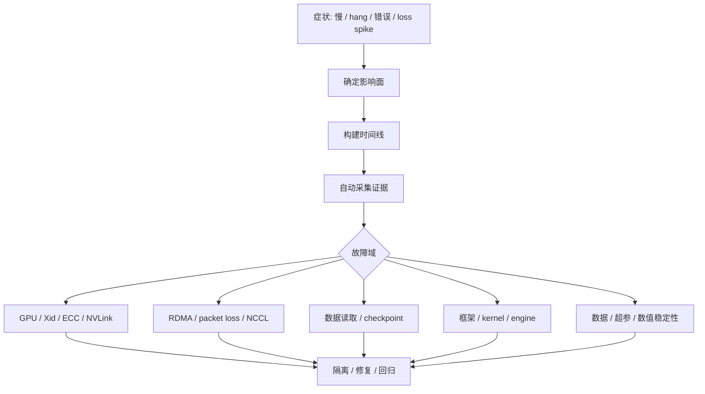
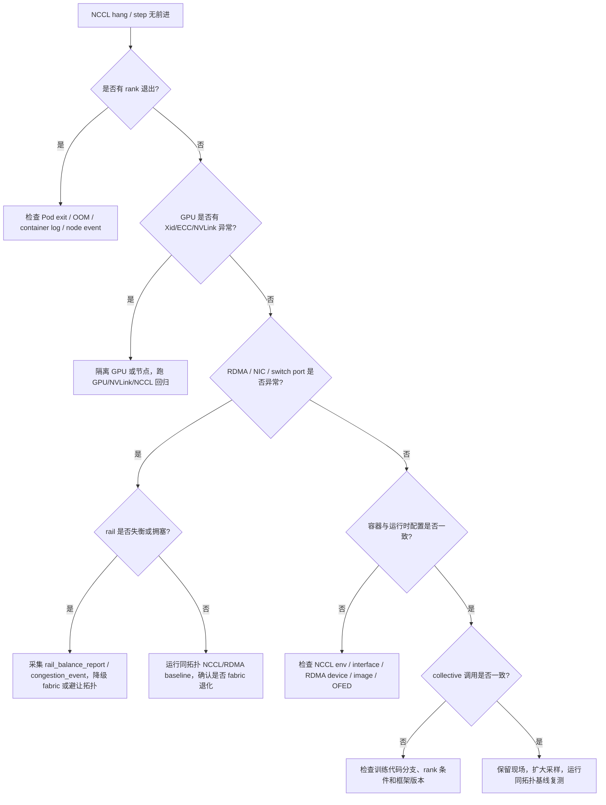
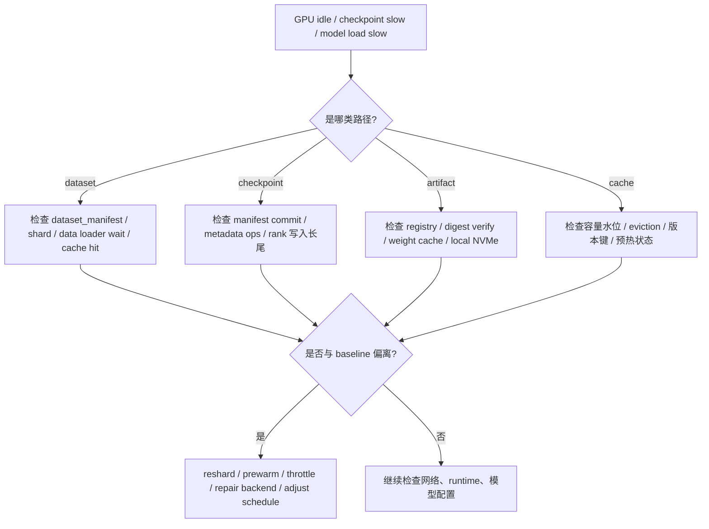
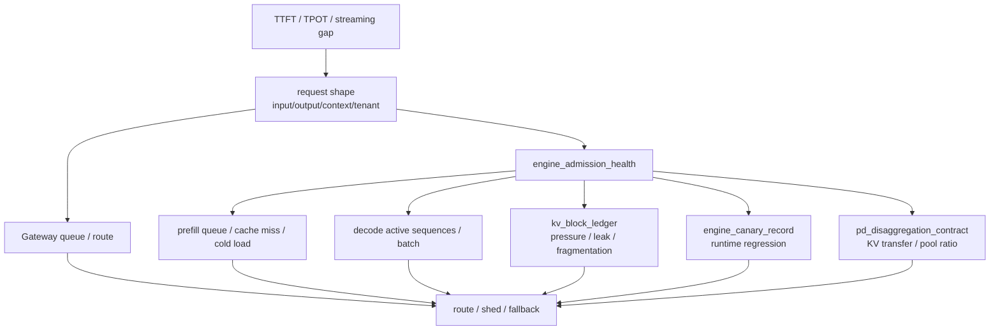
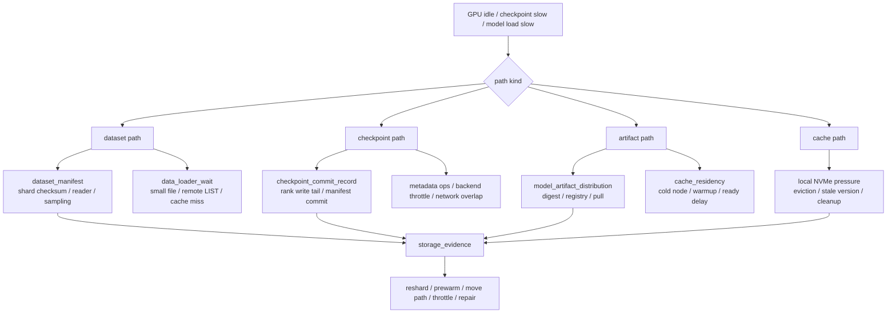

# 第 39 章：故障诊断

## 本章回答的问题

- AI Factory 故障为什么常常跨越模型、运行时、调度、GPU、网络和存储？
- GPU Xid、ECC、NVLink、RDMA、packet loss、NCCL hang、training loss spike 和 inference latency spike 应如何诊断？
- 如何建立故障树分析，而不是依赖经验逐层猜测？

## 一个真实场景

一个 512 卡训练任务运行到第 6 小时突然 hang。训练日志停在 AllReduce，某个 rank 不再输出。GPU 指标显示部分卡 idle，网络端口有少量重传，某个节点日志里出现过一次 Xid，checkpoint 周期刚刚结束，调度系统没有显示 Pod 被驱逐。模型团队怀疑代码，网络团队怀疑 fabric，平台团队怀疑某个节点异常。每个方向都有一点证据，但没有一个证据足以单独解释整个故障。

另一个推理事故中，某个模型的 TTFT 在晚高峰升高。网关没有限流，模型服务 replica 都是 ready，GPU utilization 不算高，但 HBM 水位接近上限，权重缓存命中率下降，部分新 replica 正在冷启动。用户看到的是“模型慢了”，而系统里同时存在流量、缓存、GPU、水位和调度多个变量。若没有标准诊断路径，团队会反复猜测。

AI Factory 的故障诊断必须从症状出发，按证据逐步缩小范围：是请求慢、任务 pending、GPU 异常、通信 hang、网络丢包、存储慢，还是模型数值问题。诊断不是靠专家记忆猜测，而是围绕时间线、拓扑、影响面和基线构建证据链。

这个场景的关键教训是，故障越跨层，越不能先选立场。先说“肯定是网络”或“肯定是模型”都会让团队错过证据。正确做法是先保留现场，再确认影响面，再按故障树排除。诊断纪律本身就是可靠性能力。

更实际地说，诊断会议的第一句话不应是“谁来修”，而应是“我们已经知道什么，哪些证据还缺失，哪些动作会破坏现场”。只要这个顺序稳定，复杂故障就会从争论变成收敛过程。

这也是本章的核心方法：不把故障看成单点坏了，而看成生产链路中的证据断裂。

## 核心概念

故障诊断是把异常现象映射到可能原因、证据和处置动作的过程。AI Factory 的故障通常跨层传播：一个网络丢包可能表现为 NCCL hang，一个存储慢可能表现为 GPU idle，一个硬件错误可能表现为 loss spike，一个模型版本变化可能表现为 HBM 水位升高。单组件视角很容易误判。

诊断应围绕三条主线展开。第一是时间线：什么时候开始，前后发生了哪些变更、调度、checkpoint、扩容和告警。第二是拓扑：哪些 node、GPU、rank、NIC、rack、rail、storage path 和 model replica 相关。第三是影响面：影响一个请求、一个模型、一个任务、一个租户、一个 rack 还是整个集群。

故障诊断还要区分止血、定位和修复。止血是降低影响，例如回滚、限流、隔离节点、暂停大任务、切换模型或禁用 degraded 资源；定位是找到证据链；修复是消除根因；复盘是把新的证据、指标和 runbook 固化。把这些阶段混在一起，会导致事故中既恢复慢，又没有根因。

故障诊断的成熟度，体现在是否可重复。相同症状是否有相同入口，必要证据是否自动采集，判断分支是否清楚，临时处置是否有风险边界，复盘是否更新故障树。AI Factory 规模越大，越不能依赖少数专家临场排障。

诊断还要有成本意识。一个大训练 hang 每多等十分钟，可能浪费数千 GPU 分钟；一个推理长尾每多持续十分钟，可能影响大量用户请求。诊断流程要同时追求正确和及时，不能无限制追求完美根因后才止血。

证据链的最低标准，是能解释“为什么在这个时间、这个范围、这些对象上发生”。如果一个结论无法同时回答时间、拓扑和影响面，它最多只是线索。把线索写成根因，是很多复发事故的起点。

## 系统架构

故障诊断架构应包含症状入口、影响面判断、时间线构建、证据采集、故障树分支、处置动作和复盘沉淀。症状入口可以来自告警、用户报障、作业失败、SLO 违约或异常检测。影响面判断决定优先级和响应团队。时间线把变更、指标、日志、事件和 workload 阶段对齐。证据采集从应用、runtime、调度、GPU、node、network、storage 和 facility 拉取数据。

架构的关键是自动保留现场。许多 AI 故障在任务被 kill、Pod 被重建、日志轮转、端口计数清零后就无法复盘。诊断系统应在告警触发时保存 request trace、job timeline、rank mapping、NCCL logs、DCGM、RDMA counters、switch port counters、storage metrics、BMC events 和最近变更。现场保留是根因分析的前提。

故障树不是静态文档，而是可执行流程。比如 NCCL hang 的故障树应先判断是否有 rank 退出，再查 GPU/Xid/ECC，再查 RDMA/NIC/端口，再查容器和版本，再查 collective 调用一致性。每个分支都应明确需要哪些证据、如何判断、临时如何止血、长期如何修复。

诊断架构还要和权限系统配合。SRE 可能需要查看节点、GPU、网络和租户影响，但不一定能看到用户 prompt 或私有数据。故障工具应提供脱敏视图和授权流程，让诊断既完整又不越权。

落地时还需要统一对象模型。request、job、rank、pod、node、GPU、NIC、switch port、rack 和 storage path 必须能相互追踪，否则诊断人员会在多个系统之间手工拼表。对象模型越清楚，自动化诊断越容易；对象模型混乱，越多 dashboard 只会制造更多碎片。

诊断架构还应保存“正常时”的基线。没有同型号、同拓扑、同 workload 的健康基线，就无法判断当前带宽、延迟或错误计数是否异常。基线来自准入、周期巡检和历史运行数据，是故障树判断分支的参照物。



诊断系统最终应生成 `incident_record`，把排障现场变成可复盘、可审计、可改进的事实对象：

```yaml
incident_record:
  incident_id: inc-20260619-ttft-rack12
  severity: sev2
  entry:
    source: slo_alert
    symptom: ttft_p99_regression
    detected_at: recorded
  impact:
    tenants: measured
    models: [af-chat-large]
    requests_failed_or_slow: measured
    wasted_gpu_hours: calculated_if_applicable
    estimated_margin_impact: calculated
  timeline:
    first_signal: recorded
    mitigated_at: recorded
    recovered_at: recorded
  evidence:
    reliability_evidence_id: rel-evt-001
    recent_changes: [chg-gpu-baseline-20260619]
    health_records: [resource-health-017-2]
    fault_domains: [dc-a/rack-12]
    baselines_compared: [h100-rack12-20260619]
  mitigation:
    immediate_actions:
      - reroute_model_endpoint
      - isolate_degraded_node
    user_communication: required_if_customer_visible
  root_cause:
    status: confirmed_or_probable_or_unknown
    category: change_regression
    confidence: medium
  follow_up:
    - update_change_safety_case_stop_condition
    - add_baseline_invalidation_rule
    - improve_canary_coverage
```

这个对象的重点是防止事故知识丢失。一次事故不只是“某个节点坏了”，还包括谁受影响、哪些证据支持结论、哪些止血动作有效、哪些基线漏测、哪些变更门禁失效、浪费了多少 GPU 小时或毛利。没有 `incident_record`，复盘会变成会议纪要；有了它，事故可以反向更新准入、变更、资源池和成本模型。

网络与通信类故障尤其需要把故障树和证据链结合。下面的 NCCL hang 入口可以作为值班系统的自动检查顺序：



这张图的重点不是穷尽所有原因，而是保证前四类高频问题不会被遗漏：rank 退出、GPU/互联异常、RDMA/fabric 异常、容器或运行时漂移。每个分支都应对应自动采集项，不能只写在文档里。

网络分支里还要避免“看到端口计数就归因网络”的粗糙判断。更可靠的顺序是：先确认 slow op 和 affected ranks，再查这些 rank 的 GPU/NIC/rail/switch port，随后比较 `rail_balance_report`、`congestion_event_record` 和 `fabric_baseline`。如果端口计数异常但没有 rank 等待，可能只是旁路流量；如果 rank 等待明显但端口计数正常，可能是 NCCL interface 选择、container RDMA 可见性或 collective 调用顺序问题。诊断系统应把这两类情况分开。

```yaml
nccl_hang_network_branch:
  symptom: nccl_hang_or_step_no_progress
  required_order:
    - identify_last_collective_and_affected_ranks
    - map_rank_to_gpu_nic_rail_switch_port
    - compare_with_fabric_baseline
    - attach_rail_balance_report
    - attach_congestion_event_record_if_present
    - verify_container_rdma_and_nccl_interface
  verdicts:
    rail_imbalance:
      evidence: rail_balance_ratio_below_policy
      action: reschedule_or_fix_rank_mapping
    fabric_congestion:
      evidence: ecn_pfc_rdma_retransmit_correlates_with_rank_wait
      action: degrade_fabric_or_throttle_competing_traffic
    runtime_interface_mismatch:
      evidence: nccl_selected_interface_not_in_affinity_report
      action: fix_runtime_template_or_env
    insufficient_evidence:
      action: preserve_evidence_and_rerun_same_topology_baseline
```

这个分支能把网络、调度和 runtime 的责任边界拆开。rail 失衡通常优先查放置和接口选择；拥塞事件通常优先查流量叠加、QoS 和容量；同拓扑 baseline 退化更像 fabric 或硬件问题；容器内接口错配则属于 runtime 模板或设备注入问题。分类越早，止血动作越准确。

存储类故障也需要独立故障树，因为它们经常伪装成 GPU、网络或模型问题。GPU idle 可能来自 data loader，TTFT 上升可能来自权重 cache miss，NCCL 变慢可能被 checkpoint 并发写入放大。



这个故障树要求先确认路径语义，再查对应证据。不要看到 GPU idle 就直接扩大 batch，也不要看到模型加载慢就盲目扩容副本。存储问题的关键是 path kind 和 manifest。

## 39.1 GPU Xid

GPU Xid 是 NVIDIA 驱动报告的 GPU 错误事件类别。它可能表示应用错误、驱动问题、硬件异常、显存问题、GPU reset、访问非法地址或其它设备状态异常。不同 Xid 的含义和严重程度不同，不能把所有 Xid 都当成同级故障，也不能因为 GPU 仍可见就忽略严重 Xid。

排查 Xid 时要收集时间、GPU UUID、节点、进程、容器、job、tenant、driver、CUDA、GPU 型号、温度、功耗、ECC、PCIe/NVLink 状态、最近任务和是否伴随掉卡。还要看 Xid 是否重复、是否集中在某张卡、是否出现在特定 workload、是否与驱动升级或温度变化相关。单次 Xid 与持续 Xid 的处理策略应不同。

处置上，应按 Xid 类型和影响面分级。轻微或应用触发的事件可以观察并关联任务；严重或重复 Xid 应将 GPU 或节点标记 degraded，阻止新的长训练任务进入；伴随掉卡、不可纠正错误或任务大面积失败时，应隔离并维修。自动重启任务不能替代根因分析。

Xid 还应进入复盘和准入。维修后要重新跑 GPU burn-in、相关 workload 和驱动基线；同批次节点若出现类似 Xid，要做批次分析。Xid 是设备信号，但它影响的是训练进度、推理 SLA 和 GPU 小时成本。

Xid 诊断还要注意上下文。某些 Xid 可能由用户代码非法访问触发，某些则更像硬件或驱动问题。平台应结合容器退出码、内核日志、驱动版本和是否跨任务复现判断，避免把用户错误误判为坏卡，也避免把坏卡继续交给用户。

工程上可以把 Xid 分成观察、降级、隔离和维修四类动作，并把规则写入资源池。规则不应只看错误码，还要看重复次数、任务价值、是否跨租户复现和是否影响可重复测试。这样处理既避免过度下线，也避免把高风险设备交给关键训练。

## 39.2 ECC error

ECC error 是显存纠错相关错误。可纠正错误说明硬件成功修复了位错误，但频繁出现意味着风险上升；不可纠正错误通常需要严肃处理，可能导致任务失败、数据错误或 GPU reset。对于长时间训练任务，显存稳定性直接关系到训练可信度和恢复成本。

诊断 ECC 要看错误类型、计数增长速度、是否集中在某张卡、是否伴随 Xid、是否与温度、功耗或特定 workload 相关。还要区分历史累计值和当前窗口增长。许多误判来自只看累计计数，不看增长趋势。生产系统应保存时间序列，而不是只在事故时读取当前值。

对于不可纠正 ECC，应隔离 GPU 或节点并走维修流程。对于可纠正但增长明显的 ECC，应根据资源等级处理：高优训练池可以更保守，低优批量池可以观察但标记风险。不要让高价值长训练运行在有异常趋势的 GPU 上，因为失败代价远高于提前隔离。

训练 loss spike 与 ECC 并不总有因果关系，但硬件错误是必须排除的因素。若 loss spike 与特定节点、GPU 或时间窗口相关，同时 ECC/Xid 有增长，应优先隔离并复测。若没有硬件证据，再继续查数据、学习率、混合精度和代码变更。

ECC 事件还应影响资源等级。高优训练池对 ECC 趋势更敏感，低优实验池可以采用观察策略，但必须透明标记。这样既避免过度浪费资源，也保护关键任务的可信度。硬件风险应被资源池表达，而不是藏在监控角落。

验收和维修回池也要包含 ECC 口径。更换硬件、重装驱动或重启节点后，如果只看设备可见性，就可能把趋势性显存问题放回生产。回池前应比较错误计数是否清零、压力测试期间是否继续增长，以及同批次设备是否出现类似模式。

## 39.3 NVLink error

NVLink error 表示 GPU 间互联路径存在异常。它可能导致节点内通信带宽下降、NCCL 性能变差、tensor parallel 推理变慢或训练任务 hang。NVLink 问题不一定让 GPU 消失，因此很容易被只看 GPU 可见性的健康检查漏掉。对强 GPU 间通信 workload，它是关键风险。

排查 NVLink error 时，要看 NVLink 状态、错误计数、GPU-to-GPU 带宽矩阵、单节点 NCCL、DCGM、驱动日志、BMC 事件和服务器拓扑。若某个 GPU pair 异常，需要判断是链路、NVSwitch、GPU、PCIe 还是固件问题。维修后要重新跑 nvbandwidth 和单节点 NCCL，而不是只确认设备重新出现。

NVLink 退化会影响调度语义。资源池如果仍把该节点标记为完整 NVSwitch 域，tensor parallel 服务或单节点训练会持续被影响。平台应支持将节点从强通信池降级到低优或弱通信池，直到互联基线恢复。这样比完全下线更灵活，也比无差别调度更安全。

对推理服务，NVLink error 可能表现为 TPOT 上升、tokens/s 下降或多 GPU replica 长尾增加。对训练任务，可能表现为单节点 collective 变慢或 rank skew。诊断时必须把 NVLink 指标与模型并行策略和 GPU placement 关联。

NVLink 故障还要区分链路退化和调度错误。如果任务本来被放到跨域 GPU 上，性能差不一定是硬件故障；如果同域基线突然下降，才更像互联退化。诊断必须比较“期望拓扑”和“实际拓扑”。

因此，调度系统需要记录 placement 决策。一个 tensor parallel replica 被放在哪些 GPU 上、这些 GPU 是否处于同一个 NVSwitch 域、当时节点健康状态如何，都应进入 trace。否则性能回归发生后，只能从当前状态倒推，无法证明当时的拓扑是否满足预期。

如果没有 placement 记录，NVLink 诊断只能停留在猜测层面，无法区分调度、硬件和 runtime 责任边界。

## 39.4 RDMA error

RDMA error 涉及 NIC、driver、firmware、OFED、交换机、RoCE/InfiniBand 配置、MTU、PFC/ECN、GID、权限、CNI 和容器设备注入。它常表现为 NCCL timeout、吞吐下降、偶发 hang、checkpoint 慢或跨节点推理抖动。RDMA 故障的难点在于它经常跨主机、网络和容器边界。

排查 RDMA 要同时看主机和网络侧：NIC counters、RDMA counters、driver/firmware、GID、MTU、容器内设备、NCCL 日志、交换机端口、PFC/ECN、链路状态、rail 和 rack。只在容器内重启任务，往往无法解决根因；只看交换机端口，也无法判断影响了哪个 job 和 rank。

RDMA 故障应按 topology 分析。一个 rail 异常会让部分 rank 慢，从而拖住整个训练；某个 rack 的配置漂移可能只影响跨 rack 大任务；某个容器权限问题可能只影响 Kubernetes 作业，不影响宿主机测试。诊断包必须包含 rank-to-node、node-to-NIC、NIC-to-switch 和 job 时间线。

处置策略包括隔离 suspect NIC、禁用异常 rail、阻止新大任务进入相关拓扑域、回滚 OFED/firmware/网络配置、重跑 RDMA 和 NCCL baseline。RDMA error 不应只作为网络告警，它直接影响 GPU 小时效率。

RDMA 诊断还应记录容器视角。宿主机 RDMA 正常但容器缺设备、权限或库路径，是 Kubernetes GPU 集群的常见问题。生产任务运行在容器里，最终证据必须来自容器内路径，而不只是宿主机测试。

另一个容易被忽略的点是配置一致性。RDMA 依赖主机内核、驱动、固件、交换机、CNI 和应用环境变量同时正确，任何一层漂移都可能只在大规模作业中暴露。平台应保存每个节点的版本指纹，并在故障时把异常节点与同批健康节点比较，而不是只看单点配置是否“看起来正确”。

对于 RoCE，拥塞控制尤其需要证据化。PFC pause、ECN mark、队列丢弃和重传之间有因果关系，但不能凭单个计数判断。只有把端口、队列、业务流和 rank 时间线对齐，才能判断是链路故障、拥塞热点还是配置错误。

## 39.5 packet loss

Packet loss 是网络包丢失。对普通 HTTP 服务，少量丢包可能表现为重传和延迟；对 RDMA、NCCL 和同步训练任务，少量丢包也可能放大为 step time 尖刺、通信 timeout 或 hang。AI 训练的同步特性让局部丢包影响全局进度。

丢包来源包括物理链路、光模块、交换机拥塞、队列溢出、MTU 不一致、PFC 配置不当、ECN 配置错误、流量热点、错误 cabling 和故障绕行。诊断时要区分持续丢包和突发丢包。持续丢包更像链路或配置问题，突发丢包可能与 checkpoint、权重加载、多任务混部或流量热点相关。

排障应把端口计数和任务时间线对齐：丢包是否发生在 step time spike 同一时间，是否只影响某个 rack、某些节点或某条 rail，是否与 checkpoint 或多任务并发相关。分钟级平均可能掩盖短时丢包，因此关键 fabric 要保留更细粒度 counters 和事件。

处置上，先降低影响面：暂停新大训练进入 suspect domain，必要时迁移推理副本，限制突发存储或权重加载流量。根因处理则可能是换线缆/光模块、调整 PFC/ECN、修正 MTU、改变调度拓扑或扩容热点链路。Packet loss 诊断需要网络和 workload 双视角。

Packet loss 的复盘应回答是否可预防。若来自配置漂移，应补配置审计；若来自流量热点，应补调度或容量；若来自硬件链路，应补准入和巡检。否则下一次丢包仍会以训练 hang 或推理长尾出现。

丢包诊断还要警惕采样窗口。很多网络系统按分钟聚合，训练 step 却可能在几秒内被拖慢。若只看粗粒度平均，结论会变成“没有明显异常”。关键链路应保留短窗口峰值和事件日志，至少能回看事故前后的突发变化。

## 39.6 NCCL hang

NCCL hang 指分布式通信长时间没有前进。它可能来自某个 rank 失败、网络异常、GPU 错误、进程 OOM、容器被驱逐、接口选择错误、版本不兼容、collective 调用不一致或训练代码在某些 rank 走了不同分支。Hang 的难点是它往往没有明确错误码，只表现为任务不再推进。

诊断第一步是确认所有 rank 状态。是否有 rank 退出，是否卡在同一 collective，Pod 是否重启，GPU 是否可用，某个节点是否 NotReady，是否有 OOM、Xid、ECC、RDMA error 或网络端口异常。第二步检查 NCCL 日志、rank 到节点映射、NCCL 环境变量、接口选择、拓扑路径和最近变更。

处置时要先保留现场。自动重启能释放资源，但如果日志、rank 状态、端口计数和 GPU 事件丢失，根因无法复盘。平台应在检测到 hang 后自动归档诊断包，并临时阻止新大任务调度到 suspect 节点或拓扑域。止血和取证要同时进行。

长期治理需要把 NCCL hang 转化为故障树。常见分支包括 rank 退出、网络/RDMA、GPU/Xid/ECC、容器/调度、版本/环境变量、代码 collective 不一致。每个分支都有固定证据和处置动作。这样新 oncall 也能按路径排查，而不是依赖专家在线。

NCCL hang 还应和作业恢复策略结合。若任务有健康 checkpoint，可以先恢复业务进度；若没有 checkpoint，必须优先保留现场再决定是否 kill。诊断和恢复的顺序，要根据任务价值和现场保留能力决定。

对平台而言，最重要的是自动识别“没有前进”。可以通过 step time、日志心跳、GPU 利用率、NCCL 日志和进程状态综合判断。单看 GPU utilization 容易误判，因为某些 hang 场景 GPU 仍有零星活动；单看日志也不够，因为日志可能被缓冲或卡在某个 rank。

## 39.7 training loss spike

Training loss spike 是训练 loss 突然升高、出现异常波动或变成 NaN/Inf。它可能来自数据异常、学习率、混合精度、梯度爆炸、随机性、代码变更、checkpoint 恢复错误，也可能来自硬件或通信错误。Loss spike 是模型信号，但不应只由模型团队排查。

诊断时要先区分数值问题和系统问题。检查数据 batch、dataset version、tokenizer、学习率、gradient norm、loss scaling、overflow、checkpoint 恢复点、代码版本、GPU ECC/Xid、节点重启、NCCL 错误和最近发布。时间线很重要：spike 是否发生在数据切换、恢复、学习率变化、节点异常或通信错误附近。

如果 loss spike 与特定节点、GPU、rank 或硬件事件相关，应怀疑硬件或环境；如果与数据 shard、样本来源或特定 batch 相关，应检查数据质量；如果在特定 step 后出现，应检查训练策略、混合精度和 checkpoint。不要在没有排除系统证据前直接调整超参，否则会掩盖真实问题。

处置上，先保存 checkpoint、数据 batch、日志、硬件事件和随机种子。必要时从上一个健康 checkpoint 恢复，并在隔离 suspect 节点后重跑短窗口验证。Loss spike 的复盘应同时记录模型原因和基础设施证据，避免下一次重复争论。

Loss spike 还应有升级路径。若影响关键预训练，应同时拉模型、数据、平台和硬件团队；若只是单个实验任务，可以先由用户自查数据和代码。影响面决定响应级别，不能所有 loss 波动都按最高事故处理。

复现窗口是 loss spike 诊断的核心资产。平台应帮助用户保留问题 step 附近的数据 shard、checkpoint、随机种子、容器镜像和硬件映射。没有这些信息，事后只能讨论曲线形状，无法证明是数据、代码、数值还是基础设施触发。

## 39.8 inference latency spike

Inference latency spike 是推理延迟尖刺。它可能来自流量突增、队列积压、大 prompt、长输出、prefill 慢、decode 拥塞、KV Cache 不足、冷启动、模型权重加载、网络抖动、限流配置、下游依赖、热降频或特定租户请求形态变化。延迟尖刺必须拆成阶段看。

诊断路径应从用户体验指标进入：TTFT、TPOT、TPOP、E2E latency、错误率和 streaming 中断。TTFT 高常与 gateway 排队、routing、prefill、冷启动和权重加载有关；TPOT 高常与 decode kernel、batching、HBM bandwidth、KV Cache 和 GPU 状态有关。把所有延迟合在一起，会让定位方向错误。

应按 tenant、model、model version、endpoint、replica、node、GPU 和 request shape 切分。只有某个租户慢，可能是上下文过长或配额策略；只有某个 replica 慢，可能是节点、缓存或热状态；所有 replica 都慢，可能是流量、模型版本或共享依赖。切分维度决定诊断速度。

处置包括临时限流、路由到健康 replica、回滚模型或 runtime、预热权重缓存、扩容、降低 batch 或隔离 degraded 节点。复盘时要计算受影响请求、失败 token、SLO 违约和 cost impact。推理故障诊断既要解释技术原因，也要解释用户影响。

Inference latency spike 还要防止平均值掩盖问题。某个租户、某类长 prompt 或某个区域的长尾，可能在全局平均中很小，但对业务非常严重。诊断必须优先按用户可见维度切分，而不是只看全局曲线。

推理延迟诊断还应关联 token 形态。相同请求数下，input token、output token、并发 decode 长度和 KV Cache 占用完全不同，基础设施压力也不同。若只按 QPS 解释峰值，就会误把 token 放大当成系统退化，或者反过来漏掉真正的引擎回归。

因此，推理事故复盘至少要同时给出请求数、token 数、上下文长度分布和输出长度分布。

运行时诊断应进一步落到 `inference_latency_runtime_branch`。这个分支把 Gateway、Model Serving、Runtime 和 streaming 通道的证据放到同一棵树里，先判断慢在 admission 前、prefill、decode、KV 状态、PD transfer、engine canary，还是用户侧连接。这样 oncall 不会因为 GPU utilization 不高就排除 Runtime，也不会因为 endpoint ready 就排除 Serving。



```yaml
inference_latency_runtime_branch:
  symptom:
    ttft_p95: regressed
    tpot_p95: normal_or_regressed
    streaming_gap: observed
  mandatory_evidence:
    request_trace: required
    routing_decision: required
    engine_admission_health: required
    kv_block_ledger: required_for_kv_or_long_context
    engine_canary_record: required_if_recent_runtime_change
    pd_disaggregation_contract: required_if_pd_enabled
  branch_checks:
    gateway_queue:
      signal: gateway_queue_ms_high
      action: tenant_limit_or_route_review
    prefill_pressure:
      signal: prefill_queue_high_or_prefix_cache_miss
      action: split_long_context_or_warm_cache
    decode_pressure:
      signal: active_sequences_high_or_tpot_regression
      action: adjust_batching_or_decode_pool
    kv_pressure:
      signal: kv_block_pressure_high_or_release_latency_high
      action: reduce_context_limit_fix_cancel_release_or_scale_memory_pool
    engine_regression:
      signal: canary_guardrail_failed
      action: freeze_or_rollback_engine_profile
    pd_transfer:
      signal: kv_transfer_ms_high_or_pool_ratio_mismatch
      action: rebalance_prefill_decode_or_fallback_monolithic
```

这个分支也定义了“不能下结论”的条件。没有 request shape，就不能判断 QPS 是否真的异常；没有 `engine_admission_health`，就不能区分 endpoint ready 与 endpoint 可承诺；没有 `kv_block_ledger`，就不能把 HBM 高水位归因到长上下文、泄漏、碎片或 prefix cache；没有 canary 记录，就不能把 runtime 变更排除在外。排障文档应明确这些证据缺失时的下一步采集动作，而不是让值班人员凭经验猜。

## 39.9 故障树分析

故障树分析把故障从症状拆到可能原因、证据和动作。AI Factory 应为高频故障建立标准树：训练 pending、NCCL hang、GPU Xid、推理 TTFT 高、checkpoint 慢、节点 NotReady、存储慢、模型 loss spike 和资源池容量异常。故障树让排障从经验驱动变为流程驱动。

一棵好的故障树包含入口症状、影响面判断、必要指标、日志位置、排除顺序、自动化检查、人工判断点、临时止血、长期修复和复盘字段。它还应说明哪些证据缺失时无法继续判断，避免团队在没有证据时强行归因。故障树不是为了写文档，而是为了减少事故中的认知负担。

故障树应与自动化结合。能自动检查的分支，例如 Pod 状态、GPU Xid、RDMA counters、NCCL 日志、storage latency、最近变更和节点健康，应由系统预先收集；需要人工判断的分支，则给出明确问题和上下文。自动化越多，oncall 越能集中处理真正复杂的判断。

故障树必须从 incident 中更新。每次事故后，如果某个证据缺失，就补指标；如果某个判断依赖专家经验，就沉淀成 runbook；如果某个处置动作有效，就加入止血步骤；如果某个告警误报，就调整阈值。故障树是运行中的知识库。

故障树还应有 owner。没有 owner 的 runbook 很快过期；没有演练的故障树，在事故中可能不可用。关键故障树应定期演练，确保工具、权限、指标和联系人仍然有效。

故障树也要允许“不知道”。当证据不足以区分两个分支时，流程应明确需要补采什么，而不是强行选择一个根因。成熟的诊断体系不是每次都立刻有答案，而是能清楚说明当前证据支持什么、不支持什么、下一步如何验证。

## 工程实现

工程实现的第一步，是为高损失故障定义标准诊断包。NCCL hang 包含 job events、pod status、rank mapping、NCCL logs、GPU Xid/ECC、RDMA counters、switch port counters、node events 和 recent changes；推理 latency 包含 request trace、gateway log、model route、replica、GPU、KV Cache、batch、cache hit 和 model version。诊断包应自动生成。

第二步，是把诊断包和资源状态联动。若某个 GPU 多次触发严重 Xid，资源池应自动隔离；若某个 rack 出现 RDMA 重传和 NCCL 回归失败，调度器应暂缓新大任务进入；若某个模型版本引起 TTFT 回归，发布系统应进入暂停或回滚。诊断不应只输出报告，还应影响系统动作。

第三步，是建设故障知识库。每类故障记录入口症状、必要证据、判断逻辑、止血动作、长期修复、复盘模板和相关 dashboard。知识库应与 oncall 工具连接，事故发生时能直接打开对应 runbook，而不是让值班人员在文档站搜索。

```yaml
diagnosis:
  symptom: nccl_hang
  collect:
    - job_events
    - pod_status
    - rank_to_node_mapping
    - nccl_logs
    - gpu_xid_ecc
    - rdma_counters
    - switch_port_counters
    - recent_node_events
  first_actions:
    - preserve_logs
    - mark_suspect_nodes
    - prevent_new_large_jobs_on_suspect_domain
  resolution:
    - isolate_bad_gpu_or_nic
    - rerun_nccl_test
    - compare_with_acceptance_baseline
```

网络诊断包需要进一步包含拓扑和端口证据：

```yaml
network_diagnosis:
  symptom: nccl_hang
  evidence:
    rank_mapping: required
    gpu_to_nic_affinity: required
    nic_to_switch_port: required
    rail_mapping: required
    fabric_baseline_id: required
    rdma_counters: required
    switch_port_counters: required
    nccl_selected_interface: required
    container_rdma_visibility: required
  decisions:
    isolate_single_node_if:
      - errors_concentrated_on_one_node
      - baseline_fails_on_same_node
    degrade_fabric_if:
      - errors_spread_across_rail
      - cross_rack_baseline_regresses
    suspect_runtime_if:
      - host_rdma_passes
      - container_rdma_fails
      - nccl_interface_mismatch
```

这个对象把“网络可能有问题”拆成三种不同动作：隔离单节点、降级 fabric、修复 runtime。动作不同，责任团队和恢复路径也不同。没有这个拆分，事故中很容易把所有网络相关现象都交给同一个团队处理。

对应地，存储诊断包应描述路径、manifest、缓存和影响：



```yaml
storage_diagnosis:
  symptom: checkpoint_slow
  evidence:
    workload_id: required
    storage_intent_id: required
    path_kind: checkpoint
    checkpoint_manifest: required
    checkpoint_commit_record: required
    rank_write_latency: required
    metadata_ops: required
    storage_backend_counters: required
    cache_state: required_if_applicable
    network_overlap_window: required
  decisions:
    reshard_dataset_if:
      - small_file_metadata_dominates
      - data_loader_wait_correlates_with_shards
    adjust_checkpoint_if:
      - rank_write_tail_dominates
      - manifest_commit_delays_training
    prewarm_artifact_if:
      - model_load_time_blocks_readiness
      - cache_miss_burst_correlates_with_scaleout
```

这个诊断包把存储排障从“哪个系统慢”推进到“哪条数据路径导致哪个 workload 慢”。它也能把结果回写到准入和调度：checkpoint-heavy 训练避开 limited 存储池，推理高峰前预热权重缓存。

存储故障树还要避免一个常见错误：把所有 GPU idle 都归到存储。只有当 `storage_evidence` 能证明 data loader wait、checkpoint pause、model load delay 或 cache miss 与 GPU idle 在同一时间窗口、同一 workload 和同一 path kind 上相关，才能把事故归入存储域。若 evidence 只显示存储端平均延迟升高，但没有 workload impact，最多说明有风险，不能直接作为根因。

第四步，是把诊断结果回写系统。坏节点进入维修，坏 rail 降级，缺失指标进入可观测性 backlog，准入漏测项进入 acceptance pipeline，重复事故进入 SRE 复盘。诊断闭环不完成，故障知识就无法转化为系统能力。

第五步，是把诊断工具放到值班路径里。告警页面应直接提供诊断包入口、相关 runbook、最近变更、影响面和建议止血动作，而不是只给一条 Prometheus 表达式。事故中最稀缺的是注意力，工具应减少人工跳转和重复查询。

最后要建立回归验证。隔离、维修、升级、回滚或配置修改后，必须用与故障相关的基线验证恢复，例如 NCCL hang 后重跑对应拓扑的 NCCL test，推理长尾后重放代表性请求。没有回归验证，处置只是“症状暂时消失”。

回归验证结果应回写到资源池和变更记录，作为下一次调度、发布和验收的依据。

## 常见故障

第一类故障是自动重启清理了现场。任务恢复了，但日志、rank 状态、端口计数和容器现场都没了，根因无法复盘。解决方向是在重启或清理前自动归档诊断包，至少保存关键时间窗口的指标、日志和拓扑。

第二类故障是只看应用日志。应用日志能说明业务症状，但无法解释 GPU、网络、存储、调度和设施状态。解决方向是从症状出发自动关联基础设施证据。尤其是 NCCL hang、训练 loss spike 和推理长尾，单一日志视角很容易误导。

第三类故障是影响面不清。单节点问题被当成全局事故，或者全局网络问题被当成单任务失败。解决方向是先做 scope 判断：影响哪些 tenant、model、job、node、rack、rail 和 fabric。影响面决定优先级和止血动作。

第四类故障是处置只恢复任务，没有更新故障树。事故结束后，没有补指标、补 runbook、补自动化或调整准入，导致下次同类故障继续依赖人工经验。解决方向是把复盘行动项纳入工程 backlog，并跟踪完成。

第五类故障是过早归因。看到 Xid 就认定坏卡，看到重传就认定网络，看到 loss spike 就认定数据，都会造成错误处置。解决方向是要求每个根因结论至少有时间线、影响面和对照基线三类证据支撑。

第六类故障是权限和数据边界阻断诊断。SRE 看不到租户维度，网络团队看不到 job 映射，模型团队看不到 GPU 事件，结果每个团队只能证明自己这一层“没问题”。解决方向是建设脱敏的跨层诊断视图，让必要证据可见而敏感内容不可见。

第七类故障是基线缺失。没有健康样本，就无法判断当前指标偏离多少，只能凭经验争论。

## 性能指标

诊断流程指标包括 MTTD、MTTA、MTTR、MTTI、复发率、自动诊断命中率、误报率、人工升级次数和现场保留成功率。它们衡量故障诊断体系本身是否有效。恢复快但复发率高，说明根因修复不足；告警多但命中率低，说明噪音过大。

影响指标包括每类故障影响的 GPU 小时、token 数、请求数、任务数、租户数、SLO 违约和收入影响。AI Factory 的故障不应只按次数排序，而应按损失排序。一次大训练 hang 可能比几十个低优任务失败更重要。

故障信号指标包括 Xid/ECC/NVLink/RDMA/packet loss 事件频率、NCCL hang 次数、training loss spike 次数、inference latency spike 次数、checkpoint failure、storage timeout 和 node NotReady。它们用于发现高频故障类型和系统性退化。

知识库指标包括 runbook 覆盖率、诊断包完整率、复盘行动项完成率、故障树更新次数和重复事故比例。故障诊断不是只看单次事故，更要看组织是否在学习。重复事故比例高，说明知识没有真正进入系统。

这些指标应按故障类型分组。GPU、网络、存储、模型、调度和推理服务的诊断成熟度可能完全不同。分组后才能知道下一阶段应该补哪个领域的自动化和 runbook。

还应跟踪证据质量指标，例如诊断包缺失率、rank mapping 缺失率、端口计数回看成功率、日志保留窗口覆盖率和基线可用率。很多事故复盘失败不是因为没人努力，而是关键证据在事故发生前就没有被系统保存。

指标解释必须避免单点崇拜。MTTR 下降可能是止血更快，也可能是过早关闭事故；自动诊断命中率提高可能是真有效，也可能是分类过粗。SRE 应把流程指标、影响指标和复发指标放在一起看，才能判断诊断体系是否真正进步。

## 设计取舍

第一个取舍是快速止血与完整取证。生产系统应先降低影响，例如回滚、限流、隔离或迁移；但如果每次都立即清理现场，就无法根因分析。较好的做法是在自动止血前后保留必要诊断包，让恢复和取证同时进行。

第二个取舍是自动化隔离与误伤风险。自动隔离坏 GPU、NIC 或 rack 能保护生产，但规则过粗会误隔离大量资源，影响利用率。应按资源等级、故障严重度、重复次数和影响面分层处理。高优训练池可以更保守，低优资源池可以更多观察。

第三个取舍是通用 runbook 与专业判断。通用故障树能覆盖高频问题，但复杂事故仍需要专家判断。目标不是消灭专家，而是把专家从重复收集证据中解放出来，让他们处理真正新的问题。故障树提供下限，专家提升上限。

最终，故障诊断体系要让 AI Factory 具备记忆。每次事故都应让指标更完整、runbook 更清晰、自动化更有效、准入更严格或设计更稳健。没有记忆的系统，会在规模扩大后反复为同类问题付费。

设计时还要控制流程重量。低优小故障可以轻量处理，高影响事故必须完整复盘。把所有问题都按同一流程处理，会拖慢团队；把所有问题都轻量处理，又学不到经验。分级是关键。

还有一个取舍是集中式诊断平台与团队自有工具。集中平台提供统一对象模型和证据链，团队工具保留专业深度。更现实的做法是统一入口、统一事件和统一关联键，同时允许 GPU、网络、模型团队维护自己的深度分析工具。统一不等于抹平专业差异。

## 小结

- AI Factory 故障通常跨层传播，不能只按单组件排查。
- 时间线、拓扑和影响面是诊断的三条主线。
- GPU、网络、存储、运行时和模型指标要能关联。
- 故障树和 runbook 应从真实 incident 中持续演进。

## 延伸阅读

- [NVIDIA Xid Errors documentation](https://docs.nvidia.com/deploy/xid-errors/)；[NVIDIA DCGM documentation](https://docs.nvidia.com/datacenter/dcgm/latest/)
- [NCCL Troubleshooting Guide](https://docs.nvidia.com/deeplearning/nccl/user-guide/docs/troubleshooting.html)
- [Google SRE: Postmortem Culture](https://sre.google/sre-book/postmortem-culture/)
- [NVIDIA GPUDirect RDMA documentation](https://docs.nvidia.com/cuda/gpudirect-rdma/)
