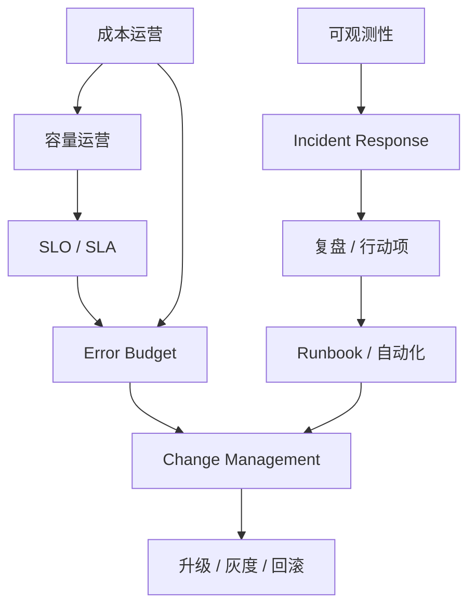
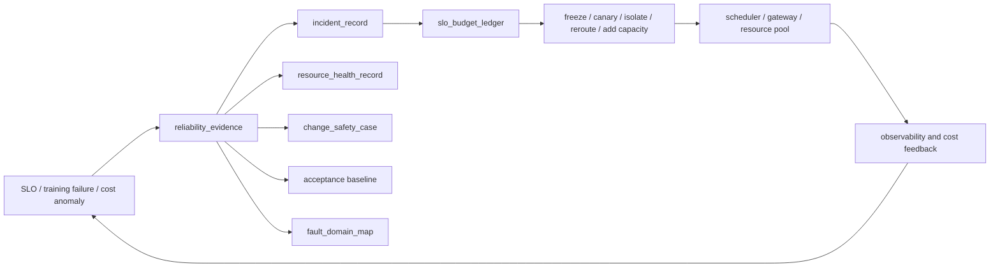
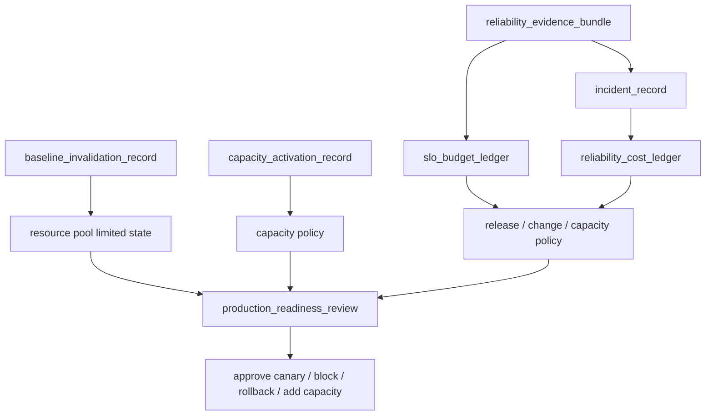

# 第 40 章：SRE 与运维体系

## 本章回答的问题

- AI Factory 的 SRE 与普通云服务 SRE 有哪些不同？
- SLO、SLA、error budget、incident、change management、upgrade、capacity operation 和 cost operation 如何落地？
- 如何把可靠性、容量和成本放到同一个运行体系中？

## 一个真实场景

一个 MaaS 平台发布新推理引擎版本后，部分模型 TTFT 明显下降，但另一些模型出现间歇超时。平台团队想快速推广新版本，因为它能降低 cost per token；业务团队担心 SLA；基础设施团队同一周还计划升级 GPU driver 和 NCCL。若没有 SLO、变更窗口、灰度策略、停止条件和回滚标准，所有团队只能靠会议协调，事故发生后也很难归因。

另一个训练集群场景中，资源利用率长期很高，但用户抱怨大任务排队时间不可预测，抢占后恢复失败率高，checkpoint 存储成本持续增长。单看 GPU utilization，平台似乎运营良好；从用户和成本视角看，系统并不健康。AI Factory SRE 必须同时看可靠性、容量和经济性。

SRE 的价值，是把可靠性目标、变更纪律、容量管理、成本约束和事故响应制度化，让 AI Factory 能持续生产 token 和模型，而不是靠英雄式救火。对 AI Factory 来说，SRE 不是只守 API 可用性，还要守 GPU 资源池、训练作业、模型服务、网络、存储、驱动和物理基础设施的生产能力。

这个场景说明，AI Factory 的运行问题通常不是“要不要稳定”这么简单，而是“用多少风险换多少效率”。新引擎可能降低成本，驱动升级可能提高性能，模型发布可能带来收入，但每个变化都消耗可靠性预算。SRE 让这些取舍可见、可控、可复盘。

因此，AI Factory 的 SRE 不是单独的运维岗位，而是一套生产治理机制。它要求每次发布、扩容、降本和维修都能回答三个问题：影响哪个 SLO，消耗多少风险预算，出了问题如何止血和复盘。

如果这些问题没有答案，所谓运维就会退化成事后救火，而不是生产系统管理。

## 核心概念

SRE 是 Site Reliability Engineering，把软件工程方法用于可靠性运营。AI Factory 的 SRE 不只覆盖 API 服务，还覆盖训练作业、GPU 资源池、调度器、MaaS、模型服务、推理引擎、训练框架、网络、存储、driver、GPU Operator、镜像、计费和机房交付。它的对象比传统 Web 服务更跨层。

AI Factory 的可靠性目标要同时面向在线推理和离线训练。推理关注可用性、TTFT、TPOT、错误率、限流、token streaming 和模型版本；训练关注作业成功率、排队可解释性、恢复能力、checkpoint 成功率、非用户原因失败和浪费 GPU 小时；基础设施关注资源可交付、健康、准入和维修回池。

SRE 还要把可靠性和成本放在一起。过度冗余会提高 SLA 但增加 cost per token；过度提高利用率会降低成本但消耗 error budget；频繁升级能提升性能但增加事故风险；保守变更能稳定系统但可能错过效率收益。SRE 的职责是让这些取舍显性化，并用数据驱动决策。

AI Factory 的运行体系应形成闭环：定义 SLO/SLA，计算 error budget，约束变更和升级，响应 incident，复盘并更新 runbook，运营容量，优化成本，再反过来调整 SLO 和资源策略。没有闭环，SRE 会退化为告警处理。

这个闭环还要求角色清晰。模型团队负责模型质量和版本，平台团队负责服务和调度，基础设施团队负责 GPU、网络和存储，SRE 负责把目标、证据、流程和复盘串起来。SRE 不是替所有团队背锅，而是让系统责任可执行。

运维体系还要区分“服务健康”和“生产能力健康”。API 可用但训练队列不可解释、GPU 资源长期 degraded、checkpoint 成本失控，都说明 AI Factory 的生产能力在下降。SRE 的指标必须覆盖从 token 交付到模型产出的全链路。

## 系统架构

AI Factory SRE 架构包括目标层、观测层、控制层和改进层。目标层定义 SLO、SLA、error budget 和资源等级；观测层提供 metrics、logs、traces、events、baselines 和成本数据；控制层执行 change management、灰度、回滚、限流、隔离、扩容、维修和调度策略；改进层通过 postmortem、runbook、自动化、容量复盘和成本复盘持续优化。

架构的关键是把 SLO 与行动连接起来。推理 TTFT 违约不只是告警，还可能触发扩容、限流、模型路由切换或回滚；训练非用户失败率上升不只是统计，还可能冻结驱动升级、隔离节点或调整准入；error budget 消耗过快，不只是报告，还应影响发布节奏和变更审批。

SRE 架构还要连接容量与成本。容量系统预测 GPU、网络、存储和电力需求，成本系统计算 cost per token、GPU 小时、tokens/W 和毛利，SLO 系统定义用户承诺。三者必须相互约束：不能只追求 SLA 不看成本，也不能只追求利用率不看可靠性。AI Factory 是生产系统，不是单纯技术平台。

架构还应包含治理节奏。每日看告警和 incident，每周看变更和 error budget，每月看容量和成本，每季度看资源等级和架构债。没有固定节奏，SRE 会被突发事件牵着走，长期问题得不到处理。

在实现上，SRE 架构需要统一事实源。SLO 平台、变更系统、incident 系统、容量系统和成本系统若各自维护对象名称，事故时就无法对齐同一个 model、tenant、cluster、node 或 GPU pool。统一事实源不一定是一个数据库，但必须有稳定的标识、事件时间线和关联规则。

还要把人工流程转成机器可验证的门禁。例如变更申请写了“已验证”，系统应能看到具体基线结果；容量报告说“余量充足”，系统应能追溯使用的预测口径；事故复盘说“行动项完成”，系统应能关联到代码、配置或 runbook 更新。



在 AI Factory 中，这个控制回路还要接入资源事实。SLO 违约不是单独的服务事件，可能来自 resource health、maintenance window、change safety、acceptance baseline 或 fault domain。更完整的可靠性回路如下：



这张图表达的不是工具集成，而是治理顺序：先确认用户或生产能力是否受影响，再收集证据，再进入 incident、健康状态、变更安全、基线和故障域，最后由 error budget 和成本影响决定动作。缺少这个回路，SRE 很容易只处理告警，而不能改变调度、发布和资源治理。

## 40.1 SLO

SLO 是 Service Level Objective，服务等级目标。AI Factory 的 SLO 应按服务类型定义。在线推理可以定义 availability、TTFT、TPOT、E2E latency、错误率、限流率、token streaming 中断率和模型路由成功率；训练平台可以定义作业准入延迟、排队可解释率、作业成功率、checkpoint 成功率、恢复时间和非用户原因失败率。

SLO 要从用户体验出发，而不是从单个组件指标出发。GPU utilization、PFC pause、HBM 水位和 storage latency 都是解释指标，不是用户直接感知的 SLO。用户感知的是请求是否成功、首 token 是否快、输出是否稳定、任务是否能启动、失败后能否恢复。组件指标用于解释 SLO 变化。

不同模型、租户和资源等级可以有不同 SLO。高价值生产模型需要严格 TTFT 和可用性，实验模型可以 best-effort；关键训练任务需要更强 checkpoint 和恢复保证，低优批量任务可以接受抢占。SLO 分级能避免用同一成本服务所有场景。

工程上，SLO 必须可计算、可告警、可复盘。每个 SLO 都要定义数据来源、计算窗口、排除项、owner、告警阈值和复盘口径。没有数据支撑的 SLO 是愿望；没有 owner 的 SLO 是口号；没有行动的 SLO 是看板。

SLO 还应定期校准。模型变大、上下文变长、用户流量变化或硬件升级后，旧 SLO 可能不再合理。校准不是降低标准，而是确保目标反映业务价值、技术能力和成本约束。

定义 SLO 时还要明确错误预算的消费方式。一次短时大面积不可用、长时间轻微延迟退化和少量高价值租户失败，对业务的意义不同。SLO 如果只用全局平均，很容易奖励“看起来稳定”的系统，却忽略真正重要的用户影响。

## 40.2 SLA

SLA 是 Service Level Agreement，服务等级协议，通常是对外或跨组织承诺。SLA 应基于可实现的 SLO，而不是营销承诺。AI 服务的 SLA 要明确边界：模型不可用、限流、用户输入过长、客户网络问题、下游依赖异常、计划维护、违规请求和不可抗力是否计入。边界不清，争议会在事故后爆发。

对推理平台，SLA 更接近传统在线服务，但要加入 AI 特有指标，例如 token streaming 中断、模型级可用性、上下文长度限制、请求超时、fallback 行为和计费准确性。一个 API 返回 200 但 streaming 中途断开，对用户仍然是失败体验。SLA 口径必须覆盖 token 交付。

对训练平台，SLA 不一定承诺“任务立刻运行”，因为 GPU 资源昂贵且受 quota、gang scheduling 和拓扑限制。更合理的承诺是队列透明、配额可解释、资源池可用性、非用户原因失败率、checkpoint 恢复能力和故障处理时间。训练 SLA 应围绕作业生命周期，而不是传统请求延迟。

SLA 还应与计量、计费和赔付边界一致。没有统一 trace、日志和指标，就无法判断违约是否发生；没有租户和模型维度，就无法计算影响范围。SLA 是法律和商业承诺，必须由可观测性和运营流程支撑。

对内 SLA 同样重要。平台团队可以向模型团队承诺资源池可用性，存储团队可以承诺 checkpoint 服务等级，网络团队可以承诺 fabric 基线。内部 SLA 能减少跨团队模糊地带，让依赖关系可管理。

SLA 还要避免承诺无法控制的内容。若平台无法控制用户 prompt 长度、下游工具服务或客户侧网络，就不能把这些因素无条件纳入赔付口径。成熟的 SLA 会把可控范围、排除项、证据来源和争议处理写清楚，减少事故后的口径争夺。

## 40.3 error budget

Error budget 是允许系统在一定周期内消耗的错误预算。它把可靠性和迭代速度连接起来。如果预算充足，可以加快发布和优化；如果预算耗尽，应冻结高风险变更，优先修复稳定性。没有 error budget，团队很容易在“快发版”和“保稳定”之间用情绪争论。

AI Factory 的 error budget 可以按模型、平台服务、训练集群、租户或资源池定义。推理服务的预算来自错误率、延迟违约、streaming 中断和模型不可用；训练平台的预算来自非用户原因失败、恢复失败、调度系统故障和浪费 GPU 小时；基础设施预算可以来自资源池 degraded 时间和准入失败导致的交付延迟。

Error budget 必须可计算。它需要明确哪些事件计入、哪些排除、如何归因、如何按影响加权。一次影响核心生产模型的 TTFT 违约，和一次低优实验模型失败，预算消耗不应相同。按影响加权，才能让预算反映业务风险。

Budget 还应驱动动作。预算消耗过快时，限制高风险变更、提高灰度比例、增加回滚门槛、优先修复 flaky 资源；预算充足时，允许更积极的性能优化和版本升级。Error budget 的价值在于改变决策，而不只是生成报表。

Error budget 还可以防止可靠性过度工程。若某个 best-effort 服务长期预算充足，就没有必要投入与核心生产模型相同的冗余。预算让可靠性投入与业务价值对齐。

在 AI Factory 中，预算还应与容量策略联动。预算消耗快的模型可能需要更多热备、缓存或隔离；预算长期充足的离线 workload 可以使用更激进的混部和抢占。这样 error budget 不只是发布治理工具，也成为资源分配依据。

## 40.4 incident

Incident 是生产事故。AI Factory 的 incident 可能是推理大面积超时、某模型错误率上升、token streaming 中断、训练集群 NCCL 大面积 hang、存储不可用、driver 升级失败、GPU 资源池异常、调度器无法分配 gang job 或计费链路错误。它们可能跨越多个团队和系统层级。

事故响应要先止血，再定位，再修复，再复盘。止血动作包括限流、路由切换、回滚模型或 runtime、隔离节点、暂停新大任务、降低并发、启用备用模型、切换存储路径或冻结变更。定位需要诊断包和时间线。修复消除根因。复盘把经验沉淀到指标、runbook、准入和自动化。

Incident 管理应记录影响面、开始时间、发现时间、确认时间、缓解时间、恢复时间、根因、触发因素、用户影响、GPU 小时损失、token 影响、行动项和防复发措施。对 AI Factory，影响不只是一段 API 不可用，还可能是大训练重跑、模型发布时间延迟或成本异常。

复盘不应寻找责任人，而应改善系统。若事故因为缺指标，就补观测；因为变更叠加，就改 change policy；因为准入不足，就补测试；因为回滚慢，就改发布系统。Incident 是 SRE 体系学习的主要输入。

Incident 分级也很重要。影响核心推理、关键训练或大面积资源池的问题需要指挥体系和跨团队响应；低优任务失败可以走普通工单。分级不清会导致小事过度响应、大事响应不足。

事故指挥应保持单一事实线。一个人负责时间线，一个人负责用户沟通，一个人负责技术协调，避免多个频道同时更新不同结论。AI Factory 事故跨团队多，若没有清晰角色，网络、平台、模型和硬件团队会各自行动，反而增加风险。

Security incident 也应进入同一套 SRE 体系。AI Factory 常见安全事故包括 API Key 泄露、跨租户模型访问、第三方 provider 越权路由、prompt 或 response 日志泄露、RAG 文档权限绕过、Agent 工具越权、billing fraud、denial-of-wallet、GPU 隔离失败、观测系统越权查询、BMC/driver 管理面误操作。它们不一定表现为 5xx，却可能造成数据、成本和信任损失。

```mermaid
flowchart LR
  Detect["detect\nkey anomaly / policy deny spike / audit alert"] --> Contain["contain\nrevoke / freeze / isolate / route block"]
  Contain --> Impact["tenant impact\nusage / data / model / resource"]
  Impact --> Evidence["freeze evidence\npolicy_decision / trace / audit"]
  Evidence --> Notify["notify\ntenant / security / legal / owner"]
  Notify --> Eradicate["eradicate\nfix policy / rotate / clean"]
  Eradicate --> Postmortem["postmortem\ncontrols / runbook / cost"]
  Postmortem --> Guardrail["new guardrail\nadmission / monitoring / budget"]
```



安全事故的止血动作和可靠性事故不同。Key 泄露要禁用凭据、冻结相关 usage、限制来源、提高审计采样；跨租户访问要立即阻断策略、冻结证据、评估数据暴露；GPU 隔离失败要隔离资源池、执行 clean-to-reuse、暂停共享调度；观测越权查询要撤销权限、保留查询记录、评估导出数据。安全 incident 的第一目标不是恢复吞吐，而是缩小暴露面和保全证据。

安全 incident 也要计算成本。泄露 key 造成的 token、免费额度被刷、异常长上下文攻击、Agent 循环调用、隔离池停用、审计取证和客户赔付，都应进入 incident cost。这样安全治理才能和 Token Factory 经济模型连接，而不是只停留在合规报告。

模型质量也会形成 incident。质量事故不一定有 5xx：新模型回答风格错误导致客服投诉，RAG 引用过期政策，Agent 工具轨迹反复失败，安全策略误拒核心业务，runtime 升级导致 JSON schema 失败率升高，都可能是生产事故。SRE 需要定义 `quality_incident_record`，把质量退化、影响面、回滚、样本沉淀和门禁更新纳入同一流程。否则质量问题会被当成“模型效果不好”的普通反馈，无法进入可靠性治理。

```yaml
quality_incident_record:
  incident_id: qinc-20260619-0001
  trigger:
    source: quality_telemetry_event
    metric: citation_failure_rate
    threshold: guardrail_breach
  scope:
    tenant: enterprise-a
    application: support-chat
    model_version: af-chat-large-202606
    serving_quality_contract: sqc-af-chat-20260619-r3
    online_experiment: exp-support-model-20260619
  impact:
    affected_requests: measured
    human_handoffs: measured
    low_quality_tokens: calculated
    customer_visible: true
  mitigation:
    action: rollback_experiment_variant
    route_policy: fallback_to_baseline_model
  follow_up:
    quality_regression_records: [qrr-20260619-0007]
    gate_update_required: true
    owner_team: knowledge-platform
```

质量事故的止血动作包括冻结实验、回滚模型或 prompt、禁用某个路由 scorecard、把高风险任务切回基线模型、暂停 Agent 自动执行、临时提高人工接管、限制某类 RAG 索引或关闭 runtime 优化。质量事故的复盘输出必须进入 `quality_regression_record` 和 `quality_gate_record`，而不是只写“已优化 prompt”。关闭条件应包含复现、修复、复测、门禁更新和线上观察窗口。

## 40.5 change management

Change management 是变更管理。AI Factory 的高风险变更包括 driver、CUDA、NCCL、OFED、kernel、Kubernetes、GPU Operator、CNI、CSI、推理引擎、训练框架、模型版本、网关路由、网络配置、存储配置、镜像和调度策略。任何一个变化都可能影响训练、推理或资源池。

变更应有范围、影响评估、依赖关系、回滚方案、灰度策略、观测指标、停止条件和责任人。对于训练集群，变更还要考虑长任务、checkpoint、抢占和恢复；对于推理平台，要考虑模型级灰度、租户影响、TTFT/TPOT、错误率和 token 计量；对于基础设施，要考虑准入回归和资源池状态。

一个关键原则是分离高风险变更。不要在同一窗口同时升级 driver、NCCL、推理引擎和模型，否则故障难以归因。若业务必须叠加变更，应明确组合风险、扩大灰度观察和准备整体回滚。变更越底层，影响面越大，节奏越要保守。

Change management 不是为了拖慢团队，而是为了让迭代可持续。好的变更系统提供模板、自动检查、灰度自动化、回滚按钮和观测看板，让团队更快安全发布。差的变更系统只增加审批表格，却不降低风险。

变更还应记录关联事件。每个发布、配置修改、模型切换、驱动升级和网络变更都应写入观测时间线。事故发生后，最近变更是最重要的线索之一。没有变更时间线，排障会慢很多。

变更管理还应包含反向验证：发布后不仅要看目标指标是否改善，还要看旁路指标是否退化。推理引擎降低 TPOT 的同时，可能提高显存水位；网络配置降低拥塞的同时，可能影响某类流量；模型版本提升质量的同时，可能拉高 cost per token。只验证收益，不验证副作用，是很多变更事故的根源。

安全相关变更应有专门门禁。Gateway auth/policy、RBAC、NetworkPolicy、KMS、日志保留、trace 脱敏、GPU Operator、MIG profile、RDMA/SR-IOV、runtime privilege profile、BMC/driver 管理权限，都可能改变租户边界。变更单必须说明受影响租户、数据等级、是否改变默认拒绝策略、是否需要回放历史请求、是否需要重新生成 entitlement 或 clean-to-reuse 基线。安全变更不能只按“功能发布”处理。

质量相关变更也应有专门门禁。模型权重、prompt 模板、RAG 索引、rerank 模型、Agent 工具 schema、Gateway 路由 scorecard、serving quality contract、推理引擎配置和 safety policy 都可能改变用户可见质量。变更系统应要求绑定 `quality_gate_record`，灰度期间观察第 37 章的 `quality_telemetry_event`，并在护栏触发时自动冻结或回滚。质量变更不能只看错误率和延迟。

## 40.6 upgrade

Upgrade 是升级过程。AI Factory 升级难在版本矩阵：driver、CUDA、NCCL、cuDNN、OFED、kernel、Kubernetes、GPU Operator、container runtime、training framework、inference engine、model image 和 CNI/CSI 都有兼容关系。升级一个组件，可能影响整条训练或推理路径。

升级路径应从实验池或验收集群开始，经过小规模 canary，再进入生产灰度，最后全量。每一步都要跑准入测试、NCCL test、nvbandwidth、代表性训练任务、checkpoint restore、代表性推理 workload、模型加载和回滚演练。只看节点 Ready，不代表升级成功。

升级失败时，回滚不应只回滚一个组件。要明确哪些组件是成组升级，哪些状态需要清理，哪些容器镜像要回退，哪些节点需要重新准入，哪些任务需要从 checkpoint 恢复。底层升级尤其要准备“回滚矩阵”，否则事故中会发现无法回到原状态。

Upgrade 还要考虑长任务。训练任务可能运行数天甚至数周，不能随意重启；推理服务可以滚动，但要保证模型版本和缓存状态。升级计划应结合 drain、checkpoint、维护窗口和资源冗余。AI Factory 的升级，是生产调度问题，不只是软件安装问题。

升级还应控制版本漂移。集群中长期存在多个 driver、NCCL 或 runtime 版本，会增加调度和排障复杂度。允许短期灰度漂移，但要有收敛计划、兼容矩阵和过期时间。

升级计划还要明确“谁被保护”。核心生产推理、长周期预训练、实验任务和空闲资源池的升级策略不应相同。越靠近业务承诺，越需要灰度、回滚和冗余；越靠近实验资源，越适合先暴露兼容问题。用资源等级安排升级顺序，比简单按节点编号滚动更可靠。

对底层升级而言，最容易低估的是回滚成本。驱动、kernel、OFED 或 Kubernetes 组件回退后，节点状态、容器镜像、设备插件和缓存可能仍留有新版本痕迹。回滚演练必须验证业务路径，而不是只验证命令执行成功。

## 40.7 capacity operation

Capacity operation 是容量运营。它回答未来需要多少 GPU、哪种 GPU、多少网络和存储、哪个集群先扩、资源如何在训练和推理之间分配、哪些资源要预留给故障和峰值。AI 容量运营不能只看 GPU utilization，因为高利用率可能伴随排队长、SLA 差和恢复能力不足。

容量指标包括 tokens/s、TTFT/TPOT、队列等待、quota 使用、gang scheduling 等待、checkpoint 峰值、模型权重缓存、GPU idle、网络拥塞、存储水位、故障保留容量、租户增长和业务预测。训练和推理的容量形态不同：训练更关注大块连续 GPU 和拓扑，推理更关注稳定并发、冷启动和流量峰值。

容量运营应定期输出预测：按模型、租户、业务线、workload 类型和资源等级预测需求，并与采购、机房、电力、网络、存储和人力交付节奏对齐。GPU 到货不等于产能上线，电力、制冷、网络和准入都可能成为节奏瓶颈。

容量还要有策略。低优训练可以使用可抢占资源，在线推理需要保留冗余，批量推理可以错峰，长上下文模型需要单独容量池，大训练需要完整拓扑域。容量运营的目标不是让所有 GPU 永远满载，而是让资源在 SLA、成本和灵活性之间达到可解释平衡。

容量运营还要区分可用容量和可交付容量。库存里的 GPU、已安装的 GPU、通过准入的 GPU、满足拓扑的 GPU、可用于某租户的 GPU，并不是同一个数字。预测和承诺必须使用正确口径。

容量运营也要关注碎片。GPU 总量充足不代表能启动 512 卡训练；某个模型副本需要同节点多卡，也不能由零散 GPU 满足。容量系统应同时展示总量、连续拓扑域、资源等级、租户配额和故障保留，否则“还有很多 GPU”会变成误导性结论。

物理扩容还应进入容量运营例会。每批新资源都应有 `capacity_activation_record`，展示 planned、installed、accepted、allocatable 和 limited 的数量，以及限制来自 power、cooling、fabric、storage、BMC 还是准入。容量团队不应把采购到货当作产能上线，也不应把已安装服务器当作可售资源。AI Factory 的容量口径应以 workload-fit capacity 为准。

```yaml
capacity_activation_review:
  period: weekly
  batches:
    - capacity_activation_record: dc-a-rack-12-2026-06
      planned_gpu: recorded
      installed_gpu: recorded
      accepted_gpu: calculated
      allocatable_gpu: calculated
      limited_gpu:
        cooling_limited: calculated
        fabric_limited: calculated
        storage_limited: calculated
      business_commitment:
        can_sell_premium_inference: true
        can_schedule_large_training: true
        can_accept_new_reservation: policy_decision
```

这个 review 的价值是让交付、SRE、平台和业务使用同一口径。若某批 GPU 已安装但因为液冷 failover 未通过只能 limited，上线计划就应调整；若 rack 可跑推理但不适合大训练，销售或内部资源承诺也要相应限制。容量运营不是月底看利用率，而是持续把物理交付转成可用资源产品。

## 40.8 cost operation

Cost operation 是成本运营。AI Factory 的成本包括 GPU 折旧或租赁、电力、制冷、网络、存储、软件、运维、机房、失败重跑和机会成本。推理服务最终关注 cost per token、revenue per token、tokens/W 和毛利；训练关注 GPU 小时、实验效率、失败率、checkpoint 成本和模型 ROI。

成本运营不是简单压低成本。过度提高利用率可能损害 SLA，过度隔离会浪费资源，过度追求低精度可能损害质量，过度压缩 checkpoint 可能增加恢复风险。SRE 要把成本与 error budget、SLO 和业务价值放在同一个决策框架里。便宜但不可靠的 token，不一定是好 token。

常见手段包括低优任务使用可抢占资源，批量推理错峰，模型量化，KV Cache 优化，权重缓存预热，checkpoint 保留策略，存储生命周期，按租户成本分摊，资源预留和容量水位管理。每个手段都要看对质量和可靠性的影响。

成本指标应可归因。按 tenant、model、endpoint、job、dataset、GPU pool 和 storage path 计算成本，才能让业务做选择。没有归因，成本优化只能做平台级粗暴限额；有归因，用户可以理解长上下文、低延迟、高可用和大训练的真实代价。

Cost operation 还要关注浪费。失败重跑、长时间 pending 后失败、冷启动反复拉权重、过期 checkpoint、低命中缓存和长期 idle，都是真实成本。降低浪费通常比压缩关键服务冗余更安全。

成本运营还需要解释单位成本变化。cost per token 上升可能是模型变大、上下文变长、输出更长、缓存命中下降、GPU 退化、批处理策略变化或电力成本变化导致。只有拆到模型、租户、资源池和请求形态，团队才知道该优化模型、平台还是基础设施。

没有这种归因能力，降本往往会变成简单限额，最终把技术问题转嫁给业务体验。

## 工程实现

工程实现可以从三类模板开始。第一类是 SLO 模板，定义服务、指标、窗口、目标、排除项、owner 和告警。第二类是 change request 模板，定义范围、风险、验证、灰度、停止条件和回滚。第三类是 incident 模板，定义影响面、时间线、止血、根因、行动项和复发防止。模板让 SRE 流程可重复。

变更系统应接入观测和准入。高风险变更提交后，系统自动检查 error budget、最近 incident、目标资源池状态和必要验证项；灰度期间自动观察 SLO、GPU、NCCL、storage、model quality 和 cost；触发停止条件时自动阻止扩大范围。变更不是审批流，而是风险控制系统。

SRE 还需要周/月度运营节奏。每周看 incident、error budget、变更、容量水位和高风险资源；每月看成本、利用率、SLO 趋势、模型增长、采购交付和技术债。AI Factory 的运营不能只在事故时发生，平时的节奏决定事故时的韧性。

```yaml
change_request:
  title: upgrade-nccl-baseline
  scope:
    clusters: ["training-canary"]
    nodes: 16
  risk:
    level: high
    components: ["driver", "cuda", "nccl"]
  validation:
    - gpu_burn_in
    - nccl_test
    - representative_training_job
    - checkpoint_restore
  rollback:
    method: restore_previous_image
    max_time: 2h
  stop_conditions:
    - nccl_bandwidth_regression
    - training_failure_rate_increase
    - gpu_xid_spike
  linked_safety_case: chg-gpu-baseline-20260619
  baseline_invalidation:
    - nccl_baseline
    - container_gpu_runtime_baseline
```

质量变更请求可以使用同一框架，但验证项不同：

```yaml
quality_change_request:
  title: rollout-support-model-202606
  scope:
    tenants: [enterprise-a]
    applications: [support-chat]
    task_slices: [policy_lookup, rag_citation]
  linked_records:
    quality_gate_record: qg-af-chat-20260619
    serving_quality_contract: sqc-af-chat-20260619-r3
    online_experiment_record: exp-support-model-20260619
  validation:
    - offline_quality_gate
    - protocol_contract_test
    - token_drift_test
    - canary_quality_telemetry
  stop_conditions:
    - citation_failure_rate_increase
    - complaint_rate_increase
    - safety_false_allow
    - cost_per_successful_answer_regression
  rollback:
    model_or_route: baseline_model
    prompt_template: previous_version
```

工程实现还应把模板嵌入工具。变更系统自动生成验证项，incident 系统自动拉取诊断包，容量系统自动给出水位预测。模板如果只存在文档里，执行质量会随人波动。

还要实现 `break_glass_access_record`。事故中 SRE 可能需要临时查看高敏 trace、登录节点、访问 BMC、解除资源隔离或修改 Gateway 策略。Break-glass 不是禁止，而是要求临时、最小、可审计、自动吊销和事后复核。没有 break-glass 机制，团队要么在事故中没有权限止血，要么长期保留过大权限。

```yaml
break_glass_access_record:
  record_id: bga-20260619-0001
  incident_id: inc-20260619-security-01
  actor: sre-oncall-a
  requested_scope:
    systems: [gateway-policy, observability-sensitive-trace]
    tenants: [enterprise-a]
    resources: [trace-abc, policy_decision_record:pdr-20260619-0001]
  justification: contain suspected credential leak
  approval:
    approver: security-incident-commander
    expires_at: policy_defined_short_ttl
  controls:
    session_recording: required
    command_audit: required
    export_disabled: true
    auto_revoke: true
  post_review:
    required: true
    reviewer: security-owner
    outcome: pending
```

Break-glass 记录应和 `security_audit_event` 关联。事后复盘不仅要看事故根因，还要看临时权限是否合理、是否超范围、是否按时吊销、是否需要把临时动作产品化为自动化工具。临时权限如果没有复核，会逐渐变成永久后门。

SLO 和 error budget 也应落成账本，而不是只在 dashboard 上画曲线。`slo_budget_ledger` 记录预算被什么事件消耗、影响哪个资源池或模型、是否与变更或维护相关、消耗是否转化为成本：

```yaml
slo_budget_ledger:
  period: 2026-06
  scope:
    service: maas-chat-completions
    model: af-chat-large
    tier: premium
  objective:
    metric: ttft_p99
    target: policy_defined
    allowed_error_budget: calculated
  burn_events:
    - incident_id: inc-20260619-ttft-rack12
      budget_burn: calculated
      cause_class: change_regression
      linked_change: chg-gpu-baseline-20260619
      linked_fault_domain: dc-a/rack-12
      customer_visible: true
      reliability_cost:
        failed_or_slow_requests: measured
        wasted_gpu_hours: calculated
        compensation_or_credit: calculated_if_applicable
  policy_state:
    release_policy: canary_only
    infra_change_policy: freeze_high_risk
    capacity_policy: add_hot_spare_or_reroute
```

这个账本让 error budget 真正约束系统行为。预算消耗来自变更回归，就应收紧同类变更；来自容量不足，就应进入容量运营；来自 degraded 资源反复回流，就应修资源池和准入；来自模型版本回归，就应调整发布门禁。预算若不能改变策略，就只是事故统计。

SRE 控制面应消费第 37、38、41、44 章的事实对象，而不是只消费告警。`reliability_evidence_bundle` 说明这次预算燃烧的现场证据，`baseline_invalidation_record` 说明哪些资源能力暂时不可信，`capacity_activation_record` 说明可用产能是否足够，`reliability_cost_ledger` 说明事故和预防成本的经济影响，`production_readiness_review` 决定能否继续扩大发布。把这些对象放在同一个控制回路里，SRE 才能对变更、容量和上线节奏施加真实约束。



这个控制回路的关键是自动化和可解释同时存在。自动化负责在 baseline 失效时限制高风险 workload，在 error budget 快速燃烧时冻结高风险变更，在 capacity activation 不足时阻止新增承诺；可解释性负责告诉业务为什么被限制、需要补哪项证据、恢复条件是什么。SRE 不应成为“最后签字的人”，而应让系统根据事实对象提前阻止错误动作。

质量事故也应消耗 error budget，但口径要独立于可用性。一个模型持续返回低质量答案，HTTP 可用性可能仍然达标，却已经伤害用户任务成功率和客户信任。SRE 可以为核心应用定义 quality SLO，例如任务成功率、引用正确率、工具轨迹成功率、人工接管率或投诉率，并把严重质量回归写入 `slo_budget_ledger`。这样模型质量会影响发布节奏和变更策略，而不是只影响离线评测报告。

第四类工程工作是建立运行例会的数据包。周报不应手工拼图，而应自动生成：本周 SLO、error budget、incident、变更、容量水位、成本异常、行动项状态和下周风险。SRE 会议讨论的是决策和风险，不是临时找数据。

第五类工程工作是把 SRE 规则接入调度和发布。error budget 耗尽时限制高风险发布，资源池 degraded 时降低可调度等级，容量水位低时拒绝新增大任务承诺，成本异常时触发归因分析。规则只有进入控制面，才真正改变系统行为。

这种连接让 SRE 从“建议系统”变成“约束系统”，但约束必须可解释、可审计、可人工解除。

## 常见故障

第一类故障是没有 SLO，告警只按组件阈值触发。GPU 温度、网络端口和存储延迟都有告警，但没人知道用户体验是否受影响。解决方向是先定义用户可见 SLO，再用组件指标解释 SLO。组件告警必须能映射到影响面。

第二类故障是多个高风险变更叠加。driver、NCCL、推理引擎和模型版本同窗口变化，故障后无法归因。解决方向是变更分离、灰度、停止条件和回滚矩阵。若必须叠加，必须提高观测和回滚要求。

第三类故障是训练平台没有明确可靠性口径。用户失败、代码错误、数据错误和基础设施失败混在一起，作业失败率无法指导改进。解决方向是定义 failure taxonomy，把非用户原因失败、抢占恢复失败和 checkpoint 失败单独统计。

第四类故障是成本优化伤害可靠性。为了提高利用率，取消冗余、压缩 checkpoint、减少 cache 或过度混部，导致 error budget 快速消耗。解决方向是让成本策略接受 SLO 和 error budget 约束。成本优化不能绕过可靠性。

第五类故障是运维节奏缺失。只有事故会议，没有周度容量、月度成本和季度技术债复盘。结果团队一直救火，长期瓶颈无人处理。解决方向是建立固定运营节奏，并让数据进入决策。

第六类故障是 SLA、SLO 和内部指标口径不一致。对外说可用，内部按 replica ready 统计，用户按 token streaming 成功感知，三者不一致时事故后无法解释。解决方向是从用户可见结果定义口径，再把内部指标作为解释和归因。

第七类故障是行动项长期悬空。复盘写得完整，但没有 owner、截止时间和验证方式，事故知识不会转化为系统改进。

第八类故障是质量事故不进 SRE 流程。模型发布后投诉上升，团队只在应用群里讨论；RAG 引用错误被修了一个 prompt，但没有回归样本；Agent 工具失败导致人工接管增加，却没有触发变更冻结。解决方向是定义 `quality_incident_record` 和 quality SLO，让质量退化像延迟和错误率一样进入 incident、error budget、复盘和门禁。

## 性能指标

可靠性指标包括 SLO 达成率、SLA 违约次数、error budget 消耗、incident 数量、MTTD、MTTA、MTTR、复发率、自动恢复成功率和复盘行动项完成率。它们衡量系统是否稳定、团队是否能快速恢复、组织是否在学习。

变更指标包括变更成功率、灰度中止次数、回滚次数、变更导致 incident 数、平均灰度时间、升级覆盖率和版本漂移。AI Factory 的底层版本矩阵复杂，版本漂移本身就是风险。没有变更指标，升级治理无法改进。

训练运营指标包括作业成功率、非用户原因失败率、排队时间、GPU 小时浪费、checkpoint 成功率、恢复耗时、抢占次数和大任务等待时间。推理运营指标包括 availability、TTFT、TPOT、错误率、fallback、限流率、tokens/s、tokens/W 和 cost per token。

成本和容量指标包括 GPU utilization、有效 GPU 小时、idle 原因、队列水位、资源碎片、模型增长预测、存储增长、网络拥塞、单位 token 成本、租户成本、毛利和预算偏差。SRE 指标体系必须同时覆盖可靠性、容量和成本。

质量运营指标包括 quality incident 数量、quality error budget burn、回归样本关闭时长、质量变更冻结次数、实验护栏触发次数、人工接管率、低质量 token 成本、质量事故复发率和门禁豁免次数。这些指标让 SRE 能判断质量治理是否有效。若质量事故频繁复发，问题可能不在模型一次性修复，而在评测集、发布门禁或观测事实层不足。

指标还应能按资源等级拆分。高优生产池、实验池、训练池和推理池的目标不同，混在一起看会误导。分层指标能让运营策略更精确，也能解释为什么不同资源价格不同。

指标体系还需要防止局部优化。GPU utilization 提高但排队时间变长，tokens/s 提高但错误率上升，成本下降但复发事故增加，都不是单纯成功。SRE dashboard 应把收益指标和约束指标放在同一屏，让团队看到取舍，而不是只追逐一个数字。

对于高层运营，最有价值的是趋势和归因。单日波动容易制造噪音，按模型、租户、资源池和变更批次拆解的趋势，才能指导采购、优化和风险治理。指标不是越多越好，而是要能支持行动。

## 设计取舍

第一个取舍是严格 SLO 与成本。更严格 SLO 提升用户信任，但需要更多冗余、预留、缓存和运维投入；较宽松 SLO 降低成本，但可能限制业务场景。不同租户和模型应使用不同等级，不应让所有 workload 共享同一可靠性成本。

第二个取舍是迭代速度与 error budget。更快变更提升性能和效率，但消耗错误预算；过度保守会阻碍优化，导致成本长期偏高。Error budget 的作用，是让团队在预算充足时加速，在预算不足时稳住。它把争论变成规则。

第三个取舍是高利用率与恢复能力。GPU 利用率越高，成本看起来越低，但故障迁移、推理峰值和训练抢占需要余量。没有余量的系统在正常时很好看，在事故时很脆弱。容量运营要保留有目的的冗余。

最终，AI Factory SRE 的目标不是消灭所有故障，也不是压到最低成本，而是在可靠性、速度、容量和经济性之间建立可解释、可执行、可复盘的运行机制。好的 SRE 让 AI Factory 能稳定学习和生产。

设计取舍还要接受阶段性成熟度。早期可以先建立 SLO、变更和 incident 基础流程，再逐步引入 error budget、成本归因和自动化。一次性追求完整体系，往往会变成纸面流程。

最后一个取舍是中央治理与团队自治。中央 SRE 需要统一口径、门禁和复盘，业务团队需要保持发布和实验速度。较好的边界是：平台统一 SLO、变更风险分级、事故流程和事实源；各团队在边界内选择实现方式。这样既避免混乱，也避免流程吞噬工程效率。

这个边界应通过数据和规则维护，而不是通过更多会议维护。规则清楚，自治才不会失控。

## 小结

- AI Factory SRE 覆盖推理、训练、调度、GPU、网络、存储和机房。
- SLO/SLA/error budget 把可靠性目标转化为运行规则。
- 变更、升级、事故和复盘需要标准流程与自动化支撑。
- 容量运营和成本运营是 AI Factory 可靠性的一部分。
- 质量退化、RAG 引用错误、Agent 轨迹失败和安全误拒/漏拒应进入 SRE 的 quality incident、quality SLO 和变更门禁，而不是停留在模型效果讨论。

## 延伸阅读

- [Google SRE Books](https://sre.google/books/)
- [OpenTelemetry documentation](https://opentelemetry.io/docs/)；[Prometheus documentation](https://prometheus.io/docs/)
- [Google SRE: Managing Incidents](https://sre.google/sre-book/managing-incidents/)
