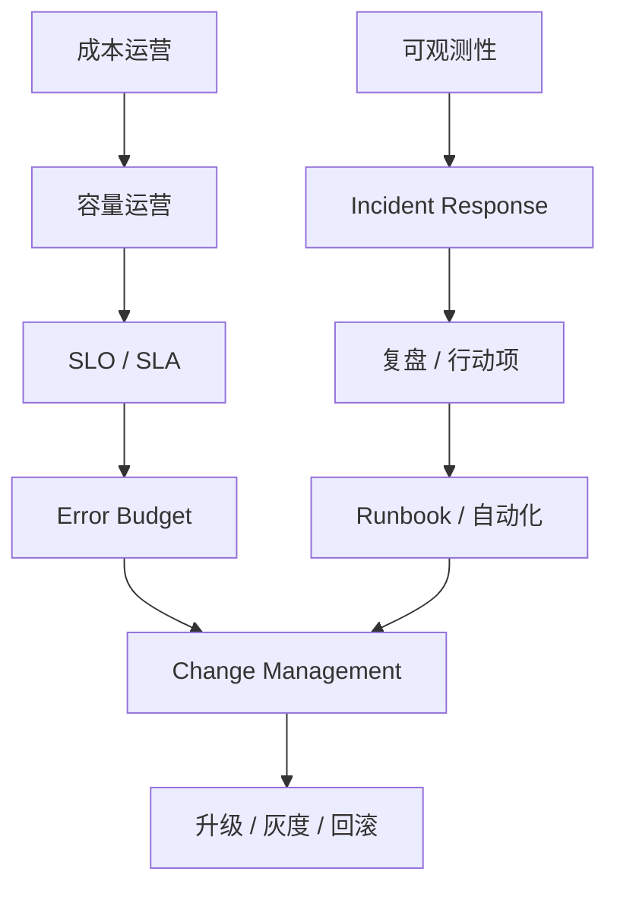

# 第 40 章：SRE 与运维体系

## 本章回答的问题

- AI Factory 的 SRE 与普通云服务 SRE 有哪些不同？
- SLO、SLA、error budget、incident、change management、upgrade、capacity operation 和 cost operation 如何落地？
- 如何把可靠性、容量和成本放到同一个运行体系中？

## 一个真实场景

一个 MaaS 平台发布新推理引擎版本后，部分模型 TTFT 下降，但另一些模型出现间歇超时。平台团队想快速推广新版本，业务团队担心 SLA，基础设施团队同时在做驱动升级。没有 SLO、变更窗口、灰度策略和回滚标准时，所有团队都只能靠会议协调。

SRE 的价值，是把可靠性目标、变更纪律、容量管理和事故响应制度化，让 AI Factory 能持续生产 token 和模型，而不是靠英雄式救火。

## 核心概念

SRE 是 Site Reliability Engineering，把软件工程方法用于可靠性运营。AI Factory 的 SRE 不只覆盖 API 服务，还要覆盖训练作业、GPU 资源池、调度器、网络、存储、驱动、模型服务和计费链路。

AI Factory 的可靠性目标要同时面向在线推理和离线训练。推理关注用户可见延迟、错误率和 token streaming；训练关注作业成功率、恢复能力、GPU 小时浪费和 checkpoint；基础设施关注资源可交付、健康和可维修。

## 系统架构



可靠性运营是闭环：目标定义、监控、告警、变更、事故、复盘、改进和容量成本优化。

## 40.1 SLO

SLO 是 Service Level Objective，服务等级目标。AI Factory 的 SLO 应按服务类型定义。在线推理可以定义可用性、TTFT、TPOT、错误率、限流率和 token streaming 中断率；训练平台可以定义作业准入延迟、成功率、恢复时间和 checkpoint 成功率。

SLO 要从用户体验出发，而不是从单个组件指标出发。GPU utilization 不是 SLO，TTFT 或训练作业成功率才更接近用户感知。组件指标用于解释 SLO 变化。

不同模型和租户可以有不同 SLO。高价值生产模型需要更严格目标，实验模型可以使用 best-effort 资源。

## 40.2 SLA

SLA 是 Service Level Agreement，服务等级协议，通常是对外或跨组织承诺。SLA 应基于可实现的 SLO，而不是营销承诺。AI 服务的 SLA 要明确边界：模型不可用、限流、用户输入过长、下游依赖异常、计划维护是否计入。

对训练平台，SLA 可能不承诺“任务立刻运行”，而承诺队列透明、配额可解释、资源可用性和故障恢复能力。对推理平台，SLA 更接近传统在线服务，但要加入 token streaming 和模型维度。

SLA 还应与计费和赔付边界一致。没有计量和可观测性支撑的 SLA 无法执行。

## 40.3 error budget

Error budget 是允许系统在一定周期内消耗的错误预算。它把可靠性和迭代速度连接起来。如果错误预算充足，可以加快发布；如果预算耗尽，应冻结高风险变更，优先修复稳定性。

AI Factory 的 error budget 可以按模型、平台服务、训练集群或租户定义。推理服务的预算来自错误率和延迟违约；训练平台的预算来自作业失败、非用户原因重跑和 GPU 小时浪费。

错误预算要可计算。没有统一指标和归因，error budget 会变成口号。

## 40.4 incident

Incident 是生产事故。AI Factory 的 incident 可能是推理大面积超时、某模型错误率上升、训练集群 NCCL 大面积 hang、存储不可用、驱动升级失败或 GPU 资源池异常。

事故响应要先止血，再定位，再修复。止血动作包括限流、路由切换、回滚、隔离节点、暂停调度、降低并发、启用备用模型或暂停低优先级任务。

事故管理应记录影响面、开始时间、发现时间、缓解时间、恢复时间、根因、行动项和防复发措施。复盘不应寻找责任人，而应改善系统。

## 40.5 change management

Change management 是变更管理。AI Factory 的高风险变更包括驱动、CUDA、NCCL、OFED、Kubernetes、GPU Operator、推理引擎、模型版本、网关路由、网络配置和存储配置。

变更应有范围、影响评估、回滚方案、灰度策略、观测指标和停止条件。对于训练集群，变更还要考虑长任务和 checkpoint；对于推理平台，要考虑模型级灰度和租户影响。

一个关键原则是分离变更：不要在同一窗口同时升级驱动、推理引擎和模型，否则故障难以归因。

## 40.6 upgrade

Upgrade 是升级过程。AI Factory 升级难在版本矩阵：驱动、CUDA、NCCL、框架、推理引擎、容器镜像、GPU Operator、OFED、内核和 Kubernetes 都有兼容关系。

升级路径应从验收集群开始，经过小规模灰度，再进入生产。每一步都要跑准入测试、NCCL test、代表性训练任务和代表性推理 workload。

升级失败时，回滚不应只回滚一个组件。要明确哪些组件是成组升级，哪些状态需要清理，哪些节点需要重新准入。

## 40.7 capacity operation

Capacity operation 是容量运营。它回答：未来需要多少 GPU、哪种 GPU、多少网络和存储、哪个集群先扩、资源如何在训练和推理之间分配。

AI 容量不能只看 GPU 使用率。还要看 tokens/s、队列等待、quota 使用、checkpoint 峰值、模型权重缓存、网络拥塞、故障保留容量和业务增长。

容量运营应定期输出预测：按模型、租户、业务线和 workload 类型预测资源需求，并和采购、机房、电力、网络、存储交付节奏对齐。

## 40.8 cost operation

Cost operation 是成本运营。AI Factory 的成本包括 GPU 折旧或租赁、电力、制冷、网络、存储、软件、运维和机会成本。推理服务最终要关注 cost per token、revenue per token 和毛利；训练要关注 GPU 小时、实验效率和模型 ROI。

成本运营不是简单压低成本。过度提高利用率可能损害 SLA，过度隔离会浪费资源。SRE 要把成本和可靠性放在同一个决策框架里。

常见做法包括低优先级任务使用可抢占资源、批量推理错峰、模型量化、缓存优化、容量保留策略和按租户成本分摊。

## 工程实现

变更准入模板示例：

```yaml
change_request:
  title: upgrade-nccl-baseline
  scope:
    clusters: ["training-canary"]
    nodes: 16
  risk:
    level: high
    components: ["driver", "cuda", "nccl"]
  validation:
    - gpu_burn_in
    - nccl_test
    - representative_training_job
    - checkpoint_restore
  rollback:
    method: restore_previous_image
    max_time: 2h
  stop_conditions:
    - nccl_bandwidth_regression
    - training_failure_rate_increase
    - gpu_xid_spike
```

所有高风险变更都应能回答：影响谁、看什么指标、何时停止、如何回滚。

## 常见故障

- 没有 SLO，告警只按组件阈值触发，业务影响不清。
- 多个高风险变更叠加，故障无法归因。
- 推理服务有 SLA，但 token streaming 中断没有计入。
- 训练任务失败只算作用户失败，没有归因基础设施责任。
- 成本优化只看利用率，导致 error budget 被快速消耗。

## 性能指标

- SLO 达成率、SLA 违约次数、error budget 消耗。
- Incident 数量、MTTD、MTTA、MTTR、复发率。
- 变更成功率、回滚次数、灰度中止次数。
- 训练作业成功率、非用户原因失败率、浪费 GPU 小时。
- 推理 cost per token、tokens/s、tokens/W、毛利相关指标。

## 设计取舍

更严格 SLO 提升用户信任，但需要更多冗余和成本。更快变更提升迭代速度，但消耗 error budget。更高利用率降低单位成本，但可能降低可靠性。SRE 的职责是让这些取舍显性化，并用数据驱动决策。

## 小结

- AI Factory SRE 覆盖推理、训练、调度、GPU、网络、存储和机房。
- SLO/SLA/error budget 把可靠性目标转化为运行规则。
- 变更、升级、事故和复盘需要标准流程与自动化支撑。
- 容量运营和成本运营是 AI Factory 可靠性的一部分。

## 延伸阅读

- TODO: Google SRE 相关公开资料
- TODO: OpenTelemetry / Prometheus 运营资料
- TODO: AI 平台 incident 和变更管理案例
