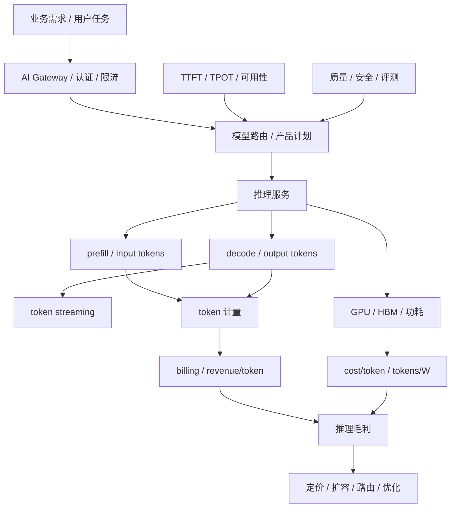
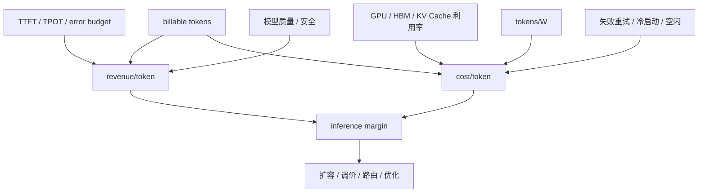

# 第 41 章：Token Factory 视角

## 本章回答的问题

- 为什么 token 可以作为 AI Factory 的核心产出度量？
- tokens/s、tokens/W、cost/token、revenue/token 分别回答什么问题？
- 如何把 GPU 利用率、推理毛利和训练 ROI 放到同一个经济模型中？

## 一个真实场景

一个 MaaS 平台请求量持续增长，业务报表看起来很好：API 调用数上升，活跃客户增加，模型目录也在扩展。财务团队却发现 GPU 租赁、电力和运维成本增长更快，单月毛利被明显压缩。平台团队最初用 QPS 和 GPU utilization 解释产能，认为系统并不浪费；SRE 团队看到可用性达标，也认为可靠性没有问题。问题在于，这些指标没有解释“每个 token 的成本和收入”。

进一步拆分后，团队发现请求形态已经变化。长上下文 RAG 请求增加，input token 占比上升；Agent 应用带来多轮 tool calling，单个用户任务背后有多次模型调用；reasoning 模型输出更长，output token 和 decode 时间增长；失败重试、免费额度和内部测试流量没有进入成本分摊。QPS 增长是真实的，但 token 结构变化让成本模型失真。

Token Factory 视角把问题改写为一组更可计算的问题：平台每秒生产多少可计费 token，每瓦电力生产多少 token，每个 token 的完整成本是多少，每个 token 带来多少收入，哪些 token 是高价值产出，哪些 token 只是失败重试或低质量输出。它不是把 AI Factory 简化为财务表，而是把工程指标和经济结果连接起来。

这个场景也说明，单看 GPU 利用率会误导。GPU 很忙不等于赚钱，tokens/s 很高不等于毛利好，cost/token 低也不等于用户体验好。AI Factory 的经营目标不是生产最多 token，而是在质量、安全和 SLO 约束下，稳定生产有价值、可计量、可解释成本的 token。

因此，Token Factory 是一种运营视角：它让平台团队、模型团队、SRE 和财务团队使用同一套事实讨论扩容、定价、模型路由、缓存、batching、免费额度和训练投资。没有这个视角，AI Factory 很容易在技术上繁荣，在经济上失控。

## 核心概念

Token Factory 是 AI Factory 的产出度量和经济性视角。它关注系统如何把用户需求、模型能力、GPU 计算、网络存储、电力和运维组织起来，最终生产 token，并让这些 token 具备可计量的成本、收入、质量和体验属性。它不是一个独立技术组件，也不等同于 AI Factory 本身。

AI Factory 是完整生产系统，覆盖 Application、Platform、Model、Runtime、Orchestration、GPU IaaS、Network/Storage、Physical 和横切能力。Token Factory 是观察这个系统的一种透镜：从 token 产出反推容量、成本、能效、毛利和投资回报。这个区分很重要，否则团队会把“优化 token 成本”误解为全部目标。

token 在工程上有多种口径。input token 主要影响 prefill、上下文处理和 KV Cache 初始状态；output token 主要影响 decode、streaming 和持续 GPU/HBM 压力；reasoning token 可能影响内部推理成本但不一定全部对用户可见；cached token、free token、failed token 和 retried token 需要在账务和成本中明确处理。口径不清，报表就不可用。

Token Factory 的核心不是“越多越好”，而是“单位有价值产出的效率”。高质量、低延迟、可计费、满足安全策略的 token 才是有效产出。低质量回答、重复生成、失败重试、恶意调用和未归因内部流量，会消耗 GPU 和电力，却不一定产生业务价值。经济模型必须能区分这些 token。

在运营上，Token Factory 把四类指标放在一起：产能指标如 tokens/s，能效指标如 tokens/W，成本指标如 cost/token，收入指标如 revenue/token。再把这些指标与 TTFT、TPOT、错误率、模型质量、安全和用户留存关联，才能形成可执行决策。

它还要求团队明确哪些数字可以直接测量，哪些只能估算。token 数、延迟和 GPU 时间通常可测；电力分摊、平台研发和业务价值往往需要规则估算。估算并不可怕，可怕的是口径不公开，导致不同团队用不同账本讨论同一个问题。

## 系统架构

Token Factory 架构可以从请求进入网关开始。用户请求经过认证、限流、模型路由、推理服务、prefill、decode、token streaming、计量和账单；每个阶段都留下影响经济性的信号。网关知道租户和产品计划，模型服务知道模型版本和请求形态，推理引擎知道 batch、KV Cache 和 GPU 使用，计量系统知道 input/output/reasoning token，成本系统知道 GPU、电力、存储和运维成本。

这套架构的难点是统一账实关系。一个用户任务可能对应多个 API 请求，一个 Agent 步骤可能调用多个模型和工具，一个失败请求可能已经消耗大量 prefill 计算，一个 streaming 中断请求可能产生了部分 token。若计量系统只记录最终成功请求，就会低估成本；若成本系统只按 GPU 小时平均分摊，就无法解释不同模型、租户和请求形态的毛利差异。

经济模型还必须接入质量和 SLO。推理平台可以通过更大 batch 降低 cost/token，但 TTFT 可能上升；可以用小模型降低成本，但质量可能下降；可以提高缓存命中，但需要接受缓存一致性和隐私边界；可以牺牲冗余提高利用率，但 error budget 会被消耗。Token Factory 的架构必须把这些约束放在同一张图里。

最终，Token Factory 的输出不是一张静态财务表，而是运营控制面：它支撑定价、容量规划、模型路由、资源池划分、免费额度策略、成本归因、扩容优先级和训练投资决策。只有当 token、GPU、SLO、质量、成本和收入能够相互追踪时，AI Factory 才能从“能跑”进入“可经营”。

架构上还要保留审计路径。任何毛利、成本或收入结论，都应能回溯到原始计量事件、资源使用记录和产品价格规则。否则报表只能用于展示，不能用于定价、赔付、预算和扩容。



## 41.1 token 是 AI Factory 的产出

对在线推理业务来说，token 是最细粒度、最容易计量的产出。用户请求进入 AI Factory，经过网关、认证、租户限流、模型路由、推理服务、prefill、decode、KV Cache、CUDA kernel、GPU/HBM 和 streaming，最终得到的是一串 token。这个过程把应用需求转化为可观测、可计费、可优化的计算产物。

把 token 作为产出，并不意味着所有 token 价值相同。一个准确解决用户问题的输出 token，与一次失败重试中浪费的 token，在成本上都消耗资源，在价值上却完全不同。一个安全策略拦截前已经完成 prefill 的请求，也可能产生成本但没有收入。Token Factory 要做的第一件事，就是区分 billable token、internal token、failed token、cached token 和 evaluation token。

token 口径还决定平台治理。若只统计 output token，长上下文 RAG 的 prefill 成本会被低估；若不区分 reasoning token，复杂推理模型的真实成本会被隐藏；若不记录模型版本和租户，成本无法归因；若不记录缓存命中，优化效果无法衡量。计量不是账单系统的细节，而是 AI Factory 的事实基础。

在商业上，token 把模型能力变成可交易单位；在工程上，token 把 workload 转化为容量规划入口；在 SRE 上，token 把用户体验和基础设施压力联系起来。tokens/s 下降可能意味着产能下降，TTFT 上升可能意味着 prefill 或排队压力，output token 变长可能改变 GPU decode 负载。

因此，本章说 token 是产出，是为了建立统一语言：业务讨论需求量，平台讨论路由和限流，模型团队讨论质量，基础设施团队讨论 GPU 和能效，财务讨论毛利。token 让这些讨论有共同分母。没有共同分母，AI Factory 的扩容和优化往往只能靠局部指标驱动。

这个共同分母还要允许分层。平台可以在技术层统计所有 token，在商业层只统计可计费 token，在质量层只统计通过评测或用户可见的 token。分层口径让团队既能看清真实消耗，也能看清真实价值。

## 41.2 tokens/s

tokens/s 表示单位时间处理或生成的 token 数，是推理产能的核心指标。它可以按模型、租户、endpoint、replica、GPU、资源池、集群或整个平台聚合。在线推理通常需要区分 input tokens/s 和 output tokens/s，因为 input token 主要驱动 prefill，output token 主要驱动 decode，两者对应的瓶颈不同。

容量规划不能只看 QPS。一个低 QPS 的长上下文法律问答应用，可能比高 QPS 的短问答应用消耗更多 GPU 时间和 HBM；一个 Agent 任务的用户侧 QPS 很低，但内部多轮调用会放大 token。tokens/s 把请求长度差异纳入视野，能更接近真实计算负载。

tokens/s 也不能孤立解释。高 tokens/s 可能来自更大的 batch、更宽松的延迟目标或更短输出；低 tokens/s 可能是质量策略、长上下文、冷启动、缓存失效或 SLO 约束导致。比较两个系统的 tokens/s，必须说明模型、精度、上下文长度、输出长度、并发、batching 策略和延迟目标。

在生产中，tokens/s 应同时服务容量和运营。容量侧用它判断扩容、资源池划分和热点模型；运营侧用它判断业务增长、免费额度消耗、异常流量和成本摊销；SRE 用它解释 SLO 退化是否来自 token 负载变化，而不是简单归因到“系统慢”。

更细的做法，是按请求阶段拆分 tokens/s：prefill throughput、decode throughput、streaming throughput 和计量吞吐。prefill 瓶颈和 decode 瓶颈的优化路径不同，前者可能需要上下文压缩、prefix cache 或路由，后者可能需要 batching、KV Cache 管理或引擎优化。tokens/s 只有拆到阶段，才真正可行动。

生产看板还应展示 tokens/s 的峰值、P95 和租户分布。平均吞吐足够，不代表峰值不拥塞；全局吞吐健康，不代表某个高价值租户没有被低价值流量挤压。容量决策要看分布，而不是只看总量。

## 41.3 tokens/W

tokens/W 表示每瓦功耗可以生产多少 token，是 AI Factory 能效的核心指标。GPU、CPU、内存、网络、存储、风扇、液冷和机房供配电都会影响最终能效。对大规模 AI Factory 来说，电力不仅是成本项，也是容量约束；同样机房电力下，tokens/W 越高，能够承载的业务越多。

tokens/W 适合比较模型优化、推理引擎、硬件代际、精度策略、batching 和机房工程的综合效果。量化、KV Cache 优化、连续批处理、权重缓存、低功耗策略和更好的散热，都可能改善能效。但这个指标必须在相同 workload 口径下比较，否则结论会失真。

例如，一个短上下文模型的 tokens/W 高，并不说明它比长上下文模型更“优秀”；一个宽松延迟目标下的 tokens/W 高，也不能直接用于严格在线 SLO。能效比较必须注明模型、输入输出长度、并发、SLO、精度、GPU 型号、功耗采集口径和是否包含机房 PUE。没有这些条件，tokens/W 只是漂亮数字。

工程上，tokens/W 可以用于三类决策。第一是硬件和机房选型，判断同等电力下哪种 GPU 和服务器形态更合适；第二是运行策略优化，判断 batch、缓存和模型压缩是否真正节能；第三是容量治理，在电力紧张时优先调度高价值或高能效 workload。

tokens/W 还提醒团队不要只追求 GPU utilization。GPU 忙但功耗高、token 价值低、SLO 差，并不是好结果。能效指标必须与 revenue/token、cost/token、质量和 SLO 一起看。AI Factory 的能效目标不是省电本身，而是在电力边界内生产更多有价值 token。

在电力受限的数据中心，tokens/W 还会改变产品优先级。高能效、高毛利、低风险 workload 可以优先获得容量；低能效且低价值的批量任务可以错峰或迁移。能效因此从设施指标进入业务调度。

## 41.4 cost/token

cost/token 是生产单个 token 的单位成本。最简单的公式是 total cost 除以 total tokens，但真正可用的成本模型必须拆分成本项和 token 口径。GPU 折旧或租赁、电力、制冷、机房、网络、存储、平台研发、运维、准入、故障、失败重试、闲置冗余和免费额度都会影响真实成本。

```text
cost/token = total_cost / effective_tokens

total_cost = gpu_cost
           + power_and_cooling_cost
           + datacenter_cost
           + network_storage_cost
           + platform_ops_cost
           + failure_and_retry_waste
           + reserved_capacity_cost
```

这里的 effective_tokens 也要定义清楚。按 billable tokens 计算，可以观察商业毛利；按 all generated tokens 计算，可以观察系统效率；按 successful user-visible tokens 计算，可以观察有效产出；按 model、tenant、endpoint 或 product plan 分摊，可以观察成本归因。不同口径回答不同问题，不能混用。

cost/token 的价值在于迫使工程决策显性化。提高 batching 可能降低 GPU 成本，但增加 TTFT；使用更小模型可能降低成本，但影响质量；保留更多热备会提高成本，但保护 SLA；减少 checkpoint 或缓存可能省钱，但增加失败恢复成本。只有把这些影响折算到 token 成本和 SLO，团队才能判断取舍。

成本模型还要处理失败和浪费。推理超时、用户取消、streaming 中断、模型冷启动、缓存未命中、异常重试和内部压测，都可能消耗 GPU 但不产生收入。若这些成本被平均摊到正常 token 上，平台会误判毛利和定价。高质量的 cost/token 报表必须能显示浪费来源。

最后，cost/token 不是越低越好。极端降低成本可能牺牲质量、安全、延迟和可靠性，最终降低 revenue/token 或用户留存。正确目标是在业务目标和 SLO 约束下，持续降低单位有效 token 成本，而不是把所有 token 都变得最便宜。

成本口径还要有版本。模型升级、驱动升级、推理引擎切换和价格调整都会改变 cost/token。没有版本标签，成本曲线变化无法归因，也无法判断优化是否真实有效。

## 41.5 revenue/token

revenue/token 表示每个 token 带来的收入或业务价值。对外 MaaS 平台可能按 input token、output token、reasoning token、模型等级、上下文长度和专属实例收费；企业内部平台可以把收入替换为内部结算、成本节省、效率提升或业务结果。无论哪种模式，都需要让 token 产出与价值单位建立关系。

revenue/token 不能脱离场景。同样一千个 token，用于代码生成、智能客服、金融研报、广告创意、Agent 自动化或内部问答，价值差异可能很大。一个低价通用模型可能带来大规模调用，一个高价专业模型可能调用少但价值高。平均 revenue/token 只能作为入口，真正决策要按模型、租户和业务线拆分。

收入口径还要处理折扣、免费额度、包月套餐、失败请求、内部调用和渠道分成。客户看到账单时按产品规则付费，平台看成本时按资源消耗付费，两者之间的差异就是毛利治理空间。若免费额度被高成本长上下文请求消耗，或者低价套餐被高成本模型占满，revenue/token 会迅速失真。

对于内部 AI Factory，revenue/token 可以转化为 value/token。比如客服场景看工单解决率和人工节省，代码助手看开发效率和缺陷率，数据分析 Agent 看分析周期缩短。内部价值不容易像外部收入那样精确计费，但仍要建立估算模型，否则资源分配会被“谁声音大”决定。

revenue/token 还要与质量绑定。低质量 token 会带来退款、人工接管、客户流失、安全风险和品牌损失；高质量 token 可以支撑更高定价、更高留存和更强差异化。Token Factory 视角不是鼓励生产更多 token，而是让每个 token 的价值和成本都可被讨论。

收入模型也要接受负反馈。若某类高收入请求频繁触发 SLO 违约或人工赔付，账面 revenue/token 可能高，真实贡献却下降。收入必须和服务质量、赔付、客户续约和支持成本一起看。

## 41.6 GPU 利用率

GPU 利用率是 Token Factory 的重要变量，但它不是一个单一数字。SM utilization、HBM bandwidth、显存占用、KV Cache 水位、PCIe/NVLink、功耗、温度、kernel occupancy、batch 队列和实例空闲时间，都可能解释“GPU 是否被有效使用”。只看平均 GPU utilization，容易掩盖真正瓶颈。

在线推理尤其如此。某个服务 SM 利用率不高，但 HBM bandwidth 已接近瓶颈；某个模型显存占用高，无法继续放大 batch；某个长上下文场景 KV Cache 耗尽，导致排队和驱逐；某个服务 GPU 看似忙，但大部分时间消耗在低价值重试上。利用率必须和 token 产出、SLO、质量和成本一起解释。

提高利用率也有代价。更大的 batch 可以降低 cost/token，却可能恶化 TTFT；更多模型混部可以减少空闲，却增加资源争抢和故障定位难度；更高超卖可以提升短期产能，却放大长尾延迟；减少冗余可以提高平均利用率，却降低事故恢复能力。利用率优化必须接受 error budget 和 SLA 约束。

训练场景的利用率也要区分。大规模训练的 GPU idle 可能来自数据加载慢、checkpoint 慢、NCCL 等待、rank skew 或坏节点；不是所有 idle 都能靠多塞任务解决。若为了提高利用率把在线推理和大训练粗暴混部，可能造成两边都不稳定。利用率指标必须带 workload 语义。

更成熟的做法，是把 GPU 利用率转化为 effective GPU hours。有效 GPU 小时只计算产生有效 token、有效训练 step 或有效评测结果的资源消耗；失败重跑、长时间 pending 后失败、空转、低效拓扑和异常重试都被标记为浪费。这样，利用率才从设备指标变成经济指标。

利用率还应按资源池解释。在线推理池需要冗余和低延迟，训练池需要完整拓扑，批量池可以追求更高填充率。把所有 GPU 混在一起算平均利用率，会掩盖每类资源池的真实目标。

## 41.7 推理毛利

推理毛利可以粗略理解为 token 收入减去 token 成本。它不是财务部门独有指标，而是推理平台是否可持续扩张的核心反馈。若 revenue/token 覆盖不了 cost/token，业务增长会放大亏损；若毛利看似健康但 SLO 退化，客户留存和未来收入会受损；若毛利依赖免费资源或隐藏成本，就不可持续。

推理毛利的收入端由定价、模型等级、客户结构、套餐、免费额度、失败赔付和业务价值决定。成本端由 GPU、电力、机房、推理引擎效率、batching、缓存、KV Cache、模型大小、网络存储、运维和故障浪费决定。二者之间没有天然同步关系，必须通过报表和控制策略持续校准。

毛利分析应按模型和请求形态拆分。短问答、长上下文、代码生成、批量推理、Agent、reasoning 模型、多模态模型，对 GPU 和 token 的消耗完全不同。统一价格可能便于销售，但会让高成本场景侵蚀整体毛利。平台需要知道哪些场景赚钱，哪些场景需要限额、调价或工程优化。

改善毛利的路径有很多：模型量化、蒸馏、路由、缓存、continuous batching、prefix cache、PD 分离、资源池分层、批量推理错峰、定价调整、减少冷启动、降低失败重试、提升能效和优化机房 PUE。每条路径都有副作用，必须在质量、安全和 SLO 下验证。

推理毛利还影响扩容决策。若某个模型的毛利稳定、需求增长、SLO 接近容量边界，扩容是合理投资；若某个业务 token 很多但毛利为负，盲目扩容只会放大损失。Token Factory 把“要不要买更多 GPU”变成可计算问题，而不是单纯看需求曲线。

毛利也要区分短期和长期。新模型早期可能毛利不高，但能带来战略客户、数据反馈或产品入口；成熟模型若长期毛利为负，则必须解释其战略价值。经济模型提供事实，不自动替代业务判断。



## 41.8 训练 ROI

训练 ROI 比推理毛利更难度量，因为训练成本通常先发生，收益可能在模型质量、产品能力、推理收入、内部效率、品牌、数据资产和后续模型迭代中逐步体现。一次预训练、后训练或微调任务，可能消耗大量 GPU 小时、数据处理、人力、评测和机会成本，但收益不一定能在当月财务报表中出现。

训练成本至少包括 GPU 时间、网络存储、数据清洗、实验管理、失败重跑、checkpoint、评测、人力和平台机会成本。失败训练也不一定全是浪费，如果它沉淀了数据质量问题、训练稳定性经验或模型选择证据；但如果没有记录假设、评测和复盘，失败就无法转化为资产。

训练收益要与业务目标连接。一个微调模型可能提升客服解决率，一个压缩模型可能降低推理 cost/token，一个领域模型可能提高客户留存，一个基础模型可能支撑多个产品线。若训练目标只写成“提升 benchmark”，但 benchmark 与业务结果没有关系，ROI 就无法被证明。

评估训练 ROI，应建立从实验到上线的闭环：训练前定义假设、成本预算和评测口径；训练中记录资源消耗、失败和数据版本；训练后进行离线评测、红队、安全和性能验证；上线后观察 revenue/token、cost/token、用户行为和 SLO。没有上线反馈，训练 ROI 只能停留在实验室。

训练 ROI 还要纳入机会成本。相同 GPU 可以用于预训练、微调、批量推理或高毛利在线服务。某个训练任务即使技术上成功，也可能不是当期最优投资。AI Factory 的成熟运营，会把训练队列、推理毛利和业务路线图放在一起决策，让 GPU 投向最能增加长期能力和经济回报的地方。

训练 ROI 需要训练账本，而不是只看任务是否完成。训练账本应记录 allocated GPU hours、effective training GPU hours、wasted GPU hours、checkpoint、评测、上线状态和后续推理收益。否则一次训练成本会停留在 GPU 小时，无法连接到模型质量、推理成本下降或收入增长。

```yaml
training_roi_ledger:
  training_job: exp-20260619-001
  model_candidate: af-base-v4-ckpt120000
  costs:
    allocated_gpu_hours: measured
    effective_training_gpu_hours: measured
    wasted_gpu_hours:
      queue_startup: measured
      rendezvous_failure: measured
      failed_restarts: measured
    storage_cost:
      checkpoints: measured
      dataset_reads: measured
    evaluation_cost: measured
  outputs:
    checkpoints: [ckpt-step-120000]
    evaluation_reports: [eval-report-001]
    model_registry_version: optional
  business_link:
    serving_model: optional
    inference_cost_delta: measured_after_launch
    revenue_delta: measured_or_estimated
    quality_delta: evaluation_summary
```

这个 ledger 让训练投资能被追踪到后续结果。若训练模型没有上线，ROI 不能按推理收入计算，但仍可记录为研究资产或失败学习；若模型上线后把 cost/token 降低，收益应回写到训练 ROI；若模型质量提升但推理成本上升，业务要判断 revenue/token 是否足以覆盖。训练 ROI 是跨时间窗口的事实链，不是单次作业报表。

## 工程实现

Token Factory 的工程实现从数据模型开始。每个请求、任务、模型版本、租户、endpoint、replica、GPU pool 和计费计划，都要有稳定标识。计量事件必须记录 input token、output token、reasoning token、cached token、失败状态、延迟、模型版本、路由结果和 trace id。没有这些字段，后续成本和收入都只能粗略平均。

核心账本应采用 token ledger，而不是只存最终账单金额。Ledger 是追加式事实表，记录每个请求或任务产生了哪些 token、这些 token 是否可计费、归属哪个租户和模型、对应哪些成本池。账单、毛利、报表和异常审计都从 ledger 派生。这样，即使价格规则变化，也可以重算账单；即使请求失败，也能保留成本事实。

```yaml
token_ledger_event:
  event_id: evt_001
  trace_id: trace-abc
  tenant: enterprise-a
  project: support-copilot
  requested_model: af-chat-large
  served_model: af-chat-large-202606
  endpoint: af-chat-large-prod
  resource_pool: inference-premium-a
  token_class:
    input: 2380
    output_generated: 642
    output_delivered: 640
    reasoning: 0
    cached_input: 512
  lifecycle:
    close_reason: stop
    failure_stage: none
    retry_of: null
  economics:
    billable_input: 1868
    billable_output: 640
    price_plan: enterprise-standard-2026
    cost_pool: gpu-h100-prod-a
```

Token ledger 要与资源成本账本对齐。资源账本记录 GPU 小时、功耗、资源池、节点、实例、训练作业和推理 endpoint；token ledger 记录 token 产出。两者通过 resource_pool、endpoint、时间窗口和模型版本关联。早期可以按资源池和时间窗口分摊，成熟后再按 replica、请求阶段或 GPU 时间细化。关键是口径公开，并能解释误差。

第二步是建立成本分摊规则。GPU、电力、机房、网络、存储、平台运维和失败浪费可以按不同维度分摊：推理按 token、模型和资源池；训练按 GPU 小时、作业和项目；共享基础设施按容量或实际使用量。规则不必一开始完美，但必须公开、稳定、可复盘，否则业务无法信任报表。

第三步是把 Token Factory 报表接入运营动作。报表至少按模型、租户、资源池和时间窗口展示 tokens/s、tokens/W、cost/token、revenue/token、毛利、SLO、错误率、缓存命中和浪费。发现长上下文成本异常时触发定价或路由评审；发现失败重试成本升高时触发 SRE；发现某模型毛利下降时触发工程优化或产品策略调整。

```yaml
token_factory_report:
  scope:
    model: example-llm
    tenant: team-a
    endpoint: chat-completions
    gpu_pool: inference-prod
  metering:
    input_tokens: measured
    output_tokens: measured
    reasoning_tokens: measured_if_applicable
    failed_tokens: measured
    cached_tokens: measured
  economics:
    cost_per_token: calculated
    revenue_per_token: calculated
    gross_margin: calculated
  constraints:
    ttft: measured
    tpot: measured
    error_budget: tracked
    quality_gate: required
```

第四步是做审计闭环。计量系统要能对账：网关日志、推理服务日志、计费事件和成本报表是否一致；异常流量、免费额度、内部调用和失败请求是否被正确分类。Token Factory 一旦用于定价和毛利，数据质量就必须达到财务和工程共同可接受的标准。

第五步是建立治理动作。对毛利为负的模型，触发定价、路由或工程优化评审；对失败 token 异常增长的租户，触发限流和故障诊断；对 tokens/W 明显偏离的资源池，触发能效和硬件检查。报表必须连接动作，否则只是事后解释。

第六步是保留人工校正机制。早期成本分摊难免粗糙，特殊客户和内部项目也可能需要例外处理。系统应记录例外原因、审批人和有效期，避免临时调整变成永久黑箱。

经济模型也应明确阶段成本。Input token 主要消耗 prefill，output token 主要消耗 decode，cached input token 可能降低 prefill 但仍有缓存占用成本，失败 token 可能没有收入但有资源消耗。把所有 token 用同一成本平均，会误导定价和优化。

```text
request_cost =
    prefill_cost(input_tokens - cached_input_tokens)
  + cache_cost(cached_input_tokens, kv_cache_lifetime)
  + decode_cost(output_generated_tokens)
  + gateway_platform_cost(request_count, stream_duration)
  + model_artifact_distribution_cost(cache_miss, model_load_time)
  + failure_waste_cost(failure_stage, retry_count)
  + reliability_risk_cost(error_budget_burn, incident_impact)

gross_margin =
    billable_revenue(input_tokens, output_tokens, plan)
  - allocated_request_cost
```

这个公式不要求一开始精确到每个 kernel，但要求团队承认不同阶段成本不同。长上下文 RAG 的问题通常在 prefill 和 KV Cache，长文生成的问题通常在 decode，Agent 的问题通常在多次调用和失败重试。成本模型若能按阶段切开，工程优化才会指向正确位置。

训练成本也应拆出存储路径：

```text
training_storage_cost =
    dataset_read_cost(dataset_manifest, bytes_read, request_count)
  + checkpoint_write_cost(checkpoint_size, interval, metadata_ops)
  + checkpoint_restore_cost(restore_count, restore_duration)
  + artifact_retention_cost(retention_policy, age, replicas)
  + storage_induced_waste(gpu_idle_seconds_due_to_io)
```

这能防止一个常见误判：训练贵不一定是模型计算贵，也可能是数据格式、checkpoint 策略或 artifact 生命周期让 GPU 等存储。把存储浪费显式写入 ledger，平台才会投资 reshard、cache、manifest、预热和清理自动化。

可靠性成本也应进入经济模型。一次 SLO 违约可能产生赔付、退款、客户支持成本、失败 token、重试 token、GPU 空转、机会成本和后续加固投入；一次训练 incident 可能造成 checkpoint 回滚、队列重排、重复训练和模型发布时间延迟。示例：

```text
reliability_cost =
    slo_violation_cost(failed_or_slow_requests, customer_tier)
  + error_budget_burn_cost(error_budget_burn)
  + incident_response_cost(oncall_time, mitigation_resources)
  + retry_and_failure_token_cost(failed_tokens, retried_tokens)
  + wasted_gpu_cost(wasted_gpu_hours)
  + delayed_launch_cost(model_release_delay)
```

把可靠性成本显式化，可以防止一个常见误判：为了降低 cost/token 而减少冗余、缩短灰度、跳过准入或压缩维护窗口，短期报表会变好，但长期毛利可能被事故吞掉。Token Factory 不是只计算稳定态成本，还要计算风险成本。SRE 事件一旦进入 ledger，可靠性投入才有经济解释。

## 常见故障

第一类故障是只看 QPS，不看 token。QPS 上升可能是短请求增长，也可能是 Agent 内部调用放大；QPS 稳定也可能掩盖 input token 和 output token 激增。解决方向是把容量、账单和告警都改成请求数与 token 数并行观察，并按请求形态拆分。

第二类故障是只统计 GPU 成本。GPU 是最大成本项之一，但不是全部。电力、制冷、机房、网络、存储、平台研发、运维、失败重试、冗余和采购机会成本都会进入真实 cost/token。忽略这些成本，会让低价策略看起来可行，直到规模扩大后暴露亏损。

第三类故障是收入口径和成本口径不一致。销售按套餐收费，平台按 token 计量，成本按 GPU 小时分摊，三者没有统一映射，结果无法判断某个客户、模型或场景是否盈利。解决方向是建立从产品计划到资源消耗的映射表，并定期对账。

第四类故障是追求 tokens/s 牺牲体验。更大的 batch、更高混部和更少冗余可以提高短期产出，却可能让 TTFT、TPOT 和错误率恶化。若报表只奖励产量，不约束质量和 SLO，平台会优化错误目标。Token Factory 必须把 error budget 和质量门禁放进经济模型。

第五类故障是把 Token Factory 当成 AI Factory 全部。经济指标能指导运营，但不能替代模型安全、数据治理、平台可靠性和用户价值判断。只追逐低成本 token，会导致质量下降和产品信任受损。正确做法是把 Token Factory 放在 AI Factory 系统工程之内。

第六类故障是报表粒度过粗。全平台平均 cost/token 看起来健康，但某些模型、租户或长上下文场景可能持续亏损。平均值适合看趋势，不能替代分组归因。运营动作必须落到可负责的对象上。

第七类故障是把训练成本和推理收入割裂。模型训练投入如果不进入长期 ROI 分析，团队会低估模型迭代成本；推理收益如果不反馈训练队列，GPU 投资也无法优化。

第八类故障是只统计 allocated GPU hours，不统计 effective training GPU hours。作业卡在排队后启动、NCCL 初始化、checkpoint 恢复或数据预检阶段，都会消耗时间和有时消耗 GPU，但不产生有效训练 token。若这些浪费被摊进正常训练成本，团队会误判模型训练本身昂贵，而忽略调度、镜像、网络或存储问题。

第九类故障是把存储成本平均摊薄。数据集反复读取、checkpoint 保留过多、模型权重冷启动、cache miss、对象存储请求限流和孤儿 artifact，都会消耗成本并影响 token 产出。若这些成本只按全平台平均分摊，团队无法看到某个模型、租户或训练任务的真实成本。Token Factory 应把 storage_cost/token 和 storage_waste_gpu_hours 纳入账本。

第十类故障是把可靠性当作纯成本中心。冗余、准入、灰度、回滚演练、健康隔离和 SRE 值班都会增加显性成本，但它们减少失败 token、赔付、重跑、客户流失和事故响应成本。若经济模型只看稳定态 GPU 利用率，就会倾向于削掉这些保护机制。正确做法是同时展示 reliability_cost/token、incident_waste_gpu_hours 和 error_budget_burn 对毛利的影响。

## 性能指标

Token Factory 的产能指标包括 total tokens/s、input tokens/s、output tokens/s、per-model tokens/s、per-tenant tokens/s、replica throughput 和峰谷负载。它们回答系统能生产多少 token、瓶颈在哪个模型或租户、是否需要扩容或限流。产能指标要与上下文长度和输出长度分布一起看。

能效指标包括 tokens/W、tokens/kWh、GPU power、node power、PUE 相关分摊和单位 token 电力成本。它们回答同样电力下能生产多少有效 token，以及不同硬件、引擎、精度和机房策略是否更高效。能效指标必须保持 workload 口径一致。

成本与收入指标包括 cost/token、revenue/token、gross margin、failure waste cost、free quota cost、reserved capacity cost 和 customer/model margin。它们回答哪些业务创造价值，哪些业务消耗资源但毛利不足。成本指标必须能按模型、租户、资源池和产品计划拆分。

体验和质量指标包括 TTFT、TPOT、TPOP、E2E latency、错误率、限流率、streaming 中断、fallback、人工接管、质量评测和安全拦截。它们防止经济优化牺牲用户体验和模型可信度。没有体验指标约束的 cost/token，可能会把平台带向错误方向。

训练相关指标包括训练 GPU 小时、有效 step、失败重跑成本、checkpoint 成本、评测通过率、上线收益、推理成本改善和训练 ROI。它们把离线训练投资与在线 token 经济性连接起来。最终目标是让训练投入能解释为质量提升、收入提升、成本下降或长期能力沉淀。

存储相关经济指标包括 dataset read cost、checkpoint write/restore cost、model artifact distribution cost、cache hit savings、orphan artifact cost、metadata hotspot cost 和 storage-induced GPU idle hours。它们把网络存储层的设计选择连接到 token 成本。比如提高权重 cache 命中可以降低 TTFT 和冷启动浪费，优化 checkpoint manifest 和写入模式可以减少 wasted GPU hours，清理过期 checkpoint 可以降低长期存储成本。

可靠性相关经济指标包括 error budget burn、incident count、incident_cost、failed token cost、retry token cost、SLO credit、wasted GPU hours due to incident、change rollback cost、degraded capacity cost 和 maintenance opportunity cost。它们回答可靠性问题对 token 经济性造成了多少真实损失。一个高利用率资源池如果经常触发 incident，未必比低一点利用率但稳定的资源池更经济。

训练 ROI 指标应至少拆成四层：资源消耗、有效进展、质量产出和商业反馈。资源消耗回答花了多少，追回浪费；有效进展回答是否产生训练 token 和 checkpoint；质量产出回答模型是否更好；商业反馈回答上线后是否改变 revenue/token、cost/token 或用户价值。四层缺一，ROI 都会被误读。

数据质量指标同样重要。计量缺失率、账单对账差异、成本分摊覆盖率、异常 token 占比和报表延迟，决定这些经济指标是否可信。Token Factory 首先是事实系统，其次才是优化系统。

所有指标都应有 owner 和解释文档。没有 owner 的指标没人修，没人解释的指标容易被误用。经济指标一旦进入预算和绩效，口径治理就成为基础设施的一部分。

Token Factory 指标还需要防止 Goodhart 定律。若只考核 cost/token，团队可能牺牲质量和可靠性；若只考核 tokens/s，团队可能放大低价值 token；若只考核 revenue/token，团队可能忽略失败赔付和长期留存。因此关键经济指标必须配套约束指标。

| 目标指标 | 必须同时约束 | 否则可能出现的问题 |
| --- | --- | --- |
| 降低 cost/token | TTFT、TPOT、质量、安全、错误率 | 低成本但用户不可用 |
| 提高 tokens/s | P99 延迟、KV pressure、失败率 | 高吞吐但长尾恶化 |
| 提高 revenue/token | 续约、退款、人工接管、支持成本 | 短期高价但长期流失 |
| 提高 GPU 利用率 | error budget、drain 能力、故障恢复 | 利用率高但无冗余 |
| 提高 tokens/W | workload 口径、SLO、模型质量 | 只优化容易负载 |

经济 dashboard 应把目标指标和约束指标放在同一页。例如展示某模型 cost/token 下降时，同时展示该模型 TTFT、TPOT、质量评测、fallback 和错误率。没有约束指标的经济优化，很容易把局部成本转嫁给用户体验或 SRE。

## 设计取舍

第一个取舍是产量与延迟。更大 batch、更多请求合并和更高资源共享通常能降低 cost/token，但会增加排队和 TTFT 风险。在线 Chat、代码助手和实时 Agent 对首 token 敏感，不能只按吞吐优化；批量推理和离线生成更适合追求高吞吐和低成本。

第二个取舍是模型能力与单位成本。更强模型可能带来更高 revenue/token 和更好用户留存，但也会带来更高 GPU 成本、显存占用和延迟。更小模型成本低，却可能需要更多重试或人工接管。模型路由、级联、蒸馏和缓存，都是在能力与成本之间寻找可控平衡。

第三个取舍是统一定价与精细计费。统一价格易理解、易销售，但会隐藏长上下文、reasoning、多模态和 Agent 的成本差异；精细计费更公平，却增加产品复杂度和客户理解成本。平台应从简单价格开始，但必须在内部保留精细成本模型，避免定价长期偏离成本。

第四个取舍是短期毛利与长期能力。减少冗余、压缩运维和削减评测可以提高短期毛利，但可能降低可靠性和模型质量；投入训练、平台自动化和能效优化会增加短期成本，却可能降低长期 cost/token 或提升 revenue/token。Token Factory 应帮助团队看到时间维度。

最终，Token Factory 的设计目标不是让所有数字都变小或变大，而是让产能、能效、成本、收入、质量和可靠性之间的关系可见。可见之后，组织才能有纪律地决定何时扩容、何时调价、何时优化模型、何时拒绝低价值流量。

还要接受模型不完美。早期用粗粒度分摊启动，逐步提高精度，通常比等待完美成本系统更现实。但每一次估算都应标明假设和误差范围，避免把估算包装成精确事实。

## 小结

- Token Factory 是 AI Factory 的经济性视角，不是 AI Factory 的全部。
- tokens/s 描述产能，tokens/W 描述能效，cost/token 描述单位成本，revenue/token 描述收入能力。
- GPU 利用率必须和 HBM、KV Cache、功耗、SLO 和质量指标一起看。
- 推理毛利来自收入、成本、利用率、质量和体验的共同作用。
- 训练 ROI 需要把训练成本、模型质量、上线收益和平台沉淀放在同一闭环中评估。

## 延伸阅读

- [OpenAI API Pricing](https://openai.com/api/pricing/)
- [The Datacenter as a Computer, 2nd Edition](https://research.google/pubs/the-datacenter-as-a-computer-an-introduction-to-the-design-of-warehouse-scale-machines-second-edition/)
- [FinOps Framework: Unit Economics](https://www.finops.org/framework/capabilities/unit-economics/)
