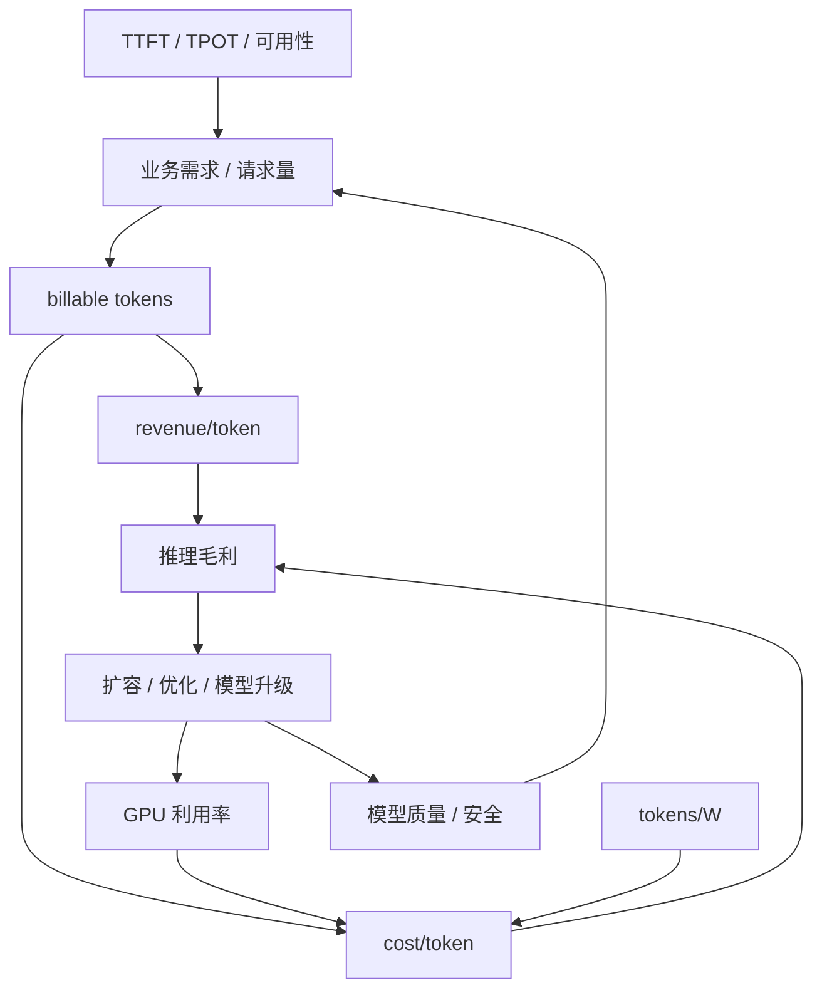

# 第 41 章：Token Factory 视角

## 本章回答的问题

- 为什么 token 可以作为 AI Factory 的核心产出度量？
- tokens/s、tokens/W、cost/token、revenue/token 分别回答什么问题？
- 如何把 GPU 利用率、推理毛利和训练 ROI 放到同一个经济模型中？

## 一个真实场景

一个 MaaS 平台请求量持续增长，但财务发现收入增长慢于 GPU 成本增长。平台看 QPS 是健康的，SRE 看 GPU 利用率也不低，业务看客户还在增长。进一步拆分后发现，长上下文请求和 reasoning 输出占比上升，output token 成本高于定价假设，失败重试也没有计入成本。

Token Factory 视角的价值，就是把 token 产量、能效、成本、收入和质量放在同一个模型里看。

## 核心概念

Token Factory 是 AI Factory 的经济性和产出度量视角。它关注在满足模型质量、安全和 SLO 的前提下，系统以多高吞吐、多低成本和多稳定体验生产可计量 token。

## 系统架构

本章在 41.7 中给出 Token Factory 经济模型图。它把业务需求、billable tokens、revenue/token、cost/token、GPU 利用率、tokens/W、SLO、质量和推理毛利连接起来。

## 41.1 token 是 AI Factory 的产出

对在线推理业务来说，token 是最细粒度、最容易计量的产出。用户请求进入 AI Factory，经过网关、模型服务、推理引擎、GPU 计算和流式返回，最终得到的是一串输出 token。平台可以记录 input token、output token、reasoning token、缓存命中、模型版本、租户和费用。

把 token 作为产出，不意味着忽略模型质量。低质量 token 没有商业价值，错误 token 还可能带来风险。Token Factory 视角强调的是：在满足质量和安全约束的前提下，系统如何以更高吞吐、更低成本、更稳定体验生产 token。

## 41.2 tokens/s

tokens/s 表示单位时间处理或生成的 token 数。它可以按模型、租户、实例、GPU、集群或整个平台聚合。在线推理常区分 input tokens/s 和 output tokens/s，因为二者对应 prefill 与 decode 的不同资源压力。

容量规划不能只看 QPS。一个低 QPS 的长上下文应用可能比高 QPS 的短问答应用更消耗 GPU。tokens/s 把不同请求长度归一到更接近计算负载的指标上，是推理资源规划和扩容决策的重要入口。

## 41.3 tokens/W

tokens/W 表示每瓦功耗可以生产多少 token。它把能效纳入 AI Factory 经济性分析。模型压缩、量化、推理引擎优化、batching、GPU 型号、机房制冷和电源效率都会影响 tokens/W。

这个指标适合比较不同架构和运行策略，但必须保持口径一致。不同模型、上下文长度、输出长度、SLO 和质量要求下的 tokens/W 不能直接横向比较。工程上应定义标准 workload，用于内部版本和集群之间的对比。

## 41.4 cost/token

cost/token 是生产单个 token 的单位成本。它不仅包括 GPU 折旧或租赁费用，还包括电力、机房、网络、存储、平台研发、运维、闲置容量、失败重试和管理成本。只把 GPU 小时除以 token 数，会低估真实成本。

一个简化公式可以写成：

```text
cost/token = total_cost / total_billable_tokens
```

进一步拆分：

```text
total_cost = gpu_cost + power_cost + datacenter_cost + network_storage_cost + platform_ops_cost + failure_waste_cost
```

这个公式不是为了精确到每分钱，而是迫使团队把成本项和技术决策连接起来。提高 GPU 利用率、减少失败任务、优化模型加载、降低 checkpoint 抖动，都可能降低 cost/token。

## 41.5 revenue/token

revenue/token 表示每个 token 带来的收入。MaaS 平台可能按 input/output token 分别定价，企业内部平台则可能把 revenue 替换为业务价值、成本节省或内部结算价。无论采用哪种口径，都需要把 token 产出和业务价值挂钩。

revenue/token 不能脱离质量和场景。同样数量的 token，用在代码生成、客服、搜索摘要、Agent 自动化或广告创意上，价值可能完全不同。Token Factory 视角不是鼓励生产更多无用 token，而是衡量可用 token 的经济性。

## 41.6 GPU 利用率

GPU 利用率是经济模型中的关键变量，但它不是单一指标。SM 利用率、HBM 利用率、显存占用、PCIe/NVLink 带宽、功耗、KV Cache 占用和请求队列都要结合看。推理服务可能 SM 利用率不高，但 HBM 或 KV Cache 已经成为瓶颈。

提高利用率也有代价。更大的 batch 可以降低 cost/token，但可能恶化 TTFT；更高资源共享可以减少闲置，但可能影响租户隔离；更激进的超卖可以提高短期利用率，但会增加尾延迟和故障风险。经济性优化必须受 SLO 约束。

## 41.7 推理毛利

推理毛利可以粗略理解为 token 收入减去 token 成本。平台需要同时看收入端、成本端和利用率端：定价是否覆盖模型与基础设施成本，GPU 是否被有效使用，失败重试和免费额度是否侵蚀毛利，长上下文或 reasoning 模型是否需要不同价格。



推理毛利的改善路径包括：优化模型和引擎、提升 batching 效率、区分在线和批量资源池、使用缓存、调整定价、降低空闲容量、减少故障浪费和提升机房能效。但每条路径都要评估对体验和质量的影响。

## 41.8 训练 ROI

训练 ROI 比推理毛利更难度量，因为训练成本发生在前，收益可能通过模型质量、产品能力、推理收入或内部效率长期体现。训练成本包括 GPU 时间、数据处理、失败重跑、评测、人力和机会成本。收益可能体现为更高转化率、更低推理成本、更强私有化交付能力或更高客户留存。

评估训练 ROI 时，应把训练任务纳入产品和平台闭环：训练目标是什么，评测指标是否能预测业务收益，模型上线后是否降低 cost/token 或提升 revenue/token，失败训练是否沉淀了数据、流程或平台能力。没有评测和上线闭环的训练，很难证明 ROI。

## 工程实现

Token Factory 报表应至少按模型和租户聚合：

```yaml
token_factory_report:
  model: example-llm
  tenant: team-a
  input_tokens: measured
  output_tokens: measured
  tokens_per_second: measured
  cost_per_token: calculated
  revenue_per_token: calculated
  slo:
    ttft: measured
    tpot: measured
  quality_gate: passed
```

没有质量和 SLO 约束的 token 报表会误导决策。

## 常见故障

- 只看 QPS，不看 token 长度和 output token 成本。
- 只统计 GPU 成本，忽略电力、存储、失败重试和平台运维成本。
- 把免费额度、失败重试和内部调用排除在成本之外。
- 追求 tokens/s，牺牲质量、安全和用户体验。

## 性能指标

- tokens/s、tokens/W、input/output token 占比。
- cost per token、revenue per token、推理毛利。
- GPU 利用率、HBM 使用、KV Cache 使用、功耗。
- TTFT、TPOT、错误率、限流率。
- 训练 GPU 小时、模型上线收益、训练 ROI。

## 设计取舍

更高 batch 可以降低 cost per token，但可能损害 TTFT。更小模型成本低，但质量可能不足。更强模型收入潜力高，但 GPU 成本和延迟更高。Token Factory 优化必须在质量、安全、SLO 和毛利之间共同决策。

## 小结

- Token Factory 是 AI Factory 的经济性视角，不是 AI Factory 的全部。
- tokens/s 描述产能，tokens/W 描述能效，cost/token 描述单位成本，revenue/token 描述收入能力。
- GPU 利用率必须和 HBM、KV Cache、功耗、SLO 和质量指标一起看。
- 推理毛利来自收入、成本、利用率、质量和体验的共同作用。
- 训练 ROI 需要把训练成本、模型质量、上线收益和平台沉淀放在同一闭环中评估。

## 延伸阅读

- TODO: 官方文档
- TODO: 经典论文
- TODO: 工程案例
