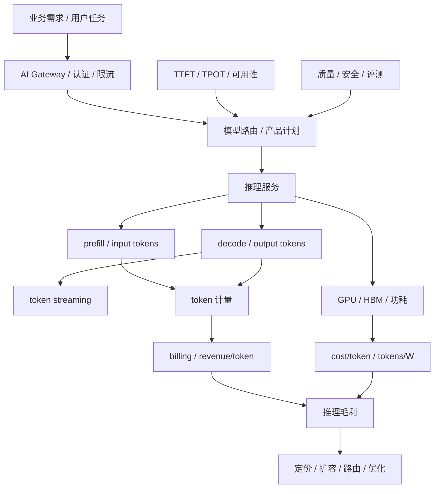
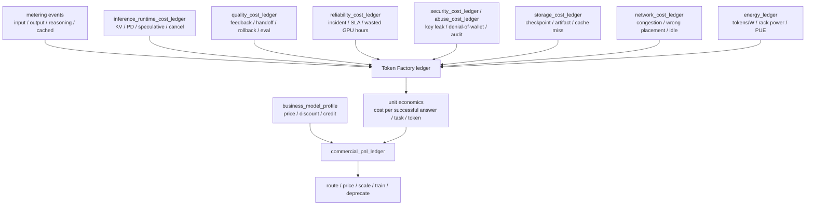
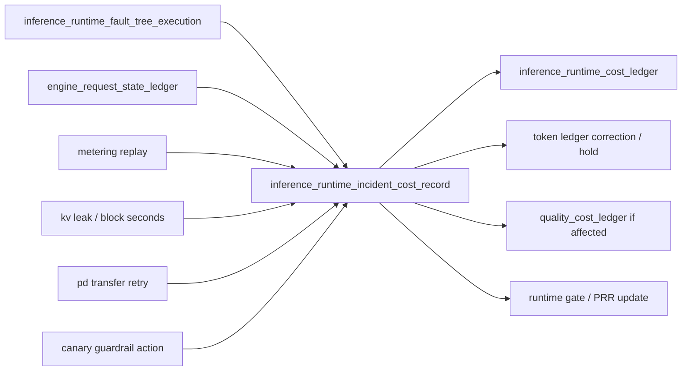
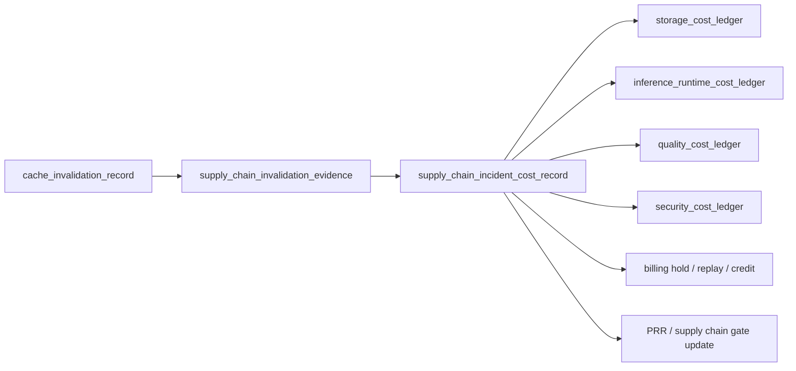
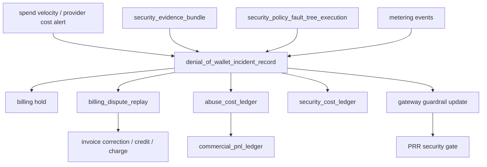
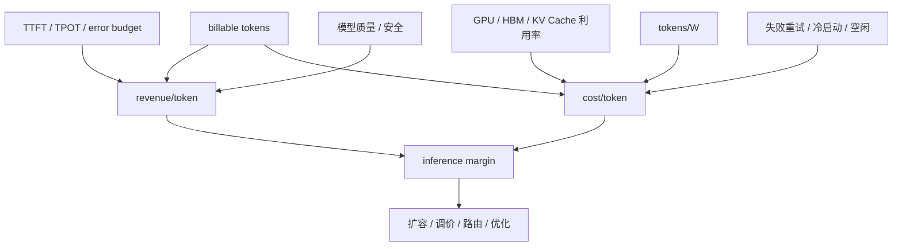
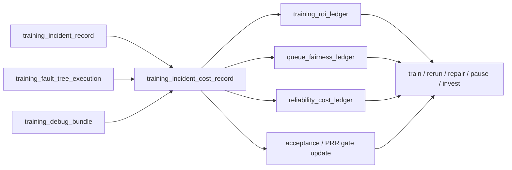
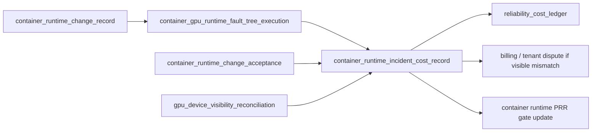
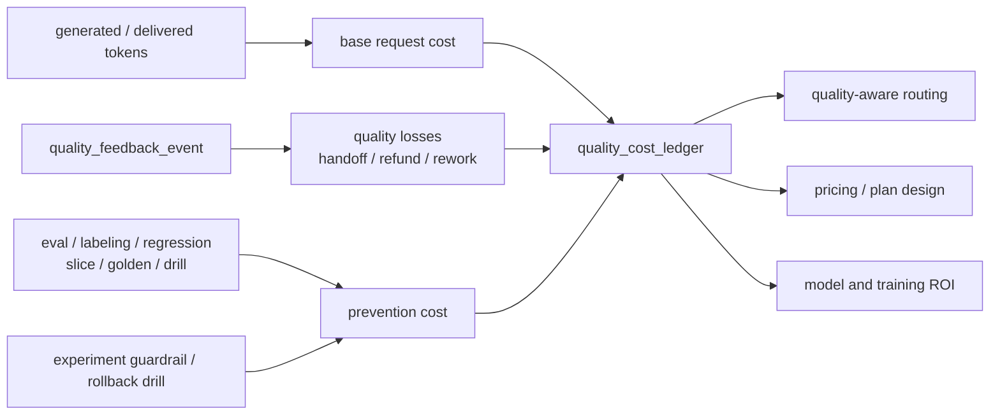

# 第 41 章：Token Factory 视角

## 本章回答的问题

- 为什么 token 可以作为 AI Factory 的核心产出度量？
- tokens/s、tokens/W、cost/token、revenue/token 分别回答什么问题？
- 如何把 GPU 利用率、推理毛利和训练 ROI 放到同一个经济模型中？

## 一个真实场景

一个 MaaS 平台请求量持续增长，业务报表看起来很好：API 调用数上升，活跃客户增加，模型目录也在扩展。财务团队却发现 GPU 租赁、电力和运维成本增长更快，单月毛利被明显压缩。平台团队最初用 QPS 和 GPU utilization 解释产能，认为系统并不浪费；SRE 团队看到可用性达标，也认为可靠性没有问题。问题在于，这些指标没有解释“每个 token 的成本和收入”。

进一步拆分后，团队发现请求形态已经变化。长上下文 RAG 请求增加，input token 占比上升；Agent 应用带来多轮 tool calling，单个用户任务背后有多次模型调用；reasoning 模型输出更长，output token 和 decode 时间增长；失败重试、免费额度和内部测试流量没有进入成本分摊。QPS 增长是真实的，但 token 结构变化让成本模型失真。

Token Factory 视角把问题改写为一组更可计算的问题：平台每秒生产多少可计费 token，每瓦电力生产多少 token，每个 token 的完整成本是多少，每个 token 带来多少收入，哪些 token 是高价值产出，哪些 token 只是失败重试或低质量输出。它不是把 AI Factory 简化为财务表，而是把工程指标和经济结果连接起来。

这个场景也说明，单看 GPU 利用率会误导。GPU 很忙不等于赚钱，tokens/s 很高不等于毛利好，cost/token 低也不等于用户体验好。AI Factory 的经营目标不是生产最多 token，而是在质量、安全和 SLO 约束下，稳定生产有价值、可计量、可解释成本的 token。

因此，Token Factory 是一种运营视角：它让平台团队、模型团队、SRE 和财务团队使用同一套事实讨论扩容、定价、模型路由、缓存、batching、免费额度和训练投资。没有这个视角，AI Factory 很容易在技术上繁荣，在经济上失控。

## 核心概念

Token Factory 是 AI Factory 的产出度量和经济性视角。它关注系统如何把用户需求、模型能力、GPU 计算、网络存储、电力和运维组织起来，最终生产 token，并让这些 token 具备可计量的成本、收入、质量和体验属性。它不是一个独立技术组件，也不等同于 AI Factory 本身。

AI Factory 是完整生产系统，覆盖 Application、Platform、Model、Runtime、Orchestration、GPU IaaS、Network/Storage、Physical 和横切能力。Token Factory 是观察这个系统的一种透镜：从 token 产出反推容量、成本、能效、毛利和投资回报。这个区分很重要，否则团队会把“优化 token 成本”误解为全部目标。

token 在工程上有多种口径。input token 主要影响 prefill、上下文处理和 KV Cache 初始状态；output token 主要影响 decode、streaming 和持续 GPU/HBM 压力；reasoning token 可能影响内部推理成本但不一定全部对用户可见；cached token、free token、failed token 和 retried token 需要在账务和成本中明确处理。口径不清，报表就不可用。

Token Factory 的核心不是“越多越好”，而是“单位有价值产出的效率”。高质量、低延迟、可计费、满足安全策略的 token 才是有效产出。低质量回答、重复生成、失败重试、恶意调用和未归因内部流量，会消耗 GPU 和电力，却不一定产生业务价值。经济模型必须能区分这些 token。

在运营上，Token Factory 把四类指标放在一起：产能指标如 tokens/s，能效指标如 tokens/W，成本指标如 cost/token，收入指标如 revenue/token。再把这些指标与 TTFT、TPOT、错误率、模型质量、安全和用户留存关联，才能形成可执行决策。

它还要求团队明确哪些数字可以直接测量，哪些只能估算。token 数、延迟和 GPU 时间通常可测；电力分摊、平台研发和业务价值往往需要规则估算。估算并不可怕，可怕的是口径不公开，导致不同团队用不同账本讨论同一个问题。

## 系统架构

Token Factory 架构可以从请求进入网关开始。用户请求经过认证、限流、模型路由、推理服务、prefill、decode、token streaming、计量和账单；每个阶段都留下影响经济性的信号。网关知道租户和产品计划，模型服务知道模型版本和请求形态，推理引擎知道 batch、KV Cache 和 GPU 使用，计量系统知道 input/output/reasoning token，成本系统知道 GPU、电力、存储和运维成本。

这套架构的难点是统一账实关系。一个用户任务可能对应多个 API 请求，一个 Agent 步骤可能调用多个模型和工具，一个失败请求可能已经消耗大量 prefill 计算，一个 streaming 中断请求可能产生了部分 token。若计量系统只记录最终成功请求，就会低估成本；若成本系统只按 GPU 小时平均分摊，就无法解释不同模型、租户和请求形态的毛利差异。

经济模型还必须接入质量和 SLO。推理平台可以通过更大 batch 降低 cost/token，但 TTFT 可能上升；可以用小模型降低成本，但质量可能下降；可以提高缓存命中，但需要接受缓存一致性和隐私边界；可以牺牲冗余提高利用率，但 error budget 会被消耗。Token Factory 的架构必须把这些约束放在同一张图里。

最终，Token Factory 的输出不是一张静态财务表，而是运营控制面：它支撑定价、容量规划、模型路由、资源池划分、免费额度策略、成本归因、扩容优先级和训练投资决策。只有当 token、GPU、SLO、质量、成本和收入能够相互追踪时，AI Factory 才能从“能跑”进入“可经营”。

架构上还要保留审计路径。任何毛利、成本或收入结论，都应能回溯到原始计量事件、资源使用记录和产品价格规则。否则报表只能用于展示，不能用于定价、赔付、预算和扩容。



Token Factory 还需要一张账本汇聚图。它回答“某个 token 或任务的成本从哪里来”，也回答“哪些工程对象会进入经营决策”。不同账本不是财务表的重复，而是从不同工程路径汇聚到同一个单位经济模型。



这张图提醒读者：`cost/token` 不是 GPU 成本除以 token 数那么简单。KV 泄漏、取消浪费、质量回归、SLA credit、安全事件、存储冷启动、网络拥塞和能耗都会进入单位经济。最终的经营动作也不只是一味扩容，可能是改路由、调价、压缩模型、限制免费额度、暂停某个场景或投资训练。

## 41.1 token 是 AI Factory 的产出

对在线推理业务来说，token 是最细粒度、最容易计量的产出。用户请求进入 AI Factory，经过网关、认证、租户限流、模型路由、推理服务、prefill、decode、KV Cache、CUDA kernel、GPU/HBM 和 streaming，最终得到的是一串 token。这个过程把应用需求转化为可观测、可计费、可优化的计算产物。

把 token 作为产出，并不意味着所有 token 价值相同。一个准确解决用户问题的输出 token，与一次失败重试中浪费的 token，在成本上都消耗资源，在价值上却完全不同。一个安全策略拦截前已经完成 prefill 的请求，也可能产生成本但没有收入。Token Factory 要做的第一件事，就是区分 billable token、internal token、failed token、cached token 和 evaluation token。

token 口径还决定平台治理。若只统计 output token，长上下文 RAG 的 prefill 成本会被低估；若不区分 reasoning token，复杂推理模型的真实成本会被隐藏；若不记录模型版本和租户，成本无法归因；若不记录缓存命中，优化效果无法衡量。计量不是账单系统的细节，而是 AI Factory 的事实基础。

在商业上，token 把模型能力变成可交易单位；在工程上，token 把 workload 转化为容量规划入口；在 SRE 上，token 把用户体验和基础设施压力联系起来。tokens/s 下降可能意味着产能下降，TTFT 上升可能意味着 prefill 或排队压力，output token 变长可能改变 GPU decode 负载。

因此，本章说 token 是产出，是为了建立统一语言：业务讨论需求量，平台讨论路由和限流，模型团队讨论质量，基础设施团队讨论 GPU 和能效，财务讨论毛利。token 让这些讨论有共同分母。没有共同分母，AI Factory 的扩容和优化往往只能靠局部指标驱动。

这个共同分母还要允许分层。平台可以在技术层统计所有 token，在商业层只统计可计费 token，在质量层只统计通过评测或用户可见的 token。分层口径让团队既能看清真实消耗，也能看清真实价值。

## 41.2 tokens/s

tokens/s 表示单位时间处理或生成的 token 数，是推理产能的核心指标。它可以按模型、租户、endpoint、replica、GPU、资源池、集群或整个平台聚合。在线推理通常需要区分 input tokens/s 和 output tokens/s，因为 input token 主要驱动 prefill，output token 主要驱动 decode，两者对应的瓶颈不同。

容量规划不能只看 QPS。一个低 QPS 的长上下文法律问答应用，可能比高 QPS 的短问答应用消耗更多 GPU 时间和 HBM；一个 Agent 任务的用户侧 QPS 很低，但内部多轮调用会放大 token。tokens/s 把请求长度差异纳入视野，能更接近真实计算负载。

tokens/s 也不能孤立解释。高 tokens/s 可能来自更大的 batch、更宽松的延迟目标或更短输出；低 tokens/s 可能是质量策略、长上下文、冷启动、缓存失效或 SLO 约束导致。比较两个系统的 tokens/s，必须说明模型、精度、上下文长度、输出长度、并发、batching 策略和延迟目标。

在生产中，tokens/s 应同时服务容量和运营。容量侧用它判断扩容、资源池划分和热点模型；运营侧用它判断业务增长、免费额度消耗、异常流量和成本摊销；SRE 用它解释 SLO 退化是否来自 token 负载变化，而不是简单归因到“系统慢”。

更细的做法，是按请求阶段拆分 tokens/s：prefill throughput、decode throughput、streaming throughput 和计量吞吐。prefill 瓶颈和 decode 瓶颈的优化路径不同，前者可能需要上下文压缩、prefix cache 或路由，后者可能需要 batching、KV Cache 管理或引擎优化。tokens/s 只有拆到阶段，才真正可行动。

生产看板还应展示 tokens/s 的峰值、P95 和租户分布。平均吞吐足够，不代表峰值不拥塞；全局吞吐健康，不代表某个高价值租户没有被低价值流量挤压。容量决策要看分布，而不是只看总量。

## 41.3 tokens/W

tokens/W 表示每瓦功耗可以生产多少 token，是 AI Factory 能效的核心指标。GPU、CPU、内存、网络、存储、风扇、液冷和机房供配电都会影响最终能效。对大规模 AI Factory 来说，电力不仅是成本项，也是容量约束；同样机房电力下，tokens/W 越高，能够承载的业务越多。

tokens/W 适合比较模型优化、推理引擎、硬件代际、精度策略、batching 和机房工程的综合效果。量化、KV Cache 优化、连续批处理、权重缓存、低功耗策略和更好的散热，都可能改善能效。但这个指标必须在相同 workload 口径下比较，否则结论会失真。

例如，一个短上下文模型的 tokens/W 高，并不说明它比长上下文模型更“优秀”；一个宽松延迟目标下的 tokens/W 高，也不能直接用于严格在线 SLO。能效比较必须注明模型、输入输出长度、并发、SLO、精度、GPU 型号、功耗采集口径和是否包含机房 PUE。没有这些条件，tokens/W 只是漂亮数字。

工程上，tokens/W 可以用于三类决策。第一是硬件和机房选型，判断同等电力下哪种 GPU 和服务器形态更合适；第二是运行策略优化，判断 batch、缓存和模型压缩是否真正节能；第三是容量治理，在电力紧张时优先调度高价值或高能效 workload。

tokens/W 还提醒团队不要只追求 GPU utilization。GPU 忙但功耗高、token 价值低、SLO 差，并不是好结果。能效指标必须与 revenue/token、cost/token、质量和 SLO 一起看。AI Factory 的能效目标不是省电本身，而是在电力边界内生产更多有价值 token。

在电力受限的数据中心，tokens/W 还会改变产品优先级。高能效、高毛利、低风险 workload 可以优先获得容量；低能效且低价值的批量任务可以错峰或迁移。能效因此从设施指标进入业务调度。

能效需要 `energy_ledger` 支撑。它把 GPU power、rack power、PUE 或设施开销、token 产出和 workload 标签放在同一张账本里：

```yaml
energy_ledger:
  window: 2026-06-19T10:00Z/2026-06-19T11:00Z
  scope:
    rack_capacity_unit: dc-a-rack-12
    resource_pool: inference-prod-h100
    model: af-chat-large
  energy:
    gpu_power_kwh: measured
    node_power_kwh: measured
    rack_power_kwh: measured
    facility_overhead_factor: measured_or_policy_defined
  production:
    input_tokens: measured
    output_tokens: measured
    billable_tokens: calculated
    tokens_per_watt: calculated
    joules_per_token: calculated
  constraints:
    power_limited: false
    cooling_limited: false
    capacity_derating_records: []
    cooling_degradation_records: []
    throttle_seconds: measured
  economics:
    energy_cost_per_token: calculated
    power_cooling_induced_waste: calculated
    derating_opportunity_cost: calculated
    thermal_recovery_retest_cost: calculated
```

这个账本让 tokens/W 可审计。否则团队很容易只用 GPU board power 估算能效，忽略 rack power、制冷开销、降频、低利用率和失败 token。能效优化也应能回溯到具体模型、资源池、rack 和时间窗口，才可能指导调度、定价和扩容。

`energy_ledger` 还应能解释“为什么能效变差”。如果 tokens/W 下降同时存在 `cooling_degradation_record`，根因可能是热退化导致 GPU 降频；如果存在 `capacity_derating_record`，成本不只是当前运行任务变慢，还包括被拒绝或迁移的 workload opportunity cost；如果 rack power 不变但 billable tokens 下降，问题可能在 workload 质量、调度、模型或推理 runtime。能效账本必须把能耗、产出和约束同时记录，否则 tokens/W 只能说明结果，不能指导动作。

能效治理不应鼓励牺牲 SLO。降低 power cap 可能改善短期功耗，但如果 TTFT、TPOT、训练 step time 或质量回归，单位成功任务成本可能上升。更可靠的做法是把 power cap、降额、冷却恢复、batch 策略和模型路由放进同一张报表，比较 energy cost saving 与 reliability/quality loss。Token Factory 关注的是有效 token，而不是最低瓦数。

## 41.4 cost/token

cost/token 是生产单个 token 的单位成本。最简单的公式是 total cost 除以 total tokens，但真正可用的成本模型必须拆分成本项和 token 口径。GPU 折旧或租赁、电力、制冷、机房、网络、存储、平台研发、运维、准入、故障、失败重试、闲置冗余和免费额度都会影响真实成本。

```text
cost/token = total_cost / effective_tokens

total_cost = gpu_cost
           + power_and_cooling_cost
           + datacenter_cost
           + network_storage_cost
           + platform_ops_cost
           + failure_and_retry_waste
           + reserved_capacity_cost
```

这里的 effective_tokens 也要定义清楚。按 billable tokens 计算，可以观察商业毛利；按 all generated tokens 计算，可以观察系统效率；按 successful user-visible tokens 计算，可以观察有效产出；按 model、tenant、endpoint 或 product plan 分摊，可以观察成本归因。不同口径回答不同问题，不能混用。

cost/token 的价值在于迫使工程决策显性化。提高 batching 可能降低 GPU 成本，但增加 TTFT；使用更小模型可能降低成本，但影响质量；保留更多热备会提高成本，但保护 SLA；减少 checkpoint 或缓存可能省钱，但增加失败恢复成本。只有把这些影响折算到 token 成本和 SLO，团队才能判断取舍。

成本模型还要处理失败和浪费。推理超时、用户取消、streaming 中断、模型冷启动、缓存未命中、异常重试和内部压测，都可能消耗 GPU 但不产生收入。若这些成本被平均摊到正常 token 上，平台会误判毛利和定价。高质量的 cost/token 报表必须能显示浪费来源。

最后，cost/token 不是越低越好。极端降低成本可能牺牲质量、安全、延迟和可靠性，最终降低 revenue/token 或用户留存。正确目标是在业务目标和 SLO 约束下，持续降低单位有效 token 成本，而不是把所有 token 都变得最便宜。

成本口径还要有版本。模型升级、驱动升级、推理引擎切换和价格调整都会改变 cost/token。没有版本标签，成本曲线变化无法归因，也无法判断优化是否真实有效。

安全成本也必须进入 cost/token。多租户 AI Factory 为了安全会投入 dedicated pool、KMS、密钥轮换、审计留存、日志脱敏、合规评测、红队、clean-to-reuse、观测访问控制、break-glass 审计和安全值班。这些成本不是“非生产开销”，而是生产可信 token 的必要成本。高敏租户购买的不是更贵的 GPU，而是更强的数据边界、隔离边界和可审计证据。

```text
security_cost_ledger =
    dedicated_isolation_cost(resource_class, unused_reserved_capacity)
  + kms_and_secret_operation_cost(key_count, rotation_count)
  + audit_retention_cost(audit_events, retention_window)
  + telemetry_redaction_cost(trace_volume, classification_level)
  + clean_to_reuse_cost(reuse_checks, retest_duration)
  + compliance_validation_cost(evaluations, evidence_packages)
  + security_oncall_and_incident_cost(security_incidents)

secure_cost_per_token =
    (base_request_cost + allocated_security_cost) / effective_tokens
```

这个账本能防止两个误判。第一个误判是把强隔离租户的成本平均摊给所有租户，导致共享池价格被抬高；第二个误判是为了降低 cost/token 削减审计、清理和隔离，短期成本下降，长期安全事故成本上升。安全成本应按 tenant、resource_class、data_classification 和 service_level 分摊，让用户理解“为什么专属、加密、长保留和强审计更贵”。

安全成本应落成结构化 `security_cost_ledger`，并引用生产证据对象，而不是只按安全团队预算平均分摊。它应区分预防成本、事故成本、争议成本和合规成本：预防成本购买隔离、密钥轮换、脱敏和审计；事故成本来自 key 泄露、trace 泄露、越权路由或 denial-of-wallet；争议成本来自 usage hold、账单重算和客户沟通；合规成本来自证据保留和审计导出。

```yaml
security_cost_ledger:
  window: 2026-06
  tenant: enterprise-a
  evidence:
    tenant_isolation_evidence: tie-20260620-001
    prompt_trace_redaction_records: sampled
    secret_boundary_evidence: sbe-20260620-001
    egress_provider_decisions: sampled
    security_evidence_bundle: seb-20260620-001-if_any
    billing_dispute_replay: bdr-20260620-001-if_any
  cost_components:
    dedicated_isolation_cost: calculated
    kms_and_secret_rotation_cost: calculated
    redaction_and_audit_retention_cost: calculated
    provider_boundary_validation_cost: calculated
    security_incident_response_cost: calculated_if_any
    billing_hold_and_replay_cost: calculated_if_any
  outputs:
    secure_cost_per_token: calculated
    security_prevention_cost_per_tenant: calculated
    security_incident_cost_per_token_delta: calculated
```

这个 ledger 让安全投入能和产品套餐、租户等级和数据等级对齐。一个高敏租户要求专属资源池、长审计保留、禁止第三方 provider、短期凭据和更强脱敏，那么它的 secure cost/token 应高于普通共享租户。反过来，如果普通租户不需要这些能力，就不应承担高敏租户的隔离成本。安全经济模型的目标不是降低安全，而是让安全边界和价格、SLA、合同可解释地一致。

网络成本也不能只按交换机和光模块折旧平均分摊。对 AI Factory 来说，更大的隐藏成本来自网络退化导致的 GPU idle、训练重跑、checkpoint 叠加、推理 streaming gap 和资源降级。`network_cost_ledger` 应把网络路径证据、通信 critical path 和拥塞事件连接起来：

```yaml
network_cost_ledger:
  window: 2026-06-20T10:00Z/2026-06-20T11:00Z
  scope:
    fabric: train-fabric-a
    resource_pool: training-prod-h100
    affected_workloads: [train-20260620-017]
  evidence:
    network_path_evidence: net-path-042
    congestion_event_record: net-cong-20260620-001
    rail_balance_report: rail-balance-20260620-017
    communication_critical_path_record: comm-critical-20260620-017
  cost_components:
    gpu_idle_due_to_network_hours: calculated
    failed_or_restarted_gpu_hours: calculated
    checkpoint_overlap_waste: calculated
    degraded_capacity_hours: calculated
    troubleshooting_labor_cost: optional
  attribution:
    likely_cause: rail_congestion_or_checkpoint_overlap
    owner: network_and_scheduler
    confidence: evidence_based
  economic_output:
    network_waste_cost: calculated
    cost_per_effective_training_token_delta: calculated_if_training_tokens_available
    roi_case_for_fabric_upgrade: input_to_capacity_planning
```

这份账本能回答“网络升级值不值得”的问题。若某个 fabric 的端口利用率很高但没有造成 exposed communication time，扩容优先级未必最高；若某条 rail 的拥塞长期造成大训练 GPU idle，即使平均利用率不高，也可能值得修拓扑、改 checkpoint 窗口或扩容。网络成本必须按 workload 影响计量，而不是按设备价格摊销。

推理运行时优化也必须进入成本账本。Speculative decoding、prefix cache、continuous batching、PD 分离和新的 engine profile 都可能让某个指标变好，同时让另一个成本变坏。`inference_runtime_cost_ledger` 的目标不是给每个 kernel 精确计价，而是让“快了多少、贵了多少、质量是否变、失败是否变多”可以被同一张表回答。

```yaml
inference_runtime_cost_ledger:
  window: 2026-06-20T10:00Z/2026-06-20T11:00Z
  endpoint: af-chat-large-prod
  serving_release: af-chat-large-20260619-r3
  engine_profile: vllm-prod-h100-v7
  workload_slices:
    - short_chat
    - long_context_qa
    - long_generation
  evidence:
    kv_block_ledger_rollup: kvbl-rollup-20260620-1000
    kv_block_leak_forensic_record: kv-leak-20260620-001-if-any
    speculative_decoding_report: spec-decode-20260620-001
    speculative_decoding_regression_record: spec-reg-20260620-001-if-any
    engine_canary_record: engine-canary-20260620-001
    engine_canary_guardrail_action: ecga-20260620-001-if-any
    pd_disaggregation_contract: pd-contract-if-enabled
    pd_transfer_evidence: pdx-rollup-20260620-1000-if-enabled
    endpoint_admission_decision_sample: sampled
    quality_cost_ledger: qcost-20260620-1000
  cost_components:
    prefill_gpu_cost: calculated
    decode_gpu_cost: calculated
    kv_block_seconds_cost: calculated
    wasted_kv_after_cancel_cost: calculated
    kv_leak_block_seconds_cost: calculated_if_leak_detected
    draft_model_cost: calculated_if_speculative
    speculative_regression_cost: calculated_if_quality_or_format_regressed
    kv_transfer_cost: calculated_if_pd_enabled
    pd_transfer_retry_cost: calculated_if_pd_enabled
    canary_capacity_and_rollback_cost: calculated
    failed_or_retried_request_cost: calculated
  outputs:
    cost_per_generated_token: calculated
    cost_per_delivered_token: calculated
    cost_per_successful_answer: calculated
    ttft_delta: measured
    tpot_delta: measured
    quality_adjusted_margin_delta: calculated
```

这份账本能防止三类常见误判。第一，speculative decoding 降低 TPOT，但 draft 模型成本、验证开销和质量回归可能让 `cost_per_successful_answer` 上升。第二，PD 分离降低 TTFT，但 KV transfer、两池容量比例和失败语义可能增加运维和重试成本。第三，prefix cache 命中提升 prefill 效率，但过大的缓存生命周期会产生 KV block 秒成本和隐私边界成本。运行时优化只有同时通过延迟、质量、账本和故障语义，才算经济上成立。

推理 runtime 事故应进一步生成 `inference_runtime_incident_cost_record`。`inference_runtime_cost_ledger` 是窗口账本，适合持续运营；事故成本记录则解释某次 TTFT、TPOT、streaming gap、KV leak、PD transfer failure 或 canary rollback 造成了多少损失、哪些 token 可计费、哪些成本应归入预防或浪费。没有这个对象，事故会在 SRE 中关闭，但毛利报表只看到平均 cost/token 变差。

```yaml
inference_runtime_incident_cost_record:
  record_id: iricr-inc-20260620-ttft-001
  incident_id: inc-20260620-ttft-001
  inference_runtime_fault_tree_execution: irfte-inc-20260620-ttft-001
  diagnostic_bundle: inference-runtime-bundle-20260620-001
  affected_scope:
    endpoint: af-chat-large-prod
    engine_profile: vllm-prod-h100-v7
    workload_slices: [long_context_qa]
    tenants: sampled_or_measured
  evidence:
    engine_request_state_ledger_samples: sampled
    kv_block_leak_forensic_record: optional
    pd_transfer_evidence: optional
    engine_canary_guardrail_action: optional
    metering_replay: required
  cost_breakdown:
    generated_but_not_delivered_token_cost: calculated
    failed_or_retried_request_cost: calculated
    wasted_kv_block_seconds_cost: calculated
    pd_transfer_retry_cost: calculated_if_pd_enabled
    canary_capacity_or_rollback_cost: calculated_if_canary
    sla_credit_or_refund_exposure: estimated_if_customer_visible
    support_and_engineering_response_cost: measured
  revenue_treatment:
    billable_tokens: reconciled
    non_billable_partial_tokens: reconciled
    billing_hold_required: true_or_false
    customer_credit_policy: applied_if_needed
  ledger_updates:
    inference_runtime_cost_ledger: append
    token_ledger: correction_if_needed
    quality_cost_ledger: append_if_quality_or_format_regressed
    prr_or_runtime_gate: update_if_preventable
```

这个对象的关键是把“引擎做了多少工作”和“用户收到了多少价值”分开。Generated token 可能因为客户端断连、streaming flush 失败或 guardrail 中断没有交付；KV block 可能在请求关闭后继续占用；PD transfer 可能已经消耗 prefill 资源但没有进入 decode；canary 回滚可能短期增加成本，却避免更大范围事故。Token Factory 不能只按生成 token 计算收入，也不能只按 delivered token 忽略未交付成本。



推理 runtime 成本还要计算“预防成本”。Canary 预留的 5% 容量、自动冻结后回滚到旧 profile 的低效率、为了保留诊断证据而增加的 trace 采样、为了修复 KV 泄漏而临时关闭长上下文 admission，都会让短期 cost/token 变差。但这些成本如果阻止了大范围低质量输出、账单争议或 SLA 违约，应该被记为 prevention cost，而不是简单归入浪费。Token Factory 的经济学不是把所有开销压低，而是把能降低风险暴露的开销和无效浪费区分开。

```yaml
runtime_prevention_cost:
  window: 2026-06-20T10:00Z/2026-06-20T11:00Z
  triggers:
    - engine_canary_guardrail_action: ecga-20260620-001
    - kv_block_leak_forensic_record: kv-leak-20260620-001
  prevention_cost_components:
    reserved_canary_capacity_cost: calculated
    rollback_to_less_efficient_profile_cost: calculated
    diagnostic_sampling_cost: calculated
    temporary_shed_revenue_loss: calculated
  avoided_loss_estimate:
    avoided_slo_penalty: estimated
    avoided_low_quality_answer_cost: estimated
    avoided_billing_dispute_cost: estimated
  decision:
    keep_guardrail: true
    tune_threshold: review_if_false_positive_high
```

这个账本让 runtime 团队和业务团队能讨论同一个问题：一次自动止血到底是“过度保守”还是“避免更大损失”。如果 guardrail 经常触发但没有避免实际损失，阈值可能过严；如果每次触发都避免了高价值租户事故，预留 canary 容量和诊断采样就是合理成本。

数据和模型产物供应链事故也会改变 token 经济性。旧权重、旧 tokenizer、旧 RAG 索引或受限数据缓存继续被调度使用时，问题不一定表现为 5xx；它可能表现为 token 计量漂移、质量回归、合规风险、冷启动变慢、回滚失败或客户账单争议。`supply_chain_incident_cost_record` 应把这些成本从普通存储费用中拆出来：

```yaml
supply_chain_incident_cost_record:
  record_id: scicr-20260620-artifact-recall-001
  trigger:
    reason: artifact_recall_or_tokenizer_bug_or_data_deletion_or_rag_index_permission_fix
    supply_chain_invalidation_evidence: scie-20260620-af-chat-large-r3
    cache_invalidation_record: cir-af-chat-large-20260620-001
  affected_scope:
    serving_releases: [af-chat-large-20260619-r3]
    endpoints: [af-chat-large-prod]
    tenants: measured_or_sampled
    resource_pools: [inference-premium-a]
  cost_breakdown:
    invalid_cache_served_token_cost: calculated_if_any
    token_count_reconciliation_cost: calculated_if_tokenizer_changed
    forced_cache_rewarm_cost: calculated
    cold_start_or_capacity_loss_cost: calculated
    rag_index_rebuild_cost: calculated_if_rag
    checkpoint_or_artifact_retention_extension_cost: calculated
    compliance_review_and_customer_credit_cost: calculated_if_needed
  revenue_treatment:
    billing_hold_required: true_or_false
    affected_invoice_windows: recorded
    credit_or_rebill_policy: applied_if_needed
  ledger_updates:
    storage_cost_ledger: append
    inference_runtime_cost_ledger: append_if_serving_impacted
    quality_cost_ledger: append_if_quality_regressed
    security_cost_ledger: append_if_boundary_violation
    production_readiness_review: update_if_preventable
```

这个记录能防止把供应链事故误算成“存储成本上升”。强制重建 cache 会增加冷启动和对象存储请求，延长旧 checkpoint 保留会增加容量成本，RAG 索引重建会消耗 embedding 和向量库写入，tokenizer 修复会触发 usage replay 和账单冻结，模型 artifact 召回会导致 canary 暂停或回滚。这些成本都来自同一个供应链事件，应该进入同一张经济表，而不是分散在存储、推理、客服和财务报表里。



## 41.5 revenue/token

revenue/token 表示每个 token 带来的收入或业务价值。对外 MaaS 平台可能按 input token、output token、reasoning token、模型等级、上下文长度和专属实例收费；企业内部平台可以把收入替换为内部结算、成本节省、效率提升或业务结果。无论哪种模式，都需要让 token 产出与价值单位建立关系。

revenue/token 不能脱离场景。同样一千个 token，用于代码生成、智能客服、金融研报、广告创意、Agent 自动化或内部问答，价值差异可能很大。一个低价通用模型可能带来大规模调用，一个高价专业模型可能调用少但价值高。平均 revenue/token 只能作为入口，真正决策要按模型、租户和业务线拆分。

收入口径还要处理折扣、免费额度、包月套餐、失败请求、内部调用和渠道分成。客户看到账单时按产品规则付费，平台看成本时按资源消耗付费，两者之间的差异就是毛利治理空间。若免费额度被高成本长上下文请求消耗，或者低价套餐被高成本模型占满，revenue/token 会迅速失真。

对于内部 AI Factory，revenue/token 可以转化为 value/token。比如客服场景看工单解决率和人工节省，代码助手看开发效率和缺陷率，数据分析 Agent 看分析周期缩短。内部价值不容易像外部收入那样精确计费，但仍要建立估算模型，否则资源分配会被“谁声音大”决定。

revenue/token 还要与质量绑定。低质量 token 会带来退款、人工接管、客户流失、安全风险和品牌损失；高质量 token 可以支撑更高定价、更高留存和更强差异化。Token Factory 视角不是鼓励生产更多 token，而是让每个 token 的价值和成本都可被讨论。

收入模型也要接受负反馈。若某类高收入请求频繁触发 SLO 违约或人工赔付，账面 revenue/token 可能高，真实贡献却下降。收入必须和服务质量、赔付、客户续约和支持成本一起看。

还要建立滥用经济模型。Stolen key、免费额度被刷、prompt flood、长上下文轰炸、Agent 循环调用、批量接口误用和 denial-of-wallet，会让平台产生大量成本但未必产生收入。它们经常穿过“系统可用”指标，因为请求可能都是 2xx，只是经济上异常。Token Factory 应把这些流量标记为 `abuse_or_anomaly_tokens`，并计算对预算、毛利和 error budget 的影响。

```text
abuse_loss =
    generated_token_cost(suspicious_generated_tokens)
  + prefill_cost(suspicious_input_tokens)
  + third_party_provider_cost(suspicious_provider_calls)
  + reserved_capacity_displacement_cost(impacted_premium_requests)
  + investigation_and_credit_cost(security_incident)

adjusted_revenue_per_token =
    recognized_revenue / (billable_tokens + abuse_or_anomaly_tokens_weighted)
```

滥用经济模型不是为了把所有异常都转嫁给客户，而是为了让平台能快速止血和定责。若异常来自客户 key 泄露，可能触发 credential rotation、billing hold 和争议流程；若来自平台限流缺陷，可能需要退款和策略修复；若来自产品免费额度设计，可能需要调整 guardrail。没有滥用账本，平台只会在月末发现毛利异常。

滥用和 denial-of-wallet 还应进入 `abuse_cost_ledger`。它把异常 token、异常 provider 调用、预算消耗、受影响租户、billing hold 和争议 replay 串起来。这样平台能在小时级别发现经济异常，而不是月末看毛利才发现免费额度被刷、长上下文攻击或 Agent 循环调用。

```yaml
abuse_cost_ledger:
  window: 2026-06-20T10:00Z/2026-06-20T11:00Z
  incident: dow-20260620-001
  evidence:
    denial_of_wallet_incident_record: dow-20260620-001
    security_evidence_bundle: seb-20260620-001
    billing_dispute_replay: bdr-20260620-001
    policy_decision_records: sampled
  suspicious_usage:
    input_tokens: measured
    output_tokens: measured
    provider_calls: measured
    agent_steps: measured_if_applicable
  cost_impact:
    generated_token_cost: calculated
    provider_cost: calculated
    displaced_premium_capacity_cost: calculated
    investigation_and_credit_cost: calculated
  resolution:
    billing_hold: active_or_closed
    tenant_chargeable: true_false_or_split
    platform_policy_fix_required: true_or_false
```

这个账本能把“安全异常”转成经营动作：吊销 key、关闭 provider route、收紧预算、退款或追偿、修复 SDK、调整免费额度。对 AI Factory 来说，经济异常往往比技术错误更早暴露滥用；如果成本系统不能按小时级别识别异常 token，安全团队会失去最有效的早期信号。

`denial_of_wallet_incident_record` 应把一次经济型攻击或误用写成可定责对象。它不同于普通安全事件记录：重点不是只有“谁访问了什么”，还包括“谁的预算被消耗、哪些成本本应被阻断、哪些高价值请求被挤占、哪些 usage 需要 hold、哪些 provider 成本不可追回”。这类事故如果只进入安全工单，最后会在财务月结时变成毛利异常；如果只进入账单系统，又无法解释凭据和策略责任。Token Factory 需要把它放在安全、计费和 SRE 之间。

```yaml
denial_of_wallet_incident_record:
  incident_id: dow-20260620-001
  detection:
    first_signal: spend_velocity_alert
    detected_by: gateway_budget_guard
    window: 2026-06-20T10:00Z/2026-06-20T10:18Z
  scope:
    tenant: enterprise-a
    projects: [support-copilot-prod]
    credentials: [key_6f2c_redacted]
    endpoints: [chat_completions, agent_runs]
    route_pools: [inference-premium-a]
    providers: [third-party-x-if_any]
  evidence:
    security_evidence_bundle: seb-20260620-001
    security_policy_fault_tree_execution: spfte-sec-20260620-001
    egress_provider_decisions: sampled_or_full
    policy_decision_records: sampled_or_full
    metering_events: immutable_refs
  usage_delta:
    suspicious_input_tokens: measured
    suspicious_output_tokens: measured
    suspicious_reasoning_tokens: measured_if_available
    suspicious_provider_calls: measured
    suspicious_agent_steps: measured_if_applicable
    displaced_premium_requests: estimated_or_measured
  responsibility:
    likely_domain: leaked_customer_key_or_platform_policy_gap_or_free_quota_design_or_unknown
    tenant_chargeability: chargeable_or_not_chargeable_or_split_pending_replay
    billing_hold: active
  containment:
    credentials_frozen: true
    provider_fallback_disabled: true_if_relevant
    max_output_reduced: true_if_relevant
    agent_step_limit_applied: true_if_relevant
  economic_impact:
    token_cost: calculated
    provider_cost: calculated
    capacity_displacement_cost: calculated
    investigation_and_support_cost: calculated
    credit_or_refund_reserve: calculated_if_needed
```

这个对象使定责不再依赖口头判断。若 `responsibility.likely_domain` 是 leaked customer key，平台仍可能先做 billing hold，等 `billing_dispute_replay` 关闭后再决定正常计费或分摊；若是 platform policy gap，异常 usage 应更多进入内部损失和策略修复；若是 free quota design，说明产品 guardrail 失效，成本应该进入产品策略评审。相同的 token 成本，在不同责任边界下对应完全不同的财务和工程动作。



`abuse_cost_ledger` 也要区分不同成本层。第一层是直接推理成本，包括 input/output/reasoning token、prefill、decode 和 KV 占用。第二层是外部 provider 成本，因为 provider 往往按更高价格或更严格合同结算，且不一定能追回。第三层是容量置换成本：异常流量占用 premium pool 后，正常高价值请求被排队、降级或 fallback。第四层是处置成本：安全值班、客户沟通、账单重算、credit reserve、产品策略变更。只看 direct token cost，会系统性低估 denial-of-wallet 的真实损失。

```yaml
abuse_cost_ledger:
  ledger_id: acl-20260620-001
  window: 2026-06-20T10:00Z/2026-06-20T11:00Z
  incident: dow-20260620-001
  cost_layers:
    direct_inference:
      prefill_cost: calculated
      decode_cost: calculated
      kv_occupancy_cost: calculated
      failed_or_cancelled_generation_cost: calculated
    provider:
      provider_request_cost: calculated
      provider_minimum_commit_burn: calculated_if_applicable
      provider_egress_audit_cost: calculated_if_contract_requires
    displacement:
      premium_queue_delay_cost: calculated
      fallback_to_higher_cost_model: calculated
      lost_or_degraded_requests: measured_or_estimated
    response:
      investigation_cost: calculated
      support_and_customer_comm_cost: calculated
      billing_replay_cost: calculated
      credit_or_refund_reserve: calculated_if_needed
  allocation:
    tenant_chargeable: pending_replay
    platform_absorbed: pending_replay
    product_guardrail_cost: pending_replay
  actions:
    gateway_guardrail_update: required_if_policy_gap
    pricing_or_free_quota_review: required_if_product_gap
    prr_gate_update: required_if_launch_gap
```

这个 ledger 的输出不应只给财务。Gateway 需要它判断哪些 guard 真正降低损失，产品需要它调整免费额度和试用策略，SRE 需要它评估异常流量是否挤占 error budget，商业团队需要它解释客户账单。一个好的 denial-of-wallet 闭环，会在小时级别产生账本，在日级别完成责任 replay，在周级别关闭 guardrail 和 PRR 行动项。若只能在月末毛利报表中看到异常，平台已经错过了止血窗口。

商业化经营还需要 `commercial_pnl_ledger`。Token Factory 的账本解释 token、GPU、质量、安全和可靠性成本，但商业负责人还需要按产品线、客户、合同和交付模式看 P&L：收入来自哪里，折扣和免费额度消耗多少，SLA credit 吃掉多少毛利，客户支持和私有化交付成本是否被低估，预留容量和库存风险是否被正确分摊。没有这张账本，平台可能在技术上优化了 cost/token，却仍然因为折扣、赔付、支持和交付成本而商业倒挂。

```yaml
commercial_pnl_ledger:
  period: 2026-06
  scope:
    business_model_profile: bmp-enterprise-maas-standard-v2
    customer_segment: enterprise
    products:
      - maas_premium
      - private_rag_addon
  revenue:
    recognized_usage_revenue: calculated
    subscription_or_commit_revenue: calculated
    private_delivery_revenue: calculated_if_applicable
    professional_service_revenue: calculated_if_applicable
  contra_revenue:
    free_quota: calculated
    discount: calculated
    sla_credit: linked_to_sla_credit_replay
    refund_or_billing_adjustment: linked_to_billing_dispute_replay
  cost_of_service:
    token_factory_cost: linked_to_token_ledger
    inference_runtime_cost_ledger: linked
    reliability_cost_ledger: linked
    quality_cost_ledger: linked
    security_cost_ledger: linked
    abuse_cost_ledger: linked_if_any
    support_cost: calculated
    private_deployment_cost: linked_to_private_deployment_acceptance_record
    reserved_capacity_and_inventory_cost: calculated
  outputs:
    gross_margin: calculated
    margin_rate: calculated
    cost_per_successful_task: calculated_if_task_based
    pnl_risks:
      - high_sla_credit_rate
      - support_cost_growth
      - private_customization_cost
      - low_utilization_reserved_capacity
```

这张账本的价值在于防止“局部盈利幻觉”。例如某个 MaaS 客户的 token revenue 很高，但它购买了高 SLA、专属容量、长审计保留和强支持，如果 SLA credit、reserved capacity 和支持成本不进入 P&L，就会高估毛利；某个私有化项目合同金额很大，但每次升级都需要现场专家、离线镜像重做和客户环境调试，如果 private deployment cost 不进入账本，项目会在长期维护期亏损；某个 Agent 平台任务单价很高，但失败重试、人工接管和工具外部 API 成本大，必须用 cost per successful task 重新评估。

`commercial_pnl_ledger` 也能反向约束产品承诺。若高 SLA 产品的赔付率长期高于可靠性预防成本，应该增加冗余、收紧准入或提高价格；若私有化交付的定制成本持续上升，应该减少特殊分支、加强标准交付包或提高专业服务定价；若免费额度经常被高成本长上下文或 Agent 循环消耗，应该调整产品 guardrail。商业 P&L 不是财务季报，而是 AI Factory 的产品控制面。

## 41.6 GPU 利用率

GPU 利用率是 Token Factory 的重要变量，但它不是一个单一数字。SM utilization、HBM bandwidth、显存占用、KV Cache 水位、PCIe/NVLink、功耗、温度、kernel occupancy、batch 队列和实例空闲时间，都可能解释“GPU 是否被有效使用”。只看平均 GPU utilization，容易掩盖真正瓶颈。

在线推理尤其如此。某个服务 SM 利用率不高，但 HBM bandwidth 已接近瓶颈；某个模型显存占用高，无法继续放大 batch；某个长上下文场景 KV Cache 耗尽，导致排队和驱逐；某个服务 GPU 看似忙，但大部分时间消耗在低价值重试上。利用率必须和 token 产出、SLO、质量和成本一起解释。

提高利用率也有代价。更大的 batch 可以降低 cost/token，却可能恶化 TTFT；更多模型混部可以减少空闲，却增加资源争抢和故障定位难度；更高超卖可以提升短期产能，却放大长尾延迟；减少冗余可以提高平均利用率，却降低事故恢复能力。利用率优化必须接受 error budget 和 SLA 约束。

训练场景的利用率也要区分。大规模训练的 GPU idle 可能来自数据加载慢、checkpoint 慢、NCCL 等待、rank skew 或坏节点；不是所有 idle 都能靠多塞任务解决。若为了提高利用率把在线推理和大训练粗暴混部，可能造成两边都不稳定。利用率指标必须带 workload 语义。

更成熟的做法，是把 GPU 利用率转化为 effective GPU hours。有效 GPU 小时只计算产生有效 token、有效训练 step 或有效评测结果的资源消耗；失败重跑、长时间 pending 后失败、空转、低效拓扑和异常重试都被标记为浪费。这样，利用率才从设备指标变成经济指标。

利用率还应按资源池解释。在线推理池需要冗余和低延迟，训练池需要完整拓扑，批量池可以追求更高填充率。把所有 GPU 混在一起算平均利用率，会掩盖每类资源池的真实目标。

## 41.7 推理毛利

推理毛利可以粗略理解为 token 收入减去 token 成本。它不是财务部门独有指标，而是推理平台是否可持续扩张的核心反馈。若 revenue/token 覆盖不了 cost/token，业务增长会放大亏损；若毛利看似健康但 SLO 退化，客户留存和未来收入会受损；若毛利依赖免费资源或隐藏成本，就不可持续。

推理毛利的收入端由定价、模型等级、客户结构、套餐、免费额度、失败赔付和业务价值决定。成本端由 GPU、电力、机房、推理引擎效率、batching、缓存、KV Cache、模型大小、网络存储、运维和故障浪费决定。二者之间没有天然同步关系，必须通过报表和控制策略持续校准。

毛利分析应按模型和请求形态拆分。短问答、长上下文、代码生成、批量推理、Agent、reasoning 模型、多模态模型，对 GPU 和 token 的消耗完全不同。统一价格可能便于销售，但会让高成本场景侵蚀整体毛利。平台需要知道哪些场景赚钱，哪些场景需要限额、调价或工程优化。

改善毛利的路径有很多：模型量化、蒸馏、路由、缓存、continuous batching、prefix cache、PD 分离、资源池分层、批量推理错峰、定价调整、减少冷启动、降低失败重试、提升能效和优化机房 PUE。每条路径都有副作用，必须在质量、安全和 SLO 下验证。

推理毛利还影响扩容决策。若某个模型的毛利稳定、需求增长、SLO 接近容量边界，扩容是合理投资；若某个业务 token 很多但毛利为负，盲目扩容只会放大损失。Token Factory 把“要不要买更多 GPU”变成可计算问题，而不是单纯看需求曲线。

毛利也要区分短期和长期。新模型早期可能毛利不高，但能带来战略客户、数据反馈或产品入口；成熟模型若长期毛利为负，则必须解释其战略价值。经济模型提供事实，不自动替代业务判断。



## 41.8 训练 ROI

训练 ROI 比推理毛利更难度量，因为训练成本通常先发生，收益可能在模型质量、产品能力、推理收入、内部效率、品牌、数据资产和后续模型迭代中逐步体现。一次预训练、后训练或微调任务，可能消耗大量 GPU 小时、数据处理、人力、评测和机会成本，但收益不一定能在当月财务报表中出现。

训练成本至少包括 GPU 时间、网络存储、数据清洗、实验管理、失败重跑、checkpoint、评测、人力和平台机会成本。失败训练也不一定全是浪费，如果它沉淀了数据质量问题、训练稳定性经验或模型选择证据；但如果没有记录假设、评测和复盘，失败就无法转化为资产。

训练收益要与业务目标连接。一个微调模型可能提升客服解决率，一个压缩模型可能降低推理 cost/token，一个领域模型可能提高客户留存，一个基础模型可能支撑多个产品线。若训练目标只写成“提升 benchmark”，但 benchmark 与业务结果没有关系，ROI 就无法被证明。

评估训练 ROI，应建立从实验到上线的闭环：训练前定义假设、成本预算和评测口径；训练中记录资源消耗、失败和数据版本；训练后进行离线评测、红队、安全和性能验证；上线后观察 revenue/token、cost/token、用户行为和 SLO。没有上线反馈，训练 ROI 只能停留在实验室。

训练 ROI 还要纳入机会成本。相同 GPU 可以用于预训练、微调、批量推理或高毛利在线服务。某个训练任务即使技术上成功，也可能不是当期最优投资。AI Factory 的成熟运营，会把训练队列、推理毛利和业务路线图放在一起决策，让 GPU 投向最能增加长期能力和经济回报的地方。

训练 ROI 需要训练账本，而不是只看任务是否完成。训练账本应记录 allocated GPU hours、effective training GPU hours、wasted GPU hours、checkpoint、评测、上线状态和后续推理收益。否则一次训练成本会停留在 GPU 小时，无法连接到模型质量、推理成本下降或收入增长。

```yaml
training_roi_ledger:
  training_job: exp-20260619-001
  model_candidate: af-base-v4-ckpt120000
  evidence:
    training_lifecycle_event: tle-20260620-001
    framework_runtime_matrix: frm-h100-train-20260620
    parallelism_plan_record: ppr-llm-20260620-001
    placement_commit_record: pcr-exp-20260619-001
    launcher_contract: lc-torchrun-h100-202606
    rendezvous_evidence: rv-exp-20260620-001
    first_effective_step_record: fes-exp-20260620-001
    rank_topology_contract: rtc-llm-20260620-001
    nccl_env_contract: nec-h100-rdma-20260620
    collective_trace_record: optional
    communication_critical_path_record: optional
    communication_regression_record: optional_if_recent_change
    checkpoint_overlap_evidence: optional_if_checkpoint_spike
    queue_fairness_ledger: qfl-20260620-0000
    training_accounting_reconciliation: acct-20260620-001
    training_incident_record: optional
  costs:
    allocated_gpu_hours: measured
    effective_training_gpu_hours: measured
    wasted_gpu_hours:
      queue_startup: measured
      launcher_or_env_error: measured_if_any
      rendezvous_failure: measured
      no_first_effective_step: measured_if_any
      failed_restarts: measured
      preemption_lost_progress: measured
      placement_degradation: measured
      communication_critical_path_idle: measured
      rank_topology_violation: measured_if_any
      nccl_env_mismatch: measured_if_any
      checkpoint_overlap_idle: measured_if_any
    storage_cost:
      checkpoints: measured
      dataset_reads: measured
    evaluation_cost: measured
  outputs:
    checkpoints: [ckpt-step-120000]
    evaluation_reports: [eval-report-001]
    model_registry_version: optional
  business_link:
    serving_model: optional
    inference_cost_delta: measured_after_launch
    revenue_delta: measured_or_estimated
    quality_delta: evaluation_summary
    opportunity_cost_vs_inference: calculated
```

这个 ledger 让训练投资能被追踪到后续结果。若训练模型没有上线，ROI 不能按推理收入计算，但仍可记录为研究资产或失败学习；若模型上线后把 cost/token 降低，收益应回写到训练 ROI；若模型质量提升但推理成本上升，业务要判断 revenue/token 是否足以覆盖。训练 ROI 是跨时间窗口的事实链，不是单次作业报表。

训练 ROI 还应吸收调度与生命周期事实。一个任务“成功完成”并不代表投资效率高：它可能长时间等待 gang，placement 降级导致训练吞吐下降，被抢占后丢失大量进度，或者 Slurm accounting 与平台成本口径没有对齐。`training_lifecycle_event` 说明 GPU 小时在哪个阶段消耗，`queue_fairness_ledger` 说明等待和借用是否符合资源承诺，`placement_commit_record` 说明性能是否受拓扑降级影响，`training_incident_record` 说明失败是否消耗了额外机会成本。把这些事实放入 ROI，训练队列才能和推理毛利在同一张经济表里比较。

训练 ROI 的起点应是 `first_effective_step_record`，不是 Pod Running、Slurm Running 或容器启动。`launcher_contract` 能解释启动参数是否来自受控模板，`rendezvous_evidence` 能解释 world size 和 rank 是否完整，`first_effective_step_record` 能解释 GPU 何时真正开始产生训练 token。若任务在 rendezvous 前失败，成本应归入启动或调度浪费；若 rendezvous 后首个有效 step 前失败，成本应归入数据、框架或首个 collective；若首个有效 step 后失败，才进入训练稳定性和 checkpoint 恢复分析。这个阶段拆分能防止把启动浪费摊进正常训练成本。

训练通信成本还需要单独拆出来。`communication_critical_path_record` 证明哪些 collective 真正暴露在 step 关键路径上，`rank_topology_contract` 说明是否有不可接受的拓扑违反，`nccl_env_contract` 说明环境是否偏离受控模板，`checkpoint_overlap_evidence` 说明周期性 spike 是否来自 checkpoint 与通信叠加。只有这些证据齐备，才能把“通信慢”换算成 `communication_critical_path_idle`，进而进入训练 ROI。否则团队容易把端口利用率、NCCL test 带宽或平均 op 时间误当作成本事实。

这个拆分会改变投资判断。如果大部分浪费来自 rank topology violation，优先投入调度和资源碎片治理；如果来自 NCCL env mismatch，优先投入 runtime 模板和容器准入；如果来自 checkpoint overlap，优先投入存储、异步 checkpoint 或隔离网络；如果来自真实 fabric baseline 退化，才进入网络扩容或维修讨论。Token Factory 的经济模型应帮助团队找到最便宜的有效修复，而不是默认把问题归结为“需要更多 GPU 或更贵网络”。

训练事故还应生成 `training_incident_cost_record`，作为 `training_incident_record` 和 `training_roi_ledger` 之间的桥。事故复盘关注根因和动作，ROI 账本关注投资结果；中间需要一个成本对象把 GPU 小时、checkpoint 回退、队列机会成本、模型发布日期延迟和工程处理成本统一口径。没有它，训练事故很容易只在 SRE 系统里关闭，而没有进入资源治理和商业决策。

```yaml
training_incident_cost_record:
  record_id: ticr-inc-20260620-train-001
  training_incident_record: inc-20260620-train-001
  training_fault_tree_execution: tfte-inc-20260620-train-001
  training_debug_bundle: tdb-exp-20260620-001
  affected_investment:
    training_job: exp-20260620-031
    model_candidate: af-base-v4-ckpt120000
    queue: training-prod
    resource_pool: h100-rdma-prod
  cost_breakdown:
    allocated_gpu_hours_during_incident: measured
    effective_training_gpu_hours_lost: measured
    checkpoint_rollback_gpu_hours: calculated
    queue_opportunity_cost_gpu_hours: calculated
    storage_and_checkpoint_extra_cost: measured
    engineering_response_hours: measured
    model_release_delay_days: estimated
  attribution:
    primary_cost_domain: launcher_or_rendezvous_or_rdma_or_checkpoint_or_model_code
    confidence: low_medium_or_high
    preventable_by_existing_gate: true_or_false
    missing_gate_or_evidence: optional
  ledger_updates:
    training_roi_ledger: append
    queue_fairness_ledger: append_if_capacity_impact
    reliability_cost_ledger: append_if_customer_or_slo_impact
    acceptance_or_prr_gate: update_if_preventable
```

这个成本记录会改变事故优先级。一个 10 分钟 NCCL hang 如果影响 512 张 GPU，并导致 checkpoint 回退和下游模型发布延迟，它的成本不应等同于单个服务实例重启；一个首步前失败如果反复发生，虽然没有 loss 回退，却可能消耗大量启动 GPU 小时和队列窗口；一个 checkpoint overlap 如果每小时发生一次，单次 spike 不严重，累计成本可能超过一次明显故障。把事故成本标准化后，团队才能比较“修 runtime 模板”“优化 checkpoint”“扩网络”“增加准入测试”哪一个投资回报更高。



事故成本不应被机械地全部归入“浪费”。如果事故暴露了未知硬件批次问题、补齐了故障树、提升了 checkpoint 恢复策略，部分成本可以记为学习资产；但只有当它产生了可复用规则、测试或门禁时，才有资格这么记录。否则“失败也是经验”会变成掩盖低质量运行的借口。

## 工程实现

Token Factory 的工程实现从数据模型开始。每个请求、任务、模型版本、租户、endpoint、replica、GPU pool 和计费计划，都要有稳定标识。计量事件必须记录 input token、output token、reasoning token、cached token、失败状态、延迟、模型版本、路由结果和 trace id。没有这些字段，后续成本和收入都只能粗略平均。

核心账本应采用 token ledger，而不是只存最终账单金额。Ledger 是追加式事实表，记录每个请求或任务产生了哪些 token、这些 token 是否可计费、归属哪个租户和模型、对应哪些成本池。账单、毛利、报表和异常审计都从 ledger 派生。这样，即使价格规则变化，也可以重算账单；即使请求失败，也能保留成本事实。

```yaml
token_ledger_event:
  event_id: evt_001
  trace_id: trace-abc
  tenant: enterprise-a
  project: support-copilot
  requested_model: af-chat-large
  served_model: af-chat-large-202606
  endpoint: af-chat-large-prod
  resource_pool: inference-premium-a
  token_class:
    input: 2380
    output_generated: 642
    output_delivered: 640
    reasoning: 0
    cached_input: 512
  lifecycle:
    close_reason: stop
    failure_stage: none
    retry_of: null
  economics:
    billable_input: 1868
    billable_output: 640
    price_plan: enterprise-standard-2026
    cost_pool: gpu-h100-prod-a
```

Token ledger 要与资源成本账本对齐。资源账本记录 GPU 小时、功耗、资源池、节点、实例、训练作业和推理 endpoint；token ledger 记录 token 产出。两者通过 resource_pool、endpoint、时间窗口和模型版本关联。早期可以按资源池和时间窗口分摊，成熟后再按 replica、请求阶段或 GPU 时间细化。关键是口径公开，并能解释误差。

第二步是建立成本分摊规则。GPU、电力、机房、网络、存储、平台运维和失败浪费可以按不同维度分摊：推理按 token、模型和资源池；训练按 GPU 小时、作业和项目；共享基础设施按容量或实际使用量。规则不必一开始完美，但必须公开、稳定、可复盘，否则业务无法信任报表。

第三步是把 Token Factory 报表接入运营动作。报表至少按模型、租户、资源池和时间窗口展示 tokens/s、tokens/W、cost/token、revenue/token、毛利、SLO、错误率、缓存命中和浪费。发现长上下文成本异常时触发定价或路由评审；发现失败重试成本升高时触发 SRE；发现某模型毛利下降时触发工程优化或产品策略调整。

```yaml
token_factory_report:
  scope:
    model: example-llm
    tenant: team-a
    endpoint: chat-completions
    gpu_pool: inference-prod
  metering:
    input_tokens: measured
    output_tokens: measured
    reasoning_tokens: measured_if_applicable
    failed_tokens: measured
    cached_tokens: measured
  economics:
    cost_per_token: calculated
    revenue_per_token: calculated
    gross_margin: calculated
  constraints:
    ttft: measured
    tpot: measured
    error_budget: tracked
    quality_gate: required
```

第四步是做审计闭环。计量系统要能对账：网关日志、推理服务日志、计费事件和成本报表是否一致；异常流量、免费额度、内部调用和失败请求是否被正确分类。Token Factory 一旦用于定价和毛利，数据质量就必须达到财务和工程共同可接受的标准。

第五步是建立治理动作。对毛利为负的模型，触发定价、路由或工程优化评审；对失败 token 异常增长的租户，触发限流和故障诊断；对 tokens/W 明显偏离的资源池，触发能效和硬件检查。报表必须连接动作，否则只是事后解释。

第六步是保留人工校正机制。早期成本分摊难免粗糙，特殊客户和内部项目也可能需要例外处理。系统应记录例外原因、审批人和有效期，避免临时调整变成永久黑箱。

经济模型也应明确阶段成本。Input token 主要消耗 prefill，output token 主要消耗 decode，cached input token 可能降低 prefill 但仍有缓存占用成本，失败 token 可能没有收入但有资源消耗。把所有 token 用同一成本平均，会误导定价和优化。

```text
request_cost =
    prefill_cost(input_tokens - cached_input_tokens)
  + cache_cost(cached_input_tokens, kv_cache_lifetime)
  + decode_cost(output_generated_tokens)
  + gateway_platform_cost(request_count, stream_duration)
  + rag_cost(embedding, vector_search, rerank, context_tokens)
  + agent_cost(model_calls, tool_calls, sandbox_runtime, external_api)
  + model_artifact_distribution_cost(cache_miss, model_load_time)
  + failure_waste_cost(failure_stage, retry_count)
  + reliability_risk_cost(error_budget_burn, incident_impact)

gross_margin =
    billable_revenue(input_tokens, output_tokens, plan)
  - allocated_request_cost
```

这个公式不要求一开始精确到每个 kernel，但要求团队承认不同阶段成本不同。长上下文 RAG 的问题通常在 prefill 和 KV Cache，长文生成的问题通常在 decode，Agent 的问题通常在多次调用和失败重试。成本模型若能按阶段切开，工程优化才会指向正确位置。

RAG/Agent 成本尤其不能被平均到 LLM token 里。RAG 的成本包括 query embedding、向量检索、关键词检索、metadata/ACL filter、rerank、context assembly、额外 input token、引用校验和索引维护；Agent 的成本包括多次模型调用、工具执行、沙箱运行、外部 API、重试、人工确认、回滚和安全审计。一个请求最终只输出 200 个 token，但内部可能消耗了数万 input token 和几十次工具调用。若报表只展示 output token 成本，业务会低估 Agent 的真实经济负担。

```yaml
rag_agent_cost_attribution:
  attribution_id: rac-20260620-0001
  scope:
    tenant: enterprise-a
    application: support-copilot
    task_slice: rag_agent_support
    window: 2026-06-20T00:00Z/2026-06-20T01:00Z
  rag_inputs:
    retrieval_permission_decisions: sampled
    rag_context_snapshots: sampled
    embedding_requests: measured
    rerank_pairs: measured
    selected_context_tokens: measured
    truncated_context_tokens: measured
  agent_inputs:
    agent_budget_ledgers: sampled
    agent_tool_execution_records: sampled
    model_calls_per_successful_task: measured
    tool_calls_per_successful_task: measured
    sandbox_runtime_seconds: measured
    external_api_calls: measured
  derived:
    rag_cost_per_successful_answer: calculated
    agent_cost_per_successful_task: calculated
    permission_filter_cost: calculated_or_allocated
    failed_run_waste_cost: calculated
```

这个归因表能支持两类决策。第一类是架构决策：某个客服任务到底该用强模型直接回答，还是用 RAG + 小模型，还是用 Agent + 工具；比较时必须用每成功任务成本，而不是单次 LLM cost。第二类是治理决策：若某个 Agent 的 `failed_run_waste_cost` 很高，应该优化 planning、工具 schema 或预算停止条件；若 RAG 的 `truncated_context_tokens` 很高，应该优化 chunk、rerank 或 context budget，而不是盲目增加上下文窗口。

训练成本也应拆出存储路径：

```text
training_storage_cost =
    dataset_read_cost(dataset_manifest, bytes_read, request_count)
  + checkpoint_write_cost(checkpoint_size, interval, metadata_ops)
  + checkpoint_restore_cost(restore_count, restore_duration)
  + artifact_retention_cost(retention_policy, age, replicas)
  + storage_induced_waste(gpu_idle_seconds_due_to_io)
```

这能防止一个常见误判：训练贵不一定是模型计算贵，也可能是数据格式、checkpoint 策略或 artifact 生命周期让 GPU 等存储。把存储浪费显式写入 ledger，平台才会投资 reshard、cache、manifest、预热和清理自动化。

更完整的 `storage_cost_ledger` 应把训练和推理共同使用的数据路径纳入同一口径。它不是存储账单的复制，而是把存储行为转成 GPU 时间、ready 时间、失败恢复和长期保留成本。

```yaml
storage_cost_ledger:
  window: 2026-06-20T10:00Z/2026-06-20T11:00Z
  scope:
    tenant: foundation-model-team
    resource_pool: training-prod-h100
    workloads: [train-20260620-017, endpoint-af-chat-large-prod]
  evidence:
    dataset_manifest: dataset-manifest@sha256:example
    dataset_lineage_record: dlr-corpus-v3-2-20260620
    checkpoint_commit_record: ckpt-step-120000
    checkpoint_restore_drill: crd-20260620-ckpt-120000
    model_artifact_provenance: map-af-chat-large-20260619-r3
    model_artifact_distribution: af-chat-large-20260619-r3
    cache_residency: cache-residency-rack-11
    cache_invalidation_record: optional
    storage_security_boundary: ssb-model-and-training-prod
    storage_evidence: storage-ev-20260620-017
  cost_components:
    dataset_read_backend_cost: calculated
    dataset_cache_prewarm_cost: calculated
    checkpoint_write_and_restore_cost: calculated
    checkpoint_gpu_idle_cost: calculated
    artifact_distribution_cost: calculated
    model_cold_start_capacity_cost: calculated
    orphan_artifact_retention_cost: calculated
    local_nvme_reserved_capacity_cost: calculated
    dataset_lineage_governance_cost: calculated
    checkpoint_restore_drill_cost: measured
    artifact_provenance_and_signing_cost: measured
    cache_invalidation_and_rewarm_cost: calculated
    storage_security_boundary_cost: allocated
  outputs:
    storage_cost_per_training_token: calculated
    storage_cost_per_delivered_token: calculated_if_serving
    storage_waste_gpu_hours: calculated
    supply_chain_cost_per_release: calculated
    cleanup_savings_candidate: calculated
```

这份 ledger 能回答“为什么应该投入存储工程”。如果 checkpoint pause 造成大量 GPU idle，优化两阶段提交、分片格式或 checkpoint 窗口可能比增加 GPU 更划算；如果模型冷启动导致扩容慢，权重预热和 cache residency 可能直接改善毛利；如果 orphan artifact 和过期 checkpoint 占用高性能路径，清理自动化本身就是降本项目。存储成本的关键不是每 TB 多少钱，而是它如何改变有效 token 和有效训练 step。

供应链相关成本不应被视为“文档成本”。`dataset_lineage_governance_cost` 购买的是数据可追溯和删除请求可执行，`checkpoint_restore_drill_cost` 购买的是故障时少丢训练进度，`artifact_provenance_and_signing_cost` 购买的是模型发布可证明，`cache_invalidation_and_rewarm_cost` 购买的是回滚和撤销能力，`storage_security_boundary_cost` 购买的是高价值数据不被随意复制。若这些成本不进入账本，短期看可以省钱，长期会以事故、合规风险、回滚失败和客户信任损失的形式返回。

可靠性成本也应进入经济模型。一次 SLO 违约可能产生赔付、退款、客户支持成本、失败 token、重试 token、GPU 空转、机会成本和后续加固投入；一次训练 incident 可能造成 checkpoint 回滚、队列重排、重复训练和模型发布时间延迟。示例：

```text
reliability_cost =
    slo_violation_cost(failed_or_slow_requests, customer_tier)
  + error_budget_burn_cost(error_budget_burn)
  + incident_response_cost(oncall_time, mitigation_resources)
  + retry_and_failure_token_cost(failed_tokens, retried_tokens)
  + wasted_gpu_cost(wasted_gpu_hours)
  + delayed_launch_cost(model_release_delay)
```

把可靠性成本显式化，可以防止一个常见误判：为了降低 cost/token 而减少冗余、缩短灰度、跳过准入或压缩维护窗口，短期报表会变好，但长期毛利可能被事故吞掉。Token Factory 不是只计算稳定态成本，还要计算风险成本。SRE 事件一旦进入 ledger，可靠性投入才有经济解释。

可靠性成本应落成 `reliability_cost_ledger`。它把 `incident_record`、`reliability_evidence_bundle`、`slo_budget_ledger`、`baseline_invalidation_record`、`maintenance_window` 和 `capacity_activation_record` 连接到 token、GPU 小时和收入影响。这个 ledger 不是为了把每次事故都精确到财务小数点，而是为了让工程决策能比较数量级：一次跳过灰度节省了多少时间，后续事故消耗了多少 GPU 小时和客户信任；一次准入复测延迟上线，避免了多少重跑和赔付。

```yaml
reliability_cost_ledger:
  window: 2026-06
  scope:
    service: maas-chat-completions
    resource_pool: inference-premium-a
    fault_domain: dc-a/rack-12
  evidence:
    incidents: [inc-20260620-ttft-001]
    reliability_evidence_bundles: [reb-20260620-ttft-rack12]
    slo_budget_ledger: slo-maas-chat-202606
    baseline_invalidation_records: [bir-20260620-001]
    container_runtime_change_records: [crc-gpu-runtime-20260620]
    gpu_device_visibility_reconciliation: sampled
    gpu_nic_topology_evidence: sampled_if_training
    capacity_activation_records: [dc-a-rack-12-2026-06]
  losses:
    failed_or_slow_billable_tokens: measured
    failed_or_slow_requests: measured
    wasted_gpu_hours: calculated
    requeued_or_retried_gpu_hours: calculated
    compensation_or_credit: calculated_if_applicable
    support_and_oncall_cost: calculated
    delayed_capacity_cost: calculated
    delayed_model_launch_cost: calculated_if_training_related
    runtime_visibility_mismatch_cost: calculated_if_detected
    topology_misplacement_gpu_idle_cost: calculated_if_training
  prevention_and_control_cost:
    acceptance_retest_cost: measured
    canary_capacity_cost: measured
    hot_spare_cost: measured
    container_runtime_reconciliation_cost: measured
    topology_evidence_collection_cost: measured
    runbook_and_drill_cost: measured
  derived:
    reliability_cost_per_delivered_token: calculated
    incident_cost_per_successful_answer: calculated
    container_runtime_risk_cost_per_token: calculated_if_applicable
    prevention_cost_vs_loss_avoided: estimated_policy
```

这个账本会改变成本优化的讨论方式。若某个资源池长期 `reliability_cost_per_delivered_token` 高，平台应查资源健康、变更节奏、准入覆盖和故障域设计，而不是只压低 GPU 单价；若 prevention cost 很高但事故损失更低，说明可靠性策略可能过度；若 delayed_capacity_cost 持续高，说明采购、机房、准入或资源池激活链路存在瓶颈。可靠性不再是“多花的钱”，而是影响成功 token 成本的生产变量。

容器 runtime 和拓扑证据也要进入经济口径。一次 `visible_device_mismatch` 可能让租户用到未授权 GPU、造成账单争议或安全事故；一次 GPU/NIC 拓扑错配可能让训练 step time 增加，消耗大量无效 GPU 小时；一次 CDI spec 失效可能让扩容副本全部卡在 `CreateContainerError`，推理峰值流量下 TTFT 违约。把这些事件记入 `reliability_cost_ledger`，可以证明为什么要投入 runtime 准入、设备可见性对账和拓扑证据采集。它们不是额外文书，而是在保护 token 生产线不被底层漂移吞噬。

当容器 runtime 变更本身造成影响时，应生成 `container_runtime_incident_cost_record`。它专门计算 Toolkit/CDI/NRI/RuntimeClass/device plugin strategy 变更带来的无效成本：Pod 创建失败导致的扩容缺口，GPU Pod 看错设备导致的租户隔离或账单争议，多卡训练因为 RDMA/GPU 拓扑错配产生的 GPU idle，Operator 升级后 DCGM 标签变化导致的计量断链，以及回滚、复测和客户沟通成本。没有这个对象，runtime 事故会被平均摊进可靠性成本，团队很难判断是否值得投入更严格的准入和 canary。

```yaml
container_runtime_incident_cost_record:
  incident_id: inc-20260620-gpu-runtime-001
  linked_evidence:
    container_runtime_change_record: crc-gpu-runtime-20260620-001
    container_gpu_runtime_fault_tree_execution: cgrfte-20260620-001
    container_runtime_change_acceptance: crca-20260620-001
    gpu_device_visibility_reconciliation: sampled
    oci_runtime_injection_diff: sampled
  affected_scope:
    node_pool: h100-inference-canary
    affected_pods: measured
    affected_gpu_hours: calculated
    affected_requests: measured_if_inference
    affected_training_jobs: measured_if_training
  cost_components:
    failed_pod_start_capacity_cost: calculated
    visible_device_mismatch_billing_risk: calculated_if_any
    runtime_rollback_and_retest_cost: measured
    training_gpu_idle_due_to_topology_mismatch: calculated_if_any
    inference_slo_or_credit_cost: calculated_if_any
    observability_reconciliation_cost: calculated_if_metric_labels_changed
  prevention_signal:
    missing_gate: runtime_canary_or_visibility_reconciliation_or_dcgm_schema_check
    recommended_prr_gate_update: required_if_gap_found
```



这份记录能把“底层小升级”翻译成 Token Factory 语言。一次 CDI spec 生成错误如果只影响 canary 节点，成本可能只是复测和回滚；如果它发生在生产推理池高峰前，成本就包括未启动副本、TTFT 违约、fallback、客户 credit 和支持工单；如果可见性错配让 Pod 看到了未分配 GPU，成本还包括隔离风险和账单争议。成本分层后，平台才能决定下一次 runtime 变更是否需要更长 canary、更严格 PRR，或把 Operator 升级与 driver/Toolkit release train 合并管理。

质量成本需要单独的 `quality_cost_ledger`。低质量 token 不一定失败，也不一定触发 5xx，但会造成用户追问、重新生成、人工接管、退款、客户支持、投诉、流失、额外评测和修复成本。若这些成本被平均摊进正常请求，平台会误以为某个低成本模型毛利更高，实际却把成本转嫁给运营和客户成功团队。质量成本账本让“便宜但没用的 token”从报表里显形。

```yaml
quality_cost_ledger:
  window: 2026-06-19T00:00Z/2026-06-20T00:00Z
  scope:
    tenant: enterprise-a
    application: support-chat
    model_version: af-chat-large-202606
    task_slice: rag_citation
    serving_quality_contract: sqc-af-chat-20260619-r3
  evidence:
    quality_evidence_bundle: qeb-20260620-support-001
    rag_agent_evidence_bundle: raeb-20260620-001
    quality_gate_execution: qge-af-chat-20260620-001
    eval_slice_contract: esc-support-202606
    golden_set_governance_record: gsg-support-202606
    online_experiment_guardrail: oeg-support-20260620
    human_feedback_evidence: sampled
    routing_quality_decision_records: sampled
    serving_rollback_records: [srr-20260620-001]
    serving_rollback_drills: [srd-af-chat-20260620]
    rag_quality_regression_records: [rqr-20260619-0007]
    agent_budget_ledgers: sampled
    agent_tool_execution_records: sampled
  production:
    billable_tokens: measured
    low_quality_tokens: estimated_from_feedback_and_eval
    repeated_prompt_tokens: measured
    regeneration_tokens: measured
    selected_context_tokens: measured_if_rag
    failed_agent_run_tokens: measured_if_agent
  quality_losses:
    human_handoff_cost: calculated
    refund_or_credit: calculated_if_applicable
    support_ticket_cost: calculated
    churn_risk_cost: estimated_policy
    rework_cost: calculated
    experiment_harm_cost: calculated_from_guardrail_breach
    failed_tool_execution_cost: calculated_if_agent
    security_containment_cost: calculated_if_tool_incident
  prevention_cost:
    evaluation_run_cost: measured
    eval_slice_contract_maintenance_cost: allocated
    golden_set_governance_cost: allocated
    human_labeling_cost: measured
    human_feedback_review_cost: measured
    red_team_cost: measured
    regression_suite_cost: measured
    rollback_drill_cost: measured
  derived:
    quality_adjusted_cost_per_token: calculated
    cost_per_successful_answer: calculated
    cost_per_successful_task_by_slice: calculated
    rollback_drill_prevention_value: estimated_from_loss_avoided
    value_token_ratio: calculated
```

质量调整后的成本可以这样理解：

```text
quality_adjusted_cost_per_token =
  (base_request_cost
   + quality_losses
   + allocated_prevention_cost)
  / successful_user_visible_tokens

cost_per_successful_answer =
  (all_request_cost_for_task_slice
   + human_handoff_cost
   + regeneration_cost
   + refund_or_credit)
  / successful_tasks
```

这个口径会改变模型路由和定价。一个小模型的 base cost/token 低，但如果导致更多追问和人工接管，`cost_per_successful_answer` 可能高于大模型；一个强模型输出更长，base cost/token 高，但如果提高一次解决率，质量调整后的单位成功成本可能更低。Token Factory 的目标不是最低 token 成本，而是在质量和 SLO 约束下的最低成功任务成本。

质量成本账本还应能反向更新路由和发布策略。若 `routing_quality_decision_record` 显示某个 task slice 被频繁路由到便宜模型，但 `quality_cost_ledger` 显示人工接管和投诉成本上升，Gateway scorecard 应降低该模型在该切片的权重；若 `serving_rollback_record` 显示一次质量回滚避免了持续低质量损失，预留 canary 容量和回滚演练就有经济依据；若某次 `quality_gate_execution` 的 prevention cost 很高但几乎没有线上质量损失，团队可以评审门禁是否过度。质量经济模型的作用不是惩罚模型团队，而是让质量投入、路由策略和商业结果在同一张表里对齐。

评测和治理成本也要分清“浪费”和“保险”。`eval_slice_contract` 维护、golden set 访问审计、human feedback review、线上实验 guardrail 和 rollback drill 都会消耗预算，但它们保护的是高价值任务的毛利下限。一次 guardrail 自动冻结可能减少当日 token 收入，却避免更多退款、人工接管和客户流失；一次 rollback drill 看起来没有产出 token，却能把事故恢复时间从不可控变成可估计。经济上应比较 prevention cost 与 loss avoided，而不是把所有治理成本都当作 overhead。

```yaml
quality_prevention_value_record:
  window: 2026-06-20T00:00Z/2026-06-21T00:00Z
  scope:
    application: support-chat
    task_slice: rag_citation
  prevention_actions:
    online_experiment_guardrail_freeze:
      guardrail: oeg-support-20260620
      experiment_harm_cost_observed: calculated
      projected_loss_without_freeze: estimated_policy
    serving_rollback_drill:
      drill: srd-af-chat-20260620
      rollback_time_confidence: improved
      projected_incident_loss_reduction: estimated_policy
    golden_set_governance:
      governance_record: gsg-support-202606
      avoided_invalid_release_decision: estimated_policy
  derived:
    prevention_cost: calculated
    loss_avoided: estimated_policy
    prevention_roi: calculated_or_review
```

这个记录不能被误用成精确财务承诺，因为许多损失只能估算；它的价值是让工程治理进入同一套商业语言。没有这张账，团队只会看到评测、人工、演练和 guardrail 的成本，看不到它们避免了多少低质量 token、错误路由、账单争议和客户支持成本。Token Factory 的经济性不是把每个流程压到最低，而是把每个 token 生产成“有用、可计量、可承诺”的输出。



## 常见故障

第一类故障是只看 QPS，不看 token。QPS 上升可能是短请求增长，也可能是 Agent 内部调用放大；QPS 稳定也可能掩盖 input token 和 output token 激增。解决方向是把容量、账单和告警都改成请求数与 token 数并行观察，并按请求形态拆分。

第二类故障是只统计 GPU 成本。GPU 是最大成本项之一，但不是全部。电力、制冷、机房、网络、存储、平台研发、运维、失败重试、冗余和采购机会成本都会进入真实 cost/token。忽略这些成本，会让低价策略看起来可行，直到规模扩大后暴露亏损。

第三类故障是收入口径和成本口径不一致。销售按套餐收费，平台按 token 计量，成本按 GPU 小时分摊，三者没有统一映射，结果无法判断某个客户、模型或场景是否盈利。解决方向是建立从产品计划到资源消耗的映射表，并定期对账。

第四类故障是追求 tokens/s 牺牲体验。更大的 batch、更高混部和更少冗余可以提高短期产出，却可能让 TTFT、TPOT 和错误率恶化。若报表只奖励产量，不约束质量和 SLO，平台会优化错误目标。Token Factory 必须把 error budget 和质量门禁放进经济模型。

第五类故障是把 Token Factory 当成 AI Factory 全部。经济指标能指导运营，但不能替代模型安全、数据治理、平台可靠性和用户价值判断。只追逐低成本 token，会导致质量下降和产品信任受损。正确做法是把 Token Factory 放在 AI Factory 系统工程之内。

第六类故障是报表粒度过粗。全平台平均 cost/token 看起来健康，但某些模型、租户或长上下文场景可能持续亏损。平均值适合看趋势，不能替代分组归因。运营动作必须落到可负责的对象上。

第七类故障是把训练成本和推理收入割裂。模型训练投入如果不进入长期 ROI 分析，团队会低估模型迭代成本；推理收益如果不反馈训练队列，GPU 投资也无法优化。

第八类故障是只统计 allocated GPU hours，不统计 effective training GPU hours。作业卡在排队后启动、NCCL 初始化、checkpoint 恢复或数据预检阶段，都会消耗时间和有时消耗 GPU，但不产生有效训练 token。若这些浪费被摊进正常训练成本，团队会误判模型训练本身昂贵，而忽略调度、镜像、网络或存储问题。

第九类故障是把存储成本平均摊薄。数据集反复读取、checkpoint 保留过多、模型权重冷启动、cache miss、对象存储请求限流和孤儿 artifact，都会消耗成本并影响 token 产出。若这些成本只按全平台平均分摊，团队无法看到某个模型、租户或训练任务的真实成本。Token Factory 应把 storage_cost/token 和 storage_waste_gpu_hours 纳入账本。

第十类故障是把可靠性当作纯成本中心。冗余、准入、灰度、回滚演练、健康隔离和 SRE 值班都会增加显性成本，但它们减少失败 token、赔付、重跑、客户流失和事故响应成本。若经济模型只看稳定态 GPU 利用率，就会倾向于削掉这些保护机制。正确做法是同时展示 reliability_cost/token、incident_waste_gpu_hours 和 error_budget_burn 对毛利的影响。

第十一类故障是忽略低质量 token。某个模型 cost/token 更低，线上回答也很少报错，但用户反复追问、客服人工接管和退款增加。若报表只看 billable token 和 GPU 成本，会错误地扩大这个模型流量。解决方向是把 `quality_feedback_event`、人工接管、重新生成、投诉和退款汇总到 `quality_cost_ledger`，用 cost per successful task 而不是只用 cost/token 做决策。

第十二类故障是把评测和人工标注视为纯研发成本。评测、红队、人工标注和回归维护确实消耗成本，但它们减少线上低质量损失和事故复发。若没有 prevention cost 与 quality loss 的对比，组织可能削减评测预算，短期毛利变好，长期质量损失上升。质量成本账本能解释哪些质量投入是经济上合理的。

## 性能指标

Token Factory 的产能指标包括 total tokens/s、input tokens/s、output tokens/s、per-model tokens/s、per-tenant tokens/s、replica throughput 和峰谷负载。它们回答系统能生产多少 token、瓶颈在哪个模型或租户、是否需要扩容或限流。产能指标要与上下文长度和输出长度分布一起看。

能效指标包括 tokens/W、tokens/kWh、GPU power、node power、PUE 相关分摊和单位 token 电力成本。它们回答同样电力下能生产多少有效 token，以及不同硬件、引擎、精度和机房策略是否更高效。能效指标必须保持 workload 口径一致。

成本与收入指标包括 cost/token、revenue/token、gross margin、failure waste cost、free quota cost、reserved capacity cost 和 customer/model margin。它们回答哪些业务创造价值，哪些业务消耗资源但毛利不足。成本指标必须能按模型、租户、资源池和产品计划拆分。

体验和质量指标包括 TTFT、TPOT、TPOP、E2E latency、错误率、限流率、streaming 中断、fallback、人工接管、质量评测和安全拦截。它们防止经济优化牺牲用户体验和模型可信度。没有体验指标约束的 cost/token，可能会把平台带向错误方向。

质量经济指标包括 low quality token rate、regeneration token ratio、human handoff cost、refund per task、complaint cost、quality adjusted cost/token、cost per successful answer、quality prevention cost、regression prevented loss 和 value/token。它们把模型质量从主观体验转成经济事实。对于企业客户，cost per successful answer 往往比 cost per output token 更能说明产品价值。

训练相关指标包括训练 GPU 小时、有效 step、失败重跑成本、checkpoint 成本、评测通过率、上线收益、推理成本改善和训练 ROI。它们把离线训练投资与在线 token 经济性连接起来。最终目标是让训练投入能解释为质量提升、收入提升、成本下降或长期能力沉淀。

存储相关经济指标包括 dataset read cost、checkpoint write/restore cost、model artifact distribution cost、cache hit savings、orphan artifact cost、metadata hotspot cost 和 storage-induced GPU idle hours。它们把网络存储层的设计选择连接到 token 成本。比如提高权重 cache 命中可以降低 TTFT 和冷启动浪费，优化 checkpoint manifest 和写入模式可以减少 wasted GPU hours，清理过期 checkpoint 可以降低长期存储成本。

可靠性相关经济指标包括 error budget burn、incident count、incident_cost、failed token cost、retry token cost、SLO credit、wasted GPU hours due to incident、change rollback cost、degraded capacity cost 和 maintenance opportunity cost。它们回答可靠性问题对 token 经济性造成了多少真实损失。一个高利用率资源池如果经常触发 incident，未必比低一点利用率但稳定的资源池更经济。

训练 ROI 指标应至少拆成四层：资源消耗、有效进展、质量产出和商业反馈。资源消耗回答花了多少，追回浪费；有效进展回答是否产生训练 token 和 checkpoint；质量产出回答模型是否更好；商业反馈回答上线后是否改变 revenue/token、cost/token 或用户价值。四层缺一，ROI 都会被误读。

数据质量指标同样重要。计量缺失率、账单对账差异、成本分摊覆盖率、异常 token 占比和报表延迟，决定这些经济指标是否可信。Token Factory 首先是事实系统，其次才是优化系统。

所有指标都应有 owner 和解释文档。没有 owner 的指标没人修，没人解释的指标容易被误用。经济指标一旦进入预算和绩效，口径治理就成为基础设施的一部分。

Token Factory 指标还需要防止 Goodhart 定律。若只考核 cost/token，团队可能牺牲质量和可靠性；若只考核 tokens/s，团队可能放大低价值 token；若只考核 revenue/token，团队可能忽略失败赔付和长期留存。因此关键经济指标必须配套约束指标。

| 目标指标 | 必须同时约束 | 否则可能出现的问题 |
| --- | --- | --- |
| 降低 cost/token | TTFT、TPOT、质量、安全、错误率 | 低成本但用户不可用 |
| 提高 tokens/s | P99 延迟、KV pressure、失败率 | 高吞吐但长尾恶化 |
| 提高 revenue/token | 续约、退款、人工接管、支持成本 | 短期高价但长期流失 |
| 提高 GPU 利用率 | error budget、drain 能力、故障恢复 | 利用率高但无冗余 |
| 提高 tokens/W | workload 口径、SLO、模型质量 | 只优化容易负载 |

经济 dashboard 应把目标指标和约束指标放在同一页。例如展示某模型 cost/token 下降时，同时展示该模型 TTFT、TPOT、质量评测、fallback 和错误率。没有约束指标的经济优化，很容易把局部成本转嫁给用户体验或 SRE。

## 设计取舍

第一个取舍是产量与延迟。更大 batch、更多请求合并和更高资源共享通常能降低 cost/token，但会增加排队和 TTFT 风险。在线 Chat、代码助手和实时 Agent 对首 token 敏感，不能只按吞吐优化；批量推理和离线生成更适合追求高吞吐和低成本。

第二个取舍是模型能力与单位成本。更强模型可能带来更高 revenue/token 和更好用户留存，但也会带来更高 GPU 成本、显存占用和延迟。更小模型成本低，却可能需要更多重试或人工接管。模型路由、级联、蒸馏和缓存，都是在能力与成本之间寻找可控平衡。

第三个取舍是统一定价与精细计费。统一价格易理解、易销售，但会隐藏长上下文、reasoning、多模态和 Agent 的成本差异；精细计费更公平，却增加产品复杂度和客户理解成本。平台应从简单价格开始，但必须在内部保留精细成本模型，避免定价长期偏离成本。

第四个取舍是短期毛利与长期能力。减少冗余、压缩运维和削减评测可以提高短期毛利，但可能降低可靠性和模型质量；投入训练、平台自动化和能效优化会增加短期成本，却可能降低长期 cost/token 或提升 revenue/token。Token Factory 应帮助团队看到时间维度。

最终，Token Factory 的设计目标不是让所有数字都变小或变大，而是让产能、能效、成本、收入、质量和可靠性之间的关系可见。可见之后，组织才能有纪律地决定何时扩容、何时调价、何时优化模型、何时拒绝低价值流量。

还要接受模型不完美。早期用粗粒度分摊启动，逐步提高精度，通常比等待完美成本系统更现实。但每一次估算都应标明假设和误差范围，避免把估算包装成精确事实。

## 小结

- Token Factory 是 AI Factory 的经济性视角，不是 AI Factory 的全部。
- tokens/s 描述产能，tokens/W 描述能效，cost/token 描述单位成本，revenue/token 描述收入能力。
- GPU 利用率必须和 HBM、KV Cache、功耗、SLO 和质量指标一起看。
- 推理毛利来自收入、成本、利用率、质量和体验的共同作用。
- 训练 ROI 需要把训练成本、模型质量、上线收益和平台沉淀放在同一闭环中评估。
- `quality_cost_ledger` 让低质量 token、人工接管、退款、重复追问、评测和回归成本进入毛利模型，避免只追求便宜 token。

## 延伸阅读

- [OpenAI API Pricing](https://openai.com/api/pricing/)
- [The Datacenter as a Computer, 2nd Edition](https://research.google/pubs/the-datacenter-as-a-computer-an-introduction-to-the-design-of-warehouse-scale-machines-second-edition/)
- [FinOps Framework: Unit Economics](https://www.finops.org/framework/capabilities/unit-economics/)
