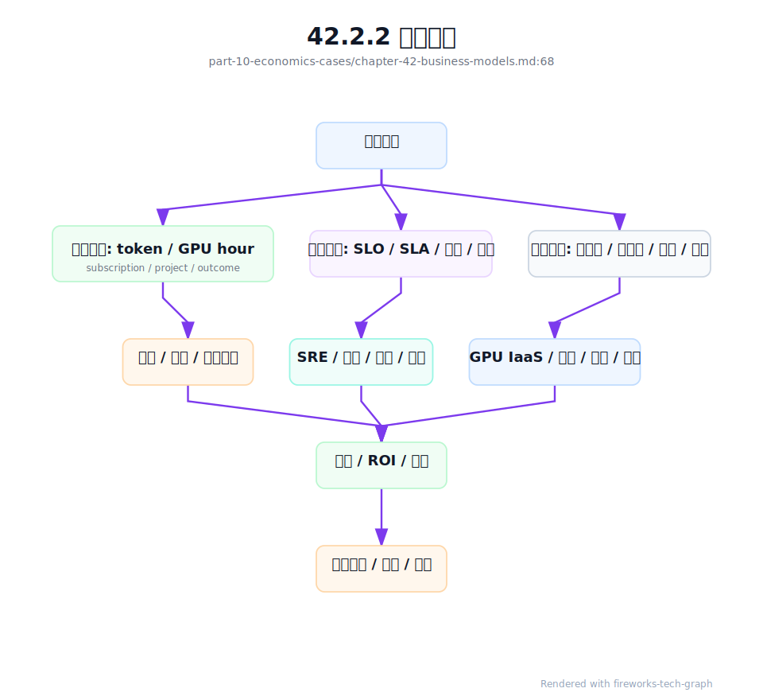
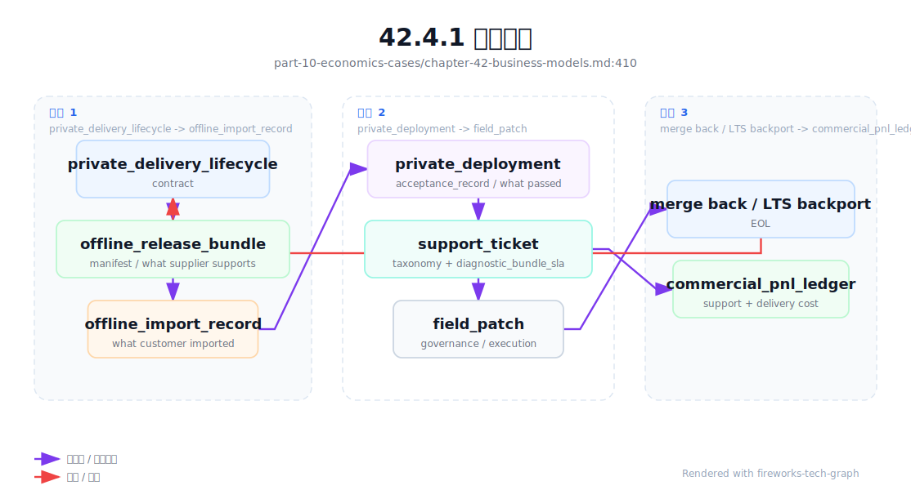
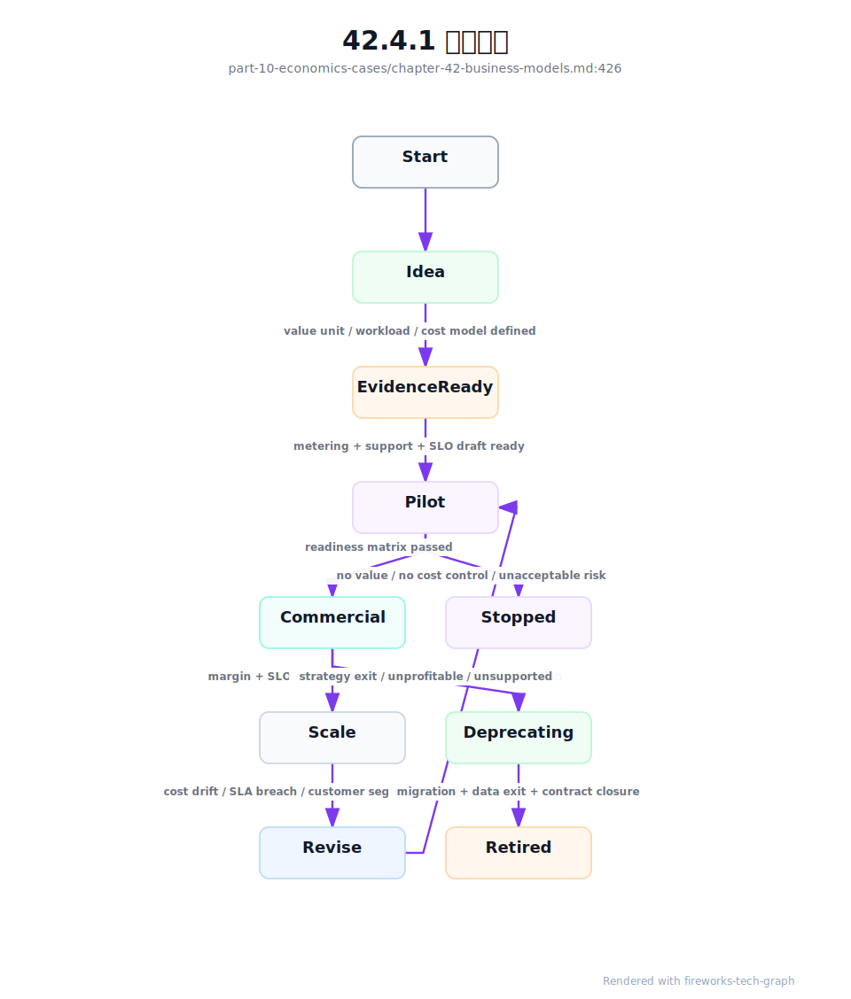

# 第 42 章：AI Factory 商业模式

## 42.1 导读

### 42.1.1 本章回答的问题

- AI Factory 可以以哪些商业模式存在？
- 自用型、云服务型、MaaS、私有化交付、行业云、算力租赁、推理服务和 Agent 平台的技术要求有什么差异？
- 为什么商业模式会反向决定架构、SLO、计费、调度和成本结构？


### 42.1.2 本章上下文

- 层级定位：本章属于 `商业化、案例与建设`，重点讨论 Token Factory、商业模式、案例研究和从 0 到 1 建设路径。
- 前置依赖：建议先理解 第 41 章：Token Factory 视角 中的核心对象和路径。
- 后续关联：本章内容会继续连接到 第 43 章：案例研究，并在系统地图、深度标准和读者测试中被交叉引用。
- 读完能力：读完本章后，读者应能把《AI Factory 商业模式》中的概念映射到 AI Factory 的生产路径、工程对象、观测证据和设计取舍。


### 42.1.3 读者测试

- 机制题：读者能否解释 自用型 AI Factory、云服务型 AI Factory、MaaS、私有化交付 的核心机制，以及它们如何共同支撑《AI Factory 商业模式》？
- 边界题：读者能否区分 技术产能、商业收入、成本账本、SLA 责任和建设路线 的责任边界，并说明哪些问题不能简单归因到本章组件？
- 路径题：读者能否从业务目标追到 token 产出、成本账本、商业模式、案例取舍和建设 PRR，并指出本章对象在路径中的位置？
- 排障题：当《AI Factory 商业模式》相关生产症状出现时，读者能否列出第一层证据、下一跳证据、可能 owner 和止血动作？


### 42.1.4 一个真实场景

一个公司最初建设 AI Factory，是为了支撑内部办公 Copilot、代码助手和客服机器人。第一版平台只关注模型能否调用、RAG 数据能否接入、GPU 资源是否够用。由于服务对象都是内部团队，平台没有严格账单、对外 SLA、API Key 生命周期、客户级审计、赔付规则和多区域容灾。这个阶段的设计并非错误，它匹配了内部效率工具的目标。

半年后，业务团队希望把模型 API 对外开放，销售团队又希望给大型客户做私有化交付。问题立刻出现：内部平台没有租户合同、账单、限流套餐、模型级 SLA、滥用控制和客户支持流程；GPU 资源池也没有按客户隔离的交付报告；私有化部署需要离线镜像、版本矩阵、验收脚本和升级手册，而内部平台只有在线环境和人工运维经验。

同一套 GPU 和模型，面对不同商业模式，会暴露不同缺口。内部平台缺成本分摊，会导致资源滥用；MaaS 缺 token 计量，会无法计费；算力租赁缺准入，会让客户把硬件问题当成服务质量问题；Agent 平台缺工具审计，会产生安全和合规风险。商业模式不是财务包装，而是架构输入。

这个场景的教训是，AI Factory 不是先建一个“通用平台”，再随便包装成任何产品。不同商业模式定义了不同价值单位、客户承诺、风险边界和成本结构。技术设计必须从这些约束出发，选择平台能力、资源隔离、SLO、计量、运维和交付方式。

因此，在设计 AI Factory 之前，必须先问：服务谁，卖什么，按什么计量，承诺什么，失败时如何赔付，成本由谁承担，客户是否需要自主管理，系统是否需要复制到客户环境。回答完这些问题，技术架构才有清晰边界。


## 42.2 基础模型

### 42.2.1 核心概念

AI Factory 的商业模式，是把 AI 生产能力转化为组织价值或市场收入的方式。它可以服务内部业务，也可以对外提供 GPU、模型 API、推理托管、Agent 平台、行业解决方案、私有化系统或完整 AI 云。每种模式都对应不同的价值单位：token、GPU hour、API 调用、席位、项目交付、订阅、业务结果或内部成本节省。

价值单位决定计量系统。卖 token，就必须准确统计 input token、output token、reasoning token、免费额度和失败重试；卖 GPU hour，就必须记录资源交付、使用时长、健康状态和回收；卖私有化项目，就必须记录交付范围、验收标准、升级责任和运维服务；卖业务结果，则必须把技术指标映射到工单解决率、效率提升或风险降低。

商业模式也决定可靠性承诺。内部实验应用可以 best-effort，生产客服需要明确 SLO，对外 MaaS 需要 SLA 和赔付边界，私有化交付需要客户现场可运维，算力租赁需要资源准入和维修响应。不同模式的故障影响不同，oncall、变更、升级和容量策略也不同。

成本结构同样被商业模式定义。MaaS 关注 cost per token 和推理毛利；算力租赁关注 GPU 库存、利用率、交付周期和维修成本；私有化交付关注人力、适配、版本分支和长期支持；Agent 平台关注任务级成本、工具调用、执行环境和安全审计。用同一套成本报表管理所有模式，会掩盖风险。

因此，本章讨论商业模式，不是讨论销售话术，而是讨论技术系统的边界条件。一个可持续的 AI Factory，必须让产品形态、平台能力、基础设施能力、计量方式、SLO 和成本模型相互匹配。匹配度越高，系统越容易扩展；匹配度越低，增长越容易放大技术债。


### 42.2.2 系统架构

商业模式到系统架构的路径，可以看成一条约束链：商业模式定义客户和价值单位，价值单位定义计量和计费，客户承诺定义 SLO/SLA 和支持流程，成本结构定义资源池和调度策略，交付方式定义部署、升级和验收。任何一环缺失，AI Factory 都可能在规模化时失控。

例如 MaaS 的架构重心在 Platform 层和 Model Serving：API Gateway、API Key、租户、配额、模型路由、token 计量、Billing、推理观测和安全策略必须完整。算力租赁的架构重心则在 GPU IaaS、资源池、裸金属交付、镜像、驱动、网络存储和准入验收。Agent 平台又会把 tool calling、workflow、memory、执行隔离和任务级 trace 推到核心位置。

架构还要支持模式演进。一个内部平台可能逐步走向 MaaS，一个云服务可能同时提供 GPU IaaS 和模型 API，一个私有化项目可能要求与中心平台同步升级。若早期完全忽略租户、计量、版本和验收，后续转型成本会很高；若早期过度建设所有商业能力，又会拖慢验证。正确做法是保留边界，分阶段实现。

商业架构还应有统一事实源。客户、租户、项目、模型、资源池、合同、价格、SLO、成本和计量事件之间必须能关联。没有这个事实源，销售承诺、平台能力和基础设施成本会分裂：客户买的是一个产品，平台看到的是另一组资源，财务看到的是第三套数字。

架构评审时，可以把每个商业模式都翻译成一张能力缺口表。若价值单位是 token，却没有 token 计量；若承诺高 SLA，却没有 error budget；若承诺私有化，却没有离线交付包，说明商业模式还没有工程基础。这个检查比讨论“平台是否先进”更有效。




## 42.3 关键技术

### 42.3.1 自用型 AI Factory

自用型 AI Factory 服务企业内部业务，例如办公 Copilot、代码助手、客服质检、数据分析 Agent、知识库问答和内部流程自动化。它的主要目标通常不是直接售卖 token，而是提升员工效率、降低人工成本、改善客户服务、增强产品能力或保护数据安全。价值单位可能是节省的人时、缩短的流程周期、降低的外部 API 成本或内部业务指标改善。

自用型平台容易低估成本纪律。因为没有外部账单，内部用户会倾向于把 GPU 和模型能力视为公共资源，长上下文、批量生成、重复实验和低价值 Agent 任务会快速消耗预算。即使不做市场化收费，也需要内部成本分摊、项目预算、租户配额和使用看板，让需求方理解资源代价。

技术重点包括统一 API、身份权限、数据安全、RAG 数据治理、模型目录、应用模板、审计、观测、成本看板和内部支持流程。不同内部应用的 SLO 要分层：生产客服、销售助手和合规审核应有更高可靠性；个人效率工具和实验项目可以使用 best-effort 资源池。没有分层，平台要么过度昂贵，要么无法承载关键业务。

自用型 AI Factory 还要重视与企业系统集成。权限、组织架构、知识库、工单系统、代码仓库、办公套件和数据平台，都会成为应用效果的关键。模型本身只是能力之一，真正价值来自把模型嵌入业务流程。平台若只提供 Chat 页面，很难形成持续 ROI。

这种模式适合从小规模开始，但需要保留向外部化演进的边界。API Key、租户、计量、审计、模型版本和数据权限，最好从第一天就有基础设计。即使暂时不收费，未来要做内部结算、对外 MaaS 或私有化复制时，也不至于推倒重来。


### 42.3.2 云服务型 AI Factory

云服务型 AI Factory 把 AI 能力作为云产品对外提供，可能包括 GPU IaaS、裸金属 GPU、GPU VM、托管 Kubernetes/Slurm、训练平台、推理平台、MaaS、模型开发工具、数据服务和运维支持。它的客户多样，需求跨度大，从只租算力到完整模型 API 都可能出现。

这类模式的核心能力是把复杂基础设施产品化。客户需要看到规格、价格、区域、交付时间、SLA、安全合规、支持等级和升级策略；平台需要管理容量、库存、计费、隔离、欠费、配额、工单、故障赔付和客户成功。云服务型 AI Factory 的难点不是单次部署，而是持续产品运营。

技术上，它必须同时具备底层交付和上层平台能力。GPU IaaS 要能提供裸金属、虚拟化、镜像、驱动、网络和存储；MaaS 要能提供 API、模型路由、token 计量和内容安全；托管训练要能提供队列、配额、gang scheduling、checkpoint 和观测。不同产品共享底层资源，却有不同 SLO 和计费口径。

云服务型模式还面临标准化与定制化的矛盾。标准化有利于规模、成本和运维，定制化有利于赢得大客户和特殊行业场景。平台需要通过产品层级解决这个矛盾：公共资源池服务通用需求，专属集群服务高隔离需求，专业服务处理有限定制，而不是让每个客户都变成独立分支。

经济上，云服务型 AI Factory 要持续管理利用率和毛利。GPU 采购和机房成本前置，客户需求和价格波动滞后，库存风险很高。容量预测、资源池分层、长期合同、按需价格、预留实例和内部调度效率，都会影响商业可持续性。

云服务还需要处理区域和故障域。客户可能要求特定地域、合规域或专属资源，这会降低资源池共享效率。平台必须在产品价格中体现隔离和地域成本，否则高要求客户会消耗大量隐性成本。


### 42.3.3 MaaS

MaaS 是 Model as a Service，把模型能力通过 API 或 SDK 提供给客户。客户不关心底层 GPU、调度、推理引擎和网络存储如何运作，只关心模型质量、接口兼容、延迟、稳定性、安全、价格和账单可解释性。MaaS 是最接近“卖 token”的 AI Factory 商业模式之一。

MaaS 的技术底座包括 OpenAI-compatible API 或自定义 API、API Key、租户、项目、配额、模型目录、模型路由、限流、fallback、token 计量、Billing、内容安全、请求 trace、SLO 看板和客户支持。任何一个环节缺失，都会影响商业化：没有计量无法收费，没有路由无法做多模型策略，没有观测无法解释延迟和账单。

MaaS 的最大风险是毛利失控。统一定价可能掩盖不同模型和请求形态的成本差异；长上下文、reasoning token、Agent 多轮调用、免费额度、失败重试和低缓存命中都会提高 cost per token。一个 API 很受欢迎，不代表它一定赚钱。MaaS 必须把产品定价和 Token Factory 报表连接起来。

MaaS 还要处理模型生命周期。模型版本升级、能力变化、上下文长度变化、价格变化和安全策略变化都会影响客户应用。平台需要发布公告、兼容期、灰度、回滚和弃用策略。模型不是静态商品，MaaS 的产品运营必须像管理 API 生态一样管理模型生态。

对客户而言，MaaS 的可信度来自稳定口径。请求失败是否收费，streaming 中断如何计量，缓存 token 是否有折扣，模型限流如何解释，SLA 如何计算，这些问题必须写清楚。否则账单争议和事故争议会侵蚀客户信任。

MaaS 还要设计滥用和安全边界。开放 API 后，恶意调用、密钥泄露、批量套利、提示注入和违规内容都会出现。安全策略、风控、审计和客户沟通必须与计费系统联动，不能只靠模型侧拦截。


### 42.3.4 私有化交付

私有化交付把 AI Factory 的一部分或全部部署到客户环境中，常见原因包括数据不出域、合规要求、网络隔离、低延迟、定制集成或客户希望掌握运维控制权。它可以是模型服务私有化、MaaS 平台私有化、RAG/Agent 系统私有化，也可以是软硬件一体交付。

私有化交付的难点是可复制和可运维。不能每个客户都临时拼系统，否则版本、镜像、驱动、模型、配置和运维手册会迅速分叉。标准硬件清单、部署拓扑、离线镜像、版本矩阵、验收脚本、升级路径、监控模板、故障手册和安全基线，是私有化商业模式的核心资产。

交付边界必须明确。客户负责机房、电力、网络和基础设施，还是供应方负责端到端交付？GPU、驱动、Kubernetes、模型服务、RAG 数据、Agent 工具和业务系统集成分别由谁维护？没有责任矩阵，事故发生后会陷入“环境问题还是产品问题”的争议。

经济结构也不同。私有化项目可能按一次性项目费、年度订阅、运维服务、模型授权、硬件软件一体或结果付费收费。成本则包括售前方案、现场适配、交付人力、客户环境差异、长期升级、版本分支和支持响应。项目收入看起来确定，但维护成本若失控，会长期侵蚀毛利。

工程上，私有化交付应尽量产品化。把客户差异放在配置、插件和集成层，而不是复制代码分支；把验收做成流水线，而不是人工报告；把升级做成版本路径，而不是现场手工操作。私有化的本质不是“拷贝一套系统”，而是让 AI Factory 能在客户边界内稳定运行。

私有化还要关注可观测性边界。供应方不一定能访问客户生产数据和环境，但仍要支持诊断。脱敏诊断包、离线日志导出、健康检查和远程支持流程，是私有化可运维性的基本条件。


### 42.3.5 行业云

行业云面向特定行业提供 AI Factory 能力，例如金融、政务、医疗、制造、教育、能源或交通。它不是简单把通用模型换成行业 prompt，而是把模型、RAG、Agent、权限、审计、数据治理、业务流程和合规要求组合成行业生产系统。行业知识和流程边界会反向影响平台设计。

行业云的价值单位往往不是 token，而是业务结果。金融场景可能看风险识别率和审核效率，医疗场景可能看文书质量和合规审计，制造场景可能看故障诊断时间和停机减少，政务场景可能看办件效率和数据安全。token 仍然用于成本和容量，但不一定是客户感知的价值单位。

技术能力上，行业云更重视数据治理和安全。数据来源、权限、脱敏、审计、知识库更新、模型输出边界、人工复核和合规留痕，往往比单纯模型性能更重要。RAG 和 Agent 在行业云中不是可选功能，而是把模型接入行业流程的关键机制。

行业云还需要处理标准化与专业化。过度通用，会无法满足行业流程；过度定制，会失去产品复用能力。好的行业云会沉淀领域数据模型、流程模板、评测集、安全策略和集成适配层，让不同客户共享底座，同时保留局部配置差异。

运营上，行业云需要联合业务指标和技术指标。TTFT、TPOT、可用性和 cost per token 仍然重要，但最终要解释为业务效果。若业务指标没有改善，再低的 token 成本也没有意义；若业务价值足够高，平台可以接受更高模型成本和更强隔离。

行业云还要面对责任边界。模型建议、人工审核、业务规则和最终决策之间的关系必须清楚。技术系统应记录模型输入输出、检索证据、工具调用和人工确认，避免在合规场景中无法复盘。


### 42.3.6 算力租赁

算力租赁销售 GPU、裸金属、虚拟机、Kubernetes 命名空间、Slurm 分区或专属集群。客户可能自己训练、微调、推理、运行数据处理或搭建自己的平台。平台主要交付可用算力和基础设施能力，而不是直接交付模型 API 或应用结果。

这种模式的核心是资源可交付、可隔离、可验收、可回收。客户关心 GPU 型号、显存、网络、存储、驱动、镜像、交付时间、稳定性和价格；平台关心库存、利用率、维修、故障、合同周期、超卖风险和资源回收。算力租赁的用户体验，往往由底层工程质量决定。

准入测试是算力租赁的商业基础。客户购买的是可用 GPU，不是“能开机的服务器”。GPU burn-in、NCCL test、nvbandwidth、RDMA、存储 benchmark、驱动版本和网络拓扑，应成为交付报告和后续争议处理依据。没有验收基线，服务质量很难证明。

算力租赁容易商品化。单纯卖 GPU hour 会陷入价格竞争，差异化来自交付速度、网络质量、稳定性、镜像生态、调度工具、数据通道、技术支持和与上层模型平台的组合。越靠近裸资源，毛利越受供需和采购成本影响；越能提供平台能力，差异化越强。

技术取舍也不同。算力租赁可以少关心用户 prompt 和模型质量，但必须强关心租户隔离、资源回收、BMC、驱动兼容、故障维修、库存状态和客户可见监控。它是 GPU IaaS 能力最直接的商业化形态。

算力租赁还需要明确资源超卖边界。裸金属通常不适合超卖，虚拟化或容器共享可以提高利用率但增加隔离和性能争议。客户购买的是确定性能还是共享能力，必须在产品和技术上同时表达清楚。


### 42.3.7 推理服务

推理服务可以作为 MaaS 的底层，也可以作为企业客户的托管模型运行服务。客户可能提供自己的模型和权重，平台负责部署、扩缩容、灰度、监控、性能优化、成本控制和故障处理。它卖的不是通用模型能力，而是“把模型稳定、低成本、可观测地跑起来”。

推理服务的价值来自专业化运行能力。同样一组 GPU，不同推理引擎、batching 策略、KV Cache 管理、模型路由、权重加载、冷启动控制和 SRE 流程，会带来完全不同的 TTFT、TPOT、tokens/s 和 cost per token。客户愿意付费，是因为平台承担了运行复杂度。

技术能力包括模型 registry、endpoint、replica、autoscaling、streaming、continuous batching、canary、rollback、A/B、限流、trace、token 计量、缓存、模型热加载和安全隔离。若客户自带模型，还需要支持模型格式转换、依赖管理、镜像构建、基线测试和性能调优。

商业上，推理服务可以按 token、实例、并发、吞吐、SLA 等级或托管服务费收费。不同收费方式会影响系统设计。按实例收费更像资源托管，客户承担利用率风险；按 token 收费更像结果服务，平台承担效率风险；按 SLA 等级收费，则需要更强冗余和可靠性。

推理服务的风险是边界不清。模型质量、输入数据、客户业务逻辑和平台运行能力会共同影响最终结果。合同和技术系统都要明确：平台负责延迟、可用性和运行稳定，客户或模型团队负责模型质量和业务正确性，双方共享观测证据。

推理服务还要处理模型所有权。客户自带模型时，平台需要定义权重存储、访问权限、删除流程、漏洞响应和性能基线；平台提供模型时，则要承担模型版本、质量和安全策略。所有权不同，运维和法律边界不同。


### 42.3.8 Agent 平台

Agent 平台提供 tool calling、workflow、planning、memory、权限、审计、执行环境和任务编排，把模型 API 变成可执行业务任务的系统。它的价值不只是生成文本，而是完成任务：查询数据、调用系统、生成代码、写入工单、触发审批或协助运营。

Agent 平台的计量比 MaaS 更复杂。一个用户任务可能触发多轮模型调用、检索、工具调用、代码执行、外部 API、人工确认和失败重试。只按模型 token 计费，会低估真实成本；只按任务收费，又需要理解任务复杂度和失败责任。任务级 cost 和 result value 是 Agent 平台的核心经济口径。

技术重点包括工具权限、执行隔离、状态管理、任务 trace、重试策略、人机协同、安全审计、数据边界、成本预算和结果评估。Agent 失败时，用户看到的是“任务没完成”，平台必须能解释是模型规划错误、工具权限不足、外部 API 超时、数据缺失、代码执行失败还是人工审批未通过。

Agent 平台还会放大安全风险。模型可以提出动作，工具可以改变系统状态，memory 可以保存上下文，workflow 可以跨多个业务系统。平台必须有最小权限、审批门禁、敏感动作确认、审计日志和回滚机制。没有这些能力，Agent 越强，风险越大。

商业上，Agent 平台更接近业务结果。它可以按任务、流程、席位、自动化次数、节省人力或订阅收费。token 仍然是成本基础，但不是唯一价值单位。成熟 Agent 平台应能把一次任务的 token、工具、时间、人审和结果放在同一条 trace 中，让客户理解为什么收费、为什么失败、为什么值得使用。

Agent 平台还需要预算控制。一次任务在循环、重试或工具失败中可能消耗大量 token 和外部 API 费用。平台应支持任务级预算、最大步数、超时、人工接管和失败分类，否则商业模式会被不可控成本拖垮。


## 42.4 工程落地

### 42.4.1 工程实现

工程实现的第一步，是为每种商业模式建立能力矩阵。矩阵至少包含服务对象、价值单位、计量事件、客户承诺、SLO/SLA、成本结构、交付方式、关键平台能力、关键基础设施能力和主要风险。没有矩阵，团队容易把某个模式的能力误用到另一个模式。

第二步，是建立产品与资源的映射。产品计划要映射到模型、资源池、配额、限流、计费规则、支持等级和数据边界。客户购买 MaaS 套餐，系统应知道能调用哪些模型、每分钟多少 token、是否允许长上下文、是否有专属容量、失败如何计费。客户购买算力，系统应知道交付哪些 GPU、网络、存储和验收基线。

第三步，是把商业模式纳入变更和上线流程。新增一个产品形态，不只是新增页面或价格表，还可能需要新的计量口径、账单规则、SLO、告警、容量池、合同条款和支持手册。工程评审应检查这些能力是否完整，避免销售先承诺、平台后补洞。

```yaml
business_model_profile:
  type: maas
  customers:
    - external_developers
    - enterprise_projects
  value_unit: billable_token
  required_capabilities:
    - api_key_lifecycle
    - tenant_quota
    - model_routing
    - token_metering
    - billing
    - inference_slo
    - abuse_control
  economics:
    revenue_metric: revenue_per_token
    cost_metric: cost_per_token
    guardrails:
      - quality_gate
      - error_budget
```

生产级 `business_model_profile` 还应明确客户承诺、交付边界、退出责任和证据来源。它和第 4 章的 `workload_profile` 不是重复关系：前者描述“如何把能力卖出或内部结算”，后者描述“应用如何消耗能力”。一个客服 RAG workload 可以服务内部自用、行业云或私有化交付；同一个 MaaS 商业模式也可以承载 Chat、embedding、rerank 和 batch inference。两者必须通过产品配置和成本账本显式关联。

```yaml
business_model_profile:
  id: bmp-enterprise-maas-standard-v2
  owner:
    product: maas-product
    finance: ai-business-ops
    platform: ai-platform
    sre: ai-sre
  lifecycle:
    state: commercially_available
    version: 2
    review_cycle: quarterly
    invalidation_triggers:
      - new_model_pricing_tier
      - sla_change
      - serving_cost_model_change
      - security_policy_change
  customer_promise:
    customer_segments:
      - enterprise_developer
      - internal_application_team
    service_boundary: hosted_model_api
    excluded_responsibilities:
      - customer_prompt_quality
      - downstream_business_decision
      - customer_side_network_failure
    support_model: business_hours_plus_sev1_oncall
  value_unit:
    primary: billable_token
    secondary:
      - provisioned_throughput
      - dedicated_capacity
  metering:
    billable_events:
      - request_admitted
      - usage_delta
      - request_closed
    non_billable_events:
      - policy_denied
      - provider_side_5xx_before_first_token
    dispute_evidence:
      - append_only_metering_event
      - request_trace_id
      - model_version
      - tenant_policy_version
  cost_ledger:
    direct_cost:
      - gpu_seconds
      - model_memory_residency
      - gateway_and_observability
    allocated_cost:
      - reliability_reserve
      - security_audit
      - evaluation_pipeline
      - support
  slo_sla:
    slo_class: production
    sla_contract: external_standard
    error_budget_policy: monthly
    compensation_boundary: platform_responsible_failures
  delivery:
    mode: public_cloud_service
    regions:
      - primary_region
    data_residency: configured_per_tenant
    exit_plan:
      - export_usage_records
      - revoke_api_keys
      - delete_or_retain_logs_by_contract
      - model_deprecation_notice
```

这个对象要求商业承诺和平台事实一致。若 `service_boundary` 是 hosted model API，就不应把客户业务正确性写进 SLA；若 `value_unit.primary` 是 billable token，就必须有不可篡改的 token 事件；若承诺 dedicated capacity，就必须在资源池中有 reservation、健康状态和容量报告；若支持私有化退出，就必须能删除或导出客户数据。商业模式失败常常不是销售错了，而是承诺没有落成可验证对象。

商业模式还需要 go/no-go 门禁。下面的 `commercial_readiness_matrix` 用于判断一个模式能否进入销售、试点或规模化。它不要求所有模式具备相同能力，但要求每个模式的价值单位、交付承诺、成本和支持边界可解释。

| 商业模式 | 必须具备后才能销售 | 规模化前必须具备 | 不能承诺的典型事项 |
| --- | --- | --- | --- |
| 自用型 AI Factory | 租户/项目、成本看板、关键应用 SLO、数据权限 | 内部 chargeback、应用生命周期、容量例会、quality feedback | “免费无限使用”、无 owner 的生产应用 |
| 云服务型 AI Factory | 产品规格、区域/资源池、账单、SLA、支持流程 | 库存预测、多租户审计、故障赔付、客户成功和容量运营 | 未通过准入的 GPU 现货交付 |
| MaaS | API Key、token metering、模型目录、限流、请求 trace | append-only ledger、模型弃用策略、风控、账单争议处理 | 没有计量证据的按量收费 |
| 私有化交付 | 标准拓扑、离线包、版本矩阵、验收脚本、责任矩阵 | 升级路径、脱敏诊断包、客户环境兼容层、LTS 策略 | 每个客户无限制代码分支 |
| 行业云 | 行业数据边界、流程模板、领域评测、合规审计 | 行业运营指标、人工复核、知识库生命周期、复用组件 | 只靠 prompt 声称行业化 |
| 算力租赁 | GPU inventory、准入报告、镜像/驱动、资源交付记录 | clean-to-reuse、维修回池、客户可见健康、库存/利用率优化 | 未定义性能边界的共享 GPU |
| 推理服务 | 模型 registry、endpoint、SLO、灰度回滚、运行观测 | cost/token、模型所有权边界、性能调优基线、多租户公平 | 对客户模型质量做无证据保证 |
| Agent 平台 | 工具权限、任务 trace、预算、人工确认、审计 | 任务级成本、结果评测、沙箱隔离、回滚/补偿流程 | 未经审批的高风险写操作 |

私有化交付还需要单独的 `private_deployment_acceptance_record`。公有云 MaaS 的上线证据主要来自平台内部控制面，而私有化交付的证据来自客户现场：离线镜像是否完整、版本矩阵是否受控、GPU/driver/runtime 是否匹配、客户网络和证书是否配置正确、RAG 数据导入是否尊重权限、升级和回滚是否演练、诊断包是否能在客户不开放生产数据的情况下导出。没有这个记录，私有化项目会把“验收通过”写成会议结论，后续升级和故障争议无法复盘。

```yaml
private_deployment_acceptance_record:
  id: pdar-enterprise-a-ai-factory-202606
  customer: enterprise-a
  delivery_scope:
    deployment_type: on_prem_standard
    components:
      - maas_gateway
      - model_serving
      - rag_pipeline
      - observability_agent
      - offline_registry
    excluded:
      - foundation_model_pretraining
      - customer_business_system_sla
  version_matrix:
    os_baseline: approved
    kernel: approved
    nvidia_driver: approved
    cuda: approved
    nccl: approved
    container_runtime: approved
    gpu_operator_or_device_plugin: approved
    model_images: signed_and_pinned
  acceptance:
    offline_package_integrity: pass
    gpu_runtime_smoke: pass
    model_load_and_streaming: pass
    rag_acl_regression: pass
    metering_export: pass
    backup_restore: pass
    upgrade_and_rollback_drill: pass
    diagnostic_bundle_export: pass
  responsibility_matrix:
    facility_power_cooling: customer
    gpu_hardware_repair: agreed_party
    platform_upgrade: supplier_with_customer_window
    knowledge_base_quality: customer
    model_serving_runtime: supplier
  support_boundary:
    remote_access: customer_approved_session_only
    data_export: redacted_diagnostic_bundle
    emergency_patch_policy: defined
```

这个记录把私有化交付从一次项目变成可维护产品。它明确哪些环境差异被支持，哪些责任属于客户，哪些证据用于验收，哪些能力必须在升级前重测。对供应方来说，`private_deployment_acceptance_record` 能控制定制化蔓延：客户差异应优先进入配置、版本矩阵和集成适配层，而不是分叉代码；对客户来说，它提供可复核边界：若故障发生在已验收的 GPU runtime 或模型 serving，供应方需要响应；若故障来自未批准的客户网络变更或知识库错误，处理方式不同。

私有化交付的商业模型还必须绑定 release train、LTS、诊断包 SLA 和 field patch 规则。客户买到的不只是一次安装，而是一条可升级、可诊断、可回滚、可退出的产品线。销售合同如果承诺“长期支持”，工程上就必须能回答：支持哪些 baseline，补丁是否 backport，离线升级如何演练，客户不允许远程登录时如何导出脱敏证据，紧急补丁是否会合回主干，EOL 前如何通知和迁移。否则私有化项目会在第二年变成大量不可复用现场分支。

```yaml
private_delivery_lifecycle_contract:
  contract_id: pdlc-enterprise-a-202606
  linked_acceptance: pdar-enterprise-a-ai-factory-202606
  release_policy:
    release_train_record: gpu-baseline-2026-06
    lts_support_policy: ai-factory-gpu-node-lts
    customer_rings: [customer_staging, customer_production]
    eol_notice_required: true
  support_policy:
    support_ticket_taxonomy: support-taxonomy-ai-factory
    diagnostic_bundle_sla: dbsla-ai-factory-prod
    remote_access: customer_approved_session_only
    redacted_export: required
  upgrade_policy:
    offline_release_bundle_manifest: required_for_offline_or_restricted_egress
    offline_import_record: required_after_customer_import
    offline_upgrade_rehearsal: required_before_major_or_lts_migration
    rollback_drill: required
    storage_and_artifact_migration: required_if_schema_or_model_change
  patch_policy:
    field_patch_governance: required_for_out_of_band_patch
    merge_back_to_release_train: required
    patch_expiry: policy_defined
  commercial_controls:
    support_cost_tagging: required
    custom_delta_count_limit: policy_defined
    unsupported_environment_clause: explicit
```

这份 lifecycle contract 让商业承诺能被工程系统验证。它也给毛利分析提供输入：客户支持工单、离线升级演练、现场补丁、远程诊断审批和定制差异都不是免费动作，而是私有化收入中的真实成本。若这些对象缺失，私有化看起来可能毛利很高，实际被支持成本和版本分叉吞掉。成熟的 AI Factory 商业化不是拒绝私有化，而是把私有化做成受控产品，而不是无限项目制交付。

私有化合同还应明确离线交付包的支持边界。`offline_release_bundle_manifest` 定义供应方交付的受支持内容，`offline_import_record` 定义客户现场实际导入的内容，二者必须能对账。若客户自行替换镜像、跳过签名校验、修改 chart、覆盖模型 artifact、把 RAG index 迁移脚本改成手工 SQL，供应方不应承担无限责任；但若导入记录证明现场按受支持包执行，故障发生在已验收的 GPU runtime、model serving、cache invalidation 或诊断导出路径，供应方就必须按支持 SLA 响应。商业模式的边界要落到这些证据对象上，不能只写在合同附件里。



这张图说明私有化不是一次性交付，而是生命周期业务。交付包、导入记录、验收、支持、补丁、LTS 和 P&L 要闭环。如果其中任一环缺失，商业风险会被延迟到第二次升级或第一次 Sev1 事故中爆发。产品化私有化的核心不是减少客户差异，而是让差异进入可计价、可支持、可退出的结构。

商业能力也可以形成状态机。一个模式从 idea 到 scale，必须穿过 evidence、pilot、commercial 和 deprecation，而不是被一次发布会直接推入长期承诺。



这套状态机的重点是允许停止。很多 AI Factory 商业化问题来自“只会上线，不会下线”：某个私有化分支没有升级能力却继续售卖，某个 MaaS 模型成本明显倒挂却继续放量，某个 Agent 工具没有审计却被更多客户启用。状态机把停止条件写入产品治理，让技术团队有证据约束商业承诺。

`business_model_profile` 最终应和 Token Factory 账本连接。MaaS 关注 `revenue_per_token - cost_per_token`，但行业云可能关注 `revenue_per_resolved_case - cost_per_resolved_case`，Agent 平台可能关注 `revenue_per_successful_task - cost_per_successful_task`。如果只用 token 作为唯一收入单位，就会低估高价值低 token 的场景；如果完全不看 token，又会失去底层成本控制。商业模式成熟度就在于能同时看价值单位和生产单位。

第四步，是定期复盘模式适配度。每季度检查收入、毛利、SLO、客户投诉、交付成本、定制化比例和运维负担。如果某个商业模式增长很快但平台能力跟不上，应优先补齐能力；如果某个模式毛利低且定制化重，应重新审视产品边界。

第五步，是把商业模式写入资源策略。MaaS 需要推理池和 token 成本治理，算力租赁需要库存和交付状态，私有化需要版本和镜像资产，Agent 平台需要执行环境和安全审计。资源策略若与商业模式脱节，平台会同时缺容量和缺毛利。

第六步，是建立退出机制。某些产品形态可能验证失败，某些定制能力可能不再维护。系统要支持客户迁移、模型下线、合同结束、数据删除和资源回收。商业模式不只要能启动，也要能有序退出。


### 42.4.2 常见故障

第一类故障是内部平台直接对外售卖。内部系统可能缺少 API Key 生命周期、租户隔离、账单、SLA、滥用控制和客户支持。短期看能快速商业化，长期会在账单争议、限流、故障赔付和安全审计上付出高成本。对外之前必须做产品化补齐。

第二类故障是卖算力但没有准入验收。客户租到 GPU 后遇到 NCCL 慢、RDMA 不通、驱动不一致或存储抖动，平台无法证明交付时资源健康。解决方向是把准入基线、交付报告和维修回池流程纳入合同和运营系统。

第三类故障是 MaaS 按统一价格覆盖所有模型和场景。长上下文、reasoning、多模态和 Agent 请求的成本差异很大，统一价格容易让高成本场景侵蚀毛利。解决方向是内部保留精细成本模型，并逐步将价格与模型等级、上下文和服务等级对齐。

第四类故障是私有化交付没有标准版本。每个客户都改一套代码、镜像和部署脚本，升级越来越困难，事故无法复用经验。解决方向是产品化交付包、配置化差异、版本矩阵和自动化验收。私有化越多，标准化越重要。

第五类故障是 Agent 平台只看模型 token。工具调用、外部 API、执行环境、人工审批和失败重试都没有计量，导致任务成本不可解释。解决方向是建立任务级 trace 和成本模型，把每次模型调用与工具动作串起来。

第六类故障是商业承诺超过运维能力。销售承诺高 SLA、专属资源或复杂集成，但平台没有容量、oncall、升级和赔付流程支撑。解决方向是让产品承诺通过工程评审，并把 SLO、成本和资源预留写入上线条件。


### 42.4.3 性能指标

商业模式指标首先要按价值单位设计。MaaS 看 billable tokens、tokens/s、cost per token、revenue per token、毛利、SLA 和客户留存；算力租赁看 GPU 利用率、交付时长、验收通过率、故障率、维修时长和回收率；私有化看交付周期、升级成功率、客户故障数和版本分支成本。

Agent 平台要看任务成功率、任务成本、工具错误率、人工接管率、任务完成时间、越权拦截和结果质量。行业云要看业务指标，例如工单解决率、审核效率、风险发现率、现场停机减少和合规审计通过率。自用型平台要看内部采用率、成本分摊、业务效率和关键应用 SLO。

跨模式通用指标包括收入、毛利、资源利用率、error budget、客户投诉、支持成本、交付成本、定制化比例和复发故障。它们帮助判断某个模式是否只是“卖得出去”，还是能持续运营。收入增长但支持成本更快增长，说明模式可能不可扩展。

还要建立模式间对比指标。同一批 GPU 用于 MaaS、算力租赁、批量推理或训练，机会成本不同。平台应能比较不同资源用途的毛利、战略价值、风险和长期能力沉淀。否则资源分配会被短期收入或内部政治影响。

指标必须支持分层。按客户、产品、模型、资源池、区域、合同和支持等级拆分，才能发现真正问题。全平台平均毛利健康，不代表私有化交付不亏；整体 SLA 达标，不代表高价值客户体验稳定。商业指标越靠近决策对象，越有用。

还要跟踪能力债。某个模式收入增长，但账单手工处理、交付依赖专家、升级无法自动化、工单反复升级，都是能力债信号。能力债不及时处理，会把增长转化为运营负担。


### 42.4.4 设计取舍

第一个取舍是通用平台与模式专用能力。建设统一底座可以复用 GPU、调度、观测、身份和成本系统；但每种商业模式都有专用能力，例如 MaaS 的 token 账单、算力租赁的准入交付、私有化的离线安装、Agent 的工具审计。合理做法是统一底座，模式层插件化，而不是复制多个平台。

第二个取舍是标准化与定制化。标准化降低成本、提升可靠性和可升级性；定制化帮助赢得高价值客户和行业场景。判断标准不是客户是否提出需求，而是这个需求能否产品化、是否有复用价值、是否会破坏升级路径。定制化必须有边界和价格。

第三个取舍是短期收入与长期毛利。算力租赁和私有化项目可能快速产生收入，但如果缺少差异化和标准化，长期毛利会受压。MaaS 和 Agent 平台建设周期更长，但一旦形成产品能力，规模效应更强。资源投入要结合组织能力和市场窗口。

第四个取舍是简单定价与成本真实。简单定价容易销售，精细定价更贴近成本。早期可以用简单价格验证市场，但内部必须保留真实成本模型；当高成本场景增长时，再逐步通过模型等级、上下文长度、SLA 或专属容量调整价格。外部简单不等于内部粗糙。

最终，商业模式设计的目标，是让技术能力、客户承诺和经济模型一致。一个模式如果客户愿意买、平台能稳定交付、成本能解释、故障能处理、升级能持续，就具备扩张基础。反之，即使短期收入不错，也可能只是把复杂度推迟到未来。

取舍也要随阶段变化。早期可以用较少模式验证需求，中期再补齐计量和交付，规模化阶段则必须压缩定制、强化自动化。商业模式不是一次选择，而是持续运营的结构。


## 42.5 小结与延伸阅读

### 42.5.1 小结

- 商业模式是 AI Factory 架构设计的输入，不是后置包装。
- 不同模式对应不同价值单位：token、GPU hour、订阅、项目或业务结果。
- MaaS 要关注 token 计量和毛利，算力租赁要关注资源交付和验收。
- Agent 平台把计量从 token 扩展到任务级成本和结果价值。


### 42.5.2 延伸阅读

- [Google Cloud Billing documentation](https://cloud.google.com/billing/docs)；[AWS Service Level Agreements](https://aws.amazon.com/legal/service-level-agreements/)
- [Azure OpenAI Service documentation](https://learn.microsoft.com/en-us/azure/ai-services/openai/)
- [AWS SaaS Lens for the Well-Architected Framework](https://docs.aws.amazon.com/wellarchitected/latest/saas-lens/welcome.html)
