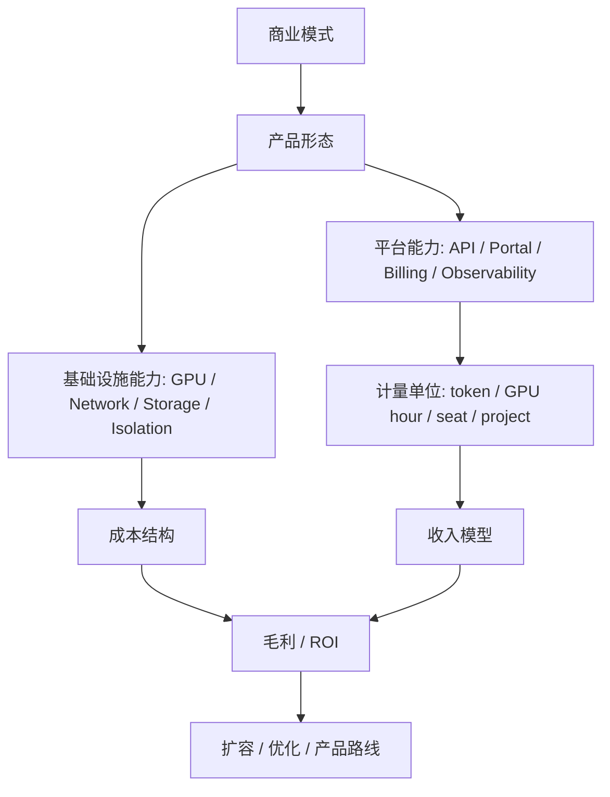

# 第 42 章：AI Factory 商业模式

## 本章回答的问题

- AI Factory 可以以哪些商业模式存在？
- 自用型、云服务型、MaaS、私有化交付、行业云、算力租赁、推理服务和 Agent 平台的技术要求有什么差异？
- 为什么商业模式会反向决定架构、SLO、计费、调度和成本结构？

## 一个真实场景

一个公司计划建设 AI Factory，最初目标是支撑内部 Copilot 和客服机器人。半年后，业务团队希望把模型 API 对外开放，销售团队又希望给大型客户做私有化交付。平台团队发现，内部平台没有租户账单、SLA、API Key、安全审计和多模型路由；基础设施也没有按客户隔离的资源池和验收报告。商业模式变化后，原来的技术架构不再适用。

AI Factory 的商业模式不是财务部门的后置包装，而是架构设计的输入。

## 核心概念

AI Factory 可以服务内部业务，也可以对外售卖 API、算力、平台、私有化系统或行业解决方案。不同商业模式对应不同的价值单位：有的卖 token，有的卖 GPU 小时，有的卖平台订阅，有的卖交付项目，有的卖业务结果。

技术系统必须与价值单位一致。卖 token 要有 token 计量、限流和毛利模型；卖算力要有资源交付、隔离和验收；卖 Agent 平台要有工具治理、执行审计和应用生命周期；做私有化交付要有可复制架构、离线安装和运维手册。

## 系统架构



商业模式决定平台优先级。一个内部 AI 平台可以先弱化账单，但对外 MaaS 没有账单就无法运营；一个算力租赁平台可以不关心 prompt 质量，但必须关心裸金属交付和 GPU 健康。

## 42.1 自用型 AI Factory

自用型 AI Factory 服务企业内部业务，例如办公 Copilot、代码助手、客服质检、数据分析 Agent 和知识库问答。它的目标通常是提升效率、降低人工成本、增强产品能力或保护数据安全。

自用型平台不一定按市场价格计费，但仍需要内部成本分摊。否则高消耗应用会挤占资源，平台无法判断哪些场景值得扩容。内部计费可以按 token、项目、部门、GPU 小时或预算包执行。

技术重点包括统一 API、权限、数据安全、私有模型、RAG、应用模板、观测和成本看板。SLA 可以按业务重要性分层：生产客服和内部实验不应使用同一可靠性目标。

## 42.2 云服务型 AI Factory

云服务型 AI Factory 把 AI 能力作为云服务对外提供。它通常包含 GPU IaaS、训练平台、推理平台、MaaS、模型开发工具、数据服务和运维支持。

云服务型模式要求强多租户、可计费、可审计、可扩容和可运营。客户希望看到资源规格、价格、SLA、区域、合规、安全和技术支持。平台则需要处理容量预测、资源隔离、欠费、配额、客户成功和故障赔付。

技术上，云服务型 AI Factory 需要把底层 GPU 能力产品化：裸金属实例、GPU 虚拟化、模型 API、专属集群、托管训练、托管推理和行业模板可能并存。

## 42.3 MaaS

MaaS 是 Model as a Service，把模型能力通过 API 提供。客户不关心底层 GPU 如何调度，只关心模型质量、接口兼容、延迟、价格、安全和稳定性。

MaaS 的核心计量单位通常是 token，也可能叠加请求数、上下文长度、并发、专属实例和模型等级。它必须有 API Key、租户、配额、模型路由、token 计量、账单、限流、观测和内容安全。

MaaS 的难点是毛利。低价模型、长上下文、reasoning token、免费额度、失败重试和低利用率都会影响 cost per token。商业上好卖的 API，如果工程上没有成本控制，可能越卖越亏。

## 42.4 私有化交付

私有化交付把 AI Factory 的一部分或全部部署到客户环境中。客户通常关注数据不出域、合规、定制化、可控运维和与内部系统集成。

私有化交付的技术挑战是可复制和可运维。不能每个客户都临时拼系统。需要标准硬件清单、部署拓扑、离线镜像、版本矩阵、验收脚本、升级方案、监控模板和故障手册。

商业上，私有化交付可能按项目、订阅、运维服务、模型授权或硬件软件一体收费。成本结构包含交付人力、客户环境适配、长期运维和版本分支维护。

## 42.5 行业云

行业云面向特定行业提供 AI Factory 能力，例如金融、政务、医疗、制造、教育或能源。它通常需要行业数据、安全合规、业务流程、专有模型和集成能力。

行业云不是简单换一套 prompt。它需要把模型、RAG、Agent、权限、审计、数据治理和业务系统连接起来。行业知识和流程约束会影响平台设计。

行业云的价值单位可能不是 token，而是工单解决率、审核效率、风险发现率、代码生成效率或知识检索成功率。技术指标仍要保留，但最终要映射到业务指标。

## 42.6 算力租赁

算力租赁销售 GPU、裸金属、虚拟机或 Kubernetes/Slurm 资源。客户可能自己训练、微调、推理或运行数据处理。平台主要交付可用算力，而不是直接交付模型 API。

算力租赁的核心是资源可交付、可隔离、可验收、可回收。客户关心 GPU 型号、网络、存储、驱动、镜像、交付时长、稳定性和价格。平台关心利用率、库存、维护、故障和合同周期。

这种模式的风险是商品化。单纯卖 GPU 小时容易陷入价格竞争。差异化来自网络质量、交付速度、稳定性、工具链、运维支持和与上层 AI 平台的组合。

## 42.7 推理服务

推理服务可以作为 MaaS 的底层，也可以作为面向企业的托管服务。它的价值是帮客户稳定、低成本地运行模型。客户可能提供自己的模型，平台负责部署、扩缩容、灰度、观测和成本优化。

推理服务的商业指标包括 tokens/s、TTFT、TPOT、可用性、cost per token、模型加载时间和资源利用率。平台需要支持多模型、多版本、A/B、canary、rollback、batching、缓存和计费。

推理服务适合建立专业化能力：同样 GPU 上，优秀的推理引擎、调度、缓存和运维可以显著改变毛利和用户体验。

## 42.8 Agent 平台

Agent 平台提供 tool calling、workflow、memory、planning、权限、审计和执行环境。它把模型 API 变成可执行业务任务的系统。

Agent 平台的计量比 MaaS 更复杂。一次用户任务可能触发多轮模型调用、工具调用、检索、代码执行和外部 API 调用。成本要从单次 token 扩展到任务级成本和结果级价值。

技术重点包括工具权限、执行隔离、状态管理、失败重试、人工确认、安全审计、trace 和计费。Agent 平台如果缺少可观测性，用户只会看到“任务失败”，平台无法解释是模型、工具、权限还是外部系统问题。

## 工程实现

商业模式到技术能力映射示例：

```yaml
business_model:
  type: maas
  value_unit: billable_token
  required_capabilities:
    - api_key
    - tenant_quota
    - model_routing
    - token_metering
    - billing
    - inference_slo
    - abuse_control
  economics:
    revenue_metric: revenue_per_token
    cost_metric: cost_per_token
    guardrail: error_budget
```

每新增一种商业模式，都应先写出价值单位、客户承诺、计量方式、成本结构和技术能力缺口。

## 常见故障

- 内部平台直接对外售卖，缺少租户、账单和 SLA。
- 卖算力但没有准入验收，客户把硬件问题当成服务质量问题。
- MaaS 按统一价格售卖所有模型，长上下文和 reasoning 场景侵蚀毛利。
- 私有化交付没有标准版本，客户环境变成不可维护分支。
- Agent 平台只看模型 token，没有计量工具调用和任务级成本。

## 性能指标

- MaaS：tokens/s、cost per token、revenue per token、毛利、SLA。
- 算力租赁：GPU 利用率、交付时长、故障率、回收率。
- 私有化：交付周期、升级成功率、客户故障数、运维成本。
- Agent 平台：任务成功率、任务成本、工具错误率、人工接管率。
- 行业云：业务指标、模型质量、合规审计和客户留存。

## 设计取舍

自用型平台可以更快试错，但容易忽略成本纪律。云服务型平台商业空间大，但多租户、账单和 SLA 要求更高。私有化交付收入确定性强，但版本和运维成本高。算力租赁现金流直接，但差异化弱。Agent 平台价值上限高，但安全、观测和成本控制更复杂。

## 小结

- 商业模式是 AI Factory 架构设计的输入，不是后置包装。
- 不同模式对应不同价值单位：token、GPU hour、订阅、项目或业务结果。
- MaaS 要关注 token 计量和毛利，算力租赁要关注资源交付和验收。
- Agent 平台把计量从 token 扩展到任务级成本和结果价值。

## 延伸阅读

- TODO: 云服务计费与 SLA 资料
- TODO: MaaS 平台运营案例
- TODO: 企业私有化交付案例
