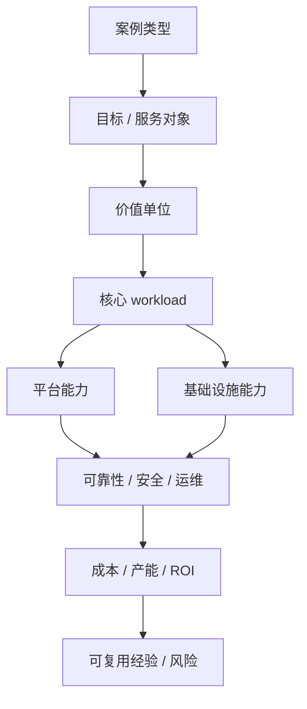
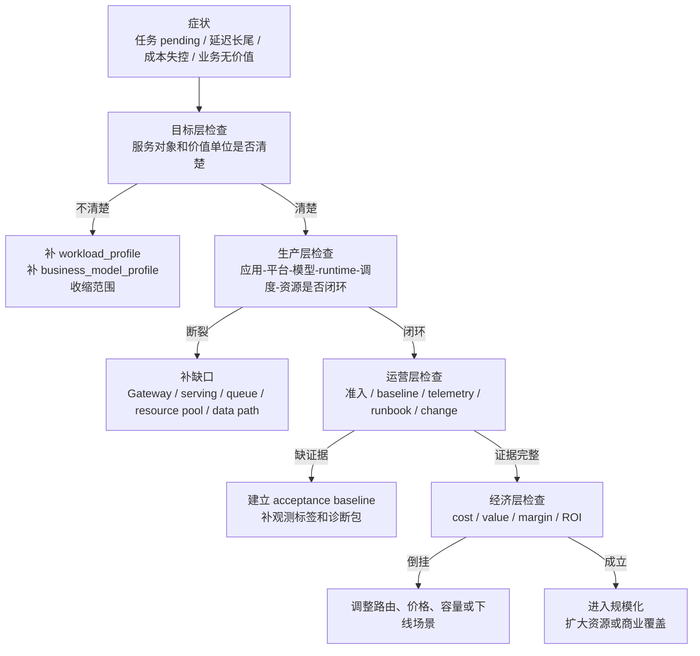

# 第 43 章：案例研究

## 43.1 本章回答的问题

- 如何用统一框架分析不同类型的 AI Factory？
- NVIDIA AI Factory、云厂商、企业私有、大模型公司、TokenFoundry 类组织和边缘场景各自强调什么能力？
- 为什么“只买 GPU”不等于建成 AI Factory？

## 43.2 本章上下文

- 层级定位：本章属于 `经济性与产业案例`，重点讨论Token Factory、商业模式、案例研究和从 0 到 1 建设路径。
- 前置依赖：建议先理解 第 42 章：AI Factory 商业模式 中的核心对象和路径。
- 后续关联：本章内容会继续连接到 第 44 章：从 0 到 1 建设 AI Factory，并在系统地图、深度标准和读者测试中被交叉引用。
- 读完能力：读完本章后，读者应能把《案例研究》中的概念映射到 AI Factory 的生产路径、工程对象、观测证据和设计取舍。

## 43.3 读者测试

- 机制题：读者能否解释 NVIDIA AI Factory、云厂商 AI Factory、企业私有 AI Factory、大模型公司 AI Factory 的核心机制，以及它们如何共同支撑《案例研究》？
- 边界题：读者能否区分 技术产能、商业收入、成本账本、SLA 责任和建设路线 的责任边界，并说明哪些问题不能简单归因到本章组件？
- 路径题：读者能否从业务目标追到 token 产出、成本账本、商业模式、案例取舍和建设 PRR，并指出本章对象在路径中的位置？
- 排障题：当《案例研究》相关生产症状出现时，读者能否列出第一层证据、下一跳证据、可能 owner 和止血动作？


## 43.4 一个真实场景

两个团队都采购了同样数量、同样型号的 GPU。团队 A 在采购前先定义服务对象、模型路线、workload、网络拓扑、存储基线、调度平台、推理服务、准入验收、可观测性、成本系统和 SRE 流程。GPU 到货后，节点先进入验收池，跑 GPU burn-in、nvbandwidth、NCCL test、RDMA 和 storage benchmark，通过后才进入训练或推理资源池。

团队 B 的采购速度更快。服务器上架，驱动安装，用户可以 SSH 登录或提交容器任务，看起来也能跑模型。几个月后，问题开始出现：不同节点驱动版本不一致，NCCL 性能不可预测，checkpoint 经常拖慢训练，推理服务没有 token 计量，用户抱怨任务 pending 却不知道原因，GPU utilization 看起来不低但业务产出不清楚。团队 B 买到了硬件，却没有形成生产系统。

案例研究的目的不是复制某家公司，也不是评判某个厂商，而是训练一种系统分析方法。不同 AI Factory 类型会强调不同能力：云厂商强调规模、多租户和产品化；企业私有强调安全、集成和内部 ROI；大模型公司强调训练推理闭环；边缘场景强调现场可靠性；TokenFoundry 类组织强调 token 经济性。它们不同，但都必须把应用、模型、平台和基础设施连接起来。

分析案例时，最容易犯的错误是被单点技术吸引。看到 GPU 数量、网络带宽、模型榜单或推理引擎，就以为理解了 AI Factory。真正要问的是：服务谁，生产什么，如何计量，如何调度，如何验收，如何恢复，如何赚钱或产生价值，如何持续升级。只有这些问题都有答案，案例才具有可学习性。

本章的案例都是类型化分析，不使用或虚构任何公司私有数据。读者应把它们当成架构模式，而不是采购清单。每个组织都需要根据业务目标、人才结构、预算、机房条件、合规要求和市场位置，选择自己的 AI Factory 形态。

## 43.5 核心概念

案例研究应使用统一框架，而不是按公司名称堆故事。本章采用八个观察维度：服务对象、价值单位、核心 workload、平台能力、基础设施能力、可靠性要求、经济模型和主要风险。用同一框架看不同案例，才能比较差异，避免被宣传语言或单点指标带偏。

服务对象决定系统边界。服务内部员工、外部开发者、企业客户、模型研究团队、行业用户和现场边缘设备，所需能力完全不同。价值单位决定经营逻辑：token、GPU hour、项目交付、订阅、业务结果或内部效率。workload 决定技术路径：在线推理、批量推理、分布式训练、微调、评测、RAG、Agent 或边缘推理。

平台能力描述应用和模型如何被消费，包括 MaaS、API Gateway、计费、Agent 平台、模型 registry、评测、观测和用户门户。基础设施能力描述资源如何被交付，包括 GPU IaaS、裸金属、虚拟化、Kubernetes、Slurm、网络、存储、机房、电力和制冷。AI Factory 的关键在于两者连接，而不是只强一边。

可靠性要求决定运营体系。对外 MaaS 要有 SLA、限流、回滚和客户支持；预训练平台要有 checkpoint、故障隔离和 NCCL 排障；私有化系统要有离线升级和现场诊断；边缘系统要有远程观测和断网运行。不同可靠性目标，会改变架构复杂度和成本。

经济模型决定可持续性。云厂商看资源利用率、毛利和客户留存；企业私有看内部 ROI 和成本分摊；大模型公司看训练投资与推理收入；边缘场景看现场价值和维护成本。一个案例是否成功，不只看技术先进，还要看价值能否持续覆盖成本和风险。

还要区分“公开可见能力”和“真实运行能力”。公开资料常展示硬件、模型和产品入口，但真实运行质量还取决于验收、升级、故障恢复、成本归因和组织流程。案例研究应尊重公开事实，同时避免把不可验证细节当成结论。

## 43.6 系统架构

案例分析架构可以分为三层。第一层是目标层：客户是谁，价值单位是什么，业务结果如何衡量。第二层是生产层：应用、平台、模型、运行时、调度、GPU、网络存储和物理基础设施如何组织。第三层是运营层：SLO、验收、观测、故障诊断、成本、计费和升级如何闭环。

任何案例都可以沿这三层展开。若目标层不清，技术系统会失去方向；若生产层不完整，GPU 和模型无法稳定转化为服务；若运营层缺失，系统能演示但不能持续生产。案例研究的价值，就是把“看起来先进”的系统拆成可验证能力。

架构分析还要看能力之间是否一致。一个对外 MaaS 如果没有 billing 和 token 计量，平台能力与商业模式不一致；一个大训练平台如果没有 NCCL 基线和 checkpoint 恢复，基础设施能力与 workload 不一致；一个私有化系统如果没有离线安装和升级路径，交付方式与运维能力不一致。

同样重要的是演进路径。许多 AI Factory 不是一次建成，而是从内部平台、GPU 集群、模型 API 或私有化项目逐步演进。分析案例时要问：它当前能力能否支持下一阶段？早期架构中哪些边界保留了扩展空间？哪些技术债会在规模化时爆发？

这套架构也能用于反向诊断。若一个案例强调商业化，却缺少计量和 SLA，就说明目标层与运营层断裂；若强调大训练，却缺少网络、存储和准入基线，就说明生产层不完整；若强调行业落地，却缺少业务指标，就说明价值单位不清。

案例图不是为了画出漂亮层级，而是为了强迫每个结论落到证据：它服务谁、跑什么 workload、依赖哪些平台能力、需要哪些基础设施、如何运营、如何证明价值。缺少证据的部分，应明确标注为假设。



## 43.7 NVIDIA AI Factory

NVIDIA AI Factory 更像一种系统叙事和参考架构：用 GPU、网络、系统软件、开发工具、训练推理框架、模型服务和生态组件，构成 AI 生产系统。它强调从芯片、服务器、scale-up/scale-out 网络到 CUDA、NCCL、推理引擎和模型工作流的垂直整合。这个叙事的价值在于提醒市场：GPU 不是孤立设备，AI 产能来自完整系统。

从工程视角看，最值得学习的是体系化。GPU 的计算能力要通过 HBM、NVLink/NVSwitch、InfiniBand/RoCE、CUDA、NCCL、TensorRT-LLM、监控诊断、参考镜像和生态工具释放出来。单独比较 GPU 峰值算力，无法解释真实训练吞吐、推理延迟和故障恢复能力。AI Factory 必须从系统路径评估能力。

NVIDIA 相关架构也强调软硬件协同。新 GPU 架构、低精度能力、网络拓扑和推理引擎通常一起演进，训练框架和模型 serving 需要适配这些能力。对平台团队来说，这意味着硬件采购不能脱离软件栈、驱动版本、容器镜像、调度拓扑和运维能力。

但供应商参考架构不能直接等同于自己的建设方案。每个组织都有不同业务、预算、机房、电力、团队技能、合规要求和存量系统。照搬参考架构，可能买到先进设备，却无法在本地环境中稳定交付。正确做法是从参考架构中提取系统原则，再结合自身约束落地。

因此，NVIDIA AI Factory 案例的核心启发不是“必须使用某个固定组合”，而是“AI 基础设施要按端到端生产系统设计”。硬件、网络、软件、模型和运营必须同时进入规划。忽略任何一层，都会让昂贵硬件的能力无法转化为可用产能。

对采购和架构团队来说，这个案例还提供了验收思路。评估硬件方案时，不只看单卡算力，还要看节点内带宽、跨节点通信、软件版本、容器生态、监控诊断和代表性 workload。系统级验收比规格表更接近真实产能。

## 43.8 云厂商 AI Factory

云厂商 AI Factory 面向多租户客户提供 AI 能力，通常覆盖 GPU IaaS、裸金属 GPU、GPU VM、容器平台、托管训练、推理服务、MaaS、数据服务和运维支持。它的服务对象多样，既有开发者，也有企业客户、大模型公司和行业客户。价值单位可能是 GPU hour、token、专属集群、托管服务或解决方案订阅。

这类 AI Factory 的关键能力是产品化和规模化。客户希望按需购买资源和服务，不想理解每个底层细节；云厂商则需要把复杂的 GPU、网络、存储、驱动、调度和模型服务包装成规格、价格、SLA、区域和支持等级。产品化能力决定客户体验，规模化能力决定成本和毛利。

云厂商案例还强调多租户隔离。不同客户共享物理基础设施，却需要身份隔离、网络隔离、数据隔离、资源配额、账单隔离和故障影响隔离。GPU 集群越昂贵，资源池化越重要；客户越多，隔离和可观测性越重要。没有强多租户治理，云服务无法稳定扩张。

技术挑战在于产品组合复杂。算力租赁、托管训练、推理服务和 MaaS 共享底层资源，但它们对调度、SLO、计费和支持的要求不同。云厂商必须在资源池统一和产品差异之间取得平衡。过度统一会限制产品能力，过度分裂会降低利用率。

经济上，云厂商 AI Factory 要持续管理库存风险和价格风险。GPU 采购、电力和机房成本前置，客户需求和市场价格变化很快。容量预测、长期客户合同、资源分层、区域布局和成本优化，决定这种模式是否可持续。云厂商案例的核心经验，是把 AI Factory 当作可运营产品，而不是一次性工程项目。

## 43.9 企业私有 AI Factory

企业私有 AI Factory 服务内部业务或受监管环境，常见目标是数据安全、合规、内部效率、业务流程自动化和降低外部 API 依赖。它可能部署在企业自有机房、专属云、混合云或受控边缘环境中。与云厂商不同，企业私有 AI Factory 的价值更常体现为业务效率和风险控制，而不一定是直接收入。

这类场景常见 workload 包括 RAG、办公 Copilot、代码助手、智能客服、数据分析 Agent、知识库问答、文档处理和行业流程自动化。它不一定需要最大规模预训练，却需要把模型、数据、权限、审计和业务系统深度集成。企业用户关心的不是模型榜单，而是能否安全地解决具体流程问题。

平台能力的重点是治理。统一 API、模型目录、权限、租户、数据边界、RAG 数据治理、Agent 工具权限、审计、成本分摊和内部支持流程，决定平台能否从试点走向规模化。很多企业私有平台失败，不是因为模型不能跑，而是因为资源和责任无法治理。

基础设施策略要务实。企业可能不需要一开始建设超大训练集群，可以先建设稳定推理池、RAG 数据管道、微调能力和评测体系；如果确实需要训练，再逐步补齐网络、存储、Slurm/Kubernetes 调度和 checkpoint 能力。把所有能力一次性建满，容易造成成本和人才压力。

企业私有案例的主要风险是“内部平台没有产品化”。如果没有配额、成本、SLO、应用生命周期和运维流程，内部需求会无限膨胀，GPU 资源变成公共池。成功的企业私有 AI Factory，会把内部客户当成真实客户管理：有入口、有承诺、有成本、有支持，也有退出和优先级机制。

## 43.10 大模型公司 AI Factory

大模型公司 AI Factory 的核心任务，是持续生产、评测、发布和服务模型。它同时需要大规模预训练、后训练、微调、评测、数据平台、模型 registry、推理服务、实验管理、成本优化和发布治理。与只提供算力的系统不同，它的生产对象是模型能力和 token 服务。

训练链路是这类系统的重心之一。数据清洗、tokenization、分布式并行、NCCL、checkpoint、训练稳定性、故障恢复和评测闭环，都直接影响模型产出速度。一次大训练失败可能消耗大量 GPU 小时，因此准入、拓扑、可观测性和 SRE 不是辅助能力，而是研发效率的一部分。

推理链路同样关键。模型公司不仅要训练模型，还要让模型以可接受成本服务客户或内部产品。TTFT、TPOT、batching、KV Cache、路由、缓存、模型压缩、安全策略和计费，都会影响推理毛利。训练能力强但推理效率差，商业化会受限；推理能力强但训练迭代慢，模型竞争力会下降。

大模型公司案例的难点是速度与稳定性的冲突。研究团队需要快速试验新数据、新架构和新训练策略；平台团队需要稳定资源池、版本、调度和上线流程。好的 AI Factory 会把实验、评测、发布、回滚和成本分析做成流水线，让创新在可控边界内发生。

经济模型上，大模型公司要把训练 ROI 和推理毛利连接起来。训练投入是否提升了模型质量，模型质量是否带来收入、留存或推理成本下降，失败实验是否沉淀了数据和平台能力，都需要被记录。否则训练集群会变成巨大的成本中心，无法解释长期投资回报。

这类案例还提示组织设计的重要性。数据、训练、推理、评测、安全和平台团队必须围绕模型生命周期协作。若每个团队只优化自己的指标，模型可能训练得快但上线慢，推理成本低但质量下降，评测充分但发布无法回滚。

## 43.11 TokenFoundry 类组织

TokenFoundry 类组织可以理解为围绕 token 生产、优化和商业化组织起来的团队或公司形态。这里必须强调，TokenFoundry 不是行业通用技术名词，而是一类组织案例：它们把模型服务、推理优化、成本治理、流量运营和客户价值都围绕 token 经济性管理。

这类组织的核心指标通常是 tokens/s、cost per token、revenue per token、tokens/W、推理毛利、SLO 和模型质量。它们会持续投资推理引擎、模型压缩、缓存、路由、动态批处理、计量、账单、容量运营和能效优化。相比“拥有最多 GPU”，它们更关心单位 token 是否有利润和用户价值。

TokenFoundry 类组织的技术重点在 Platform、Model Serving 和 Runtime 的连接。模型路由决定不同请求用哪个模型，推理引擎决定 GPU 效率，计量系统决定收入和成本归因，SRE 决定体验稳定性，成本系统决定扩容和定价。任何一环断裂，token 经济性都会失真。

风险是过度财务化。若只追求 token 数量和成本下降，可能牺牲模型质量、安全、隐私、用户体验和长期信任。低成本但低质量的 token 没有持续商业价值，甚至会制造支持成本和合规风险。因此 Token Factory 视角必须被质量评测、安全策略和业务结果约束。

这个案例的启发是，AI Factory 需要经营语言。很多技术团队知道 GPU 是否忙、模型是否上线，却说不清 token 是否赚钱、能效是否改善、哪些请求侵蚀毛利。TokenFoundry 类组织把这些问题前置，让工程优化直接服务经济结果。

但这种组织也需要防止短视。为了短期降低 cost/token 而忽略训练投入、质量评测、安全治理和客户支持，会损害长期收入。Token 经济性应该成为决策依据，而不是唯一目标函数。

## 43.12 边缘 AI Factory

边缘 AI Factory 把模型推理或轻量训练能力部署到靠近数据和用户的位置，例如工厂、门店、车辆、边缘机房、专有网络、油田、医院或校园。它强调低延迟、离线可用、数据本地处理、带宽节省和现场业务连续性。它不一定生产最多 token，但必须在受限环境中稳定工作。

边缘场景的资源约束更强。GPU 数量少，电力和散热有限，网络可能不稳定，运维人员少，现场环境复杂，升级窗口有限。平台不能假设随时可以远程登录、拉取镜像或重启服务。部署包、模型大小、缓存策略、离线观测和远程诊断能力，比中心云更关键。

模型策略也不同。边缘系统常使用量化、蒸馏、小模型、专用模型或本地 RAG，以换取低延迟和稳定性。对于需要更强模型能力的任务，可以采用边缘与中心协同：本地处理低风险和实时任务，中心处理复杂任务或离线分析。架构要明确断网时降级策略。

可观测性是边缘 AI Factory 的生命线。现场问题往往难以及时派人处理，必须能远程看到设备状态、模型版本、输入输出摘要、错误、性能、资源水位和升级状态。考虑到数据安全，观测还需要脱敏和本地留存策略。没有远程诊断，边缘部署会迅速变成不可维护孤岛。

经济上，边缘 AI Factory 的价值来自实时性、数据不出域、减少人工巡检、降低带宽、提高现场自动化和业务连续性。cost per token 仍可参考，但不是唯一指标。若一个边缘模型减少了生产停机或提升了安全响应，即使 token 成本高于云端，也可能有明确 ROI。

边缘案例还强调生命周期管理。设备分散、环境差异大、升级窗口少，模型和软件版本容易漂移。没有集中资产、版本、健康和回滚管理，边缘 AI Factory 会从少量试点迅速变成大量不可维护节点。

## 43.13 失败案例：只买 GPU 为什么不等于建成 AI Factory

只买 GPU 的失败模式很常见。机器到了，驱动能装，容器能启动，模型也能跑一个 demo，于是团队以为 AI Factory 已经建成。但一旦进入多租户、多模型、长任务和真实业务，缺口会集中暴露：任务 pending 不可解释，GPU 空闲却无法分配，大训练 NCCL hang，推理延迟长尾，checkpoint 卡住，账单无法对齐，故障无法定位。

GPU 是必要条件，不是充分条件。AI Factory 还需要 Application 入口、MaaS 和 API Gateway、模型生命周期、推理和训练 Runtime、资源编排与作业调度、GPU IaaS、网络存储、物理基础设施、准入验收、可观测性、SRE、安全、计量计费和成本模型。缺少这些能力，GPU 只是硬件库存。

只买 GPU 的根因通常是把“资源”误认为“产能”。资源只有在通过调度、运行时、网络、存储、模型服务和运维流程组织起来后，才会变成可生产 token 或模型的产能。一个 GPU 集群可以很贵，但如果不能稳定启动任务、恢复失败、服务请求和解释成本，就不是 AI Factory。

判断是否建成 AI Factory，可以问一组具体问题：用户能否稳定调用模型？训练任务能否排队、调度、恢复和评测？资源是否通过准入？网络和存储是否有基线？故障能否按时间线和拓扑定位？成本能否按 token、模型、租户或 GPU 小时解释？模型能否灰度、回滚和退役？若答案是否定的，系统还停留在 GPU 集群阶段。

这个失败案例的价值，是提醒建设顺序。先买硬件再补平台，常导致网络、存储、机房、调度和运维被动适配，成本更高。更好的顺序是先定义 workload、价值单位、SLO 和验收，再反推 GPU、网络、存储和平台能力。AI Factory 建设不是采购项目，而是生产系统设计。

## 43.14 工程实现

工程上，可以把案例研究固化为标准评估模板。每次分析一个组织、项目或客户需求时，都按同一结构填写：服务对象、价值单位、核心 workload、模型策略、平台能力、基础设施能力、可靠性目标、计量方式、成本结构、主要风险、当前缺口和下一步。模板让讨论从主观印象变成可比较证据。

第二步，是把案例模板用于自身诊断。团队可以选择最接近自己的类型，例如企业私有、MaaS、算力租赁或大模型公司内部平台，然后逐项检查能力缺口。如果价值单位是 token，但没有 token 计量；如果核心 workload 是训练，但没有 checkpoint 和 NCCL 基线；如果目标是私有化，但没有离线交付包，就说明架构与目标不匹配。

第三步，是把案例研究转成 roadmap。缺口不应停留在文档里，而要变成阶段目标：先补准入和观测，再补计量和成本，再补 SRE 和升级，再补多租户和产品化。每个阶段都要有验收指标，避免“学习了案例”但没有改变系统。

```yaml
case_study:
  type: enterprise-private-ai-factory
  users:
    - internal-copilot
    - customer-service
    - data-analysis-agent
  value_unit: business_outcome_and_internal_cost
  critical_workloads:
    - rag
    - online_inference
    - fine_tuning
  required_capabilities:
    - tenant_quota
    - rag_data_governance
    - inference_observability
    - private_model_serving
    - cost_allocation
  risks:
    - unclear_ownership
    - no_acceptance_baseline
    - missing_internal_billing
```

更严谨的案例研究应生成 `case_study_evidence_pack`。它把公开事实、可验证证据、工程推断和待验证假设分开，避免把营销材料、媒体描述、供应商规格或二手传闻直接当成系统结论。这个对象也能帮助团队把案例研究转成自己的架构评审输入。

```yaml
case_study_evidence_pack:
  id: case-enterprise-private-ai-factory-reference
  scope:
    case_type: enterprise_private_ai_factory
    purpose: internal_productivity_and_secure_rag
    analysis_date: "2026-06"
  evidence_layers:
    public_facts:
      - source: product_documentation
        claim: provides_private_model_serving
        confidence: high
      - source: public_architecture_talk
        claim: uses_kubernetes_for_serving
        confidence: medium
    observed_signals:
      - source: acceptance_report
        claim: gpu_nodes_passed_container_gpu_smoke_test
        confidence: high
      - source: incident_review
        claim: rag_acl_regression_caused_rollout_pause
        confidence: high
    engineering_inference:
      - claim: dedicated_inference_pool_needed_for_customer_service
        basis:
          - production_slo
          - traffic_peak_pattern
          - wrong_answer_impact
        confidence: medium
    assumptions_to_validate:
      - claim: future_agent_tools_require_stronger_sandbox
        validation_method: application_readiness_review
  capability_map:
    target_layer:
      service_object: internal_business_users
      value_unit: resolved_task_and_cost_allocation
    production_layer:
      workloads:
        - rag
        - online_inference
        - evaluation
      missing_capabilities:
        - token_metering_by_cost_center
        - model_release_quality_gate
    operations_layer:
      strengths:
        - private_data_boundary
        - centralized_identity
      gaps:
        - no_standard_upgrade_path
        - limited_remote_diagnostics
    economics_layer:
      known_metrics:
        - gpu_hour_cost
        - application_adoption
      missing_metrics:
        - cost_per_resolved_task
        - quality_adjusted_value
  reusable_lessons:
    - start_with_workload_profile_not_gpu_inventory
    - make_acl_regression_part_of_release_gate
    - treat_private_upgrade_path_as_product_feature
```

成熟的 `case_study_evidence_pack` 还应给出证据质量评分和不可复用条件。很多案例失败不是因为分析者不努力，而是把不同可信度的材料混在一起：供应商规格、公开演讲、客户口述、内部监控、事故复盘和财务账本的可信度不同；“某公司这样做了”也不等于“我们的组织可以这样做”。证据包要明确哪些结论可以直接用于设计，哪些只能作为假设，哪些必须在本地 PoC、验收或商业试点中验证。

```yaml
case_study_evidence_pack:
  id: case-commercial-maas-reference-202606
  evidence_quality:
    scoring_rubric:
      level_3: direct_measurement_or_contractual_record
      level_2: customer_interview_or_public_technical_detail
      level_1: public_marketing_or_inferred_architecture
      level_0: unsupported_claim
    minimum_for_architecture_decision: level_2_with_local_validation
    minimum_for_commercial_commitment: level_3
  claim_register:
    - claim: premium_maas_requires_dedicated_capacity_and_sla_credit_model
      evidence_level: 3
      evidence_refs:
        - sla_credit_model
        - commercial_pnl_ledger
        - customer_onboarding_evidence
      reusable: true
    - claim: private_deployment_can_share_same_upgrade_path_as_public_cloud
      evidence_level: 1
      reusable: false
      reason_not_reusable: customer_network_and_offline_registry_constraints_unknown
      validation_required:
        - private_deployment_acceptance_record
        - upgrade_and_rollback_drill
    - claim: token_margin_will_improve_after_new_runtime
      evidence_level: 2
      reusable: conditional
      validation_required:
        - inference_runtime_cost_ledger
        - quality_cost_ledger
        - online_experiment_guardrail
  non_transferable_context:
    - different_power_and_cooling_limit
    - different_customer_support_model
    - different_data_residency_requirement
    - missing_sre_oncall_maturity
  commercial_evidence_gaps:
    - no_customer_support_cost_measurement
    - no_sla_credit_history
    - no_private_delivery_cost_baseline
```

这段结构让案例研究能直接进入第 44 章的建设评审。`minimum_for_commercial_commitment` 要求商业承诺必须有合同、账单、验收或生产证据，不能只靠公开叙事；`non_transferable_context` 防止团队照搬别人的规模、SLA 或交付方式；`commercial_evidence_gaps` 则把案例学习转成下一步数据采集。读者看到一个成功案例后，应能判断哪些能力是可学习的系统原则，哪些只是该组织在特定资源、客户和团队条件下成立。

案例成熟度可以用四层矩阵诊断，而不是只按“先进/落后”评价。目标层看服务对象和价值单位是否清楚；生产层看应用、模型、调度和基础设施是否能闭环；运营层看验收、观测、SRE、安全和升级是否可重复；经济层看成本、收入、ROI 和机会成本是否可解释。一个系统可以在生产层很强、经济层很弱，也可以在目标层清楚但运营层不成熟。分层诊断比单一评分更有用。

| 案例类型 | 目标层成熟信号 | 生产层成熟信号 | 运营层成熟信号 | 经济层成熟信号 | 常见缺口 |
| --- | --- | --- | --- | --- | --- |
| NVIDIA AI Factory 参考架构 | AI 生产系统叙事清楚 | 软硬件协同链路完整 | 依赖组织自行落地运维 | 强调系统能效和产能 | 不能直接替代本地需求分析 |
| 云厂商 AI Factory | 客户分层和产品规格清楚 | GPU IaaS、MaaS、训练/推理组合 | SLA、账单、多租户、支持体系 | 资源利用率和毛利可经营 | 标准化与大客户定制冲突 |
| 企业私有 AI Factory | 内部效率和安全目标清楚 | RAG、推理、微调和企业系统集成 | 权限、审计、升级、内部支持 | 内部 ROI 和成本分摊 | 平台产品化不足 |
| 大模型公司 AI Factory | 模型能力和 token 服务目标清楚 | 数据、训练、评测、推理闭环 | 实验治理、发布回滚、训练恢复 | 训练 ROI 与推理毛利连接 | 研究速度与稳定性冲突 |
| TokenFoundry 类组织 | token 经济性目标突出 | 推理引擎、路由、计量强 | SLO 和成本运营强相关 | cost/token 与 revenue/token 清楚 | 可能忽视质量和长期信任 |
| 边缘 AI Factory | 现场价值和离线目标清楚 | 小模型、边缘 RAG、中心协同 | 远程诊断、离线升级是关键 | 以现场业务连续性衡量 | 版本漂移和现场运维困难 |
| 只买 GPU 的失败案例 | 目标层通常模糊 | 硬件有，生产路径断裂 | 准入、观测、SRE 缺失 | 成本和价值无法解释 | 把资源误认为产能 |

失败案例也应按证据链诊断。下面的路径适合用在“GPU 买了但平台产出差”的复盘中。它从业务症状开始，逐层追到 profile、商业承诺、生产路径和运营证据，避免直接把问题归咎于“GPU 不够”或“模型不行”。



这个诊断路径还要求区分事实和推断。比如“任务 pending 很久”是事实，“GPU 不够”只是可能推断；还需要检查 quota、gang、topology、image、data path、node baseline 和队列优先级。“推理毛利下降”是事实，“模型太贵”也只是可能推断；还需要检查 output token、cache miss、低质量重试、安全拦截、失败计费和支持成本。案例研究要训练这种证据纪律。

在团队内部，可以把每个案例研究沉淀成 `ai_factory_maturity_assessment`。它给出当前级别、证据、短板和下一步，不追求一次性满分。

```yaml
ai_factory_maturity_assessment:
  target_system: internal-ai-platform
  assessment_period: 2026q2
  levels:
    target_layer:
      level: 3
      evidence:
        - workload_profiles_for_top_5_apps
        - internal_chargeback_policy
      gap:
        - no_external_customer_sla_boundary
    production_layer:
      level: 2
      evidence:
        - maas_api_available
        - gpu_resource_pool_accepted
      gap:
        - training_checkpoint_recovery_not_standardized
    operations_layer:
      level: 2
      evidence:
        - basic_gpu_and_inference_dashboard
        - incident_template
      gap:
        - no_change_safety_case_for_driver_upgrade
    economics_layer:
      level: 1
      evidence:
        - gpu_hour_cost_report
      gap:
        - missing_cost_per_successful_task
  next_actions:
    - build_append_only_metering_ledger
    - add_acceptance_to_launch_pipeline
    - define_business_model_profile_before_external_maas
```

成熟度诊断的价值在于排序。若目标层只有 1 级，不应急着采购更多 GPU；若生产层断裂，不应先做复杂毛利模型；若运营层没有准入和观测，规模化会放大事故；若经济层没有成本口径，商业增长可能只是亏损增长。案例研究最终要服务建设优先级。

第四步，是定期更新案例库。行业技术和商业模式变化很快，案例不能写完就不动。每次项目复盘、客户交付、重大事故或成本优化，都应沉淀到案例库中。案例库的价值不是记录故事，而是帮助下一次架构决策更快、更准。

第五步，是把案例库用于评审。新项目立项、重大采购、商业模式调整或私有化交付前，都可以选择相似案例做对照，检查能力缺口和风险。这样案例研究就从学习材料变成工程治理工具。

第六步，是记录不适用条件。一个案例适合某种规模、团队和合规环境，不代表适合所有组织。模板中应写明假设、约束和不适用场景，避免后来者机械套用。

## 43.15 常见故障

第一类故障是以供应商参考架构替代自身需求分析。参考架构提供成熟组件和系统原则，但不能自动匹配业务目标、预算、机房、电力、团队能力和合规边界。解决方向是先写自己的服务对象、workload 和价值单位，再选择参考架构中适用的部分。

第二类故障是只建设 GPU 集群，没有模型服务和平台治理。用户能登录机器，但不能稳定调用模型；任务能跑，但不能排队、恢复和计量；资源能用，但成本无法归因。解决方向是把 GPU 集群纳入 AI Factory 分层模型，补齐平台、调度、观测和经济系统。

第三类故障是内部平台缺少成本分摊。没有内部账单和配额，需求会无限增长，低价值任务会挤占关键业务。解决方向是按租户、项目、模型和 token/GPU 小时建立成本视图，即使不对内部团队真实收费，也要让成本可见。

第四类故障是私有化项目缺少标准版本。每个客户环境都变成特殊分支，升级和排障无法复用。解决方向是建立标准交付包、版本矩阵、离线镜像、验收脚本和支持边界，把定制控制在配置和集成层。

第五类故障是边缘部署缺少远程观测。现场设备断网、模型版本漂移、资源耗尽或输入分布变化时，中心团队看不到证据，只能派人到现场。解决方向是设计离线可运行、联网可同步、脱敏可诊断的边缘观测机制。

第六类故障是照搬案例不看组织能力。某些架构需要强 SRE、网络、GPU、模型和平台团队，如果组织没有这些能力，复杂架构会变成负担。案例研究必须同时评估技术目标和团队能力，不能只看理想形态。

## 43.16 性能指标

案例目标指标应从价值单位出发。云厂商看收入、毛利、资源利用率、SLA、客户留存和交付速度；企业私有看内部采用率、业务效率、成本分摊、数据安全和关键应用 SLO；大模型公司看训练效率、模型质量、上线周期、推理毛利和实验成功率；边缘场景看现场可用性、低延迟、离线运行和业务连续性。

平台指标包括模型上线周期、API 可用性、TTFT、TPOT、任务成功率、评测通过率、租户配额使用、账单准确性、应用接入周期和 Agent 任务成功率。它们回答平台是否把模型能力变成可消费服务，而不是只停留在底层资源。

基础设施指标包括准入通过率、NCCL 基线、RDMA 错误、GPU Xid/ECC、存储吞吐、checkpoint 时长、网络拥塞、节点维修回池时间、资源碎片和 GPU 有效利用率。它们回答基础设施是否稳定支撑核心 workload。

经济指标包括 cost per token、revenue per token、GPU hour 成本、tokens/W、推理毛利、训练 ROI、失败重跑成本、库存利用率和支持成本。它们回答系统是否可持续经营。不同案例可以权重不同，但都不能完全忽视经济性。

案例研究还需要成熟度指标，例如能力覆盖率、自动化比例、runbook 覆盖率、复发事故比例、版本漂移、定制化比例和交付可复制性。成熟度指标能解释为什么两个系统硬件相同，长期产出却不同。

评估指标还应包含证据来源。公开页面、客户访谈、内部监控、财务报表、事故复盘和交付验收，可信度不同。案例研究应标注哪些是事实，哪些是推断，哪些需要后续验证。证据纪律能防止案例分析变成传闻整理。

最后，应关注反指标。客户支持成本上升、定制化比例增加、版本漂移扩大、故障复发率高、验收失败率上升，都说明案例背后的模式可能有系统性问题。成功案例和失败信号要一起看。

## 43.17 设计取舍

第一个取舍是学习案例与照搬案例。学习案例是提取系统原则，例如端到端基线、统一计量、资源池治理和 SRE 闭环；照搬案例是复制组件清单，却忽略自身约束。AI Factory 是系统工程，组件相同不代表系统能力相同。正确做法是先分析目标，再选择模式。

第二个取舍是规模优先与能力优先。云厂商和大模型公司可能需要快速扩大 GPU 和模型服务规模，但规模会放大缺失能力；企业私有和边缘场景可能更适合先建设治理、观测和交付能力，再逐步扩大规模。不是所有组织都应该从最大集群开始。

第三个取舍是统一平台与场景专用。统一平台有利于复用、成本和治理，场景专用有利于行业深度、边缘稳定和客户差异化。案例研究要看哪些能力必须统一，例如身份、计量、观测和资源池；哪些能力可以场景化，例如工作流、行业评测和部署形态。

第四个取舍是技术先进性与可运营性。先进 GPU、网络和模型可以提供上限，但可运营性决定日常产出。没有准入、监控、故障诊断、升级和成本系统，先进技术会变成复杂风险。案例分析应同时看上限和下限，尤其要看事故时系统如何恢复。

最终，案例研究的目标不是评选唯一正确模式，而是帮助团队建立判断力。看到一个 AI Factory 案例时，能快速识别它服务谁、生产什么、依赖哪些能力、承担哪些风险、经济模型是否闭环。具备这种判断力，才不会被 GPU 数量、模型榜单或营销叙事牵着走。

取舍还要回到阶段。初创团队可能先验证 MaaS 或推理服务，企业可能先做内部平台，云厂商可能先做资源池产品化。阶段不同，正确答案不同。案例研究提供地图，不提供替代思考的导航。

## 43.18 小结

- 案例研究应关注端到端能力，而不是单点技术。
- 不同 AI Factory 类型有不同价值单位和关键风险。
- TokenFoundry 更适合作为组织案例，不应当作通用技术名词。
- 只买 GPU 不等于建成 AI Factory，缺少平台、调度、验收、观测和经济模型都会失败。

## 43.19 延伸阅读

- [NVIDIA Glossary: AI Factory](https://www.nvidia.com/en-us/glossary/ai-factory/)
- [Amazon Bedrock documentation](https://docs.aws.amazon.com/bedrock/)；[Azure AI Foundry documentation](https://learn.microsoft.com/en-us/azure/ai-foundry/)；[Vertex AI documentation](https://cloud.google.com/vertex-ai/docs)
- [Azure Architecture Center: AI and machine learning](https://learn.microsoft.com/en-us/azure/architecture/ai-ml/)
