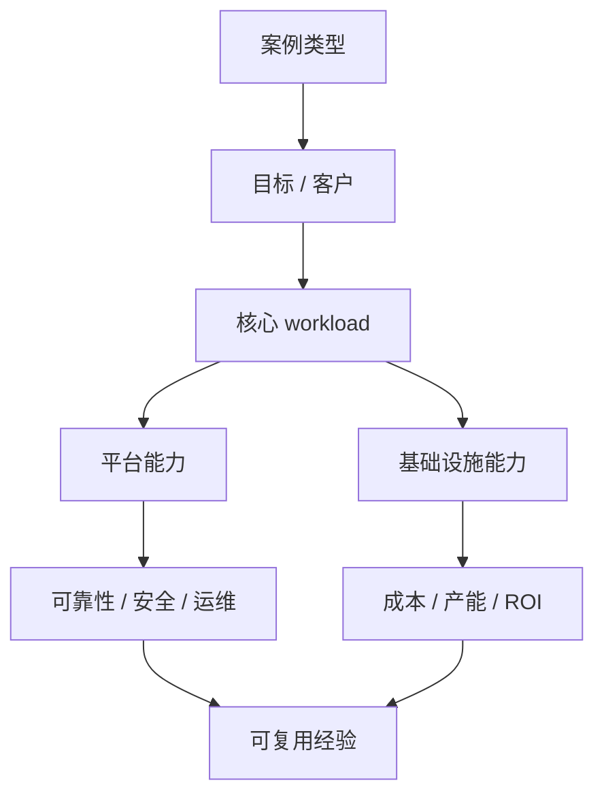

# 第 43 章：案例研究

## 本章回答的问题

- 如何用统一框架分析不同类型的 AI Factory？
- NVIDIA AI Factory、云厂商、企业私有、大模型公司、TokenFoundry 类组织和边缘场景各自强调什么能力？
- 为什么“只买 GPU”不等于建成 AI Factory？

## 一个真实场景

两个团队都采购了同样数量的 GPU。团队 A 同时建设模型服务、作业调度、准入验收、网络存储、可观测性、成本系统和 SRE 流程；团队 B 只完成服务器上架和驱动安装，让用户自己登录机器跑任务。半年后，团队 A 能稳定服务多个业务，团队 B 的 GPU 利用率、故障定位和业务交付都不可预测。

案例研究的目的不是复制某家公司，而是训练一种分析方法：看清每类 AI Factory 的目标、边界、关键能力和失败模式。

## 核心概念

本章中的案例是类型化分析，不使用或虚构任何公司私有数据。每个案例都按同一框架观察：服务对象、价值单位、核心 workload、平台能力、基础设施能力、可靠性要求、经济模型和主要风险。

AI Factory 不是单一产品形态。它可以是 GPU 云、模型 API 平台、企业私有系统、模型公司内部生产系统、行业解决方案或边缘部署。共同点是把应用、模型、运行时、调度、GPU、网络存储和物理基础设施组织成生产系统。

## 系统架构



使用这个框架，可以避免被单点技术吸引，而忽略端到端生产能力。

## 43.1 NVIDIA AI Factory

NVIDIA AI Factory 更像一种系统叙事和参考架构：用 GPU、网络、软件栈、模型工具、推理服务和生态组件构成 AI 生产系统。它强调从芯片、系统、网络到软件平台的垂直整合。

从工程视角看，值得学习的是体系化：GPU 不单独存在，而是与 NVLink/NVSwitch、InfiniBand/RoCE、CUDA、NCCL、推理引擎、训练框架、监控和参考部署组合起来。硬件能力通过软件栈和生态工具被释放。

风险是不要把供应商叙事直接等同于自己的架构。组织仍需要根据业务、预算、人才、机房和合规约束做取舍。

## 43.2 云厂商 AI Factory

云厂商 AI Factory 面向多租户客户提供 GPU IaaS、托管训练、模型服务、MaaS、数据服务和运维能力。它强调规模化资源池、计费、SLA、区域、多租户隔离和产品化体验。

云厂商的关键能力在于把复杂基础设施变成可购买、可交付、可计量的产品。客户可以使用裸金属 GPU、GPU VM、Kubernetes、模型 API 或托管推理，而不必自己建设完整数据中心。

这类模式的挑战是资源利用率和客户差异化。不同客户的模型、镜像、网络、数据和合规要求不同，平台必须在标准化和定制化之间平衡。

## 43.3 企业私有 AI Factory

企业私有 AI Factory 服务内部业务或受监管环境，重点是数据安全、合规、内部系统集成、成本分摊和可控运维。它可能部署在企业自有机房、专属云或混合云环境。

企业私有场景不一定追求最大规模训练，而常关注 RAG、Agent、办公 Copilot、代码助手、客服、数据分析和行业流程自动化。平台能力包括统一 API、模型目录、权限、审计、RAG 数据治理和内部账单。

主要风险是“内部平台没有产品化”。如果没有租户、配额、观测和成本分摊，内部需求会无限增长，GPU 资源很快变成不可解释的公共池。

## 43.4 大模型公司 AI Factory

大模型公司 AI Factory 的核心是持续生产、评测、发布和服务模型。它同时需要大规模预训练、后训练、评测、推理服务、数据平台、模型 registry、实验管理和成本优化。

这类系统的训练链路和推理链路都很重。训练侧关注数据、分布式并行、checkpoint、NCCL、稳定性和实验效率；推理侧关注 TTFT、TPOT、batching、缓存、模型路由和毛利。

主要风险是研发速度和平台稳定性冲突。模型团队需要快速试验，平台团队需要稳定生产。好的 AI Factory 会把实验、评测、发布和回滚做成流水线，而不是靠临时脚本。

## 43.5 TokenFoundry 类组织

TokenFoundry 类组织可以理解为围绕 token 生产、优化和商业化组织起来的团队或公司形态。这里的 TokenFoundry 不是行业通用技术名词，而是一类组织案例：它们把模型、推理、成本、流量和客户价值都围绕 token 经济性管理。

这类组织的核心指标通常是 tokens/s、cost per token、revenue per token、毛利、SLO 和模型质量。它们会投入推理引擎优化、模型压缩、缓存、路由、计费和容量运营。

风险是过度追求 token 数量而忽视质量、安全和用户价值。Token Factory 视角必须被质量评测和业务指标约束。

## 43.6 边缘 AI Factory

边缘 AI Factory 把模型推理或轻量训练能力部署到靠近数据和用户的位置，如工厂、门店、车辆、边缘机房或专有网络。它强调低延迟、离线可用、数据本地处理和带宽节省。

边缘场景通常资源受限：GPU 少、网络不稳定、运维人员少、环境复杂。平台必须简化部署、升级、观测和远程诊断。模型也常需要量化、裁剪或使用更小架构。

边缘 AI Factory 的价值不一定来自最大 tokens/s，而来自实时性、数据不出域、业务连续性和现场自动化。

## 43.7 失败案例：只买 GPU 为什么不等于建成 AI Factory

只买 GPU 的失败模式很常见：机器到了，但没有作业调度；驱动装了，但版本不一致；模型能跑，但没有服务化；任务失败，但没有可观测性；GPU 忙，但不知道产出多少 token；网络通了，但 NCCL 慢；存储有容量，但 checkpoint 卡住。

GPU 是必要条件，不是充分条件。AI Factory 还需要应用入口、平台治理、模型生命周期、运行时、资源编排、GPU IaaS、网络存储、物理工程、可靠性、计量计费和经济模型。

判断是否建成 AI Factory，可以问几个问题：用户能否稳定调用模型？训练任务能否排队、恢复和评测？资源是否通过准入？故障能否定位？成本能否按 token 或 GPU 小时解释？如果答案是否定的，GPU 仍只是硬件库存。

## 工程实现

案例分析模板：

```yaml
case_study:
  type: enterprise-private-ai-factory
  users:
    - internal-copilot
    - customer-service
    - data-analysis-agent
  value_unit: business_outcome_and_internal_cost
  critical_capabilities:
    - tenant_quota
    - rag_data_governance
    - inference_observability
    - private_model_serving
    - cost_allocation
  risks:
    - unclear_ownership
    - no_acceptance_baseline
    - missing_billing
```

使用同一模板分析不同案例，能帮助团队识别自身缺口。

## 常见故障

- 以供应商参考架构替代自身需求分析。
- 只建设 GPU 集群，没有模型服务和平台治理。
- 内部平台缺少成本分摊，导致需求失控。
- 私有化项目缺少标准版本，后续无法升级。
- 边缘部署缺少远程观测，现场问题无法诊断。

## 性能指标

- 案例目标指标：业务效率、token 产出、GPU 利用率、SLA、ROI。
- 平台指标：模型上线周期、任务成功率、推理延迟、成本分摊准确性。
- 基础设施指标：准入通过率、故障率、MTTR、网络和存储基线。
- 经济指标：cost per token、revenue per token、GPU 小时成本、毛利。

## 设计取舍

参考案例提供方向，不提供答案。云厂商强调规模和多租户，企业私有强调安全和集成，大模型公司强调训练推理闭环，边缘场景强调现场可靠性。照搬任何一种模式都可能失败。正确做法是先定义服务对象和价值单位，再选择技术组合。

## 小结

- 案例研究应关注端到端能力，而不是单点技术。
- 不同 AI Factory 类型有不同价值单位和关键风险。
- TokenFoundry 更适合作为组织案例，不应当作通用技术名词。
- 只买 GPU 不等于建成 AI Factory，缺少平台、调度、验收、观测和经济模型都会失败。

## 延伸阅读

- TODO: NVIDIA AI Factory 公开资料
- TODO: 云厂商 AI 平台公开案例
- TODO: 企业私有 AI 平台建设案例
