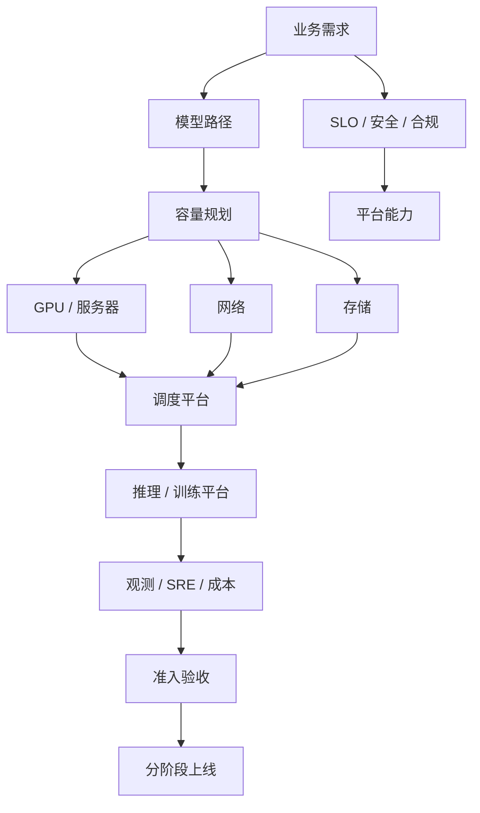

# 第 44 章：从 0 到 1 建设 AI Factory

## 本章回答的问题

- 从零开始建设 AI Factory 应该按什么顺序推进？
- 需求、模型、容量、GPU、网络、存储、调度、推理平台、运维、验收和上线节奏如何互相约束？
- 如何避免“先买 GPU，再补平台”的高成本弯路？

## 一个真实场景

一个企业计划建设 AI Factory，预算已经批准，采购团队准备先下单 GPU。平台团队追问：服务哪些应用？训练还是推理优先？模型多大？上下文多长？SLA 是什么？数据在哪里？是否需要私有化隔离？网络和存储按什么基线验收？没有这些答案，GPU 型号、数量、网络、存储、机房和平台选型都无法可靠决定。

从 0 到 1 建设 AI Factory 的关键，不是先堆硬件，而是先把业务目标、模型路径和基础设施约束连成一张可执行路线图。

## 核心概念

AI Factory 建设是系统工程。它至少包含 11 个决策面：需求分析、模型和业务目标、容量规划、GPU 选型、网络选型、存储选型、调度平台、推理平台、运维体系、验收标准和上线节奏。

这些决策不能线性孤立完成。模型选择会影响 GPU 和显存；训练规模会影响网络；推理 SLO 会影响 batching 和资源池；数据位置会影响存储和网络；商业模式会影响计费和租户；运维能力会影响可选复杂度。

## 系统架构



这张图的含义是：建设 AI Factory 要从业务和模型反推基础设施，再通过验收和上线节奏把系统交付出来。

## 44.1 需求分析

需求分析要回答服务对象、应用类型、数据边界、SLO、预算、时间线和商业模式。不要一开始就问“买多少 GPU”，先问“要生产什么能力”。

典型需求包括在线 Chat、RAG、Agent、代码助手、批量推理、微调、评测、预训练和私有化交付。每类需求的资源形态不同。在线 Chat 关注 TTFT 和 TPOT，预训练关注大规模稳定训练，RAG 关注检索和上下文，Agent 关注多轮调用和工具执行。

需求分析的输出应是 workload 清单、优先级、SLO、数据约束、租户模型和成功指标。

## 44.2 模型和业务目标

模型路径决定 AI Factory 的技术复杂度。使用外部 API、部署开源模型、微调企业模型、自研大模型和多模型路由，对基础设施要求完全不同。

业务目标要和模型指标连接。模型质量、延迟、成本、安全和可解释性都要定义验收口径。比如一个客服场景不能只看回答准确率，还要看响应时间、拒答策略、工单解决率和人工接管率。

模型路径还决定训练和推理比例。如果主要做推理服务，优先建设 MaaS、推理引擎和 token 计量；如果要训练基础模型，必须优先建设数据、分布式训练、NCCL、checkpoint 和评测。

## 44.3 容量规划

容量规划把业务需求转成 GPU、网络、存储和平台容量。推理容量可从请求量、输入输出 token、上下文长度、模型大小、SLO、batching 和冗余推导。训练容量可从模型规模、数据量、训练周期、并行策略、checkpoint 和失败重试推导。

容量规划不要只给一个峰值数字。应给基线、峰值、增长曲线、冗余、故障保留、实验预算和扩容触发条件。还要区分在线资源、离线资源、实验资源和验收资源。

容量规划的结果应能进入成本模型：预计 tokens/s、GPU 小时、cost per token、训练成本和扩容节奏。

## 44.4 GPU 选型

GPU 选型要匹配 workload。预训练看大规模通信、显存、稳定性和能效；在线推理看显存、HBM、低精度、batching 和成本；微调看显存和调度弹性；embedding 或小模型可能不需要最高端 GPU。

GPU 选型还要看供应、机房电力、冷却、服务器形态、驱动生态、运行时支持和团队经验。最强 GPU 不一定是最合适选择，尤其当网络、存储或平台无法释放它的能力时。

选型输出应包含 GPU 型号组合、资源池划分、适用 workload、采购批次、验收基线和升级路径。

## 44.5 网络选型

网络选型要区分推理入口网络、训练通信网络、存储网络、管理网络和 BMC 网络。训练集群关注 scale-out 带宽、延迟、RDMA、rail、拓扑和拥塞控制；推理集群关注入口负载均衡、服务发现、流式稳定性和权重加载。

InfiniBand 和 RoCE 都可以用于高性能训练，但运维模型不同。选择时要评估团队能力、现有网络、成本、可观测性和供应链。无论选择哪条路线，都必须建立 NCCL 和网络 benchmark 基线。

网络选型不应晚于 GPU 采购太多。GPU 数量、机柜布局、rack 设计和网络拓扑是联动的。

## 44.6 存储选型

存储选型要按数据类型分层。对象存储适合源数据、模型 artifact 和归档；并行文件系统适合热训练数据和 checkpoint；local NVMe 适合缓存和 scratch；模型 registry 管理模型发布语义。

训练场景要关注 data loader、metadata、checkpoint 写入和恢复。推理场景要关注模型权重加载、缓存、版本一致性和扩容速度。RAG 场景还要考虑向量库、索引构建和数据更新。

存储选型输出应包含容量、吞吐、IOPS、元数据能力、生命周期、备份、权限和成本模型。

## 44.7 调度平台选型

调度平台选型要把 Kubernetes、Slurm、Volcano、Kueue、Ray、Kubeflow 和 Argo 的边界说清楚。Kubernetes 适合服务化、容器生态和平台扩展；Slurm 适合 HPC 风格训练和成熟批调度；Volcano/Kueue 补充 Kubernetes 的队列、配额和 gang scheduling；Ray 适合分布式 Python 和 AI 应用执行。

不要把调度简单归为 PaaS 或 IaaS。它是资源编排与作业调度层，负责把 GPU、拓扑、配额和 workload 连接起来。

选型时要看 workload 组合、团队经验、生态集成、多租户、拓扑调度、队列、公平共享、抢占和可观测性。

## 44.8 推理平台选型

推理平台要支持模型加载、endpoint、replica、batching、streaming、autoscaling、模型路由、canary、rollback、token 计量和观测。推理引擎可以选择 vLLM、SGLang、TensorRT-LLM 或其他方案，关键是与模型、硬件和 SLO 匹配。

推理平台选型要先定义服务口径：OpenAI-compatible API、内部 SDK、专属 endpoint、批量推理、PD 分离、多模型 serving、长上下文和 reasoning 模型是否需要支持。

推理平台的验收应使用真实 prompt 分布，而不只是固定 benchmark。长上下文、流式输出、并发、冷启动和错误处理都要覆盖。

## 44.9 运维体系

运维体系包括可观测性、告警、oncall、incident、变更、升级、容量、成本、资产、准入和 runbook。AI Factory 的运维对象比普通服务更多：GPU、驱动、NCCL、RDMA、checkpoint、模型质量和 token 计量都要进入运维视野。

从 0 到 1 阶段，至少要建立：统一标签、核心 dashboard、准入流水线、故障隔离、变更流程、升级灰度、成本看板和事故复盘。

没有运维体系的 AI Factory 只能短期演示，无法长期生产。

## 44.10 验收标准

验收标准要覆盖硬件、软件、网络、存储、调度、推理、训练、安全和成本。验收不是项目最后一天的形式，而是每个资源进入生产池的门禁。

最低验收应包括 GPU burn-in、nvbandwidth、NCCL test、RDMA/network benchmark、storage benchmark、镜像/驱动版本、推理 benchmark、训练 smoke test、故障演练和观测指标。

验收标准要写成可执行流水线，并保存 baseline。后续维修、扩容和升级都要与 baseline 对比。

## 44.11 上线节奏

上线节奏应分阶段：实验环境、验收环境、小规模生产、核心业务灰度、多租户扩展、成本优化和规模化运营。不要第一天就把所有业务迁入新平台。

每个阶段都应有进入条件、退出条件、回滚方案和指标。例如第一阶段只支持一个模型和一个内部应用；第二阶段支持多租户和账单；第三阶段才开放外部客户或私有化复制。

上线节奏要保护团队学习曲线。AI Factory 的复杂度很高，分阶段上线能让技术、流程和组织一起成熟。

## 工程实现

从 0 到 1 建设清单示例：

```yaml
ai_factory_plan:
  phase_0_design:
    outputs:
      - workload_inventory
      - model_strategy
      - capacity_model
      - target_slo
  phase_1_foundation:
    outputs:
      - gpu_resource_pool
      - network_storage_baseline
      - acceptance_pipeline
      - observability_labels
  phase_2_platform:
    outputs:
      - maas_api
      - inference_serving
      - job_queue
      - tenant_quota
      - metering
  phase_3_production:
    outputs:
      - sre_runbook
      - billing_dashboard
      - change_management
      - cost_per_token_report
```

这个清单应按组织实际情况裁剪，但不要跳过需求、验收和运维。

## 常见故障

- 先买 GPU，再发现机房电力、网络或存储不匹配。
- 只建设训练集群，没有模型服务和应用入口。
- 推理平台上线后才补 token 计量和账单，历史成本无法归因。
- 调度系统不了解拓扑，导致高端网络和 GPU 互联被浪费。
- 没有准入和 runbook，生产事故依赖少数专家。

## 性能指标

- 建设指标：交付周期、验收通过率、上线阶段完成度。
- 推理指标：TTFT、TPOT、tokens/s、cost per token、SLA。
- 训练指标：作业成功率、step time、checkpoint 时长、GPU 小时浪费。
- 基础设施指标：GPU 利用率、NCCL 基线、存储吞吐、网络错误。
- 经济指标：预算消耗、资源利用率、毛利、训练 ROI。

## 设计取舍

从 0 到 1 最容易过度设计，也容易过度简化。过度设计会拖慢上线，过度简化会留下昂贵技术债。务实做法是先服务最重要的 1-2 类 workload，但用正确边界搭架构：租户、计量、验收、观测和升级路径从第一天就要有。

## 小结

- AI Factory 建设要从业务和模型目标反推基础设施。
- GPU、网络、存储、调度和推理平台必须协同选型。
- 准入验收、可观测性和 SRE 是生产系统的基础，不是后续补丁。
- 分阶段上线能降低风险，让组织能力和技术系统同步成熟。

## 延伸阅读

- TODO: AI 平台建设规划案例
- TODO: GPU 集群验收与运维资料
- TODO: MaaS / 推理平台生产化案例
