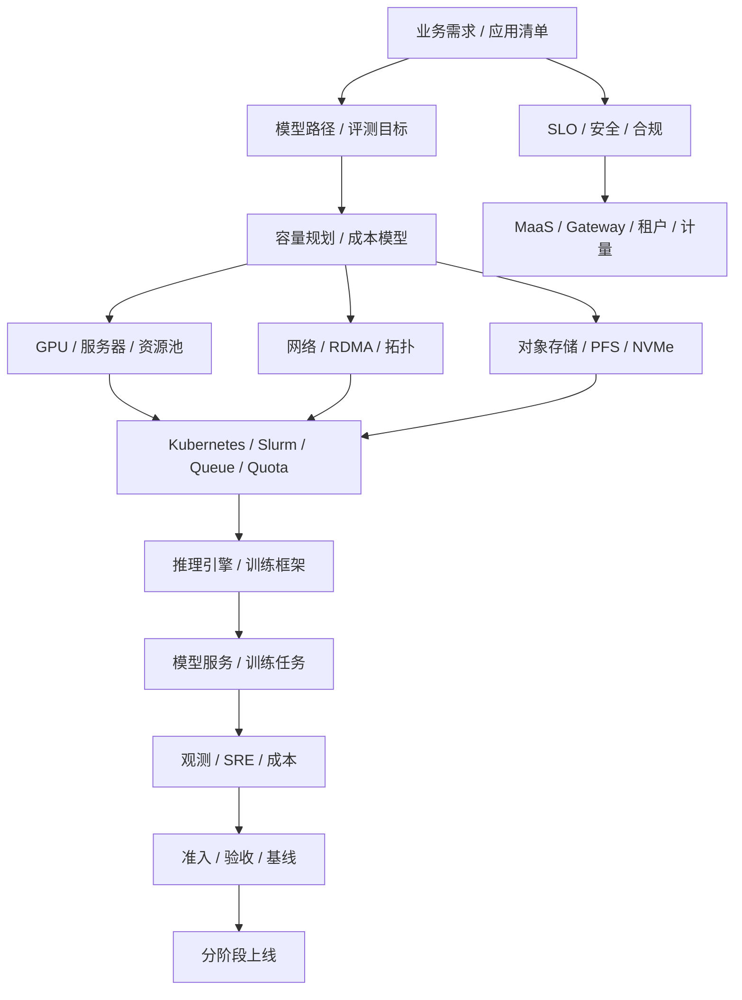

# 第 44 章：从 0 到 1 建设 AI Factory

## 本章回答的问题

- 从零开始建设 AI Factory 应该按什么顺序推进？
- 需求、模型、容量、GPU、网络、存储、调度、推理平台、运维、验收和上线节奏如何互相约束？
- 如何避免“先买 GPU，再补平台”的高成本弯路？

## 一个真实场景

一个企业计划建设 AI Factory，预算已经批准，采购团队准备先下单 GPU。平台团队追问几个问题：第一批要服务哪些应用，是 Chat、RAG、Agent、批量推理、微调还是预训练？目标模型多大，上下文多长，是否需要多模型路由？SLO 是什么，首 token 要多快，失败是否影响客户？数据在哪里，是否能进入云，是否需要私有化隔离？这些问题没有答案时，GPU 型号和数量都无法可靠决定。

基础设施团队又提出另一组问题：机房电力和制冷能支持多少 rack，是否需要液冷，网络是 InfiniBand 还是 RoCE，存储要支撑 checkpoint 还是模型权重加载，准入测试怎么跑，维修回池怎么验收？业务团队则关心上线时间、成本、客户可见功能和安全合规。每个团队的问题都合理，但如果没有统一路线图，建设会变成并行猜测。

最常见的弯路，是先买 GPU，再补网络、存储、调度、推理平台、计量、观测和运维。这样做初期看起来推进快，但后续会发现：GPU 到货后机房承载不足，网络拓扑不适合训练，存储无法支撑 checkpoint，调度系统不了解拓扑，推理服务没有 token 计量，故障时没有基线。硬件越贵，返工越痛。

从 0 到 1 建设 AI Factory 的关键，不是先堆硬件，而是把业务目标、模型路径和基础设施约束连成一张可执行路线图。路线图要能回答：第一阶段服务谁，交付什么能力，验收什么指标，保留哪些扩展边界，哪些能力暂时不做。没有边界的建设会无限膨胀，没有验收的建设无法进入生产。

这个场景也说明，AI Factory 建设不是单纯采购、平台开发或模型部署，而是跨业务、模型、平台、基础设施、SRE 和财务的系统工程。成功的 0 到 1，不是一次性做完所有能力，而是在正确顺序下交付最小可生产系统。

## 核心概念

AI Factory 建设至少包含 11 个决策面：需求分析、模型和业务目标、容量规划、GPU 选型、网络选型、存储选型、调度平台选型、推理平台选型、运维体系、验收标准和上线节奏。这些决策互相约束，不能孤立完成。模型大小影响 GPU 和显存，训练规模影响网络，推理 SLO 影响 batching，数据位置影响存储，商业模式影响计量和租户。

从 0 到 1 的目标不是“一步到位建成最大平台”，而是交付 Minimum Viable AI Factory，也就是最小可生产系统。它至少应具备一个清晰应用入口、一个可服务的模型路径、一个可调度资源池、一个可验收基础设施基线、一个可观测运行路径、一个故障处理流程和一个成本口径。缺少这些能力，系统只能 demo，不能生产。

建设顺序应从需求和模型出发，而不是从 GPU 出发。需求定义服务对象和 SLO，模型定义计算和显存，容量定义资源规模，网络存储定义数据和通信路径，调度定义资源如何被使用，推理和训练平台定义能力如何被消费，运维和验收定义系统如何长期可信。顺序错了，后续会用大量人工弥补架构缺口。

还要区分第一阶段和长期目标。第一阶段可以只支持一个模型、一个内部应用和一个资源池，但租户、计量、观测、验收、版本和升级边界应从一开始就设计。早期可以实现简单，不能没有边界。没有边界的“快速上线”，通常会在第二阶段变成重构。

最后，AI Factory 建设要有退出和纠偏机制。不是所有模型路线、商业模式或硬件选择都会成功。路线图应包含阶段性评审：业务价值是否成立，成本是否可控，SLO 是否达标，扩容是否继续，哪些能力暂停或下线。工程系统需要能学习，而不是把第一版选择锁死。

## 系统架构

从 0 到 1 的架构应按“业务目标到生产能力”的链路设计。业务需求定义应用和用户，模型路径定义使用外部 API、开源模型、微调还是自研模型，容量规划把请求和训练目标转成 GPU、网络、存储和电力，平台能力把模型暴露给应用，调度能力把 workload 放到资源池，运维和验收保证系统可信。

架构设计的第一原则是让每层有明确产物。Application 层产物是应用清单和用户体验目标；Platform 层产物是 API、Gateway、租户、计量和观测；Model 层产物是模型目录、评测和服务策略；Runtime 层产物是推理引擎、训练框架和版本矩阵；Orchestration 层产物是队列、配额、调度和拓扑策略；GPU IaaS、网络存储和物理层产物是可验收资源池。

第二原则是保留关键接口。即使第一阶段只用一个推理引擎，也要保留模型 registry 和 endpoint 语义；即使只有一个租户，也要保留租户标签；即使只部署单集群，也要保留资源池状态；即使暂不收费，也要保留 token 计量。接口边界决定后续扩展成本。

第三原则是从第一天建立基线。GPU burn-in、NCCL test、nvbandwidth、RDMA、storage benchmark、推理 benchmark、训练 smoke test 和 SLO baseline，都是后续故障诊断和扩容验收的参照。没有基线，生产问题会变成口水仗：是新节点慢，还是模型变了，还是网络退化，没人能证明。

第四原则是让架构可分阶段交付。第一阶段可以只开一个资源池、一个模型和一个内部应用，但它们必须走完整生产路径：准入、调度、服务、观测、计量、故障处理和复盘。路径完整比功能数量更重要，因为它证明系统可以生产。

第五原则是把成本和风险放进架构。每个能力都应回答成本来源、故障影响、owner 和验收方式。没有 owner 的组件会在事故中无人负责，没有成本口径的组件会在扩容时失控，没有验收方式的组件无法判断是否可上线。



## 44.1 需求分析

需求分析要回答服务对象、应用类型、数据边界、SLO、预算、时间线、商业模式和组织能力。不要一开始就问“买多少 GPU”，先问“要生产什么能力”。如果目标是内部 Copilot，重点是数据权限、RAG、推理体验和内部成本；如果目标是大模型训练，重点是数据、网络、checkpoint 和评测；如果目标是 MaaS，重点是 API、计量、SLA 和毛利。

需求应转化为 workload 清单。典型 workload 包括 online inference、batch inference、RAG、Agent、embedding、fine-tuning、evaluation、distributed training、data processing 和 HPC-style job。每类 workload 的资源形态不同：online inference 关注 TTFT、TPOT 和峰值流量；distributed training 关注 gang scheduling、拓扑和 checkpoint；Agent 关注多轮调用、工具权限和任务级 trace。

需求分析还要确定优先级。第一阶段不应同时服务所有场景，除非团队和预算非常充足。更好的方式是选择 1-2 个高价值、边界清晰、可验收的场景作为首批生产目标。例如一个内部 RAG 应用加一个模型 API 服务，比同时建设预训练、MaaS、Agent 平台和私有化交付更可控。

数据边界必须前置。数据能否出域、是否包含敏感信息、是否需要脱敏、RAG 索引如何更新、日志能否保存、prompt 是否可用于诊断，都会影响架构。若数据边界后置，平台上线后可能发现观测、训练和评测都不能合法使用必要数据。

需求分析的输出应是一份可签字的建设输入：workload inventory、用户和租户、目标 SLO、数据和合规约束、成功指标、预算边界、第一阶段范围和明确不做事项。这份输入比采购清单更重要，因为它决定后续所有技术选择。

需求分析还应包含反例。明确哪些场景第一阶段不支持，例如不做基础模型预训练、不支持外部客户、不做跨地域容灾、不支持多模态，能减少范围失控。写清不做事项，是保护交付质量的工程动作。

## 44.2 模型和业务目标

模型路径决定 AI Factory 的技术复杂度。使用外部 API、部署开源模型、微调企业模型、自研基础模型、多模型路由和专属行业模型，对基础设施要求完全不同。外部 API 可以快速验证业务，但数据、安全和成本受限；开源模型需要推理平台；微调需要训练和模型管理；自研基础模型需要完整数据、训练、评测和大规模基础设施。

业务目标必须和模型指标连接。不能只写“模型效果好”，而要定义准确率、拒答策略、安全策略、响应时间、工单解决率、人工接管率、代码接受率、搜索成功率或客户留存等指标。模型评测若不能预测业务结果，训练和上线决策就会失去依据。

模型选择还决定容量和成本。参数量、上下文长度、精度、MoE 结构、多模态能力、reasoning 行为、KV Cache 大小和模型并行策略，都会影响 GPU、显存、网络和推理延迟。一个模型在单机 demo 中可用，不代表能在目标 SLO 下服务生产流量。

模型生命周期也要设计。模型从候选、评测、灰度、上线、回滚到退役，应有清晰流程。第一阶段可以简单，但必须有模型版本、评测记录、服务配置和回滚路径。否则一旦模型升级导致质量或延迟回归，平台无法快速恢复。

模型和业务目标的最终输出，是模型策略文档：候选模型、使用场景、评测口径、SLO 目标、推理成本估算、微调或训练计划、安全边界和上线流程。它是容量规划和平台选型的直接输入。

模型策略也要有淘汰机制。候选模型如果质量、延迟、成本或安全无法达标，应及时退出，而不是继续消耗平台资源。模型路线不是一次选择，而是随业务反馈、硬件能力和成本变化持续调整。

## 44.3 容量规划

容量规划把业务需求转成 GPU、网络、存储、电力和平台容量。推理容量可从请求量、输入输出 token、上下文长度、模型大小、SLO、batching、冗余和增长曲线推导；训练容量可从模型规模、数据量、训练周期、并行策略、checkpoint、失败重试和实验数量推导。容量规划是技术和经济之间的桥。

容量规划不能只给一个峰值数字。应给基线、峰值、增长、冗余、故障保留、实验预算、验收容量和扩容触发条件。在线推理需要应对流量峰值和可用性冗余，离线训练需要大块连续 GPU 和拓扑域，批量推理可以错峰，实验任务可以使用低优或可抢占资源。不同资源池不能简单相加。

还要区分库存容量、可用容量、可调度容量和可交付容量。采购合同里的 GPU、机房已上架的 GPU、通过准入的 GPU、满足拓扑的 GPU、可分配给某租户的 GPU，是不同数字。容量承诺必须使用可交付口径，否则业务会被虚假容量误导。

容量规划应进入成本模型。预计 tokens/s、GPU 小时、cost per token、tokens/W、训练成本、存储增长、网络水位和人力运维，都要有初始估算。估算不必完美，但要透明。后续运行数据应反哺规划，形成滚动预测。

容量规划的输出包括资源池设计、首批规模、扩容阶段、冗余策略、预算消耗、风险假设和监控指标。没有容量规划，采购只是下注；有容量规划，采购才是生产能力投资。

容量规划还要给出失败情景。若流量增长低于预期，资源如何转给批量推理或训练；若增长高于预期，扩容周期能否跟上；若某类 GPU 供应受限，是否有替代模型或降级策略。这些问题决定平台是否具备经营弹性。

## 44.4 GPU 选型

GPU 选型要匹配 workload，而不是追逐单一最高规格。预训练看显存、计算、互联、稳定性和能效；在线推理看显存、HBM、低精度、KV Cache、batching 和成本；微调看显存和调度弹性；embedding、小模型或批量处理不一定需要最高端 GPU。不同资源池可以使用不同 GPU 组合。

GPU 还要与服务器、网络、存储和机房一起选。高端 GPU 如果没有足够电力、制冷、NVLink/NVSwitch、RDMA 网络和存储吞吐，能力无法释放。服务器形态、PCIe 拓扑、NIC 数量、DPU、BMC、power shelf、液冷和维护方式，都影响生产可用性。

生态兼容也重要。driver、CUDA、NCCL、cuDNN、推理引擎、训练框架、容器镜像、GPU Operator 和监控工具，需要支持目标 GPU。新硬件可能性能强，但软件生态和团队经验不足，会增加上线风险。选型应考虑成熟度，而不是只看规格。

采购策略要分阶段。第一批可以用于验证模型、平台、网络和运维能力；第二批再根据真实 tokens/s、训练效率和毛利扩容。一次性买满，若模型路线或商业模式变化，会形成沉没成本。分批采购还能用第一批准入和运行数据优化后续规格。

GPU 选型输出应包含 GPU 型号组合、服务器形态、资源池划分、适用 workload、不适用 workload、版本矩阵、验收基线、功耗和散热要求、采购批次和升级路径。它不是一行型号，而是一组生产约束。

GPU 选型还要考虑故障和维护。高密度服务器维修复杂，液冷节点对设施能力要求高，新架构可能备件和经验不足。选择硬件时，要把维修时间、备件、供应商支持和运维技能纳入总成本。

还要定义替代策略。某型号 GPU 供应不足、价格变化或软件成熟度不达预期时，是否可以用另一类资源承接部分 workload，模型是否能降级，容量是否能分层交付。没有替代策略，选型会把平台锁死。

## 44.5 网络选型

网络选型要区分推理入口网络、训练通信网络、存储网络、管理网络和 BMC 网络。训练集群关注 scale-out 带宽、延迟、RDMA、rail、拓扑、拥塞控制和 collective communication；推理集群关注入口负载均衡、服务发现、streaming 稳定性、权重加载和多区域访问。不同网络服务不同目标。

InfiniBand 和 RoCE 都可用于高性能训练，但运维模型不同。InfiniBand 通常提供成熟 HPC 网络能力和生态，RoCE 依赖以太网配置、PFC/ECN、拥塞控制和更强网络工程纪律。选择时要评估团队经验、现有网络、成本、供应链、可观测性和故障处理能力，而不是只比较带宽。

网络拓扑必须与训练规模和调度策略一致。若目标是大规模分布式训练，需要关注 rack、rail、leaf-spine、oversubscription、fault domain 和 topology-aware scheduling；若主要做推理，可能更关注权重分发、服务入口和跨 AZ 容灾。网络不是后装配件，而是容量规划的一部分。

网络验收要前置。NCCL test、RDMA benchmark、端口计数、拥塞指标、packet loss、PFC/ECN、MTU、GID、容器内 RDMA 和 switch telemetry，都应进入准入。只验证 ping 和 iperf，不足以说明 AI workload 可用。生产故障中的很多“模型慢”，本质是网络基线不完整。

网络选型输出应包含拓扑图、带宽和收敛比、rail 设计、IP/IB 地址规划、CNI 策略、RDMA 配置、可观测性指标、验收基线和扩容路径。网络越早进入设计，GPU 产能越容易兑现。

网络还要设计故障域。一个 leaf、rail、rack 或链路故障会影响多少训练任务和推理副本，是否能通过调度避开，是否有降级路径，都应在拓扑设计阶段回答。故障域不清，事故影响面会不可预测。

网络方案还要给出运维模型。谁看交换机 telemetry，谁处理 RDMA 错误，谁维护配置基线，谁参与 NCCL hang 排障。高性能网络如果没有对应团队能力，会在事故中变成黑盒。

## 44.6 存储选型

存储选型要按数据生命周期分层。对象存储适合源数据、模型 artifact、日志和归档；并行文件系统适合热训练数据、checkpoint 和高吞吐读取；local NVMe 适合缓存、scratch、临时 shard 和模型权重热加载；数据库和向量库服务 RAG、metadata 和平台状态。单一存储无法高效覆盖所有场景。

训练场景要关注 data loader、metadata、checkpoint 写入、恢复速度和并发访问。许多训练效率问题不是 GPU 或网络，而是数据读取、元数据操作或 checkpoint 抖动。容量规划要同时看吞吐、IOPS、metadata、延迟、并发客户端和故障恢复，而不是只看总容量。

推理场景关注模型权重分发、冷启动、缓存命中、版本一致性和扩容速度。大模型权重加载慢，会直接影响 autoscaling 和故障恢复；多模型 serving 还会带来权重缓存和存储热点。RAG 场景则要考虑文档更新、embedding、索引构建、向量库一致性和权限过滤。

存储也有成本治理。checkpoint 保留策略、数据生命周期、热冷分层、对象存储请求成本、重复数据、过期模型和日志保留，都可能成为长期成本。没有生命周期策略，存储会从技术支撑变成成本黑洞。

存储选型输出应包含数据分类、容量增长、吞吐和 IOPS 目标、metadata 要求、checkpoint 策略、模型 artifact 管理、缓存策略、备份恢复、权限、加密、成本模型和验收 benchmark。存储不是“买够容量”，而是保障数据路径稳定。

存储还要定义数据责任。训练数据、模型权重、checkpoint、RAG 索引、日志和计费事件的 owner、保留期、删除流程和恢复目标不同。没有数据责任，存储会逐渐变成无人敢删、无人能恢复的堆积系统。

存储方案还应包含迁移路径。数据规模增长、模型权重增多或 checkpoint 策略变化后，如何扩容、分层、归档和清理，应在早期设计中保留接口。否则第一版存储很快会成为平台瓶颈。

## 44.7 调度平台选型

调度平台选型要把 Kubernetes、Slurm、Volcano、Kueue、Ray、Kubeflow 和 Argo 的边界说清楚。Kubernetes 适合服务化、容器生态、平台扩展和在线推理；Slurm 适合 HPC 风格训练、成熟队列和批作业管理；Volcano/Kueue 补充 Kubernetes 的 queue、quota、gang scheduling；Ray 适合分布式 Python、数据处理和 Agent/AI 应用执行。

不要把调度简单归为 PaaS 或 IaaS。它位于资源编排与作业调度层，负责把 workload、GPU、拓扑、配额、队列、优先级和租户策略连接起来。调度层设计不清，GPU IaaS 交付了资源，MaaS 和训练平台却无法稳定使用。

选型要从 workload 组合出发。在线推理需要 deployment、autoscaling、service discovery 和滚动发布；大训练需要 gang scheduling、拓扑感知、checkpoint 和长任务稳定性；微调和评测需要队列、公平共享和镜像管理；数据处理需要弹性和任务编排。单一调度器不一定覆盖所有场景。

调度还要考虑组织经验。已有 Kubernetes 团队可以在 Kueue/Volcano 上增强训练调度；已有 HPC 团队可以用 Slurm 承载预训练，再与模型 registry 和推理平台集成。选型不是技术名词比赛，而是看团队能否长期运维、排障和升级。

调度平台输出应包含 workload 映射、队列和配额模型、资源池边界、GPU 和 RDMA 设备管理、拓扑感知策略、抢占和恢复、租户隔离、观测指标和与 MaaS/训练平台的接口。调度层是 AI Factory 的交通系统，必须在早期设计清楚。

调度选型还要设计用户体验。用户需要知道任务为什么 pending、预计等待多久、是否可抢占、失败是否可恢复、配额由谁管理。没有这些解释能力，调度系统即使技术正确，也会被用户认为“不可靠”。

调度平台还要与成本系统连接。不同队列、优先级和资源池对应不同成本，用户提交任务时应能理解资源代价。这样调度不只是资源分配器，也是成本治理入口。

## 44.8 推理平台选型

推理平台要支持模型加载、endpoint、replica、batching、streaming、autoscaling、模型路由、canary、rollback、token 计量、观测和安全策略。推理引擎可以选择 vLLM、SGLang、TensorRT-LLM 或其它方案，关键是与模型、硬件、SLO、团队能力和商业模式匹配。

选型前要定义服务口径。是否提供 OpenAI-compatible API，是否支持内部 SDK，是否需要专属 endpoint，是否支持 batch inference、PD 分离、多模型 serving、长上下文、reasoning 模型、多模态和工具调用。服务口径决定网关、路由、计量、缓存和扩缩容能力。

推理平台的核心不是跑通一个模型，而是管理模型生命周期。模型注册、版本、评测、灰度、回滚、路由、弃用、兼容期和安全策略，都要进入平台。没有生命周期管理，模型升级会变成高风险手工操作，客户应用也无法稳定依赖。

验收应使用真实 prompt 分布，而不只是固定 benchmark。长上下文、短请求、高并发、流式输出、冷启动、错误处理、限流、重试、缓存命中和模型切换都要覆盖。固定 benchmark 可以做对比，但不能替代生产流量模拟。

推理平台输出应包括 API 形态、模型目录、引擎选择、部署拓扑、SLO、token 计量、billing 接口、观测指标、灰度回滚策略、容量模型和成本报表。推理平台是 Token Factory 的主生产线，必须从工程和经济两侧同时设计。

推理平台还要处理多租户公平性。高价值生产租户、内部测试、批量推理和低优实验不应共享同一限流和资源策略。路由、队列、配额和缓存都要理解租户等级，否则成本优化可能损害关键体验。

推理平台还应预留评测入口。模型上线前后的质量、安全、延迟和成本对比，需要与模型服务连接。没有评测入口，模型发布只能靠人工判断，无法形成可靠生命周期。

## 44.9 运维体系

运维体系包括可观测性、告警、oncall、incident、变更、升级、容量、成本、资产、准入、runbook 和故障演练。AI Factory 的运维对象比普通 Web 服务更多：GPU、驱动、CUDA、NCCL、RDMA、NVLink、checkpoint、模型质量、推理延迟、token 计量和机房状态都要进入视野。

从 0 到 1 阶段，至少要建立统一标签体系。tenant、model、job、pod、node、GPU、NIC、rack、resource pool 和 cost center 必须能关联。没有统一标签，观测、计量、故障诊断和成本分摊都会变成手工拼表。标签体系是运维自动化的地基。

核心 dashboard 应覆盖推理、训练、资源池、网络、存储和成本。推理看 TTFT、TPOT、tokens/s、错误率和 KV Cache；训练看队列、step time、NCCL、checkpoint 和失败原因；资源池看 GPU health、Xid、ECC、维修和准入；成本看 cost/token、GPU hour 和浪费。dashboard 要支持从结果反查原因。

变更和升级流程要尽早建立。driver、CUDA、NCCL、OFED、Kubernetes、GPU Operator、推理引擎、模型版本和网络配置都可能引发事故。即使第一阶段团队很小，也需要变更记录、灰度、停止条件和回滚方案。没有变更纪律，事故复盘会缺少最关键线索。

运维体系的输出应包括 oncall 规则、告警分级、incident 模板、变更模板、升级矩阵、runbook、诊断包、容量例会、成本例会和复盘机制。没有运维体系的 AI Factory 可以演示，不能长期生产。

运维体系还要演练。NCCL hang、GPU Xid、推理延迟尖刺、存储慢、网络丢包、模型回滚和计费异常，都应有演练场景。没有演练的 runbook，在事故中很可能不可用或权限不足。

运维体系还应包含资产状态。每张 GPU、每台服务器、每个 NIC、每个模型版本和每个资源池，都要有 owner、状态和历史。资产状态不清，会让容量、维修和故障诊断同时失真。

## 44.10 验收标准

验收标准要覆盖硬件、软件、网络、存储、调度、推理、训练、安全和成本。验收不是项目最后一天的形式，而是资源进入生产池的门禁。新节点入池、维修回池、驱动升级、网络调整、存储扩容和模型服务重大变更，都应触发相应范围的验收。

最低验收包括 GPU burn-in、nvbandwidth、HPL 或计算压力测试、NCCL test、RDMA/network benchmark、storage benchmark、镜像/驱动版本检查、推理 benchmark、训练 smoke test、故障演练和观测指标。不同 workload 还要补充专门测试，例如长上下文推理、checkpoint restore、容器内 RDMA 和多租户隔离。

验收必须形成 baseline。一次测试通过不够，测试结果要写入资源池，作为后续异常检测、升级回归、维修回池和故障诊断的比较对象。没有 baseline，生产中看到性能下降时无法判断是资源退化、模型变化、流量变化还是测试口径不同。

验收还要定义失败处理。硬失败直接阻止入池，例如 GPU Xid、NCCL hang、RDMA 不通；软偏离可以进入 limited 状态，例如性能低于同组但可跑低优任务。验收结果应改变资源状态，而不是只生成报告。资源状态再反馈调度和容量承诺。

验收标准的输出包括测试清单、阈值、拓扑覆盖、运行环境、数据保留、失败分级、回归策略和 owner。验收越标准，扩容越可预测；验收越随意，生产任务越会变成昂贵的测试工具。

验收还要和采购、交付、运维联动。供应商交付、机房上架、平台入池、业务上线和维修回池都应引用同一套基线。否则每个环节各测各的，最终没有一份证据能说明资源是否适合生产。

验收标准也要定期修订。生产事故暴露的新故障，应补入验收；长期无效且昂贵的测试，可以降低频率。验收不是一次性文档，而是生产经验的沉淀机制。

## 44.11 上线节奏

上线节奏应分阶段：设计验证、验收环境、小规模生产、核心业务灰度、多租户扩展、成本优化和规模化运营。不要第一天就把所有业务迁入新平台，也不要在没有计量、观测和回滚的情况下开放外部客户。AI Factory 的复杂度需要组织学习曲线。

每个阶段都应有进入条件和退出条件。设计验证阶段要求模型和 workload 明确；验收环境要求基础设施基线通过；小规模生产要求一个模型和一个应用稳定运行；核心业务灰度要求 SLO、oncall 和回滚可用；多租户扩展要求租户、配额、计量和账单可用；规模化运营要求容量、成本和 SRE 节奏稳定。

上线节奏还要保护用户体验。早期只开放少数内部用户，收集 prompt、延迟、错误和成本数据；再逐步扩展到关键业务；最后才对外或私有化复制。每一步都要有回滚和降级策略。没有回滚的上线，不是上线，是赌注。

组织也要随阶段演进。第一阶段可能由少数平台工程师和模型工程师推进；进入生产后，需要 SRE、网络、存储、安全、财务和客户支持加入。若组织能力跟不上技术复杂度，系统会依赖少数专家，无法稳定扩张。

上线节奏的输出是一份阶段计划：每阶段目标、范围、进入条件、退出条件、指标、风险、回滚方案、owner 和预算。分阶段不是拖慢，而是让系统在真实压力下逐步变强。

阶段计划还要包含停止条件。若 SLO 连续不达标、成本超出假设、故障无法诊断或关键业务价值未验证，应暂停扩容或延后对外开放。能停下来纠偏，是成熟建设节奏的一部分。

## 工程实现

工程实现可以从一份建设计划开始。计划不是愿景文档，而是可执行 backlog。第一部分是目标和边界：服务哪些 workload，不服务哪些 workload，第一阶段支持哪些模型和租户。第二部分是能力清单：平台、模型、调度、GPU、网络、存储、观测、验收和成本。第三部分是阶段里程碑和验收指标。

```yaml
ai_factory_plan:
  phase_0_design:
    outputs:
      - workload_inventory
      - model_strategy
      - target_slo
      - capacity_model
      - cost_model
  phase_1_foundation:
    outputs:
      - gpu_resource_pool
      - network_storage_baseline
      - acceptance_pipeline
      - observability_labels
  phase_2_platform:
    outputs:
      - maas_api
      - inference_serving
      - job_queue
      - tenant_quota
      - token_metering
  phase_3_production:
    outputs:
      - sre_runbook
      - billing_dashboard
      - change_management
      - cost_per_token_report
```

生产级建设计划应更接近 `ai_factory_build_plan`。它不仅列输出物，还要列每阶段进入条件、退出条件、owner、证据、风险、停止条件和下一阶段投资依据。这样计划才能被 SRE、平台、基础设施、财务和业务共同使用，而不是只被项目经理跟进进度。

```yaml
ai_factory_build_plan:
  id: build-ai-factory-2026-h1
  objective: support_internal_rag_and_maas_pilot
  scope:
    included_workloads:
      - online_inference
      - rag
      - evaluation
      - limited_fine_tuning
    excluded_workloads:
      - foundation_model_pretraining
      - external_sla_maas
      - multi_region_disaster_recovery
  phase_0_design:
    entry_criteria:
      - executive_sponsor_assigned
      - first_two_workload_profiles_drafted
    exit_criteria:
      - workload_profiles_approved
      - business_model_profile_for_pilot_approved
      - capacity_model_reviewed
      - data_boundary_policy_approved
    evidence:
      - workload_profile
      - business_model_profile
      - capacity_model
      - risk_register
    stop_conditions:
      - no_clear_value_unit
      - data_boundary_unresolved
  phase_1_resource_foundation:
    entry_criteria:
      - facility_power_and_cooling_confirmed
      - gpu_network_storage_decisions_recorded
    exit_criteria:
      - gpu_resource_pool_accepted
      - fabric_baseline_recorded
      - storage_acceptance_matrix_passed
      - observability_labels_available
    owner:
      - infra
      - network
      - storage
      - sre
    stop_conditions:
      - acceptance_failure_without_remediation
      - rack_capacity_unit_not_workload_fit
  phase_2_platform_path:
    entry_criteria:
      - accepted_resource_pool_available
      - model_strategy_approved
    exit_criteria:
      - maas_api_smoke_passed
      - token_metering_append_only
      - model_serving_canary_ready
      - job_queue_and_quota_ready
    owner:
      - ai_platform
      - model_serving
      - sre
    stop_conditions:
      - no_request_trace_to_cost_ledger
      - no_rollback_for_serving_release
  phase_3_production_pilot:
    entry_criteria:
      - production_readiness_review_passed
      - oncall_and_runbook_ready
    exit_criteria:
      - pilot_slo_met_for_review_window
      - cost_per_successful_task_within_budget
      - incident_actions_closed
      - next_scale_decision_recorded
    owner:
      - business_owner
      - platform_owner
      - sre_owner
    stop_conditions:
      - sev1_without_root_cause
      - quality_gate_regression
      - sustained_cost_overrun
```

这个计划有两个重要特点。第一，它把第 4 章的 `workload_profile` 和第 42 章的 `business_model_profile` 放到建设入口，而不是等平台做好后再补。第二，它允许每个阶段停止。AI Factory 建设中最危险的不是慢，而是在价值单位、数据边界或准入基线没成立时继续扩容。停止条件是治理能力，不是失败姿态。

关键技术选择还应写入 `architecture_decision_record`。ADR 不需要长，但必须能回答：为什么选这个，拒绝了什么，承担什么风险，什么时候复审，如何回滚。GPU、网络、存储、调度、推理引擎和商业模式都应有 ADR。没有 ADR，半年后团队只会记得“当时大家觉得这样好”，无法判断环境变化后是否该调整。

```yaml
architecture_decision_record:
  id: adr-007-inference-runtime-vllm-first
  status: accepted
  decision_area: inference_runtime
  context:
    workload_profiles:
      - wp-internal-rag-v2
      - wp-maas-chat-pilot-v1
    constraints:
      - openai_compatible_streaming_required
      - limited_runtime_engineering_team
      - need_fast_iteration_before_external_sla
  options:
    - name: vllm_first
      strengths:
        - fast_model_iteration
        - continuous_batching_support
        - broad_model_support
      risks:
        - engine_upgrade_may_change_token_behavior
        - advanced_optimization_requires_benchmark
    - name: tensorrt_llm_first
      strengths:
        - strong_optimized_serving_path
      risks:
        - higher_build_and_conversion_complexity_for_pilot
  decision: vllm_first_for_phase_2
  guardrails:
    - runtime_quality_gate_required_for_engine_upgrade
    - benchmark_matrix_required_before_scale
    - serving_quality_contract_binds_engine_version
  revisit_triggers:
    - cost_per_token_above_budget
    - model_family_requires_different_engine
    - external_sla_requires_lower_tail_latency
  rollback:
    - keep_previous_serving_release_warm
    - route_canary_tenants_back_to_stable_endpoint
```

ADR 的价值在于把工程取舍变成可复审证据。比如第一阶段为了速度选择 Kubernetes + vLLM，不代表未来不能引入 TensorRT-LLM 或 Slurm；选择 RoCE 不代表忽略拥塞控制和 telemetry；选择统一推理池不代表高价值客户永远不能专属容量。ADR 让“阶段性正确”不会变成“永久惯性”。

上线前应通过 `production_readiness_review`。它把资源、模型、平台、安全、SRE、成本和商业承诺放在同一张门禁里。生产就绪不是“服务能访问”，而是当它慢、错、贵、坏、被滥用或需要回滚时，团队有证据和动作。

```yaml
production_readiness_review:
  id: prr-maas-chat-pilot-2026-06
  release_scope:
    workload_profile: wp-maas-chat-pilot-v1
    business_model_profile: bmp-internal-maas-pilot-v1
    serving_release: sr-chat-model-a-v3
    resource_pool: gpu-inference-shared-prod
  gates:
    resource:
      acceptance_baseline: pass
      capacity_reserve: pilot_only
      fault_domain_review: pass
    model:
      quality_gate_record: pass
      safety_eval: pass
      rollback_model: sr-chat-model-a-v2
    platform:
      gateway_policy: pass
      token_metering: append_only_enabled
      request_trace: end_to_end
    security:
      tenant_boundary: pass
      data_boundary_policy: pass
      api_key_lifecycle: pass
    sre:
      dashboard: ready
      runbook: ready
      oncall: ready
      incident_template: ready
    economics:
      cost_model: reviewed
      budget_owner: assigned
      stop_condition: cost_per_successful_answer_over_budget
  decision: approve_canary
  canary_plan:
    traffic: 5_percent_internal_tenants
    review_window: 7d
    rollback_conditions:
      - ttft_slo_breach
      - quality_regression_record_open
      - metering_gap_detected
```

`production_readiness_review` 应和第 38 章的验收基线、第 40 章的 SRE 流程、第 41 章的经济账本连接。它不是独立审批系统，而是把已有证据聚合成上线决策。若某项证据缺失，结论应该是 `block` 或 `conditional_approve`，并明确条件，而不是口头放行。

成熟的 PRR 还应检查“证据是否仍然有效”。很多上线事故不是完全没有验收，而是验收基线已经被 driver、fabric、存储、模型 runtime 或维护动作失效；不是没有容量，而是 capacity activation 只到 installed，没有到 workload-fit；不是没有可观测性，而是缺少事故触发时能冻结的 `reliability_evidence_bundle`。因此 PRR 应把证据有效性作为一等门禁：

```yaml
production_readiness_review:
  id: prr-maas-chat-prod-2026-06
  evidence_validity:
    acceptance_baselines:
      status: valid
      invalidation_records_open: none
      required_scopes: [resource_pool, fabric, container_gpu_runtime, storage]
    capacity_activation:
      capacity_activation_record: dc-a-rack-12-2026-06
      workload_fit_capacity: sufficient_for_canary
      limiting_factors_acknowledged: true
      rack_capacity_unit: workload_fit
      physical_acceptance_matrix: pass
      open_capacity_derating_records: none_for_required_scope
      open_cooling_degradation_records: none_for_required_scope
      gpu_generation_readiness_gate: pass_if_new_gpu_generation
    change_safety:
      recent_high_risk_changes: reviewed
      canary_stop_conditions: machine_enforced
      rollback_drill: passed
    observability:
      reliability_evidence_bundle_trigger: configured
      inference_runtime_diagnostic_bundle: configured
      security_evidence_bundle_trigger: configured
      prompt_trace_redaction_record: pass
      token_metering_reconciliation: pass
    security_and_tenant_boundary:
      credential_lifecycle: pass
      api_key_audit_event_stream: configured
      tenant_isolation_evidence: pass
      policy_decision_record_replay: pass
      egress_provider_decision_replay: pass_if_external_or_cross_region_provider
      secret_boundary_evidence: pass_if_secret_or_provider_involved
      denial_of_wallet_runbook: ready
    inference_runtime:
      endpoint_admission_decision_replay: pass
      engine_admission_health_freshness: pass
      kv_block_ledger_rollup: configured
      kv_block_leak_forensic_record_template: ready
      pd_transfer_evidence: pass_if_pd_enabled
      speculative_decoding_regression_guardrail: pass_if_speculative_enabled
      engine_canary_guardrail_action: machine_enforced
    container_gpu_runtime:
      container_gpu_runtime_acceptance_matrix: pass
      oci_runtime_injection_diff: sampled_and_clean
      gpu_device_visibility_reconciliation: pass
      gpu_nic_topology_evidence: pass_if_rdma_or_multigpu
      runtime_privilege_profile: enforced
      container_runtime_change_record: reviewed_if_recent
    training_runtime_and_communication:
      framework_runtime_matrix: pass_if_training_or_model_release_from_training
      parallelism_plan_record: reviewed_if_distributed_training
      rank_topology_contract: enforced_if_distributed_training
      placement_commit_record: present_if_training_job_executed
      nccl_env_contract: pass_if_nccl_or_rdma
      training_communication_acceptance_matrix: pass_for_large_training_pool
      collective_trace_record: configured_for_high_value_training
      communication_regression_record: pass_if_recent_runtime_or_fabric_change
      checkpoint_overlap_evidence: required_if_checkpoint_heavy_training
      training_debug_bundle_template: ready
    quality:
      quality_gate_execution: qge-af-chat-20260620-001
      eval_dataset_lineage_record: edl-support-quality-20260620
      routing_quality_scorecard: rqs-20260619-support
      serving_rollback_record_template: ready
      quality_evidence_bundle_trigger: configured
      rag_agent_evidence_bundle_trigger: configured_if_applicable
      retrieval_permission_decision_replay: pass_if_rag
      rag_context_snapshot_replay: pass_if_rag
      tool_side_effect_policy: approved_if_agent
      agent_tool_execution_record_template: ready_if_agent
      agent_budget_ledger: initialized_if_agent
    data_and_artifact_supply_chain:
      dataset_lineage_record: required_for_training_or_rag
      checkpoint_restore_drill: required_for_model_release_from_training
      model_artifact_provenance: required_for_serving_release
      cache_invalidation_record_replay: pass_for_release_and_rollback
      storage_security_boundary: valid_for_sensitive_data
      supply_chain_acceptance_matrix: pass_for_production_scope
    sre_and_economics:
      slo_budget_ledger: initialized
      reliability_cost_ledger: initialized
      energy_ledger: initialized_if_power_or_cooling_relevant
      quality_cost_ledger: initialized
      security_cost_ledger: initialized
      billing_dispute_replay: ready
      abuse_cost_ledger: initialized_if_public_or_untrusted_access
      owner_for_error_budget_burn: assigned
  decision_logic:
    block_if:
      - open_baseline_invalidation_for_required_scope
      - no_workload_fit_capacity
      - rack_capacity_unit_not_workload_fit_for_required_scope
      - physical_acceptance_matrix_not_passed_for_target_pool
      - open_capacity_derating_record_for_required_capacity
      - open_cooling_degradation_record_for_required_capacity
      - new_gpu_generation_without_readiness_gate
      - no_rollback_path
      - no_metering_reconciliation
      - no_incident_owner_or_runbook
      - no_credential_lifecycle_or_api_key_audit
      - no_tenant_isolation_evidence_for_multitenant_scope
      - no_policy_decision_replay_for_gateway_security_policy
      - external_provider_without_egress_provider_decision
      - prompt_or_trace_logging_without_redaction_record
      - secret_or_provider_scope_without_secret_boundary_evidence
      - public_or_untrusted_access_without_denial_of_wallet_runbook
      - commercial_billing_without_dispute_replay
      - no_endpoint_admission_decision_replay
      - stale_or_missing_engine_admission_health
      - no_kv_block_ledger_for_target_endpoint
      - recent_kv_incident_without_leak_forensic_record
      - pd_enabled_without_transfer_evidence
      - speculative_enabled_without_regression_guardrail
      - recent_engine_canary_guardrail_failure_unresolved
      - no_container_gpu_runtime_acceptance_for_target_pool
      - gpu_device_visibility_reconciliation_failed
      - rdma_or_multigpu_without_gpu_nic_topology_evidence
      - recent_container_runtime_change_without_retest
      - distributed_training_without_framework_runtime_matrix
      - distributed_training_without_parallelism_plan_record
      - rank_topology_contract_not_enforced_for_large_training
      - nccl_env_contract_missing_for_rdma_training
      - recent_fabric_or_nccl_change_without_communication_regression_record
      - large_training_pool_without_training_communication_acceptance_matrix
      - checkpoint_heavy_training_without_checkpoint_overlap_evidence
      - no_valid_quality_gate_execution
      - no_eval_dataset_lineage_for_required_task_slices
      - no_quality_rollback_or_freeze_path
      - rag_without_permission_or_context_replay
      - agent_without_tool_side_effect_policy
      - agent_without_budget_ledger
      - no_dataset_lineage_for_training_or_rag
      - checkpoint_without_restore_drill
      - artifact_without_provenance_or_signature
      - invalid_cache_not_blocked_from_scheduling
      - missing_storage_security_boundary_for_sensitive_data
      - supply_chain_acceptance_matrix_not_passed
    conditional_approve_if:
      - limited_capacity_with_explicit_canary_scope
      - noncritical_observability_gap_with_due_date
```

这份门禁会迫使上线讨论从“服务能不能访问”转为“证据是否足以承受生产风险”。例如资源池有 GPU，但 `baseline_invalidation_record` 仍然 open，就只能批准单节点低风险 canary，不能批准 premium inference；模型质量门禁通过，但评测集没有 lineage 或没有覆盖目标 task slice，就不能进入高价值租户；训练产物没有 `dataset_lineage_record`、`checkpoint_restore_drill` 和 `model_artifact_provenance`，就不能证明模型来自被批准的数据、可恢复 checkpoint 和合格转换链路；缓存撤销不能回放，就不能保证旧 tokenizer、旧权重或旧 RAG 索引已离开生产路径；RAG 没有权限决策回放和 context 快照，就不能接入敏感知识库；Agent 没有工具副作用策略和预算账本，就不能自动执行有副作用动作；token 计量未对账，就不能进入商业化计费；容量激活记录显示 cooling_limited，就不能承诺持续满载训练。PRR 的价值在于把这些限制提前暴露，而不是等事故后再解释。

从验收到上线的流水线可以用下面的图表示：

```mermaid
flowchart LR
  Hardware["硬件 / 节点 / 网络 / 存储"] --> Acceptance["acceptance baseline\nGPU / NCCL / RDMA / storage"]
  Acceptance -->|pass| ResourcePool["accepted resource pool"]
  Acceptance -->|fail| Remediation["remediation\nrepair / config / vendor"]
  Remediation --> Acceptance
  ResourcePool --> ModelGate["model quality gate\nquality / safety / cost"]
  ModelGate -->|pass| ServingRelease["serving release\nweights + tokenizer + runtime"]
  ModelGate -->|fail| ModelFix["model / prompt / eval fix"]
  ModelFix --> ModelGate
  ServingRelease --> SupplyChainGate["supply chain gate\ndataset / checkpoint / provenance / cache"]
  SupplyChainGate -->|pass| RAGAgentGate["RAG / Agent gate\npermission / context / tools / budget"]
  SupplyChainGate -->|fail| SupplyFix["fix lineage / restore / provenance / cache"]
  SupplyFix --> SupplyChainGate
  RAGAgentGate -->|pass| PRR["production readiness review"]
  RAGAgentGate -->|fail| AppFix["fix retrieval / tool policy / budget"]
  AppFix --> RAGAgentGate
  PRR -->|approve_canary| Canary["canary\nlimited tenants / traffic"]
  PRR -->|block| FixGap["close evidence gaps"]
  FixGap --> PRR
  Canary -->|healthy| Production["production scale"]
  Canary -->|breach| Rollback["rollback / drain / incident"]
  Production --> Telemetry["telemetry + cost + feedback"]
  Telemetry -->|"drift / incident / cost overrun"| PRR
```



最后，建设计划应落到时间节奏。下面的 30/60/90/180 天不是固定日历，而是用于提醒第一阶段应该产出什么证据。不同组织可以调整顺序，但不应跳过证据。

| 阶段 | 目标 | 必须产出 | 不应做的事 |
| --- | --- | --- | --- |
| 0-30 天 | 明确目标和边界 | `workload_profile`、`business_model_profile`、容量模型、数据边界、初始 ADR | 在没有 SLO 和验收口径时下大额硬件单 |
| 31-60 天 | 建立资源和基线 | GPU/resource pool、fabric baseline、storage baseline、观测标签、准入流水线 | 把未准入资源给生产任务使用 |
| 61-90 天 | 打通平台路径 | Gateway、模型服务、token 计量、评测门禁、灰度回滚、基础 runbook | 对外承诺 SLA 或大规模多租户 |
| 91-180 天 | 生产试点和规模化决策 | PRR、canary、成本账本、incident 复盘、扩容/暂停决策 | 只按 GPU 利用率决定继续扩容 |

这张表的核心是“证据先于规模”。AI Factory 可以从小规模开始，但每一步都要留下可以复用的对象：profile、ADR、baseline、release、PRR、ledger 和 incident record。后续扩容时，团队复用的是这些工程对象，而不只是复用一套部署脚本。

这些对象应进入日常工程流程，而不是停留在文档目录中。`ai_factory_build_plan` 进入项目例会和阶段审计，`architecture_decision_record` 进入技术评审，`production_readiness_review` 进入发布门禁，acceptance baseline 进入资源池状态，cost ledger 进入容量和商业决策。每个对象都要有 owner、版本和触发更新的条件，否则它们会很快过期。

最小治理应从第一天开始。即使平台还小，也要有资源命名、租户标签、模型版本、计量事件、变更记录和验收基线。治理早期看起来麻烦，但比后期补齐历史数据便宜得多。没有这些基础对象，后续再做多租户、账单、SRE 和商业化时，团队会发现关键证据从未被采集。

成本报表也要进入上线评审。新模型、新租户或新资源池上线时，应给出预估 cost/token、GPU hour、存储增长、支持成本和停止条件。没有成本评审，平台会在功能增长后才发现经济模型不成立；没有停止条件，团队会把成本异常解释成“增长的代价”，而不是及时纠偏。

## 常见故障

第一类故障是先买 GPU，再发现机房电力、制冷、网络或存储不匹配。GPU 到货后无法上架、无法满载或无法通过 NCCL 基线，预算已经消耗，调整成本很高。解决方向是在采购前完成容量、电力、散热、网络和存储联合评审。

第二类故障是只建设训练集群，没有模型服务和应用入口。训练任务能跑，但模型无法稳定上线，业务无法调用，ROI 无法闭环。解决方向是同时设计训练链路和推理链路，至少让一个模型能从评测进入服务，再回收线上反馈。

第三类故障是推理平台上线后才补 token 计量和账单。历史请求无法归因，免费额度和失败重试无法计入成本，定价只能凭经验。解决方向是第一天就保留 token 计量和租户标签，即使早期不真实收费，也要记录事实。

第四类故障是调度系统不了解拓扑。GPU 总量足够，但大训练启动不了；任务启动了，但跨 rack 或跨 rail 导致 NCCL 慢；推理副本被放到不合适节点，延迟长尾严重。解决方向是把 GPU、NIC、NUMA、NVLink、rack 和网络拓扑写入调度和资源池。

第五类故障是没有准入和 runbook。生产任务暴露坏节点，事故依赖少数专家，维修回池没有回归验证。解决方向是把准入测试、诊断包、故障树和回池验收纳入日常流程。没有这些能力，平台越大，事故成本越高。

第六类故障是阶段目标过大。第一阶段同时做 MaaS、私有化、预训练、Agent、行业云和算力租赁，结果每条线都不完整。解决方向是收缩首批 workload，先交付可生产闭环，再扩展模式。AI Factory 可以长期演进，不需要第一版包打天下。

## 性能指标

建设指标包括计划完成度、阶段交付周期、验收通过率、资源入池时间、上线范围、回滚次数、未完成风险和技术债关闭率。它们回答建设是否按可控节奏推进，而不是只看采购是否完成。采购完成只是资源到位，不代表产能上线。

推理指标包括 TTFT、TPOT、TPOP、E2E latency、tokens/s、错误率、限流率、streaming 中断、模型加载时间、KV Cache 水位、cost per token 和推理毛利。它们回答模型服务是否能稳定生产有价值 token，并支撑商业或内部效率目标。

训练指标包括作业成功率、排队时间、gang scheduling 等待、step time、NCCL 带宽、checkpoint 时长、恢复成功率、GPU 小时浪费、非用户原因失败和评测通过率。它们回答训练平台是否能把 GPU 时间转化为模型能力，而不是被等待和故障消耗。

基础设施指标包括 GPU 健康、Xid/ECC、NVLink、RDMA 错误、packet loss、storage throughput、network telemetry、准入基线偏离、节点维修回池时间、资源碎片和有效 GPU 小时。它们回答底层资源是否可信、可调度、可恢复。

经济和运营指标包括预算消耗、cost per token、tokens/W、资源利用率、租户成本、训练 ROI、SLO 达成率、error budget、incident 数量、MTTR 和复盘行动项完成率。AI Factory 建设最终要同时解释技术效果、用户体验和经济结果。

指标还要分阶段使用。设计阶段看假设完整性，验收阶段看基线，通过生产后看 SLO 和故障，规模化阶段看成本和毛利。不同阶段用同一套指标权重，会误导决策。早期不应过分追求利用率，规模化后也不能只看功能完成度。

所有指标都应能追溯到 owner。资源指标归基础设施，模型指标归模型团队，平台指标归平台团队，业务指标归业务 owner，SRE 负责把它们串成运行事实。没有 owner 的指标只是装饰。

## 设计取舍

第一个取舍是先快跑还是先打底。完全打底会拖慢业务验证，完全快跑会留下昂贵技术债。务实做法是第一阶段只服务少数高价值 workload，但租户、计量、观测、验收和版本边界必须保留。功能可以少，边界不能乱。

第二个取舍是自建还是采购。自建能更贴合业务和长期控制，采购或托管能缩短上线时间。判断标准包括团队能力、差异化需求、合规边界、长期成本和供应商锁定。核心生产能力越关键，越要理解底层；非核心能力可以借助成熟产品。

第三个取舍是训练优先还是推理优先。若业务目标是快速落地应用，推理、RAG、Agent 和 MaaS 可能优先；若目标是基础模型能力，数据、训练、评测和大规模网络必须优先。很多组织同时想要两者，但预算和团队无法支撑。优先级要由业务目标决定。

第四个取舍是统一资源池还是专用资源池。统一池提高利用率，专用池提高隔离和可预测性。生产推理、大训练、实验、验收和低优批量任务的资源特性不同，通常需要分层资源池。资源池不是越统一越好，而是要让 SLO、成本和调度语义一致。

最终，从 0 到 1 建设 AI Factory 的设计目标，是用最小可生产系统验证价值，同时不关闭未来扩展路径。好的第一版不是最完整的版本，而是边界清楚、指标可信、故障可诊断、成本可解释、能够继续演进的版本。

取舍还要保留复盘机制。第一版选错某些组件并不可怕，可怕的是没有数据证明哪里错、没有接口替换、没有预算纠偏。系统能持续学习，才配得上 Factory 这个词。

## 小结

- AI Factory 建设要从业务和模型目标反推基础设施。
- GPU、网络、存储、调度和推理平台必须协同选型。
- 准入验收、可观测性和 SRE 是生产系统的基础，不是后续补丁。
- 分阶段上线能降低风险，让组织能力和技术系统同步成熟。

## 延伸阅读

- [Google Cloud Architecture Framework: AI and ML perspective](https://cloud.google.com/architecture/framework/perspectives/ai-ml)
- [NVIDIA DCGM Diagnostics documentation](https://docs.nvidia.com/datacenter/dcgm/latest/user-guide/dcgm-diagnostics.html)；[NCCL tests repository](https://github.com/NVIDIA/nccl-tests)
- [vLLM documentation](https://docs.vllm.ai/)；[TensorRT-LLM documentation](https://nvidia.github.io/TensorRT-LLM/)
