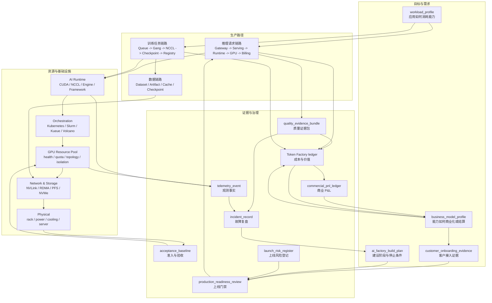

# 系统地图与工程索引

本页不是新的正文层级，而是全书的索引页。它帮助读者按三种方式进入本书：按角色阅读、按工程对象检索、按故障症状定位。AI Factory 的难点不在于名词数量，而在于把应用、平台、模型、运行时、调度、GPU、网络、存储、物理设施、SRE 和经济性连成可验证的生产系统。

## 一张图串起全书

这张图的读法是：需求对象先定义系统要生产什么，生产路径把请求和任务落到运行时与资源池，资源层用准入和观测证明自己可用，SRE 与经济账本再把运行结果反哺到建设计划和商业模式。若某个项目只有中间的 GPU 和 Runtime，而缺少两端的 profile、baseline、telemetry 和 ledger，它还不是完整 AI Factory。

## 按角色阅读

| 读者角色 | 首选入口 | 需要补齐的章节 | 阅读目标 |
| --- | --- | --- | --- |
| 应用工程师 | [第 1 章：从一个 Chat 请求开始](part-01-applications/chapter-01-chat-request.md) | 第 2、3、4、6、7、13、41 章 | 理解 prompt、context、RAG、Agent、质量反馈、token 计量和应用成本如何影响平台设计。 |
| Platform / MaaS 工程师 | [第 5 章：MaaS 平台](part-02-platform/chapter-05-maas.md) | 第 6、7、8、14、15、37、40 章 | 理解 Gateway、租户、路由、限流、计量、模型服务和 SRE 如何形成 API 产品。 |
| 模型与 Runtime 工程师 | [第 15 章：推理引擎](part-04-runtime/chapter-15-inference-engines.md) | 第 9、10、13、14、16、17、18、19 章 | 理解模型结构、训练推理运行时、并行、通信和版本兼容如何影响吞吐、质量和成本。 |
| 调度与 GPU 平台工程师 | [第 20 章：AI Workload 的形态](part-05-orchestration/chapter-20-ai-workloads.md) | 第 21、22、23、24、25、28、38 章 | 理解 AI workload、容器、Kubernetes、Slurm、GPU 资源池、拓扑和准入如何协同。 |
| 网络与存储工程师 | [第 30 章：AI 网络基础](part-07-network-storage/chapter-30-ai-networking-basics.md) | 第 31、32、33、18、38、39 章 | 理解 scale-up/scale-out、RDMA、NCCL、checkpoint、模型权重加载和故障树。 |
| 机房与硬件工程师 | [第 34 章：GPU 服务器](part-08-physical-infrastructure/chapter-34-gpu-server.md) | 第 35、36、28、38、40、41 章 | 理解 GPU server、power、cooling、rack capacity 和 tokens/W 如何变成可交付产能。 |
| SRE / 运维工程师 | [第 37 章：AI Factory 可观测性](part-09-reliability-observability/chapter-37-ai-factory-observability.md) | 第 38、39、40、28、29、41 章 | 理解观测事实、验收基线、故障树、变更和 error budget 如何闭环。 |
| 商业与技术负责人 | [第 41 章：Token Factory 视角](part-10-economics-cases/chapter-41-token-factory.md) | 第 42、43、44、4、7、40 章 | 理解 token、GPU hour、业务结果、SLA、成本、毛利和建设路线如何对齐。 |

## 核心工程对象索引

这些对象是全书逐步沉淀的“事实单元”。它们不是数据库表设计，而是读者做架构评审、故障复盘、上线门禁和成本分析时应该能拿出来的证据。

| 对象 | 解决的问题 | 主要章节 | 连接的后续对象 |
| --- | --- | --- | --- |
| `workload_profile` | 描述应用如何消耗 token、工具、数据和资源。 | 第 4、44 章 | `application_readiness_review`、`business_model_profile`、`production_readiness_review` |
| `application_readiness_review` | 判断行业应用是否具备生产接入条件。 | 第 4 章 | `quality_gate_record`、`data_boundary_policy`、`cost_ledger` |
| `customer_onboarding_evidence` | 证明客户或关键租户的 tenant、项目、API Key、模型访问、预算、SLA、支持和数据边界已准备好。 | 第 4、5、44 章 | `tenant_boundary`、`sla_credit_model`、`production_readiness_review` |
| `business_model_profile` | 描述价值单位、客户承诺、计量和退出责任。 | 第 42 章 | `commercial_readiness_matrix`、`Token Factory ledger` |
| `sla_credit_model` | 把 SLA 指标、排除项、credit 输入、赔付上限和 invoice 动作结构化。 | 第 5、7、40 章 | `sla_operation_record`、`sla_credit_replay`、`reliability_cost_ledger` |
| `private_deployment_acceptance_record` | 记录私有化交付的离线包、版本矩阵、GPU runtime、RAG ACL、升级回滚、诊断包和责任矩阵。 | 第 42、44 章 | `launch_risk_register`、`production_readiness_review` |
| `release_train_record` | 把 baseline、driver、OFED、container runtime、Toolkit、device plugin、base image 和验收脚本组合成可灰度、可回滚的发布列车。 | 第 29、40、44 章 | `change_safety_case`、`baseline_invalidation_record`、`production_readiness_review` |
| `lts_support_policy` | 定义长期支持 baseline、backport、EOL、升级路径和客户通知，防止现场版本无限分叉。 | 第 29、42、44 章 | `release_train_record`、`private_delivery_lifecycle_contract` |
| `support_ticket_taxonomy` | 把客户问题分成 incident、request、problem、change、billing dispute 和 security case，并绑定 owner、时钟和证据。 | 第 40、42、44 章 | `diagnostic_bundle_sla`、`incident_record`、`billing_dispute_replay` |
| `diagnostic_bundle_sla` | 定义不同事故和客户支持场景下诊断包的采集时限、脱敏、导出、客户同意和留存审计。 | 第 37、40、42、44 章 | `support_ticket_taxonomy`、`security_evidence_bundle` |
| `offline_upgrade_rehearsal` | 在私有化或离线环境升级前演练镜像导入、artifact/cache、数据迁移、runtime smoke、回滚和诊断导出。 | 第 33、42、44 章 | `private_deployment_acceptance_record`、`release_train_record` |
| `field_patch_governance` | 约束现场紧急补丁的适用条件、签名 delta、客户审批、过期时间、合回 release train 和成本归因。 | 第 40、42、44 章 | `release_train_record`、`commercial_pnl_ledger` |
| `private_delivery_lifecycle_contract` | 把私有化客户的 release、LTS、支持、离线升级、补丁、EOL 和成本控制写成长期责任对象。 | 第 42、44 章 | `commercial_pnl_ledger`、`production_readiness_review` |
| `commercial_pnl_ledger` | 汇总收入、折扣、SLA credit、支持、私有化交付、预留容量和各类成本账本。 | 第 41、42、44 章 | `business_model_profile`、`launch_risk_register` |
| `launch_risk_register` | 记录上线剩余风险、owner、证据缺口、缓解措施、停止条件和关闭条件。 | 第 44 章 | `production_readiness_review`、`incident_record` |
| `ai_factory_build_plan` | 把建设阶段、证据、owner 和停止条件结构化。 | 第 44 章 | `architecture_decision_record`、`production_readiness_review` |
| `architecture_decision_record` | 记录 GPU、网络、存储、调度、runtime 和商业模式的取舍。 | 第 44 章 | `change_safety_case`、`production_readiness_review` |
| `production_readiness_review` | 聚合资源、模型、平台、安全、SRE 和经济证据，决定是否上线。 | 第 44 章 | `online_experiment_record`、`incident_record` |
| `tenant_boundary` | 定义租户在身份、数据、模型、资源和账单中的边界。 | 第 5、6、27 章 | `policy_decision_record`、`security_audit_event` |
| `tenant_isolation_evidence` | 证明租户隔离在身份、模型目录、资源池、缓存、trace、存储和计量路径中实际生效。 | 第 5、37、44 章 | `policy_decision_record`、`production_readiness_review` |
| `policy_decision_record` | 让 Gateway 的 allow/deny/route/fallback 可回放。 | 第 6 章 | `api_key_audit_event`、`routing_quality_scorecard` |
| `egress_provider_decision` | 记录一次请求是否允许出站到第三方 provider、跨区域 endpoint 或私有 provider，并绑定数据边界和合同。 | 第 6、37、41、44 章 | `policy_decision_record`、`billing_dispute_replay` |
| `prompt_trace_redaction_record` | 记录 prompt、response、RAG chunk 和 tool arguments 在 trace、日志和导出中的脱敏、引用、TTL 和审批。 | 第 8、37、44 章 | `security_evidence_bundle`、`security_audit_event` |
| `secret_boundary_evidence` | 证明 KMS、provider credential、registry token、签名 key、STS token 和 break-glass token 没有越界使用或泄露。 | 第 33、37、41、44 章 | `storage_security_boundary`、`security_cost_ledger` |
| `security_evidence_bundle` | 冻结 key 泄露、provider 越权、trace 泄露、secret 泄露和 denial-of-wallet 所需的跨系统证据。 | 第 37、40、41、44 章 | `security_audit_event`、`billing_dispute_replay` |
| `denial_of_wallet_incident_record` | 记录 stolen key、长上下文攻击、Agent 循环和昂贵 provider 路由造成的成本型事故。 | 第 40、41、44 章 | `abuse_cost_ledger`、`billing_dispute_replay` |
| `billing_dispute_replay` | 把账单争议从 invoice 回放到 metering event、policy decision、served model、价格版本和 hold/correction。 | 第 7、41、44 章 | `tenant_cost_isolation`、`security_cost_ledger` |
| `rag_agent_admission_context` | 把入口身份、数据边界、RAG 范围、工具范围和预算传给下游执行链路。 | 第 6 章 | `retrieval_permission_decision`、`agent_budget_ledger` |
| `retrieval_permission_decision` | 证明 RAG 在当前用户和数据边界下允许或拒绝哪些候选证据。 | 第 2、6 章 | `rag_context_snapshot`、`tool_security_incident_record` |
| `rag_context_snapshot` | 冻结最终进入 prompt 的证据、引用、token 预算、截断和冲突处理。 | 第 2、37 章 | `rag_quality_regression_record`、`quality_evidence_bundle` |
| `rag_quality_regression_record` | 把 RAG 线上失败绑定到权限、context、索引、失败层级和复测门禁。 | 第 2、13 章 | `eval_dataset_lineage_record`、`quality_gate_execution` |
| `tool_side_effect_policy` | 定义 Agent 工具的副作用、幂等、确认、重试、回滚和审计要求。 | 第 3、40 章 | `agent_tool_execution_record`、`tool_security_incident_record` |
| `agent_tool_execution_record` | 记录一次工具调用的意图、策略、执行环境、副作用、输出、成本和回滚。 | 第 3、37 章 | `agent_budget_ledger`、`tool_security_incident_record` |
| `agent_budget_ledger` | 记录 Agent run 的模型、工具、token、沙箱、外部 API、控制动作和成本。 | 第 3、41 章 | `rag_agent_cost_attribution`、`quality_cost_ledger` |
| `rag_agent_evidence_bundle` | 冻结 RAG/Agent 质量或安全事故所需的权限、上下文、工具、预算和审计证据。 | 第 37、40 章 | `quality_incident_record`、`tool_security_incident_record` |
| `routing_quality_decision_record` | 让一次模型路由选择能按质量、SLO、成本、能力和数据边界回放。 | 第 6 章 | `quality_evidence_bundle`、`quality_cost_ledger` |
| `eval_slice_contract` | 把业务任务切片、最低覆盖、硬门禁、owner 和失败后阻断动作写成发布契约。 | 第 13、40、44 章 | `quality_gate_execution`、`online_experiment_guardrail` |
| `eval_dataset_lineage_record` | 记录评测数据版本如何生成、清洗、标注、切片、排污和变更。 | 第 13 章 | `quality_gate_execution`、`production_readiness_review` |
| `golden_set_governance_record` | 证明 golden set、blind holdout、访问、训练排除、overlap scan、样本过期和 judge drift 处于受控状态。 | 第 13、37、40、44 章 | `quality_gate_execution`、`production_readiness_review` |
| `quality_gate_execution` | 记录一次质量门禁执行的输入、环境、结果、豁免和发布动作。 | 第 13、44 章 | `routing_quality_decision_record`、`serving_rollback_record` |
| `online_experiment_guardrail` | 记录线上实验随机化单元、会话粘性、排除范围、护栏指标、停止规则和证据保留动作。 | 第 13、37、40、44 章 | `quality_evidence_bundle`、`quality_cost_ledger` |
| `human_feedback_evidence` | 把用户反馈、CRM、人工接管、专家评审和标注绑定到 trace、task slice、rubric、regression 和成本。 | 第 13、37、41 章 | `quality_regression_record`、`quality_cost_ledger` |
| `serving_quality_contract` | 把 weights、tokenizer、template、engine 和质量门禁绑定。 | 第 14 章 | `runtime_quality_gate`、`quality_regression_record` |
| `serving_rollback_record` | 记录一次回滚触发、范围、组件、证据保留、恢复结果和后续门禁。 | 第 14、40 章 | `quality_regression_record`、`production_readiness_review` |
| `serving_rollback_drill` | 证明高 SLA endpoint 已演练 artifact、runtime、Gateway、cache、drain、计量和质量探针回滚。 | 第 14、40、44 章 | `serving_rollback_record`、`production_readiness_review` |
| `runtime_quality_gate` | 防止推理引擎优化破坏质量、协议或成本。 | 第 15 章 | `serving_quality_contract`、`benchmark_matrix` |
| `endpoint_admission_decision` | 记录 Gateway 对单个请求为什么 admit、shed、fallback、route 或 reject，并绑定 request shape、SLO、budget 和 engine health。 | 第 6、37、39、44 章 | `engine_admission_health`、`inference_runtime_diagnostic_bundle` |
| `engine_admission_health` | 让 Gateway 知道 endpoint 是否还能按 SLO 接收请求。 | 第 6、14、15、37、39 章 | `engine_canary_record`、`incident_record` |
| `kv_block_ledger` | 把 KV block 分配、释放、prefix cache、租户和泄漏成本串起来。 | 第 1、14、15、37、39、41 章 | `Token Factory ledger`、`runtime_quality_gate` |
| `kv_block_leak_forensic_record` | 取证请求关闭后 KV block 是否泄漏、由哪个 allocator/cache/worker/PD session 持有以及影响多少 admission 和成本。 | 第 1、14、37、39、41、44 章 | `kv_block_ledger`、`inference_runtime_cost_ledger` |
| `engine_canary_record` | 记录 engine/runtime 变更的协议、质量、性能、KV 和成本门禁结果。 | 第 14、15、37、39 章 | `serving_quality_contract`、`runtime_quality_gate` |
| `engine_canary_guardrail_action` | 记录 canary 护栏触发后的冻结、降权、关闭 feature、回滚和证据保留动作。 | 第 14、15、37、39、41、44 章 | `engine_canary_record`、`inference_runtime_diagnostic_bundle` |
| `speculative_decoding_regression_record` | 记录 speculative decoding 在真实流量切片上的格式、质量、长度、接受率和成本回归及切片化止血。 | 第 15、37、39、41、44 章 | `speculative_decoding_report`、`runtime_quality_gate` |
| `pd_transfer_evidence` | 证明 PD 分离中 KV transfer 的时延、完整性、租户隔离、重试、失败语义和瓶颈归因。 | 第 14、37、39、41、44 章 | `pd_disaggregation_contract`、`inference_runtime_diagnostic_bundle` |
| `inference_runtime_diagnostic_bundle` | 把 TTFT/TPOT/streaming 事故所需证据冻结成诊断包。 | 第 37、39 章 | `incident_record`、`engine_canary_record` |
| `inference_runtime_cost_ledger` | 把 KV block、draft model、PD transfer、取消浪费和质量成本折算成成功回答成本。 | 第 41 章 | `Token Factory ledger`、`business_model_profile` |
| `TrainingJob` | 描述一次训练任务的模型、数据、并行、调度和恢复语义。 | 第 10、23 章 | `checkpoint_manifest`、`rank_mapping`、`training_roi_ledger` |
| `framework_runtime_matrix` | 记录训练框架、CUDA/NCCL/driver、launcher、checkpoint 和观测能力的受控组合。 | 第 16、23、38、44 章 | `training_runtime_spec`、`training_communication_acceptance_matrix` |
| `training_runtime_spec` | 记录单个训练任务实际使用的 runtime 矩阵、镜像、精度、分布式策略和 checkpoint 配置。 | 第 16、37、39 章 | `framework_runtime_matrix`、`training_debug_bundle` |
| `parallelism_plan_record` | 记录并行维度、batch、显存、通信、checkpoint 和拓扑意图的生产计划。 | 第 17、23、37、39、41、44 章 | `rank_topology_contract`、`placement_commit_record` |
| `rank_topology_contract` | 定义 rank 放置、GPU/NIC/RDMA、rail 和故障域的 hard/soft 约束及违反动作。 | 第 17、23、37、39、44 章 | `placement_commit_record`、`gpu_nic_topology_evidence` |
| `training_lifecycle_event` | 把训练作业从提交到 first effective step、checkpoint、恢复和完成串成阶段事实。 | 第 23、37、41 章 | `training_lifecycle_telemetry_event`、`training_roi_ledger` |
| `placement_commit_record` | 记录并行拓扑意图、实际放置、降级原因和 rank mapping。 | 第 17、23、37、39、41 章 | `rank_mapping`、`training_incident_record` |
| `nccl_env_contract` | 定义 NCCL 版本、接口选择、RDMA 设备、timeout、debug 和拓扑文件的受控策略。 | 第 18、23、37、39、44 章 | `collective_trace_record`、`communication_regression_record` |
| `collective_trace_record` | 摘要真实训练窗口中的 collective op、rank group、耗时、等待关系和 critical path 状态。 | 第 18、37、39、41、44 章 | `communication_critical_path_record`、`training_debug_bundle` |
| `communication_critical_path_record` | 证明通信等待是否暴露在训练 step 关键路径并造成 GPU idle。 | 第 18、37、39、41 章 | `training_roi_ledger`、`network_cost_ledger` |
| `communication_regression_record` | 记录 NCCL/OFED/fabric/runtime/调度变更后的通信回归和代表性训练结果。 | 第 18、32、37、38、39、44 章 | `fabric_change_record`、`production_readiness_review` |
| `checkpoint_overlap_evidence` | 记录 checkpoint 窗口与 collective、存储、数据读取的重叠和成本影响。 | 第 18、37、38、39、41、44 章 | `storage_evidence`、`training_roi_ledger` |
| `training_communication_acceptance_matrix` | 组合验证训练 runtime、并行拓扑、NCCL、fabric、collective trace 和 checkpoint overlap。 | 第 38、44 章 | `acceptance_baseline`、`production_readiness_review` |
| `training_debug_bundle` | 冻结训练 runtime、并行、调度、通信、checkpoint、数据和成本影响证据。 | 第 39 章 | `training_incident_record`、`reliability_evidence_bundle` |
| `queue_fairness_ledger` | 把 guaranteed、borrowed、lent、preempted、starved 和 effective GPU hours 串成队列公平账本。 | 第 23、41 章 | `training_roi_ledger`、`capacity_activation_review` |
| `preemption_record` | 记录一次抢占的 safe point、checkpoint、释放资源、恢复和浪费 GPU 小时。 | 第 23、41 章 | `queue_fairness_ledger`、`training_roi_ledger` |
| `training_accounting_reconciliation` | 对齐 Slurm、Kubernetes、训练框架和成本系统的 GPU 小时口径。 | 第 24、41 章 | `training_roi_ledger`、`Token Factory ledger` |
| `training_incident_record` | 把训练事故回指 admission、placement、rank、checkpoint、健康和成本影响。 | 第 39、41 章 | `incident_record`、`training_roi_ledger` |
| `dataset_manifest` | 固定数据处理、shard、采样、权限和缓存策略。 | 第 10、20、33 章 | `workload_storage_intent`、`storage_evidence` |
| `dataset_lineage_record` | 记录训练数据如何从原始来源经过清洗、过滤、tokenization、sharding、删除请求和治理动作生成 manifest。 | 第 10、33、38 章 | `model_artifact_provenance`、`supply_chain_acceptance_matrix` |
| `workload_storage_intent` | 让 workload 在 admission 前声明数据、checkpoint、artifact、cache 和观测需求。 | 第 20、33、37 章 | `storage_acceptance_matrix`、`storage_evidence` |
| `checkpoint_manifest` | 证明 checkpoint 分片、状态和恢复候选有效。 | 第 10、33 章 | `checkpoint_commit_record`、`storage_evidence` |
| `checkpoint_commit_record` | 记录 checkpoint 写入、校验、latest 指针和恢复门禁。 | 第 10、33、41 章 | `training_roi_ledger`、`storage_cost_ledger` |
| `checkpoint_restore_drill` | 用真实镜像、并行配置、reader 版本和短窗口训练证明 checkpoint 能恢复，而不是只证明目录存在。 | 第 10、38、39 章 | `model_artifact_provenance`、`production_readiness_review` |
| `model_artifact_provenance` | 证明线上产物来自哪个 checkpoint、adapter、tokenizer、template、转换工具、评测门禁和签名流程。 | 第 14、33、38 章 | `serving_quality_contract`、`cache_invalidation_record` |
| `model_artifact_distribution` | 绑定权重、tokenizer、template、digest、预热和回滚对象。 | 第 14、33 章 | `cache_residency`、`serving_quality_contract` |
| `cache_residency` | 描述模型或数据在 node/rack/pool 的缓存状态。 | 第 14、33、41 章 | `storage_evidence`、`storage_cost_ledger` |
| `cache_invalidation_record` | 记录模型、tokenizer、template、RAG 索引或数据缓存为何失效、影响哪些节点、如何阻断复用和重新预热。 | 第 14、33、38、39 章 | `storage_evidence`、`production_readiness_review` |
| `storage_security_boundary` | 定义训练数据、checkpoint、模型权重、adapter、日志和 trace 的命名空间、权限、加密、审计、导出和删除边界。 | 第 33、37、38、41 章 | `security_audit_event`、`supply_chain_acceptance_matrix` |
| `supply_chain_acceptance_matrix` | 验证数据 lineage、checkpoint restore、模型 provenance、缓存撤销和存储安全边界是否满足生产门禁。 | 第 38、44 章 | `production_readiness_review`、`storage_cost_ledger` |
| `network_path_evidence` | 把 job/request 映射到 GPU、NIC、rail、switch port 和 baseline。 | 第 30、32、37 章 | `network_diagnostic_bundle`、`fabric_baseline` |
| `rail_balance_report` | 证明多 rail 设计在真实 rank 和端口流量中被正确使用。 | 第 32、37、38 章 | `fabric_change_record`、`network_cost_ledger` |
| `congestion_event_record` | 把 ECN/PFC、队列、水位、流量类别和 workload 影响串成拥塞证据。 | 第 30、37、39 章 | `network_diagnostic_bundle`、`incident_record` |
| `storage_evidence` | 把 dataset、checkpoint、artifact、cache、backend 和 workload impact 证据串起来。 | 第 33、37、39、41 章 | `storage_acceptance_matrix`、`storage_cost_ledger` |
| `resource_health_record` | 把 GPU、node、fabric、storage 健康信号转成资源池状态。 | 第 28、37 章 | `maintenance_window`、`security_audit_event` |
| `gpu_container_runtime_report` | 证明 driver、Toolkit、RuntimeClass/CDI、device plugin 和容器内设备可见性一致。 | 第 21、22、29、38 章 | `gpu_assignment_record`、`acceptance_baseline` |
| `oci_runtime_injection_diff` | 记录 NVIDIA runtime、CDI 或 NRI 对 OCI spec 的设备、mount、env、hook 和 cgroup 变更。 | 第 21、38、39 章 | `gpu_device_visibility_reconciliation`、`container_runtime_change_record` |
| `gpu_device_visibility_reconciliation` | 对账 kubelet/device plugin 分配、runtime 注入和容器内实际可见 GPU/MIG。 | 第 21、22、38、39 章 | `container_gpu_runtime_acceptance_matrix`、`production_readiness_review` |
| `gpu_nic_topology_evidence` | 把实际运行中的 GPU、NUMA、RDMA NIC、rail、NCCL interface 和 switch port 绑定到 workload。 | 第 22、38、39 章 | `network_diagnostic_bundle`、`reliability_cost_ledger` |
| `container_runtime_change_record` | 记录 containerd/runc/Toolkit/CDI/NRI/device plugin strategy 变更及其复测、停止和回滚条件。 | 第 40、44 章 | `baseline_invalidation_record`、`reliability_cost_ledger` |
| `acceptance_baseline` | 证明资源进入生产池前通过准入，并可用于后续异常对比。 | 第 38 章 | `production_readiness_review`、`baseline_invalidation_policy` |
| `baseline_invalidation_record` | 记录某次变更、维修或事故让哪些 baseline 失效，资源池如何降级以及如何复测恢复。 | 第 38、44 章 | `change_safety_case`、`capacity_activation_record`、`production_readiness_review` |
| `reliability_evidence_bundle` | 在事故触发时冻结跨层证据，避免 Pod、端口计数、日志和缓存状态消失后无法复盘。 | 第 37、39 章 | `incident_record`、`slo_budget_ledger`、`reliability_cost_ledger` |
| `quality_evidence_bundle` | 在质量退化触发时冻结反馈、路由、门禁、serving、评测 lineage、回滚和影响证据。 | 第 37、40 章 | `quality_cost_ledger`、`incident_record`、`production_readiness_review` |
| `tool_security_incident_record` | 记录 RAG/Agent 高风险工具、越权、敏感数据或 denial-of-wallet 安全事件。 | 第 40 章 | `security_audit_event`、`production_readiness_review` |
| `incident_record` | 记录事故时间线、影响面、根因证据、止血动作和行动项。 | 第 39、40 章 | `slo_budget_ledger`、`reliability_cost` |
| `gpu_generation_readiness_gate` | 判断新 GPU 或新系统形态是否能进入指定生产等级。 | 第 35、44 章 | `gpu_capability_scorecard`、`production_readiness_review` |
| `capacity_derating_record` | 记录 power/cooling/thermal 约束导致的临时产能降额、调度限制和复测条件。 | 第 34、36、38、40、41、44 章 | `rack_capacity_unit`、`energy_ledger` |
| `cooling_degradation_record` | 记录 cooling domain 退化、液冷/风冷信号、GPU 降频、workload 影响和恢复复测。 | 第 36、40、41、44 章 | `capacity_derating_record`、`reliability_cost_ledger` |
| `capacity_activation_record` | 把 planned、installed、accepted、allocatable 和 workload-fit 产能及受限原因写成投产事实。 | 第 36、40、41 章 | `capacity_activation_review`、`reliability_cost_ledger` |
| `reliability_cost_ledger` | 把事故、SLO 预算、基线失效、容量延迟和预防成本折算进成功 token 成本。 | 第 41 章 | `Token Factory ledger`、`production_readiness_review` |
| `rag_agent_cost_attribution` | 把 RAG 检索/重排/context 和 Agent 工具/沙箱/外部 API 成本归到成功任务。 | 第 41 章 | `Token Factory ledger`、`business_model_profile` |
| `Token Factory ledger` | 把 token、GPU、能耗、质量、安全、可靠性和收入放到同一账本。 | 第 41 章 | `business_model_profile`、`capacity_activation_review` |

## 按故障症状进入

| 症状 | 先看章节 | 要找的证据 | 常见下一步 |
| --- | --- | --- | --- |
| Chat 首 token 慢 | 第 1、6、14、15 章 | request trace、endpoint_admission_decision、engine_admission_health、prefill time、KV cache pressure | 回放 Gateway 接入决策，分离 Gateway 排队、serving 队列、prefill 资源、KV block 和 runtime admission。 |
| TPOT 变慢或 streaming 断续 | 第 1、14、15、37、39 章 | decode batch、active sequence、kv_block_ledger、engine_canary_record、inference_runtime_diagnostic_bundle | 区分 decode 拥塞、KV block 压力、engine 变更、PD transfer、网关背压和客户端取消。 |
| 客户端取消后 GPU/HBM 仍被占用 | 第 1、14、15、37、39、41 章 | kv_block_ledger、kv_block_leak_forensic_record、streaming close event、metering close event | 对账 Gateway、model server、engine close event，定位 allocator、prefix cache、decode worker 或 PD session 泄漏，并折算 block 秒成本。 |
| PD 分离上线后 TTFT 长尾变差 | 第 14、15、37、39、44 章 | pd_disaggregation_contract、pd_transfer_evidence、endpoint_admission_decision、engine_admission_health | 判断慢在 prefill queue、KV transfer、decode admission 还是容量比例，必要时切回 monolithic endpoint。 |
| Speculative decoding 开启后格式/成本回归 | 第 15、37、39、41、44 章 | speculative_decoding_report、speculative_decoding_regression_record、engine_canary_guardrail_action、quality_cost_ledger | 按 workload slice 关闭 speculative、更新 runtime gate，并计算 draft overhead、质量回归和 prevention cost。 |
| Engine canary 触发但影响面不清 | 第 14、15、37、39、41、44 章 | engine_canary_record、engine_canary_guardrail_action、endpoint_admission_decision、inference_runtime_cost_ledger | 检查是否冻结放量、降权、回滚或关闭 feature，并确认动作是否恢复 SLO 与成本。 |
| output token 便宜但用户不满意 | 第 1、13、14、41 章 | quality_feedback_event、quality_regression_record、quality_cost_ledger | 用 cost per successful answer 替代原始 cost/token 做决策。 |
| 模型上线后质量退化 | 第 6、13、14、37、40、41 章 | quality_gate_execution、eval_slice_contract、golden_set_governance_record、serving_quality_contract、quality_evidence_bundle、quality_cost_ledger | 先冻结质量证据，再判断是评测覆盖不足、golden set 失效、serving 组合漂移、路由策略变化、RAG/Agent 依赖变化还是模型本身退化。 |
| A/B 结果争议 | 第 6、13、14、37、40 章 | online_experiment_record、online_experiment_guardrail、routing_quality_decision_record、quality_gate_execution、randomization unit | 检查随机化单元、会话粘性、排除范围、护栏指标、停止规则、统计窗口和是否混入 fallback 流量。 |
| 便宜模型导致人工接管上升 | 第 6、7、13、37、41 章 | routing_quality_decision_record、routing_quality_scorecard、human_feedback_evidence、quality_cost_ledger | 按 task slice 计算 cost per successful answer，必要时调整路由权重、capability gate 或商业定价。 |
| 回滚后仍未恢复质量 | 第 14、37、39、40、44 章 | serving_rollback_record、serving_rollback_drill、serving_quality_contract、quality_evidence_bundle、release diff、Gateway route | 检查是否只回滚权重但未回滚 tokenizer、template、engine config、RAG 索引、tool policy 或 Gateway route，并确认回滚演练是否覆盖目标组件。 |
| RAG 答案引用错 | 第 2、4、13、37 章 | retrieval_permission_decision、rag_context_snapshot、rag_quality_regression_record、eval_dataset_lineage_record | 分解为文档权限、chunk、rerank、context 拼接、证据冲突和生成忠实性问题。 |
| RAG 检索越权或证据泄露 | 第 2、5、6、37、40 章 | retrieval_permission_decision、data_boundary_policy、rag_agent_evidence_bundle、tool_security_incident_record | 先冻结证据并阻断相关索引/缓存，再回放 ACL、日志脱敏、rerank 输入和评测样本流向。 |
| Agent 工具越权或重复副作用 | 第 3、5、6、37、40 章 | tool_side_effect_policy、agent_tool_execution_record、policy_decision_record、tool_security_incident_record | 冻结高风险工具、检查幂等键和审批链路，必要时回滚外部状态并更新工具策略。 |
| Agent 任务成本失控 | 第 3、6、37、41 章 | agent_budget_ledger、agent_tool_execution_record、rag_agent_cost_attribution、quality_cost_ledger | 加最大步数、预算、人工接管和任务级计费，并定位是规划循环、工具失败、context 膨胀还是外部 API 成本。 |
| Agent 完成任务但轨迹不可接受 | 第 3、13、37、40、41 章 | agent_trajectory_record、agent_tool_execution_record、agent_budget_ledger、quality_gate_execution | 比较轨迹效率、安全边界和每成功任务成本，不只看最终成功率。 |
| 训练任务长期 pending | 第 20、23、24、28 章 | pending reason、job_admission_event、queue_fairness_ledger、quota、gang、topology | 区分配额不足、拓扑不可满足、借用策略、镜像/数据预检失败和资源池状态问题。 |
| GPU 空闲但任务启动不了 | 第 22、23、28、31、32 章 | gpu_assignment_record、NUMA/NIC topology、queue policy、fragmentation | 检查拓扑碎片、MIG/整卡边界、RDMA device 和 gang scheduling。 |
| NCCL hang | 第 17、18、32、38、39 章 | framework_runtime_matrix、parallelism_plan_record、rank_topology_contract、placement_commit_record、nccl_env_contract、collective_trace_record、communication_critical_path_record、RDMA counters、fabric baseline、rail_balance_report | 先确定 rank 退出、collective mismatch、放置降级、NCCL 环境漂移、GPU/NVLink、RDMA/fabric、rail 失衡、checkpoint overlap 或容器 runtime。 |
| 分布式训练 step time 周期性尖刺 | 第 18、33、37、39、41 章 | collective_trace_record、communication_critical_path_record、checkpoint_overlap_evidence、checkpoint_commit_record、storage_evidence | 先判断尖刺是否只发生在 checkpoint 窗口，再决定进入存储、通信、runtime 或并行策略分支。 |
| 训练 loss spike 但数据不可追溯 | 第 10、13、33、39 章 | dataset_lineage_record、dataset_manifest、shard checksum、tokenizer、data loader telemetry | 先把异常 step/rank/shard 追到数据来源和处理版本，再判断是数据分布、tokenization、采样权重、模型变更还是 runtime 问题。 |
| checkpoint 很慢 | 第 10、33、37、39 章 | checkpoint_manifest、checkpoint_commit_record、storage_evidence、backend telemetry、GPU idle | 区分 rank 写入长尾、manifest commit、metadata、并行文件系统、对象存储和网络重叠。 |
| checkpoint 存在但恢复失败 | 第 10、33、38、39 章 | checkpoint_manifest、checkpoint_commit_record、checkpoint_restore_drill、image/runtime version、dataloader state | 检查 rank 分片、optimizer/scheduler/rng、reader 版本、world size、权限和 restore drill，失败前不要删除更早健康 checkpoint。 |
| 模型产物来源无法证明 | 第 13、14、33、38、44 章 | model_artifact_provenance、quality_gate_execution、dataset_lineage_record、checkpoint_restore_drill、signature | 阻止进入高价值租户或商业化发布，补齐 checkpoint、转换、评测、签名和发布证据。 |
| 模型服务加载旧权重 | 第 14、33、37、39 章 | model_artifact_distribution、cache_residency、cache_invalidation_record、serving_rollback_record、node cache state | 区分 registry 指针、节点缓存、RuntimeClass、启动脚本和 Gateway 路由，必要时阻断调度到 invalid cache 节点。 |
| 模型冷启动慢 | 第 14、15、33、41 章 | model_artifact_distribution、cache_residency、storage_evidence、load time、storage_cost_ledger | 优化权重分发、预热、缓存驻留、调度放置和多模型路由。 |
| 缓存撤销后仍被调度使用 | 第 14、33、38、39、44 章 | cache_invalidation_record、cache_residency、scheduler placement、serving release、storage_security_boundary | 检查失效事件是否进入调度和 autoscaler，确认旧 cache 从 ready 变成 invalid 并完成替代版本预热。 |
| 容器里看不到 GPU 或看到错误 GPU | 第 19、21、22、29、38 章 | runtime_privilege_profile、device plugin state、RuntimeClass/CDI、oci_runtime_injection_diff、gpu_device_visibility_reconciliation | 区分 Kubernetes 分配、OCI runtime 注入、CDI spec、driver/library mount、镜像环境变量和容器权限。 |
| 容器里 RDMA 不通 | 第 22、32、38 章 | RDMA device、CNI、NUMA、container smoke test、gpu_nic_topology_evidence、fabric baseline | 宿主机 RDMA 正常不代表容器内 RDMA 可用，先对账 GPU/NIC/NUMA/NCCL interface，再进入 fabric 分支。 |
| GPU 降频或 tokens/W 下降 | 第 34、35、36、38、41 章 | power_thermal_envelope、capacity_derating_record、cooling_degradation_record、rack_capacity_unit、energy_ledger | 检查 power、cooling、液冷、机柜降额、GPU throttle、调度限制和有效 token 产出。 |
| 新 GPU 上线后收益不达预期 | 第 35、38、41、44 章 | gpu_capability_scorecard、gpu_generation_readiness_gate、energy_ledger、quality_gate_execution、runtime baseline | 区分硬件潜力、runtime 未适配、质量门禁、power/thermal 约束和流量形态问题。 |
| 网络退化导致 GPU 空转 | 第 18、30、32、37、39、41 章 | network_path_evidence、congestion_event_record、rail_balance_report、network_cost_ledger | 先量化 exposed communication time 和 idle GPU hours，再决定隔离、避让、限流或扩容。 |
| 变更后随机故障 | 第 29、37、38、39、40 章 | change_safety_case、baseline_invalidation_record、reliability_evidence_bundle、recent changes | 检查变更是否失效了准入基线、资源池是否降级、复测是否覆盖真实 workload。 |
| 扩容后产能没增长 | 第 28、36、38、40、41 章 | capacity_activation_record、rack_capacity_unit、physical/fabric/storage acceptance、workload-fit capacity | 区分 installed、accepted、allocatable 和 workload-fit GPU，定位 power、cooling、fabric、storage 或 baseline 失效限制。 |
| 上线评审证据不足 | 第 38、40、41、44 章 | production_readiness_review、baseline_invalidation_record、slo_budget_ledger、reliability_cost_ledger | 证据缺口应 block 或 conditional approve，不能靠口头承诺上线。 |
| API Key 泄露或异常消费 | 第 5、6、37、40、41、44 章 | credential_lifecycle、api_key_audit_event、security_evidence_bundle、denial_of_wallet_incident_record、abuse_cost_ledger | 先吊销或轮换凭据并标记 billing hold，再判断是用户泄露、平台策略缺口还是滥用攻击。 |
| 第三方 provider 越权路由 | 第 5、6、37、40、41、44 章 | egress_provider_decision、policy_decision_record、data_boundary_policy、provider_contract、security_evidence_bundle | 阻断 provider route，回放数据边界和合同，评估数据暴露、成本和账单修正。 |
| Trace 或日志疑似泄露敏感 prompt | 第 6、8、33、37、40、44 章 | prompt_trace_redaction_record、security_audit_event、data_boundary_policy、secret_boundary_evidence | 冻结导出权限，确认脱敏和 TTL，评估导出范围并更新观测审批。 |
| 账单争议 | 第 5、6、7、41、42 章 | billing_dispute_replay、tenant_cost_isolation、policy_decision_record、metering event、business_model_profile | 区分失败是否计费、streaming 中断、免费额度、租户归属、provider 路由、security hold 和合约边界。 |
| 客户上线后承诺无法兑现 | 第 4、5、40、42、44 章 | customer_onboarding_evidence、tenant_boundary、sla_credit_model、launch_risk_register、production_readiness_review | 检查客户、租户、模型访问、预算、支持、SLA 和数据边界是否真的完成接入；缺证据时应暂停放量。 |
| SLA 赔付争议 | 第 5、7、37、40、41、44 章 | sla_credit_model、sla_operation_record、sla_credit_replay、reliability_evidence_bundle、billing_dispute_replay | 回放事故窗口、排除项、受影响 usage 和 invoice line，把赔付写入可靠性成本和商业 P&L。 |
| 私有化交付无法升级 | 第 4、29、33、37、40、42、43、44 章 | private_deployment_acceptance_record、release_train_record、lts_support_policy、offline_upgrade_rehearsal、diagnostic_bundle_sla、field_patch_governance、PRR | 将客户差异收敛到配置和集成层，先复核 release train、LTS、离线升级演练、诊断导出和现场补丁是否受控，再决定升级、回滚或停止支持。 |
| 客户 Sev1 工单证据收集过慢 | 第 37、40、42、44 章 | support_ticket_taxonomy、diagnostic_bundle_sla、reliability_evidence_bundle、security_evidence_bundle、customer_onboarding_evidence | 先按 taxonomy 确定时钟和 owner，自动冻结脱敏诊断包；缺少 bundle SLA 时，暂停扩大客户承诺并补齐支持流程。 |
| 现场紧急补丁越积越多 | 第 29、40、42、44 章 | field_patch_governance、release_train_record、lts_support_policy、commercial_pnl_ledger、private_delivery_lifecycle_contract | 检查补丁是否有过期、合回、backport 决策和支持成本归因；不能合回的补丁应触发商业边界复审。 |
| 商业毛利与技术指标矛盾 | 第 7、40、41、42、43、44 章 | commercial_pnl_ledger、Token Factory ledger、quality/reliability/security cost ledger、sla_credit_replay、case_study_evidence_pack | 拆分收入、折扣、SLA credit、支持、私有化交付、预留容量和事故成本，避免只看 cost/token 或 GPU 利用率。 |

## 核心链路索引

| 链路 | 覆盖页面 | 判断是否读懂的标准 |
| --- | --- | --- |
| 推理请求链路 | 第 1、6、8、14、15、37、39、41 章 | 能从用户请求追到 token 计量、runtime admission、KV block、engine canary、PD 分离、GPU/HBM、streaming、诊断包和毛利。 |
| 训练任务链路 | 第 10、17、18、23、24、33、37、38、39、41 章 | 能从任务提交追到 admission、queue fairness、placement commit、rank mapping、NCCL、checkpoint、抢占恢复、incident、评测和训练 ROI。 |
| GPU 容器链路 | 第 19、21、22、29、38 章 | 能解释 device plugin、CRI、OCI runtime、NVIDIA Container Toolkit、driver/library 注入和容器 smoke test。 |
| 网络通信链路 | 第 18、30、31、32、37、38、39、41 章 | 能从 NCCL 性能症状追到 GPU/NIC/rail/switch telemetry、fabric baseline、拥塞事件和成本影响。 |
| 存储数据链路 | 第 10、14、20、33、37、38、39、41 章 | 能从 GPU idle、checkpoint 慢、冷启动慢追到 storage intent、dataset manifest、checkpoint commit、artifact distribution、cache residency、backend telemetry 和成本。 |
| 数据/模型产物供应链链路 | 第 10、14、33、37、38、39、41、44 章 | 能从训练数据来源追到 dataset lineage、checkpoint restore、artifact provenance、cache residency、cache invalidation、storage security boundary、PRR 和供应链成本。 |
| 可靠性链路 | 第 28、29、36、37、38、39、40、41、44 章 | 能把 health、maintenance、baseline invalidation、change、fault domain、evidence bundle、incident、error budget、capacity activation、PRR 和经济损失串起来。 |
| 安全多租户链路 | 第 5、6、7、8、21、22、27、28、33、37、40、41、44 章 | 能从 API Key、策略决策和数据边界追到 tenant isolation evidence、provider 外联决策、trace 脱敏、secret 边界、安全证据包、denial-of-wallet、账单争议回放和 secure cost/token。 |
| 质量与发布链路 | 第 6、13、14、37、40、41、44 章 | 能从线上质量退化追到 eval dataset lineage、quality gate execution、routing decision、serving contract、evidence bundle、rollback record、quality cost ledger 和 PRR。 |
| RAG/Agent 生产控制链路 | 第 2、3、5、6、13、37、40、41、44 章 | 能从用户任务追到 admission context、检索权限、context 快照、工具副作用策略、工具执行记录、预算账本、证据包、安全事故、成本归因和 PRR。 |
| 行业建设链路 | 第 4、42、43、44 章 | 能把应用想法转成 profile、商业模式、案例诊断、建设计划、ADR、质量门禁和 PRR。 |

## 使用方法

遇到一个问题时，先不要直接跳到最熟悉的层。先判断它是用户体验问题、任务调度问题、资源健康问题、质量问题、安全问题还是经济问题，再用上面的故障索引找到证据对象。AI Factory 的很多问题会跨层传播：一次 TTFT 异常可能来自 Gateway、prefill、KV Cache、GPU 降频或资源池排队；一次成本异常可能来自低质量重试、Agent 工具循环、cache miss 或商业定价错误。

做架构评审时，可以从 `workload_profile` 和 `business_model_profile` 开始。若这两个对象不清楚，后面的 GPU、网络、存储、调度和 runtime 选择都缺少目标函数。做上线评审时，从 `production_readiness_review` 开始，检查它是否引用了真实 baseline、quality gate、security boundary、runbook 和 cost ledger。做事故复盘时，从 `incident_record` 开始，检查它是否能回指 request/job、resource health、change、baseline 和经济影响。

## 小结

- 本书的核心不是章节顺序，而是跨层证据链。
- 工程对象让应用、平台、基础设施、SRE 和经济性使用同一套事实。
- 故障定位应从症状进入，再沿对象和链路查证，避免直接归因给 GPU、模型或网络。
- 后续扩写会继续补强这些索引，让读者能按问题而不是按目录使用本书。
