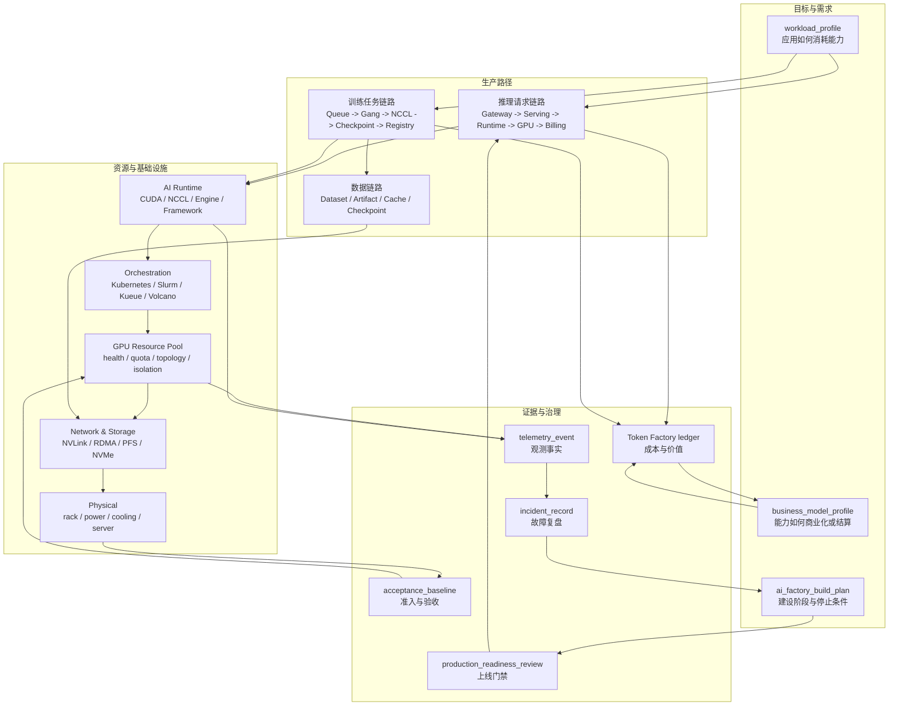

# 系统地图与工程索引

本页不是新的正文层级，而是全书的索引页。它帮助读者按三种方式进入本书：按角色阅读、按工程对象检索、按故障症状定位。AI Factory 的难点不在于名词数量，而在于把应用、平台、模型、运行时、调度、GPU、网络、存储、物理设施、SRE 和经济性连成可验证的生产系统。

## 一张图串起全书

这张图的读法是：需求对象先定义系统要生产什么，生产路径把请求和任务落到运行时与资源池，资源层用准入和观测证明自己可用，SRE 与经济账本再把运行结果反哺到建设计划和商业模式。若某个项目只有中间的 GPU 和 Runtime，而缺少两端的 profile、baseline、telemetry 和 ledger，它还不是完整 AI Factory。

## 按角色阅读

| 读者角色 | 首选入口 | 需要补齐的章节 | 阅读目标 |
| --- | --- | --- | --- |
| 应用工程师 | [第 1 章：从一个 Chat 请求开始](part-01-applications/chapter-01-chat-request.md) | 第 2、3、4、6、7、13、41 章 | 理解 prompt、context、RAG、Agent、质量反馈、token 计量和应用成本如何影响平台设计。 |
| Platform / MaaS 工程师 | [第 5 章：MaaS 平台](part-02-platform/chapter-05-maas.md) | 第 6、7、8、14、15、37、40 章 | 理解 Gateway、租户、路由、限流、计量、模型服务和 SRE 如何形成 API 产品。 |
| 模型与 Runtime 工程师 | [第 15 章：推理引擎](part-04-runtime/chapter-15-inference-engines.md) | 第 9、10、13、14、16、17、18、19 章 | 理解模型结构、训练推理运行时、并行、通信和版本兼容如何影响吞吐、质量和成本。 |
| 调度与 GPU 平台工程师 | [第 20 章：AI Workload 的形态](part-05-orchestration/chapter-20-ai-workloads.md) | 第 21、22、23、24、25、28、38 章 | 理解 AI workload、容器、Kubernetes、Slurm、GPU 资源池、拓扑和准入如何协同。 |
| 网络与存储工程师 | [第 30 章：AI 网络基础](part-07-network-storage/chapter-30-ai-networking-basics.md) | 第 31、32、33、18、38、39 章 | 理解 scale-up/scale-out、RDMA、NCCL、checkpoint、模型权重加载和故障树。 |
| 机房与硬件工程师 | [第 34 章：GPU 服务器](part-08-physical-infrastructure/chapter-34-gpu-server.md) | 第 35、36、28、38、40、41 章 | 理解 GPU server、power、cooling、rack capacity 和 tokens/W 如何变成可交付产能。 |
| SRE / 运维工程师 | [第 37 章：AI Factory 可观测性](part-09-reliability-observability/chapter-37-ai-factory-observability.md) | 第 38、39、40、28、29、41 章 | 理解观测事实、验收基线、故障树、变更和 error budget 如何闭环。 |
| 商业与技术负责人 | [第 41 章：Token Factory 视角](part-10-economics-cases/chapter-41-token-factory.md) | 第 42、43、44、4、7、40 章 | 理解 token、GPU hour、业务结果、SLA、成本、毛利和建设路线如何对齐。 |

## 核心工程对象索引

这些对象是全书逐步沉淀的“事实单元”。它们不是数据库表设计，而是读者做架构评审、故障复盘、上线门禁和成本分析时应该能拿出来的证据。

| 对象 | 解决的问题 | 主要章节 | 连接的后续对象 |
| --- | --- | --- | --- |
| `workload_profile` | 描述应用如何消耗 token、工具、数据和资源。 | 第 4、44 章 | `application_readiness_review`、`business_model_profile`、`production_readiness_review` |
| `application_readiness_review` | 判断行业应用是否具备生产接入条件。 | 第 4 章 | `quality_gate_record`、`data_boundary_policy`、`cost_ledger` |
| `business_model_profile` | 描述价值单位、客户承诺、计量和退出责任。 | 第 42 章 | `commercial_readiness_matrix`、`Token Factory ledger` |
| `ai_factory_build_plan` | 把建设阶段、证据、owner 和停止条件结构化。 | 第 44 章 | `architecture_decision_record`、`production_readiness_review` |
| `architecture_decision_record` | 记录 GPU、网络、存储、调度、runtime 和商业模式的取舍。 | 第 44 章 | `change_safety_case`、`production_readiness_review` |
| `production_readiness_review` | 聚合资源、模型、平台、安全、SRE 和经济证据，决定是否上线。 | 第 44 章 | `online_experiment_record`、`incident_record` |
| `tenant_boundary` | 定义租户在身份、数据、模型、资源和账单中的边界。 | 第 5、6、27 章 | `policy_decision_record`、`security_audit_event` |
| `policy_decision_record` | 让 Gateway 的 allow/deny/route/fallback 可回放。 | 第 6 章 | `api_key_audit_event`、`routing_quality_scorecard` |
| `serving_quality_contract` | 把 weights、tokenizer、template、engine 和质量门禁绑定。 | 第 14 章 | `runtime_quality_gate`、`quality_regression_record` |
| `runtime_quality_gate` | 防止推理引擎优化破坏质量、协议或成本。 | 第 15 章 | `serving_quality_contract`、`benchmark_matrix` |
| `engine_admission_health` | 让 Gateway 知道 endpoint 是否还能按 SLO 接收请求。 | 第 6、14、15、37、39 章 | `engine_canary_record`、`incident_record` |
| `kv_block_ledger` | 把 KV block 分配、释放、prefix cache、租户和泄漏成本串起来。 | 第 1、14、15、37、39、41 章 | `Token Factory ledger`、`runtime_quality_gate` |
| `engine_canary_record` | 记录 engine/runtime 变更的协议、质量、性能、KV 和成本门禁结果。 | 第 14、15、37、39 章 | `serving_quality_contract`、`runtime_quality_gate` |
| `inference_runtime_diagnostic_bundle` | 把 TTFT/TPOT/streaming 事故所需证据冻结成诊断包。 | 第 37、39 章 | `incident_record`、`engine_canary_record` |
| `inference_runtime_cost_ledger` | 把 KV block、draft model、PD transfer、取消浪费和质量成本折算成成功回答成本。 | 第 41 章 | `Token Factory ledger`、`business_model_profile` |
| `TrainingJob` | 描述一次训练任务的模型、数据、并行、调度和恢复语义。 | 第 10、23 章 | `checkpoint_manifest`、`rank_mapping`、`training_roi_ledger` |
| `training_lifecycle_event` | 把训练作业从提交到 first effective step、checkpoint、恢复和完成串成阶段事实。 | 第 23、37、41 章 | `training_lifecycle_telemetry_event`、`training_roi_ledger` |
| `placement_commit_record` | 记录并行拓扑意图、实际放置、降级原因和 rank mapping。 | 第 17、23、37、39、41 章 | `rank_mapping`、`training_incident_record` |
| `queue_fairness_ledger` | 把 guaranteed、borrowed、lent、preempted、starved 和 effective GPU hours 串成队列公平账本。 | 第 23、41 章 | `training_roi_ledger`、`capacity_activation_review` |
| `preemption_record` | 记录一次抢占的 safe point、checkpoint、释放资源、恢复和浪费 GPU 小时。 | 第 23、41 章 | `queue_fairness_ledger`、`training_roi_ledger` |
| `training_accounting_reconciliation` | 对齐 Slurm、Kubernetes、训练框架和成本系统的 GPU 小时口径。 | 第 24、41 章 | `training_roi_ledger`、`Token Factory ledger` |
| `training_incident_record` | 把训练事故回指 admission、placement、rank、checkpoint、健康和成本影响。 | 第 39、41 章 | `incident_record`、`training_roi_ledger` |
| `dataset_manifest` | 固定数据处理、shard、采样、权限和缓存策略。 | 第 10、20、33 章 | `workload_storage_intent`、`storage_evidence` |
| `workload_storage_intent` | 让 workload 在 admission 前声明数据、checkpoint、artifact、cache 和观测需求。 | 第 20、33、37 章 | `storage_acceptance_matrix`、`storage_evidence` |
| `checkpoint_manifest` | 证明 checkpoint 分片、状态和恢复候选有效。 | 第 10、33 章 | `checkpoint_commit_record`、`storage_evidence` |
| `checkpoint_commit_record` | 记录 checkpoint 写入、校验、latest 指针和恢复门禁。 | 第 10、33、41 章 | `training_roi_ledger`、`storage_cost_ledger` |
| `model_artifact_distribution` | 绑定权重、tokenizer、template、digest、预热和回滚对象。 | 第 14、33 章 | `cache_residency`、`serving_quality_contract` |
| `cache_residency` | 描述模型或数据在 node/rack/pool 的缓存状态。 | 第 14、33、41 章 | `storage_evidence`、`storage_cost_ledger` |
| `network_path_evidence` | 把 job/request 映射到 GPU、NIC、rail、switch port 和 baseline。 | 第 30、32、37 章 | `network_diagnostic_bundle`、`fabric_baseline` |
| `rail_balance_report` | 证明多 rail 设计在真实 rank 和端口流量中被正确使用。 | 第 32、37、38 章 | `fabric_change_record`、`network_cost_ledger` |
| `congestion_event_record` | 把 ECN/PFC、队列、水位、流量类别和 workload 影响串成拥塞证据。 | 第 30、37、39 章 | `network_diagnostic_bundle`、`incident_record` |
| `storage_evidence` | 把 dataset、checkpoint、artifact、cache、backend 和 workload impact 证据串起来。 | 第 33、37、39、41 章 | `storage_acceptance_matrix`、`storage_cost_ledger` |
| `resource_health_record` | 把 GPU、node、fabric、storage 健康信号转成资源池状态。 | 第 28、37 章 | `maintenance_window`、`security_audit_event` |
| `gpu_container_runtime_report` | 证明 driver、Toolkit、RuntimeClass/CDI、device plugin 和容器内设备可见性一致。 | 第 21、22、29、38 章 | `gpu_assignment_record`、`acceptance_baseline` |
| `acceptance_baseline` | 证明资源进入生产池前通过准入，并可用于后续异常对比。 | 第 38 章 | `production_readiness_review`、`baseline_invalidation_policy` |
| `baseline_invalidation_record` | 记录某次变更、维修或事故让哪些 baseline 失效，资源池如何降级以及如何复测恢复。 | 第 38、44 章 | `change_safety_case`、`capacity_activation_record`、`production_readiness_review` |
| `reliability_evidence_bundle` | 在事故触发时冻结跨层证据，避免 Pod、端口计数、日志和缓存状态消失后无法复盘。 | 第 37、39 章 | `incident_record`、`slo_budget_ledger`、`reliability_cost_ledger` |
| `incident_record` | 记录事故时间线、影响面、根因证据、止血动作和行动项。 | 第 39、40 章 | `slo_budget_ledger`、`reliability_cost` |
| `capacity_activation_record` | 把 planned、installed、accepted、allocatable 和 workload-fit 产能及受限原因写成投产事实。 | 第 36、40、41 章 | `capacity_activation_review`、`reliability_cost_ledger` |
| `reliability_cost_ledger` | 把事故、SLO 预算、基线失效、容量延迟和预防成本折算进成功 token 成本。 | 第 41 章 | `Token Factory ledger`、`production_readiness_review` |
| `Token Factory ledger` | 把 token、GPU、能耗、质量、安全、可靠性和收入放到同一账本。 | 第 41 章 | `business_model_profile`、`capacity_activation_review` |

## 按故障症状进入

| 症状 | 先看章节 | 要找的证据 | 常见下一步 |
| --- | --- | --- | --- |
| Chat 首 token 慢 | 第 1、6、14、15 章 | request trace、routing decision、engine_admission_health、prefill time、KV cache pressure | 分离 Gateway 排队、serving 队列、prefill 资源、KV block 和 runtime admission。 |
| TPOT 变慢或 streaming 断续 | 第 1、14、15、37、39 章 | decode batch、active sequence、kv_block_ledger、engine_canary_record、inference_runtime_diagnostic_bundle | 区分 decode 拥塞、KV block 压力、engine 变更、PD transfer、网关背压和客户端取消。 |
| output token 便宜但用户不满意 | 第 1、13、14、41 章 | quality_feedback_event、quality_regression_record、quality_cost_ledger | 用 cost per successful answer 替代原始 cost/token 做决策。 |
| RAG 答案引用错 | 第 2、4、13、37 章 | eval_dataset_manifest、rag_regression_case、permission test、retrieval trace | 分解为文档权限、chunk、rerank、context 拼接和生成忠实性问题。 |
| Agent 任务成本失控 | 第 3、7、42、41 章 | agent_trajectory_record、tool cost、retry reason、task budget | 加最大步数、预算、人工接管和任务级计费。 |
| 训练任务长期 pending | 第 20、23、24、28 章 | pending reason、job_admission_event、queue_fairness_ledger、quota、gang、topology | 区分配额不足、拓扑不可满足、借用策略、镜像/数据预检失败和资源池状态问题。 |
| GPU 空闲但任务启动不了 | 第 22、23、28、31、32 章 | gpu_assignment_record、NUMA/NIC topology、queue policy、fragmentation | 检查拓扑碎片、MIG/整卡边界、RDMA device 和 gang scheduling。 |
| NCCL hang | 第 17、18、32、38、39 章 | rank mapping、placement_commit_record、NCCL env、RDMA counters、switch telemetry、fabric baseline、rail_balance_report | 先确定 rank 退出、collective mismatch、放置降级、GPU/NVLink、RDMA/fabric、rail 失衡或容器 runtime。 |
| checkpoint 很慢 | 第 10、33、37、39 章 | checkpoint_manifest、checkpoint_commit_record、storage_evidence、backend telemetry、GPU idle | 区分 rank 写入长尾、manifest commit、metadata、并行文件系统、对象存储和网络重叠。 |
| 模型冷启动慢 | 第 14、15、33、41 章 | model_artifact_distribution、cache_residency、storage_evidence、load time、storage_cost_ledger | 优化权重分发、预热、缓存驻留、调度放置和多模型路由。 |
| 容器里看不到 GPU | 第 19、21、22、29、38 章 | runtime_privilege_profile、device plugin state、RuntimeClass/CDI、NVIDIA_VISIBLE_DEVICES、Toolkit config | 区分 Kubernetes 分配、OCI runtime 注入、CDI spec、driver/library mount 和容器权限。 |
| 容器里 RDMA 不通 | 第 22、32、38 章 | RDMA device、CNI、NUMA、container smoke test、fabric baseline | 宿主机 RDMA 正常不代表容器内 RDMA 正常，必须做容器路径验收。 |
| GPU 降频或 tokens/W 下降 | 第 34、35、36、38、41 章 | power_thermal_envelope、rack_capacity_unit、energy_ledger | 检查 power、cooling、液冷、机柜降额和调度限制。 |
| 网络退化导致 GPU 空转 | 第 18、30、32、37、39、41 章 | network_path_evidence、congestion_event_record、rail_balance_report、network_cost_ledger | 先量化 exposed communication time 和 idle GPU hours，再决定隔离、避让、限流或扩容。 |
| 变更后随机故障 | 第 29、37、38、39、40 章 | change_safety_case、baseline_invalidation_record、reliability_evidence_bundle、recent changes | 检查变更是否失效了准入基线、资源池是否降级、复测是否覆盖真实 workload。 |
| 扩容后产能没增长 | 第 28、36、38、40、41 章 | capacity_activation_record、rack_capacity_unit、physical/fabric/storage acceptance、workload-fit capacity | 区分 installed、accepted、allocatable 和 workload-fit GPU，定位 power、cooling、fabric、storage 或 baseline 失效限制。 |
| 上线评审证据不足 | 第 38、40、41、44 章 | production_readiness_review、baseline_invalidation_record、slo_budget_ledger、reliability_cost_ledger | 证据缺口应 block 或 conditional approve，不能靠口头承诺上线。 |
| 账单争议 | 第 5、6、7、41、42 章 | append-only metering event、tenant boundary、business_model_profile | 区分失败是否计费、streaming 中断、免费额度、租户归属和合约边界。 |
| 私有化交付无法升级 | 第 4、29、42、43、44 章 | version matrix、offline package、case evidence、ADR、PRR | 将客户差异收敛到配置和集成层，建立升级与诊断证据。 |

## 核心链路索引

| 链路 | 覆盖页面 | 判断是否读懂的标准 |
| --- | --- | --- |
| 推理请求链路 | 第 1、6、8、14、15、37、39、41 章 | 能从用户请求追到 token 计量、runtime admission、KV block、engine canary、PD 分离、GPU/HBM、streaming、诊断包和毛利。 |
| 训练任务链路 | 第 10、17、18、23、24、33、37、38、39、41 章 | 能从任务提交追到 admission、queue fairness、placement commit、rank mapping、NCCL、checkpoint、抢占恢复、incident、评测和训练 ROI。 |
| GPU 容器链路 | 第 19、21、22、29、38 章 | 能解释 device plugin、CRI、OCI runtime、NVIDIA Container Toolkit、driver/library 注入和容器 smoke test。 |
| 网络通信链路 | 第 18、30、31、32、37、38、39、41 章 | 能从 NCCL 性能症状追到 GPU/NIC/rail/switch telemetry、fabric baseline、拥塞事件和成本影响。 |
| 存储数据链路 | 第 10、14、20、33、37、38、39、41 章 | 能从 GPU idle、checkpoint 慢、冷启动慢追到 storage intent、dataset manifest、checkpoint commit、artifact distribution、cache residency、backend telemetry 和成本。 |
| 可靠性链路 | 第 28、29、36、37、38、39、40、41、44 章 | 能把 health、maintenance、baseline invalidation、change、fault domain、evidence bundle、incident、error budget、capacity activation、PRR 和经济损失串起来。 |
| 安全多租户链路 | 第 5、6、7、21、22、27、28、37、40、41 章 | 能解释租户边界、策略决策、runtime privilege、GPU 隔离、审计和成本隔离。 |
| 行业建设链路 | 第 4、42、43、44 章 | 能把应用想法转成 profile、商业模式、案例诊断、建设计划、ADR 和 PRR。 |

## 使用方法

遇到一个问题时，先不要直接跳到最熟悉的层。先判断它是用户体验问题、任务调度问题、资源健康问题、质量问题、安全问题还是经济问题，再用上面的故障索引找到证据对象。AI Factory 的很多问题会跨层传播：一次 TTFT 异常可能来自 Gateway、prefill、KV Cache、GPU 降频或资源池排队；一次成本异常可能来自低质量重试、Agent 工具循环、cache miss 或商业定价错误。

做架构评审时，可以从 `workload_profile` 和 `business_model_profile` 开始。若这两个对象不清楚，后面的 GPU、网络、存储、调度和 runtime 选择都缺少目标函数。做上线评审时，从 `production_readiness_review` 开始，检查它是否引用了真实 baseline、quality gate、security boundary、runbook 和 cost ledger。做事故复盘时，从 `incident_record` 开始，检查它是否能回指 request/job、resource health、change、baseline 和经济影响。

## 小结

- 本书的核心不是章节顺序，而是跨层证据链。
- 工程对象让应用、平台、基础设施、SRE 和经济性使用同一套事实。
- 故障定位应从症状进入，再沿对象和链路查证，避免直接归因给 GPU、模型或网络。
- 后续扩写会继续补强这些索引，让读者能按问题而不是按目录使用本书。
